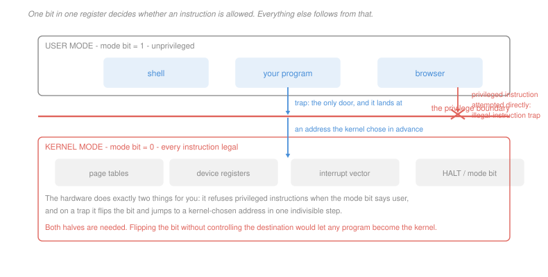

# Operating Systems · Lesson 1.1: Why an OS? Kernel and user mode

> ⏱ ~15 min · Module 1: Processes, threads and scheduling · Builds on: [`computer-architecture` 1.1 (the ISA contract)](../../computer-architecture/lessons/01-01-isa-contract-stored-program.md) · Unlocks: 1.2 (system calls), 1.3 (processes)

## Why this matters

You have spent [`computer-architecture`](../../computer-architecture/syllabus.md) building a machine that executes one instruction stream against one flat physical memory. Now run a browser, a compiler and a music player on it at once, on hardware none of them knew about, without any of them being able to read the others' passwords.

Nothing in the hardware provides that. A CPU will happily execute a store to any address, including one belonging to another program. The operating system is the software that turns the machine you built into the machine every program pretends it has: private memory, its own processor, named files.

The whole subject rests on one hardware feature, and it is smaller than you would expect. **One bit in one register** decides which instructions are legal. Everything else — processes, files, isolation, security — is built on top of that bit and the trap that flips it.

## The idea

The problem is not that programs are malicious. It is that a program cannot be trusted with the machine even when it means well, because the machine has no way to take it back.

Suppose a program is allowed to write to the disk controller's registers directly. Then a buggy loop can overwrite the file system. Suppose it is allowed to disable interrupts. Then an infinite loop hangs the machine permanently, because the timer that would have interrupted it is off. Suppose it is allowed to edit page tables. Then "private memory" means nothing, since any program can map any physical page.

So the hardware refuses. It keeps a **mode bit**, and a set of instructions that only execute when that bit says *kernel*. A user program that attempts one does not get an error code; it gets a trap, and the kernel decides what happens next.

But refusing is only half of it. Programs genuinely do need to read files and send packets, and they cannot do that without touching privileged state. So there must be a door. The trick — the single design idea that makes all of this work — is that the door is **controlled at both ends**:

> Crossing into kernel mode and choosing where you land are the *same indivisible hardware step*, and the destination was chosen by the kernel in advance.

A program can request the kernel's help. It cannot request to *become* the kernel, because it never gets to pick the address it arrives at.

## The formal version

> **Dual-mode operation.** The processor carries a mode bit $m \in \{\text{user}, \text{kernel}\}$. The instruction set is partitioned into unprivileged instructions, legal in both modes, and **privileged** instructions, legal only when $m = \text{kernel}$. Executing a privileged instruction while $m = \text{user}$ raises a trap instead of executing it.

In words: the same instruction either works or explodes, depending on one bit you cannot set yourself.

> **Trap.** A synchronous transfer of control caused by the currently executing instruction. In one indivisible step the hardware saves the interrupted program counter, sets $m \leftarrow \text{kernel}$, and jumps to a fixed address held in a **trap vector** that only kernel-mode code can write.

In words: something goes wrong (or you asked it to), and control lands somewhere the kernel picked, with full privileges.

Traps come in three flavours, and the distinction matters for the rest of the course:

| kind | caused by | example | resumes? |
|---|---|---|---|
| **exception** | a fault in the instruction | invalid address, divide by zero | sometimes |
| **system call** | the program asking, deliberately | `read`, `fork` | yes |
| **interrupt** | a device, asynchronously | timer, disk completion | yes |

An **interrupt** is the odd one out: it is not caused by the running instruction at all, and could arrive between any two instructions. It is also the mechanism that makes the OS a *resource manager* rather than a library. The kernel programs a timer to interrupt in a few milliseconds before handing the CPU to a program. That is the only reason a program cannot keep the CPU forever, and every scheduling policy in [1.5](01-05-cpu-scheduling.md) depends on it.

Two roles the OS plays, and they pull in different directions:

- **Abstraction.** Turn a disk into files, RAM into address spaces, the CPU into processes. Make the machine pleasant.
- **Protection and arbitration.** Decide who gets what, and stop anyone taking more. Make the machine fair and safe.

The tension between them is a recurring theme. Every abstraction that makes programming easier costs something to enforce, and the cost is usually a trap.

## Picture

## Worked examples

**Example 1 — which instructions must be privileged.** Take a candidate list and ask, for each: *if a user program could do this, what invariant breaks?*

| operation | privileged? | what breaks otherwise |
|---|---|---|
| add two registers | no | nothing — it touches only your own registers |
| load from address `0x4000` | no | the *address* is checked by translation, not the instruction |
| write the page-table root register | **yes** | you could map any physical page and read any process's memory |
| disable interrupts | **yes** | the timer never fires and you own the CPU forever |
| write to a disk controller register | **yes** | you could rewrite any file, ignoring every permission |
| set the mode bit to kernel | **yes** | trivially — this is the whole boundary |

Notice the second row. Loading from an address is *not* privileged, and this surprises people. The protection there is not "may you execute a load" but "does this address translate for you" — a different mechanism entirely, which is Module 3's subject. **Privilege and memory protection are two separate defences**, and confusing them is the most common mental-model error in this course.

**Example 2 — why a static check cannot replace the mode bit.** A tempting alternative: scan every program before running it, reject any that contains a privileged instruction, and skip the hardware entirely. Then no mode bit is needed.

It fails, and it fails three times over.

1. **Self-modifying code.** The program writes new bytes into its own text region and jumps there. Nothing you scanned is what runs. Every just-in-time compiler does exactly this, legitimately.
2. **Instruction boundaries are not fixed on a variable-length ISA.** On x86, jumping into the *middle* of a long instruction decodes a different instruction from the one your scanner saw. The privileged instruction was never in your listing.
3. **It is undecidable in general.** "Does this program ever execute instruction $I$?" is a non-trivial semantic property of the program's behaviour, which [`theory-of-computation` 4.3](../../theory-of-computation/lessons/04-03-rices-theorem-and-more-undecidable-problems.md) proves cannot be decided by any algorithm. Any sound static checker must reject some safe programs.

The hardware check has none of these problems, because it happens at the moment of execution on the bytes actually being executed. This is a pattern worth naming: **enforce at use, not at inspection.** It reappears for memory protection, for file permissions, and for capabilities.

## Watch out

- **You might think the kernel is "always running", supervising programs.** It is not. The kernel is code that runs *on the same CPU*, only when a trap or interrupt hands control to it. Between your system calls, the kernel is not executing at all. It is a library with a privilege boundary and a timer, not a supervisor process.
- **You might think user mode means "can do less useful work".** Almost all instructions — arithmetic, loads, stores, branches — are unprivileged. The privileged set is tiny, and every one of its members touches state that is *global to the machine* rather than local to a program. That is the actual criterion.
- **You might think a trap is an error.** Two of the three kinds are completely routine. A system call is a trap you asked for, and a page fault ([3.3](03-03-demand-paging-and-page-faults.md)) is a trap that means the system is working as designed.

## One-liner

> One bit decides which instructions are legal, and the only way to flip it is an indivisible hardware step that lands at an address the kernel chose in advance — request the kernel's help, never its privileges.

## Problems

**P1 (🟢)** For each operation, state privileged or unprivileged, and in one clause name the invariant that breaks if a user program could do it: (a) `fork` a new process; (b) read the current time from a register the hardware exposes read-only; (c) install a new entry in the trap vector; (d) branch to an address in your own code; (e) flush the entire TLB; (f) execute a floating-point divide that overflows.

**P2 (🟡)** A machine runs at 2 GHz. A trap round trip costs 900 cycles of pure overhead. A program processes 40,000 network messages, and the design under review does one system call per message. (a) Give the total overhead in milliseconds and as a percentage, if the useful work per message is 3,000 cycles. (b) The design is changed to batch 64 messages per call, with the batching adding 200 cycles of useful work per message. Give the new overhead percentage. (c) State the batch size at which further batching buys less than one percentage point.

**P3 (🔴, optional)** A colleague proposes removing the mode bit and instead having the compiler emit a check before every store, verifying the target address is inside the program's own region. Assume the compiler is correct. Give the concrete attack that defeats this and the one-sentence reason a *sound static* alternative cannot exist either. Then state which of the three trap kinds in this lesson the scheme could not implement at all, and why.

Solutions

**P1**

| | verdict | invariant that breaks |
|---|---|---|
| (a) `fork` | **unprivileged instruction, privileged action** | `fork` is not an instruction at all — it is a system call, so the *request* is unprivileged and the work happens in kernel mode. Creating a process requires allocating a PCB and page tables, which are kernel state. |
| (b) read a read-only time register | unprivileged | nothing — the register is global but *readable* only, so no other program's state can be altered or observed. This is exactly why such registers exist. |
| (c) install a trap-vector entry | **privileged** | the destination of a trap would no longer be kernel-chosen, so any program could arrange to arrive in kernel mode at code it wrote. This is the boundary itself. |
| (d) branch within your own code | unprivileged | nothing — the target still translates through your own address space, so it can only reach your own pages. |
| (e) flush the TLB | **privileged** | the TLB is machine-global. Flushing it is a denial-of-service against every other process, and on machines where entries can be *inserted* rather than only flushed, it would let you forge translations. |
| (f) a floating-point divide that overflows | unprivileged | nothing — it raises an exception (a trap), but the *instruction* is legal in user mode. Faulting is not the same as being privileged. |

The point of (a) and (f) together: "privileged" is a property of an instruction, not of an operation's importance or of whether it can trap.

**P2** *(a) Overhead with one call per message.*
$$\text{overhead} = 40{,}000 \times 900 = 36{,}000{,}000 \text{ cycles} = \frac{3.6\times10^7}{2\times 10^9}\text{ s} = \boxed{18 \text{ ms}}$$
$$\text{useful} = 40{,}000\times 3{,}000 = 1.2\times 10^8 \text{ cycles}, \qquad \text{fraction} = \frac{3.6\times 10^7}{3.6\times 10^7 + 1.2\times 10^8} = \boxed{23.1\%}$$

*(b) Batching 64 per call.* Now there are $40{,}000/64 = 625$ calls, and useful work per message rises to 3,200 cycles:
$$\text{overhead} = 625\times 900 = 562{,}500 \text{ cycles}, \qquad \text{useful} = 40{,}000\times 3{,}200 = 1.28\times 10^8$$
$$\text{fraction} = \frac{562{,}500}{562{,}500 + 1.28\times 10^8} = \boxed{0.44\%}$$

*(c) Diminishing returns.* With batch size $b$, the overhead fraction is
$$g(b) = \frac{(40{,}000/b)\,900}{(40{,}000/b)\,900 + 1.28\times 10^8} = \frac{900/b}{900/b + 3200} = \frac{900}{900 + 3200\,b}$$
Doubling from $b$ to $2b$ gains $g(b) - g(2b)$, and we want that below one percentage point:
$$g(1) = 21.9\%,\quad g(2)=12.3\%,\quad g(4)=6.6\%,\quad g(8)=3.4\%,\quad g(16)=1.73\%,\quad g(32)=0.87\%$$
The gain from 16 to 32 is $1.73 - 0.87 = 0.86$ points, below one. So **batching past about 16 is already buying less than a point per doubling**, and the jump to 64 in part (b) was mostly ceremony.

That is the real lesson, and it generalises: system-call overhead falls like $1/b$, so nearly all of the available win arrives in the first few doublings. Buffered I/O uses a 4 KiB or 64 KiB buffer for this reason and not a larger one.

**P3** *The attack.* Compile-time checks live in the emitted code, and the program controls what code executes. **Jump past the check** — construct a computed branch (or a return address written onto the stack) whose target is the store instruction itself rather than the check preceding it. The check is still in the binary, exactly as the compiler emitted it, and never executes. On a variable-length ISA you can go further and jump into the middle of an instruction to synthesise a store that appears nowhere in the listing.

*Why no sound static alternative exists.* Deciding whether a program ever performs an out-of-region store is a non-trivial semantic property of its behaviour, and by [`theory-of-computation` 4.3](../../theory-of-computation/lessons/04-03-rices-theorem-and-more-undecidable-problems.md) no algorithm decides such a property for all programs — so any checker that never accepts a bad program must reject some good ones.

*Which trap kind it cannot implement.* **Interrupts.** Exceptions and system calls are both synchronous — caused by an instruction the compiler could in principle have instrumented. An interrupt arrives from a device at a moment unrelated to the instruction stream, so there is no instruction to place a check before. Without interrupts there is no timer, and without a timer the OS can never take the CPU back from a loop. The scheme cannot be preemptive at all, which alone disqualifies it.

## Connections

- **Backward:** [`computer-architecture` 1.1](../../computer-architecture/lessons/01-01-isa-contract-stored-program.md) presented the ISA as a contract between hardware and software. The mode bit is the clause of that contract reserving part of the instruction set for one particular piece of software, and the trap vector is how that software registers itself.
- **Forward:** [1.2](01-02-system-calls-and-the-kernel-interface.md) walks the trap path in detail and prices it. The timer interrupt introduced here is what makes preemptive scheduling possible in [1.5](01-05-cpu-scheduling.md), and the privileged status of the page-table register is what makes address spaces trustworthy in [3.2](03-02-paging-and-the-os-page-table.md).
- **Sideways:** the impossibility argument in Example 2 is [`theory-of-computation` 4.3](../../theory-of-computation/lessons/04-03-rices-theorem-and-more-undecidable-problems.md) applied to systems design, and it is a good illustration of why undecidability is a practical result rather than a curiosity. It is the reason security is enforced by hardware at run time rather than by analysis at build time.
