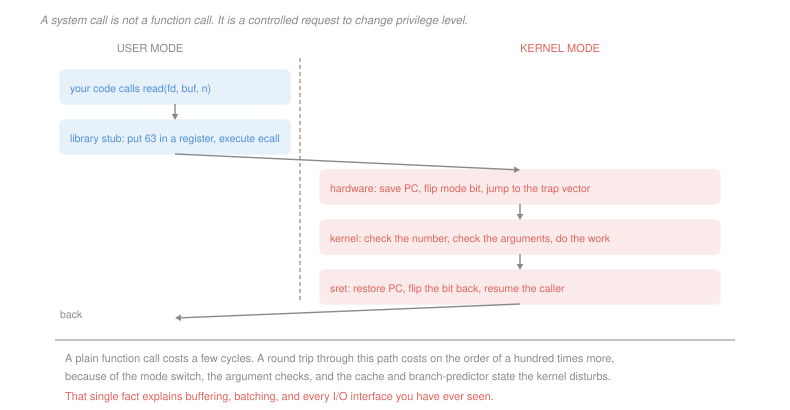

# Operating Systems · Lesson 1.2: System calls and the kernel interface

> ⏱ ~15 min · Module 1: Processes, threads and scheduling · Builds on: [1.1 (kernel and user mode)](01-01-why-an-os-kernel-and-user-mode.md) · Unlocks: 1.3 (processes), 1.4 (threads), 4.4 (I/O)

## Why this matters

Every interesting thing a program does — open a file, send a packet, allocate memory, start another program — is a system call. There are only a few hundred of them, and they are the entire vocabulary in which a program can talk to the world.

They are also expensive in a way that ordinary function calls are not, by roughly two orders of magnitude, and that single fact has shaped every I/O library you have ever used. Buffered writes, `sendfile`, memory-mapped files, `io_uring`, the reason nobody writes a byte at a time — all of it is people arranging to cross this boundary less often.

So the goal here is not to memorise a call list. It is to be able to price the boundary, and to look at an interface and see how many crossings it costs.

## The idea

In your source code, `read(fd, buf, n)` looks exactly like any other function call. It is not one, and the difference is worth being precise about.

An ordinary call jumps to an address in your own address space, in your own privilege mode, with your own stack. The callee is code you could have written yourself.

A system call cannot do any of that, because the code that does the work is not in your address space at all, and running it requires privileges you do not have. What actually happens is closer to *filing a request at a counter*:

1. Put a number in an agreed register saying which service you want, and the arguments in other agreed registers.
2. Execute a single unprivileged instruction whose only job is to raise a trap (`ecall` on RISC-V, `syscall` on x86-64).
3. The hardware flips the mode bit and jumps to the kernel's trap handler — the indivisible step from [1.1](01-01-why-an-os-kernel-and-user-mode.md).
4. The kernel looks the number up in a table, **checks every argument**, and does the work.
5. A return instruction restores the mode bit and the saved program counter, and you resume as if from a function call.

The library function named `read` in your program is a thin **stub** that does steps 1 and 2 and nothing else. You call the stub normally; the stub does the crossing.

The argument checking in step 4 is not a formality. Every argument came from an untrusted program, and the kernel is running with full privileges — so a pointer you passed must be verified to lie in *your* address space before the kernel dereferences it, or you could hand the kernel an address in the kernel's own memory and have it fill that buffer for you.

## The formal version

> **System call.** A synchronous, deliberate trap that requests a kernel service. Its interface is a **call number** plus a fixed argument convention, and it returns a value plus an error indication.

In words: a function call to code you are not allowed to jump to, arranged through hardware.

Two words that get used interchangeably and should not be:

> **API** — the source-level interface a programmer writes against: names, types, semantics. `read(int fd, void *buf, size_t n)`.
>
> **ABI** — the binary-level agreement: which register holds the call number, which registers hold arguments, how a struct is laid out, how errors are signalled.

In words: the API is what you compile against; the ABI is what the compiled bytes assume. A change to the API breaks *source* compatibility, which you fix by recompiling. A change to the ABI breaks *already-compiled binaries*, which you cannot fix at all. This is why the Linux syscall ABI is essentially frozen: the kernel maintainers can change any internal structure they like, but call number 63 must mean `read` forever.

**Where the cost comes from.** A syscall round trip is expensive for four separate reasons, and only the first is obvious:

| source | roughly |
|---|---|
| the mode switch and register save/restore | tens of cycles |
| argument validation and table dispatch | tens of cycles |
| pipeline drain and branch-predictor pollution | tens to hundreds |
| cache and TLB footprint disturbed by kernel code | hundreds, paid *after* you return |

The last row is the sneaky one. The kernel's own code and data evict yours from the caches, so your program runs slower for a while *after* the call returns. This is why measured syscall costs are far larger than the mode switch alone, typically a few hundred to a couple of thousand cycles.

## Picture

## Worked examples

**Example 1 — pricing a naive loop.** A program copies a 1 MiB file by reading one byte and writing one byte at a time. Take a 1,500-cycle syscall round trip on a 2 GHz machine.

$$\text{calls} = 2 \times 1{,}048{,}576 = 2{,}097{,}152, \qquad \text{cycles} = 2{,}097{,}152 \times 1{,}500 \approx 3.15\times 10^9$$
$$t = \frac{3.15\times 10^9}{2\times 10^9} \approx 1.57 \text{ s}$$

A second and a half to copy a megabyte, with the disk playing no part in it. Now use a 4 KiB buffer:

$$\text{calls} = 2\times \frac{1{,}048{,}576}{4096} = 512, \qquad \text{cycles} = 512\times 1{,}500 = 768{,}000 \approx 0.38 \text{ ms}$$

A factor of **4,096**, exactly the buffer size, because syscall count falls like $1/b$. This is what a buffered I/O library is for, and it is why `printf` does not write to the terminal when you call it.

**Example 2 — an interface with a crossing built into it.** Serving a file over a socket the obvious way is: `read` from the file into a user buffer, `write` that buffer to the socket. For a 64 KiB chunk that is two syscalls, and — worse — the data is copied twice, kernel to user and user back to kernel.

`sendfile(out_fd, in_fd, offset, count)` asks the kernel to move it directly:

| | syscalls per 64 KiB | copies |
|---|---|---|
| read + write | 2 | 2 |
| `sendfile` | 1 | 0, the kernel hands the socket the same pages |

Serving a 1 GiB file in 64 KiB chunks, that is 32,768 calls against 16,384, and roughly 2 GiB of memory traffic avoided. **The interface was redesigned to remove a boundary crossing that carried no information** — the user process never looked at the bytes.

That is the design move worth internalising. When you see an interface that seems oddly specific (`sendfile`, `writev`, `io_uring`, `mmap`), it usually exists because someone counted crossings.

## Watch out

- **You might think the syscall number is the API.** It is the ABI. The number 63 meaning `read` is an unbreakable binary promise, while the C function `read` is a library convenience that could in principle be renamed. Programs almost never execute `ecall` themselves; they call the stub.
- **You might think the kernel can just dereference a pointer you passed.** It must not. The kernel runs with full privileges, so an unchecked user pointer is a request to read or write arbitrary memory *with those privileges*. Every real kernel has dedicated copy-in and copy-out routines for exactly this, and bugs in them are among the most severe there are.
- **You might think a failed syscall is a trap that kills you.** No — a system call that fails returns an error code, like any function. The trap is the *mechanism of the call*, not a signal that something went wrong.

## One-liner

> A system call is a request filed across a hardware privilege boundary, costing a few hundred to a couple of thousand cycles, and nearly every I/O interface you have ever used is an arrangement for crossing that boundary fewer times.

## Problems

**P1 (🟢)** Put these seven events in the order they occur during one `write` call, and mark each U (executes in user mode) or K (kernel mode): (i) the kernel validates that `buf` lies in the caller's address space; (ii) the hardware sets the mode bit to kernel; (iii) the library stub places the call number in a register; (iv) the kernel dispatches through the syscall table; (v) `sret` restores the saved program counter; (vi) your code calls `write(fd, buf, n)`; (vii) the hardware saves the program counter and jumps to the trap vector.

**P2 (🟡)** A logging library writes 200-byte records with one `write` call each. Syscall round trip 1,200 cycles, 3 GHz, and the program produces 500,000 records. (a) Give the time spent in syscall overhead. (b) The library is changed to buffer records and flush every 8 KiB. Give the number of calls and the new overhead. (c) A reviewer proposes flushing every 1 MiB instead. Give the further time saved, and state the non-performance reason this is usually the wrong trade.

**P3 (🔴, optional)** Some calls can be served entirely in user mode by mapping a kernel-maintained page read-only into every process, so the "call" is just a memory read. For each of these five, say whether that trick can work, and then state in one sentence the property shared by the ones that can: (a) `gettimeofday`; (b) `getpid`; (c) `read`; (d) `getuid`; (e) `fork`. Then give one concrete circumstance in which applying the trick to (b) would return a wrong answer.

Solutions

**P1** The order is **vi, iii, ii and vii together, i, iv, v**, with modes:

| # | event | mode |
|---|---|---|
| 1 | (vi) your code calls `write(fd, buf, n)` | U |
| 2 | (iii) the stub places the call number in a register | U |
| 3 | (vii) the hardware saves the PC and jumps to the trap vector | — |
| 4 | (ii) the hardware sets the mode bit to kernel | — |
| 5 | (i) the kernel validates that `buf` lies in the caller's address space | K |
| 6 | (iv) the kernel dispatches through the syscall table | K |
| 7 | (v) `sret` restores the saved program counter | K, returning to U |

Two things worth pinning down. Events (ii) and (vii) are **one indivisible hardware step**, not two — separating them is precisely the vulnerability [1.1](01-01-why-an-os-kernel-and-user-mode.md) described, since a program that could flip the bit and then choose where to land would be the kernel. And note that validation (i) comes *before* dispatch (iv) in real kernels: you check the call number is in range before indexing the table with it, or an out-of-range number is an arbitrary jump with full privileges.

**P2** *(a) One call per record.*
$$500{,}000\times 1{,}200 = 6\times 10^8 \text{ cycles} = \frac{6\times 10^8}{3\times 10^9} = \boxed{0.20 \text{ s}}$$

*(b) Buffering to 8 KiB.* Records per flush:
$$\left\lfloor \frac{8192}{200}\right\rfloor = 40 \text{ records}, \qquad \text{calls} = \frac{500{,}000}{40} = 12{,}500$$
$$12{,}500\times 1{,}200 = 1.5\times 10^7 \text{ cycles} = \boxed{5.0 \text{ ms}}$$
A 40-fold reduction, matching the records-per-call figure exactly.

*(c) Flushing every 1 MiB.*
$$\left\lfloor\frac{1{,}048{,}576}{200}\right\rfloor = 5{,}242 \text{ records per flush}, \qquad \text{calls} = \left\lceil\frac{500{,}000}{5{,}242}\right\rceil = 96$$
$$96\times 1{,}200 = 115{,}200 \text{ cycles} = 0.038 \text{ ms}, \qquad \text{saving} = 5.0 - 0.04 = \boxed{\approx 4.96 \text{ ms}}$$

Five milliseconds out of a program that presumably runs for many seconds — a rounding error. And the cost is real: **up to 1 MiB of log records are lost if the process crashes**, which is exactly when you want the log. Logging is durability-sensitive, so the sane design buffers a little and flushes on a timer or on severity, not a lot and flushes rarely. This is the same shape as P2 in [1.1](01-01-why-an-os-kernel-and-user-mode.md): the win from batching is nearly all collected in the first few doublings, so the last doublings buy almost nothing and pay full price in risk.

**P3**

| call | trick works? | why |
|---|---|---|
| (a) `gettimeofday` | **yes** | the kernel writes the current time into a shared page; reading it needs no privilege and no per-caller state |
| (b) `getpid` | **yes**, with care | the pid is fixed for the life of the process, so it can be placed in a per-process read-only page at creation |
| (c) `read` | no | it must touch a device or the buffer cache, both privileged, and it changes kernel state (the file offset) |
| (d) `getuid` | **yes**, with care | same shape as `getpid` — a small immutable-ish value the kernel can publish |
| (e) `fork` | no | it allocates a PCB and page tables; the entire point is an action only the kernel can perform |

*The shared property:* the calls that can skip the trap **only read a small piece of kernel-maintained state, perform no privileged action, and change nothing.** A trap is needed to *act*, not to *look* — so anything that is a pure read of publishable data can be turned into a memory read. Linux does exactly this with the vDSO.

*Where (b) goes wrong:* after `fork`. The child begins as a copy of the parent's address space, so a cached pid published in that page is the **parent's** pid, and the child would report the wrong one until the kernel intervenes. (The same hazard bites `getuid` after a `setuid` call, which changes the value the page was supposed to publish.) The fix is for the kernel to rewrite the page on process creation and on any call that changes the value — which is why this is called "with care" above, and why glibc's own pid cache was eventually removed as more trouble than the syscall it saved.

## Connections

- **Backward:** this is [1.1](01-01-why-an-os-kernel-and-user-mode.md)'s trap, used deliberately. The indivisibility of the mode flip and the jump is what makes it safe to expose a door at all, and the argument-validation step is where "the kernel does not trust user input" first becomes concrete.
- **Forward:** `fork` and `exec` in [1.3](01-03-processes-and-the-address-space.md) are system calls with unusually large effects. The cost model here sets up the I/O stack in [4.4](04-04-io-and-disk-scheduling.md), where buffering, readahead and the buffer cache all exist to reduce crossings.
- **Sideways:** the frozen-ABI problem is the same versioning problem as a network protocol or a database schema — once other people's compiled artefacts depend on your byte layout, you can add but never change. [`computer-architecture` 1.5](../../computer-architecture/lessons/01-05-procedures-stack-calling-convention.md) makes the same point about calling conventions, one level down.
