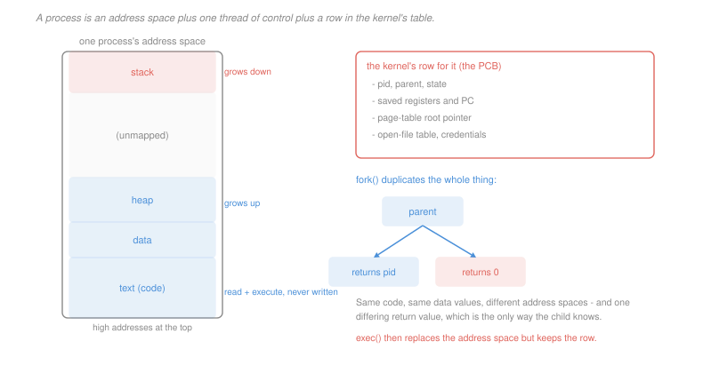

# Operating Systems · Lesson 1.3: Processes and the address space

> ⏱ ~15 min · Module 1: Processes, threads and scheduling · Builds on: [1.2 (system calls)](01-02-system-calls-and-the-kernel-interface.md), [`programming-foundations` 1.3 (the call stack)](../../programming-foundations/lessons/01-03-recursion-and-the-call-stack.md) · Unlocks: 1.4 (threads), 3.1 (address spaces)

## Why this matters

A process is the OS's unit of everything: of isolation, of scheduling, of accounting, of failure. When a program crashes, a process dies; when you check what is using your CPU, you are looking at processes.

It is also the first place where an abstraction stops matching the hardware. Your program believes it owns a contiguous memory from zero upward and a processor to itself. Neither is true, and the gap between the belief and the reality is the substance of this course.

The mechanism that creates processes is worth the attention on its own. Unix does it with a call that returns twice, which sounds like a defect and turns out to be one of the cleaner design decisions in systems software.

## The idea

Separate two things that beginners fuse together.

A **program** is bytes on disk: instructions and initial data. It is passive, and one program can back many processes.

A **process** is a program in execution: an address space holding its memory, a thread of control with a program counter and registers, and a row in a kernel table recording everything the kernel needs to know about it. It is active, and it has state that exists nowhere in the program file.

The address space is laid out in regions, and the layout is not arbitrary:

- **Text** — the instructions. Read and execute, never write. Shared between every process running the same program, because identical read-only pages need only one physical copy.
- **Data** — initialised globals, fixed size, known at compile time.
- **Heap** — dynamically allocated memory, grows *upward* on request.
- **Stack** — call frames, exactly the structure from [`programming-foundations` 1.3](../../programming-foundations/lessons/01-03-recursion-and-the-call-stack.md), grows *downward* as calls nest.

Heap and stack grow toward each other from opposite ends of a large unmapped gap. That is the reason for the layout: two regions whose sizes are unknown in advance share one pool of space, and neither has to be sized up front.

The kernel's row for the process is the **process control block**. It holds the pid and parent pid, the process state, the saved registers and program counter (written there on every context switch), the page-table root pointer, the open-file table, and the credentials. Everything the kernel knows about a process lives here, and *nothing* in it is visible to the process itself except through system calls.

## The formal version

> **Process states.** A process is in exactly one of: **running** (on a CPU now), **ready** (runnable, waiting for a CPU), or **blocked** (waiting for an event — I/O completion, a lock, a child exiting). Plus **new** and **terminated** at the ends.

In words: you are either using a CPU, waiting for one, or waiting for something that is not a CPU.

The distinction between ready and blocked carries the whole weight of scheduling. A ready process is competing for a resource the scheduler controls. A blocked process is not competing at all, and giving it a CPU would be useless — which is why an I/O-bound program can be "slow" while using almost no CPU.

> **`fork()`.** Creates a new process that is a copy of the caller: same code, same data *values*, same open files. It returns **twice** — the child's pid in the parent, and $0$ in the child.
>
> **`exec(path)`.** Replaces the current process's address space with a new program, keeping the pid, the open files and the PCB row. It does not return on success, because there is nothing to return to.

In words: `fork` duplicates a process; `exec` replaces its contents. Separately.

Why separate? Because the interval between them is the only moment when you have a process that is *yours to configure* but is not yet running the new program. Everything a shell does — redirecting output to a file, setting up a pipe, dropping privileges, changing directory — happens in that gap, using the ordinary calls the child already has, with no need for a `spawn` call carrying twenty options. One general mechanism instead of a growing pile of special cases.

The obvious objection is cost: copying an entire address space only to throw it away at `exec` is absurd. The answer is **copy-on-write**. `fork` copies the page tables, not the pages, and marks every writable page read-only in both processes. A write then traps, and the kernel makes a private copy of just that page and resumes. Pages that are never written are never copied, and a `fork` followed immediately by `exec` copies almost nothing.

## Picture



## Worked examples

**Example 1 — counting processes.** How many processes exist after this runs, and how many lines are printed?

```
fork();
fork();
print("hello");
```

Start with one process. The first `fork` makes it two; both continue to the second `fork`, which makes each of them two, so four. All four reach the print.

$$\text{processes} = 2^2 = 4, \qquad \text{lines} = 4$$

The rule generalises: $n$ unconditional forks in a straight line give $2^n$ processes. What makes these problems interesting is that real code puts the forks inside conditionals, so the tree is not balanced, and you have to track *which* processes reach each call.

**Example 2 — copy-on-write accounting.** A process occupies 800 pages: 300 of read-only text and 500 of writable data and heap. It forks, and the child then writes to 12 distinct data pages before calling `exec`.

*At the instant of the fork:* zero pages are copied. The kernel builds a second page table (a few pages of its own) and marks all 500 writable pages read-only in both processes. Physical pages in use: still **800**.

*During the child's 12 writes:* each write hits a read-only mapping and traps. The kernel sees the page is marked copy-on-write and shared, allocates a fresh page, copies 4 KiB, and remaps it writable in the child.

$$\text{copy-on-write faults} = 12, \qquad \text{new physical pages} = 12, \qquad \text{total} = 812$$

Against an eager copy, which would have used 1,600 pages and copied 3.2 MiB. And every one of those 12 copies is *wasted* anyway, since `exec` is about to discard the whole address space — which is why the well-behaved thing to do between `fork` and `exec` is as little as possible.

## Watch out

- **You might think the child continues from the top of `main`.** It does not. The child resumes at exactly the instruction after `fork`, with the same stack, the same open files and the same variable values as the parent. The *only* difference in the entire process is the return value.
- **You might think copy-on-write is a memory optimisation.** It is that, but the reason it is essential is latency: `fork` becomes an $O(\text{page table})$ operation instead of $O(\text{address space})$, so forking a process using 4 GiB takes about as long as forking one using 4 MiB.
- **You might think the heap grows because you called `malloc`.** `malloc` is a library function that hands out pieces of a region it already owns. It calls the kernel (`brk` or `mmap`) only when it runs out, which is why most allocations cost no system call at all — the same crossing-avoidance from [1.2](01-02-system-calls-and-the-kernel-interface.md).

## One-liner

> A process is an address space plus a thread of control plus a row in the kernel's table, and Unix creates one by duplicating an existing process and then overwriting it — a two-step dance whose gap is where every configuration decision gets made.

## Problems

**P1 (🟢)** How many processes execute the print, and what is the height of the resulting process tree, counting the original as height 0?

```
a = fork();
if (a == 0) { fork(); }
fork();
print("x");
```

**P2 (🟡)** A process holds 5,000 resident pages: 3,800 read-only (text and shared libraries) and 1,200 writable. It forks. The child then writes to 40 distinct writable pages and the parent writes to 15, of which 10 are pages the child had already written. (a) Give the number of copy-on-write faults that result in an actual page copy. (b) Give the total physical pages in use afterwards. (c) Give the ratio against an eager-copy `fork`, and state which of the two numbers in the problem would have to change to make eager copying competitive.

**P3 (🔴, optional)** A process opens an empty file for writing, then forks; the parent writes the four bytes `BBBB` and the child writes `AAAA`, with no synchronisation. (a) Give the possible final file contents and the file's length. (b) Now suppose instead that each process calls `open` on the same path *itself*, after the fork, and then writes. Give the possible contents and length now. (c) Name the piece of kernel state whose sharing explains the difference between (a) and (b).

<details>
<summary>Solutions</summary>

**P1** Track the population line by line.

| after | processes | how |
|---|---|---|
| `a = fork()` | 2 | original P0, child C1 |
| `if (a == 0) fork()` | 3 | only C1 has `a == 0`, so only C1 forks, producing C2 |
| `fork()` | **6** | all three of P0, C1, C2 fork |

So **6 processes print**.

*Tree height.* P0 is at height 0. C1 and P0's last-line child are its children, height 1. C2 is C1's child, height 2, and C1's last-line child is also height 2. C2's last-line child is height **3**.

$$\text{processes} = 6, \qquad \text{height} = 3$$

The trap to avoid is multiplying $2^3 = 8$. The second `fork` is executed by one process, not by all of them, so the tree is unbalanced and the count is not a power of two.

**P2** *(a) Faults that copy.* The child writes 40 pages; each is shared at the time, so each copies.

The parent's 15 writes are the interesting part. For the 10 pages the child already copied, the child took a private copy and left the parent as the **sole owner** of the original — so the parent's write finds a page shared with nobody, and the kernel simply restores write permission with no copy. Only the parent's other 5 pages are still shared and must copy.

$$\text{copies} = 40 + (15 - 10) = \boxed{45}$$

(All 55 writes still take a trap; 45 of them allocate. Distinguishing "faulted" from "copied" is the whole point of the problem.)

*(b) Physical pages afterwards.*
$$5{,}000 + 45 = \boxed{5{,}045}$$
The 3,800 read-only pages are never copied at all — they are shared permanently, which is why running twenty copies of the same program costs one copy of its text.

*(c) Against eager copy.* An eager `fork` would duplicate everything writable and share nothing:
$$5{,}000 + 1{,}200 = 6{,}200 \text{ pages}, \qquad \frac{6{,}200}{5{,}045} = \boxed{1.23\times}$$

Modest, and that is the honest answer here — copy-on-write's memory win in this instance is only 23 percent, because 5,000 pages were resident and only 1,200 were ever at risk of duplication.

*What would have to change:* the **fraction of writable pages actually written**. Copy-on-write wins big when that fraction is small (the `fork`-then-`exec` case, where it is near zero) and wins nothing when it is near one. If the child were going to write all 1,200 writable pages, eager copying would use the same memory and avoid 1,200 traps, making it strictly better. Copy-on-write is a bet that most shared pages stay unwritten, and the bet is only good because `fork`-then-`exec` is the overwhelmingly common case.

**P3** *Accept criterion for (a) and (b): the length must be exact, and the set of possible contents must be complete — an answer giving only one of the two orderings in (a) is incomplete.*

*(a) One `open`, then fork.* The file descriptor was created before the fork, so both processes refer to the **same open file description**, which holds the file offset. The two writes therefore land at different offsets:

$$\text{length} = 8, \qquad \text{contents} \in \{\texttt{AAAABBBB},\ \texttt{BBBBAAAA}\}$$

Which order depends on scheduling and is not determined. Both writes survive.

*(b) Each process opens the file itself.* Two separate `open` calls create two independent open file descriptions, each with its **own** offset starting at 0. Both writes go to offset 0:

$$\text{length} = 4, \qquad \text{contents} \in \{\texttt{AAAA},\ \texttt{BBBB}\}$$

One write is entirely lost — overwritten by the other, and which one is lost is again undetermined.

*(c) The shared state.* The **open file description**, and specifically the file offset it contains. A file descriptor is a small integer indexing a per-process table; the entry points at an open file description that can be shared. `fork` (and `dup`) share the description, so they share the offset; a fresh `open` creates a new one.

This is exactly why shell redirection works: `(cmd1; cmd2) > out` gives both commands descriptors onto one description, so their outputs append rather than overwrite. The same mechanism that makes P3(a) look like a race is what makes the shell's most-used feature behave sensibly.

</details>

## Flashback

**From Lesson 1.1 (kernel and user mode):** For each of these, say which of the three trap kinds results (exception, system call, interrupt) or state that no trap occurs: (a) a user program reads a hardware register that exposes the timer's current count, exposed read-only; (b) a user program writes that register to schedule an interrupt in 5 ms; (c) a user program stores to an address in the unmapped gap between its heap and stack; (d) the timer fires while the program is halfway through a long arithmetic loop.

<details>
<summary>Solution</summary>

(a) **No trap.** Reading a read-only global register is unprivileged — it exposes information but permits no action and changes nothing. This is precisely the property that made `gettimeofday` servable without a trap in [1.2](01-02-system-calls-and-the-kernel-interface.md) P3.

(b) **Exception**, specifically an illegal-instruction or privileged-instruction fault. Programming the timer is privileged, because a program that could postpone or disable the timer interrupt would never be preempted. The program does not get an error code; it traps, and the kernel typically kills it.

(c) **Exception** — a page fault on an address with no valid mapping, which the kernel turns into a segmentation fault. Note the mechanism is *not* the privilege check: the store instruction is perfectly legal in user mode. It is address translation that refuses, which is the separate second defence from [1.1](01-01-why-an-os-kernel-and-user-mode.md) Example 1.

(d) **Interrupt.** Asynchronous, unrelated to the instruction executing, and arriving between two instructions rather than being caused by one. This is the one trap kind the program cannot influence at all, and it is why the scheduler in [1.5](01-05-cpu-scheduling.md) can be preemptive.

The pattern across (b), (c) and (d): the same program, three different reasons control leaves it, two of which are its own fault and one of which is not.

</details>

## Connections

- **Backward:** the stack region is the call-frame discipline from [`programming-foundations` 1.3](../../programming-foundations/lessons/01-03-recursion-and-the-call-stack.md), now given an address range and a growth direction by the kernel. `fork` and `exec` are system calls in the sense of [1.2](01-02-system-calls-and-the-kernel-interface.md), unusual only in the size of their effects.
- **Forward:** [1.4](01-04-threads-and-concurrency.md) asks what happens when one address space carries several threads of control, which is where the sharing in this lesson becomes dangerous. Copy-on-write is a page-fault handler, so [3.3](03-03-demand-paging-and-page-faults.md) revisits it with the fault path in hand, and the open-file table returns in [4.1](04-01-files-directories-and-inodes.md).
- **Sideways:** copy-on-write is the systems version of persistent data structures — share until someone mutates, then copy only the touched part. The same idea underlies version control, database snapshots and functional data structures, and it is worth recognising as one idea rather than four.
