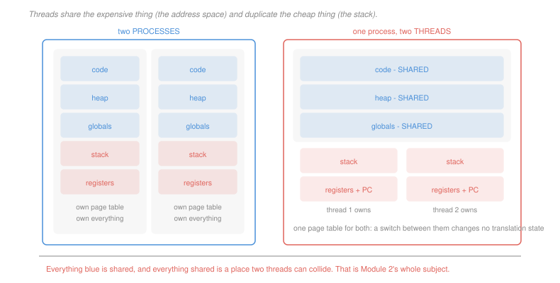

# Operating Systems · Lesson 1.4: Threads and concurrency

> ⏱ ~15 min · Module 1: Processes, threads and scheduling · Builds on: [1.3 (processes)](01-03-processes-and-the-address-space.md) · Unlocks: 1.5 (scheduling), 2.1 (race conditions)

## Why this matters

A process gives you isolation, which is exactly what you want between a browser and a compiler and exactly what you do not want between two parts of one program that need to work on the same data.

Threads are the answer: several independent flows of control inside one address space. They make it possible to keep a CPU busy while another part of the program waits for a disk, and to use eight cores on one problem.

They also introduce every bug in Module 2. The whole reason concurrency is hard is that threads share memory by default, and shared mutable state without discipline produces failures that are intermittent, unreproducible and invisible in the source. It is worth understanding precisely *what* is shared before meeting the consequences.

## The idea

Take the process from [1.3](01-03-processes-and-the-address-space.md) and split it in two along a specific seam. Everything that describes *where the program's data lives* stays shared. Everything that describes *where this flow of control currently is* gets duplicated.

| shared by all threads | private to each thread |
|---|---|
| text (code) | program counter |
| globals and static data | general-purpose registers |
| heap | stack |
| open file table | thread id, scheduling state |
| page table, address space | signal mask, errno |

The list on the left is why threads are useful — two threads can pass a data structure by pointer, with no copying and no system call. The list on the left is also why threads are dangerous, for exactly the same reason.

The stack is private because a call frame is a record of *this* flow of control's history, and two flows have different histories. Note what that implies: a pointer to a local variable is a pointer into one thread's stack, and handing it to another thread is legal, dangerous and a classic bug — the frame can vanish while the other thread still holds the pointer.

**Concurrency is not parallelism.** They get conflated constantly and they answer different questions:

- **Concurrency** is a structuring property: the program has several independent flows that *could* progress in any order. It is useful on a single core, because a flow that blocks on I/O yields to one that can run.
- **Parallelism** is an execution property: several flows are running *at the same instant*, which requires several cores.

A single-core machine can run a highly concurrent program with a large speedup, as long as the program spends time waiting. It cannot run anything in parallel. Getting this distinction right is what tells you whether adding threads to a program will help — and if the program is pure computation on one core, the answer is no, the threads will only add switching overhead.

## The formal version

> **Context switch.** Saving the current flow of control's registers and program counter into the kernel's record for it, then loading another's. The scheduler does this on every preemption and every block.

In words: the CPU's registers are a scarce resource, and switching means swapping their contents.

The cost is not the same for both kinds of switch, and the difference is the practical reason threads exist:

| switching between | must also do | typical direct cost |
|---|---|---|
| two threads of one process | nothing else — same page table | about 1 µs |
| two processes | install a new page-table root, and lose TLB entries | several µs, plus a slow recovery |

The indirect cost is larger than the direct one in both cases. After a switch the new flow finds the caches full of someone else's data, and warming them back up can cost far more than the register save itself. A switch between threads of the same process at least preserves the address space, so the caches and TLB entries that survive are still *valid* — after a process switch, translations for the old address space are worthless.

> **User-level vs kernel-level threads.** Kernel threads are known to the scheduler, so each can be placed on a different core and one blocking on I/O does not stop the others. User-level threads are managed by a library the kernel cannot see, so switching between them costs no trap at all — but the kernel schedules the *process*, so one thread blocking in a system call blocks every thread in it, and no two can run in parallel.

In words: user-level threads are cheap and cannot use more than one core; kernel threads cost a trap and are real. Modern systems use kernel threads, with hybrids reappearing whenever switching cost dominates — which is what a language runtime's "green threads", goroutines or async tasks are.

## Picture

## Worked examples

**Example 1 — when threads help on one core.** A program handles four requests. Each request needs 5 ms of CPU, then waits 20 ms for a disk, then needs 2 ms of CPU to finish.

*Single-threaded, one at a time:* each request takes $5 + 20 + 2 = 27$ ms, so four take $108$ ms. The CPU is idle for $4\times 20 = 80$ ms of that — 74 percent idle while the program is "busy".

*Four threads, still one core:* the four first phases run back to back, occupying the CPU from 0 to 20 ms. Thread 1's disk wait ends at $5 + 20 = 25$ ms, the CPU is free by then, and its final 2 ms run from 25 to 27. Thread 2 becomes ready at 30, thread 3 at 35, thread 4 at 40, each finding an idle core and needing 2 ms.

$$\text{makespan} = 40 + 2 = 42 \text{ ms}, \qquad \text{speedup} = \frac{108}{42} = 2.6\times$$

on a **single core**, purely from overlapping waiting with computing. No parallelism anywhere.

**Example 2 — pricing a switch.** A server performs 50,000 context switches per second. Direct cost is 1.2 µs for a thread switch and 4.0 µs for a process switch.

$$\text{threads: } 50{,}000\times 1.2\,\mu\text{s} = 0.06 \text{ s per second} = 6\%$$
$$\text{processes: } 50{,}000\times 4.0\,\mu\text{s} = 0.20 \text{ s per second} = 20\%$$

A fifth of the machine spent on bookkeeping. And this counts only the direct cost — the cache damage after a process switch typically doubles it.

The design consequence: **switch rate is a number you get to choose**, through the scheduling quantum ([1.5](01-05-cpu-scheduling.md)), through batching, and through picking threads over processes when isolation is not required.

## Watch out

- **You might think more threads means more speed.** For a CPU-bound program on $c$ cores, more than $c$ runnable threads adds switching cost and cache pressure and nothing else. Threads beyond the core count help only when threads *block*.
- **You might think each thread gets its own copy of a global.** It does not — globals are shared, and that is the source of most concurrency bugs. If you want per-thread state you must ask for it explicitly (thread-local storage), and `errno` is thread-local for exactly this reason.
- **You might think a thread crash is contained.** It is not. Threads share an address space, so a wild pointer in one corrupts another's data, and an unhandled fault takes down the whole process. Isolation is what processes are for; threads deliberately trade it away.

## One-liner

> Threads split a process along one seam — shared address space, private stack and registers — which is what makes them cheap to switch and useful for overlapping waiting, and what makes every piece of shared mutable state a hazard.

## Problems

**P1 (🟢)** For each item, say whether it is shared between two threads of one process or private to each: (a) the value of a global counter; (b) the return address of the currently executing function; (c) a `malloc`'d buffer whose pointer is stored in a global; (d) a file descriptor obtained by `open`; (e) the current program counter; (f) a local variable in a running function; (g) the page-table root pointer; (h) `errno`. Then name the one item on your "private" list whose privacy is a deliberate library decision rather than a hardware or address-space consequence.

**P2 (🟡)** A service performs 80,000 context switches per second. Thread switches cost 1.2 µs, process switches 4.0 µs, both direct cost only. (a) Give the overhead percentage for each design. (b) For each design, give the minimum useful work per switch, in microseconds, needed to hold overhead at or below 5 percent. (c) The team wants process isolation but only 5 percent overhead. Give the maximum switch rate that allows, and one design change that reaches it.

**P3 (🔴, optional)** Six requests arrive together. Each needs 3 ms of CPU, then waits 12 ms for the disk, then needs 1 ms of CPU. One core, six threads, and the ready queue is served first-come-first-served with no preemption inside a phase. (a) Give the completion time of the whole batch. (b) Give the speedup against handling the requests one at a time. (c) State the resource that limits (a), and give the batch size beyond which that limit binds.

Solutions

**P1**

| | verdict | why |
|---|---|---|
| (a) a global counter | **shared** | globals live in the data region, which is one region in one address space |
| (b) the current return address | **private** | it sits in the current call frame, and each thread has its own stack |
| (c) a heap buffer reachable from a global | **shared** | the heap is shared and so is the pointer; nothing about `malloc` makes memory private |
| (d) a file descriptor | **shared** | the open-file table belongs to the process, which is why one thread can close a descriptor another is using |
| (e) the program counter | **private** | it is the definition of "where this flow of control is" |
| (f) a local variable | **private** | on the thread's own stack — but its *address* can be passed to another thread, which is a bug waiting to happen |
| (g) the page-table root pointer | **shared** | one address space means one page table, which is exactly why a thread switch is cheap |
| (h) `errno` | **private** | see below |

*The deliberate one:* **`errno`**. Nothing about the address space makes it private — it is a global, and in the original C libraries it genuinely was one, which meant thread A's failed call could overwrite the error code thread B was about to read. Modern C libraries define `errno` as a macro expanding to a thread-local location. It is a library decision, retrofitted, and the fact that it had to be retrofitted is a good illustration of how much single-threaded design assumes.

**P2** *(a) Overhead at 80,000 switches per second.*
$$\text{threads: } 80{,}000\times 1.2\times 10^{-6} = 0.096 = \boxed{9.6\%}$$
$$\text{processes: } 80{,}000\times 4.0\times 10^{-6} = 0.32 = \boxed{32\%}$$

*(b) Useful work per switch for 5 percent overhead.* If each switch costs $c$ and is followed by $w$ of useful work, the overhead fraction is $c/(c+w)$, so
$$\frac{c}{c+w}\le 0.05 \;\Longleftrightarrow\; w \ge 19c$$
$$\text{threads: } w \ge 19(1.2) = \boxed{22.8\ \mu\text{s}} \qquad \text{processes: } w \ge 19(4.0) = \boxed{76\ \mu\text{s}}$$

*(c) Process isolation at 5 percent.* Overhead is $r\,c \le 0.05$ with $c = 4.0\ \mu$s:
$$r \le \frac{0.05}{4.0\times 10^{-6}} = \boxed{12{,}500 \text{ switches per second}}$$

That is a 6.4-fold reduction from 80,000, and the design change that gets there is **a longer scheduling quantum** — switch rate is directly set by how long each flow is allowed to run before preemption, which is [1.5](01-05-cpu-scheduling.md)'s central knob. Equivalently, from the other direction: batch the work so each switch is followed by 76 µs of useful work instead of the current 12.5 µs. Either way, note that the quantum increase costs response time, so the isolation is being bought with latency — which is the honest form of the trade.

**P3** *(a) Completion time.* Trace the core. All six threads run their 3 ms first phase back to back:

| interval (ms) | on the CPU |
|---|---|
| 0–3 | T1 |
| 3–6 | T2 |
| 6–9 | T3 |
| 9–12 | T4 |
| 12–15 | T5 |
| 15–18 | T6 |

T1's disk wait runs from 3 to 15, so T1 is ready at 15 — but the CPU is busy with T5 and T6 until 18. T2 is ready at 18, T3 at 21, T4 at 24, T5 at 27, T6 at 30.

| interval (ms) | on the CPU | note |
|---|---|---|
| 18–19 | T1 | was ready since 15, waiting on the queue |
| 19–20 | T2 | ready at exactly 18 |
| 20–21 | idle | T3 not ready until 21 |
| 21–22 | T3 | |
| 22–24 | idle | |
| 24–25 | T4 | |
| 27–28 | T5 | |
| 30–31 | T6 | |

$$\text{makespan} = \boxed{31 \text{ ms}}$$

*(b) Speedup.* One at a time, each request takes $3+12+1 = 16$ ms:
$$6\times 16 = 96 \text{ ms}, \qquad \text{speedup} = \frac{96}{31} = \boxed{3.10\times}$$

on one core, with no parallelism.

*(c) What limits it, and where the limit moves.* At six requests the makespan is set by the **last request's critical path**, not by the CPU: T6 cannot start its first phase until 15 ms because five threads are ahead of it, then owes $12+1 = 13$ ms of its own, giving $18 + 12 + 1 = 31$. The CPU did only $6\times 4 = 24$ ms of work in those 31 ms, so it was idle 23 percent of the time.

Total CPU demand for $n$ requests is $4n$ ms, and the critical path for the last one is $3n + 13$ ms. The CPU becomes the binding constraint when
$$4n \ge 3n + 13 \;\Longrightarrow\; n \ge 13$$

So from **13 requests onward** the core is saturated and the makespan is simply $4n$ ms — adding threads past that point buys nothing, because there is no idle CPU left to fill. That is the general shape: concurrency converts waiting into throughput only while there is waiting to convert.

## Flashback

**From Lesson 1.2 (system calls):** A program reads a 512 KiB file. Round trip 1,000 cycles on a 2.5 GHz machine. (a) Give the syscall overhead if it reads 128 bytes at a time. (b) Give it for 16 KiB at a time. (c) The program is changed to map the file into memory instead, so the bytes are reached by ordinary loads with no calls at all. State what replaces the syscall cost, and why the answer is not "nothing".

Solution

*(a) 128-byte reads.*
$$\text{calls} = \frac{524{,}288}{128} = 4{,}096, \qquad 4{,}096\times 1{,}000 = 4.096\times 10^6 \text{ cycles} = \frac{4.096\times 10^6}{2.5\times 10^9} = \boxed{1.64 \text{ ms}}$$

*(b) 16 KiB reads.*
$$\text{calls} = \frac{524{,}288}{16{,}384} = 32, \qquad 32\times 1{,}000 = 32{,}000 \text{ cycles} = \boxed{12.8\ \mu\text{s}}$$

A factor of 128, matching the ratio of the read sizes exactly — overhead falls like $1/b$.

*(c) What replaces it.* **Page faults.** Mapping the file makes every 4 KiB page arrive on its first touch through the fault handler, which is a trap into the kernel just as a system call is:
$$\frac{524{,}288}{4{,}096} = 128 \text{ pages, so at least 128 traps}$$

So the calls did not disappear — they changed shape, from 32 explicit ones to 128 implicit ones, and a fault is if anything more expensive than a `read` because it also involves address-space bookkeeping.

Mapping still often wins, for a reason that has nothing to do with trap count: it eliminates the **copy** from the kernel's buffer into the user's buffer, letting the program read the kernel's own pages. That is the same saving `sendfile` makes in [1.2](01-02-system-calls-and-the-kernel-interface.md) Example 2. The lesson is that "no system calls" in an interface description almost never means "no crossings" — it usually means the crossings moved somewhere less visible, which is a reason to measure rather than to assume.

## Connections

- **Backward:** a thread is the "one flow of control" half of the process definition in [1.3](01-03-processes-and-the-address-space.md), separated from the address-space half. Copy-on-write made `fork` cheap by sharing pages; threads take that to the limit by sharing all of them permanently.
- **Forward:** [1.5](01-05-cpu-scheduling.md) schedules these flows and sets the switch rate priced here. Everything in the shared column becomes a hazard in [2.1](02-01-race-conditions-and-critical-sections.md), and the cost of a blocking switch is what decides between spinning and sleeping in [2.2](02-02-locks-and-hardware-support.md).
- **Sideways:** the overlap analysis in Example 1 and P3 is a queueing question — a single server, work arriving in phases, and idle time that can be filled. [`operations-research` 4.2](../../operations-research/lessons/04-02-the-mm1-queue.md) gives the stochastic version, where the same intuition appears as utilisation and the same warning appears about saturation.
