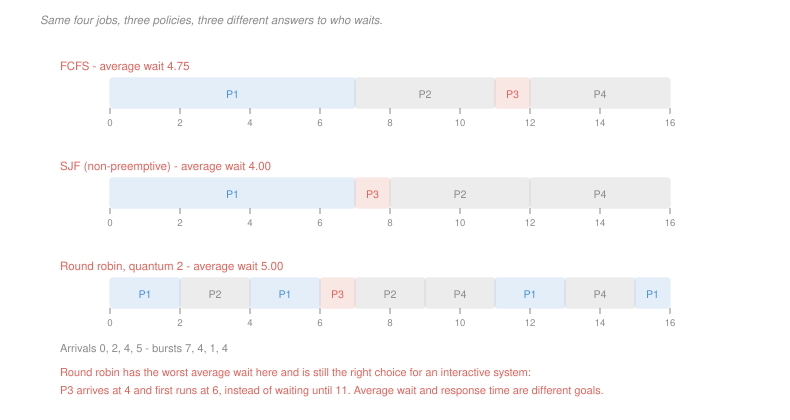

# Operating Systems · Lesson 1.5: CPU scheduling

> ⏱ ~15 min · Module 1: Processes, threads and scheduling · Builds on: [1.4 (threads)](01-04-threads-and-concurrency.md), [1.3 (process states)](01-03-processes-and-the-address-space.md) · Unlocks: 2.2 (locks), 3.3 (demand paging)

## Why this matters

Several flows are ready and there is one CPU. Somebody has to choose, and the choice is made thousands of times a second.

What makes this more than bookkeeping is that there is no single right answer, because the things you want conflict. Finishing the shortest job first minimises average waiting time and can make a long job wait forever. Giving everyone a fair slice keeps an interactive program responsive and makes the average worse. A policy is a position on that trade-off, not a solution to it.

This lesson is where the course first becomes quantitative, and the arithmetic is worth doing carefully — the numbers are how you tell a policy argument from a policy preference.

## The idea

The scheduler runs when a flow stops being *running*: it blocks, it exits, its quantum expires, or something with higher priority becomes ready. Its job is to pick a **ready** process (never a blocked one — [1.3](01-03-processes-and-the-address-space.md)) and hand it the CPU.

Three metrics, and they are not the same:

- **Turnaround time** — arrival to completion. What a batch job cares about.
- **Waiting time** — turnaround minus the CPU time it actually needed. Time spent sitting in the ready queue.
- **Response time** — arrival to *first* run. What an interactive user feels, because it is the delay before anything happens.

A policy can be excellent on one and terrible on another, which is the whole reason there are several policies:

**First come, first served.** Run jobs in arrival order to completion. Simple and fair in the queueing sense, and it has one pathology serious enough to have a name. The **convoy effect**: one long job at the front makes every short job behind it wait for its entire burst, so average waiting time is dominated by whoever happened to arrive first. Change nothing but the arrival order and the average can multiply.

**Shortest job first.** Run the shortest remaining burst first. It is *provably* optimal for average waiting time — a real theorem with a real hypothesis — and unusable, because burst lengths are not known in advance. Real schedulers estimate them from history, typically an exponential average $\tau_{n+1} = \alpha t_n + (1-\alpha)\tau_n$, which says "predict what it did last time, smoothed". It also starves long jobs whenever short ones keep arriving.

**Round robin.** Give each ready flow a fixed **quantum**, then preempt and move it to the back of the queue. Nobody waits more than $(n-1)q$ before their first run, which bounds response time — the property interactive systems actually need. The average waiting time is usually *worse* than either policy above, and that is the price.

**Priority, and its failure mode.** Run the highest priority first. Low-priority work can then be **starved** indefinitely. The standard repair is **aging**: raise a job's priority the longer it waits, so nothing waits forever.

**Multi-level feedback queues** combine these. Several queues at descending priority, round robin within each. A new job enters at the top; if it uses its whole quantum it is demoted, and if it blocks early it stays. The effect is that the scheduler *learns* which jobs are interactive without being told: an editor waiting on keystrokes never uses a full quantum and floats near the top, while a compiler sinks. Periodic promotion of everything to the top queue prevents starvation and handles jobs that change behaviour.

## The formal version

> **SJF optimality.** For a set of $n$ jobs **all available at time $0$**, scheduling them in non-decreasing order of burst length minimises the average waiting time over all non-preemptive schedules.

In words: with everything on the table at once, shortest-first is the best you can do.

The proof is a one-line exchange argument. If a schedule runs job $i$ immediately before job $j$ with $b_i > b_j$, swapping them leaves every other job's waiting time unchanged and reduces the total by $b_i - b_j > 0$. So any schedule not in sorted order can be improved, and the sorted one is optimal. (This is the exchange argument from [`algorithms` 2.1](../../algorithms/lessons/02-01-the-greedy-method-and-interval-scheduling.md), applied to a scheduling problem rather than an interval one.)

**The hypothesis is doing real work.** Drop "all available at time 0" and the theorem is false, as P3 makes concrete: a long job that arrives first will be run to completion by non-preemptive shortest-job-first, and short jobs arriving a moment later pay for all of it. With arrivals, the optimal policy is the *preemptive* version, shortest-remaining-time-first, which re-evaluates whenever a job arrives.

> **The quantum trade-off.** With $n$ ready flows, quantum $q$ and switch cost $s$:
> $$\text{worst response time} \approx (n-1)(q+s), \qquad \text{overhead fraction} = \frac{s}{q+s}$$

In words: a small quantum makes the system feel fast and wastes the CPU on switching; a large one is efficient and sluggish. The rule of thumb is to make the quantum large enough that the overhead is a couple of percent, and no larger — typically a few milliseconds against a switch cost of about a microsecond.

## Picture

## Worked examples

**Example 1 — the same four jobs, three policies.** Arrivals at 0, 2, 4, 5 with bursts 7, 4, 1, 4.

*FCFS.* Run in arrival order: P1 from 0 to 7, P2 to 11, P3 to 12, P4 to 16.

$$\text{waits} = 0,\;5,\;7,\;7 \quad\Rightarrow\quad \bar{w} = \frac{19}{4} = 4.75$$

*Non-preemptive SJF.* P1 is alone at time 0 so it runs to 7. At 7 the ready set is P2 (4), P3 (1), P4 (4), so P3 goes next, then P2, then P4.

$$\text{waits} = 0,\;6,\;3,\;7 \quad\Rightarrow\quad \bar{w} = \frac{16}{4} = 4.00$$

*Round robin, $q = 2$.* Slices run P1, P2, P1, P3, P2, P4, P1, P4, P1, ending at 16.

$$\text{waits} = 9,\;3,\;2,\;6 \quad\Rightarrow\quad \bar{w} = \frac{20}{4} = 5.00$$

So round robin has the **worst** average waiting time of the three and is still the right choice for an interactive system. Look at P3, the one-unit job: it arrives at 4 and first runs at 6 under round robin, against 11 under FCFS. Average waiting time and response time are different goals, and this instance separates them cleanly.

**Example 2 — choosing a quantum.** Four flows, each needing 8 ms, switch cost 0.1 ms.

With quantum $q$, the work splits into $32/q$ slices with one switch between consecutive slices:

| $q$ (ms) | slices | switches | overhead | overhead % | last flow's first run |
|---|---|---|---|---|---|
| 8 | 4 | 3 | 0.3 ms | 0.93% | 24.3 ms |
| 2 | 16 | 15 | 1.5 ms | 4.48% | 6.3 ms |
| 0.5 | 64 | 63 | 6.3 ms | 16.4% | 1.8 ms |

At $q = 8$ this is FCFS in disguise and the fourth flow waits 24 ms to see anything — visible sluggishness. At $q = 0.5$ the machine spends a sixth of itself switching. The usable band is in between, and it is not wide.

## Watch out

- **You might think SJF's optimality makes it the right policy.** The theorem is true and the hypothesis is almost never satisfied. Bursts are unknown, jobs arrive over time, and starvation is real. Optimality under assumptions you cannot meet is a bound to measure against, not a design.
- **You might think a preempted process is blocked.** It is **ready** — perfectly able to run, just not chosen. Blocked means waiting for something the scheduler cannot supply. Confusing the two makes every scheduling calculation wrong, because blocked time is not waiting time.
- **You might think fairness means equal CPU shares.** Interactive work needs a *fast first response* far more than a large share; an editor might use 0.1 percent of the CPU and still be ruined by a 200 ms response time. This is why multi-level feedback queues optimise for the shape of a job's usage rather than its total.

## One-liner

> Shortest-job-first minimises average waiting time and starves long jobs, round robin bounds response time and worsens the average, and every real scheduler is an attempt to detect which of the two a given job needs.

## Problems

**P1 (🟢)** Four jobs arrive together at time 0 with bursts 8, 2, 6, 4, and FCFS runs them in that order. (a) Give the average waiting time and average turnaround time under FCFS. (b) Give both under SJF. (c) Give the percentage reduction in average waiting time, and state which single job is worse off under SJF and by how much.

**P2 (🟡)** Four flows are ready, each needing 8 ms, and a context switch costs 0.1 ms. The team requires switching overhead at or below 2 percent *and* the last flow's first run to begin within 10 ms. (a) Give the quantum range each requirement allows on its own. (b) State whether any quantum satisfies both, showing the comparison. (c) Give two changes to the system that would make the pair satisfiable, and say which quantity each one moves.

**P3 (🔴, optional)** Non-preemptive SJF is optimal for average waiting time, yet it can be beaten. Construct a three-job instance — arrival times and bursts — on which round robin with quantum 1 achieves a strictly lower average waiting time than non-preemptive SJF. Give both averages. Then state precisely which hypothesis of the optimality theorem your instance violates, and name the policy that *is* optimal once that hypothesis is dropped.

Solutions

**P1** *(a) FCFS in the order 8, 2, 6, 4.* All arrive at 0, so turnaround equals completion time.

| job | burst | completes | waiting |
|---|---|---|---|
| J1 | 8 | 8 | 0 |
| J2 | 2 | 10 | 8 |
| J3 | 6 | 16 | 10 |
| J4 | 4 | 20 | 16 |

$$\bar w = \frac{0+8+10+16}{4} = \boxed{8.5}, \qquad \bar t = \frac{8+10+16+20}{4} = \boxed{13.5}$$

*(b) SJF, order 2, 4, 6, 8.*

| job | burst | completes | waiting |
|---|---|---|---|
| J2 | 2 | 2 | 0 |
| J4 | 4 | 6 | 2 |
| J3 | 6 | 12 | 6 |
| J1 | 8 | 20 | 12 |

$$\bar w = \frac{0+2+6+12}{4} = \boxed{5.0}, \qquad \bar t = \frac{2+6+12+20}{4} = \boxed{10.0}$$

*(c) The comparison.*
$$\frac{8.5 - 5.0}{8.5} = \boxed{41.2\% \text{ reduction}}$$

**J1, the longest job, is the one that loses**: it waited 0 under FCFS and waits 12 under SJF. That is the entire mechanism — SJF improves the average by moving *all* of the waiting onto the longest job. The total waiting time fell from 34 to 20 units, so this is not merely redistribution, but the distributional effect is what makes starvation the policy's characteristic failure.

**P2** *(a) Each requirement alone.* With $q$ in milliseconds, the four flows need $32/q$ slices and $32/q - 1$ switches, so overhead is $0.1(32/q - 1) = 3.2/q - 0.1$ ms against 32 ms of useful work.

**Overhead requirement.** Writing $x$ for the overhead in ms:
$$\frac{x}{32 + x}\le 0.02 \;\Longrightarrow\; x \le 0.02(32) + 0.02x \;\Longrightarrow\; 0.98x \le 0.64 \;\Longrightarrow\; x \le 0.6531$$
$$\frac{3.2}{q} - 0.1 \le 0.6531 \;\Longrightarrow\; \frac{3.2}{q}\le 0.7531 \;\Longrightarrow\; \boxed{q \ge 4.25 \text{ ms}}$$

**Response requirement.** The last flow waits for three quanta and three switches:
$$3q + 3(0.1)\le 10 \;\Longrightarrow\; 3q \le 9.7 \;\Longrightarrow\; \boxed{q \le 3.23 \text{ ms}}$$

*(b) Both at once.* **No quantum satisfies both.** The requirements ask for $q \ge 4.25$ and $q \le 3.23$ simultaneously, and the intervals do not overlap. Checking the two nearest candidates confirms it rather than merely asserting it:

| $q$ | overhead | last flow's first run |
|---|---|---|
| 3.2 ms | 2.74% — **fails** | 9.9 ms — passes |
| 4.25 ms | 2.00% — passes | 13.05 ms — **fails** |

*(c) Two changes that make it satisfiable.*

1. **Reduce the switch cost.** Overhead scales with $s$ while the response bound barely notices it. At $s = 0.05$ ms the overhead requirement becomes $q \ge 2.12$ ms, which overlaps the response requirement's $q\le 3.23$ comfortably. This moves the *overhead* constraint.
2. **Reduce the number of flows competing for one CPU** — a second core, or admission control. The response bound is $(n-1)(q+s)$, so with two flows per core it becomes $q + 0.1 \le 10$, which is $q\le 9.9$ ms and easily compatible. This moves the *response* constraint.

Worth noticing which change does *not* help: a faster CPU. It shrinks the 8 ms of work and the 0.1 ms switch in the same proportion, so the overhead percentage is unchanged, and the response deadline of 10 ms is an absolute human-facing number that does not shrink with it. Speeding up the machine is the reflex answer and it is the wrong one here.

**P3** *Accept criterion: any instance in which a long job arrives strictly first and at least one short job arrives after it has started, with both averages computed correctly. The specific numbers below are one witness, not the only one.*

*The instance.*

| job | arrival | burst |
|---|---|---|
| P1 | 0 | 10 |
| P2 | 1 | 1 |
| P3 | 2 | 1 |

*Non-preemptive SJF.* At time 0 only P1 exists, so it is chosen and, being non-preemptive, runs to completion at 10. Then P2 runs 10 to 11 and P3 runs 11 to 12.

$$w_{P1} = 0,\quad w_{P2} = 11 - 1 - 1 = 9,\quad w_{P3} = 12 - 2 - 1 = 9 \quad\Rightarrow\quad \bar w = \frac{18}{3} = \boxed{6.00}$$

*Round robin, $q = 1$.* P1 runs 0–1. At 1, P2 arrives and joins the queue behind P1; the queue is P2, P1. P2 runs 1–2 and finishes. At 2, P3 arrives; the queue is P1, P3. P1 runs 2–3, P3 runs 3–4 and finishes. P1 then runs out its remaining 8 units from 4 to 12.

$$w_{P1} = 12 - 0 - 10 = 2,\quad w_{P2} = 2 - 1 - 1 = 0,\quad w_{P3} = 4 - 2 - 1 = 1 \quad\Rightarrow\quad \bar w = \frac{3}{3} = \boxed{1.00}$$

Round robin wins by a factor of six.

*The violated hypothesis.* The theorem requires **all jobs to be available at time 0**. Here P2 and P3 arrive after P1 has already been dispatched, and because the policy is non-preemptive, the scheduler's one decision at time 0 was made with a ready set of size one — it never had the opportunity the theorem assumes. The exchange argument fails at exactly this point: you cannot swap P1 with P2 in the schedule, because P2 does not exist at time 0.

*The policy that is optimal without it.* **Shortest remaining time first**, the preemptive form, which re-evaluates on every arrival. On this instance it preempts P1 at time 1 and again at 2, giving

$$w_{P1} = 2,\quad w_{P2} = 0,\quad w_{P3} = 0 \quad\Rightarrow\quad \bar w = \frac{2}{3} = 0.67$$

better still than round robin, and optimal. The moral is worth keeping: **preemption is what restores the optimality that arrivals destroy**, which is why every general-purpose scheduler is preemptive and why the timer interrupt from [1.1](01-01-why-an-os-kernel-and-user-mode.md) is load-bearing.

## Flashback

**From Lesson 1.4 (threads and concurrency):** A web server handles requests with a pool of 200 workers on 8 cores, performing 60,000 context switches per second. Thread switches cost 1.1 µs and process switches 3.8 µs. (a) Give the overhead as a percentage of the machine, for a thread pool and for a process pool. (b) The workload is 90 percent waiting on a database. State whether shrinking the pool to 8 workers would help or hurt, and why. (c) The measured slowdown after switching to processes is larger than part (a) predicts. Name the cost that accounts for the gap.

Solution

*(a) Overhead.* The 8 cores give 8 CPU-seconds per second of capacity:
$$\text{threads: } \frac{60{,}000\times 1.1\times 10^{-6}}{8} = \frac{0.066}{8} = \boxed{0.83\%}$$
$$\text{processes: } \frac{60{,}000\times 3.8\times 10^{-6}}{8} = \frac{0.228}{8} = \boxed{2.85\%}$$

Both are tolerable — dividing by the core count matters here, and forgetting to do it overstates the overhead by 8 times.

*(b) Shrinking the pool to 8.* It would **hurt badly**. With 90 percent of each request spent waiting on the database, a worker is runnable only about 10 percent of the time, so 8 workers keep roughly $8 \times 0.1 = 0.8$ cores busy — the machine would sit 90 percent idle while requests queued. This is exactly the overlap argument from [1.4](01-04-threads-and-concurrency.md) P3: threads beyond the core count are useless for CPU-bound work and essential for blocking work. A rough target is $8/0.1 = 80$ workers to saturate the cores, so 200 is generous but the right order of magnitude, and 8 is a serious mistake.

*(c) The missing cost.* **Cache and TLB damage.** The direct figure counts only saving and restoring registers and installing a new page-table root. After a process switch the incoming process finds the caches full of the outgoing process's data, and every translation cached in the TLB belongs to an address space that is no longer installed, so it is worthless. Refilling costs hundreds to thousands of cycles that appear as slow execution *after* the switch, not as switch time — which is why measured process-switch overhead routinely runs to two or three times the direct cost, and why the identical measurement for threads shows a much smaller gap.

## Connections

- **Backward:** the ready and blocked states of [1.3](01-03-processes-and-the-address-space.md) are exactly the distinction a scheduler acts on, and the switch cost priced in [1.4](01-04-threads-and-concurrency.md) is what sets the lower bound on a usable quantum. The timer interrupt of [1.1](01-01-why-an-os-kernel-and-user-mode.md) is what makes preemption possible at all.
- **Forward:** [2.2](02-02-locks-and-hardware-support.md) asks what happens when a flow is preempted while holding a lock, which is where scheduling and synchronisation collide. Blocked-on-I/O flows return in [3.3](03-03-demand-paging-and-page-faults.md), where a page fault turns a running process into a blocked one, and in [4.4](04-04-io-and-disk-scheduling.md), which schedules a different resource with the same vocabulary.
- **Sideways:** this is a queueing problem, and [`operations-research` 4.1](../../operations-research/lessons/04-01-poisson-arrivals-littles-law.md) and [4.2](../../operations-research/lessons/04-02-the-mm1-queue.md) supply the stochastic version — Little's law relates queue length, arrival rate and waiting time, and the M/M/1 result that waiting time blows up as utilisation approaches 1 is the formal statement of why a busy machine feels disproportionately worse than a moderately loaded one. The exchange argument proving SJF optimal is [`algorithms` 2.1](../../algorithms/lessons/02-01-the-greedy-method-and-interval-scheduling.md)'s technique in another setting.
