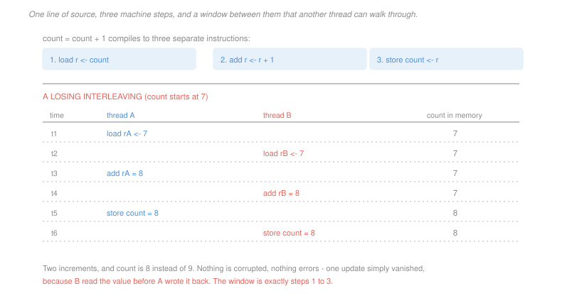

# Operating Systems · Lesson 2.1: Race conditions and critical sections

> ⏱ ~15 min · Module 2: Synchronization and deadlock · Builds on: [1.4 (threads)](01-04-threads-and-concurrency.md) · Unlocks: 2.2 (locks), 2.3 (semaphores)

## Why this matters

Here is a program that is wrong. Two threads each run `count = count + 1` a million times, starting from zero, and the answer is not two million. It is some number below it, different every run, and on a good day it is two million and you never find out.

That is the shape of every concurrency bug: correct-looking source, no error message, results that depend on timing you do not control. Nothing crashes. A number is quietly wrong.

The good news is that the underlying cause is small and completely mechanical, and once you can see it you can find these by reading. This lesson is about learning to see it.

## The idea

`count = count + 1` is one line of source and at least three machine instructions:

```
load   r <- count
add    r <- r + 1
store  count <- r
```

Between the load and the store, the value in `r` is a **stale copy**. If another thread stores to `count` in that window, this thread will overwrite it with a value computed from the old one, and that other thread's update disappears.

Concretely, with `count` starting at 7:

| time | thread A | thread B | `count` |
|---|---|---|---|
| 1 | load `rA` = 7 | | 7 |
| 2 | | load `rB` = 7 | 7 |
| 3 | `rA` = 8 | | 7 |
| 4 | | `rB` = 8 | 7 |
| 5 | store 8 | | 8 |
| 6 | | store 8 | 8 |

Two increments, and `count` went from 7 to 8. Nothing was corrupted and no rule of the language was broken. One update simply vanished.

The essential observation is that the window exists because the operation is not **atomic** — it is not indivisible from other threads' point of view. A thread can be preempted between any two instructions (the timer of [1.1](01-01-why-an-os-kernel-and-user-mode.md)), and on a multicore machine two threads genuinely execute at the same instant, so the window does not even need a preemption to be entered.

What matters is not the number of instructions but the pattern: **read some shared state, decide or compute from it, write back.** Any code doing that is unsafe unless something prevents another thread from writing in between. This is the "check then act" bug in its general form, and it covers far more than counters — checking whether a file exists before creating it, testing a queue for emptiness before popping, verifying a balance before withdrawing.

## The formal version

> **Race condition.** A situation in which the result depends on the relative timing of operations in two or more flows of control, at least one of which writes shared state.

In words: the answer depends on who gets there first, and nobody is arranging who does.

Note both halves of the condition. Two threads reading the same data race with nothing — an unlimited number of concurrent readers is always safe. It takes a **writer** to create a race, which is why read-mostly data structures are so much easier to make concurrent.

> **Critical section.** A region of code that accesses shared state and must not be executed by two flows at once.

A correct solution to the critical-section problem must provide three things, and all three are needed:

1. **Mutual exclusion** — at most one flow inside the section at a time. Without it, the section is not critical, it is just code.
2. **Progress** — if the section is free and flows want in, one of them gets in, and the decision cannot be postponed indefinitely by flows that are not trying to enter.
3. **Bounded waiting** — there is a limit on how many times others may enter ahead of a waiting flow. Without it a thread can be correct, live, and starved forever.

Most broken hand-rolled schemes satisfy exactly one or two of these, and P3 constructs the two characteristic failures. It is worth being suspicious of any synchronisation argument that only addresses mutual exclusion.

One tempting non-solution deserves naming now: **disabling interrupts**. It genuinely provides mutual exclusion on a single core, by preventing the preemption that opens the window. It is also a privileged operation ([1.1](01-01-why-an-os-kernel-and-user-mode.md)), so user code cannot do it; it does nothing at all on a multicore machine, where the other core never needed an interrupt to run; and holding interrupts off across anything slow makes the machine unresponsive. Kernels use it for very short sections on one core, and nothing else does.

## Picture



## Worked examples

**Example 1 — how bad can it get.** Two threads each increment a shared counter $N$ times. The maximum final value is $2N$, which happens whenever the threads do not overlap. What is the minimum?

The instinct is $N$ — "one thread's work is lost". The true answer is **2**, and it is worth seeing why the instinct is wrong.

A final value of $N$ would require one thread's updates to be lost *as a block*, but stale stores can be interleaved so that they knock the counter backwards repeatedly. Each thread only needs its *last* store to carry a stale, small value; everything before it can be overwritten. So one thread can hold a value of 1 across the entire remainder of the other thread's run, and store it at the very end, destroying all of that progress at once.

The lower bound is 2 rather than 1 because the last store to execute writes $r+1$ for some $r \ge 0$ it loaded, and the other thread's final store must already have completed and written at least 1. P1 constructs an explicit witness.

**Example 2 — a race with no counter in sight.** This is the pattern that actually appears in code:

```
if (!file_exists(path))       // check
    create_file(path);        // act
```

Two threads run it, and both find the file missing before either creates it. Both create. Depending on the system call used, one silently truncates the other's file, or one gets an error nobody handles.

There is no increment here, no shared variable in the program, and the shared state is *on disk* rather than in memory. It is the same bug: read shared state, decide from it, act on the decision, with a window in between.

The repair is instructive. You do not fix this with a lock, because the state is shared between *processes* and possibly between machines. You fix it by asking the file system for an operation that is atomic — `open` with the create-exclusive flag, which checks and creates as one indivisible step and tells you which of you won. **The general fix for check-then-act is to find an atomic version of check-and-act**, and that idea drives all of [2.2](02-02-locks-and-hardware-support.md).

## Watch out

- **You might think a race needs a preemption.** On multiple cores it does not. Two cores execute the load and the store genuinely simultaneously, so even a section that is never preempted can race. Reasoning about concurrency by imagining a single core that switches is a habit that will eventually mislead you.
- **You might think small operations are atomic.** `count++` is not, and neither is a 64-bit assignment on some 32-bit machines, nor a floating-point read-modify-write, nor appending to a shared list. Atomicity is a property of the hardware instruction, not of the source line's length.
- **You might think an intermittent failure means a rare interleaving.** Often it means a *common* interleaving that is only visible under load, or on a machine with more cores, or after a compiler upgrade reorders your instructions. A race that has never fired is a race.

## One-liner

> A race is read-shared-state, decide, write-back with a window in the middle, and the fix is always to make the whole sequence indivisible rather than to make the window smaller.

## Problems

**P1 (🟢)** Two threads each increment a shared counter exactly twice, starting from 0, with each increment compiled to load, add, store. (a) Give the complete set of possible final values. (b) Exhibit an interleaving, step by step, that produces the minimum. (c) State how many of the four increments are lost in your interleaving.

**P2 (🟡)** A shared queue is manipulated by this routine, where `q.count`, `q.head` and `q.buf` are shared and `n`, `item` and `doubled` are locals:

```
1   n = q.count
2   if (n == 0) return EMPTY
3   item = q.buf[q.head]
4   q.head = (q.head + 1) % SIZE
5   q.count = n - 1
6   doubled = item * 2
7   return doubled
```

(a) Give the smallest set of consecutive lines that must be inside the critical section, and justify the first and last line of your answer. (b) A colleague protects only lines 3 to 5. Describe the failure that remains, naming the two threads' positions. (c) Line 5 has a second bug that survives even a correct lock placement if the lock is released and reacquired anywhere in the routine. Identify it.

**P3 (🔴, optional)** Two threads share `flag[0]` and `flag[1]`, both initially false, and thread $i$ uses `other = 1 - i`. Consider two attempted entry protocols:

**Attempt A**
```
flag[i] = true;
while (flag[other]) ;
    /* critical section */
flag[i] = false;
```
**Attempt B**
```
while (flag[other]) ;
flag[i] = true;
    /* critical section */
flag[i] = false;
```

For each attempt, state which of the three requirements it violates and give an explicit interleaving, as an ordered list of steps, that demonstrates the violation. Then state in one sentence what a correct two-thread solution must add that neither attempt has.

<details>
<summary>Solutions</summary>

**P1** *(a) The possible final values.*
$$\{2,\ 3,\ 4\}$$

Four is the correct answer with no interference. Three arises when exactly one increment is lost. Two is the minimum, and 1 and 0 are impossible: the last store to execute writes a value at least 1, and the other thread's last store must have written at least 1 before it, so the counter reaches at least 2.

*(b) An interleaving producing 2.* Write `rA` and `rB` for each thread's register.

| step | action | `count` |
|---|---|---|
| 1 | A loads `count` (0) into `rA` | 0 |
| 2 | A computes `rA` = 1 | 0 |
| 3 | A stores 1 | **1** |
| 4 | A loads `count` (1) into `rA` | 1 |
| 5 | A computes `rA` = 2 | 1 |
| 6 | B loads `count` (1) into `rB` | 1 |
| 7 | B computes `rB` = 2 | 1 |
| 8 | B stores 2 | **2** |
| 9 | B loads `count` (2) into `rB` | 2 |
| 10 | B computes `rB` = 3 | 2 |
| 11 | B stores 3 | **3** |
| 12 | A stores 2 | **2** |

Final value **2**. The whole trick is step 5: thread A computes 2 and then holds it, unstored, across both of B's increments. Its store at step 12 is a message from the distant past that overwrites everything B did.

*(c) Increments lost.* Four increments were performed and the counter advanced by 2, so **two are lost**. Note they are not "thread B's two" — B's first increment survived and its second did not, and A's second increment is the one that did the damage.

**P2** *(a) The critical section is lines 1 to 5.*

*Why it starts at line 1:* the value read into `n` at line 1 is the basis of the decision at line 2. If the section began at line 2, another thread could pop the last item between lines 1 and 2, and this thread would proceed past a check based on a count that is no longer true — check-then-act in its purest form.

*Why it ends at line 5:* line 5 is the last write to shared state. Lines 6 and 7 touch only locals, and holding a lock across them serialises work that has no reason to be serialised. Keeping critical sections minimal is not just tidiness — it directly sets how much concurrency the structure permits.

*(b) Protecting only lines 3 to 5.* The failure is a pop from an empty queue. Thread A executes lines 1 and 2 with `q.count` equal to 1, so it passes the emptiness check and is then preempted before line 3. Thread B runs the whole routine, takes the last item, and leaves `q.count` at 0. Thread A resumes at line 3, takes the lock as instructed, and reads `q.buf[q.head]` — a slot that is now empty or stale — then advances `q.head` past the end of the valid region.

The positions are precise: **A between lines 2 and 3, B anywhere complete.** The lock was held for every line that touches shared data and the code is still wrong, because the *decision* was made outside it.

*(c) The second bug in line 5.* It writes `n - 1`, where `n` is a value read at line 1, rather than `q.count - 1`. That is a lost update in the sense of Example 1 — a stale local written back over whatever the shared value has become. Under a lock held continuously from line 1 to line 5 it happens to be harmless, since nothing else could have changed `q.count`. But it makes the correctness of line 5 depend on a fact established four lines earlier, so any future edit that releases and reacquires the lock in between reintroduces a silent corruption. Writing `q.count = q.count - 1` costs nothing and removes the dependence.

**P3** *Accept criterion: each attempt needs the named requirement plus a step-ordered interleaving in which the two threads' operations are individually identified. Any interleaving with the right structure is correct; the ones below are witnesses.*

**Attempt A violates progress** — specifically, it deadlocks. Mutual exclusion does hold: a thread only enters after seeing the other's flag false, and it set its own flag first, so the two cannot both be inside. But both can be stuck outside.

| step | thread 0 | thread 1 |
|---|---|---|
| 1 | `flag[0] = true` | |
| 2 | | `flag[1] = true` |
| 3 | tests `flag[1]` — true, spins | |
| 4 | | tests `flag[0]` — true, spins |
| 5 | spins forever | spins forever |

Neither will ever lower its flag, because lowering happens only after the critical section, which neither can reach. The critical section is free and nobody enters it, which is exactly the progress requirement's definition of failure.

**Attempt B violates mutual exclusion.** Reversing the two statements removes the deadlock and opens the window between the test and the set.

| step | thread 0 | thread 1 |
|---|---|---|
| 1 | tests `flag[1]` — false, falls through | |
| 2 | | tests `flag[0]` — false, falls through |
| 3 | `flag[0] = true` | |
| 4 | | `flag[1] = true` |
| 5 | **enters the critical section** | |
| 6 | | **enters the critical section** |

Both inside. This is the same test-then-set window as Example 2's check-then-act, and it is the reason the hardware instruction in [2.2](02-02-locks-and-hardware-support.md) has to do both at once.

*What a correct solution must add.* **A tie-breaker that is written by only one thread and read by the other** — Peterson's algorithm adds a shared `turn` variable, set by the entering thread to the *other* thread's index, so that when both flags are up the two threads read different answers and exactly one proceeds. The flags alone are symmetric, and a perfectly symmetric protocol cannot break a perfectly symmetric tie.

</details>

## Flashback

**From Lesson 1.3 (processes and the address space):** A process sets a global `x = 5`, then forks. The child sets `x = 9`; the parent then reads `x`. (a) Give the value the parent reads, and name the mechanism responsible. (b) Give the number of copy-on-write faults the child's assignment causes, and say what would have happened had `x` been in a read-only region. (c) State the one change that would make the parent see 9, and why it is a different mechanism entirely from the sharing threads get for free.

<details>
<summary>Solution</summary>

*(a) The parent reads **5**.* `fork` gives the child a *separate address space* with the same contents, not a shared one. The child's write goes to the child's copy of the page. The mechanism is the second page table built at `fork` time — one virtual address, two different physical pages after the write.

*(b) One copy-on-write fault.* The page containing `x` is mapped read-only in both processes after the fork; the child's store traps, the kernel copies that single 4 KiB page, remaps it writable in the child, and re-executes the store. Exactly one page is copied, however large the address space is.

*Had `x` been in a read-only region* — in the text segment, say — the fault would not be a copy-on-write fault at all. The kernel would find the page is read-only *by the program's own request* rather than by copy-on-write bookkeeping, and would deliver a segmentation fault, killing the child. The distinction lives in the kernel's own record of what each region is for, not in the page-table bit, which reads the same in both cases.

*(c) To make the parent see 9*, the region holding `x` must be **explicitly shared memory** — created with a shared mapping rather than an ordinary private one, so that both page tables point at the same physical page and no copy-on-write marking is applied.

Why that is a different mechanism: threads share by *default* because there is one address space and one page table, so sharing costs nothing and requires no decision. Processes must ask for sharing, region by region, and the kernel must arrange it. That difference is precisely the isolation trade of [1.4](01-04-threads-and-concurrency.md) — and note that the moment the parent and child do share the page, every race in this lesson applies to them exactly as it does to threads.

</details>

## Connections

- **Backward:** the shared column of [1.4](01-04-threads-and-concurrency.md)'s table is the complete list of places a race can happen, and the preemption that opens the window is the timer interrupt of [1.1](01-01-why-an-os-kernel-and-user-mode.md) doing its job.
- **Forward:** [2.2](02-02-locks-and-hardware-support.md) builds mutual exclusion properly, out of a hardware instruction that does check-and-act in one step. [2.3](02-03-semaphores-condition-variables-monitors.md) adds the ability to *wait for a condition* rather than merely exclude, and [2.5](02-05-deadlock.md) is what happens when the exclusion mechanism is used carelessly.
- **Sideways:** the check-then-act pattern and its atomic repair are the same problem a database solves with transactions and isolation levels, and the same one distributed systems solve with compare-and-swap on a key. The window is identical; only the distance between the two operations changes.
