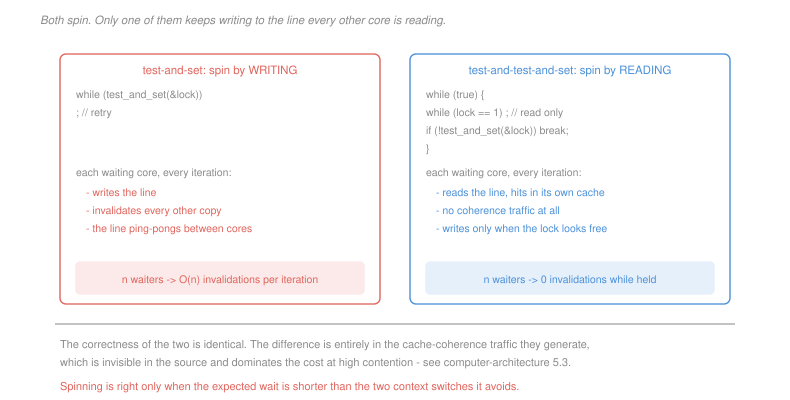

# Operating Systems · Lesson 2.2: Locks and hardware support

> ⏱ ~15 min · Module 2: Synchronization and deadlock · Builds on: [2.1 (race conditions)](02-01-race-conditions-and-critical-sections.md), [1.5 (scheduling)](01-05-cpu-scheduling.md) · Unlocks: 2.3 (semaphores), 2.4 (classic problems)

## Why this matters

[2.1](02-01-race-conditions-and-critical-sections.md) ended with a demand and no way to meet it: make check-and-act indivisible. Software alone cannot do it — Peterson's algorithm works for two threads and generalises badly, and every simpler attempt fails.

The resolution is that the hardware provides one instruction that reads and writes in a single indivisible step, and every lock, semaphore, monitor and lock-free data structure in existence is built from it. It is a small primitive with an enormous amount resting on it.

Getting locks *correct* turns out to be the easy part. Getting them fast, on a machine where the true cost is invisible in the source, is where the engineering is.

## The idea

The hardware gives you an instruction that does the whole read-modify-write without a window. The two standard forms:

> **Test-and-set.** Atomically write 1 to a location and return its previous value.
>
> **Compare-and-swap.** Atomically: if the location holds `expected`, replace it with `new` and report success; otherwise change nothing and report failure.

Compare-and-swap is strictly more powerful and is what modern machines provide. Test-and-set is easier to reason about, so build the lock with it:

```
acquire(lock):  while (test_and_set(&lock) == 1)
                    ;               // someone else had it; retry
release(lock):  lock = 0
```

Why this works: `test_and_set` returns the *old* value. If it returns 0, the lock was free and you have just set it — in one step nobody could interleave with. If it returns 1, someone else holds it and your write changed nothing. Exactly one thread can observe the transition from 0.

This is a **spinlock**: a waiting thread burns CPU in a loop. That is either the right answer or a disaster, depending entirely on how long the wait is.

**Spinning against blocking.** Spinning wastes the CPU for the duration of the wait, but costs nothing to start. Blocking gives the CPU to someone else, but costs two context switches — out now, back in later — plus the scheduler's latency in noticing you are runnable again.

So the rule is: **spin if the expected wait is shorter than two context switches, block otherwise.** With a switch around a microsecond, the crossover is a couple of microseconds — long enough that a critical section updating a few fields should spin, and short enough that anything touching a disk must block. The practical design, which P1 quantifies, is a two-phase lock: spin briefly, and block if that fails.

## The formal version

> **A spinlock is correct** if `test_and_set` is atomic. Mutual exclusion holds because the transition of the lock word from 0 to 1 is observed by exactly one thread; progress holds because a released lock is 0 and the next successful test-and-set takes it.

Bounded waiting, though, **does not hold**. Nothing orders the waiters, so an unlucky thread can lose every race indefinitely while others cycle through. This matters: a lock can be correct in the mutual-exclusion sense and still starve someone.

The fix is a **ticket lock**, the delicatessen counter: each arriving thread atomically takes the next ticket number and waits until the "now serving" counter reaches it. Waiting is then first-come-first-served and bounded by the number of threads ahead.

**Where the real cost lives.** A spinlock's cost is not the instruction count; it is cache coherence. Every `test_and_set` is a *write*, and by [`computer-architecture` 5.3](../../computer-architecture/lessons/05-03-multiprocessors-cache-coherence.md) a write must invalidate every other copy of that cache line. So $n$ threads spinning on one lock generate a continuous storm of invalidations, and the line ping-pongs between cores — including to the core holding the lock, which is trying to *finish* the critical section and now takes a coherence miss on every access.

The repair is to spin without writing:

```
acquire(lock):
    while (true) {
        while (lock == 1)      // ordinary read: hits in the local cache
            ;
        if (test_and_set(&lock) == 0)
            break;             // only write when it looks free
    }
```

This is **test-and-test-and-set**. Identical correctness, and while the lock is held it generates *no* coherence traffic at all, because every waiter reads a line it holds shared. Only on release does the herd wake and race, and the queue-based locks used in real kernels reduce even that to one handoff.

## Picture



## Worked examples

**Example 1 — the break-even for spinning.** A context switch costs 1.2 µs, so blocking and later resuming costs about 2.4 µs of CPU. A lock is held for a time drawn from a workload where 80 percent of acquisitions find it held for 0.5 µs and 20 percent for 50 µs.

*Always spin:*
$$0.8(0.5) + 0.2(50) = 0.4 + 10 = 10.4\ \mu\text{s of CPU burnt per acquisition}$$

*Always block:* the cost is the two switches regardless of the hold time, since the waiting itself is spent running someone else:
$$2.4\ \mu\text{s per acquisition}$$

*Spin for 2.4 µs, then block:* the short 80 percent are acquired during the spin at their true cost; the long 20 percent pay the full spin *and* the block.
$$0.8(0.5) + 0.2(2.4 + 2.4) = 0.4 + 0.96 = 1.36\ \mu\text{s}$$

The hybrid beats both pure strategies, by 7.6 times against spinning and 1.8 against blocking. This is not a coincidence of these numbers: spinning up to the cost of blocking can never lose by more than a factor of two against the best possible decision made with perfect knowledge, which is why two-phase locks are the default in every serious threading library.

**Example 2 — counting coherence traffic.** Sixteen threads on sixteen cores, one holds a lock for 8 µs, and an atomic write that must acquire the line exclusively costs 200 ns.

*Plain test-and-set.* Each of the 15 waiters loops continuously, and every iteration is an invalidating write:
$$\frac{8000\text{ ns}}{200\text{ ns}} = 40 \text{ iterations each}, \qquad 15\times 40 = 600 \text{ invalidating operations}$$

Six hundred coherence transactions on one cache line, every one of them useless, while the lock holder contends for that same line to do its actual work.

*Test-and-test-and-set.* Waiters read. After one initial miss each, the line sits shared in all 16 caches and every spin iteration hits locally.
$$\approx 0 \text{ transactions during the hold}, \qquad \approx 15 \text{ invalidations at the release}$$

A ratio of roughly 40 to 1, from a change that does not alter the lock's semantics at all. And notice the residual: the release still wakes all 15, who all write, and only one succeeds — a thundering herd that costs $O(n)$ per handoff. Ticket and queue locks make each waiter spin on a *different* location, reducing the handoff to $O(1)$.

## Watch out

- **You might think a spinlock is a bad lock.** It is the right lock for very short critical sections in kernel code on multiple cores, where blocking would cost more than the wait. It is catastrophic in exactly one situation: **spinning on a single core for a lock held by a preempted thread**, because the holder cannot run until you give up the CPU, and you are spinning rather than giving it up. You will burn a full quantum every time.
- **You might think `volatile` (or its equivalent) makes an operation atomic.** It does not. It tells the compiler not to cache the value in a register. Atomicity is a hardware property, and you get it only from an atomic instruction.
- **You might think holding a lock longer is merely slower.** A thread preempted while holding a lock stalls every waiter for a full scheduling quantum, and if a *low-priority* thread holds a lock a high-priority thread wants, the high-priority thread waits on a thread the scheduler will not run. That is **priority inversion**, and it has grounded real spacecraft. The standard repair is priority inheritance: temporarily raise the holder to the waiter's priority.

## One-liner

> One atomic read-modify-write instruction is all the hardware owes you, and every lock is built from it — after which the interesting question stops being correctness and becomes how much cache-coherence traffic your waiting generates.

## Problems

**P1 (🟢)** A context switch costs 1.5 µs. Measurements show 70 percent of acquisitions find the lock held for 0.8 µs, 30 percent for 40 µs. (a) Give the average CPU burnt per acquisition under always-spin and under always-block. (b) Give it under a two-phase lock that spins for exactly the cost of blocking, then blocks. (c) State the hold-time threshold above which pure blocking beats pure spinning, and give the fraction of long acquisitions at which the two pure strategies break even.

**P2 (🟡)** Thirty-two cores, one lock, held for 5 µs each time. An invalidating atomic write costs 250 ns; a read that hits in the local cache costs 1 ns. (a) Give the number of invalidating operations generated during one hold under plain test-and-set. (b) Give it under test-and-test-and-set, counting the release. (c) A ticket lock has each waiter spin on its own `now_serving` comparison against a shared counter. State whether this removes the release-time herd, and give the number of invalidations per handoff.

**P3 (🔴, optional)** A lock-free stack pops with compare-and-swap:

```
pop():
    do {
        old  = top
        if (old == NULL) return NULL
        next = old->next
    } while (!CAS(&top, old, next))
    return old
```

The stack initially holds A, then B, then C, with `top = A`. Construct an interleaving of two threads, as an ordered list of steps, after which the stack is corrupted — that is, `top` points at a node that is not in the list. Then state in one sentence what compare-and-swap actually guarantees, as opposed to what this code assumes it guarantees, and name one fix.

<details>
<summary>Solutions</summary>

**P1** *(a) The pure strategies.* Blocking and resuming costs $2\times 1.5 = 3.0$ µs.
$$\text{always spin: } 0.7(0.8) + 0.3(40) = 0.56 + 12 = \boxed{12.56\ \mu\text{s}}$$
$$\text{always block: } \boxed{3.0\ \mu\text{s}}$$

*(b) Two-phase, spinning 3.0 µs first.* The 70 percent that clear in 0.8 µs are acquired during the spin; the 30 percent pay the whole spin and then the block:
$$0.7(0.8) + 0.3(3.0 + 3.0) = 0.56 + 1.8 = \boxed{2.36\ \mu\text{s}}$$
Better than either pure strategy, and 5.3 times better than spinning.

*(c) The threshold and the break-even mix.* For a single acquisition, spinning costs the hold time $h$ and blocking costs 3.0 µs, so blocking wins when
$$h > \boxed{3.0\ \mu\text{s}}$$

For the mix, let $p$ be the fraction of long (40 µs) acquisitions and solve for equal averages:
$$(1-p)(0.8) + p(40) = 3.0 \;\Longrightarrow\; 0.8 + 39.2p = 3.0 \;\Longrightarrow\; p = \frac{2.2}{39.2} = \boxed{5.6\%}$$

So with more than about 6 percent long holds, blocking beats spinning — a strikingly small fraction, because one 40 µs spin wastes as much CPU as thirteen blocking operations. **Rare slow cases dominate the average**, which is the standard reason a spin-only lock that tested fine in development collapses in production.

**P2** *(a) Plain test-and-set during a 5 µs hold.* Thirty-one waiters, each looping with an invalidating write every 250 ns:
$$\frac{5000}{250} = 20 \text{ iterations each}, \qquad 31\times 20 = \boxed{620 \text{ invalidating operations}}$$

*(b) Test-and-test-and-set.* During the hold, every waiter spins on a read that hits its own shared copy, so the traffic is **zero**. At the release, the holder's store invalidates 31 copies, all 31 waiters re-read and then attempt the atomic write, of which all 31 invalidate again in some order:
$$\approx 1 + 31 = \boxed{32 \text{ invalidations at the release, } 0 \text{ during the hold}}$$

A reduction of about 20 times, with the caveat that the release cost is now the whole cost and it grows linearly in the number of waiters.

*(c) The ticket lock.* It **does** remove the herd's write storm, but not by removing the read herd. Each waiter compares its own ticket against one shared `now_serving` counter, so waiters never write while waiting — the acquiring write happened once, when the ticket was taken. On release the holder increments `now_serving`, which is
$$\boxed{1 \text{ invalidation per handoff}}$$
followed by all 31 waiters re-reading the line, of which exactly one finds its number and proceeds. So the *writes* drop to one, which is the expensive half, while the reads remain $O(n)$ because everyone shares one counter.

Removing that last $O(n)$ is what queue locks do: each waiter spins on a flag in its **own** cache line, and the releaser writes to the single successor's flag. One invalidation, one waiter woken, no herd at all. That is the MCS lock, and it is what Linux uses for contended kernel spinlocks.

**P3** *Accept criterion: the interleaving must have thread 1 read `old` and `next`, then be suspended while thread 2 removes and reinstates the same node A, then have thread 1's compare-and-swap succeed. Node identity, not just values, is the point.*

*The interleaving.* The stack is A → B → C with `top = A`.

| step | thread 1 | thread 2 | stack state |
|---|---|---|---|
| 1 | reads `old = A` | | top = A, list A→B→C |
| 2 | reads `next = A->next = B` | | unchanged |
| 3 | *preempted* | | unchanged |
| 4 | | pops A successfully | top = B, list B→C |
| 5 | | pops B successfully | top = C, list C |
| 6 | | pushes A back, setting `A->next = C` | top = A, list A→C |
| 7 | resumes, runs `CAS(&top, A, B)` | | `top` **is** A, so the swap succeeds |
| 8 | | | **top = B, and B is not in the list** |

Thread 1's compare-and-swap compared A against A, found them equal, and concluded that nothing had changed. In fact everything had changed and then changed back. `top` now points at B, which thread 2 popped and very likely freed — so the stack's head is a dangling pointer, and the node C that was legitimately in the list is unreachable.

*What compare-and-swap actually guarantees.* That **the location holds the same value** as when you read it — not that the data structure is in the same state, and not that no intervening modification occurred. The code assumes the second, which is why this failure is called the **ABA problem**.

*A fix.* Attach a **version counter to the pointer** and swap both together (a double-width compare-and-swap), so that A-with-tag-7 and A-with-tag-9 compare unequal even though the pointer is identical. The counter makes each *state* distinguishable rather than each value. Alternatives used in practice: hazard pointers or epoch-based reclamation, which prevent A from being reused while any thread still holds a reference to it, and languages with a tracing garbage collector, where the reused-address form of ABA cannot arise at all.

</details>

## Flashback

**From Lesson 1.5 (CPU scheduling):** Three jobs: J1 arrives at 0 with a burst of 6, J2 arrives at 1 with a burst of 3, J3 arrives at 3 with a burst of 1. (a) Give the average waiting time under FCFS. (b) Give it under shortest-remaining-time-first. (c) Give the number of preemptions in (b), and state what hardware feature makes them possible.

<details>
<summary>Solution</summary>

*(a) FCFS.* Arrival order is J1, J2, J3, and each runs to completion:

| job | starts | completes | waiting |
|---|---|---|---|
| J1 | 0 | 6 | 0 |
| J2 | 6 | 9 | $6 - 1 = 5$ |
| J3 | 9 | 10 | $9 - 3 = 6$ |

$$\bar w = \frac{0 + 5 + 6}{3} = \boxed{3.67}$$

*(b) Shortest remaining time first.* Re-evaluate at every arrival.

- $t = 0$: only J1, it runs.
- $t = 1$: J2 arrives with 3 remaining against J1's 5. **Preempt**, J2 runs.
- $t = 3$: J3 arrives with 1 against J2's 1 remaining. Equal, so no preemption on a tie; J2 finishes at 4.
- $t = 4$: J3 (1) beats J1 (5). J3 runs and finishes at 5.
- $t = 5$: J1 resumes and finishes at 10.

| job | completes | waiting |
|---|---|---|
| J1 | 10 | $10 - 0 - 6 = 4$ |
| J2 | 4 | $4 - 1 - 3 = 0$ |
| J3 | 5 | $5 - 3 - 1 = 1$ |

$$\bar w = \frac{4 + 0 + 1}{3} = \boxed{1.67}$$

Less than half of FCFS, and the entire gain comes from not making the two short jobs wait behind the long one — the convoy effect avoided.

*(c) Preemptions and the mechanism.* **One preemption**, of J1 at $t = 1$. (J1 also loses the CPU at $t=4$ in the sense of not being chosen, but it was not running then, so it is not a preemption.)

What makes it possible is the **timer interrupt**, from [1.1](01-01-why-an-os-kernel-and-user-mode.md). Without an asynchronous trap the kernel does not run while J1 runs, so it cannot notice that J2 has arrived, let alone act on it. Every preemptive policy is downstream of that one hardware feature — and note the connection to this lesson: preemption is also exactly what makes a lock holder stop midway through a critical section, which is why spinning on a single core is so dangerous.

</details>

## Connections

- **Backward:** this delivers the atomic check-and-act that [2.1](02-01-race-conditions-and-critical-sections.md) showed was necessary and that software alone could not provide. The spin-versus-block decision is priced entirely in the context-switch cost measured in [1.4](01-04-threads-and-concurrency.md).
- **Forward:** [2.3](02-03-semaphores-condition-variables-monitors.md) needs more than exclusion — the ability to sleep until a *condition* holds — and builds it on top of these locks. Careless use of two locks produces [2.5](02-05-deadlock.md).
- **Sideways:** the coherence traffic that dominates lock cost is [`computer-architecture` 5.3](../../computer-architecture/lessons/05-03-multiprocessors-cache-coherence.md)'s subject, and a contended spinlock is the worst case of the false-sharing pathology described there — except that here the sharing is real. Compare-and-swap is also the primitive that distributed key-value stores expose for the same purpose, where the ABA problem reappears under the name of lost updates across sessions.
