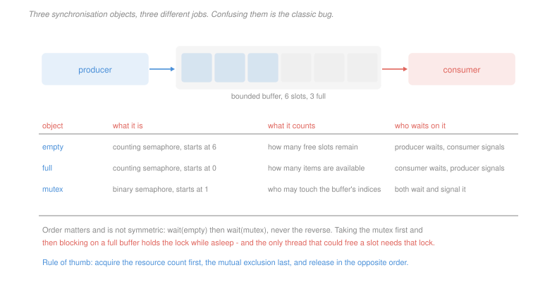

# Operating Systems · Lesson 2.3: Semaphores, condition variables and monitors

> ⏱ ~15 min · Module 2: Synchronization and deadlock · Builds on: [2.2 (locks)](02-02-locks-and-hardware-support.md), [2.1 (critical sections)](02-01-race-conditions-and-critical-sections.md) · Unlocks: 2.4 (classic problems), 2.5 (deadlock)

## Why this matters

A lock answers one question: may I touch this? It cannot answer the other question real programs ask, which is *is there anything for me to do yet?*

A consumer facing an empty queue does not want exclusive access to the emptiness. It wants to sleep until an item exists. Spinning on a lock cannot express that, and holding the lock while waiting for someone else to fill the queue is a guaranteed deadlock, because the filler needs the lock.

So you need a second kind of primitive: one that lets a thread give up the lock and sleep, atomically, and be woken when the world has changed. That is what this lesson builds, and the two words that matter most in it are *atomically* and *while*.

## The idea

A **semaphore** is an integer with two atomic operations and one rule: it never goes below zero by letting a thread through.

```
wait(S):    S = S - 1
            if (S < 0) block this thread on S's queue

signal(S):  S = S + 1
            if (S <= 0) wake one thread from S's queue
```

Read the value directly: when positive it is the number of units still available; when negative its magnitude is the number of threads asleep waiting.

Two uses, and they look identical in code while meaning completely different things:

- **Binary semaphore**, initialised to 1, used as a **lock**. `wait` is acquire, `signal` is release, and the same thread does both.
- **Counting semaphore**, initialised to $n$, used to **track a resource count**. One thread waits, a *different* thread signals — it is a message that something became available, not a lock.

The second use is the interesting one, and the distinction matters because it determines who is allowed to signal. A lock signalled by a thread that did not acquire it is a bug. A counting semaphore signalled by a thread that never waited on it is the normal case.

**Condition variables** package the same idea more safely. A condition variable is always paired with a lock, and offers:

- `wait(cv, lock)` — atomically release `lock` and sleep; on waking, reacquire `lock` before returning.
- `signal(cv)` — wake one sleeper. `broadcast(cv)` — wake all of them.

The atomicity in `wait` is the whole point. If releasing the lock and going to sleep were two steps, another thread could squeeze in between them, signal the condition, and find nobody asleep to wake — after which you sleep forever waiting for a signal that already happened. That is the **lost wakeup**, and it is why the primitive must be a single operation.

A **monitor** is the packaging taken to its conclusion: an object whose methods all hold one implicit lock, with condition variables inside. Java's `synchronized` and Python's `with lock` are monitors in this sense. The advantage over raw semaphores is that you cannot forget the release, because the language emits it.

## The formal version

> **Mesa semantics.** After `signal(cv)` wakes a thread, the signalling thread *keeps the lock and keeps running*. The woken thread merely becomes runnable and must reacquire the lock, which may be much later.
>
> **Hoare semantics.** The signaller immediately hands the lock to the woken thread, so the condition it signalled is still true when that thread resumes.

In words: under Mesa the signal is a hint that the condition *was* true a moment ago; under Hoare it is a promise that it is true now.

Every real system uses Mesa, because Hoare requires an extra context switch on every signal and a way to give the lock back afterwards. And Mesa has a consequence you must obey:

> **Always wait in a loop, never in an `if`.**
> ```
> while (!condition)          // NOT  if (!condition)
>     wait(cv, lock);
> ```

Between the signal and your reacquisition of the lock, any other thread may run and undo the condition. If you used `if`, you resume believing something that is no longer true and act on it — the check-then-act bug of [2.1](02-01-race-conditions-and-critical-sections.md), reintroduced by the synchronisation code itself. P3 constructs the failure explicitly.

The loop also makes **spurious wakeups** harmless, and it makes `broadcast` safe: waking ten threads when only one can proceed is correct, because nine will recheck and go back to sleep.

## Picture



## Worked examples

**Example 1 — tracing a counting semaphore.** A semaphore `S` is initialised to 2, and threads execute operations in this order:

| step | operation | `S` after | effect |
|---|---|---|---|
| 1 | T1 `wait` | 1 | T1 proceeds |
| 2 | T2 `wait` | 0 | T2 proceeds |
| 3 | T3 `wait` | −1 | T3 **blocks**; one thread asleep |
| 4 | T1 `signal` | 0 | value is $\le 0$, so wake T3 |
| 5 | T4 `wait` | −1 | T4 **blocks** |
| 6 | T2 `signal` | 0 | wake T4 |
| 7 | T3 `signal` | 1 | nobody asleep, so the unit is banked |

The final value 1 says one unit is free and nobody is waiting. Reading the sign is the fastest way to check a semaphore argument: a persistently negative value means threads are parked, and a value larger than the resource count means somebody has signalled more than they acquired.

**Example 2 — the bounded buffer, and why the order of `wait`s is not symmetric.** Three objects: `empty` counting free slots (initially $n$), `full` counting items (initially 0), and `mutex` protecting the indices (initially 1).

```
producer:                     consumer:
  wait(empty)                   wait(full)
  wait(mutex)                   wait(mutex)
  ... insert item ...           ... remove item ...
  signal(mutex)                 signal(mutex)
  signal(full)                  signal(empty)
```

Now swap the producer's first two lines, so it takes the mutex before checking for space. With a full buffer:

1. The producer executes `wait(mutex)` and succeeds — it now holds the lock.
2. It executes `wait(empty)`, which is $0$, so it blocks **while holding the mutex**.
3. A consumer executes `wait(full)`, succeeds, then `wait(mutex)` — and blocks, because the producer holds it.
4. Nobody will ever run again. The producer waits for a slot only a consumer can free; the consumer waits for a lock only the producer can release.

The rule this yields is worth memorising: **acquire the resource count first and the mutual exclusion last, and release in the opposite order.** The asymmetry is real — the *release* order genuinely does not matter much, while the acquire order is the difference between a working program and a dead one.

## Watch out

- **You might think `signal` is a message that persists.** It is not, for a condition variable: signalling a condition nobody is waiting on does nothing at all, and the signal is lost. A *semaphore* does remember, because the count is state. That difference is the single most common source of confusion between the two, and it is why a condition variable always has an accompanying shared variable that carries the actual state.
- **You might think `while` versus `if` is a style preference.** It is a correctness requirement under Mesa semantics, which is to say under every system you will ever use.
- **You might think a semaphore used as a lock is the same as a lock.** It is not, in one important respect: a lock has an *owner*, so the system can detect double release, support recursion and implement priority inheritance ([2.2](02-02-locks-and-hardware-support.md)). A semaphore has no owner and none of those are possible. Use a lock when you mean a lock.

## One-liner

> A lock says who may touch the data; a condition variable says when there is anything worth touching — and because a signal only means the condition was true a moment ago, you must always recheck it in a loop.

## Problems

**P1 (🟢)** A semaphore `S` is initialised to 3. Threads perform, in order: T1 `wait`, T2 `wait`, T3 `wait`, T4 `wait`, T5 `wait`, T2 `signal`, T6 `wait`, T1 `signal`, T3 `signal`. (a) Give the value of `S` after each operation. (b) Name the threads blocked at the end and give their count. (c) State what the final value would have to be for the claim "two units are free and nobody is waiting" to hold.

**P2 (🟡)** A team implements a bounded buffer of size 4 but writes the consumer as `wait(mutex)` then `wait(full)`, leaving the producer correct. (a) Give an interleaving, as an ordered list of steps, in which the system stops making progress, starting from an empty buffer. (b) State whether the bug can be triggered when the buffer is non-empty, with a reason. (c) State which of the four Coffman conditions of [2.5](02-05-deadlock.md) the corrected ordering eliminates.

**P3 (🔴, optional)** A monitor-based queue has consumers written with `if` rather than `while`:

```
dequeue():
    lock(m)
    if (count == 0)
        wait(notEmpty, m)
    item = buf[head]; head = head + 1; count = count - 1
    unlock(m)
    return item
```

Under Mesa semantics, construct an interleaving of one producer and two consumers, as an ordered list of steps, that causes a dequeue from an empty queue. Then state the one-character fix and explain why it also makes `broadcast` safe to use in place of `signal`.

<details>
<summary>Solutions</summary>

**P1** *(a) The trace.*

| step | operation | `S` after | effect |
|---|---|---|---|
| 1 | T1 `wait` | 2 | proceeds |
| 2 | T2 `wait` | 1 | proceeds |
| 3 | T3 `wait` | 0 | proceeds |
| 4 | T4 `wait` | −1 | **blocks** |
| 5 | T5 `wait` | −2 | **blocks** |
| 6 | T2 `signal` | −1 | wakes one sleeper — T4 |
| 7 | T6 `wait` | −2 | **blocks** |
| 8 | T1 `signal` | −1 | wakes one — T5 |
| 9 | T3 `signal` | 0 | wakes one — T6 |

*(b) Blocked at the end.* **None.** The final value is 0, and every thread that blocked was subsequently woken: T4 at step 6, T5 at step 8, T6 at step 9. A value of exactly 0 means no units free and nobody waiting — the resource is fully allocated and nobody is queued for it.

*(c) For "two free and nobody waiting".* The value would have to be $+2$. The single number cannot express "two free and three waiting", because those states cannot coexist: a waiting thread would have taken a free unit. That is exactly why one integer suffices — its sign selects which of the two quantities it is reporting.

**P2** *Accept criterion for (a): the consumer must acquire the mutex and then block on `full` while holding it, and the producer must then block on the mutex. Any interleaving with that structure is correct.*

*(a) The interleaving.* The buffer is empty, so `full` is 0, `empty` is 4, `mutex` is 1.

| step | consumer | producer | state |
|---|---|---|---|
| 1 | `wait(mutex)` succeeds | | mutex = 0, held by consumer |
| 2 | `wait(full)` — value 0 | | full = −1, consumer **blocks holding the mutex** |
| 3 | | `wait(empty)` succeeds | empty = 3 |
| 4 | | `wait(mutex)` — held | mutex = −1, producer **blocks** |
| 5 | *asleep* | *asleep* | no progress, ever |

The consumer waits for an item that only the producer can supply; the producer waits for a lock that only the consumer can release. Neither will run again, and note that this happens on the very first operation with an entirely idle system — it is not a rare race.

*(b) With a non-empty buffer.* **It cannot be triggered**, as long as the buffer stays non-empty. With `full` positive, the consumer's `wait(full)` succeeds immediately and it never sleeps holding the mutex, so the misordering is invisible. That is what makes this bug vicious: it does not fire in a busy system with a healthy backlog, and appears the first time the consumer outruns the producer — in production, at low load, at three in the morning.

*(c) The Coffman condition removed.* **Hold and wait.** Acquiring the resource count before the mutex means a thread never sleeps while holding a lock: either it obtains the count and then briefly takes the mutex, or it blocks on the count holding nothing at all. Removing any one of the four conditions makes deadlock impossible, and this ordering rule removes that one.

**P3** *Accept criterion: a consumer must be woken by the signal and then have the item taken by another consumer before the first reacquires the lock. Two waiting consumers, or one waiting and one arriving, are both acceptable structures.*

*The interleaving.* The queue is empty, `count = 0`.

| step | consumer C1 | consumer C2 | producer P | state |
|---|---|---|---|---|
| 1 | `lock(m)`, sees `count == 0`, calls `wait` | | | C1 asleep, mutex released |
| 2 | | | `lock(m)`, inserts item, `count = 1` | one item present |
| 3 | | | `signal(notEmpty)` | C1 becomes **runnable**, not running |
| 4 | | | `unlock(m)` | mutex free |
| 5 | | `lock(m)` — arrives fresh, wins the race | | mutex held by C2 |
| 6 | | `if (count == 0)` is false, takes the item, `count = 0` | | queue empty again |
| 7 | | `unlock(m)` | | mutex free |
| 8 | reacquires `m`, returns from `wait`, does **not** recheck | | | reads `buf[head]` with `count == 0` |

C1 dequeues from an empty queue, decrements `count` to −1, and advances `head` past the valid region. The signal was truthful when it was sent and stale by the time C1 could act on it — the defining property of Mesa semantics.

Note that C2 does not even have to be a waiting thread. Any thread that acquires the lock in the window between step 4 and step 8 can invalidate the condition, which is why the window cannot be closed by being careful about who waits.

*The fix.* Change `if` to **`while`**. On waking, C1 rechecks `count == 0`, finds it true, and goes back to sleep — correct, and costing only one wasted wakeup.

*Why it makes `broadcast` safe.* `broadcast` wakes every sleeper, and if there is one item and five sleepers, four of them must go back to sleep. With `while` they do, automatically, because each rechecks and finds the condition false. With `if`, all five would proceed to dequeue and four would corrupt the queue. So the loop is not merely a defence against a race — it is what lets you use `broadcast` whenever you are unsure how many threads a state change can satisfy, which is the standard advice precisely because it is hard to get `signal` right when several different conditions share one variable.

</details>

## Flashback

**From Lesson 2.1 (race conditions and critical sections):** An account holds 700. Two threads each execute `balance = balance + 100` once, and separately two threads each execute `if (balance >= 600) balance = balance - 600;` once, all with no synchronisation and every statement compiled to load, compute, store. (a) Give the set of possible final balances from the two deposits alone. (b) Give an interleaving of the two withdrawals, as an ordered list of steps, that leaves the account negative, and give the final balance. (c) State which of the three requirements of a critical-section solution the withdrawal violates, and why making each individual assignment atomic would not save it.

<details>
<summary>Solution</summary>

*(a) Two racing deposits.*
$$\{800,\ 900\}$$
900 when they do not overlap, and 800 when both load 700 before either stores, so one deposit is overwritten — the lost update of [2.1](02-01-race-conditions-and-critical-sections.md) Example 1.

*(b) Two withdrawals, ending negative.* The withdrawal is a check-then-act, and both checks can pass against the same balance.

| step | thread C1 | thread C2 | `balance` |
|---|---|---|---|
| 1 | tests `700 >= 600` — passes | | 700 |
| 2 | | tests `700 >= 600` — passes | 700 |
| 3 | loads 700, computes 100, stores | | 100 |
| 4 | | loads 100, computes $100 - 600$, stores | **−500** |

$$\text{final balance} = \boxed{-500}$$

Note what is *not* required: no update is lost here, and every arithmetic operation is performed on a value that was genuinely in the account when it was read. The account goes negative purely because two threads acted on one observation. This is the double-spend, and it is why the pattern matters far beyond counters.

*(c) Which requirement fails.* **Mutual exclusion** — two threads are inside the check-and-update region simultaneously, at steps 1 and 2.

Making each assignment atomic changes nothing, because the critical section is the **whole check-and-update**, not any statement within it. Even with an atomic subtract, C2's check at step 2 was validated against a balance that C1 was already committed to spending. Atomicity of the parts does not give atomicity of the whole, and choosing where the critical section begins is a design decision no primitive makes for you — the same conclusion as [2.1](02-01-race-conditions-and-critical-sections.md) P2, where the section had to start at the line that *read* the count, not the line that changed it.

</details>

## Connections

- **Backward:** the mutex in every example here is the lock built in [2.2](02-02-locks-and-hardware-support.md), and the reason `wait` must release-and-sleep atomically is the same window argument as [2.1](02-01-race-conditions-and-critical-sections.md) — only now the racing operation is the synchronisation primitive itself.
- **Forward:** [2.4](02-04-classic-synchronization-problems.md) uses these three objects on the standard problems, where the interesting failures are starvation rather than corruption. The ordering rule from Example 2 is a preview of [2.5](02-05-deadlock.md)'s hold-and-wait condition.
- **Sideways:** a counting semaphore is a rate limiter, and the same object appears as a connection pool, a worker-slot budget or a token bucket. The Mesa-versus-Hoare distinction reappears in any system where a notification and the state it describes can drift apart, which is every event-driven interface and every message queue.
