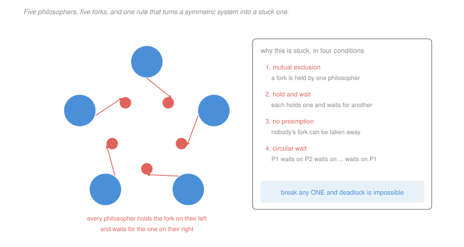

# Operating Systems · Lesson 2.4: Classic synchronization problems

> ⏱ ~15 min · Module 2: Synchronization and deadlock · Builds on: [2.3 (semaphores and monitors)](02-03-semaphores-condition-variables-monitors.md) · Unlocks: 2.5 (deadlock)

## Why this matters

Three problems have become canonical, not because they come up literally but because each isolates one failure that the primitives of [2.3](02-03-semaphores-condition-variables-monitors.md) do not prevent on their own.

Producer–consumer isolates *counting* — you already built it. Readers–writers isolates **starvation**: a solution can be free of races and deadlocks and still let one class of thread wait forever. Dining philosophers isolates **circular wait**: five threads each behaving reasonably, deadlocking as a group.

The reason to work them is that the failures are structural. Once you can see the shape, you recognise it in a connection pool, a cache invalidation protocol or a distributed lock manager, where it will not be wearing a philosopher's hat.

## The idea

**Readers and writers.** A shared structure is read often and written rarely. Any number of readers may be inside at once, since concurrent reads race with nothing ([2.1](02-01-race-conditions-and-critical-sections.md)). A writer must be alone.

The standard solution has readers count themselves:

```
reader:                              writer:
  wait(mutex)                          wait(rw)
  readcount = readcount + 1            ... write ...
  if (readcount == 1) wait(rw)         signal(rw)
  signal(mutex)
  ... read ...
  wait(mutex)
  readcount = readcount - 1
  if (readcount == 0) signal(rw)
  signal(mutex)
```

The **first** reader in takes the `rw` lock on behalf of all readers, and the **last** one out releases it. The `mutex` protects only `readcount` itself. It works, and it has a specific defect: as long as at least one reader is always inside, `readcount` never reaches zero, `rw` is never released, and a waiting writer waits forever. This is **reader priority**, and its starvation is not a bug in the code — it is what the code says.

Flip it to **writer priority** and readers starve instead, under a steady stream of writes. Neither extreme is acceptable in a system that must make progress, so real implementations are **fair**: an arriving writer blocks *subsequent* readers, letting the readers already inside drain, then writes. Every waiter is then bounded by the number of arrivals ahead of it.

**Dining philosophers.** Five philosophers around a table, one fork between each adjacent pair, and a philosopher needs both neighbouring forks to eat. The obvious protocol — take the left fork, then the right — deadlocks the moment all five take their left fork simultaneously. Each holds one, each waits for one, and the wait relation closes into a ring.

What makes it the canonical example is that no philosopher does anything wrong. The failure is a property of the *system*, invisible from inside any single participant, and no amount of care in the individual protocol removes it. Only breaking the symmetry does.

## The formal version

> **Starvation.** A thread is ready to proceed and is indefinitely denied, while the system as a whole makes progress.

In words: everything is working, except for you.

Distinguish it sharply from deadlock, where *nobody* progresses. Starvation is harder to detect, because the system looks healthy from the outside — throughput is fine, and one unlucky participant is simply never served. Bounded waiting ([2.1](02-01-race-conditions-and-critical-sections.md)) is precisely the requirement that rules it out.

> **Circular wait.** There is a set of threads $T_0, T_1, \ldots, T_{n-1}$ such that each $T_i$ waits for a resource held by $T_{(i+1) \bmod n}$.

Two standard repairs, both of which break the ring rather than treat the symptoms:

> **Resource ordering.** Impose a total order on resources and require every thread to acquire them in increasing order.
>
> *Why it works.* Suppose a circular wait exists. Each $T_i$ holds some resource and waits for one held by the next, and by the rule the resource it waits for has a strictly larger index than the one it holds. Following the cycle all the way round gives $r < r$, a contradiction. So no cycle can exist — the argument is exactly the one that shows a strictly increasing sequence cannot be cyclic.

> **Bounding the participants.** Allow at most $n-1$ of the $n$ philosophers to sit down at once.
>
> *Why it works.* Under a uniform left-then-right protocol the only possible wait cycle is the complete ring, because each blocked philosopher waits on exactly its own successor. A ring needs all $n$ philosophers holding a fork at once, so seating $n-1$ makes it unconstructible. P3 gives the argument in full.

Both are worth knowing, because they generalise differently. Ordering is what you use when the resources are known and nameable — lock hierarchies in kernels are exactly this. Bounding is what you use when they are interchangeable — connection pools and admission control are exactly this.

## Picture



## Worked examples

**Example 1 — tracing readers and writers.** Reader-priority code above, everything free. Arrivals in this order: R1, R2, W1, R3, then R1 leaves, R2 leaves, R3 leaves.

| event | `readcount` | `rw` | who is inside |
|---|---|---|---|
| R1 arrives | 1 | taken by R1 | R1 |
| R2 arrives | 2 | unchanged | R1, R2 |
| W1 arrives | 2 | blocked on `rw` | R1, R2 |
| R3 arrives | 3 | unchanged — **walks past the waiting writer** | R1, R2, R3 |
| R1 leaves | 2 | still held | R2, R3 |
| R2 leaves | 1 | still held | R3 |
| R3 leaves | 0 | released, W1 wakes | W1 |

The revealing line is R3's arrival. It does not touch `rw` at all — the lock is already held by the reader group — so a waiting writer is no obstacle to a newly arriving reader. If readers keep arriving faster than they leave, `readcount` never touches zero and W1 waits forever, without any single reader doing anything unusual.

**Example 2 — the asymmetric fix for the philosophers.** Number the philosophers 0 to 4 and the forks so that philosopher $i$ has forks $i$ (left) and $(i+1) \bmod 5$ (right). Under "left then right", philosopher 4 takes fork 4 then fork 0 — acquiring in *decreasing* order, which is the one that closes the ring.

Make philosopher 4 alone take the right fork first, and every philosopher now acquires in increasing index order. By the ordering argument above, deadlock is impossible.

Trace the previously fatal case, all five reaching for a fork at once:

| philosopher | wants first | gets it? |
|---|---|---|
| 0 | fork 0 | yes |
| 1 | fork 1 | yes |
| 2 | fork 2 | yes |
| 3 | fork 3 | yes |
| 4 | fork **0** | no — philosopher 0 has it |

Philosopher 4 blocks holding nothing. Philosopher 3 then finds fork 4 free, eats, and the system flows. **One participant behaving differently from the other four** is the entire fix, and the cost is that philosopher 4 is slightly less likely to eat — an asymmetry in fairness traded for the elimination of deadlock.

## Watch out

- **You might think a deadlock-free solution is a correct solution.** Reader-priority is deadlock-free, race-free and starves writers indefinitely. Bounded waiting is a separate requirement, and it is the one that quietly gets dropped.
- **You might think "take both forks at once" solves it.** It does, if you have an atomic operation that acquires both or neither — but that operation is itself a lock over the whole table, which serialises the philosophers and destroys the concurrency the problem exists to preserve. The interesting solutions are the ones that keep two philosophers eating simultaneously.
- **You might think starvation requires an unlucky thread.** Under reader priority a writer starves *systematically*, whenever the read rate is high enough. Calling it bad luck hides the fact that it is a designed-in property of the policy.

## One-liner

> Readers–writers is about who gets denied forever while the system looks healthy, dining philosophers is about a ring of reasonable individuals producing an unreasonable system, and the repairs are ordering the resources or bounding the participants.

## Problems

**P1 (🟢)** Reader-priority readers–writers, everything initially free. The arrival and departure sequence is: R1 in, W1 in, R2 in, R1 out, R3 in, R2 out, R3 out. (a) Give `readcount` and the holder of `rw` after each event, and state who is inside. (b) Give the event at which W1 finally begins writing. (c) State the total number of times `rw` is acquired across the whole sequence.

**P2 (🟡)** (a) Construct an arrival pattern for the reader-priority solution — a specific schedule of reader arrivals and departures — under which a writer that arrives at time 0 never runs, while every reader completes in bounded time. (b) State the dual pattern that starves readers under a writer-priority solution. (c) A fair solution adds a turnstile semaphore that every arriving thread must pass through, released after entry. Give the bound on how many readers can enter ahead of a waiting writer under that scheme, and justify it.

**P3 (🔴, optional)** Five philosophers, forks numbered 0 to 4, philosopher $i$ using forks $i$ and $(i+1)\bmod 5$, all taking left then right. (a) Give the interleaving, as an ordered list of five steps, that deadlocks the table, and identify the circular wait explicitly as a chain of five waits. (b) Prove that requiring every philosopher to acquire the lower-numbered fork first makes deadlock impossible. (c) Prove that permitting at most four philosophers to be seated also makes it impossible, and state which of the two fixes preserves more concurrency, with a reason.

<details>
<summary>Solutions</summary>

**P1** *(a) The trace.*

| event | `readcount` | `rw` | inside |
|---|---|---|---|
| R1 in | 1 | acquired by R1, on behalf of readers | R1 |
| W1 in | 1 | **blocked** — `rw` is held | R1 |
| R2 in | 2 | unchanged; R2 walks past W1 | R1, R2 |
| R1 out | 1 | still held, count not zero | R2 |
| R3 in | 2 | unchanged; R3 also walks past W1 | R2, R3 |
| R2 out | 1 | still held | R3 |
| R3 out | 0 | released; W1 wakes | W1 |

*(b) W1 begins writing at the **R3 out** event** — the seventh and last, after being overtaken by both R2 and R3.

*(c) Acquisitions of `rw`.* **Two.** Once by R1 as the first reader of its group, and once by W1 at the end. R2 and R3 never touch `rw`; that is precisely the mechanism that lets them overtake the waiting writer, and precisely why counting acquisitions is a good way to see the starvation coming.

**P2** *Accept criterion for (a) and (b): the pattern must keep the relevant count from ever reaching zero (or the writer queue from ever emptying), while each individual thread's own stay is finite.*

*(a) Starving the writer.* Let readers arrive every 10 ms and each stay for 25 ms.

| time (ms) | 0 | 10 | 20 | 25 | 30 | 35 | … |
|---|---|---|---|---|---|---|---|
| event | W1 arrives; R1 in | R2 in | R3 in | R1 out | R4 in | R2 out | … |
| `readcount` | 1 | 2 | 3 | 2 | 3 | 2 | ≥ 2 forever |

Because arrivals come every 10 ms and departures only every 25 ms after a lag, `readcount` reaches a steady state of 2 or 3 and never returns to zero. Every reader finishes in exactly 25 ms — bounded, as required — and W1 waits forever. That is starvation in its exact sense: the system is making excellent progress, and one participant is permanently excluded.

*(b) The dual.* Under writer priority, a stream of writers arriving faster than each completes keeps the writer queue non-empty. Readers, who must yield to any waiting writer, never see an empty queue and never enter. Writers arriving every 10 ms and taking 25 ms each does it, by exactly the same arithmetic.

*(c) The fair scheme's bound.* **At most the readers already inside when the writer arrives; no new reader may enter ahead of it.**

The turnstile is a binary semaphore that every arriving thread — reader or writer — must acquire and then release once it has been admitted to the queueing structures. When a writer arrives it takes the turnstile and does not release it until it has finished writing. Every reader arriving afterwards blocks on the turnstile before it can even increment `readcount`, so no new reader can join the group. The readers already inside drain, `readcount` hits zero, the writer proceeds.

The bound follows: a waiting writer is overtaken by zero later arrivals, so it waits at most for the readers ahead of it, which is a finite set fixed at its arrival. That is bounded waiting, and it is achieved by making the *decision to admit* a critical section rather than leaving admission to a count.

**P3** *Accept criterion for (a): five steps in which each philosopher acquires exactly their left fork, in any order, followed by the five-link wait chain.*

*(a) The deadlocking interleaving.*

| step | action |
|---|---|
| 1 | P0 takes fork 0 (its left) |
| 2 | P1 takes fork 1 |
| 3 | P2 takes fork 2 |
| 4 | P3 takes fork 3 |
| 5 | P4 takes fork 4 |

Every fork is now held, and every philosopher is about to request their right fork. The wait chain:

$$P_0 \to \text{fork }1\ (P_1) \to \text{fork }2\ (P_2) \to \text{fork }3\ (P_3) \to \text{fork }4\ (P_4) \to \text{fork }0\ (P_0)$$

Five waits closing into a ring. Nobody will release a fork, because releasing happens only after eating, and eating requires the fork nobody will release.

*(b) Lower-numbered fork first makes deadlock impossible.*

Suppose for contradiction that a deadlock exists. Then there is a cycle of philosophers $P_{i_0}, P_{i_1}, \ldots, P_{i_{k-1}}$ in which each holds a fork and waits for one held by the next. Let $h_j$ be the number of the fork $P_{i_j}$ holds and $w_j$ the number of the one it waits for.

Every philosopher acquires the lower-numbered of its two forks first, so a philosopher that holds one fork and waits for another must be waiting for the **higher** one:
$$h_j < w_j \quad \text{for every } j$$
And by the definition of the cycle, the fork $P_{i_j}$ waits for is the one $P_{i_{j+1}}$ holds:
$$w_j = h_{j+1}$$
Combining, $h_j < h_{j+1}$ for every $j$, and going all the way round the cycle of length $k$:
$$h_0 < h_1 < \cdots < h_{k-1} < h_0$$
which gives $h_0 < h_0$, a contradiction. Hence no such cycle exists. $\blacksquare$

Note the proof never mentions five, or forks, or philosophers — it holds for any resources under a total order, which is why lock hierarchies work in general.

*(c) At most four seated makes deadlock impossible.*

Suppose $k \le 4$ philosophers are seated and all of them are permanently blocked. Under the left-then-right protocol a blocked philosopher either holds nothing (blocked on its left fork) or holds its left fork and is blocked on its right. A philosopher who is not seated holds no fork, so **every fork that is held is held by a seated philosopher**, and every blocked philosopher is waiting on a fork held by a seated one.

Define $f$ on the seated philosophers, sending each to the holder of the fork it is waiting for. Every $f$-image holds a fork, so it is in the set $H$ of philosophers holding their left fork. Iterating $f$ from any philosopher must eventually repeat, so $f$ has a cycle, and every member of that cycle is in $H$.

Now identify the cycle. A member of $H$ is some $P_i$ holding fork $i$ and waiting for fork $i+1$, which by the numbering is the left fork of $P_{i+1}$. So on the cycle, $f(P_i) = P_{i+1}$ — the successor map. The only cycle of the successor map modulo 5 is the full ring, of length 5:

$$\text{cycle length} = 5 \;\Longrightarrow\; \text{all five philosophers are in } H \;\Longrightarrow\; k = 5$$

which contradicts $k \le 4$. $\blacksquare$

The argument makes explicit what the ordering proof also relies on: with a uniform protocol the wait graph is not an arbitrary graph but the successor map, and a successor map has exactly one cycle to eliminate.

*Which preserves more concurrency.* **The ordering fix**, though the margin is narrower than it first appears. At most two philosophers can eat simultaneously under either rule, since three would need six forks, so **throughput is essentially identical**. The difference is latency: the seating limit can leave the fifth philosopher standing when both of its forks are free, purely because four others are already seated, whereas ordering never delays a philosopher whose forks are available — it only changes which one it reaches for first.

In practice the trade often runs the other way. Admission control is a single counter that is easy to implement and audit, while a global lock order is a constraint every future code path must respect and nothing enforces automatically. That is why kernels order their locks, where the resources are few and named, and why connection pools and service bulkheads bound participants, where the resources are many and interchangeable.

</details>

## Flashback

**From Lesson 2.2 (locks and hardware support):** Eight cores, one lock held for 3 µs per acquisition. An invalidating atomic write costs 300 ns and a locally cached read costs 1 ns. (a) Give the invalidating operations generated during one hold under plain test-and-set and under test-and-test-and-set. (b) The same code runs on a **single-core** machine where the lock holder is preempted mid-section. State what happens and how long it lasts. (c) Give the rule that decides between spinning and blocking, and apply it to a lock protecting a disk write.

<details>
<summary>Solution</summary>

*(a) Coherence traffic during a 3 µs hold.* Seven waiters.

**Test-and-set** — every iteration is an invalidating write:
$$\frac{3000}{300} = 10 \text{ iterations each}, \qquad 7\times 10 = \boxed{70 \text{ invalidating operations}}$$

**Test-and-test-and-set** — waiters spin on a read that hits their own shared copy:
$$\boxed{0 \text{ during the hold}}, \qquad \approx 8 \text{ at the release (one store plus the herd's attempts)}$$

*(b) Single core, holder preempted.* Every spinning thread that gets scheduled burns its **entire quantum** doing nothing, because the only thread that can release the lock is the preempted holder, and it cannot run while a spinner holds the CPU. With a 4 ms quantum and seven waiters, the lock can be unavailable for tens of milliseconds of pure waste before the holder is scheduled again — a delay thousands of times the 3 µs the section actually needs.

This is the single worst case for a spinlock and the reason user-space code should essentially never spin without a bound. Kernel spinlocks are used with preemption disabled inside the critical section precisely to make this impossible.

*(c) The rule, applied.* **Spin if the expected wait is shorter than two context switches; block otherwise.** A disk write takes on the order of milliseconds, against a context switch of about a microsecond — a ratio of a thousand or more. So a lock held across a disk write must **block**, without hesitation, and a thread that spins for it wastes roughly a thousand times the CPU that blocking would have cost.

The general form worth carrying: the primitive is chosen by the *duration of the thing being protected*, not by the importance of the data or the frequency of access. Short and in memory, spin. Anything that touches a device, block.

</details>

## Connections

- **Backward:** the bounded buffer's three-object structure and the acquire-order rule come from [2.3](02-03-semaphores-condition-variables-monitors.md), and bounded waiting was named as a requirement in [2.1](02-01-race-conditions-and-critical-sections.md) precisely so that starvation here could be recognised as a violation of it rather than as bad luck.
- **Forward:** [2.5](02-05-deadlock.md) generalises the philosophers' ring into the four Coffman conditions and the resource-allocation graph, and turns the ordering fix into one of three systematic strategies.
- **Sideways:** readers–writers is the shape of every read-mostly cache, and the fair variant is what a database's shared and exclusive row locks implement. The seating limit is admission control, which appears as a connection pool, a bulkhead in a service mesh, and a token bucket — and [`operations-research` 4.3](../../operations-research/lessons/04-03-mmc-pooling-networks.md) gives the queueing account of why bounding admissions can improve the metric everyone actually cares about.
