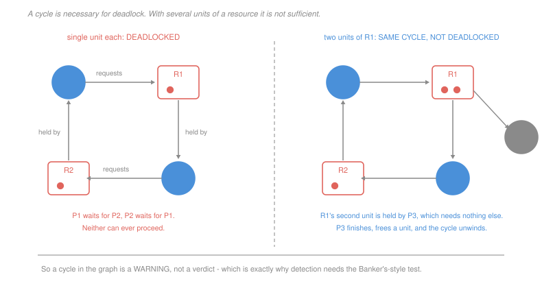

# Operating Systems · Lesson 2.5: Deadlock

> ⏱ ~15 min · Module 2: Synchronization and deadlock · Builds on: [2.4 (classic problems)](02-04-classic-synchronization-problems.md), [2.3 (semaphores)](02-03-semaphores-condition-variables-monitors.md) · Unlocks: 3.3 (demand paging), 4.4 (I/O)

## Why this matters

The philosophers of [2.4](02-04-classic-synchronization-problems.md) showed a deadlock. This lesson turns that one example into a theory: exactly four conditions must hold simultaneously, and breaking any one of them makes deadlock impossible.

That structure is what makes the topic worth learning rather than memorising. Given a stuck system you can ask four questions and know which repairs are even candidates. Given a proposed repair you can say precisely which condition it eliminates and therefore what it costs — because every one of the four is *useful*, and giving it up gives up something real.

The Banker's algorithm at the end is the most mathematically satisfying idea in the module and the least used in practice, and both of those facts are worth understanding.

## The idea

Deadlock requires **all four** of these at once:

1. **Mutual exclusion** — at least one resource is non-shareable. Without it there is nothing to wait for.
2. **Hold and wait** — a thread holding a resource can request another. Without it, threads either have everything or nothing.
3. **No preemption** — a resource cannot be taken away; it must be released voluntarily. Without it, the system can break any tie.
4. **Circular wait** — a cycle of threads each waiting on the next. Without it, some thread at the end of the chain can proceed.

These are the **Coffman conditions**, and the logic runs the same way in both directions: all four are necessary, so eliminating any one prevents deadlock outright.

Four strategies follow, and they differ in when you pay:

- **Prevention** — structurally break one of the four, always. Costs concurrency or throughput, permanently.
- **Avoidance** — allow all four, but refuse any individual request that could lead to trouble. Costs advance knowledge of what each thread will eventually need.
- **Detection and recovery** — allow deadlock, notice it, and break it by killing or rolling back a thread. Costs the periodic check and the lost work.
- **Ignore it** — the *ostrich algorithm*, and this is what Linux, Windows and macOS do for ordinary user processes.

Ignoring it is a real engineering decision, not laziness. Deadlocks among unrelated user processes are rare, the detection machinery is expensive, and the recovery (killing something) is exactly what a user would do anyway. Kernels apply prevention internally, through strict lock ordering, where the cost of a hang is a dead machine.

## The formal version

> **Resource-allocation graph.** A directed bipartite graph with a node per thread and per resource type, an *assignment* edge from a resource to a thread holding a unit, and a *request* edge from a thread to a resource it awaits.

The theorem everyone half-remembers:

> If every resource type has exactly **one** unit, then a cycle in the graph is **necessary and sufficient** for deadlock.
> With multiple units per type, a cycle is **necessary but not sufficient**.

In words: with single-unit resources, a cycle *is* the deadlock. With several units, a cycle may still resolve, because a thread outside the cycle can release a unit and unblock it. P3 constructs exactly that case, and the gap between necessary and sufficient is the entire reason a smarter test is needed.

**The Banker's algorithm.** The avoidance strategy, and its idea is worth stating before the mechanics: a state is **safe** if there exists an ordering of the threads such that each can obtain its remaining maximum need from what is currently free plus what its predecessors release when they finish. Such an ordering is a **safe sequence**.

Safe does not mean deadlock is impossible in the abstract. It means there is a way out *if the worst happens* — every thread demanding its full declared maximum. Grant a request only if the resulting state is still safe, and deadlock can never occur, because a route to completion always exists.

The bookkeeping, with $m$ resource types and $n$ threads:

$$\mathbf{Need}_i = \mathbf{Max}_i - \mathbf{Allocation}_i$$

*Safety check.* Start with $\mathbf{Work} = \mathbf{Available}$ and all threads unfinished. Repeatedly find an unfinished thread $i$ with $\mathbf{Need}_i \le \mathbf{Work}$; mark it finished and set $\mathbf{Work} \mathrel{+}= \mathbf{Allocation}_i$. If all threads finish, the state is safe.

*Request check* for a request $\mathbf{R}$ from thread $i$: reject if $\mathbf{R} > \mathbf{Need}_i$ (it exceeded its declaration); make it wait if $\mathbf{R} > \mathbf{Available}$; otherwise tentatively grant, run the safety check, and either commit or roll back.

Why it is rarely used: it needs each thread's **maximum future need declared in advance**, which programs do not know; it assumes the resource set is fixed; and the safety check is $O(mn^2)$ per request. It is nonetheless the clearest formalisation of the idea that *you can refuse a request that is individually harmless because of where it leads*, which reappears in admission control everywhere.

## Picture

## Worked examples

**Example 1 — running the safety check.** Three resource types with totals $A = 10$, $B = 5$, $C = 7$.

| thread | Allocation | Max | Need |
|---|---|---|---|
| P0 | 0 1 0 | 7 5 3 | 7 4 3 |
| P1 | 2 0 0 | 3 2 2 | 1 2 2 |
| P2 | 3 0 2 | 9 0 2 | 6 0 0 |
| P3 | 2 1 1 | 2 2 2 | 0 1 1 |
| P4 | 0 0 2 | 4 3 3 | 4 3 1 |

Allocated in total is $(7, 2, 5)$, so $\mathbf{Available} = (10,5,7) - (7,2,5) = (3,3,2)$.

| step | Work | thread that fits | Work after it finishes |
|---|---|---|---|
| 1 | (3,3,2) | P1, since $(1,2,2)\le(3,3,2)$ | $(3,3,2)+(2,0,0) = (5,3,2)$ |
| 2 | (5,3,2) | P3, since $(0,1,1)\le(5,3,2)$ | $(5,3,2)+(2,1,1) = (7,4,3)$ |
| 3 | (7,4,3) | P4, since $(4,3,1)\le(7,4,3)$ | $(7,4,3)+(0,0,2) = (7,4,5)$ |
| 4 | (7,4,5) | P0, since $(7,4,3)\le(7,4,5)$ | $(7,4,5)+(0,1,0) = (7,5,5)$ |
| 5 | (7,5,5) | P2, since $(6,0,0)\le(7,5,5)$ | $(7,5,5)+(3,0,2) = (10,5,7)$ |

All five finish, so the state is **safe** with sequence $\langle P_1, P_3, P_4, P_0, P_2\rangle$. Note P0 could not go first — its need $(7,4,3)$ exceeds the available $(3,3,2)$ — which is the point: safety is about existence of *an* order, not about every order working. Safe sequences are also not unique; $\langle P_1, P_3, P_4, P_2, P_0\rangle$ works too.

**Example 2 — a request that must be refused.** From the same state, P4 requests $(3,3,0)$.

*The cheap checks pass.* $\mathbf{R} = (3,3,0) \le \mathbf{Need}_4 = (4,3,1)$, so it is within its declaration, and $(3,3,0)\le \mathbf{Available} = (3,3,2)$, so the units exist.

*Tentatively grant.* $\mathbf{Available}$ becomes $(0,0,2)$, P4's allocation becomes $(3,3,2)$ and its need $(1,0,1)$.

*Safety check on the result.* With $\mathbf{Work} = (0,0,2)$, examine every need:

| thread | Need | fits in (0,0,2)? |
|---|---|---|
| P0 | 7 4 3 | no |
| P1 | 1 2 2 | no |
| P2 | 6 0 0 | no |
| P3 | 0 1 1 | no |
| P4 | 1 0 1 | no |

Nothing fits, no thread can finish, and the state is **unsafe**. The request is refused and P4 waits, even though the resources are sitting there unused.

That last sentence is the whole character of avoidance: it denies a request it *could* satisfy, because satisfying it would leave the system with no guaranteed way out. It is conservative by construction — an unsafe state is not a deadlocked state, and the system might well have survived — and that conservatism is the price of the guarantee.

## Watch out

- **You might think a cycle in the graph means deadlock.** Only when every resource type has a single unit. With multiple units, a thread outside the cycle can release a unit and dissolve it, which is why detection algorithms do the full safety-style sweep rather than looking for cycles.
- **You might think unsafe means deadlocked.** It means no *guaranteed* completion order exists under worst-case demand. Most unsafe states never deadlock, because threads rarely request their declared maximum. Safe ⊂ not-deadlocked, with room to spare.
- **You might think prevention is free.** Each of the four repairs costs something concrete: no mutual exclusion is impossible for most resources; no hold-and-wait means requesting everything up front, which idles resources and can starve a thread that needs a popular set; preemption requires the resource to be checkpointable; and ordering requires a global discipline every future code path must respect.

## One-liner

> Four conditions must hold at once, so any one of them can be broken to prevent deadlock — and the Banker's algorithm is the one strategy that breaks none of them, refusing instead any request that would leave no guaranteed way out.

## Problems

**P1 (🟢)** For each policy, name the Coffman condition it eliminates and give its practical downside in one clause: (a) a thread must request every resource it will ever need before it starts; (b) a database aborts and restarts a transaction that has been waiting too long, releasing its locks; (c) locks in a kernel must be acquired in increasing address order; (d) a file is opened in shared read mode by any number of readers.

**P2 (🟡)** From the state in Example 1, P1 requests $(1,0,2)$. (a) Perform the two cheap checks and state whether the request may be tentatively granted. (b) Give the resulting Allocation, Need and Available for the whole system. (c) Run the safety check on the result, giving the safe sequence or showing that none exists, and state the decision.

**P3 (🔴, optional)** Construct a resource-allocation graph, given as a list of holdings and requests, in which there is a cycle and the system is **not** deadlocked. Use at most three threads and two resource types. (a) Give the instance, including the number of units of each type. (b) Give the cycle explicitly and then the order in which the threads complete. (c) State the smallest change to your instance that turns it into a genuine deadlock, and say why a cycle test alone cannot distinguish the two.

Solutions

**P1**

| | condition eliminated | downside |
|---|---|---|
| (a) request everything up front | **hold and wait** | resources sit idle for the whole run, and a thread needing a popular set may never find them all free at once — starvation |
| (b) abort and restart a long-waiting transaction | **no preemption** | the aborted transaction's work is lost, and under contention the same one can be chosen repeatedly and never commit |
| (c) acquire locks in increasing address order | **circular wait** | every code path must respect a global order, which is invisible to the compiler and easy to break when a new lock is introduced |
| (d) shared read mode | **mutual exclusion** | it only works for resources that are genuinely shareable, which excludes anything being modified — the condition cannot be removed for most resources at all |

The pattern worth taking away: (d) is the only one that costs nothing, and it is the one that is almost never available. Every other repair buys deadlock freedom with throughput, wasted work or a discipline that must be maintained by hand.

**P2** *(a) The cheap checks.*
$$\mathbf{R} = (1,0,2) \le \mathbf{Need}_1 = (1,2,2) \quad\checkmark \qquad \mathbf{R} = (1,0,2)\le \mathbf{Available} = (3,3,2)\quad\checkmark$$
Both pass, so the request may be **tentatively granted** and tested.

*(b) The resulting state.* Only P1's row and the availability change:

| thread | Allocation | Need |
|---|---|---|
| P0 | 0 1 0 | 7 4 3 |
| **P1** | **3 0 2** | **0 2 0** |
| P2 | 3 0 2 | 6 0 0 |
| P3 | 2 1 1 | 0 1 1 |
| P4 | 0 0 2 | 4 3 1 |

$$\mathbf{Available} = (3,3,2) - (1,0,2) = (2,3,0)$$

*(c) The safety check.*

| step | Work | thread that fits | Work after |
|---|---|---|---|
| 1 | (2,3,0) | P1, $(0,2,0)\le(2,3,0)$ | $(2,3,0)+(3,0,2) = (5,3,2)$ |
| 2 | (5,3,2) | P3, $(0,1,1)\le(5,3,2)$ | $(5,3,2)+(2,1,1) = (7,4,3)$ |
| 3 | (7,4,3) | P4, $(4,3,1)\le(7,4,3)$ | $(7,4,3)+(0,0,2) = (7,4,5)$ |
| 4 | (7,4,5) | P0, $(7,4,3)\le(7,4,5)$ | $(7,4,5)+(0,1,0) = (7,5,5)$ |
| 5 | (7,5,5) | P2, $(6,0,0)\le(7,5,5)$ | $(10,5,7)$ |

All finish, so the state is safe with $\langle P_1, P_3, P_4, P_0, P_2\rangle$ and the request is **granted**.

Worth comparing with Example 2: P1's request left $C$ at zero, exactly as P4's did, and was still safe — because P1's remaining need $(0,2,0)$ asks for no $C$ at all, so it can finish and hand back three units of $A$ and two of $C$. Availability alone does not decide safety; what matters is whether *somebody* can finish from what is left.

**P3** *Accept criterion: the instance must contain a genuine cycle of hold-and-wait edges, plus a thread outside the cycle holding a spare unit whose release breaks it. Any instance with that structure is correct.*

*(a) The instance.* Resource $R_1$ has **two** units; $R_2$ has one unit.

| thread | holds | requests |
|---|---|---|
| P1 | one unit of $R_1$ | $R_2$ |
| P2 | $R_2$ | $R_1$ |
| P3 | one unit of $R_1$ | nothing — it is about to finish |

*(b) The cycle and the completion order.* The cycle is
$$P_1 \to R_2 \to P_2 \to R_1 \to P_1$$
P1 waits for $R_2$, which P2 holds; P2 waits for $R_1$, one unit of which P1 holds. That is a genuine cycle in the graph.

It is not a deadlock, because $R_1$'s **other** unit is held by P3, which needs nothing more:

| step | event | state |
|---|---|---|
| 1 | P3 finishes, releasing its unit of $R_1$ | one unit of $R_1$ free |
| 2 | P2's request for $R_1$ is satisfied | P2 holds $R_2$ and $R_1$ |
| 3 | P2 finishes, releasing both | $R_2$ free |
| 4 | P1's request for $R_2$ is satisfied; P1 finishes | all free |

Completion order $\langle P_3, P_2, P_1\rangle$ — which is precisely a safe sequence, found by exactly the sweep the Banker's safety check performs.

*(c) The smallest change, and why cycles are not enough.* Give $R_1$ **one** unit instead of two, and drop P3. Then P1 holds the only unit of $R_1$ and waits for $R_2$; P2 holds $R_2$ and waits for $R_1$; neither can proceed and the system is deadlocked.

The graph's cycle is identical in both instances — same threads, same edges, same shape. What differs is the *multiplicity* of $R_1$ and the existence of a holder outside the cycle, neither of which a cycle test inspects. That is why a cycle is necessary but not sufficient with multi-unit resources, and why detection algorithms simulate completion (can anybody finish? then pretend they did, and ask again) rather than searching for cycles. When every type does have a single unit, the two coincide, and cycle detection by depth-first search — the technique from [`algorithms` 3.2](../../algorithms/lessons/03-02-topological-sort-and-strongly-connected-components.md) — is exactly the right algorithm on the wait-for graph.

## Flashback

**From Lesson 2.3 (semaphores, condition variables and monitors):** A bounded buffer of size 2 uses the correct protocol: `empty` starts at 2, `full` at 0, `mutex` at 1. Trace this sequence: producer inserts, producer inserts, producer attempts a third insert, consumer removes, producer's blocked insert completes. (a) Give all three semaphore values after each step. (b) State at which step a thread blocks and on what. (c) State what the values would have been at that step had the producer taken the mutex first, and name the resulting failure.

Solution

*(a) The trace.* Each insert is `wait(empty)`, `wait(mutex)`, insert, `signal(mutex)`, `signal(full)`.

| step | action | `empty` | `full` | `mutex` |
|---|---|---|---|---|
| start | | 2 | 0 | 1 |
| 1 | producer inserts item 1 | 1 | 1 | 1 |
| 2 | producer inserts item 2 | 0 | 2 | 1 |
| 3 | producer attempts a third insert: `wait(empty)` | **−1** | 2 | 1 |
| 4 | consumer removes: `wait(full)`, `wait(mutex)`, remove, `signal(mutex)`, `signal(empty)` | 0 | 1 | 1 |
| 5 | producer's insert resumes and completes | 0 | 2 | 1 |

*(b) Where it blocks.* At **step 3**, on `empty`, whose value goes to −1 — one thread asleep, and the sign tells you so. Crucially the producer is blocked **holding nothing**: it had not yet taken the mutex, which is at 1 throughout and available to the consumer at step 4.

*(c) With the mutex taken first.* At step 3 the values would be `empty` = 0, `full` = 2, `mutex` = **0**, with the producer asleep inside the critical section. The consumer would then execute `wait(full)` successfully (`full` → 1) and block on `wait(mutex)`, taking it to −1.

The failure is **deadlock**, and now it can be named precisely with this lesson's vocabulary. All four Coffman conditions hold: the mutex is non-shareable, the producer holds it while waiting for `empty`, nothing can preempt it, and the wait relation closes — the producer waits for a slot only the consumer can free, the consumer waits for a lock only the producer can release. Acquiring the resource count before the mutex eliminates hold and wait, which is why the rule in [2.3](02-03-semaphores-condition-variables-monitors.md) Example 2 is stated as an order rather than a preference.

## Connections

- **Backward:** the philosophers' ring in [2.4](02-04-classic-synchronization-problems.md) is condition 4, and the resource-ordering fix proved there is the general prevention strategy for it. The mutex-before-count bug of [2.3](02-03-semaphores-condition-variables-monitors.md) is condition 2 in miniature.
- **Forward:** deadlock is not confined to locks. [3.3](03-03-demand-paging-and-page-faults.md) meets a memory version — every process waiting for a frame no one will release — and [4.4](04-04-io-and-disk-scheduling.md) meets an I/O version where buffers are the contended resource. The safe-sequence idea also returns as the admission control that keeps a system out of thrashing in [3.4](03-04-page-replacement-and-thrashing.md).
- **Sideways:** cycle detection on the wait-for graph is depth-first search from [`algorithms` 3.2](../../algorithms/lessons/03-02-topological-sort-and-strongly-connected-components.md), and the equivalence of "no cycle" with "a valid completion order exists" is exactly the topological-sort theorem. Databases implement all four strategies at once — ordering internally, timeouts as crude detection, and deadlock detection with victim selection for user transactions.
