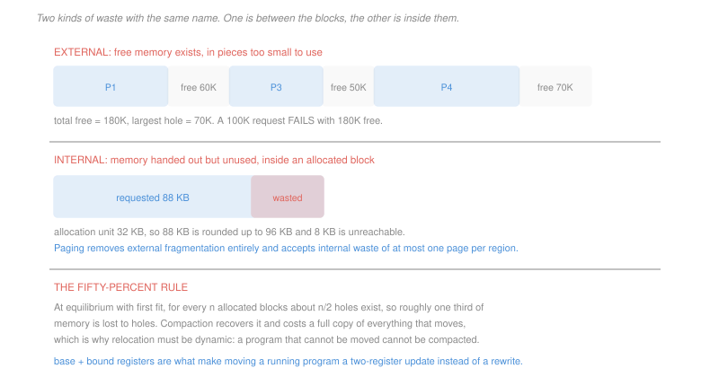

# Operating Systems · Lesson 3.1: Address spaces and allocation

> ⏱ ~15 min · Module 3: Memory and virtual memory · Builds on: [1.3 (the address space)](01-03-processes-and-the-address-space.md) · Unlocks: 3.2 (paging), 3.3 (demand paging)

## Why this matters

Every program is compiled believing it starts at some fixed address. Several of them run at once in one physical memory, so at most one of those beliefs can be literally true, and none of them is.

The resolution is an indirection: the addresses a program uses are **virtual**, and something translates them to physical ones. This lesson builds the simplest translation that works, watches it fail for a specific and quantifiable reason, and arrives at why paging is not an optimisation but a repair.

The failure mode is worth the trip on its own. Fragmentation is the reason an allocator can report plenty of free memory and refuse your request, and it appears identically in disks, in heaps, in network buffers and in warehouse shelving.

## The idea

Start with the smallest hardware that can isolate two programs: two registers per process, a **base** and a **bound**.

$$\text{physical} = \text{virtual} + \text{base}, \qquad \text{trap if } \text{virtual} \ge \text{bound}$$

Every memory access is checked and relocated. A program compiled to start at 0 can be loaded anywhere by setting `base`, and it cannot reach outside its own region because of `bound`. Both registers are privileged ([1.1](01-01-why-an-os-kernel-and-user-mode.md)), so a process cannot widen its own window.

Two words for what this buys, and they are different things:

- **Relocation** — the program does not need to know where it is. Crucially this is *dynamic*: the OS can move a running program by copying it and updating one register, with no rewriting of addresses.
- **Protection** — the bound check makes an out-of-range access a trap rather than a silent corruption of a neighbour.

Now put several programs in one memory this way, and let them come and go. Memory becomes a sequence of allocated regions separated by **holes**, and the allocator must choose a hole for each new request:

- **First fit** — take the first hole large enough. Fast, and it tends to leave the low addresses chewed up.
- **Best fit** — take the smallest hole large enough. Wastes the least *in that step*, and manufactures slivers too small to ever use.
- **Worst fit** — take the largest hole, on the theory that the leftover is big enough to be useful. Performs poorly in practice and destroys the large holes you will eventually need.

None of them dominates, and P3 makes that precise by beating each with an instance the other survives.

## The formal version

Two kinds of waste with confusingly similar names:

> **External fragmentation.** Free memory exists, but split into pieces none of which is large enough for the request.
>
> **Internal fragmentation.** Memory is handed to a process that does not use all of it, because the allocator rounds requests up to a fixed unit.

In words: external is waste *between* the blocks, internal is waste *inside* them.

The distinction decides the whole design. Variable-sized contiguous allocation has zero internal fragmentation and unbounded external fragmentation. Fixed-size allocation has zero external fragmentation — every free unit is interchangeable, so a hole is never the wrong shape — and bounded internal fragmentation, at most one unit per region. **Paging is exactly that trade**, taken deliberately.

> **The fifty-percent rule.** For first fit at equilibrium, if $n$ blocks are allocated then about $n/2$ holes exist, and roughly one third of memory is lost to them.

In words: even a well-behaved allocator gives up a third of the memory to gaps.

The sketch of why: at equilibrium, allocations and frees balance. A freed block merges with a neighbouring hole when a neighbour is free and creates a new hole when both neighbours are allocated, and counting the transitions gives holes at about half the block count. With average hole size comparable to average block size, the loss is around a third.

**Compaction** recovers it by sliding everything together, and it is expensive — every byte that moves must be copied, and no process can run during the move. It is possible *only* because relocation is dynamic; a program whose addresses were bound at load time cannot be moved at all.

**Segmentation** is the intermediate design: give a process several base-bound pairs, one per logical region — code, data, stack — so the regions can be placed separately and grow independently. It improves the fit and removes the requirement that a process be one contiguous run, but the segments themselves are still variable-sized, so external fragmentation survives. That is why the industry ended at paging.

## Picture

## Worked examples

**Example 1 — the same requests, three policies.** Holes, in address order: 100K, 500K, 200K, 300K, 600K. Requests arrive for 212K, 417K, 112K, 426K.

| request | first fit | best fit | worst fit |
|---|---|---|---|
| 212K | 500K hole → 288K left | 300K hole → 88K left | 600K hole → 388K left |
| 417K | 600K hole → 183K left | 500K hole → 83K left | 500K hole → 83K left |
| 112K | 288K remnant → 176K left | 200K hole → 88K left | 388K remnant → 276K left |
| 426K | **fails** — largest free is 300K | 600K hole → 174K left | **fails** — largest free is 300K |

Best fit places all four; first fit and worst fit both fail on the last one. That is the textbook result, and it is genuinely typical rather than rigged — best fit usually places more requests. It is also not a theorem, which is the point of P3.

**Example 2 — pricing the choice of unit size.** A system allocates in fixed units and must serve 10,000 regions whose sizes are uniformly distributed between 1 byte and 64 KiB.

With a unit of 4 KiB, a region wastes on average half a unit:

$$\text{expected waste} = \frac{4096}{2} = 2048 \text{ bytes per region}, \qquad 10{,}000 \times 2048 = 20.5 \text{ MB}$$

With a unit of 64 KiB the waste is 32 KiB per region, or 328 MB — against an average region size of 32 KiB, meaning **half of all memory allocated is wasted**.

So smaller units waste less memory. The counter-pressure is that the translation structure has one entry per unit, so halving the unit doubles the table. That tension sets the page size on every machine you will ever use, and it is why 4 KiB has survived for forty years while huge pages exist as an opt-in for programs whose working sets make the table the dominant cost.

## Watch out

- **You might think external fragmentation means you are out of memory.** It means you are out of *contiguous* memory. The failure message is identical and the remedy is completely different — compaction or a change of allocation scheme, not more RAM.
- **You might think best fit is best.** It is best at each individual step, which is a different claim, and the slivers it leaves are pure loss. Its name describes its greedy criterion, not its outcome.
- **You might think the bound register protects against a bad pointer inside your own region.** It does not. Base and bound draw one line around the whole process; a stray write from your stack into your own heap is entirely legal and is exactly the corruption you will spend your career debugging.

## One-liner

> Base and bound buy relocation and protection with two registers, and then variable-sized allocation loses about a third of memory to holes — which is the entire argument for fixed-size pages.

## Problems

**P1 (🟢)** Holes in address order: 150K, 80K, 400K, 220K. Requests arrive in order for 90K, 200K, 130K. (a) For each of first fit, best fit and worst fit, state which hole serves each request and give the hole list afterwards. (b) State which policies place all three. (c) Give the total free memory at the end and the largest single hole under best fit.

**P2 (🟡)** A machine has 8 GiB of memory and allocates in fixed units. Regions are uniformly distributed in size between 1 byte and 128 KiB, and 60,000 of them are live. (a) Give the expected internal fragmentation in total, for a 4 KiB unit and for a 32 KiB unit. (b) Give each as a percentage of the 8 GiB. (c) The translation table needs 8 bytes per unit of *the whole 8 GiB address range*. Give the table size for each unit size, and state which unit size minimises the sum of the two costs.

**P3 (🔴, optional)** (a) Construct a hole list and request sequence on which **first fit fails and best fit succeeds**, and show both runs. (b) Construct one on which **best fit fails and first fit succeeds**, and show both runs. (c) State what (a) and (b) together establish about choosing an allocation policy, and name the property of the problem that makes it unavoidable.

Solutions

**P1** *(a) The three runs.* Holes in address order are $H_1 = 150$K, $H_2 = 80$K, $H_3 = 400$K, $H_4 = 220$K.

**First fit.**

| request | hole taken | holes after |
|---|---|---|
| 90K | $H_1$ (150K), first that fits | 60, 80, 400, 220 |
| 200K | $H_3$ (400K) | 60, 80, 200, 220 |
| 130K | $H_3$ remnant (200K) | 60, 80, 70, 220 |

**Best fit.**

| request | hole taken | holes after |
|---|---|---|
| 90K | $H_2$? No — 80K is too small. Smallest that fits is $H_1$ (150K) | 60, 80, 400, 220 |
| 200K | $H_4$ (220K), smaller than 400K | 60, 80, 400, 20 |
| 130K | $H_3$ (400K) | 60, 80, 270, 20 |

**Worst fit.**

| request | hole taken | holes after |
|---|---|---|
| 90K | $H_3$ (400K), the largest | 150, 80, 310, 220 |
| 200K | $H_3$ remnant (310K) | 150, 80, 110, 220 |
| 130K | $H_4$ (220K) | 150, 80, 110, 90 |

*(b) Which place all three.* **All three policies succeed** on this sequence. The instance is not adversarial, and that is worth noticing — the policies differ constantly and the difference only becomes a failure under specific sequences.

*(c) End state under best fit.*
$$\text{total free} = 60 + 80 + 270 + 20 = \boxed{430\text{K}}, \qquad \text{largest hole} = \boxed{270\text{K}}$$

Total free is the same 430K under every policy — the requests consumed 420K out of 850K regardless. What differs is the *shape*: best fit leaves a 270K maximum, first fit leaves 220K, worst fit leaves only 150K. A request for 200K would now succeed under best fit and first fit and fail under worst fit, which is the concrete cost of destroying large holes.

**P2** *(a) Expected internal fragmentation.* Rounding a uniformly distributed size up to a unit of $u$ wastes on average $u/2$:

$$u = 4\text{ KiB}: \quad 60{,}000\times\frac{4096}{2} = 60{,}000\times 2048 = \boxed{122.9 \text{ MB}}$$
$$u = 32\text{ KiB}: \quad 60{,}000\times\frac{32768}{2} = 60{,}000\times 16{,}384 = \boxed{983.0 \text{ MB}}$$

*(b) As a percentage of 8 GiB* ($8.590\times 10^9$ bytes):
$$\frac{1.229\times 10^8}{8.590\times 10^9} = \boxed{1.43\%} \qquad \frac{9.830\times 10^8}{8.590\times 10^9} = \boxed{11.4\%}$$

*(c) Table size and the total.* The table covers the whole 8 GiB range at 8 bytes per unit:
$$u = 4\text{ KiB}: \quad \frac{8.590\times 10^9}{4096}\times 8 = 2{,}097{,}152 \times 8 = \boxed{16.8 \text{ MB}}$$
$$u = 32\text{ KiB}: \quad \frac{8.590\times 10^9}{32768}\times 8 = 262{,}144\times 8 = \boxed{2.1 \text{ MB}}$$

| unit | fragmentation | table | total |
|---|---|---|---|
| 4 KiB | 122.9 MB | 16.8 MB | **139.7 MB** |
| 32 KiB | 983.0 MB | 2.1 MB | 985.1 MB |

**The 4 KiB unit wins**, by a factor of seven. The structure of the answer is what matters: fragmentation grows *linearly* in $u$ while the table shrinks like $1/u$, so the total is a convex function of $u$ with an interior minimum. Differentiating $f(u) = 30{,}000u + 8.59\times 10^9\cdot 8/u$ and setting it to zero gives

$$u^* = \sqrt{\frac{6.87\times 10^{10}}{30{,}000}} \approx 1.5 \text{ KiB}$$

so the optimum for *this* workload is below 4 KiB, and 4 KiB is the nearest sensible power of two. That the standard page size lands near the optimum of a plausible model is not a coincidence — it is the calculation hardware designers ran.

**P3** *Accept criterion: each part needs a hole list, a request sequence, and both policies' runs shown to the point where one of them fails. Any instances with the right structure are correct.*

*(a) First fit fails, best fit succeeds.* Holes in address order: **20K, 15K**. Requests: **12K, then 20K**.

| policy | 12K goes to | 20K goes to |
|---|---|---|
| first fit | the 20K hole (first that fits), leaving **8K, 15K** | nothing fits — **fails** |
| best fit | the 15K hole (smallest that fits), leaving **20K, 3K** | the 20K hole, exactly — **succeeds** |

First fit consumed the only hole large enough for the later request, to serve a request that a smaller hole could have taken.

*(b) Best fit fails, first fit succeeds.* Holes: **25K, 20K**. Requests: **10K, 15K, 15K**.

| policy | 10K | 15K | 15K |
|---|---|---|---|
| first fit | 25K hole → **15K, 20K** | 15K remnant, exactly → **0, 20K** | 20K hole → **0, 5K** — **succeeds** |
| best fit | 20K hole → **25K, 10K** | 25K hole → **10K, 10K** | nothing fits — **fails** |

Best fit's first placement was locally optimal — 10K into 20K wastes 10K, against 15K if it had used the 25K hole — and it destroyed the only hole that could later hold a 15K request while leaving two useless 10K slivers.

*(c) What this establishes.* **Neither policy dominates**, so there is no allocation policy that is simply "correct"; the choice depends on the request distribution, and any policy can be beaten by a sequence built against it.

The property that makes this unavoidable is that allocation is an **online problem**: each request must be placed before the next is known. An offline allocator, given the whole sequence in advance, could place all four requests in both instances above. Every online policy is therefore a heuristic, and the honest way to compare them is by competitive ratio against the offline optimum or by simulation on realistic traces — never by the kind of local reasoning that makes "best fit" sound like it means best.

## Flashback

**From Lesson 2.4 (classic synchronization problems):** Three threads use three locks, acquiring them in these orders: T1 takes A then B; T2 takes B then C; T3 takes C then A. (a) State whether this can deadlock, and if so give the interleaving and the circular wait. (b) Give the single smallest change to one thread's order that makes deadlock impossible, and name the theorem that guarantees it. (c) State whether making T3 take A then C would also work, and whether the fix generalises to a fourth thread taking B then A.

Solution

*(a) It can deadlock.*

| step | T1 | T2 | T3 |
|---|---|---|---|
| 1 | acquires A | | |
| 2 | | acquires B | |
| 3 | | | acquires C |
| 4 | blocks on B (held by T2) | | |
| 5 | | blocks on C (held by T3) | |
| 6 | | | blocks on A (held by T1) |

The circular wait is
$$T_1 \to B\ (T_2) \to C\ (T_3) \to A\ (T_1)$$
a three-link ring, and all four Coffman conditions hold.

*(b) The smallest fix.* Impose the order $A < B < C$ and note that **only T3 violates it**, taking C before A. Change T3 to acquire **A then C** and every thread now acquires in increasing order.

The guarantee is the resource-ordering theorem from [2.4](02-04-classic-synchronization-problems.md): in a cycle each thread waits for a strictly higher-numbered resource than it holds, so following the cycle round yields $r < r$, a contradiction. No cycle can form, so no deadlock is possible — regardless of scheduling.

*(c) Both follow-ups.* **Yes, A then C is exactly the fix** — it is the same change, stated as the new order rather than as the rule.

And **yes, it generalises**. A fourth thread taking B then A violates the order, so it must be changed to A then B; once every thread in the system respects one total order, the theorem applies no matter how many threads there are or which subsets of locks they use. That universality is the strength of the approach and also its weakness in practice: the guarantee holds only if *every* code path complies, so one new function that takes B before A reintroduces the possibility everywhere. Nothing in a compiler checks it, which is why kernels document lock hierarchies and why runtime lock-order checkers exist.

## Connections

- **Backward:** the regions of [1.3](01-03-processes-and-the-address-space.md) — text, data, heap, stack — are what segmentation gives separate base-bound pairs, and the reason heap and stack grow toward each other is the same external-fragmentation pressure studied here.
- **Forward:** [3.2](03-02-paging-and-the-os-page-table.md) takes the fixed-size trade to its conclusion, replacing base and bound with a table that maps each page independently and eliminating external fragmentation altogether. The internal-fragmentation arithmetic of Example 2 is what sets the page size it uses.
- **Sideways:** this is the same problem as heap allocation inside a process, where `malloc` runs first fit or a size-class scheme against the same fragmentation; as disk allocation in [4.2](04-02-disk-allocation-and-free-space.md); and as bin packing, whose offline version is NP-hard — see [`algorithms` 4.3](../../algorithms/lessons/04-03-approximation-algorithms.md), where first fit reappears as an approximation algorithm with a provable ratio rather than as a heuristic.
