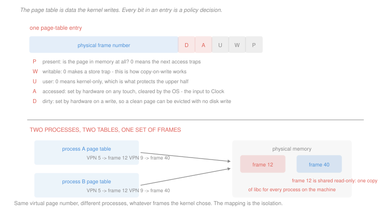

# Operating Systems · Lesson 3.2: Paging and the OS page table

> ⏱ ~15 min · Module 3: Memory and virtual memory · Builds on: [3.1 (address spaces)](03-01-address-spaces-and-allocation.md), [`computer-architecture` 4.3 (virtual memory and the TLB)](../../computer-architecture/lessons/04-03-virtual-memory-and-the-tlb.md) · Unlocks: 3.3 (demand paging), 3.4 (page replacement)

## Why this matters

[`computer-architecture` 4.3](../../computer-architecture/lessons/04-03-virtual-memory-and-the-tlb.md) built the translation machinery: splitting a virtual address into a page number and an offset, walking a multi-level page table, caching the result in a TLB, and pricing the whole thing. Take all of that as given — this lesson does not repeat it.

What that lesson deliberately left open is who *writes* the page table. The hardware reads it and knows nothing about processes, files or permissions. Every entry in it is a decision made by the kernel, and the interesting content of paging from the operating system's side is what those decisions are and what they cost.

Three of the most important features in a modern system — copy-on-write, memory-mapped files and shared libraries — are nothing but particular patterns of bits in that table.

## The idea

A page-table entry is a physical frame number plus a handful of control bits. The frame number is the translation; the bits are the policy.

| bit | set by | what it means |
|---|---|---|
| **P** present | kernel | is this page in memory at all? If 0, any access traps to the kernel |
| **W** writable | kernel | if 0, a store traps — even though a load succeeds |
| **U** user | kernel | if 0, only kernel mode may touch it |
| **A** accessed | **hardware** | set on any reference; the kernel clears it to sample usage |
| **D** dirty | **hardware** | set on a write; a page with D = 0 can be dropped without writing it back |

Read the direction of the arrows. The kernel writes P, W and U to express intent; the hardware writes A and D to report facts. Those two hardware-set bits are the only feedback channel the kernel has about what memory a program is actually using, and [3.4](03-04-page-replacement-and-thrashing.md)'s eviction policies are built entirely out of them.

Now the features fall out:

**Copy-on-write** is `W = 0` on a page that is logically writable. The store traps, the kernel consults its *own* records — not the page table — sees that the region is private-writable and the page is shared, copies it, sets `W = 1`, and restarts the instruction. The program observes nothing but a slow store.

**Memory-mapped files** are `P = 0` on pages whose backing store is a file rather than swap. The first touch faults, the kernel reads the block in, and thereafter the file is ordinary memory.

**Shared libraries** are the same physical frame appearing in the page tables of fifty processes, with `W = 0`. One copy of the C library in RAM, mapped at whatever virtual address each process likes.

The pattern is worth stating once: **the page table is a cache of the kernel's intentions, not the record of them.** The kernel keeps a separate description of what each region of the address space is for, and the page table holds only what the hardware needs to enforce it right now. A fault is the hardware asking the kernel to consult the real record.

## The formal version

> **The kernel/user split.** Every process's address space contains the kernel, mapped at the same virtual addresses in every process with `U = 0`.

In words: the kernel lives in your address space and you cannot see it.

Why do it this way rather than give the kernel its own address space? Because a system call would then have to switch page tables on entry and again on exit, flushing translations both times. Mapping the kernel into every process makes a trap a mode switch and nothing more, which is a large part of why the syscall cost in [1.2](01-02-system-calls-and-the-kernel-interface.md) is measured in hundreds of cycles rather than thousands. The `U` bit is what keeps it safe, and the Meltdown vulnerability of 2018 was precisely the discovery that speculative execution could leak the contents of those `U = 0` pages — which forced kernels to adopt separate tables after all, at a measurable cost.

> **Page tables are per process.** Switching processes means installing a different page-table root, which invalidates every cached translation.

This is the concrete reason a process switch costs more than a thread switch ([1.4](01-04-threads-and-concurrency.md)). Two mitigations matter:

- **Address-space identifiers.** Tag each TLB entry with the process it belongs to, so entries from several address spaces coexist and a switch flushes nothing. This removes the flush on *context switch*.
- **TLB shootdown.** When the kernel changes a mapping, every core that might have cached the old translation must invalidate it. Since one core cannot reach into another's TLB, the initiating core sends an inter-processor interrupt to each and waits for acknowledgement. This is the flush on *mapping change*, and ASIDs do not help with it at all — the mapping really is different now.

Confusing those two is the standard mistake. ASIDs make switching cheap; nothing makes unmapping cheap except unmapping less often, which is why P3's answer is batching.

## Picture

## Worked examples

**Example 1 — classifying a fault by its bits.** The hardware traps; the kernel must work out why from the entry and its own region records.

| what the access was | entry state | kernel's conclusion |
|---|---|---|
| load from a heap page | `P = 0`, kernel record says "anonymous, private" | first touch — allocate a zero frame, set `P = 1`. A **minor** fault |
| load from a mapped file page | `P = 0`, record says "file X offset Y" | read the block from disk. A **major** fault |
| store to a page after `fork` | `P = 1`, `W = 0`, record says "private writable" | copy-on-write — copy the frame, set `W = 1` |
| store to a page of the text segment | `P = 1`, `W = 0`, record says "read-only" | genuine violation — segmentation fault |
| load from an address in no region | no entry, no record | genuine violation — segmentation fault |

Rows three and four are indistinguishable in the page table: same bits, same trap. Only the kernel's separate record of what the region is for separates a routine copy-on-write from a bug that kills the process. That is what "the page table is not the record" means in practice.

**Example 2 — what a page table costs.** A 32-bit machine, 4 KiB pages, 4-byte entries. A process uses 4 MiB of code and data at the bottom of its address space, 2 MiB of heap above that, and 1 MiB of stack at the top.

*Flat table.* One entry per virtual page, over the whole 4 GiB range:
$$2^{20} \text{ entries} \times 4 \text{ B} = 4 \text{ MiB per process}$$
For a process using 7 MiB. Run 200 processes and the tables alone are 800 MiB.

*Two-level, splitting the 20-bit page number into 10 and 10.* Each second-level table covers $2^{10}$ pages, or 4 MiB of address space, and only tables covering *used* regions need to exist:

| region | address range covered | second-level tables |
|---|---|---|
| code and data, 4 MiB | one 4 MiB span | 1 |
| heap, 2 MiB | the next 4 MiB span | 1 |
| stack, 1 MiB | one span at the top | 1 |

$$1 \text{ directory} + 3 \text{ tables} = 4 \times 4\text{ KiB} = 16 \text{ KiB per process}$$

A factor of **256**, and it comes entirely from not representing the enormous unused gap between heap and stack. This is the argument for multi-level tables in one line: address spaces are sparse, and a flat table charges you for the emptiness.

On a 64-bit machine the argument stops being an optimisation and becomes a necessity. With a 48-bit address space, a flat table would need $2^{36}$ entries at 8 bytes each — **512 GiB per process**, which is not a large table but an impossible one.

## Watch out

- **You might think the page table records what the process is allowed to do.** It records what the hardware should enforce *at this instant*, which is often stricter — a copy-on-write page is marked read-only precisely because it is writable and the kernel wants to be told.
- **You might think address-space identifiers make mapping changes cheap.** They eliminate the flush on context switch and do nothing for shootdowns. The two costs are unrelated and only one has a hardware fix.
- **You might think the accessed and dirty bits are for the hardware's benefit.** The hardware only sets them; it never reads them. They exist solely so the kernel can sample which pages are in use, and a machine without them forces the OS to simulate them by deliberately marking pages invalid — which is what some architectures require and it is as expensive as it sounds.

## One-liner

> The hardware reads the page table and the kernel writes it, so every entry is a policy decision — and copy-on-write, mapped files and shared libraries are three patterns of the same five bits.

## Problems

**P1 (🟢)** For each access, give what the hardware does and then what the kernel does: (a) a load from a page with `P = 1`, `W = 0`, `U = 1`, in a region recorded as read-only; (b) a store to that same page; (c) a store to a page with `P = 1`, `W = 0` in a region recorded as private writable and shared after a `fork`; (d) a load from a page with `P = 1`, `U = 0` while in user mode; (e) a load from a page with `P = 0` in a region recorded as a mapped file.

**P2 (🟡)** A 32-bit machine, 4 KiB pages, 4-byte entries, two-level tables with a 10/10 split. A process uses 12 MiB of code and data starting at address 0, an 8 MiB heap immediately above it, and 2 MiB of stack at the top of the address space. (a) Give the number of second-level tables required and the total page-table memory. (b) Give the flat-table cost and the ratio. (c) The machine runs 150 such processes. Give the total page-table memory under each scheme, and state which scheme's cost would change if every process's heap grew to 400 MiB.

**P3 (🔴, optional)** A 64-core machine runs a process with threads on 16 cores. A TLB shootdown costs the initiating core 5 µs of waiting and each of the other 15 cores 2 µs of interrupt handling. The process unmaps a 40 MiB region, 4 KiB pages. (a) Give the wall-clock time and the total CPU time consumed if each page is unmapped separately. (b) Give both if the whole range is unmapped with a single shootdown. (c) State whether address-space identifiers would reduce either figure, and give one situation in this lesson where they would help.

Solutions

**P1**

| | hardware | kernel |
|---|---|---|
| (a) load, `P=1 W=0 U=1`, read-only region | **completes normally** — `W` restricts stores only, and a load in user mode from a `U=1` page is permitted | nothing; the kernel is not involved at all |
| (b) store to the same page | traps: write to a non-writable page | consults its record, finds the region is genuinely read-only, and delivers a **segmentation fault** |
| (c) store, `P=1 W=0`, private-writable region shared after `fork` | traps — **identically to (b)** | finds the region is private-writable and the frame shared, so it copies the frame, sets `W=1` in this process's entry, and **restarts the instruction** |
| (d) load, `P=1 U=0`, in user mode | traps: user access to a kernel page | delivers a **segmentation fault**; this is the boundary that keeps the kernel mapped safely in every address space |
| (e) load, `P=0`, mapped-file region | traps: page not present | reads the block from the file, installs the frame, sets `P=1`, restarts the instruction — a **major fault**, costing milliseconds |

The pair (b) and (c) is the whole point: **the hardware cannot tell them apart**, and the difference between killing the process and quietly copying a page lives entirely in the kernel's separate region record.

**P2** *(a) Second-level tables needed.* Each second-level table covers $2^{10}$ pages $= 4$ MiB of address space.

| region | size | 4 MiB spans |
|---|---|---|
| code and data at 0 | 12 MiB | 3 |
| heap, immediately above | 8 MiB | 2 |
| stack at the top | 2 MiB | 1 |

$$\text{second-level tables} = 3 + 2 + 1 = 6, \qquad \text{plus 1 directory} = 7 \text{ pages}$$
$$7\times 4 \text{ KiB} = \boxed{28 \text{ KiB per process}}$$

*(b) Flat table and the ratio.*
$$2^{20}\times 4 \text{ B} = \boxed{4 \text{ MiB}}, \qquad \frac{4\text{ MiB}}{28\text{ KiB}} = \frac{4{,}194{,}304}{28{,}672} = \boxed{146\times}$$

*(c) 150 processes.*
$$\text{two-level: } 150\times 28\text{ KiB} = \boxed{4.1 \text{ MiB}} \qquad \text{flat: } 150\times 4\text{ MiB} = \boxed{600 \text{ MiB}}$$

Six hundred megabytes of pure bookkeeping, on a machine that in this era might have had 512 MiB in total — the tables would not fit in the memory they describe.

*Which scheme changes if the heap grows to 400 MiB:* **the two-level scheme only.** A 400 MiB heap needs 100 second-level tables, taking the per-process cost from 28 KiB to 420 KiB and the total to 61.5 MiB. The flat table is **unchanged at 4 MiB**, because it always covers the entire 4 GiB range whether or not it is used.

That is the honest characterisation of the trade: the multi-level table's cost is proportional to the address space *used*, and the flat table's is proportional to the address space *possible*. Multi-level wins because real processes use a tiny, clustered fraction of their range — and a process that genuinely used all 4 GiB would pay slightly more under two levels than under one, for the directory and the extra walk.

**P3** *(a) Unmapping page by page.*
$$\text{pages} = \frac{40 \times 2^{20}}{4096} = 10{,}240$$
$$\text{wall clock on the initiator} = 10{,}240\times 5\ \mu\text{s} = 51{,}200\ \mu\text{s} = \boxed{51.2 \text{ ms}}$$
$$\text{CPU total} = 10{,}240\times\bigl(5 + 15\times 2\bigr) = 10{,}240\times 35 = 358{,}400\ \mu\text{s} = \boxed{358.4 \text{ ms}}$$

A third of a second of machine time, spread across sixteen cores, to release memory. And note the shape of the cost: the initiator sees 51 ms while the *machine* loses 358 ms, so a measurement taken from the unmapping thread understates the damage by seven times.

*(b) One shootdown for the whole range.*
$$\text{wall clock} = \boxed{5\ \mu\text{s}}, \qquad \text{CPU total} = 5 + 15\times 2 = \boxed{35\ \mu\text{s}}$$

A factor of 10,240 in both, exactly the page count — because the shootdown cost is per *invalidation event*, not per page. Real kernels do exactly this, invalidating a range or flushing the whole TLB when the range is large enough that a full flush is cheaper than enumerating it.

*(c) Would address-space identifiers help?* **No, not for either figure.** ASIDs let translations from several address spaces coexist in the TLB so that a context switch need not flush. Here the mapping itself has been destroyed, so the cached translations are *wrong* rather than merely belonging to someone else, and they must be invalidated no matter how they are tagged. Tagging a stale entry does not make it less stale.

*Where they do help:* the per-process page tables of this lesson. Without ASIDs, every process switch discards the entire TLB and the incoming process rebuilds it from cold, which is the largest part of why a process switch costs several times a thread switch in [1.4](01-04-threads-and-concurrency.md). With ASIDs, a switch between two processes that both have live entries costs nothing in translation state — the benefit falls on switching, never on unmapping.

## Flashback

**From Lesson 3.1 (address spaces and allocation):** A system uses contiguous variable-sized allocation. Memory holds 2 GiB and currently has allocated blocks totalling 1.4 GiB, with free space in holes of 40 MiB, 180 MiB, 95 MiB, 210 MiB and 90 MiB. (a) Give the total free memory and state whether a 300 MiB request can be served. (b) Name which kind of fragmentation this is and give the two remedies. (c) State the corresponding number under paging with 4 KiB pages, for a process requesting 300 MiB, and give the internal fragmentation it suffers.

Solution

*(a) Free memory and the request.*
$$40 + 180 + 95 + 210 + 90 = \boxed{615 \text{ MiB free}}$$
$$\text{largest hole} = 210 \text{ MiB} < 300 \text{ MiB} \;\Longrightarrow\; \textbf{the request fails}$$

Six hundred and fifteen megabytes free, and a 300 MiB request is refused. Twice the memory needed exists and none of it is in one piece.

*(b) Which fragmentation, and the remedies.* **External fragmentation** — the waste is between the blocks, not inside them.

Two remedies:
1. **Compaction** — slide the allocated blocks together to merge the holes into one 615 MiB region. It costs a copy of 1.4 GiB and requires that relocation be dynamic, since every moved block's base register must be updated.
2. **Change the allocation scheme** so a region need not be contiguous — which is paging.

*(c) Under paging.* The request needs
$$\frac{300\times 2^{20}}{4096} = 76{,}800 \text{ pages}$$
and any 76,800 free frames anywhere in memory will do, since a frame is a frame. With 615 MiB free there are $615\times 2^{20}/4096 = 157{,}440$ free frames, so the request **succeeds comfortably** — external fragmentation is not reduced under paging, it is *eliminated*, because every hole is exactly one page and every page is interchangeable.

*Internal fragmentation:* $300$ MiB is an exact multiple of 4 KiB, so the last page is full and the waste is **zero**. In general it is at most one page short of full, so under 4 KiB at most 4,095 bytes per region — against the 300 MiB that could not be allocated at all in part (a). That is the trade of [3.1](03-01-address-spaces-and-allocation.md) at its starkest: unbounded external waste exchanged for a few kilobytes of internal waste.

## Connections

- **Backward:** the fixed-size trade argued for in [3.1](03-01-address-spaces-and-allocation.md) is realised here, and the translation hardware itself belongs to [`computer-architecture` 4.3](../../computer-architecture/lessons/04-03-virtual-memory-and-the-tlb.md), which this lesson takes as given. Copy-on-write from [1.3](01-03-processes-and-the-address-space.md) is now visible as a single bit.
- **Forward:** [3.3](03-03-demand-paging-and-page-faults.md) follows the `P = 0` trap all the way to the disk and prices it. The accessed and dirty bits set by hardware here are the entire input to the eviction policies of [3.4](03-04-page-replacement-and-thrashing.md).
- **Sideways:** the "page table caches the kernel's intentions" pattern is the same as a database's buffer pool descriptor table or a browser's compositor tile cache — a fast structure the hardware or hot path consults, backed by a slower authoritative record consulted only on a miss. Recognising the pattern tells you where to look when the fast structure and the record disagree.
