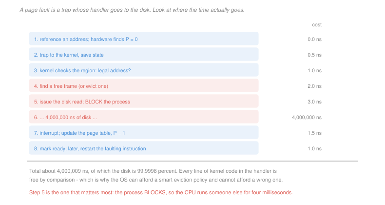

# Operating Systems · Lesson 3.3: Demand paging and page faults

> ⏱ ~15 min · Module 3: Memory and virtual memory · Builds on: [3.2 (the OS page table)](03-02-paging-and-the-os-page-table.md) · Unlocks: 3.4 (page replacement), 4.4 (I/O)

## Why this matters

Paging gives every process a private address space. Demand paging goes further and gives it a *bigger* one than the machine has, by keeping only the pages actually in use in memory and fetching the rest when touched.

This is the single largest lie the OS tells, and it works because programs touch a small fraction of their address space at any moment. It is also the most dangerous abstraction in the system, because the cost of getting it wrong is not a small slowdown. A memory access costs about 100 nanoseconds and a page fault costs about 4 milliseconds — a ratio of 40,000 — so a fault rate that sounds negligible is catastrophic.

The arithmetic in this lesson is the whole point. One fault per thousand accesses, which sounds rare, makes a program forty times slower.

## The idea

Start every page marked `P = 0` and bring it in when it is first touched. The trap that results is a **page fault**, and it is not an error — it is the mechanism.

Following the path, with the costs attached:

| step | roughly |
|---|---|
| 1. reference an address; the hardware finds `P = 0` and traps | 0 |
| 2. save state, enter the kernel | 0.5 µs |
| 3. the kernel consults its region record: is this address legal? | 1 µs |
| 4. find a free frame, or evict one to make room | 2 µs |
| 5. issue the disk read and **block the process** | 3 µs |
| 6. wait for the disk | **4,000 µs** |
| 7. the completion interrupt arrives; update the entry, `P = 1` | 1.5 µs |
| 8. mark the process ready; later, **restart the faulting instruction** | 1 µs |

Two things deserve emphasis.

**Step 5 blocks.** The process moves from running to blocked ([1.3](01-03-processes-and-the-address-space.md)) and the CPU runs someone else for four milliseconds. A page fault is not a stall; it is a scheduling event, and a machine with a healthy fault rate is not idle during them.

**Step 8 restarts, not resumes.** The faulting instruction is executed again from the beginning, which requires that no visible state has changed — an instruction must be restartable after faulting partway through. Hardware designers work hard for this, and instructions that write several locations (a block move, an auto-incrementing addressing mode) need special care, because a fault after the first write and before the second must not double the first one on restart.

**Minor and major faults.** Not every fault reaches the disk, and the distinction is the difference between a microsecond and a millisecond:

- A **minor** fault is satisfied without I/O — a first touch of anonymous memory satisfied with a zeroed frame, a copy-on-write copy, or a page that is still in the kernel's cache and merely needs remapping.
- A **major** fault requires reading from disk or a file.

The fault *count* in a system monitor is nearly meaningless without this split. Millions of minor faults are normal; thousands of major faults per second means the machine is in trouble.

## The formal version

> **Effective access time.** With fault probability $p$, memory access time $t_m$ and fault service time $t_f$:
> $$\mathrm{EAT} = (1-p)\,t_m + p\,t_f$$

In words: almost every access is fast, and the rare slow one dominates the average as soon as it is not rare enough.

Put numbers in: $t_m = 100$ ns, $t_f = 4$ ms $= 4\times 10^6$ ns.

| $p$ | EAT | slowdown |
|---|---|---|
| $10^{-3}$ | 4,100 ns | 41× |
| $10^{-4}$ | 500 ns | 5× |
| $10^{-5}$ | 140 ns | 1.4× |
| $2.5\times 10^{-6}$ | 110 ns | 1.1× |

To keep the slowdown under 10 percent you need fewer than **one fault per 400,000 accesses**. That number is the reason the rest of Module 3 exists: everything about replacement policy and working sets is an effort to keep $p$ on the right side of it.

Why demand paging works at all is **locality**: over a short window a program touches a small, clustered subset of its pages, so once that subset is resident the fault rate collapses. Locality is an empirical property of real programs, not a theorem, and a program without it — a random walk over a large array — defeats the whole scheme, which is exactly what P3 quantifies.

> **Prefetching.** On a fault, bring in neighbouring pages too, on the guess that they will be wanted.

The economics are lopsided in prefetching's favour when the guess is right, because the marginal cost of reading 128 KiB instead of 4 KiB from a disk is small — the seek dominates. When the guess is wrong you have paid transfer time and, worse, evicted pages that were being used. The system cannot tell which case it is in, which is why interfaces exist for the program to say (`madvise` with sequential or random hints).

## Picture

## Worked examples

**Example 1 — how good does the fault rate have to be.** A program executes $10^9$ memory accesses. Memory is 100 ns and a fault is 4 ms.

*At one fault per 10,000 accesses:*
$$\text{faults} = 10^5, \qquad \text{fault time} = 10^5\times 4\times 10^{-3} = 400 \text{ s}$$
$$\text{memory time} = 10^9\times 100\times 10^{-9} = 100 \text{ s}$$
Total 500 seconds, of which 80 percent is waiting for the disk.

*At one per million:*
$$\text{faults} = 10^3, \qquad \text{fault time} = 4 \text{ s}, \qquad \text{total} = 104 \text{ s}$$

A hundred-fold improvement in the fault rate turned a 500-second run into a 104-second one. And note where the ceiling is: even at zero faults the program takes 100 seconds, so beyond about one fault per million there is nothing left to win. **Optimising a fault rate that is already low is wasted effort**, which is why the interesting question is always whether you are on the wrong side of the cliff, not how far down the good side you are.

**Example 2 — the same file, two access patterns.** A program maps a 512 MiB file and touches every page once. Pages are 4 KiB, so 131,072 pages. The disk takes 4 ms to reach a random location and transfers at 200 MB/s.

*Sequential, no prefetching:* every page is a separate major fault.
$$131{,}072\times 4\text{ ms} = 524 \text{ s}$$

*Sequential, prefetching 32 pages per fault:* one fault per 32 pages, each reading 128 KiB.
$$\text{faults} = \frac{131{,}072}{32} = 4{,}096, \qquad \text{per fault} = 4\text{ ms} + \frac{131{,}072 \text{ B}}{200\times 10^6 \text{ B/s}} = 4 + 0.66 = 4.66\text{ ms}$$
$$4{,}096\times 4.66\text{ ms} = 19.1 \text{ s}$$

Twenty-seven times faster, from reading the same total bytes in larger pieces. The transfer time went up by 2.7 seconds in total and the seek time went down by 508.

*Random order, prefetching 32 pages per fault:* the 31 prefetched neighbours are not wanted next, so every page still faults, and each fault now also transfers 128 KiB.
$$131{,}072\times\left(4 + 0.66\right)\text{ ms} = 611 \text{ s}$$

**Worse than no prefetching at all**, by 17 percent, and that understates it — the prefetched pages also occupy frames, evicting pages that might have been reused. Prefetching is a bet on locality, and against a random pattern it loses every time.

## Watch out

- **You might think a high fault count means a memory problem.** Check the split first. A process starting up generates a burst of minor faults as it touches its pages for the first time, and that is free. Major faults are the ones that cost milliseconds.
- **You might think the process spins while the page is fetched.** It blocks, and the CPU runs something else. This is why a machine with a moderate fault rate can still show full CPU utilisation — and why utilisation alone will not tell you the memory system is in trouble.
- **You might think restarting the instruction is obviously fine.** It is a real constraint on instruction-set design. Any instruction that modifies state before it can fault must be able to undo it or defer it, which is why some architectures forbid faulting on certain complex instructions entirely.

## One-liner

> A page fault costs about forty thousand memory accesses, so demand paging works only because locality keeps the fault rate below roughly one in four hundred thousand — and everything else in this module is about staying there.

## Problems

**P1 (🟢)** Memory access 80 ns, page-fault service 5 ms. (a) Give the effective access time at a fault rate of $10^{-4}$ and the slowdown factor. (b) Give the maximum fault rate that keeps the slowdown under 20 percent. (c) Express that rate as "one fault per $N$ accesses" and state, for a program executing $2\times 10^8$ accesses, how many faults that permits.

**P2 (🟡)** Classify each event as a minor fault, a major fault, or no fault, and give the approximate cost of each: (a) the first store to a freshly `malloc`'d page; (b) a load from a page evicted to swap yesterday; (c) a store to a page shared with a child after `fork`; (d) a load from a page whose entry is valid and whose translation is in the TLB; (e) a load from a page that was unmapped by another thread one microsecond ago; (f) a load from a page that the kernel evicted from a process but still holds in its file cache. Then state which two of these are the reason a monitoring tool must report the two fault kinds separately.

**P3 (🔴, optional)** A 1 GiB file is mapped, pages are 4 KiB, the disk takes 5 ms to reach a random location and transfers at 250 MB/s. (a) Give the time to touch every page once, sequentially, with no prefetching and with 64-page prefetching. (b) The program instead touches 20,000 pages chosen uniformly at random. Give the time under both settings, and state which is faster. (c) The program can call `madvise` to declare its pattern. State what the kernel should do in each of the two cases and give the total time saved across both by declaring correctly, against always prefetching 64 pages.

Solutions

**P1** *(a) EAT at $p = 10^{-4}$.*
$$\mathrm{EAT} = (1 - 10^{-4})(80) + 10^{-4}(5\times 10^6) = 79.992 + 500 = \boxed{580 \text{ ns}}$$
$$\text{slowdown} = \frac{580}{80} = \boxed{7.25\times}$$

*(b) Rate for under 20 percent slowdown.* Require $\mathrm{EAT}\le 1.2\times 80 = 96$ ns:
$$80 + p\bigl(5\times 10^6 - 80\bigr)\le 96 \;\Longrightarrow\; p \le \frac{16}{4{,}999{,}920} = \boxed{3.2\times 10^{-6}}$$

*(c) In accessible terms.*
$$\frac{1}{3.2\times 10^{-6}} \approx \boxed{\text{one fault per } 312{,}500 \text{ accesses}}$$
$$2\times 10^8 \text{ accesses} \times 3.2\times 10^{-6} = \boxed{640 \text{ faults permitted}}$$

Six hundred and forty faults across two hundred million accesses. Stating the budget this way is the useful form — it makes clear that a program is allowed a handful of faults per second, not a handful per millisecond.

**P2**

| | classification | cost |
|---|---|---|
| (a) first store to a fresh `malloc`'d page | **minor fault** | a few µs — the kernel supplies a zeroed frame; no I/O |
| (b) load from a page swapped out yesterday | **major fault** | ~ms — the data must be read back from swap |
| (c) store to a page shared after `fork` | **minor fault** | a few µs — copy-on-write, one 4 KiB copy |
| (d) load with a valid entry and a TLB hit | **no fault** | ~1 ns — the fast path, no kernel involvement whatsoever |
| (e) load from a page unmapped a microsecond ago | **neither** — an invalid access | the kernel finds no region record and delivers a segmentation fault |
| (f) load from a page evicted but still in the file cache | **minor fault** | a few µs — the frame already holds the right data, so only the mapping is restored |

*Which two force the split.* **(b) and (f)** — they are indistinguishable from the process's point of view, both being a trap on a page that was evicted, and they differ in cost by about a thousand times. A tool reporting one "page fault" number cannot tell you whether the machine is fine or dying. (Row (f) is also why a process can be evicted and re-touched at almost no cost, and why the kernel's file cache is the difference between reclaiming memory and thrashing.)

**P3** *(a) Sequential, every page once.*
$$\text{pages} = \frac{2^{30}}{4096} = 262{,}144$$

**No prefetching:**
$$262{,}144\times 5\text{ ms} = \boxed{1{,}311 \text{ s}} \approx 21.8 \text{ minutes}$$

**64-page prefetching**, each fault transferring $64\times 4096 = 262{,}144$ bytes:
$$\text{faults} = \frac{262{,}144}{64} = 4{,}096, \qquad \text{per fault} = 5 + \frac{262{,}144}{250\times 10^6}\times 10^3 = 5 + 1.05 = 6.05 \text{ ms}$$
$$4{,}096\times 6.05\text{ ms} = \boxed{24.8 \text{ s}}$$

A factor of **53**. Fifty-three times, for reading identical bytes in a different granularity.

*(b) 20,000 random pages.*

**No prefetching:**
$$20{,}000\times 5\text{ ms} = \boxed{100 \text{ s}}$$

**64-page prefetching:** with 262,144 pages and 20,000 random draws, the chance that a prefetched neighbour is among the pages you will later want is small, and even then it will likely have been evicted first. Treat every touch as a fault that also drags in 256 KiB:
$$20{,}000\times 6.05\text{ ms} = \boxed{121 \text{ s}}$$

**No prefetching is faster**, by 21 seconds — 21 percent — and the figure is optimistic, since it ignores the 5 GB of useless data pushed through memory and the pages it evicts.

*(c) Declaring the pattern.* The kernel should **prefetch aggressively** on the sequential declaration and **not prefetch at all** on the random one, fetching exactly the faulting page.

$$\text{sequential: } 1{,}311 - 24.8 = 1{,}286 \text{ s saved against no prefetching}$$
$$\text{random: } 121 - 100 = 21 \text{ s saved against always prefetching}$$

Against a fixed policy of always prefetching 64 pages, declaring correctly saves **21 s**, all of it in the random case, since the sequential case already gets what it needs. Against a fixed policy of never prefetching, it saves **1,286 s**.

The asymmetry is the design lesson. Guessing "sequential" when the truth is random costs 21 percent; guessing "random" when the truth is sequential costs a factor of 53. So the default should be to prefetch, and the hint exists mainly to let the rare random-access program opt out — which is exactly what real kernels do, and it is why `madvise` with a random hint is a well-known optimisation for database and index workloads while the sequential hint is rarely needed.

## Flashback

**From Lesson 2.5 (deadlock):** Resource $R_1$ has two units, $R_2$ and $R_3$ have one each. P1 holds a unit of $R_1$ and waits for $R_2$; P2 holds $R_2$ and waits for $R_3$; P3 holds $R_3$ and waits for $R_1$. (a) The second unit of $R_1$ is held by P4, which needs nothing further. State whether the system is deadlocked and give the completion order. (b) Instead, P4 holds that unit and waits for $R_2$. State whether the system is deadlocked and give the wait chain. (c) Both cases contain the same cycle. State what a detection algorithm must do that a cycle test does not.

Solution

*(a) P4 needs nothing further — **not deadlocked**.*

| step | event | consequence |
|---|---|---|
| 1 | P4 finishes and releases its unit of $R_1$ | one unit of $R_1$ free |
| 2 | P3's request for $R_1$ is granted; P3 finishes | $R_3$ released |
| 3 | P2's request for $R_3$ is granted; P2 finishes | $R_2$ released |
| 4 | P1's request for $R_2$ is granted; P1 finishes | all free |

Completion order $\langle P_4, P_3, P_2, P_1\rangle$ — a safe sequence, found by the same "can anybody finish? assume they did, ask again" sweep as the Banker's safety check.

*(b) P4 waits for $R_2$ — **deadlocked**.*

Now both units of $R_1$ are held by blocked processes, so P3's request can never be granted:

$$P_1 \to R_2\ (P_2) \to R_3\ (P_3) \to R_1\ (P_1 \text{ and } P_4) \to \cdots$$

with P4 also waiting on $R_2$ held by P2. Every process holds something, every process waits for something held by another, and nothing will ever be released. All four Coffman conditions hold.

*(c) What detection must do.* It must **simulate completion rather than look for cycles**: repeatedly find a process whose outstanding request can be met from what is currently available, assume it finishes and releases everything it holds, and repeat. If every process can be retired this way there is no deadlock; whatever remains is deadlocked.

The two instances above have an identical cycle — same processes, same request and assignment edges — and differ only in whether a holder *outside* the cycle can finish. A cycle test cannot see that, because it inspects edges and not multiplicities. This is exactly the necessary-but-not-sufficient gap from [2.5](02-05-deadlock.md), and it is why the only case where cycle detection is enough is single-unit resources, where the two tests coincide.

## Connections

- **Backward:** the `P = 0` entry from [3.2](03-02-paging-and-the-os-page-table.md) is what triggers everything here, and the block in step 5 turns a running process into the blocked state defined in [1.3](01-03-processes-and-the-address-space.md), handing the CPU to the scheduler of [1.5](01-05-cpu-scheduling.md).
- **Forward:** step 4 — "find a free frame, or evict one" — is the one line this lesson skipped, and it is the whole of [3.4](03-04-page-replacement-and-thrashing.md). The disk model used in the examples is refined in [4.4](04-04-io-and-disk-scheduling.md), and the file cache behind minor fault (f) is the buffer cache described there.
- **Sideways:** the effective-access-time formula is the cache average-access-time calculation of [`computer-architecture` 4.1](../../computer-architecture/lessons/04-01-caches-and-locality.md) at a different scale — the same weighted average, with a miss penalty forty thousand times larger instead of a hundred. The prefetching trade is identical to a hardware prefetcher's, and identical again to a database's readahead: cheap when the guess is right, and paid for in evictions when it is wrong.
