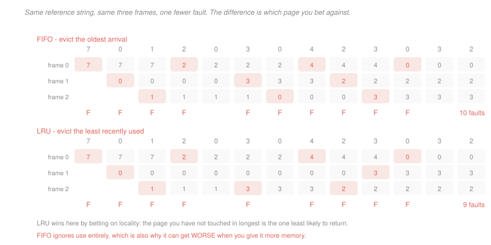

# Operating Systems · Lesson 3.4: Page replacement and thrashing

> ⏱ ~15 min · Module 3: Memory and virtual memory · Builds on: [3.3 (demand paging)](03-03-demand-paging-and-page-faults.md), [3.2 (the page table)](03-02-paging-and-the-os-page-table.md) · Unlocks: 4.4 (I/O), the course's memory story is complete after this

## Why this matters

[3.3](03-03-demand-paging-and-page-faults.md) walked the fault path and skipped one line: *find a free frame, or evict one*. When memory is full — which is the normal state of a healthy machine — that line is a decision, and it is made millions of times.

Get it right and the fault rate stays below one in four hundred thousand and demand paging is invisible. Get it wrong and you fall off a cliff so steep it has its own name. **Thrashing** is not a slowdown; it is a system doing almost nothing while looking completely busy, and the last part of this lesson shows that one process too many can take a machine from 92 seconds of work to 1,600.

## The idea

Four policies, in increasing order of how much they know:

**FIFO.** Evict the page that arrived first. Trivially cheap, and it ignores use entirely — a page referenced on every instruction is evicted when its turn comes, purely for being old.

**Optimal (OPT).** Evict the page that will be referenced furthest in the future. Provably minimal, and unimplementable, since it requires knowing the future. Its value is as a **bound**: it tells you how much of your fault rate is the policy's fault rather than the workload's.

**LRU.** Evict the page unused for the longest. The best practical approximation to OPT, on the grounds that recent use predicts future use — which is just locality restated. Exact LRU is too expensive to implement in a page table, because it needs a timestamp updated by hardware on *every* access.

**Clock (second chance).** The approximation everyone actually uses. Arrange the frames in a circle with a hand. To evict, look at the frame under the hand:

- if its **accessed** bit is 1, clear the bit and advance — the page gets a second chance;
- if it is 0, evict it.

That is LRU built from the single reference bit hardware is willing to provide ([3.2](03-02-paging-and-the-os-page-table.md)). It distinguishes "used since I last looked" from "not used", which is a coarse recency signal, and it turns out to be enough. Adding the dirty bit gives a second axis, preferring to evict clean pages because they need no write-back.

**Local versus global replacement.** On a fault, does the kernel evict from the faulting process's own frames or from anyone's? Global usually performs better and makes each process's fault rate depend on its neighbours' behaviour, which is uncomfortable but real. Local gives predictable per-process behaviour and cannot adapt when one process genuinely needs more.

## The formal version

> **Belady's anomaly.** Under FIFO, increasing the number of frames can *increase* the number of faults.

In words: more memory, more faults, from a policy that sounds sensible.

The witness is the reference string $1,2,3,4,1,2,5,1,2,3,4,5$: FIFO takes **9** faults with three frames and **10** with four. It is not a curiosity but a diagnosis — FIFO's eviction order has no relationship to which pages are needed, so a larger memory can hold a *different* wrong set.

> **Stack algorithms.** A policy is a stack algorithm if, for every reference string and every $n$, the set of pages resident with $n$ frames is a **subset** of the set resident with $n+1$ frames.

LRU is a stack algorithm: with $n$ frames it holds the $n$ most recently used pages, and the $n$ most recent are always among the $n+1$ most recent. A page that would be resident with $n$ frames is therefore resident with $n+1$, so every hit at $n$ is a hit at $n+1$, and the fault count is non-increasing in memory size. **LRU cannot exhibit Belady's anomaly, and neither can OPT**; FIFO can because its resident set is not determined by the reference string in this nested way.

> **The working set.** $W(t, \Delta)$ is the set of pages referenced in the interval $(t - \Delta,\, t]$. Its size $|W(t,\Delta)|$ is the process's memory demand right now.

In words: what a program has actually touched lately, which is the best available estimate of what it will touch next.

The policy that follows: give each process enough frames to hold its working set, and if the sum of the working sets exceeds the available frames, **reduce the degree of multiprogramming** — suspend a process entirely and swap it out.

> **Thrashing.** Every process's resident set is smaller than its working set, so every process faults constantly, and the CPU sits idle waiting for a disk that is saturated.

The mechanism is worth stating precisely, because the naive picture ("things get slower") misses why it is a cliff. The disk can service a fixed number of faults per second. If the aggregate demand exceeds that, execution proceeds only as fast as the disk can supply pages, and CPU utilisation collapses to the ratio of the two. Example 2 puts numbers to it.

The historical trap makes the point. Early systems observed low CPU utilisation and responded by admitting *more* processes — which shrank every resident set further, raised the fault rate, and drove utilisation lower still. The correct response is the opposite of the intuitive one.

## Picture

## Worked examples

**Example 1 — three policies, one string.** Reference string $7,0,1,2,0,3,0,4,2,3,0,3,2$ with three frames.

**FIFO** evicts by arrival order: 7 goes when 2 arrives, then 0, then 1, and so on.

$$\text{FIFO} = 10 \text{ faults}$$

**LRU** evicts by last use. At the reference to 2 (position 4) the residents are 7, 0, 1 and 7 is the least recently used, so 7 goes — the same choice. The policies diverge at position 6, where FIFO evicts 0 (oldest arrival) while LRU keeps it, because 0 was referenced at position 5.

$$\text{LRU} = 9 \text{ faults}$$

That single retained page is the whole difference, and it is exactly the locality bet: 0 is referenced again at position 7, so keeping it pays.

**OPT**, for the bound, takes 7 faults. So of LRU's 9 faults, 7 are unavoidable given three frames and 2 are the price of not knowing the future. That framing is more useful than the raw count — it says a better policy could win at most 22 percent here, so the fix is more frames, not a cleverer algorithm.

**Example 2 — the thrashing cliff.** A machine has 900 frames and one disk servicing a fault in 4 ms, so at most 250 faults per second. Each process has a working set of 100 pages, and measurements give:

| frames held | faults per second of CPU execution |
|---|---|
| 100 | 50 |
| 90 | 4,000 |

*Nine processes.* Each gets 100 frames, exactly its working set. Only one second of execution happens per second on one CPU, so the fault demand is 50 per second against a capacity of 250.

$$\text{disk utilisation} = \frac{50}{250} = 20\%, \qquad \text{CPU utilisation} \approx 100\%$$

Nine jobs needing 10 CPU-seconds each finish in about **90 seconds**.

*Ten processes.* Each now gets 90 frames — ten below its working set — and the fault rate rises by a factor of 80. The disk is now the bottleneck and execution can only proceed as fast as it can supply pages:

$$\text{CPU utilisation} = \frac{250 \text{ faults/s available}}{4{,}000 \text{ faults per CPU-second demanded}} = 0.0625 = 6.25\%$$

Ten jobs needing 10 CPU-seconds each is 100 CPU-seconds of work, delivered at 0.0625 CPU-seconds per second:

$$t = \frac{100}{0.0625} = \boxed{1{,}600 \text{ seconds}}$$

Eleven percent more work, seventeen times the elapsed time. And every symptom points the wrong way: the CPU is 94 percent idle, so a monitoring dashboard says the machine is underloaded, while the disk light is solid and the run queue is long. **The correct action is to suspend a process**, which returns 100 frames to the pool and puts the remaining nine back on the fast side of the cliff.

## Watch out

- **You might think LRU always beats FIFO.** It usually does and it is not guaranteed. On the string $4,3,2,1,4,3,5,4,3,2,1,5$ with three frames, FIFO takes 9 faults and LRU takes 10. LRU is a bet on locality, and a string with the wrong shape beats it.
- **You might think Clock is a cheap approximation that loses a lot.** It loses surprisingly little, because the information LRU has over Clock is fine-grained ordering *among* recently used pages, and that ordering rarely determines the outcome. What matters is used against not-used, and one bit carries that.
- **You might think thrashing means you need a faster disk.** A disk ten times faster moves the cliff, it does not remove it — the utilisation formula still divides capacity by demand, and demand rises without bound as resident sets shrink. The fix is to reduce demand, by admitting fewer processes or adding memory.

## One-liner

> Clock approximates LRU using the one bit hardware provides, LRU cannot suffer Belady's anomaly because its resident sets nest, and when the working sets no longer fit, the only cure is to run fewer processes.

## Problems

**P1 (🟢)** Reference string $4,3,2,1,4,3,5,4,3,2,1,5$ with three frames, all initially empty. (a) Give the fault count under FIFO, under LRU and under OPT. (b) State which of FIFO and LRU does better here. (c) Give the fraction of LRU's faults that OPT also incurs, and say what that implies about whether a better policy or more frames is the fix.

**P2 (🟡)** Reference string $1,2,3,4,1,2,5,1,2,3,4,5$. (a) Give the FIFO fault count with three frames and with four. (b) Give the LRU fault count with three frames and with four. (c) State which policy exhibits Belady's anomaly here, and prove that LRU cannot exhibit it on any string, using the resident-set characterisation.

**P3 (🔴, optional)** A machine has 1,200 frames and one disk servicing a page fault in 5 ms. Each process has a working set of 150 pages. Measured fault rates are 40 faults per CPU-second at 150 frames, 60 at 140 frames, and 5,000 at 130 frames. Each job needs 8 CPU-seconds. (a) Give the largest number of processes whose working sets all fit, and the elapsed time to finish that many jobs. (b) Give the CPU utilisation and elapsed time with 9 processes, whose frames divide as 133 each. (c) State the action that restores throughput, give the resulting elapsed time for the same nine jobs, and name the measurement that would mislead an operator into doing the opposite.

Solutions

**P1** *(a) The three counts on $4,3,2,1,4,3,5,4,3,2,1,5$, three frames.*

$$\text{FIFO} = \boxed{9}, \qquad \text{LRU} = \boxed{10}, \qquad \text{OPT} = \boxed{7}$$

The OPT trace, since it is the one worth seeing:

| position | ref | resident after | fault? | evicted, and why |
|---|---|---|---|---|
| 1–3 | 4, 3, 2 | 4 3 2 | F F F | filling empty frames |
| 4 | 1 | 4 3 1 | F | evict **2** — next used at position 10, furthest away |
| 5–6 | 4, 3 | 4 3 1 | hit hit | |
| 7 | 5 | 4 3 5 | F | evict **1** — next used at 11, furthest |
| 8–9 | 4, 3 | 4 3 5 | hit hit | |
| 10 | 2 | 3 5 2 | F | evict **4** — never used again |
| 11 | 1 | 5 2 1 | F | evict **3** — never used again |
| 12 | 5 | 5 2 1 | hit | |

*(b) Which does better.* **FIFO**, 9 against LRU's 10.

This is worth pausing on. LRU is the better policy on essentially every real workload and it is not a theorem, and this string is constructed so that recency mispredicts: the pages 4 and 3 are heavily reused early and then abandoned, so LRU protects them right up to the moment they stop mattering.

*(c) The unavoidable fraction.*
$$\frac{7}{10} = \boxed{70\%}$$

Seven of LRU's ten faults are compulsory in the sense that the optimal policy takes them too. So the very best conceivable replacement algorithm would save 3 faults out of 10 here. **More frames is the fix, not a cleverer policy** — and this ratio is the standard way to decide that question, because it separates the workload's intrinsic demand from the policy's error.

**P2** *(a) FIFO.*
$$\text{3 frames} = \boxed{9 \text{ faults}}, \qquad \text{4 frames} = \boxed{10 \text{ faults}}$$

The four-frame trace, which is the interesting one: after $1,2,3,4$ fill the frames, the references to 1 and 2 both hit, so 1 and 2 are the oldest arrivals when 5 faults. FIFO evicts 1, then 2 — precisely the two pages referenced next — and from that point every remaining reference misses.

*(b) LRU.*
$$\text{3 frames} = \boxed{10 \text{ faults}}, \qquad \text{4 frames} = \boxed{8 \text{ faults}}$$

Monotone, as it must be.

*(c) The anomaly and the proof.* **FIFO exhibits it**: 9 faults with three frames, 10 with four. LRU does not, and cannot.

*Proof.* Fix any reference string and consider the state after $t$ references. With $n$ frames, LRU's resident set is exactly the $n$ most recently referenced distinct pages (or all of them, if fewer than $n$ distinct pages have appeared). Write $S_n(t)$ for that set. Since the $n$ most recent distinct pages are among the $n+1$ most recent,

$$S_n(t) \subseteq S_{n+1}(t) \qquad \text{for every } t \text{ and every } n$$

Now take any reference at time $t+1$ that is a **hit** with $n$ frames. Then the referenced page is in $S_n(t)$, hence in $S_{n+1}(t)$, so it is a hit with $n+1$ frames as well. Every hit at $n$ is a hit at $n+1$, so the hit count is non-decreasing in $n$ and the fault count is non-increasing. $\blacksquare$

The property $S_n \subseteq S_{n+1}$ is what makes LRU a **stack algorithm**, and the proof uses nothing about LRU beyond it — so it applies equally to OPT, which holds a nested set for the same reason. FIFO's resident set is determined by arrival order rather than by the reference string's recent history, so no such nesting holds and the argument fails at the first line.

**P3** *(a) Processes that fit, and the elapsed time.*
$$\left\lfloor\frac{1{,}200}{150}\right\rfloor = \boxed{8 \text{ processes}}$$

Each holds its full working set and faults 40 times per CPU-second. With one CPU, execution generates at most 40 faults per second against a disk capacity of $1/0.005 = 200$ per second:
$$\text{disk utilisation} = \frac{40}{200} = 20\%, \qquad \text{CPU utilisation} \approx 100\%$$
$$8 \text{ jobs}\times 8 \text{ CPU-s} = 64 \text{ CPU-seconds} \;\Longrightarrow\; \boxed{\approx 64 \text{ s}}$$

*(b) Nine processes at 133 frames each.* That is below the 140-frame measurement, so use the 130-frame figure of 5,000 faults per CPU-second — a workload at 133 frames is on the wrong side of the knee, and the honest reading of the table is that the rate is of that order rather than the 60 measured at 140.

The disk can supply 200 faults per second, so execution proceeds at
$$\text{CPU utilisation} = \frac{200}{5{,}000} = 0.04 = \boxed{4\%}$$
$$9\times 8 = 72 \text{ CPU-seconds at } 0.04 \text{ CPU-s/s} \;\Longrightarrow\; t = \frac{72}{0.04} = \boxed{1{,}800 \text{ s}}$$

Twelve percent more work, twenty-eight times the elapsed time. Note how narrow the margin was: 133 frames against a 150-page working set is a shortfall of 11 percent, and it multiplies the fault rate by 125.

*(c) The action, the result, and the misleading measurement.* **Suspend one process and swap it out**, returning to eight resident processes at 150 frames each. The ninth job runs after one of the others finishes.

$$\text{eight jobs at full speed} = 64 \text{ s}, \qquad \text{then the ninth alone} = 8 \text{ s}$$
$$\boxed{\approx 72 \text{ s}}$$

Against 1,800 seconds — a factor of 25, from running *fewer* things at once.

*The misleading measurement:* **CPU utilisation**. At 4 percent it reads as a badly underloaded machine, and the instinctive response to an idle CPU is to admit more work — which shrinks every resident set further, raises the fault rate again, and drives utilisation lower. Early operating systems made exactly this mistake, and the modern instrument that avoids it is to watch the **page-fault rate** or the disk queue alongside utilisation: idle CPU with a saturated disk means thrashing, and idle CPU with an idle disk means genuinely no work.

## Flashback

**From Lesson 3.2 (paging and the OS page table):** (a) Name the page-table bit the Clock algorithm reads and the one it writes, and state who else writes each. (b) A 64-bit machine uses 48-bit virtual addresses, 4 KiB pages and 8-byte entries, with a four-level table splitting the page number into four 9-bit fields. Give the coverage of one table at each level, and the number of tables needed by a process using one contiguous 2 MiB region. (c) Give the size of the flat table the same machine would need, and state in one sentence why it is not merely expensive.

Solution

*(a) The bits Clock touches.* Clock **reads and clears the accessed bit**, `A`. It writes only by clearing.

Who else writes each: the **hardware sets `A`** on any reference and never clears it, so the two form a sampling loop — the hardware reports "touched since you last asked" and the kernel asks by clearing. Clock also often **reads the dirty bit** `D`, likewise set by hardware, to prefer evicting clean pages that need no write-back. The kernel clears `D` when it writes the page out.

*(b) Coverage and tables needed.* With 4 KiB pages the offset is 12 bits, leaving 36 bits of page number split as $9+9+9+9$. Each table has $2^9 = 512$ entries.

| level | each entry covers | one table covers |
|---|---|---|
| 4 (leaf) | 4 KiB | $512\times 4\text{ KiB} = 2 \text{ MiB}$ |
| 3 | 2 MiB | 1 GiB |
| 2 | 1 GiB | 512 GiB |
| 1 (root) | 512 GiB | 256 TiB |

A contiguous 2 MiB region is covered by exactly **one leaf table**, provided it is 2 MiB aligned, and one table at each level above it:

$$1 + 1 + 1 + 1 = \boxed{4 \text{ tables}} = 4\times 4\text{ KiB} = 16 \text{ KiB}$$

(An unaligned region would straddle two leaf tables and need five.) That 2 MiB coverage figure is also exactly why huge pages are 2 MiB on this architecture — a huge page is a level-3 entry that maps its whole span directly instead of pointing at a leaf table.

*(c) The flat table.*
$$2^{36}\text{ entries}\times 8\text{ B} = 2^{39} = \boxed{512 \text{ GiB per process}}$$

It is not merely expensive: the table would be **far larger than the memory it describes**, and larger than most machines' entire physical address space, so it could not be stored anywhere even for a single process. On a 32-bit machine the flat table was a bad trade at 4 MiB; at 48 bits it is not a trade at all, which is why every 64-bit architecture uses multi-level tables and none offers a flat option.

## Connections

- **Backward:** the accessed bit that Clock samples is hardware's contribution from [3.2](03-02-paging-and-the-os-page-table.md), and the 4 ms fault cost that makes all of this matter was priced in [3.3](03-03-demand-paging-and-page-faults.md). Suspending a process to end thrashing is admission control, the same idea that bounded the philosophers in [2.4](02-04-classic-synchronization-problems.md).
- **Forward:** [4.4](04-04-io-and-disk-scheduling.md) schedules the disk that thrashing saturates, and the buffer cache described there is managed with these same policies. Clock is also how the file cache decides what to drop.
- **Sideways:** replacement policy is the identical problem to cache replacement in [`computer-architecture` 4.2](../../computer-architecture/lessons/04-02-associativity-misses-write-policy.md), one level down and with a miss penalty forty thousand times smaller — which is exactly why hardware settles for pseudo-LRU while the OS can afford to think. The thrashing cliff is a queueing phenomenon: the disk's utilisation crosses 1 and waiting time diverges, the same blow-up [`operations-research` 4.2](../../operations-research/lessons/04-02-the-mm1-queue.md) derives for the M/M/1 queue.
