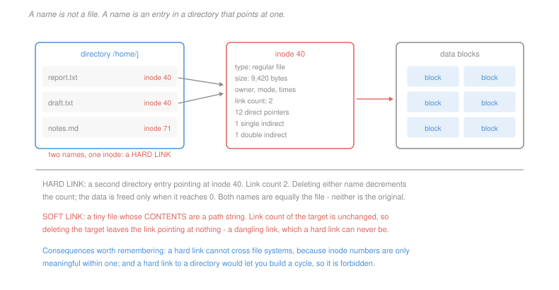

# Operating Systems · Lesson 4.1: Files, directories and inodes

> ⏱ ~15 min · Module 4: File systems, I/O and virtualization · Builds on: [1.3 (the open-file table)](01-03-processes-and-the-address-space.md) · Unlocks: 4.2 (disk allocation), 4.3 (journaling)

## Why this matters

A file is the OS's second great abstraction, after the process. A disk offers numbered blocks of fixed size, with no notion of a name, a size in bytes, or an owner. Everything you think of as a file is software.

The design decision that organises all of it is one most people never notice: **a name is not a file**. The name lives in a directory and the file lives somewhere else, and prying those apart explains hard links, why `mv` within a file system is instantaneous, why deleting an open file does not free its space, and why you cannot hard-link across mount points.

## The idea

Three separate things, easily confused:

- The **inode** is the file: its type, size, owner, permissions, timestamps, link count, and the pointers to its data blocks. It has a number, unique within the file system, and **no name**.
- A **directory** is an ordinary file whose contents are a list of pairs: a name and an inode number. Nothing else.
- A **path** is a route through directories, resolved one component at a time.

So `/home/j/report.txt` is resolved by reading the root directory to find the inode number of `home`, reading that inode to find its data blocks, reading them to find `j`, and so on. Every component costs a lookup, which is why deep paths are slower and why the kernel keeps a cache of recently resolved names.

Once the separation is clear the consequences follow mechanically:

**A hard link** is a second directory entry pointing at the same inode. The inode's **link count** records how many entries refer to it, and `unlink` decrements it. The data is freed only when the count reaches zero. Neither name is "the original" — they are indistinguishable, because the inode does not know its own names.

**A soft (symbolic) link** is a small file whose *contents* are a path string. Resolving it means resolving that string. The target's link count is untouched, so deleting the target leaves the link pointing at nothing — a **dangling** link, which a hard link can never be.

**Renaming within a file system** rewrites a directory entry and touches no data at all, whatever the file's size. Renaming across file systems is a copy and a delete, because the inode cannot move.

**Deleting an open file** decrements the link count to zero, and the file system frees the blocks only when the *open count* also reaches zero. That is why a running program's log file can be deleted while the space stays occupied until the process exits — a fact that has confused every system administrator at least once.

## The formal version

> **The three-level descriptor structure.** A file descriptor indexes a **per-process descriptor table**; each entry points at an **open file description**, which holds the current offset and access mode; each description points at an **inode**.

In words: three tables, and each level can be shared independently.

| shared by | what is shared | consequence |
|---|---|---|
| `fork`, `dup` | the open file description | the offset is shared, so writes interleave rather than overwrite ([1.3](01-03-processes-and-the-address-space.md) P3) |
| two `open` calls on one path | only the inode | separate offsets, so writes collide at the same position |
| a hard link | only the inode | two names, one file, one link count of 2 |

Two prohibitions that fall directly out of the design:

> **A hard link cannot cross file systems.** A directory entry stores an inode *number*, which is meaningful only within the file system that assigns it. Number 40 exists on every mounted file system and means something different on each.

> **A hard link to a directory is forbidden** (except the `.` and `..` the file system maintains itself). Two reasons, and both are fatal. It would allow a **cycle** in the directory graph, so path resolution and any recursive traversal could loop forever. And reference counting cannot reclaim a cycle: a directory linked into itself keeps its own count above zero after the last external name is removed, so the space is never freed and is no longer reachable.

That second reason is worth recognising as a general fact rather than a file-system quirk: **reference counting cannot collect cycles**, which is exactly why languages using it need a cycle collector and why the file system forbids the shape instead.

## Picture



## Worked examples

**Example 1 — tracking a link count.** Start with `a.txt`, inode 40, link count 1, holding 8 KiB of data.

| operation | link count of inode 40 | notes |
|---|---|---|
| `ln a.txt b.txt` | 2 | one new directory entry, no data copied |
| `ln -s a.txt c.txt` | 2 | unchanged — `c.txt` is a *different* inode, of type symlink, count 1 |
| `rm a.txt` | 1 | data intact, reachable as `b.txt`; **`c.txt` now dangles** |
| `mv b.txt d.txt` | 1 | a rename, not a new link; the entry is rewritten in place |
| `rm d.txt` | 0 | the last name is gone, so the 8 KiB is freed |

The row that catches people is the third. Removing `a.txt` broke the soft link and left the hard link perfectly healthy, even though `a.txt` was the name the soft link was made from. Soft links refer to *names*; hard links refer to *files*.

**Example 2 — the cost of resolving a path.** Reading `/home/j/src/main.c` with nothing cached, on a file system where each inode read and each directory data-block read is one disk access.

| step | access |
|---|---|
| read the root inode (its number is known by convention) | 1 |
| read the root's data block, find `home` | 2 |
| read `home`'s inode | 3 |
| read `home`'s data block, find `j` | 4 |
| read `j`'s inode | 5 |
| read `j`'s data block, find `src` | 6 |
| read `src`'s inode | 7 |
| read `src`'s data block, find `main.c` | 8 |
| read `main.c`'s inode | 9 |
| read the first data block of `main.c` | 10 |

**Ten disk accesses to read the first byte**, of which nine are pure navigation, at roughly 4 ms each — 40 ms to open a file. This is why every operating system caches directory lookups aggressively, and why the cache hit rate on that structure is one of the numbers that decides how a file system feels. The cost is $2d + 2$ accesses for a path of depth $d$, so it grows linearly in path depth — one more reason directory hierarchies are shallow in practice.

## Watch out

- **You might think a file has a name.** It has a link count. Zero, one or fifty names may refer to it, and it knows only how many.
- **You might think deleting a file frees its space.** It frees the space when both the link count and the open count reach zero. `rm` on a file a process still holds open reclaims nothing until that process exits, which is the standard reason a disk stays full after a cleanup.
- **You might think a symlink is a lightweight hard link.** They are almost opposites. A symlink can cross file systems, can point at a directory, and can dangle; a hard link can do none of those and can never be broken by changes elsewhere.

## One-liner

> The inode is the file and the directory entry is only a name for it, and hard links, instant renames and undead deleted files are all the same consequence of keeping the two apart.

## Problems

**P1 (🟢)** `notes.md` is created with inode 71 and 12 KiB of data. Give the link count of inode 71 after each step, and state whether the data is still reachable and by what name: (a) `ln notes.md keep.md`; (b) `ln -s keep.md alias.md`; (c) `rm notes.md`; (d) `ln keep.md archive.md`; (e) `rm keep.md`; (f) `rm archive.md`. Then state at which step `alias.md` stops working.

**P2 (🟡)** A file system takes one disk access for each inode read and one for each directory data block, at 4 ms each. (a) Give the accesses and the time to open `/var/log/app/2026/09/today.log` with nothing cached. (b) A name cache holds the resolved inode numbers for every directory in the path but no data blocks or inodes. Give the accesses now. (c) The application opens 500 files in that same directory in a loop. Give the total accesses with no cache and with a name cache, and state which component of the cost the cache removes.

**P3 (🔴, optional)** (a) Give a two-command sequence after which a hard link keeps working and a soft link to the same original name does not, and one after which the reverse holds. (b) A file system permits hard links to directories. Give the two-command sequence that creates an unreclaimable cycle, and state what the link counts are afterwards and why the space is never freed. (c) Name the general principle from (b) and one other system where it forces the same design choice.

<details>
<summary>Solutions</summary>

**P1**

| step | link count of 71 | data reachable as |
|---|---|---|
| start | 1 | `notes.md` |
| (a) `ln notes.md keep.md` | **2** | `notes.md`, `keep.md` |
| (b) `ln -s keep.md alias.md` | **2** | unchanged — `alias.md` is a separate inode of its own, count 1 |
| (c) `rm notes.md` | **1** | `keep.md` (and through `alias.md`, which resolves to `keep.md`) |
| (d) `ln keep.md archive.md` | **2** | `keep.md`, `archive.md` |
| (e) `rm keep.md` | **1** | `archive.md` only |
| (f) `rm archive.md` | **0** | not reachable; the 12 KiB is freed |

*`alias.md` stops working at step (e).* It stores the string `keep.md`, so it works for as long as a directory entry with that name exists — through step (d), and not after (e). Notice what it does **not** depend on: the data survived step (e) perfectly well under the name `archive.md`, and the soft link was broken anyway. It tracks the name it was given, nothing more.

**P2** *(a) Cold resolution of `/var/log/app/2026/09/today.log`.* The path has depth 6 counting the file, so five intermediate directories plus the root.

| component | inode read | data read |
|---|---|---|
| root | 1 | 1 |
| `var` | 1 | 1 |
| `log` | 1 | 1 |
| `app` | 1 | 1 |
| `2026` | 1 | 1 |
| `09` | 1 | 1 |
| `today.log` | 1 | — (opening does not read data) |

$$\text{accesses} = 6\times 2 + 1 = \boxed{13}, \qquad 13\times 4\text{ ms} = \boxed{52 \text{ ms}}$$

*(b) With a name cache holding the resolved inode numbers.* The number of `today.log` is not cached — only the directories are — so the walk is skipped entirely and only the target's inode must be read:
$$\boxed{1 \text{ access}, \; 4 \text{ ms}}$$

*(c) Five hundred files in the same directory.*
$$\text{no cache: } 500\times 13 = \boxed{6{,}500 \text{ accesses}} = 26 \text{ s}$$
$$\text{name cache: } 500\times 1 = \boxed{500 \text{ accesses}} = 2 \text{ s}$$

*What the cache removes:* the **path-walk cost**, which is per-open and identical every time, while the per-file inode read is irreducible. The walk is 12 of the 13 accesses, so the cache eliminates 92 percent of the work, and it does so because the *prefix is shared* across all 500 opens. That is the general shape of why name caches pay: applications open many files in few directories, so a small cache covers almost every lookup.

**P3** *Accept criterion for (a): two sequences, each with the surviving link named. Any sequence that renames or replaces the original name works for the first; any that changes the file's content or replaces the inode works for the second.*

*(a) When each survives.*

**Hard link survives, soft link breaks:**
```
ln  original.txt hard.txt        # hard.txt -> inode 40, count 2
ln -s original.txt soft.txt      # soft.txt contains the string "original.txt"
mv original.txt renamed.txt      # the entry is rewritten
```
`hard.txt` still reaches inode 40 and its data. `soft.txt` resolves the string `original.txt`, which no longer names anything — **dangling**. The hard link refers to the file; the soft link refers to a name that moved.

**Soft link survives, hard link becomes stale:**
```
ln  config.txt hard.txt          # both -> inode 40
ln -s config.txt soft.txt
mv new-config.txt config.txt     # replaces the entry, pointing at inode 91
```
`soft.txt` now resolves to the *new* file, inode 91, which is almost always what was wanted. `hard.txt` still points at inode 40 — the old content, which is now reachable only through it and which the link count keeps alive.

This second case is why configuration systems and package managers use symlinks: an atomic rename over the name updates every symlink at once, while hard links would each have to be re-made. The two are not ranked, they answer different questions — "which file" against "which name".

*(b) The unreclaimable cycle.*
```
mkdir /tmp/d                     # d: count 2  ('/tmp/d' and 'd/.')
ln /tmp/d /tmp/d/self            # d: count 3  ('/tmp/d', 'd/.', 'd/self')
```
Now remove the only external name:
```
rm /tmp/d                        # d: count 2  ('d/.' and 'd/self')
```
The count is **2 and can never fall further**, because the two remaining entries are inside the directory itself and there is no path from the root to reach them. The directory and everything under it is unreachable and permanently allocated — a storage leak that survives reboots and that `fsck` must find by a full reachability scan rather than by counting.

Path resolution is also broken: `/tmp/d/self/self/self/...` is a valid path of any length, so a recursive traversal never terminates.

*(c) The principle, and where else it bites.* **Reference counting cannot reclaim cycles.** A count records how many references exist, not whether any of them is reachable from a root, so a group of objects referring to each other keeps every count positive while the group as a whole is garbage.

The same fact forces the same choice elsewhere:
- **Memory management** in languages using reference counting — Python and Swift, and C++ `shared_ptr`. Python ships a separate cycle collector; C++ and Swift instead expose *weak* references and ask the programmer to break the cycle by hand, which is the direct analogue of a symlink.
- **Distributed garbage collection**, where cycles spanning machines are the standard hard case and systems usually fall back on periodic reachability tracing.

The file system's answer — forbid the shape that creates cycles — is the cheapest of the three, and it works only because directories are the sole way to build one.

</details>

## Flashback

**From Lesson 3.3 (demand paging and page faults):** A program processes a 256 MiB file. Pages are 4 KiB, a major fault costs 4 ms, a minor fault 3 µs, and a memory access 100 ns. (a) The program maps the file and touches every page once, with no prefetching. Give the number of major faults and the total fault time. (b) The kernel already holds the whole file in its cache from an earlier run. Give the fault classification, the count and the total time. (c) Give the effective access time in case (b) if the program makes $10^8$ accesses in total, and state whether the fault cost is worth worrying about.

<details>
<summary>Solution</summary>

*(a) Cold, mapped, no prefetching.*
$$\text{pages} = \frac{256\times 2^{20}}{4096} = 65{,}536$$
$$\text{major faults} = \boxed{65{,}536}, \qquad 65{,}536\times 4\text{ ms} = \boxed{262 \text{ s}}$$

Four and a half minutes to touch a quarter-gigabyte file, all of it disk latency.

*(b) With the file already in the kernel's cache.* Every page is present in memory but not mapped into this process's page table, so each first touch still traps — and the handler only has to install a mapping, with no I/O. These are **minor faults**:
$$65{,}536 \text{ minor faults}, \qquad 65{,}536\times 3\ \mu\text{s} = \boxed{0.197 \text{ s}}$$

A factor of **1,330** for the same number of faults, which is the entire reason the minor/major distinction is reported separately.

*(c) Effective access time over $10^8$ accesses.*
$$p = \frac{65{,}536}{10^8} = 6.55\times 10^{-4}$$
$$\mathrm{EAT} = (1-p)(100\text{ ns}) + p(3{,}000\text{ ns}) = 99.93 + 1.97 = \boxed{101.9 \text{ ns}}$$

A slowdown of **1.9 percent**, and no, it is not worth worrying about. Compare the same calculation with major faults, where $p(4\times 10^6) = 2{,}621$ ns would give an EAT of 2,721 ns and a 27-fold slowdown.

The point of running both: a fault rate of one in 1,500 accesses is catastrophic when the faults reach the disk and irrelevant when they do not. The rate alone tells you nothing — this is the same lesson as [3.3](03-03-demand-paging-and-page-faults.md) P2, and it is the reason the kernel works so hard to keep file pages cached even after the process that read them has exited.

</details>

## Connections

- **Backward:** the three-level descriptor structure explains the shared-offset behaviour first met in [1.3](01-03-processes-and-the-address-space.md), and the open-file table listed there as a shared property of a process is the middle level of it.
- **Forward:** [4.2](04-02-disk-allocation-and-free-space.md) opens the inode's pointer fields and computes what they can address. [4.3](04-03-crash-consistency-and-journaling.md) asks what happens when a crash lands between the directory-entry write and the inode write, which is exactly the multi-block update this lesson quietly assumed was atomic.
- **Sideways:** the name-to-object indirection is the same design as a symbol table, a DNS record, or a database's primary key against its row — and in every one of them the same questions arise about dangling references, renames and reclamation. The reference-counting cycle problem is [`programming-foundations` 4.2](../../programming-foundations/lessons/04-02-graphs-representations-and-traversal.md)'s reachability question, and detecting the leak requires a traversal rather than a count.
