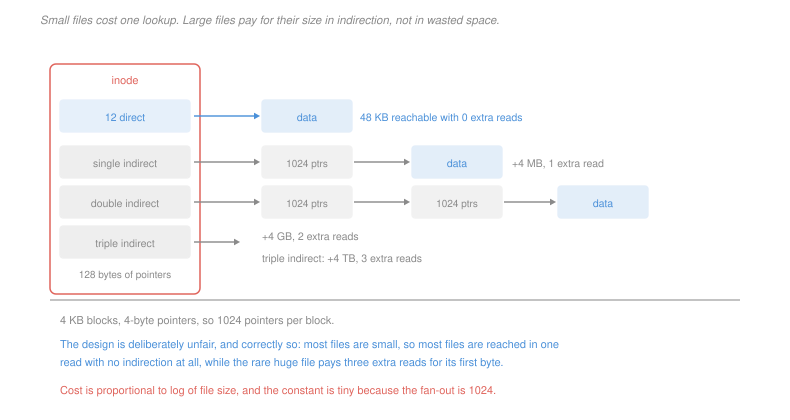

# Operating Systems · Lesson 4.2: Disk allocation and free space

> ⏱ ~15 min · Module 4: File systems, I/O and virtualization · Builds on: [4.1 (inodes)](04-01-files-directories-and-inodes.md), [3.1 (fragmentation)](03-01-address-spaces-and-allocation.md) · Unlocks: 4.3 (journaling), 4.4 (I/O)

## Why this matters

[4.1](04-01-files-directories-and-inodes.md) said the inode holds "pointers to the data blocks" and left it there. That phrase hides a design problem with a genuinely elegant solution, and the solution is why a file system can address a four-gigabyte file and still open a two-kilobyte one in a single disk access.

The problem is the same one as [3.1](03-01-address-spaces-and-allocation.md), one level down: you are allocating fixed-size units to objects of wildly varying size, and the file-size distribution is extreme. Most files are a few kilobytes; a few are gigabytes; the design must not be tuned for the average, because there is no average.

## The idea

Three ways to record where a file's blocks are:

**Contiguous.** Store a start block and a length. Reading block $i$ needs no lookup at all, and sequential reads are as fast as the disk goes. It reintroduces external fragmentation exactly as in [3.1](03-01-address-spaces-and-allocation.md), and a file cannot grow if its neighbour is in the way. Used today only where files are written once and never extended — optical media, and some log-structured designs.

**Linked.** Each block holds a pointer to the next. No external fragmentation, files grow freely, and **random access is hopeless**: reaching block 5,000 means reading 5,000 blocks. A pointer inside each block also makes the usable block size not a power of two, which is worse than it sounds. The FAT file system fixed the random-access problem by pulling all the pointers into one table held in memory, which works only while the table fits.

**Indexed.** Keep the pointers in a block of their own. Random access is one extra read, and no external fragmentation. The question becomes what to do when one index block is not enough.

The Unix answer is a **multi-level index**, and it is deliberately unfair:

| pointer | reaches | extra reads for the first byte |
|---|---|---|
| 12 direct | first 48 KB | 0 |
| 1 single indirect | next 4 MB | 1 |
| 1 double indirect | next 4 GB | 2 |
| 1 triple indirect | next 4 TB | 3 |

with 4 KB blocks and 4-byte pointers, so 1,024 pointers per block.

The unfairness is the design. A file under 48 KB — which is most files — is reached from the inode with no indirection at all. A file of four gigabytes pays three extra reads for its first byte, and there are very few such files. The cost grows like the logarithm of the file size with a base of 1,024, so three levels cover everything anybody has.

## The formal version

> **Maximum file size** for $d$ direct pointers, block size $B$, pointer size $p$, and $k = B/p$ pointers per block, with single, double and triple indirect pointers:
> $$S_{\max} = \bigl(d + k + k^2 + k^3\bigr)\,B$$

In words: each level of indirection multiplies the reach by the fan-out.

> **Which pointer covers block $i$.** Direct if $i < d$; single indirect if $d \le i < d+k$; double if $d+k \le i < d+k+k^2$; triple beyond that.

> **Disk accesses to read one byte at block $i$, nothing cached:** 1 for the inode, plus the number of indirect levels traversed, plus 1 for the data block.

**Free space.** Two representations:

- A **bitmap**: one bit per block, set if allocated. Finding a run of contiguous free blocks is a scan for consecutive zeros, which is fast and cache-friendly, and the whole map is small enough to keep in memory for a modest disk.
- A **free list**: unallocated blocks chained together. Allocation is O(1) and finding contiguity is impossible, so the file system loses its ability to place a file's blocks near each other — which matters enormously on a rotating disk.

Bitmaps won because **contiguity is the thing worth optimising**, and only the bitmap can see it.

**Block size** is the central parameter, and it pulls three ways at once: a larger block means a smaller bitmap and fewer pointers per file, and more internal fragmentation. P3 works the trade out and finds that the space-only optimum is smaller than the block size everybody actually uses — for a reason worth understanding.

## Picture

## Worked examples

**Example 1 — maximum file size and the cost of reaching a byte.** An inode has 12 direct pointers, one single indirect and one double indirect. Blocks are 4 KB and pointers are 4 bytes.

$$k = \frac{4096}{4} = 1{,}024 \text{ pointers per block}$$
$$\text{blocks addressable} = 12 + 1{,}024 + 1{,}024^2 = 12 + 1{,}024 + 1{,}048{,}576 = 1{,}049{,}612$$
$$S_{\max} = 1{,}049{,}612\times 4096 = 4{,}299{,}210{,}752 \text{ bytes} = 4.004 \text{ GiB}$$

Note how completely the double indirect pointer dominates: it contributes 1,048,576 of the 1,049,612 blocks, or 99.9 percent. Each level of indirection is worth a thousand times the one below it, so the count of direct pointers barely affects the maximum and entirely determines the common case.

*Reading the byte at offset 5 MB.*
$$i = \left\lfloor\frac{5\times 2^{20}}{4096}\right\rfloor = 1{,}280$$

Direct covers $0$–$11$, single indirect covers $12$–$1{,}035$, and $1{,}280 > 1{,}035$, so it lies in the **double indirect** region, at index $1{,}280 - 1{,}036 = 244$ within it — entry 244 of the *first* single-indirect block the double indirect points to.

| access | what is read |
|---|---|
| 1 | the inode |
| 2 | the double-indirect block |
| 3 | the single-indirect block it points to |
| 4 | the data block |

**Four accesses**, about 16 ms on a rotating disk. The first byte of a small file takes two.

**Example 2 — free space for a large disk.** A 4 TB disk with 4 KB blocks.

$$\text{blocks} = \frac{4\times 10^{12}}{4096} = 9.77\times 10^8, \qquad \text{bitmap} = \frac{9.77\times 10^8}{8} = 122 \text{ MB}$$

That fits in memory comfortably, and it is why the bitmap approach survives at this scale. Push to 512-byte blocks and it becomes 977 MB, which is a real cost on a machine with 8 GB; push to 64 KB blocks and it is 7.6 MB, which is free.

The bitmap alone therefore argues for large blocks — and it is the *smallest* of the three terms in the trade, which is why the argument loses.

## Watch out

- **You might think more direct pointers would help much.** Going from 12 to 24 adds 48 KB to a maximum of 4 GB, a change of 0.001 percent. What it changes is how many *files* avoid indirection entirely, which is a statement about the file-size distribution rather than about the maximum.
- **You might think linked allocation is fine because most access is sequential.** Most *bytes* are read sequentially and most *operations* are not, and one random read into a large linked file is unbounded. FAT's in-memory pointer table is the workaround, and it stops working the moment the disk is large enough that the table does not fit.
- **You might think a bigger block always wastes more.** It wastes more per file and less per byte of metadata. Whether the total rises depends on the file-size distribution, which is why the answer is a calculation and not a rule.

## One-liner

> The multi-level index is deliberately unfair — no indirection for the small files that are almost all of them, three extra reads for the rare huge one — and each level multiplies the reach by the number of pointers a block holds.

## Problems

**P1 (🟢)** An inode has 10 direct pointers, one single indirect, one double indirect and one triple indirect. Blocks are 8 KB, pointers are 8 bytes. (a) Give the pointers per block and the maximum file size, in bytes and in the nearest convenient unit. (b) State which pointer covers the block containing the byte at offset 100 MB, and give its index within that region. (c) Give the disk accesses to read that byte with nothing cached, and with the inode already in memory.

**P2 (🟡)** A file of 800 MB is stored on a file system with 4 KB blocks and 4-byte pointers, with the inode structure of Example 1. (a) Give the number of data blocks and the number of index blocks the file needs. (b) Give the metadata overhead as a percentage of the file's size. (c) Compare the accesses needed to read the byte at offset 700 MB under this scheme, under contiguous allocation, and under linked allocation, and state which comparison is the reason linked allocation is not used.

**P3 (🔴, optional)** A 4 TB disk holds 20 million files totalling 3 TB. Block pointers are 4 bytes, the free-space bitmap uses one bit per block, and file sizes are distributed so that a file wastes on average half a block. (a) Give the bitmap size, the total internal fragmentation, and the total pointer bytes, for block sizes of 1 KB, 4 KB and 64 KB. (b) Write the total space overhead as a function of the block size $b$ and find the minimising $b$. (c) The block size actually used is 4 KB, which your model says is four times too large. Name the cost your model omits and explain in two sentences why it pushes the real optimum upward.

Solutions

**P1** *(a) Pointers per block and maximum size.*
$$k = \frac{8192}{8} = \boxed{1{,}024 \text{ pointers per block}}$$
$$\text{blocks} = 10 + 1{,}024 + 1{,}024^2 + 1{,}024^3 = 10 + 1{,}024 + 1{,}048{,}576 + 1{,}073{,}741{,}824 = 1{,}074{,}791{,}434$$
$$S_{\max} = 1{,}074{,}791{,}434\times 8192 = 8.805\times 10^{12} \text{ bytes} = \boxed{8.008 \text{ TiB}}$$

The triple indirect pointer supplies 99.9 percent of it.

*(b) Which pointer covers offset 100 MB.*
$$i = \left\lfloor\frac{100\times 2^{20}}{8192}\right\rfloor = \left\lfloor\frac{104{,}857{,}600}{8192}\right\rfloor = 12{,}800$$

| region | block range |
|---|---|
| direct | 0 – 9 |
| single indirect | 10 – 1,033 |
| double indirect | 1,034 – 1,049,609 |

$12{,}800$ falls in the **double indirect** region, at index
$$12{,}800 - 1{,}034 = \boxed{11{,}766}$$
which is entry $11{,}766 \bmod 1{,}024 = 502$ of single-indirect block number $\lfloor 11{,}766/1{,}024\rfloor = 11$.

*(c) Accesses.*
$$\text{nothing cached: } 1 \text{ (inode)} + 2 \text{ (two index levels)} + 1 \text{ (data)} = \boxed{4}$$
$$\text{inode in memory: } \boxed{3}$$

**P2** *(a) Data and index blocks for 800 MB.*
$$\text{data blocks} = \frac{800\times 2^{20}}{4096} = 204{,}800$$

Now count index blocks. The first 12 blocks are direct. The next 1,024 come from one **single-indirect block** (1 index block). The remaining
$$204{,}800 - 12 - 1{,}024 = 203{,}764 \text{ blocks}$$
are reached through the double indirect, which needs
$$\left\lceil\frac{203{,}764}{1{,}024}\right\rceil = 199 \text{ single-indirect blocks}, \text{ plus } 1 \text{ double-indirect block}$$
$$\text{index blocks} = 1 + 199 + 1 = \boxed{201}$$
$$\text{data blocks} = \boxed{204{,}800}$$

*(b) Metadata overhead.*
$$\frac{201}{204{,}800} = 0.0981\% \approx \boxed{0.1\%}$$

About 804 KB of index for 800 MB of data. Indexed allocation is cheap; that is why the interesting costs in this lesson are the bitmap and fragmentation rather than the index.

*(c) Reading the byte at 700 MB, three schemes.*
$$i = \frac{700\times 2^{20}}{4096} = 179{,}200$$

| scheme | accesses | why |
|---|---|---|
| multi-level index | **4** | inode, double indirect, single indirect, data |
| contiguous | **2** | inode, then the data block at start $+\ i$ — the address is computed, not looked up |
| linked | **179,202** | inode, then follow the chain through blocks 0 to 179,200 |

*The comparison that condemns linked allocation:* **linked against indexed**, 179,202 accesses against 4 — a factor of nearly 45,000, and it grows linearly with the offset, so there is no file size at which it becomes acceptable. Contiguous beating indexed by 2 accesses to 4 is a real advantage and a small one, and it is bought with external fragmentation and the inability to grow, which is a bad trade. Linked allocation's failure is not a trade at all.

**P3** *(a) The three costs at three block sizes.* With $D = 4\times 10^{12}$ bytes of disk, $D_u = 3\times 10^{12}$ bytes used and $N = 2\times 10^7$ files:

$$\text{bitmap} = \frac{D}{8b}, \qquad \text{fragmentation} = \frac{Nb}{2}, \qquad \text{pointers} = \frac{4 D_u}{b}$$

| $b$ | bitmap | fragmentation | pointers | total |
|---|---|---|---|---|
| 1 KB | 488 MB | 10.24 GB | 11.7 GB | **22.4 GB** |
| 4 KB | 122 MB | 40.96 GB | 2.93 GB | **44.0 GB** |
| 64 KB | 7.6 MB | 655.4 GB | 183 MB | **655.6 GB** |

*(b) The function and its minimum.*
$$T(b) = \underbrace{\frac{D}{8} + 4D_u}_{\text{scales as }1/b}\cdot\frac{1}{b} + \frac{N}{2}\,b = \frac{1.25\times 10^{13}}{b} + 10^{7}\,b$$

Differentiate and set to zero:
$$T'(b) = -\frac{1.25\times 10^{13}}{b^2} + 10^7 = 0 \;\Longrightarrow\; b^* = \sqrt{\frac{1.25\times 10^{13}}{10^7}} = \sqrt{1.25\times 10^6} = \boxed{1{,}118 \text{ bytes}}$$

So the space-only optimum is about **1 KB**, and the table confirms it — 1 KB gives 22.4 GB against 4 KB's 44.0 GB.

*(c) The omitted cost.* **Transfer efficiency — the seek and rotational latency paid per block rather than per byte.**

On a rotating disk, reading a block costs about 4 ms of positioning plus a few tens of microseconds of transfer, so the positioning dominates completely and a block is nearly free once you have arrived. Halving the block size doubles the number of separate positioning operations for the same file, which roughly doubles the time to read it — and 20 GB of wasted space is worth far less than doubling every file read. The model above counts bytes and the real trade is dominated by *time*, which is why every general-purpose file system settled on 4 KB or larger and why file systems for large-file workloads use 64 KB or bigger extents despite the fragmentation the table above prices at 655 GB.

The general form is worth keeping: a space-only optimisation of a storage parameter will almost always choose a smaller unit than the right one, because the cost it cannot see is per-operation rather than per-byte.

## Flashback

**From Lesson 3.4 (page replacement and thrashing):** Reference string $1,2,3,2,4,1,5,2,1,2,3,4$ with three frames. (a) Give the fault count under FIFO and under LRU. (b) State whether either exhibits Belady's anomaly on this string at four frames, showing the counts. (c) Name the property of LRU that settles part (b) without any tracing.

Solution

*(a) Three frames.*

Both policies fault on the same references here:

| ref | 1 | 2 | 3 | 2 | 4 | 1 | 5 | 2 | 1 | 2 | 3 | 4 |
|---|---|---|---|---|---|---|---|---|---|---|---|---|
| FIFO | F | F | F | · | F | F | F | F | · | · | F | F |
| LRU | F | F | F | · | F | F | F | F | · | · | F | F |

$$\text{FIFO} = \boxed{9 \text{ faults}}, \qquad \text{LRU} = \boxed{9 \text{ faults}}$$

They coincide, which is common on a short string with little reuse — every page here recurs far enough away that recency and arrival order select the same victim each time.

*(b) At four frames.*
$$\text{FIFO} = 9, \qquad \text{LRU} = 7$$

**Neither exhibits the anomaly**, since neither count rises. But look at FIFO: 9 faults with three frames and 9 with four, so the extra frame bought it **nothing at all**. That is the anomaly's near miss and the same underlying defect — FIFO's choice of victim is unrelated to what the string needs next, so extra memory is as likely to be wasted as used. LRU converted the same extra frame into two saved faults.

The anomaly itself is possible for FIFO, not guaranteed, and most strings do not exhibit it; finding one takes construction, which is why $1,2,3,4,1,2,5,1,2,3,4,5$ is the string quoted everywhere.

*(c) The property that settles it without tracing.* **LRU is a stack algorithm**: the set of pages resident with $n$ frames is always a subset of the set resident with $n+1$. So every hit with three frames is a hit with four, the fault count is non-increasing in the number of frames, and LRU cannot exhibit the anomaly on *any* string — no trace required.

The same argument covers OPT and says nothing about FIFO, whose resident set is fixed by arrival order rather than by recent references, so the nesting fails and only a trace can settle a particular string. That asymmetry — a property that decides the question for one policy and forces a computation for another — is the practical value of knowing which policies are stack algorithms.

## Connections

- **Backward:** the inode whose pointer fields this lesson opens was introduced in [4.1](04-01-files-directories-and-inodes.md), and the fixed-versus-variable-unit argument is [3.1](03-01-address-spaces-and-allocation.md)'s, now applied to a disk where the per-operation cost is a thousand times larger.
- **Forward:** [4.3](04-03-crash-consistency-and-journaling.md) asks what happens when a crash lands between updating the bitmap and updating the inode, which is the multi-block update this lesson treats as atomic. [4.4](04-04-io-and-disk-scheduling.md) supplies the positioning-cost model that part (c) of P3 invokes.
- **Sideways:** the multi-level index is a B-tree flattened to a fixed depth, and [`programming-foundations` 3.2](../../programming-foundations/lessons/03-02-balanced-trees-the-idea.md) gives the general structure — high fan-out to keep depth small when each level costs a disk access. The same reasoning produces database index pages and the multi-level page table of [3.2](03-02-paging-and-the-os-page-table.md), which is literally the same data structure applied to memory instead of a disk.
