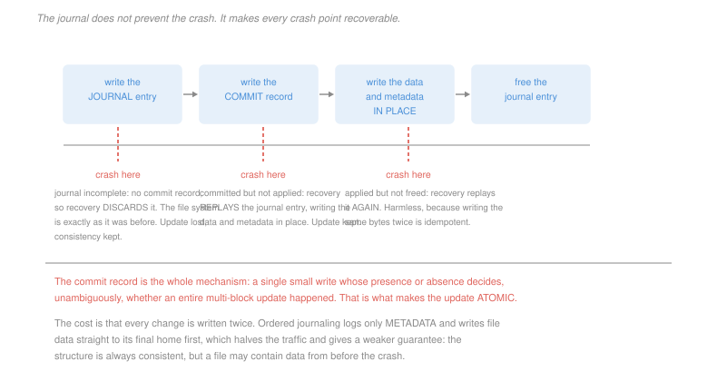

# Operating Systems · Lesson 4.3: Crash consistency and journaling

> ⏱ ~15 min · Module 4: File systems, I/O and virtualization · Builds on: [4.2 (disk allocation)](04-02-disk-allocation-and-free-space.md), [4.1 (inodes)](04-01-files-directories-and-inodes.md) · Unlocks: 4.4 (I/O)

## Why this matters

Appending one block to a file requires three separate disk writes: the data block itself, the free-space bitmap bit marking it allocated, and the inode recording the new size and pointer. The disk performs them one at a time, and the machine can lose power between any two.

There is no way to make three writes atomic on a device that does one at a time. So the file system does the next best thing: it arranges that **every possible crash point leaves a recoverable state**, and it does so by writing a record of its intention before acting on it.

The subject is worth care because one of the possible partial states is not merely lost work — it is a file that silently contains someone else's deleted data, and no consistency checker can detect it. Write ordering is the whole game, and P3 is where that becomes concrete.

## The idea

The three writes and what a crash between them leaves:

| written before the crash | resulting state |
|---|---|
| data only | consistent; the update is simply lost |
| bitmap only | a block marked allocated that no file references — a **space leak** |
| inode only | the inode points at a block the bitmap calls free, so it will be handed to another file — **two files sharing one block** |
| inode and bitmap, not data | fully consistent, and the file contains **whatever was in that block before** |

The last row is the one to remember. Every counter agrees, every check passes, and the file's new bytes are the previous occupant's deleted contents. A consistency checker cannot flag it, because nothing is inconsistent.

**The old answer: `fsck`.** After a crash, scan the entire file system and reconcile. Walk every inode, rebuild what the bitmap should say, fix link counts, move orphaned inodes to `lost+found`. It works for the first three rows, cannot see the fourth, and takes time proportional to the size of the file system — hours for a large disk, which is unacceptable when a server must come back in seconds.

**The modern answer: journaling**, which is write-ahead logging applied to a file system. Before changing anything in place, write to a dedicated journal what you are *about* to do. Then do it. If a crash intervenes, replay the journal.

The protocol:

1. Write the journal entry describing the update — the new bitmap block, the new inode, the data.
2. Write the **commit record**.
3. Write the data and metadata to their final locations.
4. Free the journal entry.

The commit record is the entire mechanism. It is a single small write whose presence or absence decides, unambiguously, whether a whole multi-block update happened. That is how a set of writes is made atomic on a device that cannot do it: not by making them simultaneous, but by making one small write the *witness* for all of them.

## The formal version

> **Recovery.** On restart, scan the journal. Replay every entry that has a valid commit record; discard every entry that does not.

Three crash points, three outcomes, all safe:

| crash | journal state | recovery does | result |
|---|---|---|---|
| during step 1 | entry incomplete, no commit | discard | the update never happened; the file system is exactly as before |
| between 2 and 3 | committed, not applied | **replay** — write the recorded blocks in place | the update happened |
| during step 3 | committed, partly applied | **replay** — write them all again | the update happened |

The third case relies on a property worth naming:

> **Idempotence.** Replaying a journal entry writes the same bytes to the same locations, so applying it twice is indistinguishable from applying it once.

This is what makes recovery safe without any record of how far step 3 got. The journal holds *values*, not operations — "block 4,721 becomes these 4,096 bytes", never "increment the size by 4,096" — and that choice is why replay can be blind.

**The cost, and the two modes.**

> **Data journaling** logs everything, so every byte is written twice.
>
> **Ordered journaling** logs only metadata, and writes file data straight to its final location **before** committing the metadata that points at it.

The ordering in the second is not an optimisation, it is the correctness condition. Writing the data first guarantees that any metadata which becomes visible points at data that is already there, which eliminates precisely the undetectable fourth row above. The weaker guarantee you accept is that a file may contain data from *before* the crash — its own old data, never someone else's.

**One more thing has to be true.** Disks reorder writes internally and acknowledge them while they sit in a volatile buffer, so "write the commit record after the entry" is a promise the drive can break. File systems therefore issue **write barriers** (or flush the drive's cache) between the steps, and `fsync` exists so an application can demand the same guarantee for its own data. Every one of these costs a real stall, which is why they are the first thing removed by anyone trying to make a benchmark look good, and the first thing to check when a database claims durability it does not have.

## Picture

## Worked examples

**Example 1 — the same crash, with and without a journal.** A process appends 4 KB to a file. The three writes are the data block D, the bitmap bit B and the inode I, and the crash lands after B and I but before D.

*Without a journal.* The bitmap says the block is allocated and the inode says it belongs to this file at this offset. Both are true. The block's contents are whatever the previous owner left there — possibly another user's deleted file. `fsck` walks every inode and every bit, finds perfect agreement, and reports the file system clean. **The leak is undetectable and permanent.**

*With ordered journaling.* The data write is issued first and must complete before the metadata is committed. A crash before that completes means the metadata was never committed, so recovery discards the journal entry and the file is unchanged — the append is lost, and nothing is exposed.

The difference is one ordering constraint. It costs nothing in bytes written and it converts a security failure into a lost write.

**Example 2 — pricing the two modes.** A workload writes 100 MB of file data, and the metadata touched by those writes amounts to 10 MB.

*Data journaling.* Everything goes to the journal and then to its final home:
$$2\times(100 + 10) = 220 \text{ MB}$$

*Ordered journaling.* Data goes once, directly; metadata goes twice:
$$100 + 2\times 10 = 120 \text{ MB}$$

$$\frac{220}{120} = 1.83\times \text{ more traffic for data journaling}$$

And the journal writes are **sequential**, landing in one contiguous region, while the in-place writes are scattered. On a rotating disk that makes the journal's half of the traffic much cheaper per byte than the raw ratio suggests — one of the reasons journaling costs less in practice than the byte count implies, and part of why some systems deliberately batch many updates into one journal transaction.

## Watch out

- **You might think journaling prevents data loss.** It prevents *inconsistency*. An uncommitted update is discarded, which means the work is lost — cleanly. Durability of a particular write is a separate guarantee, and it requires `fsync`.
- **You might think a consistent file system is a correct one.** Example 1's silent exposure is fully consistent. Consistency means the structures agree with each other, not that they describe what the user did.
- **You might think the journal makes `fsck` unnecessary.** It makes the routine case fast. A corrupted journal, a firmware bug or a bad sector still requires the full scan, which is why the tool still exists and why file systems still store enough redundancy to rebuild from.

## One-liner

> You cannot make three disk writes atomic, so you write down what you are about to do, commit it with one small write that acts as witness, and let recovery replay whatever was committed.

## Problems

**P1 (🟢)** A journaled file system uses the four steps of this lesson. For each crash point, state what recovery does and whether the update survives: (a) after two of the three journal blocks are written, no commit record; (b) immediately after the commit record is written; (c) after the inode has been written in place but before the bitmap has; (d) after all in-place writes but before the journal entry is freed.

**P2 (🟡)** A build system writes 600 MB of object files, touching 45 MB of metadata. (a) Give the total disk traffic under data journaling and under ordered journaling. (b) Give the ratio, and give the traffic under no journaling at all. (c) The journal is a 128 MB contiguous region and the file system commits one transaction per 30 MB of journal content. Give the number of transactions under each mode, and state one reason batching several updates into one transaction reduces traffic further.

**P3 (🔴, optional)** An un-journaled file system appends a block to a file with three independent writes: D (the data block), B (the bitmap bit) and I (the inode's size and pointer). (a) For each of the four partial outcomes — D only, B only, I only, and B and I without D — state what the file system looks like afterwards and whether `fsck` can repair it. (b) Identify the one outcome `fsck` cannot even detect, and say precisely why. (c) Give the ordering constraint that makes that outcome impossible, state which journaling mode enforces it, and say what weaker guarantee you accept in exchange.

Solutions

**P1**

| | recovery does | update survives? |
|---|---|---|
| (a) partial journal, no commit record | scans the journal, finds no valid commit for this entry, and **discards** it. Nothing was written in place, so there is nothing to undo | **no** — cleanly lost |
| (b) immediately after the commit record | finds a valid commit, **replays** the entry, writing the recorded blocks to their final locations | **yes** |
| (c) inode written in place, bitmap not | finds a valid commit, **replays the whole entry** — including the inode, which is rewritten with the same bytes | **yes** |
| (d) all in-place writes done, entry not freed | finds a valid commit and **replays it again**, writing bytes that are already there | **yes** |

Cases (c) and (d) are the ones that show why the design works. Recovery keeps no record of how far the in-place phase got, and does not need one: it replays everything committed, and because the journal stores values rather than operations, rewriting a block that already holds those values changes nothing. That is idempotence doing the work.

**P2** *(a) Total traffic.*
$$\text{data journaling} = 2\times(600 + 45) = \boxed{1{,}290 \text{ MB}}$$
$$\text{ordered journaling} = 600 + 2\times 45 = \boxed{690 \text{ MB}}$$

*(b) The ratio, and no journaling.*
$$\frac{1{,}290}{690} = \boxed{1.87\times}$$
$$\text{no journaling} = 600 + 45 = \boxed{645 \text{ MB}}$$

So ordered journaling costs only 7 percent more traffic than no journaling at all, while data journaling costs twice as much. That gap is why ordered mode is the default nearly everywhere: it buys almost all of the safety for almost none of the cost.

*(c) Transactions and the benefit of batching.*
$$\text{data journaling: } \frac{600 + 45}{30} = \boxed{22 \text{ transactions}} \qquad \text{ordered: } \frac{45}{30} = \boxed{2 \text{ transactions}}$$

(Only journal *content* counts, so ordered mode journals 45 MB of metadata and data mode journals all 645 MB.)

*Why batching reduces traffic further:* **repeated updates to the same metadata block collapse into one journal write.** A build that creates a thousand files in one directory touches that directory's inode and the bitmap block a thousand times; if all of it lands in one transaction, the journal records each affected block once, in its final state, rather than a thousand times. The effect is large in exactly the workloads that produce the most metadata, and it is the reason journal commit intervals are measured in seconds rather than milliseconds — the cost of the delay is bounded lost work, and the saving is a large constant factor.

**P3** *(a) The four partial outcomes.*

| written | what the file system looks like | can `fsck` repair it? |
|---|---|---|
| **D only** | the block holds the new data; the bitmap says free; no inode references it. Everything agrees | **nothing to repair** — the file system is consistent and the append is simply lost |
| **B only** | a block marked allocated that no inode references | **yes** — the scan finds a bit set with no referrer and clears it. A space leak, fully repairable |
| **I only** | the inode points at a block the bitmap says is free, so that block can be allocated to a second file | **yes, structurally** — the scan finds a referenced block marked free and sets the bit. The file's new block contains garbage, so the *data* is wrong, but the structure is repaired and no cross-linking results |
| **B and I, not D** | bitmap allocated, inode points at it, size updated. Every structure agrees | **no** |

*(b) The undetectable outcome.* **B and I without D.**

`fsck` works by checking the file system's structures against each other: does every allocated bit have a referrer, does every referenced block have its bit set, do link counts match the number of directory entries. In this outcome **every one of those checks passes**, because the metadata is exactly what it would be after a successful append.

What is wrong is the *content* of a data block, and there is no invariant relating a data block's bytes to anything else — a file's data can legitimately be any bytes at all. So the checker has nothing to compare against, and the file quietly contains whatever the block's previous owner left there, which may be another user's deleted file. The failure is a **confidentiality breach that presents as a successful write**, and it is far worse than the space leak `fsck` handles easily.

*(c) The ordering constraint and the trade.*

> **Write the data block to its final location, and wait for that write to complete, before committing any metadata that points at it.**

**Ordered journaling** enforces exactly this — it is the definition of the mode, and the reason for the name. Metadata is journaled; file data is not journaled but is ordered ahead of the metadata commit. Any metadata that recovery can make visible therefore points at data that has already reached the disk.

*The weaker guarantee accepted:* the file's data is **not** made atomic with the metadata. A crash can leave a file whose metadata is committed and whose data blocks hold the file's *own* previous contents at that offset — a stale write, never another file's data. Data journaling would eliminate even that, by logging the data too, at the cost of writing everything twice, which P2 prices at 1.87 times the traffic.

The distinction is the whole design: ordered mode gives up atomicity of *your* data and gives up nothing about *other people's*.

## Flashback

**From Lesson 4.1 (files, directories and inodes):** A process opens `log.txt` (empty) for writing, obtaining descriptor 3. It then calls `dup(3)` obtaining descriptor 4, and forks. (a) Give the number of descriptor-table entries, open file descriptions and inodes now involved, counting both processes. (b) The parent writes `AAAA` through descriptor 3 and the child writes `BBBB` through descriptor 4, with no synchronisation. Give the file's length and possible contents. (c) State what changes if the child instead calls `open("log.txt")` itself and writes through that descriptor.

Solution

*(a) The counts.*

| level | count | why |
|---|---|---|
| descriptor-table entries | **4** | descriptors 3 and 4 in the parent, and the copies of both in the child |
| open file descriptions | **1** | `open` created one; `dup` and `fork` both copy *references* to it, never the description itself |
| inodes | **1** | one file |

Four descriptors, one offset. That is the three-level structure of [4.1](04-01-files-directories-and-inodes.md) at its most compressed.

*(b) Both writes through the shared description.* Both descriptors refer to the same open file description, so both writes consume the same offset:
$$\text{length} = 8, \qquad \text{contents} \in \{\texttt{AAAABBBB},\ \texttt{BBBBAAAA}\}$$
Both writes survive; only the order is undetermined.

*(c) If the child opens the file itself.* A fresh `open` creates a **new open file description** with its own offset starting at 0, so the counts become 5 descriptor entries, 2 descriptions, still 1 inode — and both writes go to offset 0:
$$\text{length} = 4, \qquad \text{contents} \in \{\texttt{AAAA},\ \texttt{BBBB}\}$$
One write is entirely lost.

The moral is that the sharing level determines the outcome, and it is decided at the moment the descriptor is created rather than by anything the writes do. This is also why shell redirection into a group of commands appends correctly while two independently launched programs writing the same path clobber each other.

## Connections

- **Backward:** the three writes in question are exactly the bitmap of [4.2](04-02-disk-allocation-and-free-space.md) and the inode of [4.1](04-01-files-directories-and-inodes.md), and the multi-block update they form is the one both lessons quietly treated as a single step.
- **Forward:** [4.4](04-04-io-and-disk-scheduling.md) explains why the journal's sequential writes are so much cheaper than the scattered in-place ones, and why a write barrier costs what it does.
- **Sideways:** this is write-ahead logging, the same mechanism a database uses for transactions, with the commit record playing the same role. The idempotent-replay design reappears in every distributed log and every event-sourced system, and the discipline of "make one small write the witness for many" is the standard way to build atomicity on a medium that does not offer it.
