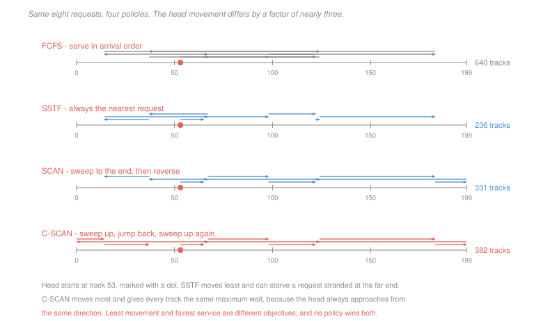

# Operating Systems · Lesson 4.4: I/O and disk scheduling

> ⏱ ~15 min · Module 4: File systems, I/O and virtualization · Builds on: [4.3 (journaling)](04-03-crash-consistency-and-journaling.md), [`computer-architecture` 4.4 (storage and I/O)](../../computer-architecture/lessons/04-04-storage-and-io.md) · Unlocks: 4.5 (virtualization)

## Why this matters

[`computer-architecture` 4.4](../../computer-architecture/lessons/04-04-storage-and-io.md) supplied the device model: seek time, rotational latency, transfer rate, and the choice between polling, interrupts and direct memory access. Take that as given.

What it did not cover is that the operating system has a **queue**. Several processes have outstanding requests, the disk serves one at a time, and the order is the OS's to choose — the same scheduling problem as [1.5](01-05-cpu-scheduling.md), for a resource where the cost of a bad decision is measured in milliseconds instead of microseconds and where, uniquely, **the cost of serving a request depends on which request you served last**.

That last property is what makes disk scheduling its own subject. No CPU scheduling policy can reduce the total work by reordering; here, reordering changes the total by a factor of three.

## The idea

The path from a program's `read` to the platter, and where the OS sits in it:

1. The system call ([1.2](01-02-system-calls-and-the-kernel-interface.md)) enters the kernel.
2. The **buffer cache** is checked. A hit returns immediately, with no device involvement at all — this is the same file cache behind the minor faults of [3.3](03-03-demand-paging-and-page-faults.md).
3. On a miss, a request is placed on the device's queue and the process **blocks**.
4. The **I/O scheduler** picks the next request from the queue and hands it to the driver.
5. The driver programs the device; the transfer proceeds by direct memory access.
6. A completion interrupt arrives; the handler wakes the process.

Two decisions in that path are the OS's alone, and both are policy:

**The buffer cache**, managed with the replacement policies of [3.4](03-04-page-replacement-and-thrashing.md), plus **readahead**: on detecting sequential access, fetch further blocks before they are asked for. It is the same bet as prefetching in [3.3](03-03-demand-paging-and-page-faults.md), with the same asymmetry — cheap when right, and it evicts useful blocks when wrong.

**The order of the queue.** On a rotating disk the head must physically travel, so the request you choose determines the cost of every subsequent choice.

| policy | rule | character |
|---|---|---|
| **FCFS** | arrival order | fair, and the head wanders |
| **SSTF** | nearest request first | least movement, and it **starves** the far ends |
| **SCAN** (elevator) | sweep to one end, reverse, sweep back | bounded wait, and the middle is served twice as often |
| **C-SCAN** | sweep one way, jump back, sweep the same way again | uniform waiting time for every track |
| **LOOK / C-LOOK** | as above, but reverse at the last request rather than the physical end | the versions actually implemented |

SSTF is the greedy choice and it fails in the way greedy choices usually fail: it optimises the next step and permits unbounded harm later. A stream of requests near the current head position keeps the head there, and a request at track 0 waits forever. This is the starvation of [2.4](02-04-classic-synchronization-problems.md), in a new setting, and the elevator policies exist to bound it.

## The formal version

> **Head movement** for a schedule visiting tracks $t_1, \ldots, t_n$ from a starting position $t_0$:
> $$M = \sum_{i=1}^{n}\left|t_i - t_{i-1}\right|$$

In words: add up the distances travelled, and the schedule chooses the order.

The classic instance, and it is worth knowing the four numbers: a 200-track disk, head at 53, pending requests 98, 183, 37, 122, 14, 124, 65, 67.

| policy | total movement |
|---|---|
| FCFS | 640 |
| SSTF | 236 |
| SCAN | 331 |
| C-SCAN | 382 |

A factor of 2.7 between the best and the worst, from ordering alone. And note that C-SCAN moves *more* than SCAN and is often preferred anyway, because SCAN's reversal means a track just behind the head waits nearly two full sweeps while a track just ahead waits almost nothing — C-SCAN gives every track the same maximum wait by always approaching from the same direction. **Least movement and fairest service are different objectives**, and no policy optimises both.

**Then solid-state drives changed the question.** With no head, seek distance is meaningless and SSTF, SCAN and C-SCAN all lose their point. What replaces them is a different asymmetry:

> Flash is read and written a **page** at a time (a few KB) but can only be erased a **block** at a time (a few MB). A page cannot be overwritten in place; it must be written elsewhere and the old copy marked invalid.

So the drive contains a **flash translation layer** — a mapping from logical block addresses to physical pages, plus a garbage collector that reclaims erase blocks by copying out the still-valid pages and erasing the rest. The drive is running a small log-structured file system, invisibly.

> **Write amplification.** The ratio of physical bytes written by the drive to logical bytes written by the host.

If the drive's physical capacity is a fraction $u$ occupied by valid data, a victim erase block holds on average $u$ valid pages that must be copied before it can be erased, and yields $1-u$ free pages:

$$\mathrm{WA} = \frac{1}{1-u}$$

At 50 percent full that is 2; at 90 percent it is 10; at 95 percent it is 20. **A nearly full SSD writes ten to twenty times as much as you asked it to**, which is why it slows down and wears out faster, and why drives reserve hidden capacity.

The operating system's part in this is **TRIM**: a command telling the drive which logical blocks the file system has freed. Without it the drive cannot know that a deleted file's pages are garbage — the file system marked a bitmap bit, which is invisible to the device — so it keeps copying dead data forever. P3 quantifies how badly.

## Picture

## Worked examples

**Example 1 — working one policy carefully.** Head at 53, requests 98, 183, 37, 122, 14, 124, 65, 67, tracks 0 to 199.

*SSTF*, always choosing the nearest pending request:

| from | nearest | distance | running |
|---|---|---|---|
| 53 | 65 | 12 | 12 |
| 65 | 67 | 2 | 14 |
| 67 | 37 | 30 | 44 |
| 37 | 14 | 23 | 67 |
| 14 | 98 | 84 | 151 |
| 98 | 122 | 24 | 175 |
| 122 | 124 | 2 | 177 |
| 124 | 183 | 59 | **236** |

Notice the shape: three cheap hops, then an 84-track jump. Greedy spent its cheap moves first and left the expensive one for the end, which is the standard signature of a greedy schedule — good total here, and no guarantee.

*C-SCAN*, sweeping upward, jumping to 0, sweeping upward again:
$$53 \to 65 \to 67 \to 98 \to 122 \to 124 \to 183 \to 199 \to 0 \to 14 \to 37$$
$$M = (199 - 53) + 199 + 37 = 146 + 199 + 37 = \boxed{382}$$

The 199-track return jump is a single fast seek across the whole disk, which on real hardware costs far less than 199 individual track-to-track moves — the arithmetic overstates C-SCAN's disadvantage, which is part of why it is used.

**Example 2 — where the buffer cache actually pays.** A server handles 5,000 file reads per second. Each read is 4 KB, a cache hit costs 2 µs and a miss costs 6 ms.

*With a 60 percent hit rate:*
$$\bar t = 0.6(2\ \mu\text{s}) + 0.4(6\ \text{ms}) = 1.2 + 2{,}400 = 2{,}401\ \mu\text{s}$$
$$\text{device load} = 5{,}000\times 0.4 = 2{,}000 \text{ requests/s}$$

against a disk that can serve roughly 160 random requests per second. The queue diverges; the server is broken.

*At a 99 percent hit rate:*
$$\bar t = 0.99(2) + 0.01(6{,}000) = 1.98 + 60 = 62\ \mu\text{s}, \qquad \text{device load} = 50 \text{ requests/s}$$

Comfortably inside the disk's capacity. The interesting figure is not the 39-fold improvement in average latency but the **fortyfold reduction in device load**, because that is what decides whether the queue is stable at all. This is the utilisation argument from [`operations-research` 4.2](../../operations-research/lessons/04-02-the-mm1-queue.md): below capacity the wait is finite, above it the queue grows without bound, and the cache's job is to keep the system on the right side of that line.

## Watch out

- **You might think a bigger buffer cache is always better.** It is memory taken from processes, so past the point where the hit rate flattens you are trading page faults ([3.4](03-04-page-replacement-and-thrashing.md)) for disk hits. The two caches compete for one pool, which is why modern kernels manage them together.
- **You might think disk scheduling is obsolete on an SSD.** Reordering by seek distance is. Merging adjacent requests, batching, and keeping the queue deep enough to use the drive's internal parallelism all still matter, and Linux ships schedulers designed for exactly that.
- **You might think TRIM is a tidiness feature.** It is the only channel through which the drive learns that data is dead. Without it, write amplification climbs toward the value implied by every block the drive has *ever* been asked to write, not by what is currently live.

## One-liner

> On a rotating disk the cost of a request depends on which one you served last, so ordering changes the total by a factor of three — and on flash the equivalent question is how much dead data the drive is still copying, which only the operating system can tell it.

## Problems

**P1 (🟢)** A 200-track disk, head at 100, pending requests 55, 58, 39, 18, 90, 160, 150, 38, 184. (a) Give the total head movement under FCFS and under SSTF. (b) Give it under SCAN and C-SCAN, both sweeping toward higher track numbers first and reaching track 199. (c) State which policy moves least and which gives the most uniform waiting time.

**P2 (🟡)** (a) Construct a request pattern, as a timed sequence of arrivals, under which SSTF starves a request at track 5 indefinitely while every other request is served promptly. (b) Give the worst-case wait, in units of head movement, for any request under C-SCAN on a 200-track disk with the head sweeping continuously. (c) State which of the three requirements from [2.1](02-01-race-conditions-and-critical-sections.md) SSTF violates and C-SCAN satisfies.

**P3 (🔴, optional)** A 1 TB solid-state drive with 12 percent hidden over-provisioning, so 1.12 TB physical. A file system holds 500 GB of live data, but 950 GB of distinct logical blocks have been written at some point during the drive's life. (a) Give the write amplification with TRIM working correctly, and the physical bytes written when the host writes 100 GB. (b) Give both with TRIM disabled. (c) The drive is rated for 600 TB of host writes at an amplification of 3. Give the effective host-write endurance in each of the two cases above, and state in one sentence why the operating system, not the drive, must supply this information.

Solutions

**P1** *(a) FCFS and SSTF from track 100.*

**FCFS** — arrival order 55, 58, 39, 18, 90, 160, 150, 38, 184:
$$|100-55| + |55-58| + |58-39| + |39-18| + |18-90| + |90-160| + |160-150| + |150-38| + |38-184|$$
$$= 45 + 3 + 19 + 21 + 72 + 70 + 10 + 112 + 146 = \boxed{498}$$

**SSTF** — always the nearest:

| from | to | distance |
|---|---|---|
| 100 | 90 | 10 |
| 90 | 58 | 32 |
| 58 | 55 | 3 |
| 55 | 39 | 16 |
| 39 | 38 | 1 |
| 38 | 18 | 20 |
| 18 | 150 | 132 |
| 150 | 160 | 10 |
| 160 | 184 | 24 |

$$\text{total} = 10+32+3+16+1+20+132+10+24 = \boxed{248}$$

*(b) SCAN and C-SCAN, upward first, reaching 199.*

**SCAN** — up through 150, 160, 184 to 199, then reverse down through 90, 58, 55, 39, 38, 18:
$$(199 - 100) + (199 - 18) = 99 + 181 = \boxed{280}$$

**C-SCAN** — up to 199, jump to 0, then up through 18, 38, 39, 55, 58, 90:
$$(199-100) + 199 + 90 = 99 + 199 + 90 = \boxed{388}$$

*(c) The two winners.* **SSTF moves least** at 248 tracks. **C-SCAN gives the most uniform waiting time**, because every track is approached from the same direction and therefore waits at most one full sweep plus the return, regardless of where it sits. SCAN's 280 is close to SSTF's total with a bounded wait, which is why LOOK — SCAN without the trip to the physical end — is what real drivers implement.

**P2** *Accept criterion for (a): a schedule in which requests keep arriving within a small neighbourhood of the head, forever, with the far request never becoming nearest. Any such pattern is correct.*

*(a) Starving track 5.* The head starts at track 100.

| time | arrival | head after service |
|---|---|---|
| 0 | track 5, and track 100 | serves 100 (distance 0) |
| 1 ms | track 102 | serves 102 — nearer than 5 |
| 2 ms | track 99 | serves 99 |
| 3 ms | track 103 | serves 103 |
| … | one request within 5 tracks of the head, every millisecond | … |

At every decision the pending set contains track 5 at a distance of roughly 95 and a fresh request at a distance under 5, so SSTF never chooses track 5. Every other request is served within a millisecond of arriving. The pattern is not adversarial in any exotic sense — it is what a database doing repeated small updates to one hot region looks like, which is why this starvation is observed rather than merely theorised.

*(b) Worst case under C-SCAN.* A request arriving just after the head has passed its track must wait for the head to complete the current upward sweep, jump back, and sweep up to it. In the worst case the head has just passed track 199 — or more precisely, a request just missed at the top waits for the return jump and a full sweep:
$$\text{worst wait} = 199 \text{ (return jump)} + 199 \text{ (full sweep)} = \boxed{398 \text{ tracks of movement}}$$

The important property is not the number but that it is a **constant**, independent of which track is requested and of what else arrives. Under SSTF the corresponding bound does not exist.

*(c) Which requirement.* SSTF violates **bounded waiting**; C-SCAN satisfies it.

Both provide the disk analogue of mutual exclusion, since the device serves one request at a time regardless of policy, and both provide progress, since neither ever sits idle with work pending. The distinguishing property is exactly the third one from [2.1](02-01-race-conditions-and-critical-sections.md): SSTF permits an unbounded number of later arrivals to be served ahead of a waiting request, and C-SCAN bounds it at one sweep. That is the same requirement the readers–writers solution failed in [2.4](02-04-classic-synchronization-problems.md), and the fix has the same shape — impose an order that arrivals cannot jump.

**P3** *(a) With TRIM working.* The drive knows which blocks are live, so the occupancy the garbage collector sees is the live data against physical capacity:
$$u = \frac{500}{1{,}120} = 0.446, \qquad \mathrm{WA} = \frac{1}{1-u} = \frac{1}{0.554} = \boxed{1.81}$$
$$100 \text{ GB written by the host} \;\Longrightarrow\; 100\times 1.81 = \boxed{181 \text{ GB physical}}$$

*(b) With TRIM disabled.* The drive has no way to learn that a deleted file's blocks are dead — the file system cleared a bitmap bit, which is a change to *data* the drive cannot interpret. So every logical block ever written is still considered valid:
$$u = \frac{950}{1{,}120} = 0.848, \qquad \mathrm{WA} = \frac{1}{1-0.848} = \boxed{6.59}$$
$$100 \text{ GB} \;\Longrightarrow\; \boxed{659 \text{ GB physical}}$$

A factor of 3.6 in wear and in write cost, for exactly the same workload, decided entirely by whether one command is issued.

*(c) Endurance.* The rating is 600 TB of host writes at an amplification of 3, so the drive's real budget is
$$600 \times 3 = 1{,}800 \text{ TB of physical writes}$$

Dividing by the actual amplification gives the host writes each case allows:
$$\text{with TRIM: } \frac{1{,}800}{1.81} = \boxed{996 \text{ TB}} \qquad \text{without: } \frac{1{,}800}{6.59} = \boxed{273 \text{ TB}}$$

Nearly four times the drive's life, from a command the file system sends when it frees a block.

*Why the OS must supply it:* **only the file system knows what "deleted" means.** Freeing a file changes a bitmap bit and an inode — ordinary writes to ordinary blocks, indistinguishable to the drive from any other data — and the drive is given no read or write to the freed blocks themselves, so nothing in its interface reveals that they are now garbage. TRIM exists precisely to add that missing channel, and it is the clearest case in the course of an abstraction boundary hiding information that the layer below genuinely needs.

## Flashback

**From Lesson 4.2 (disk allocation and free space):** An inode has 8 direct pointers, one single indirect and one double indirect. Blocks are 2 KB and pointers are 4 bytes. (a) Give the pointers per block and the maximum file size. (b) State which pointer covers the byte at offset 3 MB and give the disk accesses to read it with nothing cached. (c) The file system is changed to 8 KB blocks with the same inode structure. Give the new maximum file size and state the factor by which it grew.

Solution

*(a) Pointers per block and maximum size.*
$$k = \frac{2048}{4} = \boxed{512 \text{ pointers per block}}$$
$$\text{blocks} = 8 + 512 + 512^2 = 8 + 512 + 262{,}144 = 262{,}664$$
$$S_{\max} = 262{,}664\times 2048 = 537{,}935{,}872 \text{ bytes} = \boxed{513 \text{ MiB}}$$

*(b) The byte at 3 MB.*
$$i = \left\lfloor\frac{3\times 2^{20}}{2048}\right\rfloor = \left\lfloor\frac{3{,}145{,}728}{2048}\right\rfloor = 1{,}536$$

| region | blocks |
|---|---|
| direct | 0 – 7 |
| single indirect | 8 – 519 |
| double indirect | 520 – 262,663 |

$1{,}536 > 519$, so it is in the **double indirect** region, at index $1{,}536 - 520 = 1{,}016$, which is entry $1{,}016 - 512 = 504$ of single-indirect block number 1.

$$\text{accesses} = 1 \text{ (inode)} + 1 \text{ (double)} + 1 \text{ (single)} + 1 \text{ (data)} = \boxed{4}$$

*(c) With 8 KB blocks.*
$$k = \frac{8192}{4} = 2{,}048, \qquad \text{blocks} = 8 + 2{,}048 + 2{,}048^2 = 4{,}196{,}360$$
$$S_{\max} = 4{,}196{,}360\times 8192 = 3.44\times 10^{10} \text{ bytes} = \boxed{32.0 \text{ GiB}}$$
$$\frac{3.438\times 10^{10}}{5.379\times 10^{8}} = \boxed{63.9\times}$$

Quadrupling the block size multiplied the maximum by 64, not by 4. The reason is that the double-indirect term dominates and scales as $k^2 B$, and $k$ itself is proportional to $B$ — so that term grows as $B^3$, and $4^3 = 64$. **Block size enters the maximum file size cubically** when the deepest pointer is double indirect, which is the cheapest possible way to raise a file-size limit and exactly what file systems did as disks grew.

## Connections

- **Backward:** the device model — seek, rotation, transfer, DMA — is [`computer-architecture` 4.4](../../computer-architecture/lessons/04-04-storage-and-io.md)'s, and the buffer cache is managed with [3.4](03-04-page-replacement-and-thrashing.md)'s replacement policies. SSTF's starvation is [2.4](02-04-classic-synchronization-problems.md)'s failure mode at a different layer, and the sequential journal writes of [4.3](04-03-crash-consistency-and-journaling.md) are cheap for exactly the reason this lesson's movement arithmetic shows.
- **Forward:** [4.5](04-05-virtualization-and-containers.md) asks what happens when a guest operating system runs its own I/O scheduler on top of the host's, which is a case where two layers each optimising independently make things worse.
- **Sideways:** disk scheduling is a queueing problem with a sequence-dependent service time, which makes it a travelling-salesman variant rather than a simple queue — and the elevator policies are exactly the approximation you use when the optimal tour is too expensive to compute and requests keep arriving. [`operations-research` 4.2](../../operations-research/lessons/04-02-the-mm1-queue.md) supplies the stability condition that Example 2 turns on.
