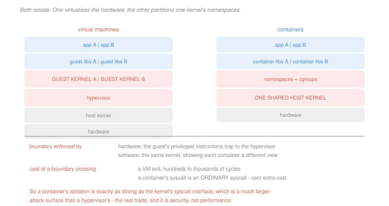

# Operating Systems · Lesson 4.5: Virtualization and containers

> ⏱ ~15 min · Module 4: File systems, I/O and virtualization · Builds on: [1.1 (kernel and user mode)](01-01-why-an-os-kernel-and-user-mode.md), [3.2 (page tables)](03-02-paging-and-the-os-page-table.md) · Unlocks: 4.6 (security)

## Why this matters

An operating system multiplexes hardware among processes. A **hypervisor** multiplexes hardware among *operating systems*, each of which believes it owns the machine — including the privileged instructions, the page tables and the devices.

A **container** does something that sounds similar and is completely different: it multiplexes one kernel's *namespaces* among groups of processes, so each group sees its own filesystem, process table and network stack while sharing the kernel underneath.

The distinction is not academic. It decides how much memory a service costs, how fast it starts, and — the part that gets skipped — how large an attack surface separates one tenant from another.

## The idea

**Trap and emulate.** Run the guest operating system in *user* mode. When it executes a privileged instruction, the hardware traps ([1.1](01-01-why-an-os-kernel-and-user-mode.md)), the hypervisor catches the trap, works out what the guest was trying to do, does it on the guest's behalf against a virtual copy of the machine state, and resumes. The guest is never told it is not the kernel.

That is the entire idea, and it works only if the hardware cooperates:

> **The Popek–Goldberg condition.** A machine is virtualizable by trap-and-emulate if every **sensitive** instruction — one that inspects or changes privileged state — is also **privileged**, and therefore traps when executed in user mode.

In words: anything that matters must fail loudly outside the kernel.

x86 famously violated this. Around seventeen instructions read privileged state and, in user mode, simply returned the wrong answer instead of trapping — a guest kernel asking "what mode am I in?" was told "user", silently, with no trap for the hypervisor to catch. Three responses followed, and all three are still in use:

- **Binary translation** — rewrite the guest's instruction stream on the fly, replacing the offending instructions with traps. What VMware shipped in 1999, and an impressive piece of engineering to avoid a hardware gap.
- **Paravirtualization** — modify the guest kernel to call the hypervisor deliberately instead of executing the instruction. Faster, and it requires a guest you are allowed to change.
- **Hardware support** — add a mode below the kernel's. Intel VT-x and AMD-V give the guest a genuine kernel mode inside a new outer container, so sensitive instructions either work directly or cause a **VM exit** to the hypervisor.

**Containers do none of this.** There is one kernel. What differs between containers is what that kernel *shows* each group of processes:

- **Namespaces** partition the names a process can see: its own process ids, mount table, network interfaces, hostname, user ids. Two containers each have a process 1, and neither can name the other's.
- **Control groups** partition the *amounts*: CPU shares, memory limits, I/O bandwidth. This is the resource-arbitration half of the OS's job from [1.1](01-01-why-an-os-kernel-and-user-mode.md), made per-group.

A container's system call is an ordinary system call. There is no extra layer to cross, so the CPU cost of the isolation is essentially zero — and its strength is exactly the strength of the kernel's system-call interface, which is a much larger surface than a hypervisor's.

## The formal version

> **Two-dimensional page-table walk.** With hardware virtualization the guest maintains its own page tables mapping guest-virtual to *guest-physical* addresses, and the hypervisor maintains a second set mapping guest-physical to host-physical. Both must be walked.

The cost compounds rather than adds. With a four-level guest table and a four-level host table, every guest page-table entry the hardware wants to read is named by a guest-physical address, which must itself be translated through all four host levels first:

| step | host accesses | guest access | subtotal |
|---|---|---|---|
| read guest level 1 entry | 4 | 1 | 5 |
| read guest level 2 entry | 4 | 1 | 5 |
| read guest level 3 entry | 4 | 1 | 5 |
| read guest level 4 entry | 4 | 1 | 5 |
| translate the resulting guest-physical data address | 4 | 1 (the data) | 5 |

$$\text{total} = 25 \text{ memory accesses}$$

of which 24 are page-table reads and one is the data — which is why the figure is quoted as 24 in some places and 25 in others. Against a single memory access on bare metal, or five on a non-virtualized four-level walk. **The TLB is what makes virtualization affordable**, exactly as it makes ordinary paging affordable in [`computer-architecture` 4.3](../../computer-architecture/lessons/04-03-virtual-memory-and-the-tlb.md), and a virtualized workload with a poor TLB hit rate suffers far more than the same workload on bare metal.

> **VM exit.** A transition from guest to hypervisor, caused by an instruction or condition the hypervisor has asked to intercept.

It is the hypervisor's equivalent of a system call and costs a comparable few hundred to a few thousand cycles. Reducing exits is the central performance problem in hypervisor design, and the reason a virtualized machine's CPU-bound work runs at near-native speed while its I/O-heavy work does not: computation causes no exits and every device interaction potentially causes several.

**The comparison, stated plainly:**

| | virtual machine | container |
|---|---|---|
| virtualizes | the hardware | the kernel's namespaces |
| guest runs | its own kernel | processes on the host kernel |
| boundary enforced by | hardware, via traps and VM exits | software, by one kernel |
| per-instance overhead | hundreds of megabytes | a few megabytes |
| start time | tens of seconds | under a second |
| can run a different OS | yes | no |
| attack surface between tenants | the hypervisor interface, small | the whole system-call interface, large |

## Picture

## Worked examples

**Example 1 — what actually happens on a privileged operation.** A guest process calls `write`, and the guest kernel programs a device register.

*Under a hypervisor.* The guest process traps into the *guest* kernel — an ordinary mode switch, no hypervisor involvement, full speed. The guest kernel then executes a store to what it believes is a device register. That address is intercepted, causing a **VM exit**; the hypervisor decodes the instruction, applies the effect to its emulated device, arranges the eventual completion, and resumes the guest. One system call, one or more VM exits.

*Under a container.* The process traps into the host kernel. That is the whole story. The kernel checks the container's mount namespace to decide which filesystem the descriptor refers to and its control group to decide whether the I/O is within budget, and proceeds. **No extra crossing exists**, because there is no extra layer.

The asymmetry is the point: a container's isolation costs nothing at run time because it is enforced by checks the kernel was already making, on data structures it already had.

**Example 2 — pricing 200 services.** A fleet runs 200 small services. A virtual machine costs 512 MB of guest kernel and base OS and takes 30 seconds to boot; a container costs 20 MB and starts in 0.3 seconds.

$$\text{VMs: } 200\times 512 \text{ MB} = 102.4 \text{ GB of pure overhead}$$
$$\text{containers: } 200\times 20 \text{ MB} = 4.0 \text{ GB}$$

A difference of 98 GB before a single service does any work — which on a 128 GB machine is the difference between running the fleet and not.

$$\text{restart the fleet, 10 at a time: VMs } \frac{200}{10}\times 30 = 600 \text{ s}, \qquad \text{containers } \frac{200}{10}\times 0.3 = 6 \text{ s}$$

Ten minutes against six seconds. That gap is why containers displaced virtual machines for deploying services, and it is a *density and agility* argument, not a security one — which is why the pattern that actually ships in hostile multi-tenant settings is containers **inside** a virtual machine per tenant, taking the density within a tenant and the hardware boundary between them.

## Watch out

- **You might think a container is a lightweight virtual machine.** It shares a kernel, so it cannot run a different operating system, a kernel module, or a different kernel version, and a kernel bug reachable from a system call is a bug in every container's isolation at once.
- **You might think hardware virtualization made emulation unnecessary.** It removed the *instruction* problem. Devices are still emulated or paravirtualized, and device I/O is where virtualization overhead lives — which is why paravirtualized drivers exist even on machines with full hardware support.
- **You might think namespaces isolate everything.** They isolate what the kernel was built to partition. The clock, kernel version, `/proc` entries the kernel has not namespaced, and anything reachable through an unnamespaced system call are shared, and each such gap has been a container escape at some point.

## One-liner

> A hypervisor virtualizes the hardware and pays for it in VM exits and nested page-table walks; a container partitions one kernel's namespaces and pays nothing at run time, because its isolation is exactly as strong as the system-call interface it does not cross.

## Problems

**P1 (🟢)** For each operation, state whether it causes a VM exit under a hypervisor, and separately whether it costs anything beyond an ordinary system call under a container: (a) a guest process executes an integer multiply; (b) a guest process calls `read`; (c) a guest kernel writes to its own page-table root register; (d) a guest kernel writes to what it believes is a network card's register; (e) a guest process takes a page fault on a guest page that is resident; (f) a guest kernel executes a halt instruction because it has nothing to run.

**P2 (🟡)** A machine has a four-level page table, and memory access takes 90 ns. (a) Give the memory accesses for one address translation on bare metal with a TLB miss, and under nested paging with a TLB miss. (b) With a 98 percent TLB hit rate and a 1 ns TLB hit, give the effective translation cost in each case. (c) Give the TLB hit rate the virtualized machine needs to match the bare-metal figure from (b), and comment on whether it is achievable.

**P3 (🔴, optional)** A platform hosts 400 tenant workloads. A virtual machine costs 400 MB and boots in 25 seconds; a container costs 15 MB and starts in 0.4 seconds. (a) Give the total overhead and the fleet restart time, restarting 20 at a time, under each. (b) The tenants do not trust each other. State which isolation you would deploy and give the argument in terms of attack surface, naming the two interfaces involved. (c) Give the arrangement that gets most of the density of containers while keeping a hardware boundary between tenants, and compute its overhead if the 400 workloads belong to 20 tenants.

Solutions

**P1**

| | VM exit? | extra cost in a container? |
|---|---|---|
| (a) integer multiply | **no** — ordinary computation runs natively at full speed | **no** |
| (b) guest process calls `read` | **no exit for the call itself** — it traps into the *guest* kernel, an ordinary mode switch. Exits may follow when the guest kernel touches a device | **no** — it is an ordinary system call on the host kernel |
| (c) guest kernel writes its page-table root | **yes** — with nested paging the hypervisor must know, so it can point the hardware at the right nested structure | not applicable; a container has no kernel of its own |
| (d) guest kernel writes a network card register | **yes** — the register does not exist, and the hypervisor must emulate the device. This is where virtualization overhead concentrates | **no** — the container's network namespace is checked by the same kernel path that was running anyway |
| (e) guest process page-faults on a resident guest page | **no** — the hardware walks both levels and resolves it without the hypervisor, which is precisely what hardware nested paging bought | **no** |
| (f) guest kernel halts, having nothing to run | **yes** — halting the physical CPU would stop every other guest, so the hypervisor intercepts and schedules someone else | not applicable |

Rows (b) and (e) are the ones worth remembering: the operations a guest performs most often cause **no exit at all** on modern hardware, which is why virtualized CPU-bound work runs at near-native speed. Row (d) is where the remaining overhead lives.

**P2** *(a) Memory accesses on a TLB miss.*

**Bare metal**, four-level table:
$$4 \text{ page-table reads} + 1 \text{ data read} = \boxed{5}$$

**Nested**, four-level guest and four-level host: each of the four guest entries needs a four-level host walk to locate it, and the final guest-physical data address needs one more:
$$4\times(4 + 1) + (4 + 1) = 20 + 5 = \boxed{25}$$

*(b) Effective translation cost at a 98 percent hit rate.*

**Bare metal:**
$$0.98(1) + 0.02\bigl(5\times 90\bigr) = 0.98 + 0.02(450) = 0.98 + 9.0 = \boxed{9.98 \text{ ns}}$$

**Nested:**
$$0.98(1) + 0.02\bigl(25\times 90\bigr) = 0.98 + 0.02(2{,}250) = 0.98 + 45.0 = \boxed{45.98 \text{ ns}}$$

A 4.6-fold difference in average cost, from a 2 percent miss rate. The misses were already the dominant term on bare metal, and nesting multiplies exactly that term by five.

*(c) The hit rate needed to match.* Require the virtualized cost to equal 9.98 ns:
$$h(1) + (1-h)(2{,}250) = 9.98 \;\Longrightarrow\; 2{,}250 - 2{,}249h = 9.98 \;\Longrightarrow\; h = \frac{2{,}240.02}{2{,}249} = \boxed{99.60\%}$$

So the virtualized machine must miss on 4 accesses in 1,000 instead of 20 — a fivefold reduction in miss rate.

*Is it achievable?* Only by changing the workload's footprint, not by tuning: TLB hit rate is set by how much memory the program touches against how much the TLB covers. The available levers are exactly the ones [`computer-architecture` 4.3](../../computer-architecture/lessons/04-03-virtual-memory-and-the-tlb.md) names — **huge pages**, which multiply TLB reach by 512 and are the standard first recommendation for virtualized databases, and a dedicated cache for the nested translations, which hardware provides. Without one of those, a 2 percent miss rate that was invisible on bare metal becomes the dominant cost under virtualization, which is the single most common performance surprise when a workload is moved into a VM.

**P3** *(a) Overhead and restart time for 400 workloads.*
$$\text{VMs: } 400\times 400\text{ MB} = \boxed{160 \text{ GB}}, \qquad \text{containers: } 400\times 15\text{ MB} = \boxed{6 \text{ GB}}$$
$$\text{restart, 20 at a time: VMs } \frac{400}{20}\times 25 = \boxed{500 \text{ s}}, \qquad \text{containers } \frac{400}{20}\times 0.4 = \boxed{8 \text{ s}}$$

A factor of 27 in memory and 63 in restart time.

*(b) Which isolation for mutually distrusting tenants.* **Virtual machines**, and the argument is attack surface rather than performance.

The two interfaces:

- **A container's boundary is the host kernel's system-call interface** — several hundred calls, plus every `/proc` and `/sys` path, plus every device node, plus the filesystem and network paths reachable through them. It is one of the largest and most-exercised interfaces in computing, written in C, and a single exploitable bug anywhere in it escalates to the host and therefore to every other tenant simultaneously.
- **A virtual machine's boundary is the hypervisor's interface** — the set of intercepted instructions and emulated device models. It is far smaller, and the parts a guest can reach are narrower still.

Neither is impenetrable and hypervisor escapes exist. The argument is quantitative: the surface differs by more than an order of magnitude, and for a boundary between parties who may actively attack each other, surface is the figure that matters.

*(c) The arrangement that gets both.* **One virtual machine per tenant, with that tenant's workloads as containers inside it.** Tenants are separated by hardware; workloads within a tenant, which already trust each other, are separated by namespaces.

With 400 workloads across 20 tenants, that is 20 workloads per tenant:
$$\text{VM overhead} = 20\times 400\text{ MB} = 8 \text{ GB}$$
$$\text{container overhead} = 400\times 15\text{ MB} = 6 \text{ GB}$$
$$\text{total} = \boxed{14 \text{ GB}}$$

Against 160 GB for a VM per workload and 6 GB for containers alone — so the hardware boundary between tenants costs **8 GB, not 154**. That is the whole argument for the pattern, and it is why it is what every serious multi-tenant platform runs.

## Flashback

**From Lesson 4.3 (crash consistency and journaling):** An application updates a configuration file with the standard replace idiom: write the new content to `config.new`, then rename `config.new` over `config`. The file system uses ordered journaling. (a) State what a crash between the write and the rename leaves, and whether `config` is damaged. (b) State what a crash immediately after the rename leaves, if the application did not call `fsync` on `config.new` first. (c) Give the two calls the application must make, and in what order, to guarantee that after any crash `config` holds either the complete old content or the complete new content.

Solution

*(a) A crash between the write and the rename.* `config` is **untouched and intact** — it still holds the old content, because nothing has modified it. A partially written `config.new` may be left behind as garbage, which is harmless and is why the idiom writes to a temporary name in the first place.

This is the whole reason the pattern exists: the dangerous operation, overwriting a file in place, is replaced by a rename, and **rename within a file system is atomic** — it rewrites one directory entry, which the journal makes an all-or-nothing metadata update ([4.3](04-03-crash-consistency-and-journaling.md)).

*(b) A crash just after the rename, with no `fsync`.* The rename is a metadata operation and is journaled; the *data* of `config.new` is not journaled under ordered mode, only ordered ahead of metadata that points at it. But the application never forced that data out of the buffer cache, so the file's blocks may have been allocated and their contents never written.

The result is that `config` can exist, with the right size and the new inode, and contain **zeroes or stale bytes**. This is the notorious failure — the old content is gone and the new content never arrived. Ordered journaling guarantees the file system is consistent and that no *other* file's data is exposed; it does not guarantee that a particular application write reached the disk before the rename was committed.

*(c) The two calls, in order.*

1. **`fsync(config.new)`** — after writing the content and before the rename, forcing the data blocks to durable storage and waiting for the acknowledgement.
2. **`rename(config.new, config)`** — now atomic with respect to content that is already on the disk.

(A rigorous version adds a third: `fsync` on the containing *directory* after the rename, to force the directory entry itself durable. Without it the rename can be lost even though the data survived.)

The general principle, and it is the same one as [4.3](04-03-crash-consistency-and-journaling.md)'s ordering rule one level up: **the data must be durable before the pointer to it becomes visible.** The file system enforces that internally between its own metadata and data; an application that builds its own two-step update must enforce it too, and `fsync` is the only tool that does.

## Connections

- **Backward:** trap-and-emulate is [1.1](01-01-why-an-os-kernel-and-user-mode.md)'s privilege boundary applied one level up, with the hypervisor standing where the kernel stood. The nested walk is [3.2](03-02-paging-and-the-os-page-table.md)'s page table squared, and control groups are the resource-arbitration half of the OS's job made per-group.
- **Forward:** [4.6](04-06-os-security-basics.md) takes the attack-surface argument of P3 seriously and lays out the four separate mechanisms that keep processes apart, of which namespaces are only one.
- **Sideways:** the Popek–Goldberg condition is a statement about an interface being *complete* — every operation that matters must be interceptable — and the same requirement appears whenever one system emulates another, from an interpreter to a mocking framework to a network proxy. The pattern of nesting a cheap boundary inside an expensive one, from P3(c), is the same reasoning as a process-per-tab browser or a sandbox inside a container.
