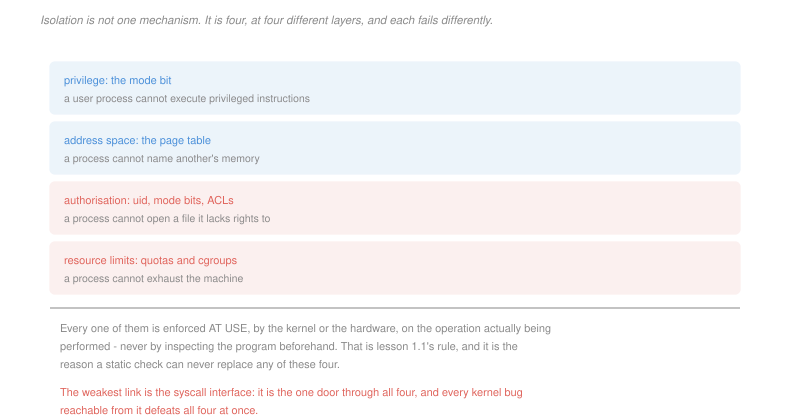

# Operating Systems · Lesson 4.6: OS security basics

> ⏱ ~15 min · Module 4: File systems, I/O and virtualization · Builds on: [4.5 (virtualization)](04-05-virtualization-and-containers.md), [1.1 (kernel and user mode)](01-01-why-an-os-kernel-and-user-mode.md) · Unlocks: this is the course's final lesson

## Why this matters

Every mechanism in this course was, viewed from one angle, a security mechanism. The mode bit stops a program touching the machine. Page tables stop it touching another program. File permissions stop it touching another user's data. Control groups stop it consuming everything.

What makes the topic worth a lesson of its own is that these are **four separate mechanisms at four different layers**, they fail differently, and defeating any one of them does not defeat the others — except through the one interface that passes through all four, which is where nearly every real compromise happens.

The second thing worth taking away is a habit of mind. Two of the three problems below are exercises in constructing an attack, because the only way to know whether a boundary holds is to try to walk through it.

## The idea

Separate two words that get used interchangeably:

> **Protection** is the mechanism: what the system *can* enforce. Page tables, mode bits, permission checks.
>
> **Security** is the policy plus the mechanism: whether what is enforced is what you *wanted*.

A system can have flawless protection and no security, if the policy says everyone may read everything. Most real failures are policy failures wearing a mechanism's clothes.

The four layers, and what each one alone cannot do:

| layer | mechanism | stops | does not stop |
|---|---|---|---|
| privilege | the mode bit ([1.1](01-01-why-an-os-kernel-and-user-mode.md)) | executing privileged instructions | asking the kernel to do it for you |
| address space | page tables ([3.2](03-02-paging-and-the-os-page-table.md)) | naming another process's memory | memory you legitimately share |
| authorization | uid, mode bits, access-control lists | opening what you have no rights to | anything you were granted, or tricked into using |
| resource limits | quotas and control groups ([4.5](04-05-virtualization-and-containers.md)) | exhausting the machine | anything within your budget |

Every one of them is enforced **at use** — by hardware or by the kernel, on the operation actually being attempted — never by inspecting the program first. That is [1.1](01-01-why-an-os-kernel-and-user-mode.md)'s rule, and the undecidability argument there is why no static check can substitute for any of the four.

Two design principles that do most of the work in practice:

> **Least privilege.** Every component runs with the smallest set of rights sufficient for its job, for the shortest time.
>
> **Privilege separation.** Split a program so that the part needing privilege is small, isolated, and does as little as possible.

The canonical example is a network daemon that must bind port 80, which requires root. It binds the port, then permanently drops to an unprivileged user before parsing a single byte from the network. The privileged code is ten lines and touches no attacker-controlled input; the attacker-facing code has no privileges to steal. Compare a `setuid` program, which runs *entirely* with elevated privilege and must therefore be correct everywhere — which is why `setuid` binaries have been such a rich source of vulnerabilities.

## The formal version

> **The confused deputy.** A privileged program is tricked into misusing its authority on behalf of an unprivileged caller. The attacker never gains privilege; the deputy exercises its own, on the wrong object.

In words: you cannot open that file, so you persuade something that can.

> **Time of check to time of use (TOCTTOU).** A check and the action it authorises are separated in time, and the object they refer to changes in between.

This is [2.1](02-01-race-conditions-and-critical-sections.md)'s check-then-act race, with an attacker choosing the interleaving instead of the scheduler. That is the whole difference and it matters enormously: an ordinary race fires occasionally, and an attacker can make this one fire on demand by rerunning it a thousand times.

The repair is the same as everywhere else — make the check and the action refer to the **same object**, not the same name. Open the file first and then inspect the descriptor, or use the descriptor-relative calls that resolve a path once. A name can be rebound between two calls; a descriptor cannot.

**Two defences worth knowing precisely**, because they are what stand between a memory-safety bug and a compromise:

> **W xor X.** No page is both writable and executable. It is one bit in the page table ([3.2](03-02-paging-and-the-os-page-table.md)), and it stops an attacker executing data they injected.

> **Address space layout randomization.** Place the stack, heap and libraries at addresses chosen at random each run, so an attacker cannot know where to jump.

ASLR is quantitative, and the number is the entropy. With $b$ bits of randomness the attacker faces $2^b$ possibilities and needs $2^{b-1}$ guesses on average. On 32-bit systems $b$ was about 16 — 32,768 expected attempts, which against a server that forks children without rerandomizing is a matter of seconds. On 64-bit systems $b$ is 28 to 30, and the same attack takes days. **The defence did not change; the address space got big enough for it to work**, which is a useful reminder that a probabilistic defence has a parameter and the parameter is the defence.

Neither is a fix for the underlying bug. They raise the cost of exploiting it, which is a real and limited thing to buy.

## Picture



## Worked examples

**Example 1 — a confused deputy in three lines.** A `setuid`-root program lets users append to their own log files:

```
if (access(path, W_OK) == 0)      // checked against the REAL uid
    fd = open(path, O_WRONLY);    // opened with the EFFECTIVE uid, root
write(fd, message, n);
```

`access` was invented for exactly this and checks the *calling user's* rights, which sounds like the right thing. The bug is that two calls resolve `path` twice, and between them the attacker changes what it names:

| step | attacker | program |
|---|---|---|
| 1 | `path` is a symlink to a file they own | |
| 2 | | `access(path, W_OK)` — resolves to the attacker's own file, passes |
| 3 | repoints the symlink at `/etc/passwd` | |
| 4 | | `open(path, O_WRONLY)` — resolves to `/etc/passwd`, and root may write it |

The attacker gained no privilege. The program used its own, on an object it never intended. Everything the kernel did was correct, and both layers of authorization worked exactly as specified.

*The fix* is to stop using the name twice. Either drop privileges to the real user and simply `open` — letting the kernel's own check do the work at the moment of use — or open first and verify the descriptor with `fstat`. The general form: **authorize the object you are about to act on, not a name that might reach it.**

**Example 2 — what ASLR actually buys.** A server forks a child per connection, and a crashed child does not cause the parent to rerandomize, so every attempt draws from the same layout. The attacker can make 1,000 attempts per second.

*32-bit, 16 bits of entropy:*
$$2^{16} = 65{,}536 \text{ layouts}, \qquad \text{expected attempts} = 32{,}768, \qquad t = \frac{32{,}768}{1{,}000} = 33 \text{ s}$$

*64-bit, 28 bits:*
$$2^{28} = 268{,}435{,}456, \qquad \text{expected} = 134{,}217{,}728, \qquad t = 134{,}218 \text{ s} = 37 \text{ hours}$$

Thirty-three seconds against a day and a half, from twelve extra bits. And note what the calculation exposes: the defence rests on the attacker being unable to *learn* the layout, so a single information leak that discloses one address collapses it entirely, regardless of the entropy. That is why memory-disclosure bugs are valued as highly as memory-corruption bugs, and why they are usually chained together.

## Watch out

- **You might think root is the top of the privilege hierarchy.** On a modern system root is decomposed into capabilities, confined by mandatory access control, and still subject to the hypervisor above it. "Root" is a policy label, and the mode bit is the mechanism — they are different things, and root code still runs in user mode.
- **You might think ASLR and W-xor-X fix memory-safety bugs.** They raise the cost of exploiting them. Both have been bypassed — the first by information leaks, the second by return-oriented programming, which reuses code already marked executable — and neither removes the bug.
- **You might think a container's isolation is comparable to a virtual machine's.** Its boundary is the entire system-call interface ([4.5](04-05-virtualization-and-containers.md)), which is why kernel bugs are container escapes and why the recommended posture for mutually distrusting tenants remains a hardware boundary.

## One-liner

> Four separate mechanisms keep processes apart, every one of them enforced at the moment of use rather than by inspection, and nearly every real compromise goes through the one interface that passes through all four.

## Problems

**P1 (🟢)** For each design, name which of the four isolation layers is doing the work, and say whether it follows least privilege: (a) a web server binds port 80 as root, then calls `setuid` to an unprivileged user before accepting connections; (b) a `setuid`-root utility that runs entirely as root and parses a user-supplied configuration file; (c) a container limited to 2 GB of memory and 0.5 CPU; (d) a database that opens its data files at startup, then enters a sandbox forbidding all further `open` calls; (e) a browser rendering each tab in a separate process with no filesystem access.

**P2 (🟡)** A service forks a child per request and does not rerandomize between requests. An attacker manages 500 attempts per second. (a) Give the expected time to defeat ASLR with 16 bits of entropy and with 30 bits. (b) The service is changed to rerandomize after every three crashes. State what this changes about the attack and why. (c) The attacker finds a bug that discloses one code-segment address. Give the number of guesses now required, and state which of the two defences in this lesson is unaffected by that disclosure.

**P3 (🔴, optional)** A `setuid`-root backup utility checks that the user owns a file before copying it:

```
1   stat(path, &st)
2   if (st.st_uid != getuid()) return DENIED;
3   fd = open(path, O_RDONLY)
4   copy_to_backup(fd)
```

(a) Construct the attack, as an ordered list of steps by the attacker and the program, that copies `/etc/shadow` into the attacker's backup. (b) Name the vulnerability class and state precisely which two things differ between line 1 and line 3. (c) Give a rewrite that closes it, and state the general rule in one sentence. Then say why simply making lines 1 to 3 atomic would not be a satisfactory fix even if the OS offered a way.

<details>
<summary>Solutions</summary>

**P1**

| | layer doing the work | least privilege? |
|---|---|---|
| (a) bind port 80 as root, then drop | **privilege** — the mode bit and the uid check, held for the shortest possible window | **yes**, and it is the textbook example: privilege is held for a few lines and released before any attacker-controlled input is read |
| (b) `setuid`-root utility parsing a user's config file | **privilege**, held throughout | **no** — full privilege for the entire run, including the parser, which is the part most likely to contain a bug. Every line must be correct |
| (c) container capped at 2 GB and 0.5 CPU | **resource limits** — control groups | **yes** for availability, and note it does nothing for confidentiality; a container within its budget can still attack the kernel |
| (d) database sandboxed against further `open` after startup | **authorization**, narrowed after the fact | **yes**, and this is privilege *reduction over time* — the rights needed at startup are given up once they are no longer needed |
| (e) each browser tab a separate process with no filesystem access | **address space** plus **authorization** | **yes** — this is privilege separation, sized so that compromising the component that parses hostile input yields nothing worth having |

The pattern across (a), (d) and (e): least privilege is as much about *when* and *for how long* as about how much.

**P2** *(a) Expected time at 500 attempts per second.*

**16 bits:**
$$\frac{2^{16}}{2} = 32{,}768 \text{ attempts}, \qquad t = \frac{32{,}768}{500} = \boxed{65.5 \text{ s}}$$

**30 bits:**
$$\frac{2^{30}}{2} = 536{,}870{,}912 \text{ attempts}, \qquad t = \frac{536{,}870{,}912}{500} = 1{,}073{,}742 \text{ s} = \boxed{12.4 \text{ days}}$$

*(b) Rerandomizing after every three crashes.* It makes the attack **statistically hopeless rather than merely slow**, and the reason is worth stating carefully: brute force works only because every attempt tests a guess against the *same* secret, so attempts accumulate. Rerandomizing discards the accumulated progress — each new layout means the previous guesses tell the attacker nothing, and with three attempts per layout the chance of success is $3/2^b$ per round, so the expected number of *rounds* is $2^b/3$ and the total attempts are essentially unchanged while the wall-clock cost of a round now includes a process restart.

The general principle: **a probabilistic defence only works if failures are not free and knowledge does not accumulate.** ASLR against a forking server violates both, which is exactly why the classic attack targets that shape.

*(c) With one code address disclosed.*
$$\boxed{1 \text{ guess}}$$

Learning one address in a segment reveals the whole segment's base, since everything within it is at a fixed offset from that base. The entropy was never in the individual addresses — it was one random base per region — so a single leak collapses the whole defence to certainty.

*Which defence is unaffected:* **W xor X.** It is not probabilistic and holds no secret. Knowing where a page is does not make it writable and executable at the same time, so an attacker who has fully defeated ASLR still cannot execute data they injected — they must reuse existing executable code, which is exactly what return-oriented programming is and why it was invented. The two defences fail independently, which is the argument for having both.

**P3** *Accept criterion for (a): a sequence in which the program's `stat` resolves a path the attacker owns and the program's `open` resolves the same path after the attacker has rebound it to the target. The rebinding must occur strictly between lines 2 and 3.*

*(a) The attack.*

| step | attacker | program |
|---|---|---|
| 1 | creates `/tmp/bait`, a symlink to `/tmp/mine`, which they own | |
| 2 | invokes the utility on `/tmp/bait` | |
| 3 | | line 1: `stat("/tmp/bait")` follows the link to `/tmp/mine` |
| 4 | | line 2: the owner is the attacker, so the check **passes** |
| 5 | repoints `/tmp/bait` at `/etc/shadow` | |
| 6 | | line 3: `open("/tmp/bait")` follows the link to `/etc/shadow`, and root may read it |
| 7 | | line 4: the contents are copied into the attacker's backup |

The window between steps 4 and 6 is microseconds, which is no obstacle: the attacker simply runs the whole thing in a loop, thousands of times, and wins whenever the scheduler cooperates. Reliability techniques — filling the directory cache, or using a deep symlink chain to make the program's own path resolution slow — push the success rate close to one.

*(b) The class and the precise difference.* **Time of check to time of use**, a confused-deputy attack in which the deputy is the `setuid` utility.

The two things that differ between line 1 and line 3:

1. **The object.** Both calls take the same *string*, and a string names a path, not a file. The path is resolved separately each time, and the attacker changed what it resolves to in between.
2. **The authority.** Line 1's result was evaluated against the attacker's uid; line 3 executes with root's. So the check applied to one object under one authority, and the action to a different object under a different one.

*(c) The rewrite and the rule.*

```
1   fd = open(path, O_RDONLY | O_NOFOLLOW)   // resolved once
2   fstat(fd, &st)                           // inspect the open FILE
3   if (st.st_uid != getuid()) { close(fd); return DENIED; }
4   copy_to_backup(fd)
```

The check now applies to the descriptor that will be used, and a descriptor refers to an inode ([4.1](04-01-files-directories-and-inodes.md)) that cannot be rebound by anything the attacker does to directory entries. (Better still: drop privilege to the real user first and let the kernel's own permission check decide at the moment of `open`, which removes the deputy entirely.)

> **The rule: authorize the object you will act on, not a name that might reach it.**

*Why making lines 1 to 3 atomic would not be satisfactory*, even if it were available: it would close this instance and leave the class open. The defect is not that a window exists but that the program's decision is attached to a **name**, and names are attacker-controllable indirections whose meaning can change at any time the attacker can write the containing directory. An atomic check-and-open is just the descriptor-based version with extra steps — and any later code path that used `path` again, to reopen the file or to log it, would reintroduce the bug. Removing the second resolution removes the class; locking the window removes one case.

</details>

## Flashback

**From Lesson 4.4 (I/O and disk scheduling):** A 200-track disk, head at 50, pending requests 176, 79, 34, 60, 92, 11, 41, 114. (a) Give the total head movement under FCFS and under SSTF. (b) Give it under SCAN, sweeping upward first and reaching track 199, and under C-LOOK. (c) State the order in which SSTF serves the requests, and identify which request would be most at risk if new requests near track 50 kept arriving.

<details>
<summary>Solution</summary>

*(a) FCFS and SSTF.*

**FCFS**, arrival order 176, 79, 34, 60, 92, 11, 41, 114 from track 50:
$$126 + 97 + 45 + 26 + 32 + 81 + 30 + 73 = \boxed{510}$$

**SSTF**:

| from | to | distance |
|---|---|---|
| 50 | 41 | 9 |
| 41 | 34 | 7 |
| 34 | 11 | 23 |
| 11 | 60 | 49 |
| 60 | 79 | 19 |
| 79 | 92 | 13 |
| 92 | 114 | 22 |
| 114 | 176 | 62 |

$$\text{total} = \boxed{204}$$

*(b) SCAN and C-LOOK.*

**SCAN**, up through 60, 79, 92, 114, 176 to 199, then down through 41, 34, 11:
$$(199 - 50) + (199 - 11) = 149 + 188 = \boxed{337}$$

**C-LOOK**, up through 60, 79, 92, 114, 176, then jump to the lowest pending and continue up through 11, 34, 41:
$$(176 - 50) + (176 - 11) + (41 - 11) = 126 + 165 + 30 = \boxed{321}$$

*(c) SSTF's order, and the request at risk.*
$$41,\; 34,\; 11,\; 60,\; 79,\; 92,\; 114,\; 176$$

**Track 176** is most at risk. It is the furthest from the head, is served last, and a steady arrival of requests near track 50 would keep the head in the low range indefinitely — 176 would never become the nearest pending request. This is SSTF's starvation, the same bounded-waiting failure as [2.4](02-04-classic-synchronization-problems.md)'s readers–writers, and the elevator policies bound it precisely because their order does not depend on where the head happens to be.

</details>

## Connections

- **Backward:** each of the four layers was built earlier — the mode bit in [1.1](01-01-why-an-os-kernel-and-user-mode.md), page tables in [3.2](03-02-paging-and-the-os-page-table.md), file ownership in [4.1](04-01-files-directories-and-inodes.md), control groups in [4.5](04-05-virtualization-and-containers.md). TOCTTOU is the check-then-act race of [2.1](02-01-race-conditions-and-critical-sections.md) with an adversary choosing the schedule.
- **Sideways:** the confused deputy is a general failure of designs that separate *authority* from *designation* — the same bug appears as cross-site request forgery on the web, as an over-permissive cloud role assumed on a caller's behalf, and as any API that takes a name where it should take a handle. Capability systems exist to fuse the two, which is what a file descriptor already does within one process.

## Closing the course

You began with a machine that runs one instruction stream against one flat memory, and you end with the software that turns it into something every program can share without noticing.

Four things are worth carrying out of it.

**Abstraction has a price, and it is usually a trap.** Processes, address spaces and files all rest on a hardware boundary that must be crossed to be enforced. That is why the syscall count in [1.2](01-02-system-calls-and-the-kernel-interface.md), the fault rate in [3.3](03-03-demand-paging-and-page-faults.md) and the VM exit in [4.5](04-05-virtualization-and-containers.md) are the same kind of number, and why nearly every performance interface you will meet is an arrangement to cross a boundary less often.

**Enforce at use, never by inspection.** The undecidability argument in [1.1](01-01-why-an-os-kernel-and-user-mode.md) settled it once, and every mechanism since has obeyed it — the page table checked on every access, the permission checked on every open, the descriptor rather than the name in [4.6](04-06-os-security-basics.md).

**Check-then-act is one bug, and it is everywhere.** It is the race in [2.1](02-01-race-conditions-and-critical-sections.md), the reason `open` needs an exclusive-create flag, the reason condition variables need `while`, the crash window in [4.3](04-03-crash-consistency-and-journaling.md), and the attack in [4.6](04-06-os-security-basics.md). The fix has one shape: make the check and the action indivisible, or make them refer to the same object.

**The cliffs are what to watch for.** Thrashing, the syscall-per-byte loop, the saturated disk, the deadlock — none of these is a gradual slowdown, and each has an early indicator that looks like good news. Idle CPU is the signature of a saturated disk. High cache hit rates hide the request that fell off the end. Knowing where the cliff is, and which measurement lies near it, is most of what this course was for.

Where it leads: [`distributed-systems`](../../distributed-systems/syllabus.md) takes these problems to machines that cannot share memory at all, where the atomic instruction of [2.2](02-02-locks-and-hardware-support.md) becomes consensus and the crash consistency of [4.3](04-03-crash-consistency-and-journaling.md) becomes replication. [`databases`](../../databases/syllabus.md) rebuilds the buffer cache, the write-ahead log and the scheduler for one demanding application. And [`computer-networks`](../../computer-networks/syllabus.md) is the device driver in [4.4](04-04-io-and-disk-scheduling.md) opened up, with the same queueing arguments and a wire in place of a disk.
