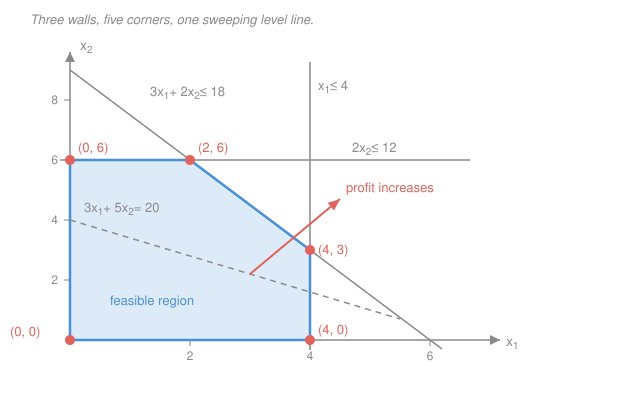

# Operations Research · Lesson 1.1: Formulating linear programs

> ⏱ ~15 min · Module 1: Linear Programming & the Simplex Method · Builds on: [`convex-optimization` 2.2](../../convex-optimization/lessons/02-02-linear-quadratic-programs.md), [`linalg-refresher` 1.3](../../linalg-refresher/lessons/01-03-linear-systems-elimination-rank.md) · Unlocks: [1.2 Vertices, bases & the fundamental theorem](01-02-vertices-bases-fundamental-theorem.md)

## Why this matters

Every solver on earth will happily optimize $c^Tx$ subject to $Ax \le b$ for you. Nobody will tell you what $x$ *is*. That translation — from "we have three plants, two products, and a profit target" to a matrix and two vectors — is the step that is not automatable, not in a library, and not taught anywhere else in this library: [`convex-optimization` 2.2](../../convex-optimization/lessons/02-02-linear-quadratic-programs.md) tells you what an LP *is* and that its optimum sits at a vertex, but it hands you the LP already written. Here you learn to write it.

It is also the step where real projects die. A model with the wrong decision variables cannot be repaired by a better solver; it can only be thrown away. So this lesson gets the full budget: a repeatable procedure, a running example we will reuse for the next six lessons, and a gallery of the five patterns that cover most of what you will ever be asked to model.

## The idea

**An optimization model has exactly three parts.**

1. **Decisions** — the things *you* get to choose. These become the variables.
2. **An objective** — one number you want as large (or as small) as possible.
3. **Constraints** — the rules reality imposes, which you cannot violate.

Say it plainly: **almost all of the difficulty is in part 1.** Once you have said precisely what the decision variables are, the objective and the constraints usually write themselves, because each one is just a sentence from the story with the variable names substituted in. Beginners flail because they start writing constraints before they have committed to a variable list, and then the constraints refuse to line up.

The other thing to internalize early: a model is **linear** when the objective and every constraint are sums of (constant) × (variable). No variable multiplied by another variable, no variable in a denominator, no "if this then that". That restriction is severe, and it buys you an enormous amount — a global optimum, in polynomial time, with a price tag attached to every constraint (Module 2). Most of the art of formulation is finding the variable definition that makes an apparently nonlinear story come out linear.

### The procedure

Follow this in order. It is boring on purpose.

1. **Identify the decisions and define a variable for each — with units.** Force yourself to complete the sentence *"$x_j$ = the number of ___ per ___"*. If you cannot finish it, you do not yet have a decision variable, you have a vague noun.
2. **Write the objective** as a linear function of those variables. Each coefficient is a *rate*: value per unit of $x_j$. The units of $c_jx_j$ must all agree, and must be the units of the thing you are maximizing.
3. **Write each constraint, asking what resource it rations.** Almost every one is of the shape *(amount used) $\le$ (amount available)*, *(amount supplied) $\ge$ (amount required)*, or *(what flows in) $=$ (what flows out)*. Check that the units match on both sides — that single habit catches most formulation typos.
4. **Add non-negativity.** You cannot produce $-3$ batches. Declare which variables are sign-restricted and which are genuinely free.
5. **Sanity-check by hand.** Construct one feasible point — any one — and evaluate the objective at it. If you cannot construct a feasible point, either you over-constrained the model or you flipped an inequality. If the objective at that point comes out in absurd units, go back to step 2.

### The running example: Wyndor Glass

Wyndor Glass is starting two products: an aluminium-framed glass door (product 1) and a wood-framed window (product 2). Production runs in **batches of 20 units**. Three plants do the work:

- **Plant 1** makes aluminium frames. It has **4 hours per week** free, and one batch of product 1 uses **1 hour** there. Product 2 uses none.
- **Plant 2** makes wood frames. It has **12 hours per week** free; one batch of product 2 uses **2 hours**. Product 1 uses none.
- **Plant 3** makes the glass and assembles. It has **18 hours per week** free; a batch of product 1 uses **3 hours**, a batch of product 2 uses **2 hours**.

Profit is **3 thousand dollars per batch** of product 1 and **5 thousand dollars per batch** of product 2. How much of each should Wyndor make?

**Step 1 — decisions, with units.** The plants and the hours are *given*; what Wyndor chooses is a production rate. So

$$x_1 = \text{batches of product 1 produced per week}, \qquad x_2 = \text{batches of product 2 produced per week}.$$

Note what is *not* a variable: "hours used in plant 3" is a consequence of $x_1$ and $x_2$, not an independent choice.

**Step 2 — objective.** Profit per week, in thousands of dollars per week:

$$\text{maximize } z = 3x_1 + 5x_2.$$

Units check: (thousand dollars per batch) × (batches per week) = thousand dollars per week. Good.

**Step 3 — constraints, one per rationed resource.** Each plant's weekly hours are the resource:

$$\underbrace{1x_1 + 0x_2 \le 4}_{\text{plant 1 hours}}, \qquad \underbrace{0x_1 + 2x_2 \le 12}_{\text{plant 2 hours}}, \qquad \underbrace{3x_1 + 2x_2 \le 18}_{\text{plant 3 hours}}.$$

Units check on the third: (hours per batch) × (batches per week) = hours per week $\le$ hours per week. Good.

**Step 4 — non-negativity.** $x_1 \ge 0$, $x_2 \ge 0$.

**Step 5 — sanity check.** Try $x = (2,3)$: plant 1 uses $2 \le 4$, plant 2 uses $6 \le 12$, plant 3 uses $3(2)+2(3) = 12 \le 18$. Feasible, with weekly profit $3(2)+5(3) = 21$ thousand dollars. The model breathes; now we can go looking for the best point.

That is the whole LP:

$$\max\ 3x_1 + 5x_2 \quad \text{s.t.} \quad x_1 \le 4,\quad 2x_2 \le 12,\quad 3x_1 + 2x_2 \le 18,\quad x_1, x_2 \ge 0.$$

Keep it — Modules 1 and 2 solve it, dualize it, and price it.

## The formal version

### Standard form

This course's **standard form** is

$$\boxed{\ \max\ c^Tx \quad \text{subject to}\quad Ax \le b,\quad x \ge 0\ }$$

with decision vector $x \in \mathbb{R}^n$, objective coefficients $c \in \mathbb{R}^n$, constraint matrix $A \in \mathbb{R}^{m \times n}$, and right-hand side $b \in \mathbb{R}^m$. The inequalities are **componentwise**: $Ax \le b$ means $a_i^Tx \le b_i$ for each row $i = 1,\dots,m$, and $x \ge 0$ means every $x_j \ge 0$.

*In words: maximize a linear payoff over the region carved out by $m$ flat walls, staying in the non-negative corner of space.* That region is a **polyhedron** — see [`convex-optimization` 1.2](../../convex-optimization/lessons/01-02-convex-set-zoo-operations.md) for why an intersection of halfspaces is convex; we take it as given.

For Wyndor,

$$c = \begin{pmatrix} 3 \\ 5 \end{pmatrix}, \qquad A = \begin{pmatrix} 1 & 0 \\ 0 & 2 \\ 3 & 2 \end{pmatrix}, \qquad b = \begin{pmatrix} 4 \\ 12 \\ 18 \end{pmatrix}.$$

### Converting anything into standard form

Nothing is lost by insisting on this shape — every LP can be pushed into it by four mechanical moves.

**Minimize becomes maximize.** $\min\ f(x)$ and $\max\ -f(x)$ have the *same* minimizers, and

$$\min_x c^Tx = -\max_x\,(-c^Tx).$$

*In words: flip the sign of every objective coefficient, solve the maximization, then flip the sign of the optimal value back.* The optimal $x^*$ itself is unchanged.

**A $\ge$ constraint becomes $\le$.** Negate both sides:

$$a^Tx \ge \beta \quad\Longleftrightarrow\quad -a^Tx \le -\beta.$$

**An equality becomes two inequalities.**

$$a^Tx = \beta \quad\Longleftrightarrow\quad a^Tx \le \beta \ \text{ and } \ -a^Tx \le -\beta.$$

*In words: "equal to" is "no more than" and "no less than" at the same time.* (In slack form below we usually just keep equalities as they are — this split is only needed to hit the literal $Ax \le b$ template.)

**A free variable splits in two.** If $x$ is unrestricted in sign, write

$$x = x^+ - x^-, \qquad x^+ \ge 0,\ x^- \ge 0,$$

and substitute everywhere. *In words: every real number is a non-negative number minus a non-negative number.* One extra column buys you the sign freedom. (A variable with a nonzero lower bound needs no splitting — if $x \ge \ell$, substitute $x' = x - \ell \ge 0$ and shift the constants.)

### Slack form, and what a slack means

Take $Ax \le b$ and give each row exactly the amount it is short by. Define **slack variables** $s_1,\dots,s_m$ by

$$\boxed{\ Ax + s = b, \qquad x \ge 0,\quad s \ge 0.\ }$$

*In words: each inequality becomes an equality plus a non-negative "leftover".* This is not a bookkeeping trick — the slack has a **meaning and units**:

$$s_i = b_i - a_i^Tx = \text{unused capacity of resource } i,$$

measured in whatever $b_i$ is measured in. And the key vocabulary: constraint $i$ is **binding** (tight, active) at a point exactly when $s_i = 0$, and **slack** when $s_i > 0$.

Wyndor in slack form, with $s_1, s_2, s_3$ in hours per week:

$$\begin{aligned}
x_1 \phantom{{}+2x_2} \ + s_1 \phantom{{}+s_2+s_3} &= 4 \\
2x_2 \ + s_2 \phantom{{}+s_3} &= 12 \\
3x_1 + 2x_2 \ + s_3 &= 18
\end{aligned} \qquad x_1,x_2,s_1,s_2,s_3 \ge 0.$$

At the point $x = (2,6)$ (which [1.2](01-02-vertices-bases-fundamental-theorem.md) will show is the optimum), the slacks are $s = (2, 0, 0)$: plant 1 sits idle 2 hours a week, while plants 2 and 3 are maxed out. Two payoffs downstream:

- **[1.2](01-02-vertices-bases-fundamental-theorem.md) and [1.3](01-03-the-simplex-method.md):** the slack form has $n+m$ variables and $m$ equations, so a *corner* of the polyhedron is exactly a choice of which $m$ of those $n+m$ variables are allowed to be nonzero. Simplex walks between such choices. The slacks are what make the corners countable.
- **[2.2](02-02-shadow-prices-sensitivity.md):** a resource with slack left over is worth nothing at the margin — an extra hour in plant 1 buys Wyndor nothing, because it already has 2 spare. Its shadow price is zero. Only binding constraints have positive prices.

(For a $\ge$ constraint written as $a^Tx - s = \beta$, $s \ge 0$, the variable is called a **surplus**: how far *above* the minimum requirement you are.)

## Picture

Three inequalities plus two non-negativities cut a five-cornered polygon out of the plane. The dashed line is one **level set** of the objective, $3x_1 + 5x_2 = 20$ — every point on it earns the same profit. Push that line in the arrow's direction (the direction of $c = (3,5)$) and profit rises; the last corner it touches before leaving the polygon is the optimum. That corner is $(2,6)$, worth 36 thousand dollars a week. [1.2](01-02-vertices-bases-fundamental-theorem.md) proves the "last point is a corner" claim in general.

## Worked examples

### Example 1 — a gallery of modeling patterns

Five shapes cover most real formulations. Come back to this section; it is the part you will actually reuse.

**(a) Blending / diet — minimize cost subject to nutrient minimums.**
*Story:* buy foods $j = 1,\dots,n$ to meet daily nutrient requirements as cheaply as possible.
Let $x_j$ = kilograms of food $j$ purchased per day, $c_j$ = dollars per kilogram, $a_{ij}$ = units of nutrient $i$ per kilogram of food $j$, and $r_i$ = units of nutrient $i$ required per day.

$$\min \sum_{j} c_jx_j \quad\text{s.t.}\quad \sum_j a_{ij}x_j \ge r_i \ \ \forall i, \qquad x \ge 0.$$

Signature: a **min** with $\ge$ rows. Negating gives standard form, and the negated $b$ entries are why the origin is infeasible here — the reason [1.4](01-04-initialization-degeneracy-cycling.md) needs a two-phase start.

**(b) Product mix — the Wyndor pattern.**
*Story:* choose production rates to maximize profit under capacity limits.
Let $x_j$ = units of product $j$ per period, $c_j$ = profit per unit, $a_{ij}$ = units of resource $i$ consumed per unit of product $j$, $b_i$ = resource $i$ available per period.

$$\max \sum_j c_jx_j \quad\text{s.t.}\quad \sum_j a_{ij}x_j \le b_i \ \ \forall i, \qquad x \ge 0.$$

Signature: a **max** with $\le$ rows — already standard form, and the origin (make nothing) is always feasible.

**(c) Scheduling / covering — staff shifts to cover hourly requirements.**
*Story:* a shop is open in four two-hour periods and needs at least $3, 5, 4, 2$ staff on the floor in periods 1–4. Shifts are four hours long, so shift $A$ covers periods 1–2, shift $B$ covers 2–3, and shift $C$ covers 3–4.

The subtlety that trips everyone: **the variable is not "people working in period $t$"** — that double-counts, because one hire works several periods. The variable is the *start*:

$$x_A, x_B, x_C = \text{number of workers who \textit{start} shift } A, B, C.$$

Then each period's requirement sums over the shifts that happen to cover it:

$$\min\ x_A + x_B + x_C \quad\text{s.t.}\quad
\begin{aligned}
x_A \phantom{{} + x_B + x_C} &\ge 3 &&\text{(period 1)}\\
x_A + x_B \phantom{{} + x_C} &\ge 5 &&\text{(period 2)}\\
x_B + x_C \phantom{{} + x_A} &\ge 4 &&\text{(period 3)}\\
x_C \phantom{{} + x_A + x_B} &\ge 2 &&\text{(period 4)}
\end{aligned}
\qquad x \ge 0.$$

The coefficient matrix is a **staircase of consecutive ones** — that overlap *is* the model:

$$\begin{pmatrix} 1&0&0 \\ 1&1&0 \\ 0&1&1 \\ 0&0&1 \end{pmatrix}.$$

Every covering problem — ambulance stations covering districts, servers covering time zones — has this shape: rows are things to cover, columns are things you buy, and $a_{ij} = 1$ when buying $j$ covers $i$.

**(d) Multi-period / inventory balance — the single most useful idiom in OR.**
*Story:* produce over $T$ periods against known demands, carrying stock forward.
Let $x_t$ = units produced in period $t$, $I_t$ = units held at the *end* of period $t$, $d_t$ = demand in period $t$ (units), $c_t$ = production cost per unit, $h$ = holding cost per unit per period, $K_t$ = production capacity.

$$\boxed{\ I_t = I_{t-1} + x_t - d_t \quad\text{for } t = 1,\dots,T\ }$$

*In words: what you end with is what you started with, plus what you made, minus what you shipped.* Everything else is decoration:

$$\min \sum_{t=1}^{T}\bigl(c_tx_t + hI_t\bigr) \quad\text{s.t.}\quad I_t = I_{t-1} + x_t - d_t,\quad x_t \le K_t,\quad x_t, I_t \ge 0,\ I_0 \text{ given}.$$

Learn this one cold. Without the balance equation the periods are $T$ separate little problems; *with* it they are one problem, and the model can decide to build early and store. The same conservation shape reappears as flow conservation at a node in [2.3](02-03-network-models-integrality.md) and as the state transition in [3.3](03-03-deterministic-dynamic-programming.md).

**(e) Ratio constraints — always rearrange.**
*Story:* "at least 30 percent of the blend must be component A."
Write it literally, with the total spelled out, then clear the denominator:

$$\frac{x_A}{x_A + x_B + x_C} \ge 0.3 \quad\Longleftrightarrow\quad x_A \ge 0.3\,(x_A + x_B + x_C) \quad\Longleftrightarrow\quad \boxed{\,0.7x_A - 0.3x_B - 0.3x_C \ge 0\,}$$

*In words: move everything to one side and collect coefficients — a ratio requirement is linear in disguise.* Multiplying through by the total is legal because the total is non-negative; if it is zero, both sides are zero and the constraint holds trivially. The version people write down and then declare "nonlinear" is the middle one left un-collected, with the variable total sitting on the right. Collect it. Same move handles weighted-average specs (octane, sulphur content, average interest rate).

### Example 2 — a feed blend, end to end

*Story.* A mill blends corn and soybean meal into livestock feed. Corn is 10 percent protein and 4 percent fat and costs 0.30 dollars per kilogram; soybean meal is 50 percent protein and 1 percent fat and costs 0.60 dollars per kilogram. Today's order needs at least 1000 kg of blend, at least 25 percent protein, and at most 3 percent fat. Minimize cost.

**Step 1 — variables, with units.**

$$x_C = \text{kg of corn used in the blend}, \qquad x_S = \text{kg of soybean meal used in the blend}.$$

The total blend weight is $x_C + x_S$ kg — a *quantity*, not a decision, so it does not get its own variable.

**Step 2 — objective.** Dollars: $\min\ 0.30x_C + 0.60x_S$.

**Step 3 — constraints.** Order size, in kg:

$$x_C + x_S \ge 1000.$$

Protein: the blend contains $0.10x_C + 0.50x_S$ kg of protein, and must be at least 25 percent of the *variable* total — so this is pattern (e):

$$0.10x_C + 0.50x_S \ge 0.25(x_C + x_S) \;\Longleftrightarrow\; -0.15x_C + 0.25x_S \ge 0 \;\Longleftrightarrow\; x_S \ge 0.6\,x_C.$$

Fat, the same move with the inequality the other way:

$$0.04x_C + 0.01x_S \le 0.03(x_C + x_S) \;\Longleftrightarrow\; 0.01x_C - 0.02x_S \le 0 \;\Longleftrightarrow\; x_S \ge 0.5\,x_C.$$

**Step 4 — non-negativity.** $x_C, x_S \ge 0$.

**Step 5 — check with a feasible point.** Take $x_C = x_S = 500$: total 1000 kg (order met); protein $= 50 + 250 = 300$ kg, which is 30 percent, comfortably above 250; fat $= 20 + 5 = 25$ kg, which is 2.5 percent, below the 30 kg cap. Cost $= 150 + 300 = 450$ dollars. The model is alive, and 450 is an upper bound on the answer.

**The answer, by hand.** Corn is cheaper, so push corn as high as the specs allow. The protein rule ($x_S \ge 0.6x_C$) is tighter than the fat rule ($x_S \ge 0.5x_C$), and over-producing only costs money, so the optimum has $x_C + x_S = 1000$ and $x_S = 0.6x_C$. Then $1.6x_C = 1000$, giving

$$x_C^* = 625 \text{ kg}, \qquad x_S^* = 375 \text{ kg}, \qquad \text{cost } = 0.30(625) + 0.60(375) = 412.50 \text{ dollars}.$$

*Checks.* Protein $= 62.5 + 187.5 = 250$ kg, exactly 25 percent — binding, slack 0. Fat $= 25 + 3.75 = 28.75$ kg, i.e. 2.875 percent — not binding, slack 1.25 kg. Order size binding, slack 0. And 412.50 is below the 450 of our hand-built point, as it must be; the average price 0.4125 dollars per kg sits between 0.30 and 0.60, as it must.

**Now put it in standard form.** It is a minimization with $\ge$ rows, so negate the objective and every row:

$$\max\ (-0.3, -0.6)^Tx \quad\text{s.t.}\quad
A = \begin{pmatrix} -1 & -1 \\ 0.6 & -1 \\ 0.5 & -1 \end{pmatrix},\quad
b = \begin{pmatrix} -1000 \\ 0 \\ 0 \end{pmatrix},\quad x = \begin{pmatrix} x_C \\ x_S\end{pmatrix} \ge 0,$$

with optimal value $-412.50$, i.e. a cost of 412.50 dollars. Notice $b_1 < 0$: the origin $x = 0$ is **not** feasible here, so simplex cannot just start at "make nothing". That is precisely the initialization problem [1.4](01-04-initialization-degeneracy-cycling.md) solves.

### Where the pattern breaks: what LP cannot express

Be honest about the ceiling. Linearity plus continuous variables cannot say:

- **Indivisibility.** An LP will cheerfully tell you to build 2.4 factories or hire 7.3 nurses. Rounding is not a fix — the rounded point is often infeasible, and when it is feasible it can be badly suboptimal.
- **Either/or.** "Use process A or process B, not both" is a disjunction; the feasible set it describes is not convex, and no set of linear inequalities carves it out.
- **Fixed charges.** "Pay 5000 dollars to open the plant at all, then 3 dollars per unit" is a cost function with a jump at zero — not linear, not even continuous.
- **Products of variables.** Revenue = price × quantity, when you choose both, is bilinear. So is "the fraction of budget in asset $i$ times the return you also decide".
- **Counting.** "At most 4 of these 10 warehouses may be open" needs indicator variables to count with.

Every one of these is recovered by allowing some variables to take only the values 0 or 1 — the subject of [3.1 Modeling with integer variables](03-01-modeling-with-integer-variables.md), where the "either/or" and "fixed charge" idioms get their standard big-M encodings. The price is that the resulting problems are no longer solvable in polynomial time; [3.2](03-02-branch-and-bound-cutting-planes.md) shows what we do about that.

## Watch out

- **You might think a decision variable is any quantity in the story.** It isn't — it is something you *choose*. "Hours used in plant 3" is determined once $x_1,x_2$ are set, so it is an output, not a decision. (The legitimate exception: an **auxiliary** variable pinned to the others by an equality, like inventory $I_t$. That is not a second decision, it is a name for a quantity you want to see, cost, and constrain — and naming it is usually what makes the model readable.)
- **You might think "at least 30 percent A" means $x_A \ge 0.3$.** Percentages are always *of something*, and here that something is itself a variable. Write the total out explicitly and rearrange, or the constraint means nothing.
- **You might treat a fractional answer as a bug.** 625 kg of corn is fine; 2.4 factories is not. Fractionality is only a problem when the *unit* is indivisible — and then you need [3.1](03-01-modeling-with-integer-variables.md), not a rounding rule.
- **You might mix rates and totals.** Wyndor's profit is 3 thousand dollars *per batch*, and a batch is 20 units — so $3x_1$ is only right because $x_1$ counts batches, not units. Writing the units next to every variable definition is the cheapest bug-catcher in this course.

## One-liner

> Name the decisions with units, price them linearly, ration each scarce resource with one inequality — and the slack you add to close that inequality is the unused capacity you will later learn to price.

## Problems

**P1 (🟢)** Put this into the course's standard form $\max c^Tx$ s.t. $Ax \le b$, $x \ge 0$, and give $A$, $b$, $c$ explicitly:

$$\min\ 2x_1 - 3x_2 + x_3 \quad\text{s.t.}\quad x_1 + x_2 \ge 4,\quad x_2 - x_3 = 2,\quad x_1 \le 5,\quad x_1, x_2 \ge 0,\ x_3 \text{ free}.$$

**P2 (🟡)** A workshop makes one product. Demand is 100 units in month 1 and 150 units in month 2. Regular-time production costs 10 dollars per unit and is capped at 120 units per month; overtime costs 16 dollars per unit and is capped at 40 units per month. Stock carried from month 1 into month 2 costs 2 dollars per unit. Starting inventory is 0, and ending inventory must be 0. Formulate the LP that minimizes total cost — variables with units, objective, every constraint. Then exhibit one feasible plan and compute its cost.

**P3 (🔴)** A refinery blends three streams into gasoline; let $x_A, x_B, x_C$ be barrels of each in the blend. Regulations require the blend to be at least 30 percent stream A by volume and at most 25 percent stream C, and to have an octane rating of at least 89, where the streams rate 95, 87, and 83 and the blend's rating is the volume-weighted average. Write all three requirements as linear constraints, then verify that $(x_A,x_B,x_C) = (400,400,200)$ satisfies them.

Solutions

**P1** Two conversions are needed: the free variable and the equality.

*Free variable.* Write $x_3 = x_3^+ - x_3^-$ with $x_3^+, x_3^- \ge 0$. The variable vector becomes $x = (x_1, x_2, x_3^+, x_3^-) \ge 0$, so $n = 4$.

*Objective.* $\min\ 2x_1 - 3x_2 + x_3^+ - x_3^-$ becomes $\max\ -2x_1 + 3x_2 - x_3^+ + x_3^-$, so

$$c = (-2,\ 3,\ -1,\ 1).$$

*Rows.* The $\ge$ row is negated; the equality splits into two $\le$ rows; the last row is already $\le$:

$$\begin{aligned}
x_1 + x_2 \ge 4 \quad&\longrightarrow\quad -x_1 - x_2 \le -4\\
x_2 - x_3^+ + x_3^- = 2 \quad&\longrightarrow\quad x_2 - x_3^+ + x_3^- \le 2 \ \text{ and } \ -x_2 + x_3^+ - x_3^- \le -2\\
x_1 \le 5 \quad&\longrightarrow\quad x_1 \le 5
\end{aligned}$$

Hence

$$A = \begin{pmatrix} -1 & -1 & 0 & 0 \\ 0 & 1 & -1 & 1 \\ 0 & -1 & 1 & -1 \\ 1 & 0 & 0 & 0 \end{pmatrix}, \qquad b = \begin{pmatrix} -4 \\ 2 \\ -2 \\ 5 \end{pmatrix}, \qquad c = \begin{pmatrix} -2 \\ 3 \\ -1 \\ 1 \end{pmatrix}.$$

The original minimum equals minus the maximum of $c^Tx$.

*Check.* Take $x_1 = 0$, $x_2 = 4$, $x_3 = 2$ (so $x_3^+ = 2$, $x_3^- = 0$). Original constraints: $0 + 4 \ge 4$ yes, $4 - 2 = 2$ yes, $0 \le 5$ yes. Original objective: $2(0) - 3(4) + 2 = -10$. Converted rows: $-0-4 = -4 \le -4$ yes; $4 - 2 + 0 = 2 \le 2$ yes; $-4 + 2 - 0 = -2 \le -2$ yes; $0 \le 5$ yes. Converted objective: $-2(0) + 3(4) - 2 + 0 = 10 = -(-10)$. The signs line up.

**P2** *Variables, with units.* For $t = 1,2$:

$$r_t = \text{units produced on regular time in month } t, \qquad o_t = \text{units produced on overtime in month } t,$$
$$I_1 = \text{units held in stock at the end of month 1}.$$

($I_0 = 0$ and $I_2 = 0$ are data, not variables.)

*Objective,* in dollars:

$$\min\ 10(r_1 + r_2) + 16(o_1 + o_2) + 2I_1.$$

*Constraints.* The inventory-balance idiom, pattern (d), one row per month:

$$\begin{aligned}
I_1 &= 0 + r_1 + o_1 - 100 &&\text{(month 1 balance)}\\
0 &= I_1 + r_2 + o_2 - 150 &&\text{(month 2 balance, ending stock 0)}
\end{aligned}$$

Capacities: $r_1 \le 120$, $r_2 \le 120$, $o_1 \le 40$, $o_2 \le 40$. Non-negativity: $r_1,r_2,o_1,o_2,I_1 \ge 0$.

*A feasible plan.* Run regular time flat out in month 1 and carry the surplus:

$$r_1 = 120,\quad o_1 = 0,\quad I_1 = 20,\quad r_2 = 120,\quad o_2 = 10.$$

Balance month 1: $120 + 0 - 100 = 20 = I_1$ yes. Balance month 2: $20 + 120 + 10 - 150 = 0$ yes. All caps respected. Cost:

$$10(120 + 120) + 16(0 + 10) + 2(20) = 2400 + 160 + 40 = 2600 \text{ dollars}.$$

*Check — this plan is in fact optimal.* Total demand is 250 units and ending stock is 0, so exactly 250 units get made. Regular capacity is only 240 over the two months, so at least 10 units must be overtime, costing at least $10(240) + 16(10) = 2560$ dollars in production. Where should the overtime sit? Making a unit on regular time in month 1 and holding it costs $10 + 2 = 12$ dollars, cheaper than 16, so shift production earlier until month 1's regular cap binds; but overtime in month 1 plus holding costs $16 + 2 = 18$, worse than overtime in month 2 at 16, so the 10 overtime units belong in month 2. That is exactly the plan above, at 2600 dollars.

**P3** Let $T = x_A + x_B + x_C$ be the blend volume in barrels. Each requirement is a ratio; write it out and clear the denominator.

*At least 30 percent A:*

$$x_A \ge 0.3\,T \;\Longleftrightarrow\; 0.7x_A - 0.3x_B - 0.3x_C \ge 0.$$

*At most 25 percent C:*

$$x_C \le 0.25\,T \;\Longleftrightarrow\; -0.25x_A - 0.25x_B + 0.75x_C \le 0 \;\Longleftrightarrow\; 3x_C \le x_A + x_B.$$

*Octane at least 89* (volume-weighted average):

$$\frac{95x_A + 87x_B + 83x_C}{T} \ge 89 \;\Longleftrightarrow\; 95x_A + 87x_B + 83x_C \ge 89(x_A+x_B+x_C) \;\Longleftrightarrow\; 6x_A - 2x_B - 6x_C \ge 0,$$

or dividing by 2, $3x_A - x_B - 3x_C \ge 0$. Note the pattern: subtract the target from every stream's rating, and the constraint is "the surplus-weighted volume is non-negative".

*Verification at $(400,400,200)$, total $T = 1000$ barrels:*

- A: $0.7(400) - 0.3(400) - 0.3(200) = 280 - 120 - 60 = 100 \ge 0$. (A is 40 percent, above 30.)
- C: $3(200) = 600 \le 400 + 400 = 800$. (C is 20 percent, below 25.)
- Octane: $3(400) - 400 - 3(200) = 1200 - 400 - 600 = 200 \ge 0$. Directly, $(95\cdot400 + 87\cdot400 + 83\cdot200)/1000 = (38000 + 34800 + 16600)/1000 = 89.4 \ge 89$.

All three hold, and the two computations of the octane condition agree. (One honesty note: real octane does not blend exactly linearly by volume — refiners use blending indices to force the linearity that the LP needs. Deciding what to linearize is part of modeling.)

## Connections

- **Backward:** [`convex-optimization` 2.2](../../convex-optimization/lessons/02-02-linear-quadratic-programs.md) defined the LP and asserted that a linear objective over a polyhedron is optimized at a vertex; this lesson supplies the LPs. The feasible region is an intersection of halfspaces, convex by [`convex-optimization` 1.2](../../convex-optimization/lessons/01-02-convex-set-zoo-operations.md), and the corner-finding in [1.2](01-02-vertices-bases-fundamental-theorem.md) is solving square linear systems, i.e. [`linalg-refresher` 1.3](../../linalg-refresher/lessons/01-03-linear-systems-elimination-rank.md).
- **Forward:** [1.2](01-02-vertices-bases-fundamental-theorem.md) turns the slack form's $n+m$ variables into a definition of "corner"; [1.3](01-03-the-simplex-method.md) walks between corners; [1.4](01-04-initialization-degeneracy-cycling.md) handles models like the feed blend, where the origin is infeasible; [2.2](02-02-shadow-prices-sensitivity.md) prices each binding constraint and explains why the slack ones are free; [2.3](02-03-network-models-integrality.md) shows that the inventory-balance idiom is flow conservation on a network, whose LPs come out integral for free; [3.1](03-01-modeling-with-integer-variables.md) buys back the logic that LP cannot express.
- **Sideways:** the diet problem is a consumer's cost-minimization problem with linear technology — the same object [`grad-micro`](../../grad-micro/syllabus.md) studies as expenditure minimization, and the shadow prices of Module 2 are its multipliers. The staircase covering matrix in pattern (c) reappears in [`graph-theory`](../../graph-theory/lessons/02-04-konig-covers.md) as a vertex-cover constraint system.
