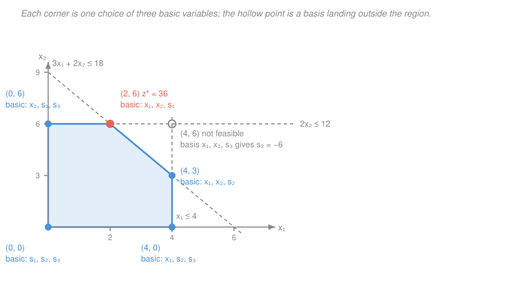

# Operations Research · Lesson 1.2: Vertices, bases & the fundamental theorem

> ⏱ ~15 min · Module 1: Linear Programming & the Simplex Method · Builds on: [1.1 Formulating linear programs](01-01-formulating-linear-programs.md), [`convex-optimization` 2.1](../../convex-optimization/lessons/02-01-convex-problem-local-global.md), [`linalg-refresher` 1.3](../../linalg-refresher/lessons/01-03-linear-systems-elimination-rank.md) · Unlocks: 1.3 (the simplex method)

## Why this matters

An LP has infinitely many feasible points. A computer can't check them all, so before anyone can write an algorithm, someone has to prove that the search can be *narrowed* — and narrowed to something **finite**. That is exactly what this lesson does. The geometric half of the argument you already own from [`convex-optimization`](../../convex-optimization/syllabus.md): the feasible set is a convex polyhedron and a linear objective is optimized on its boundary, at a corner. The half that's new, and the half simplex actually manipulates, is **algebraic**: a corner is not a picture to a solver, it's a *choice of which variables to set to zero*. Once you see that corners are subsets of columns, "walk from corner to corner" becomes a program you can write. Every pivot in [1.3](01-03-the-simplex-method.md) is a swap of one variable in and one out of that subset.

## The idea

Take the Wyndor LP from [1.1](01-01-formulating-linear-programs.md) and picture its feasible region: a five-sided polygon in the plane. The objective $3x_1 + 5x_2$ has level sets — straight parallel lines, one for each profit value. Maximizing means sliding that line as far "up" as it goes while still touching the polygon. Where does it last touch? **A corner.** Not the middle of the region (you could always slide further), not usually the middle of an edge (you'd slide to its end). If the line happens to be parallel to an edge, the last contact is that whole edge — but even then, the edge's *endpoints* are corners, so a corner is still among the winners.

So corners are all you ever have to look at. Now the switch that makes this computable. Look at the origin $(0,0)$. What makes it a corner? Two constraints are *tight* there: $x_1 = 0$ and $x_2 = 0$. At $(4,0)$, tight constraints are $x_1 \le 4$ and $x_2 \ge 0$. In two dimensions, **a corner is where two constraint lines cross** — enough tightness to pin the point down, no wiggle room left. And in [1.1](01-01-formulating-linear-programs.md) you converted each inequality into an equation by adding a slack variable, with "$\le$ is tight" becoming "that slack equals zero". So:

> **tight constraint $\;\Longleftrightarrow\;$ some variable equals zero.**

A corner is therefore just *a list of variables you set to zero*. Choose which ones, solve the leftover linear system for the rest, and you've computed a corner algebraically — no picture, no geometry, and it works identically in 2 dimensions or 2000. That is the whole trick.

## The formal version

### Imported from `convex-optimization` — stated, not re-derived

Three facts, each one sentence, each with a pointer. Deferring the proofs is deliberate; they belong to that course.

1. **The feasible set of an LP is a polyhedron** — a finite intersection of half-spaces $\{x : a_i^Tx \le b_i\}$ — and it is **convex**, because every half-space is convex and intersections of convex sets are convex. See [`convex-optimization` 1.1](../../convex-optimization/lessons/01-01-convex-sets-separating-hyperplane.md) and [1.2](../../convex-optimization/lessons/01-02-convex-set-zoo-operations.md).
2. **For a convex problem, every local optimum is global** — [`convex-optimization` 2.1](../../convex-optimization/lessons/02-01-convex-problem-local-global.md) — so we never have to worry about getting stuck in a false peak.
3. **A linear objective has no interior optimum** (unless it is constant): if $c \ne 0$ and $x$ is interior, you can step a little in the direction $c$ and strictly improve. So an optimum, if one exists, sits on the boundary.

An **extreme point** (or **vertex**) of a convex set $S$ is a point of $S$ that is *not* the midpoint of any segment between two other points of $S$: you cannot write $x = \tfrac12 u + \tfrac12 v$ with $u, v \in S$ and $u \ne v$. *In words: a corner is a point you can't get to by averaging two other feasible points* — it sticks out.

Combining these gives the consequence that matters here:

> **If an LP has an optimal solution, at least one optimal solution is at a vertex.**

### Standard form and slack form (notation, fixed for the course)

Standard form: maximize $c^Tx$ subject to $Ax \le b$, $x \ge 0$. Adding one slack $s_i \ge 0$ per inequality gives **slack form**, an equality system

$$Ax = b, \qquad x \ge 0,$$

where — recycling the letter $A$ — the matrix is now $m \times n$: $m$ constraint rows, $n$ variables *counting slacks*, and $n > m$. We assume the rows of $A$ are linearly independent, i.e. $\operatorname{rank} A = m$ ([`linalg-refresher` 1.3](../../linalg-refresher/lessons/01-03-linear-systems-elimination-rank.md)); a dependent row is either redundant or contradictory and can be dropped or detected.

Since $n > m$, the system $Ax = b$ is **underdetermined** — infinitely many solutions, an $(n-m)$-dimensional family. To pick one out, freeze $n - m$ degrees of freedom.

### Basic solutions

Choose $m$ of the $n$ variables to be **basic** (index set $B$) and the remaining $n - m$ to be **nonbasic** (index set $N$). Write $A_B$ for the $m \times m$ matrix of the basic columns.

> **Definition.** If $A_B$ is **invertible**, the choice $B$ is a **basis**. Setting $x_N = 0$ and solving $A_B x_B = b$ gives $x_B = A_B^{-1}b$; the resulting full vector $x$ is a **basic solution**. If in addition $x_B \ge 0$, it is a **basic feasible solution (BFS)**.

*In words: kill $n-m$ variables, and the square system left over has exactly one solution — that's your candidate corner. If none of its numbers came out negative, the candidate is genuinely feasible.*

Invertibility of $A_B$ is what guarantees "exactly one solution" — it is the square, full-rank, unique-solution case from [`linalg-refresher` 1.3](../../linalg-refresher/lessons/01-03-linear-systems-elimination-rank.md), and $A_B^{-1}$ exists precisely when those $m$ columns are linearly independent ([`linalg-refresher` 2.2](../../linalg-refresher/lessons/02-02-inverses-and-four-subspaces.md)). If the chosen columns are dependent, the square system has either no solution or a whole line of them — no single point, so no corner. Not every $m$-subset is a basis.

### The correspondence

> **Theorem (BFS $\Longleftrightarrow$ vertex).** $x$ is a basic feasible solution of $Ax = b,\ x \ge 0$ if and only if $x$ is an extreme point of the feasible set.

*In words: the corners of the polyhedron and the basic feasible solutions are the same objects, seen geometrically and algebraically.* The reason in plain language: a corner is a point held rigid by having enough constraints tight, and setting $n - m$ variables to zero is exactly the act of making $n - m$ constraints tight. Any fewer and the point could still slide along the remaining freedom — it would be in the interior of some edge or face, hence an average of two feasible neighbours, hence not extreme.

### The Fundamental Theorem of Linear Programming

> For an LP in slack form $\max c^Tx$ s.t. $Ax = b$, $x \ge 0$:
> **(a)** if a feasible solution exists, a *basic* feasible solution exists;
> **(b)** if an optimal solution exists, an optimal *basic* feasible solution exists.

*In words: whatever an LP can do, it can do at a corner.* This is the licence for simplex. The feasible set is infinite, but the set of bases is not — and (b) says nothing is lost by restricting attention to it. **A continuous search over infinitely many points collapses into a combinatorial search over finitely many subsets of columns.**

### How finite is "finite"?

At most $\binom{n}{m}$ bases, since a basis is a choice of $m$ columns from $n$ (and some choices fail to be invertible, so this is an upper bound, not a count). For Wyndor below, $\binom{5}{3} = 10$ — enumerable by hand. But the bound explodes:

$$\binom{100}{50} \approx 1.0 \times 10^{29}.$$

A modest LP with 50 constraints and 100 variables has up to $10^{29}$ bases; at a billion per second you'd need about $3 \times 10^{12}$ years, roughly 200 times the age of the universe. Enumeration is dead on arrival. What [1.3](01-03-the-simplex-method.md) supplies is a *guided* walk: start at one BFS, swap a single variable in and out to move to an adjacent one that is strictly better, and stop when no swap improves. Typically a few dozen pivots, not $10^{29}$.

## Picture

## Worked examples

### Example 1 — enumerate every basis of the Wyndor LP

The LP from [1.1](01-01-formulating-linear-programs.md), in thousands of dollars of profit per week:

$$\max\; 3x_1 + 5x_2 \quad \text{s.t.}\quad x_1 \le 4,\;\; 2x_2 \le 12,\;\; 3x_1 + 2x_2 \le 18,\;\; x_1, x_2 \ge 0.$$

Add slacks $s_1, s_2, s_3 \ge 0$:

$$\begin{aligned} x_1 \;+\; s_1 &= 4\\ 2x_2 \;+\; s_2 &= 12\\ 3x_1 + 2x_2 \;+\; s_3 &= 18\end{aligned}$$

So $m = 3$, $n = 5$, and the columns of $A$, in the variable order $(x_1, x_2, s_1, s_2, s_3)$, are

$$a_{x_1} = \begin{pmatrix}1\\0\\3\end{pmatrix},\; a_{x_2} = \begin{pmatrix}0\\2\\2\end{pmatrix},\; a_{s_1} = \begin{pmatrix}1\\0\\0\end{pmatrix},\; a_{s_2} = \begin{pmatrix}0\\1\\0\end{pmatrix},\; a_{s_3} = \begin{pmatrix}0\\0\\1\end{pmatrix},\quad b = \begin{pmatrix}4\\12\\18\end{pmatrix}.$$

There are $\binom{5}{3} = 10$ ways to pick three basic variables. Every one, solved:

| # | Basic $B$ | Nonbasic $=0$ | $(x_1, x_2, s_1, s_2, s_3)$ | Status | $z$ |
|---|---|---|---|---|---|
| 1 | $s_1, s_2, s_3$ | $x_1, x_2$ | $(0,\,0,\,4,\,12,\,18)$ | BFS — vertex $(0,0)$ | $0$ |
| 2 | $x_1, s_2, s_3$ | $x_2, s_1$ | $(4,\,0,\,0,\,12,\,6)$ | BFS — vertex $(4,0)$ | $12$ |
| 3 | $x_2, s_1, s_3$ | $x_1, s_2$ | $(0,\,6,\,4,\,0,\,6)$ | BFS — vertex $(0,6)$ | $30$ |
| 4 | $x_1, x_2, s_2$ | $s_1, s_3$ | $(4,\,3,\,0,\,6,\,0)$ | BFS — vertex $(4,3)$ | $27$ |
| 5 | $x_1, x_2, s_1$ | $s_2, s_3$ | $(2,\,6,\,2,\,0,\,0)$ | BFS — vertex $(2,6)$, **optimal** | $\mathbf{36}$ |
| 6 | $x_1, x_2, s_3$ | $s_1, s_2$ | $(4,\,6,\,0,\,0,\,-6)$ | basic, infeasible | — |
| 7 | $x_1, s_1, s_2$ | $x_2, s_3$ | $(6,\,0,\,-2,\,12,\,0)$ | basic, infeasible | — |
| 8 | $x_2, s_1, s_2$ | $x_1, s_3$ | $(0,\,9,\,4,\,-6,\,0)$ | basic, infeasible | — |
| 9 | $x_2, s_2, s_3$ | $x_1, s_1$ | none | $A_B$ singular — not a basis | — |
| 10 | $x_1, s_1, s_3$ | $x_2, s_2$ | none | $A_B$ singular — not a basis | — |

Three rows worked in full, so the pattern is visible:

- **Row 5.** Nonbasic $s_2 = s_3 = 0$. Row 2 gives $2x_2 = 12 \Rightarrow x_2 = 6$; row 3 gives $3x_1 + 12 = 18 \Rightarrow x_1 = 2$; row 1 gives $2 + s_1 = 4 \Rightarrow s_1 = 2$. All nonnegative: a BFS, at the point $(2,6)$, with $z = 3(2) + 5(6) = 36$.
- **Row 6.** Nonbasic $s_1 = s_2 = 0$. Row 1 gives $x_1 = 4$; row 2 gives $x_2 = 6$; row 3 gives $12 + 12 + s_3 = 18 \Rightarrow s_3 = -6$. A perfectly good *basic* solution — it solves $Ax = b$ — but $s_3 < 0$ means the third constraint is violated by 6. This is the hollow point at $(4,6)$ in the figure: the intersection of $x_1 = 4$ and $x_2 = 6$, which sits outside the region. **Not every basis gives a vertex.**
- **Row 9.** Nonbasic $x_1 = s_1 = 0$. Then row 1 reads $0 + 0 = 4$: contradiction. Algebraically, the basic columns $a_{x_2}, a_{s_2}, a_{s_3}$ all have a zero first entry, so $A_B$ has a zero row and $\det A_B = 0$. Geometrically you asked for the crossing point of $x_1 = 0$ and $x_1 = 4$ — **parallel lines**, no intersection. (Row 10 is the same story with $x_2 = 0$ and $x_2 = 6$.)

**The score:** 10 subsets, 8 genuine bases, 5 of them feasible — and those 5 are precisely the five corners $(0,0), (4,0), (4,3), (2,6), (0,6)$ drawn in the figure, one basis apiece. The 3 infeasible basic solutions are the "phantom corners" $(4,6), (6,0), (0,9)$ where constraint lines cross *outside* the region.

*Checks used.* (i) Every solved vector was substituted back into all three equations — e.g. row 4, $(4,3,0,6,0)$: $4 + 0 = 4$ ✓, $6 + 6 = 12$ ✓, $12 + 6 + 0 = 18$ ✓. (ii) The five feasible rows match the vertex list independently read off the graph. (iii) The best objective, $36$ at $(2,6)$, agrees with the syllabus's Module 1 answer key.

Scanning the $z$ column: $0 < 12 < 27 < 30 < 36$, so $x^* = (2,6)$ and $z^* = 36$ thousand dollars per week. **Five arithmetic problems replaced an infinite search.** Note also which variables are basic at the optimum — $x_1, x_2, s_1$ — telling you constraints 2 and 3 are binding ($s_2 = s_3 = 0$) while constraint 1 has 2 units of slack. That reading is the seed of Module 2.

### Example 2 — a tie along an edge

Keep Wyndor's constraints but change the objective to $3x_1 + 2x_2$, deliberately parallel to the third constraint. Evaluate at the five vertices: $(0,0) \to 0$, $(4,0) \to 12$, $(0,6) \to 12$, $(4,3) \to 18$, $(2,6) \to 18$. Two vertices tie at $18$ — and so does *every* point on the edge between them, since that edge lies on the line $3x_1 + 2x_2 = 18$. The sliding level set makes its last contact along a whole face, not a single point.

The theorem survives intact, and this is why it is phrased as "*an* optimal solution is basic" rather than "*the* optimum is a vertex": the optimal set here is infinite, but it still *contains* vertices, so a corner-hopping algorithm will find one and report a correct optimal value. Simplex returns $(4,3)$ or $(2,6)$ depending on its pivoting choices; both are right.

### Degeneracy, previewed

A BFS is **degenerate** if some *basic* variable equals zero. Geometrically that means more constraints are tight at the vertex than the dimension requires — three lines through one point in the plane, say, when two suffice. The correspondence then stops being one-to-one: several different bases produce the same geometric point, differing only in which zero-valued variable is nominally "in" the basis. Wyndor has no degenerate vertex (check the table: every basic variable in rows 1–5 is strictly positive), which is why its correspondence is exactly 5-for-5. Degeneracy is harmless for the theorem but poisonous for the algorithm — a pivot can swap bases without actually moving, and simplex can stall or even cycle forever. That is [1.4](01-04-initialization-degeneracy-cycling.md)'s problem.

### When there is no optimum

The theorem says "*if* an optimal solution exists" because two things can go wrong. An LP can be **infeasible** — the constraints contradict each other, the feasible set is empty, and there is no BFS at all (part (a) of the theorem, contrapositive). Or it can be **unbounded**: the feasible region runs to infinity in a direction along which the objective keeps improving, so there is no optimal value to attain and hence no optimal vertex, even though vertices exist and one of them is the best *vertex*. Both are genuine outcomes of real models, usually signalling a missing constraint or a sign error rather than an interesting answer, and simplex detects each — infeasibility during initialization, unboundedness when a ratio test finds nothing to limit it ([1.4](01-04-initialization-degeneracy-cycling.md)).

## Watch out

- **You might think every $m$-subset of variables gives a corner.** It doesn't, twice over: the columns can be dependent ($A_B$ singular, rows 9–10 — no solution at all), or the solution can come out with a negative entry (rows 6–8 — a real point, but outside the feasible region). $\binom{n}{m}$ is an *upper bound* on the number of vertices, often a loose one.
- **You might think "basic" means "nonzero" and "nonbasic" means "zero".** Only the second half is guaranteed. Nonbasic variables are zero by construction; basic variables are *allowed* to be nonzero, and when one happens to be zero anyway you have a degenerate BFS. Keeping this straight is what makes [1.4](01-04-initialization-degeneracy-cycling.md) make sense.
- **You might think the number of basic variables equals the number of original decision variables.** It equals $m$, the number of *constraints*, and slacks compete for those slots on equal footing. In Wyndor, $m = 3$ basic variables out of $n = 5$, and at the origin all three are slacks.
- **You might read "optimum at a vertex" as "the optimum is unique".** Example 2 is the counterexample: a face of ties. The correct statement is that the optimal set always *includes* a vertex.

## One-liner

> A corner is a choice of which $n - m$ variables to zero out; the fundamental theorem says the best corner is as good as the best point, which turns an infinite search into a finite one — and simplex into a possibility.

## Problems

**P1 (🟢)** For the LP $\max\, 4x_1 + 3x_2$ subject to $x_1 + x_2 \le 5$, $2x_1 + x_2 \le 8$, $x_1, x_2 \ge 0$: convert to slack form, state $m$, $n$, and $\binom{n}{m}$, then enumerate **all** basic solutions in a table, marking which are feasible. Report $x^*$ and $z^*$.

**P2 (🟡)** Consider the constraints $x_1 \le 2$, $x_2 \le 2$, $x_1 + x_2 \le 4$, $x_1, x_2 \ge 0$. Show that the point $(2,2)$ is feasible with all three slacks equal to zero, and list every basis whose basic solution is that point. How many are there, and why is each degenerate?

**P3 (🔴)** For $\max\, x_1 + x_2$ subject to $x_1 - x_2 \le 1$, $x_1, x_2 \ge 0$: enumerate all basic solutions, identify the best BFS and its objective value, then show the LP has no optimal solution. Explain why this does not contradict the fundamental theorem.

Solutions

**P1** Slack form, with $s_1, s_2 \ge 0$:

$$x_1 + x_2 + s_1 = 5, \qquad 2x_1 + x_2 + s_2 = 8.$$

So $m = 2$, $n = 4$, and $\binom{4}{2} = 6$ candidate bases. Columns in order $(x_1, x_2, s_1, s_2)$ are $(1,2)^T, (1,1)^T, (1,0)^T, (0,1)^T$ with $b = (5,8)^T$.

| Basic | Nonbasic $=0$ | Equations | $(x_1,x_2,s_1,s_2)$ | Status | $z$ |
|---|---|---|---|---|---|
| $s_1, s_2$ | $x_1, x_2$ | $s_1 = 5,\ s_2 = 8$ | $(0,0,5,8)$ | feasible — vertex $(0,0)$ | $0$ |
| $x_1, s_1$ | $x_2, s_2$ | $2x_1 = 8;\ x_1 + s_1 = 5$ | $(4,0,1,0)$ | feasible — vertex $(4,0)$ | $16$ |
| $x_2, s_2$ | $x_1, s_1$ | $x_2 = 5;\ x_2 + s_2 = 8$ | $(0,5,0,3)$ | feasible — vertex $(0,5)$ | $15$ |
| $x_1, x_2$ | $s_1, s_2$ | $x_1 + x_2 = 5;\ 2x_1 + x_2 = 8$ | $(3,2,0,0)$ | feasible — vertex $(3,2)$ | $\mathbf{18}$ |
| $x_1, s_2$ | $x_2, s_1$ | $x_1 = 5;\ 10 + s_2 = 8$ | $(5,0,0,-2)$ | infeasible ($s_2 < 0$) | — |
| $x_2, s_1$ | $x_1, s_2$ | $x_2 = 8;\ 8 + s_1 = 5$ | $(0,8,-3,0)$ | infeasible ($s_1 < 0$) | — |

All six selections have invertible $A_B$ here (e.g. for $\{x_1,x_2\}$, $\det\begin{pmatrix}1 & 1\\ 2 & 1\end{pmatrix} = -1 \ne 0$), so all six are bases; four are feasible, giving the four vertices $(0,0), (4,0), (3,2), (0,5)$. Comparing $z$: $\;x^* = (3,2)$, $z^* = 18$.

*Checks.* Substitution: $(3,2)$ gives $3 + 2 = 5 \le 5$ ✓ (tight) and $6 + 2 = 8 \le 8$ ✓ (tight) — consistent with both slacks nonbasic. Independent verification by duality (previewing 2.1): both constraints are tight and both $x_j > 0$, so the dual constraints hold with equality: $y_1 + 2y_2 = 4$ and $y_1 + y_2 = 3$, giving $y = (2,1) \ge 0$, and the dual objective is $5(2) + 8(1) = 18$ — matching $z^*$ exactly, which certifies optimality. ✓

**P2** Feasibility: $2 \le 2$ ✓, $2 \le 2$ ✓, $2 + 2 = 4 \le 4$ ✓. Slack form is

$$x_1 + s_1 = 2, \qquad x_2 + s_2 = 2, \qquad x_1 + x_2 + s_3 = 4,$$

so $m = 3$, $n = 5$, and at $(2,2)$ all three slacks are zero: $s_1 = 2 - 2 = 0$, $s_2 = 0$, $s_3 = 4 - 4 = 0$. Three constraint lines pass through the single point $(2,2)$, one more than the two the plane requires.

A basis needs 3 basic variables. The full vector is $(2,2,0,0,0)$, so the two *nonbasic* variables must be chosen from among the zero-valued ones, i.e. from $\{s_1, s_2, s_3\}$ — $x_1$ and $x_2$ are nonzero and must be basic. That leaves exactly $\binom{3}{2} = 3$ choices of which slack joins them:

- $B = \{x_1, x_2, s_1\}$, nonbasic $s_2 = s_3 = 0$: row 2 gives $x_2 = 2$, row 3 gives $x_1 = 2$, row 1 gives $s_1 = 0$. $\det A_B = -1 \ne 0$.
- $B = \{x_1, x_2, s_2\}$, nonbasic $s_1 = s_3 = 0$: row 1 gives $x_1 = 2$, row 3 gives $x_2 = 2$, row 2 gives $s_2 = 0$. $\det A_B = -1$.
- $B = \{x_1, x_2, s_3\}$, nonbasic $s_1 = s_2 = 0$: rows 1 and 2 give $x_1 = x_2 = 2$, row 3 gives $s_3 = 0$. $\det A_B = 1$.

So **three distinct bases produce the same point** $(2,2)$. Each is degenerate because in each case the third basic variable comes out equal to zero — the defining symptom. This is the many-to-one failure of the vertex-basis correspondence, and the reason simplex can pivot (change basis) without moving (change point).

*Check.* Each solution vector $(2,2,0,0,0)$ satisfies all three equations ✓, and the three determinants are nonzero, so all three really are bases rather than singular selections. ✓

**P3** Slack form: $x_1 - x_2 + s_1 = 1$, so $m = 1$, $n = 3$, $\binom{3}{1} = 3$ candidate bases — each basis is a single variable, with the other two set to zero.

| Basic | Nonbasic $=0$ | Solve | $(x_1,x_2,s_1)$ | Status | $z$ |
|---|---|---|---|---|---|
| $s_1$ | $x_1, x_2$ | $s_1 = 1$ | $(0,0,1)$ | feasible — vertex $(0,0)$ | $0$ |
| $x_1$ | $x_2, s_1$ | $x_1 = 1$ | $(1,0,0)$ | feasible — vertex $(1,0)$ | $1$ |
| $x_2$ | $x_1, s_1$ | $-x_2 = 1$ | $(0,-1,0)$ | infeasible ($x_2 < 0$) | — |

Best BFS: $(1,0)$ with $z = 1$. But the LP is **unbounded**. Take $x_1 = x_2 = t$ for any $t \ge 0$: then $x_1 - x_2 = 0 \le 1$ ✓ and $x_1, x_2 \ge 0$ ✓, so the point is feasible, while $z = x_1 + x_2 = 2t \to \infty$. No optimal solution exists.

No contradiction: the fundamental theorem is conditional — "*if* an optimal solution exists, an optimal BFS exists". Here the hypothesis fails, so the theorem asserts nothing, and in particular it never claims the best vertex is the best feasible point. Geometrically, the feasible region is an unbounded wedge whose two corners are $(0,0)$ and $(1,0)$; the objective's level lines slide forever up the ray direction $(1,1)$ without ever leaving the region, so there is no last point of contact to be a corner.

*Check.* Both feasible basic solutions satisfy the equation: $0 - 0 + 1 = 1$ ✓ and $1 - 0 + 0 = 1$ ✓. And the unbounded direction $(1,1)$ genuinely stays feasible because its two components cancel in $x_1 - x_2$ — exactly the pattern simplex's ratio test will flag in [1.4](01-04-initialization-degeneracy-cycling.md) as "no variable limits the increase". ✓

## Connections

- **Backward:** the slack form and the vocabulary of tight versus slack constraints come straight from [1.1](01-01-formulating-linear-programs.md); "unique solution of a square nonsingular system" and "linearly independent columns" are [`linalg-refresher` 1.3](../../linalg-refresher/lessons/01-03-linear-systems-elimination-rank.md) and [2.2](../../linalg-refresher/lessons/02-02-inverses-and-four-subspaces.md), and the notion of a basis of $\mathbb{R}^m$ is [`linalg-refresher` 1.2](../../linalg-refresher/lessons/01-02-linear-independence-basis-dimension.md) — an LP basis *is* a basis of $\mathbb{R}^m$ chosen from the columns of $A$.
- **Forward:** [1.3](01-03-the-simplex-method.md) turns "enumerate all bases" into "start at one BFS and swap one variable at a time, always improving", with reduced costs deciding what enters and the ratio test deciding what leaves. [1.4](01-04-initialization-degeneracy-cycling.md) handles the two loose ends left here: finding a starting BFS when the origin is infeasible, and surviving degeneracy. In Module 2, which variables are basic at the optimum is what reveals the shadow prices.
- **Sideways (convexity):** everything geometric here is a specialization of [`convex-optimization`](../../convex-optimization/syllabus.md). What makes LP special among convex programs is that its feasible set has *finitely many* extreme points — a quadratic objective over the same polyhedron can be optimized in the middle of a face, which is why [`convex-optimization` 2.2](../../convex-optimization/lessons/02-02-linear-quadratic-programs.md) needs different machinery. Interior-point methods ([`convex-optimization` 4.3](../../convex-optimization/lessons/04-03-barrier-interior-point.md)) deliberately reject the corner-hopping strategy of this lesson and cut through the middle of the polyhedron instead.
