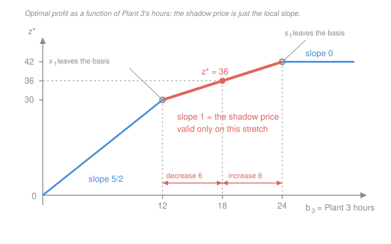

# Operations Research · Lesson 2.2: Shadow prices & sensitivity analysis

> ⏱ ~15 min · Module 2: Duality, Sensitivity & Network Structure · Builds on: [2.1 The LP dual & complementary slackness](02-01-lp-dual-complementary-slackness.md), [1.3 The simplex method](01-03-the-simplex-method.md) · Unlocks: 2.3 (network models & integrality), and every real consulting engagement you will ever do

## Why this matters

Here is the uncomfortable truth about solving a linear program: the optimal vector $x^*$ is often the *least* interesting thing the solver hands you. Nobody runs a factory by reading two numbers off a screen. The questions that actually get asked in the room are:

- **Which resource should I buy more of?** Plant time, warehouse space, a second truck — I have one budget and three options.
- **What is another hour of plant time actually worth?** Because a supplier is offering me overtime at a price, and I need to know whether to take it.
- **How wrong can my cost estimates be before this plan stops being the right plan?** The profit margins in my model are estimates. If they're off by 20 percent, do I rebuild the whole schedule?

Every one of these is answered by numbers that fall out of the *same* solve — the sensitivity report — and none of them is answered by $x^*$. This lesson is how you read that report. It is the single most practically valuable thing in the course.

The good news: you already computed the central quantity in [2.1](02-01-lp-dual-complementary-slackness.md) and called it the dual variable. The work here is (a) recognizing what it means economically, and (b) — the part people skip and then get burned by — finding out **how far you can trust it**.

## The idea

Imagine the optimal plan as a machine that has been squeezed into a corner by its constraints. Some constraints are pressing on it (**binding** — you're using every hour of that plant); others are slack (**non-binding** — you've got hours to spare).

Now loosen one constraint by a hair: give the factory one more hour at Plant 3. Profit goes up by some amount. That amount is the **shadow price** of Plant 3 time — the marginal value of one more unit of that resource. It is the most you should ever pay for an extra hour.

Two consequences, one obvious and one that everybody forgets:

1. **A non-binding constraint has shadow price zero.** More of something you weren't using anyway is worth nothing. Obvious in hindsight; routinely forgotten when someone is excited about buying more warehouse space they don't need.
2. **The price is a *local* rate, not a *global* one.** The plan re-optimizes as you add hours; eventually the extra hours push some *other* constraint into becoming the bottleneck, and from then on Plant 3 hours are worth something different (usually less). So "an hour of Plant 3 is worth 1 thousand dollars" is a half-finished sentence. The finished one is **"an hour of Plant 3 is worth 1 thousand dollars, for the next 6 hours."**

That pairing — **price plus range** — is the deliverable of this lesson. A price without a range is not actionable; it is a trap.

## The formal version

Throughout, the LP is in the course's standard form: maximize $z = c^Tx$ subject to $Ax \le b$, $x \ge 0$, where $x \in \mathbb{R}^n$ is the decision vector, $c \in \mathbb{R}^n$ the objective coefficients, $b \in \mathbb{R}^m$ the right-hand sides (resource availabilities), and $A \in \mathbb{R}^{m \times n}$ the technology matrix. $x^*$ is an optimal solution and $z^*$ the optimal value.

### Shadow price, defined

$$\boxed{\;y_i^* \;=\; \frac{\partial z^*}{\partial b_i}\;}$$

*In words: the shadow price of constraint $i$ is the rate at which the optimal objective value improves per unit increase in that constraint's right-hand side.* Its units are (objective units) per (unit of resource $i$) — here, thousands of dollars per hour.

**And the identification that makes this computable:** $y_i^*$ *is the optimal dual variable* for constraint $i$, the same $y$ you built in [2.1](02-01-lp-dual-complementary-slackness.md). You never have to compute a derivative. Strong duality is the reason: $z^* = b^Ty^*$, and locally $y^*$ doesn't move as $b$ moves, so $\partial z^*/\partial b_i = y_i^*$. The dual was always a pricing system for the primal's resources; this is the sentence that says so out loud.

### Complementary slackness, in pricing language

From [2.1](02-01-lp-dual-complementary-slackness.md): $s_i^* \, y_i^* = 0$ for every $i$, where $s_i = b_i - (Ax)_i \ge 0$ is the slack in constraint $i$. Read it as a market statement:

- $s_i^* > 0$ (slack resource) $\Rightarrow y_i^* = 0$. **A resource in surplus is free at the margin.**
- $y_i^* > 0$ (positive price) $\Rightarrow s_i^* = 0$. **Anything with a positive price is fully consumed.**

*In words: only bottlenecks have value.* The converse of the first bullet can fail — a **binding** constraint may still have shadow price zero, which is exactly the degenerate case flagged at the end of this lesson.

### The caveat, stated loudly: the price is valid only while the basis is

$y^*$ is a **marginal** rate computed at the current optimal **basis** $B$ (the set of basic variables from [1.2](01-02-vertices-bases-fundamental-theorem.md) and [1.3](01-03-the-simplex-method.md)). Push $b_i$ far enough and some basic variable is driven to zero and then negative — the basis becomes infeasible, simplex pivots to a *different* basis, and the shadow price changes. So $z^*$ as a function of $b_i$ is **piecewise linear**, and $y_i^*$ is the slope of the piece you're standing on. (It is also **concave**: successive slopes decrease — diminishing returns to a resource, which the picture below makes visible.)

### RHS ranging — the computation

Fix the basis $B$ and let $x_B$ denote the vector of basic variables. From [1.3](01-03-the-simplex-method.md), the basic solution is

$$x_B = B^{-1}b.$$

*In words: once you commit to which variables are basic, the basic values are determined linearly by the right-hand sides.* Vary $b_i$ alone and every entry of $x_B$ moves linearly. The basis stays **optimal** as long as it stays **feasible**, i.e.

$$x_B = B^{-1}b \;\ge\; 0 .$$

(Optimality of the *reduced costs* is untouched — they depend on $c$ and $B$, not on $b$.) So the recipe is:

1. Write each basic variable — **including the slacks that are basic** — as a function of $b_i$.
2. Impose $\ge 0$ on each. Each gives one inequality on $b_i$.
3. Intersect. That interval is the range over which the shadow price $y_i^*$ holds.

Solver vocabulary: the distance from the current $b_i$ up to the top of the interval is the **allowable increase**; down to the bottom, the **allowable decrease**. Every commercial LP solver prints these next to each shadow price. Now you know what they are.

### Objective-coefficient ranging

Different question, different condition. How far can a profit margin $c_j$ move before the current *vertex* stops being optimal? Feasibility never enters — $b$ hasn't changed — so what must hold is the **optimality** test from [1.3](01-03-the-simplex-method.md): every nonbasic reduced cost keeps its sign,

$$\bar{c}_j = c_j - y^TA_j \le 0 \quad \text{for all nonbasic } j,$$

for a maximization problem. For a slack column $A_j = e_i$ this reads $\bar{c}_{s_i} = -y_i \le 0$, i.e. **the condition is simply $y \ge 0$**, with $y$ recomputed as a function of the coefficient you're wiggling. That makes the computation easy: express the dual variables in terms of $c_j$ and demand they stay non-negative.

**The asymmetry that surprises people.** Compare the two kinds of ranging:

| You vary | Inside the range, $x^*$ | Inside the range, $y^*$ | What changes |
|---|---|---|---|
| $b_i$ (a right-hand side) | **moves** (linearly) | fixed | plan *and* value |
| $c_j$ (an objective coefficient) | **does not move at all** | moves | value only |

*In words: as long as $c_j$ stays in its range, the optimal plan is literally the same plan — you just make more or less money running it.* The basis is unchanged, so $x_B = B^{-1}b$ is unchanged. Only $z^* = c^Tx^*$ moves. This is why "my margin estimate might be off" is usually a much less alarming question than it sounds.

## Picture

The shadow price is the **slope of the piece you are standing on**. Walk far enough in either direction and you fall off onto a piece with a different slope — that is a basis change. The slopes decrease left to right (5/2, then 1, then 0), which is the concavity: each extra hour of Plant 3 is worth a little less than the one before, and past 24 hours, nothing at all.

## Worked examples

Both examples use the Wyndor Glass LP from [1.1](01-01-formulating-linear-programs.md) and Boss problem 1. Let $x_1, x_2$ be batches per week of products 1 and 2; profit is in **thousands of dollars per week**:

$$\max\; z = 3x_1 + 5x_2 \quad \text{s.t.} \quad \underbrace{x_1 \le 4}_{\text{Plant 1}}, \;\; \underbrace{2x_2 \le 12}_{\text{Plant 2}}, \;\; \underbrace{3x_1 + 2x_2 \le 18}_{\text{Plant 3}}, \;\; x_1,x_2 \ge 0.$$

Right-hand sides are plant hours per week. Known optimum: $x^* = (2,6)$, $z^* = 36$, basis $\{x_1, x_2, s_1\}$ with $s_1 = 4 - 2 = 2$ (Plant 1 has 2 idle hours); Plants 2 and 3 are binding. From [2.1](02-01-lp-dual-complementary-slackness.md), complementary slackness gives $y^* = (0, \tfrac32, 1)$, and $b^Ty^* = 4(0) + 12(\tfrac32) + 18(1) = 36 = z^*$. ✓

So the three shadow prices, in thousands of dollars per plant hour, are **0 for Plant 1** (it has slack — of course an idle hour is worth nothing), **1.5 for Plant 2**, and **1 for Plant 3**.

### Example 1 — ranging Plant 3's hours (Boss problem 2c)

Hold the basis $\{x_1, x_2, s_1\}$ and let $b_3$ vary from its nominal 18. Basic means: $s_2$ and $s_3$ are nonbasic, i.e. Plants 2 and 3 stay tight. Write all three basic variables as functions of $b_3$:

$$2x_2 = 12 \;\Longrightarrow\; x_2 = 6, \qquad 3x_1 + 2(6) = b_3 \;\Longrightarrow\; x_1 = \frac{b_3 - 12}{3}, \qquad s_1 = 4 - x_1 = 4 - \frac{b_3-12}{3}.$$

Now impose non-negativity, one basic variable at a time:

| Basic variable | Value | $\ge 0$ requires |
|---|---|---|
| $x_2$ | $6$ | always true |
| $x_1$ | $(b_3-12)/3$ | $b_3 \ge 12$ |
| $s_1$ | $4 - (b_3-12)/3$ | $b_3 \le 24$ |

$$\boxed{\;12 \le b_3 \le 24\;}$$

So the shadow price $y_3 = 1$ thousand dollars per hour is valid for Plant 3 capacities between 12 and 24 hours. Nominal is 18, so the **allowable increase is 6** and the **allowable decrease is 6**.

*Check.* On this range $z^* = 3\cdot\frac{b_3-12}{3} + 5(6) = b_3 + 18$ — a straight line of slope exactly $1 = y_3$, passing through $z^*(18) = 36$. ✓

**What happens at each end.**

- **At $b_3 = 12$:** $x_1 = 0$. The product-1 activity dies; $x_1$ leaves the basis. Below 12, Plant 3 is so tight that you make nothing but product 2 and Plant 2 goes slack; the optimum is $x = (0, b_3/2)$ with $z^* = \tfrac52 b_3$ — **slope 5/2, not 1**.
- **At $b_3 = 24$:** $s_1 = 0$, so Plant 1 becomes binding at $x_1 = 4$; $s_1$ leaves the basis. Above 24 the optimum is stuck at $x = (4,6)$, $z^* = 42$ — **slope 0**. Extra Plant 3 hours are worthless because Plants 1 and 2 are now the bottlenecks.

Both endpoint claims verified by direct solve: at $b_3 = 25$ the point $(4,6)$ satisfies $3(4)+2(6) = 24 \le 25$ and maximizes $3x_1+5x_2$ over $x_1\le4, x_2\le6$, giving 42. ✓

### Example 2 — ranging product 1's margin

Now hold $b$ and wiggle $c_1$ (nominally 3). Basis unchanged means $s_1$ basic $\Rightarrow y_1 = 0$, and $x_1, x_2$ basic $\Rightarrow$ their dual constraints hold with equality:

$$y_1 + 3y_3 = c_1 \;\Longrightarrow\; y_3 = \frac{c_1}{3}, \qquad 2y_2 + 2y_3 = 5 \;\Longrightarrow\; y_2 = \frac{5}{2} - \frac{c_1}{3}.$$

Demand $y \ge 0$: $\;y_3 \ge 0 \Rightarrow c_1 \ge 0$, and $y_2 \ge 0 \Rightarrow c_1 \le \tfrac{15}{2}$.

$$\boxed{\;0 \le c_1 \le 7.5\;}$$

Allowable increase 4.5, allowable decrease 3.

*Check both endpoints by comparing vertices.* At $c_1 = 7.5$: vertex $(2,6)$ gives $15+30 = 45$ and its neighbour $(4,3)$ gives $30+15 = 45$ — a tie, exactly the alternate-optima boundary. ✓ At $c_1 = 0$: $(2,6)$ gives 30 and $(0,6)$ gives 30 — tie again. ✓ Just outside, at $c_1 = 9$: $(4,3)$ gives 51 beating $(2,6)$'s 48, so the vertex really has changed. ✓

And the asymmetry in action: at $c_1 = 3.6$ the optimal plan is *still* $(2,6)$ — you don't rebuild anything — the value just rises to $3.6(2) + 5(6) = 37.2$.

### The payoff: management asks

Here is the full sensitivity report for Wyndor, assembled from the work above (the $c_2$ and $b_1, b_2$ rows are computed the same way; $b_2$ is P1 below):

| Item | Value | Shadow price / margin | Allowable decrease | Allowable increase | Valid range |
|---|---|---|---|---|---|
| $b_1$ (Plant 1 hours) | 4 | $y_1 = 0$ | 2 | $\infty$ | $b_1 \ge 2$ |
| $b_2$ (Plant 2 hours) | 12 | $y_2 = 1.5$ | 6 | 6 | $6 \le b_2 \le 18$ |
| $b_3$ (Plant 3 hours) | 18 | $y_3 = 1$ | 6 | 6 | $12 \le b_3 \le 24$ |
| $c_1$ (product 1 margin) | 3 | — | 3 | 4.5 | $0 \le c_1 \le 7.5$ |
| $c_2$ (product 2 margin) | 5 | — | 3 | $\infty$ | $c_2 \ge 2$ |

Now answer real questions **without re-solving anything**.

**Q1. "Plant 3 can run 4 extra hours a week on overtime, at a premium of 2 thousand dollars per hour. Worth it?"**

Check the range first: $18 + 4 = 22 \le 24$, so all 4 hours are inside the allowable increase and each is worth the full shadow price. Gain $= 4 \times 1 = 4$ thousand dollars. Cost $= 4 \times 2 = 8$ thousand. **No** — it costs twice what it returns.

Note how thin the margin of judgement is: at a premium of 0.5 thousand dollars per hour (500 dollars), gain 4 versus cost 2, and the answer **flips to yes**, worth 2 thousand dollars a week. The shadow price is the exact break-even price for the resource. Above it, decline; below it, buy.

**Q2. "Forget 4 hours — what if we could get 10 extra hours?" (Read this one twice.)**

The tempting arithmetic is $10 \times 1 = 10$ thousand dollars. **It is wrong.** The allowable increase is 6. Only the first 6 hours — taking $b_3$ from 18 to 24 — are worth 1 thousand each, for 6 thousand dollars. At $b_3 = 24$ the basis changes ($s_1$ leaves), and beyond that point the shadow price is something *else*. You cannot read it off the report; the report's job ends at the edge of the range. **You must re-solve.**

In this case we did re-solve, in Example 1, and the answer is brutal: past 24 hours the shadow price is **0**. Hours 7 through 10 are worth exactly nothing. True value of the 10-hour offer: 6 thousand dollars, not 10 — a 40 percent overestimate from one innocent multiplication.

This is the single most common way sensitivity analysis is misused in practice: taking a marginal price and multiplying it by a non-marginal quantity. **The shadow price is only a price inside its range.**

**Q3. "Which plant should we expand first?"**

Compare shadow prices: Plant 2 at 1.5 beats Plant 3 at 1, and Plant 1 at 0 is not even in the conversation (it already has idle hours). So Plant 2 hours are the ones to buy — but only up to its allowable increase of 6 (P1 asks you to derive that range yourself).

**Q4. "Marketing thinks product 1's margin estimate could be off by 20 percent. Do we need a new plan?"**

Twenty percent of 3 is 0.6, so $c_1 \in [2.4, 3.6]$. The allowable range is $[0, 7.5]$ — the whole interval sits comfortably inside. **The plan does not change at all:** still 2 batches of product 1 and 6 of product 2. Only the projected profit moves, from $2.4(2)+30 = 34.8$ to $3.6(2)+30 = 37.2$ thousand dollars. That is a forecasting question, not a scheduling one, and you can tell marketing to stop worrying about the schedule.

## Watch out

- **You might think a binding constraint always has a positive shadow price.** Complementary slackness only guarantees the reverse (positive price $\Rightarrow$ binding). A constraint can be exactly tight and still worth zero at the margin — that is precisely a **degenerate** optimum, where more basic variables than necessary sit at zero.
- **Degeneracy makes the price genuinely ambiguous — and solvers don't warn you.** At a degenerate optimum the left and right derivatives of $z^*$ with respect to $b_i$ *differ*, so there is no single number "the shadow price": pushing the resource up and pulling it down have different rates. Look at the figure at $b_3 = 12$ exactly — that is a kink, the optimum $(0,6)$ has the basic variable $x_1$ sitting at zero (degenerate, in the sense of [1.4](01-04-initialization-degeneracy-cycling.md)), and the left slope is $5/2$ while the right slope is $1$. A solver reports one of them, silently, depending on which basis it happened to stop at. If a shadow price is driving a real decision and the optimum is degenerate, **re-solve with $b_i$ nudged both ways** and see which number you actually get.
- **You might multiply a shadow price by a large quantity.** Q2 above. This is the mistake, and it is always the mistake. Marginal rate, marginal quantity.
- **You might expect the two rangings to behave alike.** They don't: varying $b_i$ inside its range moves $x^*$ but not $y^*$; varying $c_j$ inside its range moves $y^*$ but leaves $x^*$ untouched.
- **Range validity is one-at-a-time.** The allowable increases in the report assume everything else stays put. Change two right-hand sides simultaneously and the printed ranges are no longer a guarantee (the honest fix is the "100 percent rule" or, better, just re-solve).

## One-liner

> A shadow price is the slope of a piecewise-linear concave value function — the marginal worth of one more unit of a resource — and it is worth exactly nothing to you without the range over which that slope holds.

## Problems

**P1 (🟢)** For the Wyndor LP, compute the RHS range over which the shadow price $y_2 = 1.5$ on Plant 2 stays valid. (Hold the basis $\{x_1, x_2, s_1\}$, write each basic variable as a function of $b_2$, and impose non-negativity.) State the allowable increase and decrease, and say which variable leaves the basis at each end.

**P2 (🟡)** A subcontractor offers Wyndor a **block** of 5 extra Plant 2 hours per week — all or nothing — for a total of 8 thousand dollars per week. Using your answer to P1, should Wyndor take the deal? What is the highest total price the block is worth? What would you tell them if the offer were 9 hours instead of 5?

**P3 (🔴)** Find the allowable range on $c_2$, the margin of product 2 (nominally 5), holding everything else fixed. Verify the endpoint by comparing vertex values, and explain in one sentence why the allowable *increase* is infinite.

Solutions

**P1** Basis $\{x_1, x_2, s_1\}$ keeps Plants 2 and 3 tight, so with $b_2$ variable:

$$2x_2 = b_2 \;\Rightarrow\; x_2 = \frac{b_2}{2}, \qquad 3x_1 + b_2 = 18 \;\Rightarrow\; x_1 = 6 - \frac{b_2}{3}, \qquad s_1 = 4 - x_1 = \frac{b_2}{3} - 2.$$

Non-negativity of each:

| Basic variable | Value | $\ge 0$ requires |
|---|---|---|
| $x_2$ | $b_2/2$ | $b_2 \ge 0$ |
| $x_1$ | $6 - b_2/3$ | $b_2 \le 18$ |
| $s_1$ | $b_2/3 - 2$ | $b_2 \ge 6$ |

Intersecting: $6 \le b_2 \le 18$. Nominal 12, so **allowable decrease 6, allowable increase 6**.

At $b_2 = 6$, $s_1 = 0$ — Plant 1 becomes binding and $s_1$ leaves the basis (optimum $(4,3)$). At $b_2 = 18$, $x_1 = 0$ — product 1 dies and $x_1$ leaves (optimum $(0,9)$).

*Check.* On the range $z^* = 3\left(6 - \frac{b_2}{3}\right) + 5\cdot\frac{b_2}{2} = 18 + \tfrac32 b_2$, slope $\tfrac32 = y_2$ ✓, and $z^*(12) = 18+18 = 36$ ✓. Endpoint feasibility: at $b_2=18$, $(0,9)$ gives $3(0)+2(9) = 18$, Plant 3 exactly tight ✓, $z = 45 = 18 + 27$ ✓. At $b_2 = 6$, $(4,3)$ gives $12+6 = 18$ tight ✓ and $x_1 = 4$ hits Plant 1 exactly ✓, $z = 27 = 18+9$ ✓.

**P2** Five hours takes $b_2$ from 12 to 17, which is inside the allowable increase of 6 — so all five hours carry the full shadow price of 1.5 thousand dollars each:

$$\text{gain} = 5 \times 1.5 = 7.5 \text{ thousand dollars per week}, \qquad \text{cost} = 8 \text{ thousand}.$$

**Decline** — it loses 0.5 thousand dollars a week. The block is worth at most **7.5 thousand dollars**; at any price strictly below that, take it.

For 9 hours the answer is "I can't tell you from this report." Nine hours takes $b_2$ to 21, past the range endpoint of 18, where the basis changes. The first 6 hours are worth $6 \times 1.5 = 9$ thousand; the remaining 3 are worth an unknown lesser amount and **must be evaluated by re-solving**. (Re-solving: above $b_2 = 18$ Plant 2 stops binding and the optimum sticks at $(0,9)$ with $z^* = 45$, so those last 3 hours are worth zero and the whole 9-hour block is worth 9 thousand — not the naive $9 \times 1.5 = 13.5$.)

**P3** Hold the basis. $s_1$ basic $\Rightarrow y_1 = 0$; $x_1, x_2$ basic $\Rightarrow$ their dual constraints are tight:

$$y_1 + 3y_3 = 3 \;\Longrightarrow\; y_3 = 1, \qquad 2y_2 + 2y_3 = c_2 \;\Longrightarrow\; y_2 = \frac{c_2}{2} - 1.$$

Optimality needs $y \ge 0$. Here $y_3 = 1 \ge 0$ regardless of $c_2$, and $y_2 \ge 0$ requires $c_2 \ge 2$. So

$$c_2 \ge 2, \qquad \text{allowable decrease } 3, \qquad \text{allowable increase } \infty.$$

*Endpoint check.* At $c_2 = 2$: $(2,6)$ gives $6 + 12 = 18$, and $(4,3)$ gives $12 + 6 = 18$ — tied, the alternate-optima boundary ✓. Just below, at $c_2 = 1$: $(4,3)$ gives $15$ beating $(2,6)$'s $12$, so the vertex has switched ✓.

**Why the increase is infinite:** raising product 2's margin only makes you want *more* $x_2$, and $x_2$ is already pinned at its ceiling of 6 by Plant 2. Given $x_2 = 6$, the best remaining choice of $x_1$ is 2 (whatever Plant 3 leaves over), and that doesn't depend on $c_2$. No amount of extra margin on product 2 can make a different vertex look better, so the vertex $(2,6)$ is optimal for every $c_2 \ge 2$. (Sanity: at $c_2 = 100$, $(2,6)$ gives 606 versus $(0,6)$'s 600 ✓.)

## Flashback

**From Lesson 1.3 (The simplex method)** — a fresh LP, one pivot, not the Wyndor problem:

Maximize $z = 4x_1 + 3x_2$ subject to $2x_1 + x_2 \le 10$, $x_1 + 3x_2 \le 15$, $x_1, x_2 \ge 0$. Starting from the origin with slacks $s_1, s_2$ basic, perform **one** simplex pivot: name the entering variable, do the ratio test to find the leaving variable, write the new tableau, and say whether you are done.

Solution

Initial tableau (row 0 written as $z - 4x_1 - 3x_2 = 0$):

| Basic | $x_1$ | $x_2$ | $s_1$ | $s_2$ | RHS |
|---|---|---|---|---|---|
| $z$ | $-4$ | $-3$ | 0 | 0 | 0 |
| $s_1$ | 2 | 1 | 1 | 0 | 10 |
| $s_2$ | 1 | 3 | 0 | 1 | 15 |

**Entering:** most negative row-0 coefficient is $-4$, so $x_1$ enters.

**Ratio test:** $10/2 = 5$ and $15/1 = 15$. The minimum is 5, so the $s_1$ row is the pivot row and **$s_1$ leaves**. Pivot element 2.

New pivot row = old $\div\, 2$: $(1,\; 0.5,\; 0.5,\; 0 \mid 5)$.
New $s_2$ row = old $-\,1 \times$ pivot row: $(0,\; 2.5,\; -0.5,\; 1 \mid 10)$.
New row 0 = old $+\,4 \times$ pivot row: $(0,\; -1,\; 2,\; 0 \mid 20)$.

| Basic | $x_1$ | $x_2$ | $s_1$ | $s_2$ | RHS |
|---|---|---|---|---|---|
| $z$ | 0 | $-1$ | 2 | 0 | 20 |
| $x_1$ | 1 | 0.5 | 0.5 | 0 | 5 |
| $s_2$ | 0 | 2.5 | $-0.5$ | 1 | 10 |

Current vertex $(5, 0)$ with $z = 20$. **Not optimal:** $x_2$ still has a negative row-0 coefficient ($-1$), so another pivot is available.

*Check (where it ends up).* Next pivot: $x_2$ enters, ratios $5/0.5 = 10$ and $10/2.5 = 4$, so $s_2$ leaves; $x_2 = 4$, $x_1 = 5 - 0.5(4) = 3$, $z = 12+12 = 24$. Verify by duality (the [2.1](02-01-lp-dual-complementary-slackness.md) trick): both constraints tight, so $2y_1 + y_2 = 4$ and $y_1 + 3y_2 = 3$ give $y = (1.8, 0.4)$, both non-negative, with dual objective $10(1.8) + 15(0.4) = 24 = z$ ✓.

Note in passing that this optimum's shadow prices are $y_1 = 1.8$ and $y_2 = 0.4$ — resource 1 is nearly five times as valuable at the margin as resource 2, which is exactly the kind of reading this lesson is about.

## Connections

- **Backward:** the shadow price *is* the dual variable of [2.1](02-01-lp-dual-complementary-slackness.md); complementary slackness is what makes "slack resource, zero price" automatic. The feasibility condition $B^{-1}b \ge 0$ that drives RHS ranging is the basic-solution machinery of [1.2](01-02-vertices-bases-fundamental-theorem.md), and the sign test on reduced costs that drives objective ranging is the optimality test of [1.3](01-03-the-simplex-method.md). Degenerate optima — the ambiguous-price case — are [1.4](01-04-initialization-degeneracy-cycling.md)'s.
- **Forward:** in [2.3](02-03-network-models-integrality.md), shadow prices on the supply/demand nodes of a transportation problem become **node potentials** and price a whole logistics network. In [3.2](03-02-branch-and-bound-cutting-planes.md), the LP relaxation's dual bound is what lets branch-and-bound prune — the same duality, used as a certificate instead of a price. Beware, though: integer programs have **no** clean shadow-price theory, because the value function stops being concave and piecewise linear.
- **Sideways (economics):** $\partial z^*/\partial b_i = y_i^*$ is exactly the **envelope theorem** — the Lagrange multiplier on a constraint equals the marginal value of relaxing it — from [`grad-micro` 1.4](../../grad-micro/lessons/01-04-envelope-theorem-duality.md). A shadow price is the marginal utility of income wearing a hard hat. The general-convex version, where the multiplier prices a constraint and the dual function is concave in $b$, is [`convex-optimization` 3.1](../../convex-optimization/lessons/03-01-lagrangian-dual-function.md) and [3.4](../../convex-optimization/lessons/03-04-geometry-of-duality.md) — that course carries the *theory* of the price; **the ranging computation in this lesson lives only here**, because it is specifically a statement about bases, and bases are a simplex idea.
