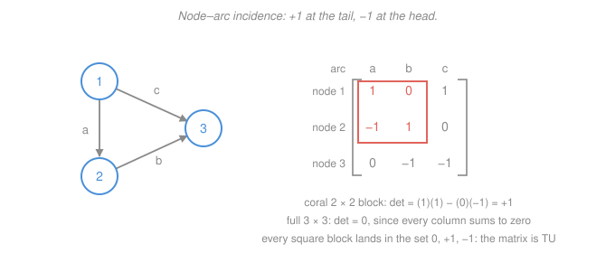

# Operations Research · Lesson 2.3: Network models & integrality

> ⏱ ~15 min · Module 2: Duality, Sensitivity & Network Structure · Builds on: [2.2 Shadow prices & sensitivity](02-02-shadow-prices-sensitivity.md), [`graph-theory` 4.1](../../graph-theory/lessons/04-01-flow-networks-maxflow-mincut.md) · Unlocks: 3.1 (modeling with integer variables), 3.2 (branch-and-bound)

## Why this matters

An enormous share of real operations research is *stuff moving through a network*: crates from plants to warehouses, nurses onto shifts, packets across links, cash between accounts. Written as linear programs these problems all share one skeleton, and that skeleton pays two dividends. First, **the LP optimum comes out in whole numbers by itself** — you never ship 3.7 crates, and you never have to ask for integrality, which matters enormously because asking for integrality in general is brutally expensive ([3.2](03-02-branch-and-bound-cutting-planes.md)). Second, the structure lets specialized algorithms run orders of magnitude faster than general simplex.

**What this lesson does not do.** The *algorithms and theorems* of network flow already live in `graph-theory`: max-flow/min-cut and Ford–Fulkerson's augmenting-path method ([4.1](../../graph-theory/lessons/04-01-flow-networks-maxflow-mincut.md), [4.2](../../graph-theory/lessons/04-02-augmenting-paths-ford-fulkerson.md)), Menger's theorem ([4.3](../../graph-theory/lessons/04-03-menger-flows-matching.md)), bipartite matching and Hall's condition ([2.3](../../graph-theory/lessons/02-03-bipartite-matching-hall.md)), König's theorem ([2.4](../../graph-theory/lessons/02-04-konig-covers.md)). Take those as known — *max flow equals min cut, and Ford–Fulkerson finds both by pushing flow along augmenting paths in the residual graph* — and that is all the combinatorics we need. Our budget goes to the **LP view**: these problems as linear programs, and the matrix property that makes their answers integral for free.

## The idea

Picture a shipping problem. Two plants have crates to send; three stores need crates. Every plant–store pair has a cost per crate. You choose how many crates travel on each lane. Costs are linear, quantities are nonnegative, supplies and demands are budgets — so it's an LP, and everything from Module 1 and [2.1](02-01-lp-dual-complementary-slackness.md) applies unchanged.

What's special is the *shape* of the constraint matrix. Every variable $x_{ij}$ — the flow on one lane — appears in exactly two constraints: the one for where it leaves, and the one for where it arrives. So each column of $A$ is nearly empty: one $+1$, one $-1$, zeros everywhere else. That sparse, signed pattern is the **node–arc incidence matrix** of the network, and it is the source of every good property in this lesson.

Here's the punchline in plain language. A vertex of an LP's feasible region comes from solving a square system $Bx_B = b$ ([1.2](01-02-vertices-bases-fundamental-theorem.md)'s basic feasible solution), and solving a square system means dividing by a determinant — which is exactly where fractions are born. But when $A$ is an incidence matrix, *every* square chunk of it has determinant $0$, $+1$, or $-1$, so the division is by $\pm 1$ and nothing fractional can appear. Integer data in, integer vertices out. Simplex, which only ever visits vertices, therefore hands you a whole-number shipping plan without being asked. That property has a name — **total unimodularity** — and it is the theoretical core of this lesson.

## The formal version

### The transportation problem

$m$ **supply nodes** (plants) indexed $i$, with supply $s_i$ (units available); $n$ **demand nodes** (stores) indexed $j$, with requirement $d_j$ (units needed); a cost $c_{ij}$ (dollars per unit) to ship one unit from $i$ to $j$. Decision variable $x_{ij} \ge 0$ is the number of units shipped on lane $(i,j)$.

$$\min \; \sum_{i=1}^{m}\sum_{j=1}^{n} c_{ij}x_{ij} \quad \text{subject to} \quad \sum_{j=1}^{n} x_{ij} = s_i \;\; \forall i, \qquad \sum_{i=1}^{m} x_{ij} = d_j \;\; \forall j, \qquad x_{ij} \ge 0.$$

*In words: ship at minimum total cost, emptying each plant exactly and filling each store exactly.*

Equalities are legitimate only under the **balance condition** $\sum_i s_i = \sum_j d_j$ — total supply equals total demand. If it fails, the constraints as written are infeasible. The fix is a modeling trick worth memorizing:

- **Excess supply** ($\sum s_i > \sum d_j$): add a **dummy demand node** with requirement $\sum s_i - \sum d_j$ and cost $0$ from every plant. Units "shipped" there are the ones that stay put.
- **Excess demand** ($\sum d_j > \sum s_i$): add a **dummy supply node** with supply $\sum d_j - \sum s_i$ and cost $c_{ij}$ equal to the **shortage penalty** at store $j$ (lost margin, expediting fee, or $0$ if unmet demand is free). Units "shipped" from it are the ones that never arrive.

Either way you restore balance, keep the network structure, and get an LP whose answer reads back as a real decision.

One redundancy to be aware of: with balance, the $m+n$ equality constraints have rank $m+n-1$ (summing the supply rows and summing the demand rows give the same equation). So a basic solution has $m+n-1$ basic cells, not $m+n$.

### The assignment problem

Set every $s_i = 1$ and every $d_j = 1$ with $m = n$: $n$ workers, $n$ jobs, cost $c_{ij}$ (hours, or dollars) of putting worker $i$ on job $j$.

$$\min \sum_{i}\sum_{j} c_{ij}x_{ij} \quad \text{s.t.} \quad \sum_{j} x_{ij} = 1 \;\;\forall i, \qquad \sum_{i} x_{ij} = 1 \;\;\forall j, \qquad 0 \le x_{ij} \le 1.$$

*In words: give every worker exactly one job and every job exactly one worker, as cheaply as possible.*

The key fact, and the reason this appears in an LP course rather than only a combinatorics one: **solved as a plain LP with $0 \le x_{ij} \le 1$, this automatically returns a 0/1 answer.** You do not write $x_{ij} \in \{0,1\}$, and you do not run an integer-programming solver. Every vertex of that polytope is a permutation matrix.

This is the same object as bipartite matching ([`graph-theory` 2.3](../../graph-theory/lessons/02-03-bipartite-matching-hall.md)) with weights on the edges. The classical combinatorial algorithm for it is the **Hungarian algorithm**, which repeatedly subtracts row and column minima to expose a zero-cost perfect matching in $O(n^3)$; we name it and move on, since its correctness rides on König's theorem, already proved in [`graph-theory` 2.4](../../graph-theory/lessons/02-04-konig-covers.md).

### Min-cost flow: the umbrella model

Take a directed graph $G = (N, A)$ with node set $N$ and arc set $A$. For each arc $(i,j) \in A$: unit cost $c_{ij}$, capacity $u_{ij}$, and flow variable $x_{ij}$. For each node $i$: a **net supply** $b_i$, positive if the node produces, negative if it consumes, zero if it merely passes flow through.

$$\min \sum_{(i,j)\in A} c_{ij}x_{ij} \quad \text{s.t.} \quad \underbrace{\sum_{j:(i,j)\in A} x_{ij} \;-\; \sum_{j:(j,i)\in A} x_{ji} \;=\; b_i \;\;\forall i \in N}_{\text{flow conservation}}, \qquad 0 \le x_{ij} \le u_{ij}.$$

*In words: at every node, what leaves minus what arrives equals what that node produces — and no arc carries more than it can hold.* Feasibility requires $\sum_{i} b_i = 0$: the network as a whole must balance.

The constraint matrix of the conservation block **is** the node–arc incidence matrix of $G$. And essentially every network problem you will meet is this one LP with the dials set differently:

| Special case | How to set the dials |
|---|---|
| **Shortest path** $s \to t$ | $b_s = 1$, $b_t = -1$, all other $b_i = 0$; $c_{ij}$ = arc length; capacities $\infty$ |
| **Max flow** $s \to t$ | all $c_{ij} = 0$, all $b_i = 0$, plus one artificial return arc $t \to s$ with cost $-1$ and infinite capacity |
| **Transportation** | bipartite graph; $b_i = s_i$ at plants, $b_j = -d_j$ at stores; capacities $\infty$ |
| **Assignment** | transportation with every $b_i = \pm 1$ |
| **Transshipment** | any node with $b_i = 0$ — a warehouse that only relays |

That unification is the best idea in the lesson: one LP, one integrality guarantee, five textbook problems.

### Total unimodularity and the integrality theorem

**Definition.** A matrix $A$ with integer entries is **totally unimodular (TU)** if every square submatrix of $A$ has determinant $0$, $+1$, or $-1$. (A submatrix means: pick any set of rows and an equally sized set of columns, keep those intersections.)

*In words: no matter which square block you carve out, its determinant is either zero or has magnitude exactly one — never anything bigger.* Note the $1 \times 1$ blocks are the entries themselves, so a TU matrix has all entries in $\{0, +1, -1\}$.

**Integrality theorem.** *If $A$ is TU and $b$ is an integer vector, then every basic feasible solution of $\{x : Ax = b,\; x \ge 0\}$ is integral. Consequently the LP optimum is integral, and you may drop any integrality constraints for free.*

*In words: TU matrix plus whole-number data means every corner of the feasible region already sits on whole numbers, so the LP hands you an integer answer without being asked.*

**Why, in one line.** A basic feasible solution sets the nonbasic variables to $0$ and solves $Bx_B = b$, where $B$ is a nonsingular square submatrix of $A$. Cramer's rule ([`linalg-refresher` 2.3](../../linalg-refresher/lessons/02-03-determinants.md)) gives $B^{-1} = \operatorname{adj}(B)/\det B$; the adjugate entries are cofactors, i.e. determinants of integer matrices, hence integers, and $\det B = \pm 1$ by TU. So $B^{-1}$ is an integer matrix and $x_B = B^{-1}b$ is an integer vector. $\blacksquare$

**The node–arc incidence matrix of a directed graph is TU.** We state this without proof (the standard argument is induction on submatrix size: any square submatrix either has a zero column, or a column with a single nonzero — expand along it — or has every column containing one $+1$ and one $-1$, in which case the rows sum to zero and the determinant is $0$).

The practical consequence deserves a box, because it is genuinely striking:

$$\boxed{\;\text{Network-flow LPs with integer supplies and capacities never need branch-and-bound.}\;}$$

Integer programming is NP-hard in general and [3.2](03-02-branch-and-bound-cutting-planes.md) will show you how much machinery it takes. Network problems escape all of it, and TU is the reason.

**Be honest about the boundary.** Three caveats, all of which matter:

- TU is **sufficient, not necessary**. A non-TU matrix can still happen to give integral optima on particular data.
- **Most LPs are not TU.** It is a fragile, special property, not a generic one.
- **One extra row usually destroys it.** Bolt a budget constraint $\sum_{ij} c_{ij}x_{ij} \le K$ onto a transportation problem, or a cardinality limit "use at most 4 lanes", and the constraint matrix is no longer an incidence matrix. Integrality evaporates and you are back in integer programming. This is exactly why Module 3 exists.

### Modeling kit

Three small idioms that cover most of what you'll actually need to encode:

- **Transshipment node.** A hub that neither produces nor consumes: set $b_i = 0$ and let conservation do the work. Plants → hubs → stores is just a three-layer min-cost flow.
- **Arc capacity.** A lane with a truck limit: $x_{ij} \le u_{ij}$. Integer capacities preserve integrality (the bound rows keep the enlarged matrix TU).
- **Lower bound ("must ship at least $\ell_{ij}$").** Substitute $x_{ij} = \ell_{ij} + x'_{ij}$ with $x'_{ij} \ge 0$, and reduce $b_i$ by $\ell_{ij}$ at the tail and increase it by $\ell_{ij}$ at the head. Integer $\ell_{ij}$ keeps the shifted right-hand side integral, so integrality survives the substitution.

## Picture

**Reading the second panel.** Arcs are $a = (1 \to 2)$, $b = (2 \to 3)$, $c = (1 \to 3)$. Each column has a $+1$ in the tail's row and a $-1$ in the head's row:

$$A = \begin{pmatrix} 1 & 0 & 1 \\ -1 & 1 & 0 \\ 0 & -1 & -1 \end{pmatrix}.$$

Spot-check the TU claim on three blocks:

- rows $\{1,2\}$, columns $\{a,b\}$: $\det\begin{pmatrix}1 & 0\\ -1 & 1\end{pmatrix} = (1)(1) - (0)(-1) = +1$.
- rows $\{1,3\}$, columns $\{b,c\}$: $\det\begin{pmatrix}0 & 1\\ -1 & -1\end{pmatrix} = (0)(-1) - (1)(-1) = +1$.
- the full $3 \times 3$: every column sums to $0$, so the three rows sum to the zero vector — they are dependent and $\det A = 0$.

All in $\{0, \pm 1\}$, as promised.

## Worked examples

**Example 1 (transportation — the instance in the figure).** Plants A and B have 30 and 50 units; stores W1, W2, W3 need 20, 35, 25. Supply $30 + 50 = 80$ equals demand $20 + 35 + 25 = 80$, so it is balanced — no dummy needed. Unit costs (dollars per unit):

| | W1 | W2 | W3 |
|---|---|---|---|
| **A** | 4 | 6 | 9 |
| **B** | 5 | 3 | 8 |

The LP is $\min 4x_{A1} + 6x_{A2} + 9x_{A3} + 5x_{B1} + 3x_{B2} + 8x_{B3}$ subject to $x_{A1}+x_{A2}+x_{A3} = 30$, $x_{B1}+x_{B2}+x_{B3} = 50$, $x_{A1}+x_{B1} = 20$, $x_{A2}+x_{B2} = 35$, $x_{A3}+x_{B3} = 25$, all $x \ge 0$.

*Proposed solution.* $x_{A1} = 20$, $x_{A3} = 10$, $x_{B2} = 35$, $x_{B3} = 15$, the rest zero. Cost:

$$z = 20(4) + 10(9) + 35(3) + 15(8) = 80 + 90 + 105 + 120 = 395 \text{ dollars.}$$

*Certifying it with duals.* This is [2.1](02-01-lp-dual-complementary-slackness.md) and [2.2](02-02-shadow-prices-sensitivity.md) doing real work. Assign a dual variable $u_i$ to each supply row and $v_j$ to each demand row. Complementary slackness says a basic (positive-flow) cell must be tight: $u_i + v_j = c_{ij}$. The rank redundancy lets us fix $u_A = 0$ and read the rest off the four basic cells:

$$u_A = 0 \;\Rightarrow\; v_1 = 4, \; v_3 = 9 \;\Rightarrow\; u_B = 8 - v_3 = -1 \;\Rightarrow\; v_2 = 3 - u_B = 4.$$

Dual feasibility for a minimization transportation problem demands $u_i + v_j \le c_{ij}$ everywhere, i.e. **reduced cost** $\bar c_{ij} = c_{ij} - u_i - v_j \ge 0$. Check the two nonbasic cells:

$$\bar c_{A2} = 6 - (0 + 4) = 2 \ge 0, \qquad \bar c_{B1} = 5 - (-1 + 4) = 2 \ge 0.$$

Both nonnegative, so no lane can be opened at a saving: the solution is **optimal**.

*Independent check.* Evaluate the dual objective $\sum_i u_i s_i + \sum_j v_j d_j$:

$$0(30) + (-1)(50) + 4(20) + 4(35) + 9(25) = -50 + 80 + 140 + 225 = 395.$$

Dual value equals primal value, so by strong duality both are optimal. ✓ And note what came out: 20, 10, 35, 15 — whole units, from an LP that never mentioned integers.

**Example 2 (assignment — three workers, three jobs).** Times in hours:

| | J1 | J2 | J3 |
|---|---|---|---|
| **W1** | 9 | 2 | 7 |
| **W2** | 6 | 4 | 3 |
| **W3** | 5 | 8 | 1 |

With $n = 3$ there are only $3! = 6$ assignments, so enumerate:

| Assignment | Total |
|---|---|
| W1→J1, W2→J2, W3→J3 | $9+4+1 = 14$ |
| W1→J1, W2→J3, W3→J2 | $9+3+8 = 20$ |
| **W1→J2, W2→J1, W3→J3** | $2+6+1 = \mathbf{9}$ |
| W1→J2, W2→J3, W3→J1 | $2+3+5 = 10$ |
| W1→J3, W2→J1, W3→J2 | $7+6+8 = 21$ |
| W1→J3, W2→J2, W3→J1 | $7+4+5 = 16$ |

Optimum: W1→J2, W2→J1, W3→J3, total **9 hours**.

*Independent check via the LP dual.* A dual-feasible pair $(u, v)$ needs $u_i + v_j \le c_{ij}$ for all $i,j$, with dual objective $\sum_i u_i + \sum_j v_j$. Take $u = (2, 3, 1)$ and $v = (3, 0, 0)$ — these are exactly the row minima and then the column minima of the row-reduced table, which is the Hungarian algorithm's first two steps. Verify feasibility cell by cell: $(1,1): 5 \le 9$, $(1,2): 2 \le 2$, $(1,3): 2 \le 7$, $(2,1): 6 \le 6$, $(2,2): 3 \le 4$, $(2,3): 3 \le 3$, $(3,1): 4 \le 5$, $(3,2): 1 \le 8$, $(3,3): 1 \le 1$. All hold. Dual objective $= (2+3+1) + (3+0+0) = 9$. Weak duality says every assignment costs at least 9; we found one costing exactly 9. ✓

The tight cells (where $u_i + v_j = c_{ij}$) are $(1,2), (2,1), (2,3), (3,3)$, and they contain a perfect matching $\{(1,2), (2,1), (3,3)\}$ — that matching *is* the optimal assignment. This is the Hungarian algorithm in miniature, and it is also why the LP relaxation is exact: the optimal vertex is a permutation matrix, never a blend.

## Watch out

- **You might think "integer data ⟹ integer optimum".** It doesn't. Integrality needs the *matrix* to be TU, not just the right-hand side. The LP $\max x_1 + x_2$ subject to $2x_1 + 2x_2 \le 3$, $x \ge 0$ has perfectly integral data and optimum $3/2$ at a fractional vertex — the $1 \times 1$ block $(2)$ already breaks TU.
- **You might think adding a "harmless" side constraint is free.** A single budget row or cardinality cap turns a transportation problem into a genuine integer program. TU is a property of the *whole* matrix, and it is not preserved by appending arbitrary rows. Check the structure again after every modeling addition.
- **You might write $x_{ij} \in \{0,1\}$ on an assignment problem.** Don't. It's unnecessary, and it can make a solver launch a branch-and-bound search for an answer the LP would have handed over immediately. Declare $0 \le x_{ij} \le 1$ and let TU do its job.
- **You might forget balance.** Min-cost flow needs $\sum_i b_i = 0$ and transportation needs $\sum_i s_i = \sum_j d_j$, or the equality system is infeasible on its face. Insert the dummy node *before* you solve, not after you get an error.

## One-liner

> Network problems are the LPs whose constraint matrix is a node–arc incidence matrix; that matrix is totally unimodular, so Cramer's rule divides only by $\pm 1$ and every vertex — hence the optimum — comes out in whole numbers for free.

## Problems

**P1 (🟢)** A directed graph has nodes $1,2,3,4$ and arcs $a = (1\to 2)$, $b = (2 \to 3)$, $c = (2 \to 4)$. (a) Write its node–arc incidence matrix. (b) Compute the determinants of the $3\times 3$ submatrices on rows $\{1,2,3\}$ and on rows $\{2,3,4\}$, and confirm both lie in $\{0,\pm 1\}$. (c) If every node's net supply $b_i$ is a whole number, what does the integrality theorem guarantee about the min-cost flow LP, and what solver machinery does that let you skip?

**P2 (🟡)** Two plants supply 40 and 30 units. Two stores need 25 and 35 units. Unit shipping costs (dollars):

| | S1 | S2 |
|---|---|---|
| **P1** | 8 | 6 |
| **P2** | 9 | 4 |

(a) The instance is unbalanced — say how, and repair it with the appropriate dummy node. (b) Write the balanced transportation LP. (c) Find the optimal shipping plan and its cost, and certify optimality with dual variables (all reduced costs nonnegative, dual objective equal to primal).

**P3 (🔴)** Consider a triangle: three nodes, three *undirected* edges $e_{12}, e_{13}, e_{23}$. Maximize $x_{12} + x_{13} + x_{23}$ subject to "at most one chosen edge touches each node" — that is, $x_{12} + x_{13} \le 1$, $x_{12} + x_{23} \le 1$, $x_{13} + x_{23} \le 1$, with $x \ge 0$.

(a) Find the LP optimum, and the best *integer* solution. (b) Compute the determinant of the $3\times 3$ constraint matrix and say what it tells you about total unimodularity. (c) The assignment problem in Example 2 was also a matching problem and *did* give integral answers. What is structurally different here?

Solutions

**P1**

(a) Columns are arcs, rows are nodes, $+1$ at the tail, $-1$ at the head:

$$A = \begin{pmatrix} 1 & 0 & 0 \\ -1 & 1 & 1 \\ 0 & -1 & 0 \\ 0 & 0 & -1 \end{pmatrix}$$

with rows ordered node 1, node 2, node 3, node 4 and columns ordered $a, b, c$.

(b) Rows $\{1,2,3\}$ — expand along the first row, which has a single nonzero:

$$\det\begin{pmatrix} 1 & 0 & 0 \\ -1 & 1 & 1 \\ 0 & -1 & 0\end{pmatrix} = 1 \cdot \det\begin{pmatrix}1 & 1 \\ -1 & 0\end{pmatrix} = 1\big((1)(0) - (1)(-1)\big) = +1.$$

Rows $\{2,3,4\}$ — the matrix is lower-left-empty; expand along the first column:

$$\det\begin{pmatrix} -1 & 1 & 1 \\ 0 & -1 & 0 \\ 0 & 0 & -1\end{pmatrix} = -1 \cdot \det\begin{pmatrix}-1 & 0 \\ 0 & -1\end{pmatrix} = -1 \cdot (1) = -1.$$

Both in $\{0,\pm 1\}$. ✓ (*Check:* the second is upper triangular, so its determinant is the product of the diagonal, $(-1)(-1)(-1) = -1$ — same answer by a different route.)

(c) Because the incidence matrix is TU and the right-hand side $b$ is integral, **every basic feasible solution is integral**. Simplex only ever stops at a basic feasible solution, so the optimal flow is automatically whole-numbered — you can skip branch-and-bound, cutting planes, and any integer-programming solver entirely, and just solve the LP.

**P2**

(a) Supply $= 40 + 30 = 70$; demand $= 25 + 35 = 60$. **Supply exceeds demand by 10**, so add a **dummy store D** with requirement 10 and cost 0 from both plants. Units "shipped" to D are units that stay in the plant. Now $70 = 70$.

(b) With $x_{ij} \ge 0$ for $i \in \{P1, P2\}$, $j \in \{S1, S2, D\}$:

$$\min \; 8x_{11} + 6x_{12} + 0x_{1D} + 9x_{21} + 4x_{22} + 0x_{2D}$$

subject to $x_{11}+x_{12}+x_{1D} = 40$, $x_{21}+x_{22}+x_{2D} = 30$, $x_{11}+x_{21} = 25$, $x_{12}+x_{22} = 35$, $x_{1D}+x_{2D} = 10$.

(c) *Optimal plan:* P2 is much cheaper into S2 (4 versus 6), so send all 30 of P2's units there; P1 covers S1 in full (25), the remaining 5 units of S2, and absorbs the 10 idle units:

$$x_{11} = 25, \quad x_{12} = 5, \quad x_{1D} = 10, \quad x_{22} = 30, \quad x_{21} = x_{2D} = 0.$$

$$z = 25(8) + 5(6) + 10(0) + 30(4) = 200 + 30 + 0 + 120 = 350 \text{ dollars.}$$

*Dual certificate.* Four basic cells ($= m + n - 1 = 2 + 3 - 1$). Set $u_1 = 0$; then from the basic cells $u_i + v_j = c_{ij}$:

$$v_1 = 8, \quad v_2 = 6, \quad v_D = 0, \quad u_2 = c_{22} - v_2 = 4 - 6 = -2.$$

Reduced costs on the two nonbasic cells:

$$\bar c_{21} = 9 - (-2 + 8) = 3 \ge 0, \qquad \bar c_{2D} = 0 - (-2 + 0) = 2 \ge 0.$$

Both nonnegative, so the plan is optimal.

*Independent check:* dual objective $= \sum_i u_i s_i + \sum_j v_j d_j = 0(40) + (-2)(30) + 8(25) + 6(35) + 0(10) = -60 + 200 + 210 = 350$. Equals the primal cost, so strong duality confirms optimality. ✓ Note the answer is integral without ever asking.

**P3**

(a) Add the three constraints: each variable appears in exactly two of them, so

$$2(x_{12} + x_{13} + x_{23}) \le 3 \quad \Longrightarrow \quad x_{12} + x_{13} + x_{23} \le \tfrac32.$$

That bound is achieved by $x_{12} = x_{13} = x_{23} = \tfrac12$ (each constraint reads $\tfrac12 + \tfrac12 = 1$, tight and feasible). So the **LP optimum is $3/2$ at a fractional vertex**.

The best *integer* solution picks a set of edges no two of which share a node. In a triangle every two edges share a node, so you can take only one: **integer optimum $= 1$**. The integrality gap is $1/2$.

(b) The constraint matrix (rows = the three constraints, columns $x_{12}, x_{13}, x_{23}$) is

$$M = \begin{pmatrix} 1 & 1 & 0 \\ 1 & 0 & 1 \\ 0 & 1 & 1\end{pmatrix}, \qquad \det M = 1\big(0 - 1\big) - 1\big(1 - 0\big) + 0 = -1 - 1 = -2.$$

Since $-2 \notin \{0, +1, -1\}$, $M$ is **not totally unimodular** — and the fractional vertex in (a) is exactly what that failure buys you. (Note this is consistent with the theorem's direction: TU implies integrality, so integrality failing implies TU fails.)

(c) The difference is **odd cycles**. The assignment problem's matrix is the incidence matrix of a *bipartite* graph — workers on one side, jobs on the other, every edge crossing between them. A bipartite graph has no odd cycle, and its (undirected) incidence matrix is TU, which is exactly why its LP relaxation returns permutation matrices. A triangle is an odd cycle, so the undirected incidence matrix is not TU and half-integral vertices appear. This is the same bipartite-versus-general split that makes matching easy on one side and hard on the other in [`graph-theory` 2.3](../../graph-theory/lessons/02-03-bipartite-matching-hall.md).

## Flashback

**From Lesson 2.2 (Shadow prices & sensitivity analysis)** — fresh variant, a two-product plant rather than the lesson's original data. A workshop makes two products with profits 5 and 4 dollars per unit:

$$\max \; z = 5x_1 + 4x_2 \quad \text{s.t.} \quad 6x_1 + 4x_2 \le 24 \;\;(\text{machine hours}), \qquad x_1 + 2x_2 \le 6 \;\;(\text{labour hours}), \qquad x_1, x_2 \ge 0.$$

The optimum is $x^* = (3, 1.5)$ with $z^* = 21$, both constraints binding. (a) Find the shadow price of machine hours. (b) Over what range of the machine-hour right-hand side does that shadow price stay valid, and what happens at each end?

Solution

(a) Both constraints are binding, so the basis is $\{x_1, x_2\}$ and complementary slackness gives the duals from $A^Ty = c$ on the basic columns:

$$6y_1 + y_2 = 5, \qquad 4y_1 + 2y_2 = 4.$$

Halve the second: $2y_1 + y_2 = 2$. Subtract from the first: $4y_1 = 3$, so $y_1 = 0.75$ and $y_2 = 2 - 1.5 = 0.5$.

*Check:* dual objective $= 24(0.75) + 6(0.5) = 18 + 3 = 21 = z^*$. Strong duality holds. ✓

**The shadow price of machine hours is 0.75 dollars per hour** — one extra machine hour is worth 75 cents of profit at the margin.

(b) Range the right-hand side $b_1$ with the basis held fixed. With $B = \begin{pmatrix}6 & 4\\ 1 & 2\end{pmatrix}$, $\det B = 12 - 4 = 8$ and $B^{-1} = \tfrac18\begin{pmatrix}2 & -4\\ -1 & 6\end{pmatrix}$, so with $b_2 = 6$ fixed:

$$x_1 = \frac{2b_1 - 24}{8}, \qquad x_2 = \frac{36 - b_1}{8}.$$

Feasibility of the basis requires both nonnegative:

$$x_1 \ge 0 \iff b_1 \ge 12, \qquad x_2 \ge 0 \iff b_1 \le 36.$$

So the shadow price 0.75 is valid for $\boxed{12 \le b_1 \le 36}$ — an allowable decrease of 12 and an allowable increase of 12 around the current 24.

*Check:* on that range $z = 5x_1 + 4x_2 = \frac{5(2b_1 - 24) + 4(36 - b_1)}{8} = \frac{6b_1 + 24}{8}$, which is linear in $b_1$ with slope $6/8 = 0.75$ ✓, and at $b_1 = 24$ gives $(144+24)/8 = 21$ ✓.

At $b_1 = 36$, $x_2$ hits 0 — product 2 leaves the basis, and past that point extra machine hours are worth less than 0.75 each (eventually nothing, once labour is no longer binding). At $b_1 = 12$, $x_1$ hits 0 — product 1 leaves the basis, and the shadow price changes as the binding structure changes.

## Connections

- **Backward:** this is [1.2](01-02-vertices-bases-fundamental-theorem.md)'s basic feasible solution seen through a determinant. A BFS is $x_B = B^{-1}b$; TU controls $\det B$; integrality follows. The optimality certificates in both worked examples are [2.1](02-01-lp-dual-complementary-slackness.md)'s complementary slackness and [2.2](02-02-shadow-prices-sensitivity.md)'s dual variables applied to a network — the transportation duals $u_i, v_j$ *are* shadow prices, on plant capacity and on store demand respectively.
- **Forward:** [3.1](03-01-modeling-with-integer-variables.md) picks up exactly where TU stops — the models where integrality must be *imposed* — and [3.2](03-02-branch-and-bound-cutting-planes.md) pays the price for imposing it. Keep this lesson as the benchmark for how good life is when structure is on your side.
- **Sideways (graph theory):** the max-flow LP is the min-cost-flow LP with zero costs, so max-flow/min-cut ([`graph-theory` 4.1](../../graph-theory/lessons/04-01-flow-networks-maxflow-mincut.md)) is LP duality wearing combinatorial clothes — the min cut is the optimal dual solution. Likewise the assignment problem is weighted bipartite matching ([`graph-theory` 2.3](../../graph-theory/lessons/02-03-bipartite-matching-hall.md)), and König's theorem ([2.4](../../graph-theory/lessons/02-04-konig-covers.md)) is its unweighted duality statement. Same theorem, two vocabularies.
