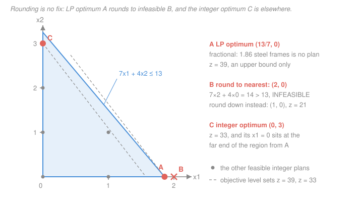

# Operations Research · Lesson 3.1: Modeling with integer variables

> ⏱ ~15 min · Module 3: Integer & Dynamic Programming · Builds on: [2.3 Network models & integrality](02-03-network-models-integrality.md), [1.1 Formulating linear programs](01-01-formulating-linear-programs.md) · Unlocks: [3.2 Branch-and-bound & cutting planes](03-02-branch-and-bound-cutting-planes.md)

## Why this matters

Everything Modules 1 and 2 built assumes your decisions are *divisible*. Solve an LP and it will cheerfully report: build 2.43 factories, run 0.7 of a night shift, open 1.3 warehouses, fly 4.8 crews. Half of real operational decisions aren't like that — they're **yes or no**, and they come tangled in logic: *this* plant only runs if *that* one opens, this machine works in mode A **or** mode B but not both, you pay 40,000 dollars the moment you produce a single unit here.

The fix is one small change with enormous consequences: let some variables take only the values 0 and 1. That single restriction buys a language for logic — and costs the polynomial-time solvability that made LP so comfortable. This lesson is the *translation* skill, story to model; [3.2](03-02-branch-and-bound-cutting-planes.md) is the solving.

## The idea

A linear program's variables are **quantities**. A binary variable is a **decision**. Write $\delta \in \{0,1\}$ and read it as a switch: $\delta = 1$ means "yes, do it," $\delta = 0$ means "no." The surprise is how much logic you can say with nothing but linear inequalities on switches. "At most one of these" is $\delta_1 + \delta_2 + \delta_3 \le 1$. "If we do A we must do B" is $\delta_A \le \delta_B$ — check the four cases and you'll see the only combination it forbids is $\delta_A = 1, \delta_B = 0$, which is exactly what "if A then B" forbids. Truth tables, written as arithmetic.

Before any of that, though, the objection everyone raises: *why not just solve the LP and round?* Here is a contractor with 13 tonnes of steel. A heavy frame consumes 7 tonnes and nets 21 thousand dollars; a light frame consumes 4 tonnes and nets 11. Frames are indivisible. The LP relaxation — pretend they're divisible — pours everything into heavy frames, because 21/7 = 3 per tonne beats 11/4 = 2.75, and reports $x^* = (13/7,\, 0) \approx (1.857,\, 0)$ with $z^* = 39$.

Now round. **Up** to 2 heavy frames: that needs 14 tonnes and you have 13 — *infeasible*. **Down** to 1 heavy frame: feasible, worth 21. The actual best integer plan is **three light frames** (12 tonnes, worth 33), which uses *zero* heavy frames. Rounding didn't land near the answer; it landed at the other end of the feasible region and gave up a third of the value. That is the argument for this whole module, and the Picture below draws it.

## The formal version

**Three species.** Take an LP in this course's standard form — maximize $c^Tx$ subject to $Ax \le b$, $x \ge 0$ — and restrict some variables to whole numbers.

- **Integer program (IP):** *all* variables must be integers.
- **Binary (0–1) program (BIP):** all variables restricted to $\{0,1\}$.
- **Mixed-integer program (MIP):** *some* variables integer or binary, the rest continuous.

*In words: keep the linear objective and linear constraints, and add "this variable must be a whole number."* Almost every real model is **mixed** — continuous flows, hours, and tonnages alongside binary open/close switches. The facility-location model below is the archetype.

Dropping the integrality requirement gives the **LP relaxation**. Its optimal value is always at least as good as the true integer optimum (a larger feasible set can only help), so it is a **lower bound** for a minimization and an **upper bound** for a maximization — 39 in the steel story. That bound is the entire engine of [3.2](03-02-branch-and-bound-cutting-planes.md), which is why relaxation quality matters so much.

### The binary vocabulary

Throughout, $\delta_j \in \{0,1\}$ is an indicator ("do activity $j$"), $x \ge 0$ is a continuous quantity, and $M$ is a constant discussed at length below.

| Logic in English | Linear constraint | Story |
|---|---|---|
| At most one of a set $S$ | $\sum_{j \in S} \delta_j \le 1$ | pick at most one supplier |
| Exactly one | $\sum_{j \in S} \delta_j = 1$ | every job goes to exactly one machine |
| At least $k$ | $\sum_{j \in S} \delta_j \ge k$ | staff at least 3 of the 7 shifts |
| Not both | $\delta_A + \delta_B \le 1$ | two incompatible chemicals |
| If A then B | $\delta_A \le \delta_B$ | no packing line without the plant |
| A if and only if B | $\delta_A = \delta_B$ | the boiler and its permit |
| Either/or on *constraints* | $g_1(x) \le b_1 + M\delta$ and $g_2(x) \le b_2 + M(1-\delta)$ | the machine runs in mode 1 or mode 2 |
| Fixed charge / setup | $x \le M\delta$, with $+f\delta$ in the objective | pay to start the line at all |
| Semi-continuous | $L\delta \le x \le U\delta$ | boiler is off, or running at 30 units or more |
| Set **covering** | $\sum_{j \in S_i} \delta_j \ge 1$ for each $i$ | every district within reach of a fire station |
| Set **packing** | $\sum_{j \in S_i} \delta_j \le 1$ for each $i$ | no crew assigned two overlapping trips |
| Set **partitioning** | $\sum_{j \in S_i} \delta_j = 1$ for each $i$ | every flight leg covered exactly once |

The last three deserve their names spelled out. Let $\delta_j$ mark whether you select *candidate set* $j$ (a fire-station site, a crew pairing), and let $S_i$ be the candidates that hit *element* $i$ (a district, a flight leg). Covering says every element is hit at least once, packing says at most once, partitioning says exactly once. Crew scheduling at an airline is a set-partitioning problem with millions of columns; it is the single largest commercial use of integer programming.

**Either/or, carefully.** You want "**at least one** of $g_1(x) \le b_1$ and $g_2(x) \le b_2$ holds." A constraint set is an *and*, so you cannot just write both. Instead introduce $\delta$ and write

$$g_1(x) \le b_1 + M\delta, \qquad g_2(x) \le b_2 + M(1-\delta), \qquad \delta \in \{0,1\}.$$

*In words: $M$ is a licence to violate, and $\delta$ decides which constraint gets it.* At $\delta = 0$ the first reads $g_1(x) \le b_1$ (enforced) and the second reads $g_2(x) \le b_2 + M$ (so slack it says nothing). At $\delta = 1$ the roles swap. The solver chooses $\delta$, so it may satisfy either — which is exactly the disjunction. Note the constraint you *don't* need isn't deleted; it's made vacuous.

**Fixed charge, carefully.** Suppose running an activity at level $x$ costs $c$ per unit *plus* a one-time $f$ if $x > 0$. That cost function has a jump at zero, so it is not linear — but this pair is:

$$\min\ f\delta + cx \quad \text{subject to} \quad 0 \le x \le M\delta, \quad \delta \in \{0,1\}.$$

At $\delta = 0$ the linking constraint collapses to $x \le 0$, so $x = 0$ and you pay nothing. At $\delta = 1$ you pay $f$ and $x$ is free up to $M$. Because $f > 0$ and we are minimizing, the model never sets $\delta = 1$ gratuitously, so it self-selects the correct branch.

### The big-M warning

This is the most common practical mistake in integer programming, and it cuts both ways.

**Too small and your model is wrong — silently.** $M$ must be large enough that the switched-off constraint is genuinely non-binding over everything else the model allows. Formally, $M \ge \max_{x \in X} g_1(x) - b_1$ where $X$ is the rest of the feasible set. Undershoot and you have quietly amputated legitimate solutions. There is no error message; you just get a worse "optimum," or a spurious "infeasible," and no hint why.

**Too large and your model is slow — spectacularly.** A loose $M$ lets the LP relaxation set $\delta$ to a tiny fraction and buy almost-full permission to violate. The relaxation value sags far below the true optimum, the bounds branch-and-bound prunes with become useless, and the search tree explodes. **The same model with a well-chosen $M$ can solve in seconds and with a lazy $M = 10^9$ can run for hours.** Never type $10^9$ because it's easy.

**Computing a tight $M$.** Read it off the data. For a fixed-charge link $\sum_j x_{ij} \le M_i \delta_i$ at facility $i$ with capacity $u_i$ and markets demanding $d_j$ in total, the most that facility could ever ship is capped twice over:

$$\boxed{\,M_i = \min\Big(u_i,\ \textstyle\sum_j d_j\Big)\,}$$

You can never exceed your own capacity, and you can never ship more than the whole world wants. In the example below the capacities are 150, 120, 100 against total demand 190, so $M_i = u_i$ for each. But if site 1 had capacity 400, the right $M_1$ would be **190**, not 400 — take the smaller cap every time.

## Picture

The six dots are the *entire* set of feasible integer plans: $(0,0), (1,0), (0,1), (1,1), (0,2), (0,3)$, with values $0, 21, 11, 32, 22, 33$. The LP sweeps its level set until it touches the blue triangle at a corner, stopping at **A** $= (13/7, 0)$, $z = 39$; rounding to nearest gives **B** $= (2,0)$, needing 14 tonnes of a 13-tonne supply; the integer optimum is **C** $= (0,3)$, $z = 33$. The $z = 39$ level set touches the polygon only at that fractional vertex, and the best integer plan sits 6 units below it. That distance, 39 − 33 = 6, is the **integrality gap** at the root — the quantity [3.2](03-02-branch-and-bound-cutting-planes.md) spends its whole life closing.

## Worked examples

**Example 1 (mechanical — a setup cost, with its $M$).** A workshop can run product P at $x$ units per week, netting 12 dollars each, but starting a run costs 500 dollars regardless of volume. Each unit takes 3 machine-hours and the shop has 240 hours. Maximizing weekly profit:

$$\max\ 12x - 500\delta \quad \text{s.t.} \quad 3x \le 240, \quad x \le M\delta, \quad x \ge 0,\ \delta \in \{0,1\}.$$

The tight $M$ is the largest $x$ can ever be given the *other* constraints: $3x \le 240$ forces $x \le 80$, so $M = 80$. Check the two branches: $\delta = 0 \Rightarrow x \le 0 \Rightarrow$ profit 0; $\delta = 1 \Rightarrow x \le 80$, best at $x = 80$ giving $12(80) - 500 = 460$. So run it: profit 460 dollars per week. Had you written $M = 10^6$, the model would still be *correct* — but its relaxation would let $\delta = 80/10^6 = 0.00008$, paying a setup cost of four cents instead of 500 dollars. Same optimum, uselessly weak bound.

**Example 2 (the centerpiece — capacitated facility location).** A distributor must serve three markets from up to three candidate warehouse sites. Monthly data:

| Site $i$ | Fixed cost $f_i$ (dollars/month) | Capacity $u_i$ (units/month) |
|---|---|---|
| 1 | 1000 | 150 |
| 2 | 1200 | 120 |
| 3 | 700 | 100 |

Shipping cost $c_{ij}$ in dollars per unit, and market demands $d_j$ in units per month:

| $c_{ij}$ | Market 1 | Market 2 | Market 3 |
|---|---|---|---|
| Site 1 | 4 | 6 | 9 |
| Site 2 | 5 | 3 | 7 |
| Site 3 | 8 | 7 | 4 |
| **Demand $d_j$** | **80** | **70** | **40** |

*Decision variables.* $x_{ij} \ge 0$ = units per month shipped from site $i$ to market $j$ (continuous); $\delta_i \in \{0,1\}$ = 1 if site $i$ is opened. Nine continuous, three binary — a genuine MIP.

*Objective* (dollars per month):

$$\min\ \sum_{i=1}^{3} f_i \delta_i \;+\; \sum_{i=1}^{3}\sum_{j=1}^{3} c_{ij} x_{ij}.$$

*Constraints.*

$$\sum_{i=1}^{3} x_{ij} = d_j, \quad j = 1,2,3 \qquad \text{(each market fully served)}$$

$$\sum_{j=1}^{3} x_{ij} \le u_i \delta_i, \quad i = 1,2,3 \qquad \text{(capacity, and the binary link)}$$

$$x_{ij} \ge 0, \qquad \delta_i \in \{0,1\}.$$

The capacity constraint does two jobs at once, and that is the trick worth stealing. At $\delta_i = 1$ it reads $\sum_j x_{ij} \le u_i$, an ordinary capacity limit; at $\delta_i = 0$ it reads $\sum_j x_{ij} \le 0$, forcing every shipment out of that site to zero. It *is* a big-M constraint with $M_i = u_i$ — already the tightest legal value, per the box above.

*Verification — exhibit a feasible point and price it.* Take $\delta = (1, 0, 1)$ with $x_{11} = 80$, $x_{12} = 70$, $x_{33} = 40$, everything else zero. Check every constraint:

- Market 1: $80 + 0 + 0 = 80 = d_1$ ✓. Market 2: $70 + 0 + 0 = 70 = d_2$ ✓. Market 3: $0 + 0 + 40 = 40 = d_3$ ✓.
- Site 1: $80 + 70 = 150 \le 150 \cdot 1$ ✓ (binding, exactly at capacity). Site 2: $0 \le 120 \cdot 0 = 0$ ✓. Site 3: $40 \le 100 \cdot 1$ ✓.

Cost: fixed $1000 + 700 = 1700$; shipping $4(80) + 6(70) + 4(40) = 320 + 420 + 160 = 900$; **total 2600 dollars per month.** Enumerating all eight open/closed patterns and solving the transportation problem inside each confirms this is optimal — the rivals are sites 2 and 3 at 2760, sites 1 and 2 at 3010, and all three open at 3590. Look hard at that last number: opening everything gives the *cheapest possible shipping bill* (690 dollars) and the *worst total*. The fixed charges are precisely what a pure LP cannot see.

*What the relaxation does.* Drop $\delta_i \in \{0,1\}$ to $0 \le \delta_i \le 1$. Since $f_i > 0$ the solver pushes each $\delta_i$ down to its floor $\big(\sum_j x_{ij}\big)/u_i$; keeping the same shipments it sets $\delta_3 = 40/100 = 0.4$ and pays $0.4 \times 700 = 280$ instead of 700, for a relaxed total of $1000 + 280 + 900 = 2180$ dollars. **It opened 40 percent of a warehouse.** The integrality gap is $2600 - 2180 = 420$ dollars, about 16 percent — quite loose.

*Tightening it without changing the answer.* Replace the one aggregate link per site with a **disaggregated** link per site–market pair, $x_{ij} \le \min(u_i, d_j)\,\delta_i$ for every $i,j$. Every integer point satisfying the old constraints satisfies these and vice versa, so the two models have **identical** integer feasible sets — but their relaxations differ. Here every capacity exceeds every single demand, so $\min(u_i, d_j) = d_j$, and at the plan above the pair $(3,3)$ forces $\delta_3 \ge x_{33}/d_3 = 40/40 = 1$. The fractional dodge is gone.

**What this costs, and why 3.2 exists.** Integer programming is NP-hard in general — 0–1 integer programming is one of the original problems shown NP-complete, and no algorithm is known that scales polynomially in the worst case (see [computational-complexity](../../computational-complexity/syllabus.md) for what that claim means and [algorithms](../../algorithms/syllabus.md) for the reductions; we don't develop it here). The practical consequence is this module's theme: **since you cannot count on the algorithm, formulation quality carries the day.** Two models with identical integer feasible sets can differ by orders of magnitude in solve time, and what separates them is how tight the LP relaxation is — the aggregate-versus-disaggregated link above in miniature. [3.2](03-02-branch-and-bound-cutting-planes.md) shows the machine, tree search bounded by relaxations, that makes tightness pay.

## Watch out

- **You might think rounding is a reasonable heuristic.** It can be infeasible in every direction at once, and even when feasible it can be far from optimal — the steel example rounds to a plan worth 21 when 33 was available, and the true optimum uses *none* of the variable the LP loaded up on. With equality constraints it is worse still: round any one variable and the equality simply breaks.
- **You might think a bigger $M$ is the safe choice.** Too small silently deletes valid solutions with no warning; too large wrecks the relaxation and can turn a two-second solve into an overnight one. Neither error announces itself. Compute $M$ from the data, don't pick it.
- **You might think $x \le M\delta$ forces $\delta$ to follow $x$ in both directions.** It doesn't. It forces $x = 0$ when $\delta = 0$, but nothing stops $\delta = 1$ with $x = 0$. That's harmless when $\delta$ carries a positive cost in a minimization — the model won't pay for nothing — but if $\delta$ carries a *reward*, or appears in a counting constraint like "open at most two sites," you need the reverse link too (for integer $x$, add $\delta \le x$).

## One-liner

> A binary variable turns a yes-or-no decision into algebra, and big-M turns "either/or" into a pair of inequalities — but $M$ must be the smallest value that is still large enough, because the tightness of the relaxation, not the cleverness of the model, is what decides whether it solves.

## Problems

**P1 (🟢)** Five capital projects, $\delta_j \in \{0,1\}$ for $j = 1,\dots,5$, meaning "project $j$ is funded." Translate each condition into a linear constraint.

(a) At most two of the five may be funded.
(b) Project 2 can be funded only if project 1 is.
(c) Projects 3 and 4 are mutually exclusive.
(d) If project 5 is funded, then at least one of projects 1 and 2 must be funded.
(e) Project 4 receives a budget $x_4 \ge 0$ (thousands of dollars) that must be 0 if project 4 is unfunded, and otherwise between 50 and 200.

**P2 (🟡)** A workshop makes products A and B. A nets 8 dollars per unit and uses 2 machine-hours; B nets 5 dollars per unit and uses 1 machine-hour. There are 100 machine-hours per week. Producing *any* A costs a one-time setup of 60 dollars, and any B a setup of 20 dollars. The market absorbs at most 60 units of B per week (A is unlimited). (i) Write the full MIP, using the tightest valid $M$ for each linking constraint. (ii) Evaluate the plan "make 50 A, no B" — is it feasible, and what does it earn? (iii) Find the optimal plan and its profit.

**P3 (🔴)** A process has levels $x_1, x_2$ satisfying $0 \le x_1 \le 8$, $0 \le x_2 \le 6$, and $x_1 + x_2 \le 10$. A safety rule requires that **at least one** of $3x_1 + 2x_2 \le 12$ and $x_1 + 4x_2 \le 10$ holds. (a) Write the either/or pair using a binary $\delta$, and compute the *smallest valid* $M$ for each of the two constraints. (b) Show that using $M = 10$ for the first constraint is a bug, by exhibiting a point that the safety rule permits but the model would reject.

Solutions

**P1**

(a) $\delta_1 + \delta_2 + \delta_3 + \delta_4 + \delta_5 \le 2$.

(b) "2 only if 1" means $\delta_2 = 1 \Rightarrow \delta_1 = 1$, i.e. $\delta_2 \le \delta_1$. Check all four cases: $(0,0)$ ✓, $(\delta_1{=}1,\delta_2{=}0)$ ✓ (funding 1 alone is allowed), $(1,1)$ ✓, and $(\delta_1{=}0,\delta_2{=}1)$ gives $1 \le 0$, correctly forbidden.

(c) $\delta_3 + \delta_4 \le 1$. (Not $\delta_3 + \delta_4 = 1$ — that would force one of them.)

(d) $\delta_5 \le \delta_1 + \delta_2$. At $\delta_5 = 1$ this requires $\delta_1 + \delta_2 \ge 1$, i.e. at least one of them. At $\delta_5 = 0$ it says $0 \le \delta_1 + \delta_2$, which is vacuous — correct, since the condition only fires when 5 is funded.

(e) Semi-continuous: $50\delta_4 \le x_4 \le 200\delta_4$. At $\delta_4 = 0$ both ends pinch $x_4$ to 0; at $\delta_4 = 1$ it reads $50 \le x_4 \le 200$. Note a single constraint cannot do this — you need both sides.

**P2**

(i) Let $a, b \ge 0$ be units of A and B per week, $\delta_A, \delta_B \in \{0,1\}$ the setup indicators.

$$\max\ 8a + 5b - 60\delta_A - 20\delta_B$$

$$\text{s.t.}\quad 2a + b \le 100, \quad b \le 60, \quad a \le 50\,\delta_A, \quad b \le 60\,\delta_B, \quad a,b \ge 0,\ \delta_A,\delta_B \in \{0,1\}.$$

Tight $M$ values: $a$ can never exceed $100/2 = 50$ (machine hours alone cap it), so $M_A = 50$. For $b$, the machine allows 100 but the market allows 60, so $M_B = \min(100, 60) = 60$.

(ii) $a = 50$, $b = 0$, $\delta_A = 1$, $\delta_B = 0$. Check: $2(50) + 0 = 100 \le 100$ ✓; $0 \le 60$ ✓; $50 \le 50(1)$ ✓; $0 \le 60(0) = 0$ ✓. Profit $= 8(50) - 60 = 340$ dollars per week. Feasible, but not optimal.

(iii) B is the better use of a machine-hour (5 dollars per hour versus 8/2 = 4), so fill B first: $b = 60$ (its market cap), consuming 60 hours. The remaining 40 hours give $a = 20$. Profit $= 8(20) + 5(60) - 60 - 20 = 160 + 300 - 80 = 380$ dollars per week. Feasibility: $2(20) + 60 = 100 \le 100$ ✓, $60 \le 60$ ✓, $20 \le 50$ ✓, $60 \le 60$ ✓.

*Check by enumerating the four setup patterns.* Neither product: 0. A only: best is $a = 50$, giving $400 - 60 = 340$. B only: best is $b = 60$, giving $300 - 20 = 280$. Both: the LP inside gives $(a,b) = (20,60)$ worth $460$ gross, minus 80 in setups $= 380$. Maximum is **380**. Note the trap: the highest-margin *product* (A, at 8 dollars) is not the best use of the *scarce resource*.

**P3**

(a) $$3x_1 + 2x_2 \le 12 + M_1\delta, \qquad x_1 + 4x_2 \le 10 + M_2(1 - \delta), \qquad \delta \in \{0,1\}.$$

$M_1$ must be at least the largest amount by which the first constraint could ever be violated inside the rest of the region, i.e. $M_1 = \max(3x_1 + 2x_2) - 12$ over $\{0 \le x_1 \le 8,\, 0 \le x_2 \le 6,\, x_1 + x_2 \le 10\}$. That region's vertices are $(0,0), (8,0), (8,2), (4,6), (0,6)$, giving $3x_1 + 2x_2$ values $0, 24, 28, 24, 12$. The maximum is 28 at $(8,2)$, so $M_1 = 28 - 12 = 16$.

Same for the second: $x_1 + 4x_2$ at those vertices is $0, 8, 16, 28, 24$, maximum 28 at $(4,6)$, so $M_2 = 28 - 10 = 18$. The pair is

$$3x_1 + 2x_2 \le 12 + 16\delta, \qquad x_1 + 4x_2 \le 10 + 18(1-\delta).$$

Sanity check at $\delta = 1$: the first becomes $\le 28$, which no point in the region can violate — correctly switched off — and the second becomes $\le 10$, enforced.

(b) Take $(x_1, x_2) = (8, 0)$. It is in the region ($8 \le 8$, $0 \le 6$, $8 \le 10$) and it satisfies the *second* safety constraint, $8 + 0 = 8 \le 10$, so the disjunction holds and the safety rule permits it. But with $M_1 = 10$: at $\delta = 1$ the model demands $3(8) + 2(0) = 24 \le 12 + 10 = 22$, false; at $\delta = 0$ it demands $24 \le 12$, false. Both branches reject a legitimate point. The model is now wrong, and nothing in the output says so — it just quietly reports a worse optimum.

## Flashback

**From Lesson 2.3 (Network models & integrality):** Two plants ship a single product to three depots. Plant 1 has 30 units available, plant 2 has 20; depots need 15, 25, and 10. Unit shipping costs are

| | Depot 1 | Depot 2 | Depot 3 |
|---|---|---|---|
| Plant 1 | 2 | 4 | 5 |
| Plant 2 | 3 | 1 | 7 |

(a) Explain in one or two sentences why solving this as an ordinary LP, with no integer restrictions at all, is guaranteed to return whole units. (b) Find the minimum-cost shipping plan and its cost.

Solution

(a) The constraint matrix of a transportation problem is the node–arc incidence matrix of a bipartite network, which is **totally unimodular**: every square submatrix has determinant $0$, $+1$, or $-1$. By the integrality theorem, when a TU constraint matrix is paired with an integer right-hand side — here supplies $(30, 20)$ and demands $(15, 25, 10)$, all whole — every basic feasible solution is integral, so simplex terminates at an integer vertex automatically. Integrality is free; you never write $x_{ij} \in \mathbb{Z}$.

(b) Total supply $30 + 20 = 50$ equals total demand $15 + 25 + 10 = 50$, so the problem is balanced and every unit ships. Compare the two rows depot by depot — plant 2 minus plant 1 costs $+1, -3, +2$. Plant 2 is cheaper *only* at depot 2, and by the largest available margin, so send all 20 of plant 2's units there ($20 \le 25$, so depot 2 can absorb them). Plant 1 then covers the rest: 15 to depot 1, the remaining 5 to depot 2, and 10 to depot 3, totalling $15 + 5 + 10 = 30$ ✓.

$$\text{cost} = 2(15) + 4(5) + 5(10) + 1(20) = 30 + 20 + 50 + 20 = 120.$$

*Check.* Every alternative shifts plant-2 units off depot 2, and each such unit swaps a cost-1 arc for a cost-3 or cost-7 arc while pushing plant 1 onto a dearer depot — strictly worse. Exhaustive enumeration of all 50-unit splits confirms 120 is the minimum. Compare the northwest-corner starting plan (15, 15, 0 / 0, 10, 10), which costs 170 — feasible, integral, and 42 percent too expensive. All values are whole numbers, as part (a) promised.

## Connections

- **Backward:** [2.3](02-03-network-models-integrality.md) showed a whole family — transportation, assignment, min-cost flow — where integrality comes *free*, because total unimodularity plus an integer right-hand side makes every LP vertex integral. Note what happened here: the facility-location model's shipping block is exactly a transportation problem, and on its own it would be TU. Bolting on one side constraint linking flow to the binaries, $\sum_j x_{ij} \le u_i\delta_i$, destroys the structure. That is the usual story — you land in integer programming not because your problem was exotic, but because you added one realistic wrinkle to a network model that used to be easy.
- **Forward:** [3.2](03-02-branch-and-bound-cutting-planes.md) takes these formulations and solves them, using the LP relaxation as the bound at every node — which is why the tightening tricks here (smallest legal $M$, disaggregated links) pay off there in search-tree size. [3.3](03-03-deterministic-dynamic-programming.md) then attacks the knapsack, a pure binary program, from a completely different angle: recursion over stages rather than search over a tree.
- **Sideways:** the covering/packing/partitioning trio is the set-system language of `discrete-mathematics` wearing an optimization uniform, and the hardness that motivates all of Module 3 is developed in [computational-complexity](../../computational-complexity/syllabus.md). The fixed-charge pattern shows up wherever a cost has a jump at zero — transaction costs in portfolio construction, unit commitment for power plants, minimum order quantities in procurement.
