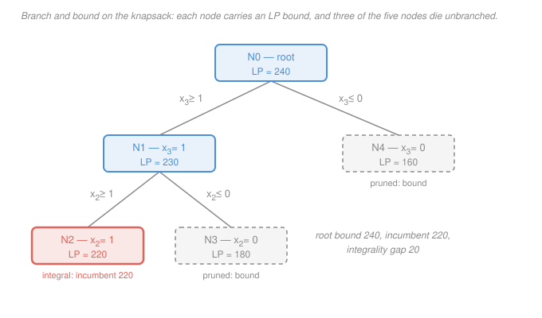

# Operations Research · Lesson 3.2: Branch-and-bound & cutting planes

> ⏱ ~15 min · Module 3: Integer & Dynamic Programming · Builds on: [3.1 Modeling with integer variables](03-01-modeling-with-integer-variables.md), [1.3 The simplex method](01-03-the-simplex-method.md) · Unlocks: 3.3 (deterministic dynamic programming)

## Why this matters

[3.1](03-01-modeling-with-integer-variables.md) gave you the modeling power to say "build the plant or don't" — and took away your solver. Simplex walks the corners of a *polytope*; integer points aren't corners of anything. And you can't enumerate: 50 binary variables is $2^{50} \approx 10^{15}$ subsets, which is a decade of computing for one small scheduling model.

Yet commercial solvers routinely crack integer programs with hundreds of thousands of binaries. They do it with one idea, invented in 1960 and never improved upon in spirit: **use the LP relaxation as a bound, and prove whole regions of the search space away without ever looking inside them.** This lesson is that idea, plus the trick that makes the bound tighter.

## The idea

You're searching a huge space, but you have a cheap oracle that answers a weaker question. Drop the integrality requirement and you get an LP — solvable in milliseconds by [simplex](01-03-the-simplex-method.md). Its optimal value is an **upper bound** (for a maximization) on every integer solution in that region, because the LP is optimizing over a *superset* of the integer points.

That bound is a proof device. Suppose you've already found some integer solution worth 220, and you're about to explore a region whose LP relaxation is only worth 180. You do not need to look. Nothing in that region can beat 180, so nothing in it can beat 220. The whole region dies on one LP solve.

So the algorithm is **search with proof-backed pruning**: split the space into pieces, solve one LP per piece, and use the answer either to (a) discard the piece forever, or (b) split it further. Most pieces die. The ones that survive get split again. The recursion terminates with an integer solution *and a certificate that nothing better exists* — which is more than a heuristic could ever hand you.

## The formal version

Take a maximization integer program with optimal value $z^*$, and let $z_{LP}(P)$ denote the optimal LP-relaxation value of a subproblem $P$ (the same problem with "integer" deleted).

**The bounding fact.** For any subproblem $P$, every integer-feasible point of $P$ is LP-feasible for $P$, so

$$\boxed{\,z_{IP}(P) \le z_{LP}(P)\,}$$

*In words: relaxing constraints can only help, so the LP value is an optimistic estimate — an upper bound — on the best integer answer in that region.*

### The procedure

1. **Root.** Solve the LP relaxation of the whole problem. If its solution $x$ is integral, you're done: it's LP-optimal *and* integer-feasible, so it's IP-optimal.
2. **Branch.** Otherwise pick a variable with fractional value $x_j = f$ and create two subproblems by appending
   $$x_j \le \lfloor f \rfloor \qquad\text{and}\qquad x_j \ge \lceil f \rceil .$$
   *In words: force $x_j$ below the fraction or above it.* This is the pivotal step, and it is safe for one reason: **no integer satisfies $\lfloor f\rfloor < x_j < \lceil f\rceil$**, so the two children together still contain every integer-feasible point of the parent — nothing is lost — while the current fractional point $x$ satisfies neither, so it is gone. Branching strictly shrinks the relaxation without touching the integer problem.
3. **Track the incumbent.** Keep $\underline{z}$, the value of the best integer solution found so far (the **incumbent**), starting at $-\infty$. It is a *lower* bound on $z^*$. Each open node's LP value is an *upper* bound on anything in its subtree.
4. **Prune.** A node is dead — never branched — for exactly one of three reasons:
   - **by bound:** $z_{LP} \le \underline{z}$. The region cannot contain anything strictly better than what you already hold.
   - **by infeasibility:** the node's LP has no feasible point. Then it certainly has no integer point. (In the knapsack below this never fires, but it fires the moment branching forces a contradiction — pin $x_1 = x_2 = x_3 = 1$ and the capacity row reads $10+20+30 = 60 \le 50$, an empty LP.)
   - **by integrality:** $z_{LP}$ is attained at an integral $x$. That $x$ is the best integer point in the region, so record it (update $\underline{z}$ if it improves) and stop — there is nothing left to find here.
5. **Stop** when no open nodes remain. The incumbent is optimal, **and the tree is the proof**: every region was either explored or bounded away.

### The optimality gap

At any moment let $\bar{z}$ be the largest LP bound among **open** nodes (a node inherits its parent's bound until its own LP is solved). Then

$$\underline{z} \;\le\; z^* \;\le\; \bar{z}, \qquad \text{gap} = \bar{z} - \underline{z}, \qquad \text{relative gap} = \frac{\bar{z} - \underline{z}}{|\underline{z}|}.$$

*In words: you always know the answer to within a computed interval, even before you finish.* This is why a solver can print "20 000 nodes, best 4 182 001, gap 0.08 percent" and you can hit stop with a clear conscience — you have a solution *and* a guarantee it is within 0.08 percent of the unreachable true optimum. Practically, MIP is usable at scale because the last fraction of a percent of the gap usually costs more nodes than the first 99, and you are allowed to not pay for it.

### Which variable, which node

Two choices that don't affect correctness and dominate speed:

**Branching variable.** *Most-fractional* (pick $x_j$ with $f$ closest to $0.5$) is the obvious rule and is barely better than random. Real solvers use **pseudocost branching** — bookkeeping how much each variable historically raised the bound when branched on, and preferring the variable that hurts the relaxation most. **Node selection.** *Depth-first* dives to a leaf: it finds integer solutions early (so the incumbent gets good fast, which powers bound-pruning), needs almost no memory, and re-solves each LP with one added row so warm-started simplex is nearly free. *Best-first* always expands the open node with the largest bound: it drives $\bar z$ down fastest, so it proves optimality in the fewest nodes — but it stores the whole frontier and may run a long time before finding *any* feasible solution. The trade: depth-first gets you a good answer sooner, best-first gets you the proof sooner. Solvers dive depth-first until they have an incumbent, then switch.

### Cutting planes

Branching shrinks the relaxation by splitting. **Cuts** shrink it in place.

**Definition.** An inequality $a^Tx \le \beta$ is a **valid inequality** for the integer program if every integer-feasible point satisfies it. It is a **cut** for the current LP solution $\hat{x}$ if in addition $a^T\hat{x} > \beta$.

*In words: a constraint that is true of every answer you'd accept, but false of the fractional answer the LP just handed you.* Adding it is free — no integer solution is lost — and strictly beneficial: $\hat x$ is no longer feasible, so the re-solved LP must return a smaller value. **The bound goes up in quality (down in value), and the integrality gap shrinks.**

Where do cuts come from? The workhorse is the **rounding argument**: take a nonnegative combination of existing constraints, and if the left side is guaranteed integer, floor the right side. Formally, from $u \ge 0$ and $Ax \le b$ you get $u^TAx \le u^Tb$; if every coefficient $(u^TA)_j$ is an integer then $u^TAx$ is an integer for integer $x$, so $u^TAx \le \lfloor u^Tb \rfloor$. That last floor is the entire content of the method — it is where integrality enters.

**Gomory cuts** are this idea automated: read a row of the optimal simplex tableau in which the basic variable is fractional, apply exactly that rounding to it, and you get a valid inequality violated by the current vertex — for *any* integer program, with no problem-specific cleverness. **Branch-and-cut** is what every modern solver actually runs: generate cuts at nodes of the branch-and-bound tree, so each node's bound is tighter, so more siblings prune by bound, so the tree is smaller. Cuts and branching are not rivals; cuts are what makes branching affordable.

## Picture

## Worked examples

**Example 1 (branch-and-bound: the knapsack of boss problem 3).** Capacity 50, three items with values $(60, 100, 120)$ and weights $(10, 20, 30)$, each taken at most once:

$$\max\; 60x_1 + 100x_2 + 120x_3 \quad\text{s.t.}\quad 10x_1 + 20x_2 + 30x_3 \le 50, \quad x_j \in \{0,1\}.$$

*Root LP.* The relaxation replaces $x_j \in \{0,1\}$ with $0 \le x_j \le 1$ — the **fractional knapsack**, solved by greedy value density. Densities are $60/10 = 6$, $100/20 = 5$, $120/30 = 4$, so the priority order is item 1, then 2, then 3. Take item 1 whole (weight 10), item 2 whole (weight 30 used), and with 20 of capacity left take $20/30 = \tfrac23$ of item 3:

$$x = \left(1,\,1,\,\tfrac23\right), \qquad z_{LP} = 60 + 100 + \tfrac23(120) = 60 + 100 + 80 = 240.$$

Fractional in $x_3$, so branch on $x_3$. We dive depth-first, up-branch first.

| Node | Added constraints | LP solution $(x_1,x_2,x_3)$ | LP value | Status |
|---|---|---|---|---|
| N0 | — (root) | $(1,\ 1,\ \tfrac23)$ | 240 | fractional in $x_3$ — branch |
| N1 | $x_3 \ge 1$ | $(1,\ \tfrac12,\ 1)$ | 230 | fractional in $x_2$ — branch |
| N2 | $x_3 \ge 1,\ x_2 \ge 1$ | $(0,\ 1,\ 1)$ | 220 | **integral** — incumbent $\underline z = 220$, prune |
| N3 | $x_3 \ge 1,\ x_2 \le 0$ | $(1,\ 0,\ 1)$ | 180 | $180 \le 220$ — prune **by bound** |
| N4 | $x_3 \le 0$ | $(1,\ 1,\ 0)$ | 160 | $160 \le 220$ — prune **by bound** |

Node by node. **N1** fixes $x_3 = 1$, spending 30 of capacity; the remaining budget is 20, filled greedily as $x_1 = 1$ (weight 10, value 60) then $x_2 = 10/20 = \tfrac12$ (value 50), giving $120 + 60 + 50 = 230$. **N2** adds $x_2 = 1$: weight $20 + 30 = 50$ exhausts the knapsack, forcing $x_1 = 0$, so the LP returns the integral point $(0,1,1)$ worth 220 — the incumbent. **N3** takes $x_2 = 0$ instead: budget $50 - 30 = 20$ leaves room for all of item 1, value $120 + 60 = 180$, which cannot beat 220. **N4** drops item 3 entirely: items 1 and 2 both fit (weight 30), value 160, also beaten.

No open nodes remain, so $z^* = 220$ at $x^* = (0,1,1)$ — items 2 and 3, weight exactly 50. **Root integrality gap:** $240 - 220 = 20$. Note also the mid-run gap: right after N2 set the incumbent to 220, the open nodes N3 and N4 carried inherited bounds 230 and 240, so $\bar z = 240$ and the relative gap was $20/220 \approx 9.1$ percent — the two LPs that followed were spent entirely on closing it.

*Check (independent enumeration).* All $2^3 = 8$ subsets, weight then value: $\varnothing$ (0, 0); $\{1\}$ (10, 60); $\{2\}$ (20, 100); $\{3\}$ (30, 120); $\{1,2\}$ (30, 160); $\{1,3\}$ (40, 180); $\{2,3\}$ (50, **220**); $\{1,2,3\}$ (60 — over capacity). Best feasible is 220, matching. Notice the LP's greedy answer took item 1 and the integer optimum *doesn't* — rounding the relaxation down to $(1,1,0)$ gives 160, off by 60. That is [3.1](03-01-modeling-with-integer-variables.md)'s warning made numerical.

**Example 2 (a cutting plane that closes the gap).** A two-variable integer program:

$$\max\; x_1 + x_2 \quad\text{s.t.}\quad \underbrace{2x_1 + 3x_2 \le 7}_{(A)}, \quad \underbrace{3x_1 + 2x_2 \le 7}_{(B)}, \quad x_1, x_2 \ge 0 \ \text{integer}.$$

*Solve the relaxation.* The two constraints are symmetric, so the optimal vertex sits where they cross: subtracting (B) from (A) gives $-x_1 + x_2 = 0$, so $x_1 = x_2$, and then $5x_1 = 7$:

$$\hat{x} = \left(\tfrac75, \tfrac75\right) = (1.4,\, 1.4), \qquad z_{LP} = 2.8 .$$

(The other vertices are $(0,0)$, $(\tfrac73, 0)$ and $(0, \tfrac73)$, worth $0$, $2.33$, $2.33$ — so $2.8$ is the LP optimum.)

*Derive the cut.* Add (A) and (B) with multipliers $u = (1,1)$, then divide by 5:

$$5x_1 + 5x_2 \le 14 \qquad\Longrightarrow\qquad x_1 + x_2 \le \tfrac{14}{5} = 2.8 .$$

Now the integrality step. For integer $x$, the quantity $x_1 + x_2$ is an **integer**, and an integer that is at most 2.8 is at most 2:

$$\boxed{\,x_1 + x_2 \le 2\,}$$

*Is it valid?* Every integer-feasible point satisfies both (A) and (B), hence the chain above, hence the cut — the derivation *is* the proof. Confirming by enumeration, the integer-feasible set is exactly $(0,0), (1,0), (0,1), (1,1), (2,0), (0,2)$, with $x_1+x_2$ equal to $0,1,1,2,2,2$: all at most 2, none removed. *Is it a cut?* At $\hat x$ the left side is $1.4 + 1.4 = 2.8 > 2$ — violated, so $\hat x$ is chopped off.

*Re-solve.* With the cut appended, the objective $x_1+x_2$ can no longer exceed 2, and $2$ is attained at $(2,0)$ (check: $4 \le 7$, $6 \le 7$) — an integral vertex. The bound fell from $2.8$ to $2$, the gap $2.8 - 2 = 0.8$ closed completely, and **the integer program was solved without branching at all.**

## Watch out

- **You might think a node's LP bound is a lower bound because it's "the answer so far."** It's the opposite. For a maximization, the LP value is an *upper* bound (optimistic — you relaxed constraints), and the *incumbent* is the lower bound. Pruning compares the optimistic estimate of the unexplored region against the guaranteed value you already own. Flip every inequality in this lesson for a minimization, where LP bounds are lower bounds and the incumbent is the upper one.
- **You might think branching on $x_j \le \lfloor f\rfloor$ / $x_j \ge \lceil f\rceil$ can lose the optimum.** It can't — the excluded strip $\lfloor f\rfloor < x_j < \lceil f\rceil$ contains no integers. What you must *not* do is branch on the disjunction $x_j \le f$ / $x_j \ge f$: that keeps the fractional point, so the child's LP returns the same vertex and the algorithm loops forever.
- **You might think a cut is just another constraint you could have written down.** A valid inequality is deliberately *redundant for the integer program* and *non-redundant for its relaxation* — it says nothing new about the answers, only about the fictitious fractional points. If a proposed cut removes even one integer-feasible point, it isn't a cut; it's a bug, and you will silently return a suboptimal answer with a confident-looking proof attached.
- **You might read "pruned by bound" as "we found nothing there."** We found nothing *better* there. N3 in Example 1 holds a perfectly good integer solution worth 180 — we skipped it because 180 cannot beat 220, not because the region is empty.

## One-liner

> Solve the relaxation for an optimistic bound, split on a fractional variable so the fraction can't survive, and kill every region whose optimism can't beat the best answer you already hold — then cut the fractions away so there is less to split.

## Problems

**P1 (🟢)** A knapsack of capacity 9 holds two items: item 1 with value 10 and weight 4, item 2 with value 12 and weight 6, each at most once. Run branch-and-bound: give the root LP bound, branch on the fractional variable (dive on the $\ge$ branch first), report every node's LP value, and **name the pruning reason for each dead node**. Then verify the optimum by enumerating all four subsets.

**P2 (🟡)** Same instance as P1. Its only structural constraint is $4x_1 + 6x_2 \le 9$. Derive a valid inequality by multiplying it by $u = \tfrac12$ and applying the rounding argument. Show that (i) it is violated by the root LP solution, (ii) it removes no integer-feasible point, and (iii) it improves the root bound — give the new bound.

**P3 (🔴, optional)** In Example 2 the cut $x_1 + x_2 \le 2$ came from combining *both* constraints. Show it genuinely needs both: exhibit an integer point satisfying $2x_1 + 3x_2 \le 7$, $x \ge 0$ that violates the cut, and state the strongest inequality of the form $x_1 + x_2 \le k$ that is valid using constraint (A) alone. Does that one cut off $(1.4, 1.4)$?

Solutions

**P1** Densities: $10/4 = 2.5$ for item 1, $12/6 = 2$ for item 2 — item 1 first.

*Root (N0).* Take $x_1 = 1$ (weight 4), leaving capacity 5, so $x_2 = 5/6$: value $10 + \tfrac56(12) = 10 + 10 = 20$. Bound $z_{LP} = 20$, fractional in $x_2$. Branch on $x_2$.

*N1: $x_2 \ge 1$.* Item 2 uses weight 6, leaving 3, so $x_1 = 3/4$: value $12 + \tfrac34(10) = 12 + 7.5 = 19.5$. Fractional in $x_1$ — branch on $x_1$.

*N2: $x_2 \ge 1,\ x_1 \ge 1$.* Weight $4 + 6 = 10 > 9$. **The LP is infeasible — prune by infeasibility.**

*N3: $x_2 \ge 1,\ x_1 \le 0$.* Only item 2: $x = (0,1)$, value 12, weight 6. **Integral — prune by integrality**, incumbent $\underline z = 12$.

*N4: $x_2 \le 0$.* Only item 1: $x = (1,0)$, value 10, weight 4. $10 \le 12$, so **prune by bound.**

No open nodes: $z^* = 12$ at $x^* = (0,1)$. (This tiny tree fires all three pruning rules.)

*Check (enumeration).* $\varnothing$ (weight 0, value 0); $\{1\}$ (4, 10); $\{2\}$ (6, **12**); $\{1,2\}$ (10 — over capacity 9). Best feasible is 12. ✓ Root integrality gap $20 - 12 = 8$.

**P2** Multiply $4x_1 + 6x_2 \le 9$ by $u = \tfrac12$:

$$2x_1 + 3x_2 \le 4.5 .$$

The coefficients 2 and 3 are integers, so for integer $x$ the left side is an integer, hence

$$2x_1 + 3x_2 \le \lfloor 4.5 \rfloor = 4 .$$

(i) *Violated?* At the root LP point $\hat x = (1, \tfrac56)$: $2(1) + 3(\tfrac56) = 2 + 2.5 = 4.5 > 4$. Yes — it cuts $\hat x$ off.

(ii) *Removes no integer point?* The binary points and their cut values: $(0,0) \to 0$, $(1,0) \to 2$, $(0,1) \to 3$ — all $\le 4$. The only point that violates it is $(1,1) \to 5$, which was already infeasible (weight 10 > 9). Nothing feasible is lost. ✓

(iii) *New bound.* With the cut, $2x_1 + 3x_2 \le 4$ implies $4x_1 + 6x_2 \le 8 \le 9$, so the original capacity row is now redundant and the cut *is* the knapsack. Densities against the new row: $10/2 = 5$ and $12/3 = 4$, so take $x_1 = 1$ (using 2 of the budget 4), leaving 2, hence $x_2 = 2/3$:

$$z_{LP} = 10 + \tfrac23(12) = 10 + 8 = 18 .$$

The root bound drops from **20 to 18**, shrinking the gap from 8 to 6. The relaxation is still fractional — one cut rarely finishes the job, which is exactly why branch-*and*-cut interleaves the two.

**P3** The point $(3, 0)$ is integer and satisfies (A): $2(3) + 3(0) = 6 \le 7$, and $x \ge 0$. But $x_1 + x_2 = 3 > 2$, so the cut is **not** valid for the relaxation that uses (A) alone — it needs (B), which $(3,0)$ violates ($3(3) + 2(0) = 9 > 7$).

The strongest valid version using (A) alone is $x_1 + x_2 \le 3$: the integer points of $\{2x_1 + 3x_2 \le 7,\ x \ge 0\}$ with the largest coordinate sum are $(3,0)$ and $(2,1)$ (check: $4 + 3 = 7 \le 7$), both giving 3, and none gives more (any point with $x_1 + x_2 \ge 4$ needs $2x_1 + 3x_2 \ge 8$).

Does it cut? At $\hat x = (1.4, 1.4)$ the sum is $2.8 \le 3$ — **satisfied**, so it removes nothing and the bound is unchanged. The strength came from *combining* rows, which is the whole reason Gomory's tableau-based procedure works: a simplex tableau row already *is* a combination of the original constraints, chosen by the algorithm to be the one that's fractional.

## Flashback

**From Lesson 3.1 (Modeling with integer variables) — fixed charge and the price of a loose big-M.** A machine can produce up to 200 units of a product. Each unit earns 12 dollars of contribution margin, but running the machine at all incurs a one-time setup cost of 500 dollars. (a) Write the profit-maximizing model with a continuous production level $x$ and a binary setup indicator $y$, linked by a big-M constraint. (b) Give the tightest valid $M$, and compute the LP relaxation's optimal value. (c) Recompute the relaxation with $M = 10^6$ and compare. *(Fresh variant: a single-product setup, not the multi-plant version from 3.1.)*

Solution

**(a)** With $x \ge 0$ the units produced and $y \in \{0,1\}$ equal to 1 if the machine runs:

$$\max\; 12x - 500y \quad\text{s.t.}\quad x \le My, \quad 0 \le x \le 200, \quad y \in \{0,1\}.$$

The linking row $x \le My$ is the fixed-charge idiom: $y = 0$ forces $x = 0$, and $y = 1$ leaves $x$ free up to $M$. Without it, the LP would happily set $y = 0$ and still produce.

**(b)** The tightest valid $M$ is the largest $x$ can ever be, namely the capacity: $M = 200$. Relaxing to $0 \le y \le 1$, the constraint reads $y \ge x/200$, and since $y$ carries a negative objective coefficient the LP sets it as small as allowed, $y = x/200$. The objective becomes

$$12x - 500\cdot\frac{x}{200} = 12x - 2.5x = 9.5x,$$

increasing in $x$, so $x = 200$, $y = 1$, value $2400 - 500 = 1900$. The **integer** optimum is also 1900 ($y=1$ gives 1900, $y=0$ gives 0), so the relaxation is exact: the root LP is already integral and branch-and-bound terminates at step 1 with **zero** branching.

**(c)** With $M = 10^6$ the model is still *correct*, but the relaxation buys the setup at a discount: $y = x/10^6$, so the objective is $12x - 500x/10^6 = 11.9995x$, giving $x = 200$, $y = 0.0002$, value **2399.9**. The LP pays 10 cents of a 500-dollar setup. The bound is now 2399.9 against a true optimum of 1900 — an integrality gap of 499.9 where the tight formulation had a gap of 0.

*Check.* Feasibility of the integer solutions: $y=1, x=200$ satisfies $200 \le M$ for both $M$ values, and $y=0$ forces $x=0$ in both. Only the *relaxation* differs, and only in the direction predicted — a larger $M$ makes the LP looser, never tighter. ✓ This is the lesson's closing point in one number.

## Connections

- **Backward:** every node is one LP, solved by [1.3 the simplex method](01-03-the-simplex-method.md) — and because a child differs from its parent by a single added row, it warm-starts from the parent's basis, which is why solving thousands of nodes is affordable. Pruning by infeasibility is exactly Phase I failing ([1.4](01-04-initialization-degeneracy-cycling.md)). And [2.3](02-03-network-models-integrality.md) is the happy special case: when the constraint matrix is totally unimodular, the root LP is *always* integral, so the tree is a single node and no branching happens at all.
- **Forward:** [3.3](03-03-deterministic-dynamic-programming.md) attacks this very knapsack from the other side — a recursion over remaining capacity rather than a search over subsets — and gets 220 with no bounding argument at all. Comparing the two is the point of boss problem 3(c).
- **Sideways — and this is the lesson's punchline:** everything here runs on the quality of the LP relaxation. A tighter bound at the root means more nodes prune by bound, which means an exponentially smaller tree. So the modeling choices of [3.1](03-01-modeling-with-integer-variables.md) are not cosmetic — picking $M = 200$ instead of $10^6$, or writing a stronger set of constraints, does more for solve time than any amount of algorithmic tuning. Formulate first, tune later. The relaxation-as-bound idea itself is the discrete cousin of the dual bounds in [convex-optimization](../../convex-optimization/lessons/03-01-lagrangian-dual-function.md), and the exponential search space it tames is the subject of [computational-complexity](../../computational-complexity/syllabus.md) — integer programming is NP-hard, and branch-and-bound is how the world lives with that.
