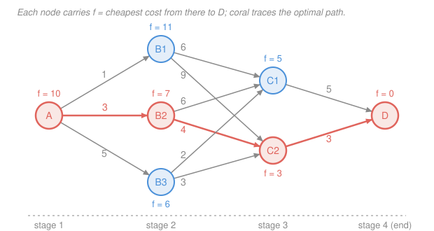

# Operations Research · Lesson 3.3: Deterministic dynamic programming

> ⏱ ~15 min · Module 3: Integer & Dynamic Programming · Builds on: [3.1 Modeling with integer variables](03-01-modeling-with-integer-variables.md), [3.2 Branch-and-bound & cutting planes](03-02-branch-and-bound-cutting-planes.md) · Unlocks: 3.4 (stochastic dynamic programming), 4.4 (inventory)

## Why this matters

Branch-and-bound in [3.2](03-02-branch-and-bound-cutting-planes.md) attacked hard combinatorial problems by *searching* — smartly, but still searching. Dynamic programming attacks a large family of them by refusing to search at all. If your problem is a **sequence** of decisions — which route to take at each junction, how much to produce each month, which items to load — DP replaces "try all complete plans" with "solve the last decision, then the second-to-last, then …", and the work collapses from exponential in the number of decisions to *linear in the number of situations you can be in*.

That trade is the whole subject, and it is why DP shows up far beyond OR: it is the engine under shortest-path algorithms, under optimal control, under the Bellman equation of [reinforcement learning](../../reinforcement-learning/syllabus.md). Here we do the deterministic case; [3.4](03-04-stochastic-dynamic-programming.md) adds randomness and gets Markov decision processes for free.

## The idea

Suppose you must drive from A to D through a network of junctions, and the whole trip takes three legs. There are, say, six complete routes. Fine — enumerate them. Now make it ten legs with three choices each: $3^9 \approx 20{,}000$ routes. Twenty legs: four billion. Enumeration dies fast, because the number of *complete plans* multiplies.

But look at what actually matters. Standing at some junction partway through, the best way to finish the trip depends on **exactly one thing: which junction you're standing at**. Not how you got there, not what you paid to get there. So there is no point computing "best rest-of-trip" once per route arriving at that junction — you compute it *once per junction*.

That is dynamic programming in a sentence: **the number of situations grows slowly even when the number of plans grows explosively, so tabulate over situations.** Nine legs with three junctions per stage is 27 junctions, not 20,000 routes.

The second half of the idea is *which end to start from*. The last decision is trivial to optimize because nothing follows it. So start there, record the answer, and step backwards: at the second-to-last stage, every option leads to a situation whose best-rest-of-trip you already wrote down, so each option is now a one-line arithmetic comparison. Keep stepping back until you reach the beginning. You never re-derive anything.

A greedy rule, by contrast, does not work: taking the cheapest arc out of A is a decision made in ignorance of what it commits you to downstream. DP is greedy *with respect to the correct quantity* — cost now plus best-cost-later — which is why it is exact and greed is not.

## The formal version

**The vocabulary.** This is where readers get lost, so define all four carefully.

- **Stage** $n$: the step of the sequence — a time period, a junction, an item being considered. Stages run $n = 1, 2, \dots, N$.
- **State** $s$: everything you need to know at stage $n$ to make the remaining decisions optimally. It is the *sufficient summary of the past*: two different histories that lead to the same state get the same future plan. (This is the same notion of "state" as in a finite-state machine — see [`digital-logic` 3.4](../../digital-logic/lessons/03-04-design-of-finite-state-machines.md), where a state is "everything the machine must remember about the past to behave correctly in the future, and nothing more.") **Choosing the state is the design decision that makes or breaks a DP formulation.**
- **Decision** $x_n$: what you choose at stage $n$, drawn from a set that may depend on $s$.
- **Value function** $f_n(s)$: the best total achievable from stage $n$ onward, given that you are in state $s$ at that stage. Units are whatever the objective is (dollars, cost, value).

**Principle of optimality** (Bellman). *An optimal policy has the property that, whatever the first decision is, the remaining decisions form an optimal policy for the state that decision leaves you in.*

In words: you cannot improve a plan's tail without the tail being suboptimal for the state it starts from — so an optimal whole is built out of optimal tails. This licenses the **recursion**: writing $r(s, x)$ for the immediate reward (or cost) of taking decision $x$ in state $s$, and $s' = t(s,x)$ for the state that decision leads to,

$$\boxed{\;f_n(s) \;=\; \max_{x}\;\bigl\{\, r(s,x) \;+\; f_{n+1}(s') \,\bigr\}\;}$$

with $\min$ in place of $\max$ for cost problems. *In words: the best you can do from here equals the best over your immediate choices of (what that choice pays you now) plus (the best you can do from wherever it puts you).*

The recursion is not yet an algorithm — it defines $f_n$ in terms of $f_{n+1}$, so it needs a **boundary condition** at the far end: $f_{N+1}(s) = 0$ (nothing left to earn), or a terminal value if finishing in state $s$ has a payoff or is forbidden ($-\infty$ / $+\infty$). That boundary is what starts the sweep.

**Backward recursion, as a procedure.**

1. Write down $f_{N+1}$ (or $f_N$, if the last stage is trivial) for **every** state.
2. For $n = N, N-1, \dots, 1$: for each state $s$, evaluate $r(s,x) + f_{n+1}(s')$ over all feasible $x$, store the best value as $f_n(s)$, **and store the maximizing $x$** — call it $x_n^*(s)$.
3. Read the optimal value off the start: $f_1(s_{\text{start}})$.
4. **Trace forward** to recover the plan: begin at $s_{\text{start}}$, apply $x_1^*(s_{\text{start}})$, move to the resulting state, apply $x_2^*$ of *that* state, and so on to the end.

Step 4 is the one people skip. **The tables give you the optimal number; they do not hand you the decisions.** Recovering the actual plan requires either storing the argmax as you go or re-scanning each stage forward to see which option achieved the recorded maximum. A DP answer of "220" with no list of what to pack is half an answer.

**What DP costs.** The table has one entry per (stage, state) pair, and filling an entry costs one pass over that state's decisions. So

$$\text{work} \;\approx\; (\text{number of stages}) \times (\text{states per stage}) \times (\text{decisions per state}),$$

which is a spectacular win whenever the state space is small — and a disaster otherwise. This is the **curse of dimensionality**: if the state is a pair (remaining weight *and* remaining volume), the table is the *product* of the two ranges; a third resource cubes it. DP is wonderful for problems with one skinny state variable and hopeless for problems with five fat ones. That honest limitation, not any theoretical gap, is what bounds the technique in practice.

## Picture: a shortest path, tabulated backwards

Four stages, one start node A, three middle nodes, two more, one end node D. Arc labels are costs; we want the cheapest A-to-D route.

**State** = which node you're at; **stage** = which column; **decision** = which arc to take; $f_n(s)$ = cheapest cost from node $s$ to D.

*Stage 4 (boundary).* $f_4(D) = 0$ — you have arrived.

*Stage 3.* One arc each, no choice:

| $s$ | arc to D | $f_3(s)$ |
|---|---|---|
| C1 | 5 | **5** |
| C2 | 3 | **3** |

*Stage 2.* Each B node compares two options, using stage-3 numbers already in hand:

| $s$ | via C1 | via C2 | $f_2(s)$ | $x_2^*$ |
|---|---|---|---|---|
| B1 | $6 + 5 = 11$ | $9 + 3 = 12$ | **11** | C1 |
| B2 | $6 + 5 = 11$ | $4 + 3 = 7$ | **7** | C2 |
| B3 | $2 + 5 = 7$ | $3 + 3 = 6$ | **6** | C2 |

*Stage 1.* A compares three options against stage-2 numbers:

| $s$ | via B1 | via B2 | via B3 | $f_1(s)$ | $x_1^*$ |
|---|---|---|---|---|---|
| A | $1 + 11 = 12$ | $3 + 7 = 10$ | $5 + 6 = 11$ | **10** | B2 |

**Forward trace.** $x_1^*(A) = $ B2; $x_2^*(\text{B2}) = $ C2; from C2 the only arc goes to D. Optimal route **A → B2 → C2 → D**, cost $3 + 4 + 3 = 10$.

**Brute-force check** (all six complete paths): A-B1-C1-D $= 12$, A-B1-C2-D $= 13$, A-B2-C1-D $= 14$, A-B2-C2-D $= 10$, A-B3-C1-D $= 12$, A-B3-C2-D $= 11$. Minimum $= 10$ on A-B2-C2-D. ✓ The DP matches.

Two things to notice. First, the DP did 11 additions (one per arc) against enumeration's 18 (three per path) — a modest win here, but the enumeration count is $3 \times 2 = 6$ paths while the table has only $3 + 2 + 1 = 6$ *entries*, and stretching the network to ten stages makes that $3^9$ versus roughly 30. Second, **greed fails**: the cheapest arc out of A is A→B1 at cost 1, and every route through B1 costs at least 12. The one unit saved up front buys a 6-unit-worse continuation. DP sees that because $f_2(\text{B1}) = 11$ prices the continuation before the first choice is made.

This is the same object as shortest path in [`graph-theory` 1.3](../../graph-theory/lessons/01-03-walks-paths-connectivity.md), approached from the recursion side rather than the algorithm side: there you grow a frontier, here you tabulate a value function. On a staged (acyclic) network they compute exactly the same thing.

## Worked examples

**Example 1 — the 0–1 knapsack (boss problem 3(a) from the [syllabus](../syllabus.md)).** Capacity 50. Three items with values $(60, 100, 120)$ and weights $(10, 20, 30)$; each may be taken at most once.

*Formulation.* This is not obviously a sequence — the items have no natural order in time. That's fine: DP only needs *some* order in which to consider them.

- **Stage** $i = 1, 2, 3$: the item currently being considered (any fixed order works).
- **State** $c$: capacity still available when item $i$ comes up. This is the sufficient summary — which particular earlier items you took is irrelevant; only the room they left you matters.
- **Decision**: take item $i$ or leave it.
- **Value function** $f_i(c)$: the best value obtainable from items $i, i+1, \dots, 3$ with $c$ units of capacity.

*Recursion*, with $v_i$ the value and $w_i$ the weight of item $i$:

$$f_i(c) = \begin{cases} \max\{\, f_{i+1}(c),\; v_i + f_{i+1}(c - w_i) \,\} & w_i \le c, \\[2pt] f_{i+1}(c) & w_i > c, \end{cases} \qquad f_4(c) = 0 .$$

*In words: either skip item $i$ and carry the same room forward, or take it, bank its value, and carry less room forward — whichever is better.*

*The table.* The only capacities ever reached from 50 by subtracting weights are $0, 10, 20, 30, 40, 50$, so those are the states. Filling right to left (item 3 first):

| $c$ | $f_3(c)$ | $f_2(c)$ | $f_1(c)$ |
|---|---|---|---|
| 0 | 0 | 0 (leave) | 0 (leave) |
| 10 | 0 | 0 (leave) | **60** (take) |
| 20 | 0 | **100** (take) | 100 (leave) |
| 30 | **120** (take) | 120 (leave) | **160** (take) |
| 40 | **120** (take) | 120 (leave) | **180** (take) |
| 50 | **120** (take) | **220** (take) | 220 (leave) |

Two entries worth reading aloud. $f_2(30) = \max\{f_3(30), 100 + f_3(10)\} = \max\{120, 100\} = 120$: with 30 units of room, item 3 alone beats item 2 alone. $f_2(50) = \max\{f_3(50),\, 100 + f_3(30)\} = \max\{120, 220\} = 220$: with 50 units, taking item 2 leaves exactly 30, which item 3 fills perfectly. And $f_1(50) = \max\{f_2(50),\, 60 + f_2(40)\} = \max\{220, 180\} = 220$ — taking the cheap item 1 costs you 10 units of room that item 2 needed more.

*Answer:* $f_1(50) = \mathbf{220}$.

*Forward trace.* Stage 1, $c = 50$: the max was achieved by **leave** ($220 > 180$), so item 1 stays behind; state moves to stage 2 with $c = 50$. Stage 2, $c = 50$: the max was **take** ($220 > 120$); pack item 2, $c \to 30$. Stage 3, $c = 30$: **take**; pack item 3, $c \to 0$. **Take items 2 and 3**, weight $20 + 30 = 50$, value $100 + 120 = 220$.

*Brute-force check — all $2^3 = 8$ subsets:*

| subset | weight | value | feasible? |
|---|---|---|---|
| none | 0 | 0 | yes |
| {1} | 10 | 60 | yes |
| {2} | 20 | 100 | yes |
| {3} | 30 | 120 | yes |
| {1,2} | 30 | 160 | yes |
| {1,3} | 40 | 180 | yes |
| **{2,3}** | **50** | **220** | **yes** |
| {1,2,3} | 60 | 280 | **no** — over capacity |

The best feasible subset is $\{2,3\}$ at value 220, weight exactly 50. ✓ Matches the DP, and matches the syllabus's stated answer. (Part (b) of that boss problem solves the same instance by branch-and-bound and gets a root bound of 240; the gap of 20 is the subject of [3.2](03-02-branch-and-bound-cutting-planes.md).)

*Cost.* $3 \times 6 = 18$ table entries with 2 decisions each, versus $2^3 = 8$ subsets — no win at this size. For $n$ items and capacity $C$ the table is $nC$ against $2^n$ subsets, and *that* is the win. Note $nC$ is not polynomial in the input *length* (the number $C$ is written in $\log C$ digits), which is why knapsack is called pseudo-polynomial rather than easy — see [computational complexity](../../computational-complexity/syllabus.md).

**Example 2 — production and inventory over three months.** The most characteristic OR use of DP, and the one where "state" is least obvious until you see it.

A plant faces known demands of 2, 3, and 2 units in months 1, 2, 3. Producing anything in a month costs a fixed **setup** of 5 dollars regardless of quantity, capacity is 5 units per month, and each unit left in stock at the end of a month costs 1 dollar to hold. Start with zero inventory and finish with zero. (Unit production cost is the same every month, so it adds a constant 7 dollars to every plan and can be dropped.) Minimize setup plus holding cost.

- **Stage** $n$: the month, $n = 1,2,3$.
- **State** $s$: units on hand entering month $n$, before that month's production. This is sufficient: past production schedules matter only through the stock they left.
- **Decision** $x_n$: units produced this month, $0 \le x_n \le 5$, subject to $s + x_n \ge d_n$.
- Next state $s' = s + x_n - d_n$; immediate cost $K(x_n) + s'$, where $K(x) = 5$ for $x > 0$ and $K(0) = 0$.
- $f_4(0) = 0$ and $f_4(s) = \infty$ for $s > 0$ (finishing with leftovers is not allowed).

*Stage 3* ($d_3 = 2$, must end empty, so $x_3 = 2 - s$ exactly):

| $s$ | $x_3$ | cost | $f_3(s)$ |
|---|---|---|---|
| 0 | 2 | $5 + 0$ | **5** |
| 1 | 1 | $5 + 0$ | **5** |
| 2 | 0 | $0 + 0$ | **0** |
| 3 | — | infeasible | $\infty$ |

*Stage 2* ($d_2 = 3$), each entry $= K(x) + s' + f_3(s')$ with $s' = s + x - 3$:

| $s$ | candidates | $f_2(s)$ | $x_2^*$ |
|---|---|---|---|
| 0 | $x{=}3\!:5{+}0{+}5{=}10$ · $x{=}4\!:5{+}1{+}5{=}11$ · $x{=}5\!:5{+}2{+}0{=}7$ | **7** | 5 |
| 1 | $x{=}2\!:10$ · $x{=}3\!:11$ · $x{=}4\!:5{+}2{+}0{=}7$ · $x{=}5\!:\infty$ | **7** | 4 |
| 2 | $x{=}1\!:10$ · $x{=}2\!:11$ · $x{=}3\!:7$ | **7** | 3 |
| 3 | $x{=}0\!:0{+}0{+}5{=}5$ · $x{=}1\!:11$ · $x{=}2\!:7$ | **5** | 0 |

*Stage 1* ($d_1 = 2$, start state $s = 0$, so $s' = x_1 - 2$):

| $x_1$ | $s'$ | $K + s' + f_2(s')$ | total |
|---|---|---|---|
| 2 | 0 | $5 + 0 + 7$ | **12** ← best |
| 3 | 1 | $5 + 1 + 7$ | 13 |
| 4 | 2 | $5 + 2 + 7$ | 14 |
| 5 | 3 | $5 + 3 + 5$ | 13 |

*Forward trace.* $x_1^* = 2$ → enter month 2 with 0 → $x_2^* = 5$ → enter month 3 with 2 → $x_3^* = 0$. **Plan (2, 5, 0), cost 12 dollars**: two setups (10) plus two units held one month (2).

*Check by enumeration of production patterns.* Total demand is 7 and capacity is 5, so at least two production months are needed, and month 1 must produce (stock starts at zero). Produce in months 1 and 2 → best is $(2,5,0)$, cost $10 + 2 = 12$. Months 1 and 3 → month 1 must cover months 1–2, so $(5,0,2)$, cost $10 + 3 = 13$. All three months → $(2,3,2)$, cost $15 + 0 = 15$; other splits only add holding. Minimum is **12**. ✓ Matches the DP, and the DP's other stage-1 rows reproduce those alternatives exactly (13 and 15 appear as the $x_1 = 5$ row and as the $x_2 = 3$ candidate under it).

The structural fact the table quietly proves — you only ever produce in a month when you enter it with zero stock — is the Wagner–Whitin property, and it is what makes production lot-sizing tractable at realistic scale. [4.4](04-04-inventory-eoq-newsvendor.md) takes the continuous-demand version of the same trade-off.

## Watch out

- **You might think DP is an algorithm.** It is a *modeling technique*. There is no "the DP algorithm" you can call; there is a recursion you must derive for each problem, and the entire art is choosing the state. Two people modeling the same problem can produce a 20-entry table and a 20-million-entry table. The right question is always "what is the smallest summary of the past that still determines the best future?"
- **You might think the value table is the answer.** It is the optimal *value*. The optimal *decisions* live in the argmaxes, and you get them only by tracing forward from the start state — or by storing $x_n^*(s)$ as you fill each cell. Reporting "220" without "items 2 and 3" is the single most common student error in this material.
- **You might think any bad-looking DP just needs a bigger table.** If the cost of the remaining stages depends on something your state doesn't record, the recursion is simply *wrong* — not slow, wrong, because the principle of optimality no longer applies to that state. Example: if holding cost depended on *how long* each unit had been in stock, "units on hand" would not be a sufficient state and the table above would be invalid. The fix is to enlarge the state (track ages), which is exactly how the curse of dimensionality bites.

## One-liner

> Dynamic programming replaces "search all plans" with "tabulate the best-from-here value once per state, sweeping backwards from the end" — and the plan itself comes from tracing the argmaxes forward.

## Problems

**P1 (🟢)** Find the cheapest path from S to T in this staged network by backward recursion. Arc costs: S→A1 $=3$, S→A2 $=5$; A1→B1 $=4$, A1→B2 $=7$; A2→B1 $=2$, A2→B2 $=3$; B1→T $=4$, B2→T $=2$. Report $f$ at every node, the optimal path, and its cost — then verify by enumerating all four complete paths.

**P2 (🟡)** Four identical work crews must be assigned to three sites. The profit (in thousands of dollars) from giving a site $k$ crews is

| crews $k$ | 0 | 1 | 2 | 3 | 4 |
|---|---|---|---|---|---|
| site 1 | 0 | 5 | 8 | 10 | 11 |
| site 2 | 0 | 4 | 8 | 10 | 11 |
| site 3 | 0 | 6 | 9 | 10 | 11 |

Set this up as a DP (say what the stage, state, and decision are), build $f_3$, $f_2$, and $f_1(4)$, and give the optimal allocation by forward trace.

**P3 (🔴)** The hiker's knapsack now has two limits: 50 units of weight *and* 12 units of volume. The three items have volumes $(6, 4, 5)$ alongside their weights $(10, 20, 30)$ and values $(60, 100, 120)$. (a) What is the state now, and what is the recursion? (b) Counting only capacities reachable from the start, roughly how many entries does the table have, versus the 18 of the one-dimensional version? (c) Why can't you just run the weight-only DP and then check the winner's volume?

Solutions

**P1** State = current node, stage = column, $f(s)$ = cheapest cost from $s$ to T. Boundary: $f(T) = 0$.

*Stage 3.* $f(\text{B1}) = 4$, $f(\text{B2}) = 2$ (one arc each).

*Stage 2.*

| $s$ | via B1 | via B2 | $f(s)$ | argmin |
|---|---|---|---|---|
| A1 | $4 + 4 = 8$ | $7 + 2 = 9$ | **8** | B1 |
| A2 | $2 + 4 = 6$ | $3 + 2 = 5$ | **5** | B2 |

*Stage 1.* $f(\text{S}) = \min\{3 + f(\text{A1}),\; 5 + f(\text{A2})\} = \min\{3 + 8,\; 5 + 5\} = \min\{11, 10\} = \mathbf{10}$, achieved by A2.

*Forward trace:* S → A2 → B2 → T, cost $5 + 3 + 2 = 10$.

*Check (all four paths):* S-A1-B1-T $= 3+4+4 = 11$; S-A1-B2-T $= 3+7+2 = 12$; S-A2-B1-T $= 5+2+4 = 11$; S-A2-B2-T $= 5+3+2 = 10$. Minimum 10 on S-A2-B2-T ✓.

Note the same greedy trap as in the lesson: the cheaper first arc is S→A1 (3), and no route through A1 beats 11.

**P2** **Stage** $i = 1,2,3$ = the site being funded. **State** $s$ = crews still unassigned when site $i$ comes up, $s \in \{0,1,2,3,4\}$. **Decision** $x_i \in \{0,\dots,s\}$ = crews given to site $i$. **Value** $f_i(s)$ = best total profit from sites $i$ through 3 with $s$ crews left. Recursion $f_i(s) = \max_{0 \le x \le s}\{p_i(x) + f_{i+1}(s-x)\}$, with $f_4(s) = 0$.

*Stage 3.* Profits rise with $k$, so give site 3 everything left: $f_3 = (0, 6, 9, 10, 11)$ for $s = 0,\dots,4$.

*Stage 2*, $f_2(s) = \max_x \{p_2(x) + f_3(s-x)\}$:

| $s$ | candidates ($x = 0,1,2,\dots$) | $f_2(s)$ | $x_2^*$ |
|---|---|---|---|
| 0 | $0$ | **0** | 0 |
| 1 | $0{+}6 = 6$ · $4{+}0 = 4$ | **6** | 0 |
| 2 | $0{+}9 = 9$ · $4{+}6 = 10$ · $8{+}0 = 8$ | **10** | 1 |
| 3 | $0{+}10 = 10$ · $4{+}9 = 13$ · $8{+}6 = 14$ · $10{+}0 = 10$ | **14** | 2 |
| 4 | $0{+}11 = 11$ · $4{+}10 = 14$ · $8{+}9 = 17$ · $10{+}6 = 16$ · $11{+}0 = 11$ | **17** | 2 |

*Stage 1*, only $s = 4$ is needed:

| $x_1$ | $p_1(x_1) + f_2(4 - x_1)$ | total |
|---|---|---|
| 0 | $0 + 17$ | 17 |
| 1 | $5 + 14$ | **19** ← best |
| 2 | $8 + 10$ | 18 |
| 3 | $10 + 6$ | 16 |
| 4 | $11 + 0$ | 11 |

$f_1(4) = \mathbf{19}$ thousand dollars.

*Forward trace:* $x_1^* = 1$ → 3 crews left → $x_2^*(3) = 2$ → 1 crew left → site 3 takes it. **Allocation (1, 2, 1)**, profit $5 + 8 + 6 = 19$ ✓.

*Check (all 15 allocations).* The best in each family: $(4,0,0), (0,4,0), (0,0,4)$ all give 11; $(3,0,1) = 16$, $(0,3,1) = 16$, $(1,3,0) = 15$, $(1,0,3) = 15$, $(3,1,0) = 14$, $(0,1,3) = 14$; $(2,0,2) = 17$, $(0,2,2) = 17$, $(2,2,0) = 16$; $(2,1,1) = 18$, $(1,1,2) = 18$, $(1,2,1) = 19$. Maximum 19 at $(1,2,1)$ ✓.

**P3** (a) The state must record **both** remaining resources: a pair $(c_w, c_v)$ = weight room and volume room left. With $v_i$ the value, $w_i$ the weight and $u_i$ the volume of item $i$,

$$f_i(c_w, c_v) = \max\bigl\{\, f_{i+1}(c_w, c_v),\;\; v_i + f_{i+1}(c_w - w_i,\, c_v - u_i) \,\bigr\}$$

whenever $w_i \le c_w$ **and** $u_i \le c_v$, else just the first term; $f_4(\cdot,\cdot) = 0$.

(b) Reachable weight room from 50 by subtracting from $\{10,20,30\}$: $\{0,10,20,30,40,50\}$, 6 values. Reachable volume room from 12 by subtracting from $\{6,4,5\}$: $12, 6, 8, 7, 2, 3, 1, -3$ — the feasible ones are $\{1,2,3,6,7,8,12\}$, 7 values. So the table is at most $3 \times 6 \times 7 = 126$ entries against 18 — roughly a sevenfold blow-up from one extra constraint, and if the volume cap were 120 in unit steps it would be a hundredfold. That multiplicative growth in the *size* of the state is the curse of dimensionality.

(c) Because feasibility for one resource says nothing about the other, and the optimum of a relaxed problem need not be feasible for the full one. Here the weight-only DP returns $\{2,3\}$ with volume $4 + 5 = 9 \le 12$, so it happens to survive — but had the caps been tighter (volume 8, say), $\{2,3\}$ would be infeasible and the true optimum would be a different subset that the weight-only table never scored. More fundamentally, "best value at this remaining weight" is not a sufficient summary of the past once volume also constrains the future: the principle of optimality applies to the *full* state, and dropping a coordinate breaks it.

## Flashback

**From Lesson 3.2 (Branch-and-bound & cutting planes)** — a different instance from the knapsack, so the retrieval is about the pruning mechanics themselves. Consider

$$\max\; 5x_1 + 4x_2 \quad \text{s.t.} \quad x_1 + x_2 \le 5,\;\; 10x_1 + 6x_2 \le 45,\;\; x_1, x_2 \ge 0 \text{ integer}.$$

The root LP relaxation solves at $x = (3.75,\, 1.25)$ with $z = 23.75$. Branch on $x_1$. The child with $x_1 \le 3$ has LP optimum at the integer point $(3, 2)$ with $z = 23$; the child with $x_1 \ge 4$ has LP optimum $(4, \tfrac56)$ with $z = 23\tfrac13$. Can the $x_1 \ge 4$ side be pruned? If not, branch once more on $x_2$ and finish the tree, saying why each remaining node dies.

Solution

**Node $x_1 \le 3$:** the LP relaxation optimum $(3,2)$ is already integral, so this node is **pruned by integrality** and $(3,2)$ becomes the **incumbent** with $z^* = 23$. No further branching there — an integral relaxation optimum is optimal for that whole subtree.

**Node $x_1 \ge 4$:** its bound is $23\tfrac13 > 23$, so it **cannot** be pruned by bound — a better integer solution might still hide inside. (Prune only when bound $\le$ incumbent, for a maximization.) The relaxation optimum has $x_2 = \tfrac56$ fractional, so branch on $x_2$:

- **$x_1 \ge 4,\ x_2 \le 0$:** the LP is $\max 5x_1$ with $10x_1 \le 45$, giving $x = (4.5, 0)$ and $z = 22.5$. Since $22.5 < 23 = $ incumbent, **prune by bound**. (Even the fractional best here loses to a solution we already hold, so no integer point inside can win.)
- **$x_1 \ge 4,\ x_2 \ge 1$:** then $10x_1 + 6x_2 \ge 40 + 6 = 46 > 45$, violating the second constraint. **Prune by infeasibility.**

Every node is closed, so the incumbent is optimal: $x^* = (3,2)$, $z^* = 23$. Integrality gap at the root: $23.75 - 23 = 0.75$.

*Check by enumeration.* The binding constraint $10x_1 \le 45$ forces $x_1 \le 4$. Best $x_2$ for each: $x_1 = 0 \to x_2 = 5,\, z = 20$; $x_1 = 1 \to x_2 = 4,\, z = 21$; $x_1 = 2 \to x_2 = 3,\, z = 22$; $x_1 = 3 \to x_2 = 2,\, z = 23$; $x_1 = 4 \to x_2 = 0,\, z = 20$. Maximum 23 at $(3,2)$ ✓.

## Connections

- **Backward:** [3.2](03-02-branch-and-bound-cutting-planes.md) and this lesson are the two exact methods for combinatorial problems, and they fail in opposite directions — branch-and-bound needs a *tight relaxation*, DP needs a *small state*. The syllabus's boss problem 3 deliberately solves one knapsack both ways so you can feel the difference. The binary take/leave decision itself is [3.1](03-01-modeling-with-integer-variables.md)'s indicator variable, now read as a stage decision rather than as a column of an integer program.
- **Forward:** [3.4](03-04-stochastic-dynamic-programming.md) keeps this exact recursion and replaces the deterministic next state $s'$ with a distribution, turning $f_{n+1}(s')$ into $\sum_{s'} p(s'|s,a) V(s')$ — that is a Markov decision process, and value iteration is backward recursion run until it stops changing. [4.4](04-04-inventory-eoq-newsvendor.md) revisits Example 2's production/holding trade-off in continuous time.
- **Sideways:** the staged shortest path here is the same object as in [`graph-theory` 1.3](../../graph-theory/lessons/01-03-walks-paths-connectivity.md), and the same recursion appears as the Bellman equation in [reinforcement learning](../../reinforcement-learning/syllabus.md), as the discrete-time optimality principle behind optimal control in [control systems](../../control-systems/syllabus.md), and as the design pattern behind edit distance and matrix-chain problems in [algorithms](../../algorithms/syllabus.md). The notion of "state" as a sufficient summary of the past is imported wholesale from finite-state machines, [`digital-logic` 3.4](../../digital-logic/lessons/03-04-design-of-finite-state-machines.md).
