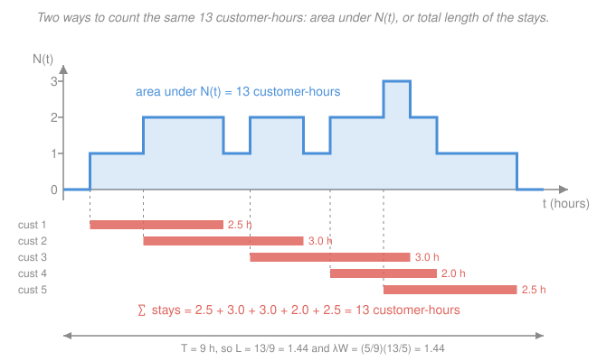

# Operations Research · Lesson 4.1: Poisson arrivals & Little's law

> ⏱ ~15 min · Module 4: Queueing & Inventory · Builds on: [3.4 Stochastic dynamic programming](03-04-stochastic-dynamic-programming.md), [`prob-stat-refresher` 2.2](../../prob-stat-refresher/lessons/02-02-discrete-distributions.md), [`prob-stat-refresher` 2.3](../../prob-stat-refresher/lessons/02-03-continuous-distributions.md) · Unlocks: [4.2 The M/M/1 queue](04-02-the-mm1-queue.md)

## Why this matters

Modules 1–3 all shared a quiet assumption: the data was **known**. The profit per unit, the demand, the transition probabilities — you were handed numbers and asked for the best decision. Real service systems break that. A call center, a walk-in clinic, a supermarket checkout, a web server: nobody tells you *when* the next job shows up or *how long* it will take. You cannot control either. What you can control is capacity — how many servers, how fast, how much buffer — and you judge your choice by the system's **long-run averages**: how many people are typically waiting, how long they typically wait.

That shift, from optimizing a decision to managing a random system by its steady-state averages, is what Module 4 is about. This lesson gives you the standard model for random arrivals and one law — $L = \lambda W$ — that holds so broadly it feels like cheating.

## The idea

Picture customers wandering into a coffee shop of their own accord. Nobody coordinated them; each person's decision to walk in has nothing to do with anyone else's. If you watch long enough you notice two things. First, arrivals come at some steady *average* pace — say 30 an hour — even though the actual gaps between them are wildly uneven. Second, clumps happen: three people in one minute, then nothing for six. That's not a broken model; that's what "independent and uncoordinated" genuinely looks like.

The **Poisson process** is the mathematical name for exactly that picture: arrivals sprinkled along the time axis at a constant average rate, each one oblivious to the others. It is the default arrival model in all of queueing theory, and it earns that spot because it has one magical property — **memorylessness**. The time you have already spent waiting tells you *nothing* about how much longer you will wait. That sounds like a curiosity. It's actually the load-bearing beam: it means the system's future depends only on its current state (how many people are here now), not on its history. That's what makes closed-form answers possible in [4.2](04-02-the-mm1-queue.md).

The second idea is embarrassingly simple and almost unreasonably general. If 30 people an hour walk in and each spends 10 minutes inside, how many people are inside at a typical moment? Five. You didn't need to know anything about the arrival pattern, the service times, the number of baristas, or whether they serve first-come-first-served. Rate in, times time spent, equals population. That's **Little's law**.

## The formal version

### The Poisson process

Let $N(t)$ be the number of arrivals in a time interval of length $t$. Arrivals form a **Poisson process with rate $\lambda$** (units: arrivals per unit time) when three things hold:

1. **Arrivals come one at a time.** In a vanishingly short interval the chance of two simultaneous arrivals is negligible. (No tour buses.)
2. **Disjoint intervals are independent.** What happened between 9:00 and 9:15 tells you nothing about 9:15 to 9:30.
3. **The rate $\lambda$ is constant.** The chance of an arrival in a short window of length $h$ is $\lambda h$, wherever that window sits.

*In words: uncoordinated customers, arriving singly, at a steady average pace.*

Two consequences follow, and they are the two formulas you actually use:

$$P\bigl(N(t) = k\bigr) = \frac{(\lambda t)^k e^{-\lambda t}}{k!}, \qquad k = 0, 1, 2, \dots$$

*In words: the count in a window of length $t$ is Poisson with mean $\lambda t$.* And if $T$ is the gap between one arrival and the next (the **interarrival time**),

$$P(T > t) = e^{-\lambda t}, \qquad \mathbb{E}[T] = \frac{1}{\lambda}.$$

*In words: interarrival times are exponential with mean $1/\lambda$.* Both distributions — Poisson and exponential, their means, variances, and derivations — are [`prob-stat-refresher` 2.2](../../prob-stat-refresher/lessons/02-02-discrete-distributions.md) and [2.3](../../prob-stat-refresher/lessons/02-03-continuous-distributions.md). We are not re-deriving them here; what is new is their role as an **arrival model** and the queueing machinery built on top.

**Quick numeric check.** A help desk receives calls at $\lambda = 6$ per hour. The probability of exactly $k=4$ calls in a given hour ($t = 1$, so $\lambda t = 6$) is

$$P(N = 4) = \frac{6^4 e^{-6}}{4!} = \frac{1296 \times 0.0024788}{24} = 0.134.$$

The mean gap between calls is $1/\lambda = 1/6$ hour $= 10$ minutes.

### Memorylessness

$$\boxed{\,P(T > s + t \mid T > s) = P(T > t)\,}$$

*In words: given you have already waited $s$ without an arrival, the chance of waiting at least $t$ more is exactly what it was when you started.* The wait does not "get more due."

The derivation is one line from the survival function $P(T > t) = e^{-\lambda t}$:

$$P(T > s+t \mid T > s) = \frac{P(T > s+t \text{ and } T > s)}{P(T > s)} = \frac{P(T > s+t)}{P(T>s)} = \frac{e^{-\lambda(s+t)}}{e^{-\lambda s}} = e^{-\lambda t} = P(T > t).$$

(The event $T > s+t$ already implies $T > s$, which collapses the numerator.) The exponential is the **only** continuous distribution with this property — $e^{-\lambda t}$ is the only survival function satisfying $g(s+t) = g(s)g(t)$ — which is precisely why it turns up in every model in this module. Its discrete cousin, the geometric distribution, is the only memoryless discrete one.

**When to distrust it.** Memorylessness is a strong assumption, not a free lunch:

- **Good model:** many independent customers each deciding on their own to show up — walk-in clinic, retail checkout, calls to a large support line, packets from many independent users.
- **Bad model — scheduled arrivals:** appointments, class changeovers, a bus timetable. If patients are booked every 15 minutes, then 14 minutes after the last one you know a lot about when the next arrives. That is the opposite of memoryless.
- **Bad model — bulk arrivals:** a tour bus unloading 40 people, a batch job releasing 1,000 requests. Violates property 1.
- **Bad model — time-varying rate:** lunch rush. Violates property 3. The usual fix is to slice the day into intervals and treat $\lambda$ as constant within each.

### Kendall notation

Queues are named $A/S/c$:

- $A$ — the **arrival** process,
- $S$ — the **service**-time distribution,
- $c$ — the number of parallel **servers**.

$M$ in either of the first two slots means "Markovian," i.e. memoryless: Poisson arrivals or exponential service times. So **M/M/1** is Poisson arrivals, exponential service, one server; **M/M/c** is the same with $c$ servers; **M/D/1** has deterministic (fixed) service times; **M/G/1** allows a general service distribution.

The extended form is $A/S/c/K/N/D$, adding system capacity $K$ (the waiting room size, default $\infty$), calling population $N$ (default $\infty$), and discipline $D$ (default first-come-first-served). You will mostly see the short form; $M/M/c/c$ — $c$ servers, no waiting room at all — is the one extended case worth remembering, since it models phone trunk lines.

### Little's law

Let, in the long-run steady state:

- $L$ = average number of customers **in the system** (waiting plus being served), a pure count;
- $\lambda$ = average arrival rate that actually enters the system (customers per unit time);
- $W$ = average time a customer spends **in the system** (same time unit as $\lambda$).

Then

$$\boxed{\,L = \lambda W\,}$$

*In words: the average population equals the rate people enter times how long each stays.*

**What makes this remarkable is what it does not require.** No distributional assumption — arrivals need not be Poisson, service need not be exponential. No independence. Any service discipline (first-come, last-come, priority, random). Any number of servers, any queue capacity, any network of stations. It is not an M/M/1 result — people meet it in the M/M/1 chapter and quietly file it as one, which badly undersells it. It needs only that (i) the system is **stable**, so nothing piles up without bound, and (ii) you are averaging over the **long run**.

**Why it's true — the area argument.** Watch the system over a long window of length $T$ and let $N(t)$ be the number present at time $t$. Now count the total **customer-hours** accumulated, in two ways.

*Way 1, by the clock.* At each instant $N(t)$ customers are each accruing one customer-hour per hour, so the total is $\int_0^T N(t)\,dt$ — the area under the step function.

*Way 2, by the customer.* Customer $i$ contributes their own time in system $W_i$, so the total is $\sum_i W_i$ over the $A(T)$ customers who came through.

The two counts are the same area, just sliced vertically versus horizontally. Divide both by $T$:

$$\underbrace{\frac{1}{T}\int_0^T N(t)\,dt}_{\to\, L} \;=\; \frac{1}{T}\sum_{i=1}^{A(T)} W_i \;=\; \underbrace{\frac{A(T)}{T}}_{\to\, \lambda} \cdot \underbrace{\frac{1}{A(T)}\sum_{i=1}^{A(T)} W_i}_{\to\, W}.$$

As $T \to \infty$ the left side is the time-average population $L$ and the right side is $\lambda W$. (Customers straddling the window's edges contribute a bounded error that washes out when divided by a growing $T$ — this is exactly where stability is needed.) No probability entered anywhere; that's the source of the generality.

**The companion relations.** Apply the same law to the *waiting room only*, treating "in the queue" as the system:

$$L_q = \lambda W_q,$$

where $W_q$ is time spent waiting before service starts and $L_q$ the average number waiting. Since time in system = time waiting + time being served, and $1/\mu$ denotes the mean service time ($\mu$ = service rate per busy server),

$$W = W_q + \frac{1}{\mu} \quad\Longrightarrow\quad L = L_q + \frac{\lambda}{\mu}.$$

*In words: the average number in the system exceeds the average number waiting by $\lambda/\mu$ — which is exactly the average number of customers in service.*

### Utilization and stability

For $c$ identical servers each working at rate $\mu$, define the **utilization**

$$\rho = \frac{\lambda}{c\mu}.$$

*In words: the fraction of time a given server is busy — offered work divided by capacity.* It is dimensionless: $\lambda$ and $c\mu$ are both "customers per unit time." The **stability condition** is

$$\rho < 1, \qquad \text{i.e.}\qquad \lambda < c\mu.$$

Strictly less. If work arrives at least as fast as it can be cleared, the queue grows without bound and no steady state exists — $L$, $W$ and Little's law all become meaningless. And $\rho$ close to 1 is not "efficient": [4.2](04-02-the-mm1-queue.md) shows that waiting times blow up long before $\rho$ reaches 1.

## Picture

Five customers pass through a 9-hour window. Integrating the step function gives 13 customer-hours; summing the five stays gives 13 customer-hours. So $L = 13/9 = 1.44$ customers and $W = 13/5 = 2.6$ hours with $\lambda = 5/9 = 0.556$ per hour, and indeed $\lambda W = 0.556 \times 2.6 = 1.44 = L$.

## Worked examples

**Example 1 (mechanical — a clinic).** A walk-in clinic sees $\lambda = 12$ patients per hour, and a patient averages 20 minutes in the building from door to door. How many patients are in the building at a typical moment?

Convert first: $W = 20\ \text{min} = \tfrac{20}{60} = \tfrac13$ hour, matching $\lambda$'s "per hour."

$$L = \lambda W = 12\ \frac{\text{patients}}{\text{hour}} \times \frac13\ \text{hour} = 4\ \text{patients.}$$

Notice what we never asked: how many exam rooms, whether arrivals are Poisson, whether visits are exponential, whether urgent cases jump the line. None of it matters.

**Example 2 (why you'd care — inventory is a queue).** A warehouse stocks a part. Units "arrive" when a shipment lands and "depart" when they're sold, so a unit of inventory is just a customer whose "service" is sitting on the shelf. Little's law reads:

$$\underbrace{L}_{\text{average inventory (units)}} = \underbrace{\lambda}_{\text{throughput (units/yr)}} \times \underbrace{W}_{\text{average time on the shelf (yr)}}$$

Suppose the warehouse ships $\lambda = 1{,}200$ units per year and carries an average of 100 units on hand. Then

$$W = \frac{L}{\lambda} = \frac{100\ \text{units}}{1{,}200\ \text{units/yr}} = \frac{1}{12}\ \text{yr} = 1\ \text{month.}$$

That $W$ is the **inventory turn** in disguise — $\lambda/L = 12$ turns per year. And it says something operational: if you want average inventory (hence holding cost) cut in half at the same sales rate, you must halve the time a unit sits on the shelf. There is no third option. That trade-off between how much you hold and how long you hold it is the whole subject of [4.4](04-04-inventory-eoq-newsvendor.md), where EOQ picks the order quantity that balances holding cost against ordering cost.

## Watch out

- **You might mix time units, and it is the single most common error here.** $\lambda$ and $W$ must be expressed in the *same* time unit before you multiply. A clinic with $\lambda = 12$/hour and $W = 20$ gives $L = 240$ if you forget that the 20 is minutes — a nonsense answer, off by a factor of 60. Write the unit next to every number and cancel them explicitly.
- **You might think Little's law needs Poisson arrivals or exponential service.** It needs neither, nor independence, nor a queue discipline, nor a fixed number of servers. Poisson and exponential are assumptions of [4.2](04-02-the-mm1-queue.md)'s M/M/1 *formulas*; $L = \lambda W$ survives without them.
- **You might read $\rho = 0.95$ as healthy efficiency.** In a random system it is nearly a fire. Stability only requires $\rho < 1$, but the closer $\rho$ creeps to 1 the more violently $L$ and $W$ explode — that curve is [4.2](04-02-the-mm1-queue.md)'s punchline. High utilization is only safe when arrivals and service are nearly deterministic.
- **You might apply $\lambda$ as the rate that *knocks*, not the rate that *enters*.** In a system that turns customers away (finite waiting room, balking callers), Little's law uses the **effective** arrival rate — those actually admitted. Blocked customers spend zero time inside and must not be counted.

## One-liner

> Model arrivals as memoryless — the clock never remembers how long you've waited — and then, for *any* stable system whatsoever, average population = arrival rate × average stay.

## Problems

**P1 (🟢)** A coffee kiosk's customers arrive as a Poisson process at $\lambda = 30$ per hour.
(a) What is the probability that exactly 2 customers arrive in a given 5-minute window?
(b) What is the mean time between arrivals, and what is the probability the next gap exceeds 4 minutes?
(c) The barista has now seen nobody for 3 minutes. What is the probability she waits at least 4 more minutes?

**P2 (🟡)** A support line takes 480 calls per 8-hour shift. A caller spends an average of 90 seconds in the system, of which 70 seconds is talk time with an agent.
(a) Find $\lambda$ in calls per minute, then $L$ and $L_q$, stating units at each step.
(b) Verify your numbers satisfy $L = L_q + \lambda/\mu$.
(c) What is the smallest number of agents $c$ that keeps the system stable, and what is $\rho$ at that $c$?

**P3 (🔴)** An emergency department has $\lambda = 6$ patients per hour arriving around the clock, and a patient averages 45 minutes in the department.
(a) Find $L$.
(b) A new fast-track lane is opened. Now 60 percent of patients are low-acuity and average 20 minutes, while the remaining 40 percent average 75 minutes. Arrival rate is unchanged. Find the new $L$.
(c) Management wants no more than 3.5 patients in the department on average, at the same $\lambda$. What average time in the department does that require?

Solutions

**P1**

(a) Convert the window to hours to match $\lambda$: $t = 5\ \text{min} = 5/60 = 1/12$ hour, so the mean count is $\lambda t = 30 \times \tfrac{1}{12} = 2.5$ customers. Then

$$P(N = 2) = \frac{(2.5)^2 e^{-2.5}}{2!} = \frac{6.25 \times 0.082085}{2} = 0.2565.$$

(b) Mean interarrival time is $1/\lambda = 1/30$ hour $= 2$ minutes. Working in minutes, the exponential rate is $\lambda = 0.5$ per minute, so

$$P(T > 4) = e^{-0.5 \times 4} = e^{-2} = 0.1353.$$

(c) By memorylessness, the 3 minutes already elapsed are irrelevant:

$$P(T > 3 + 4 \mid T > 3) = P(T > 4) = e^{-2} = 0.1353,$$

identical to (b).

*Check.* Two units, one answer: in (a), doing it in minutes gives $\lambda t = 0.5 \times 5 = 2.5$, the same mean count — the conversion is consistent. Sanity on (b): 4 minutes is two mean gaps, and $e^{-2} \approx 13.5$ percent is the familiar "two mean lifetimes" survival probability. ✓

**P2**

(a) Arrival rate: $\lambda = 480\ \text{calls} / 8\ \text{h} = 60$ calls/hour $= 1$ call/minute.

Time in system $W = 90\ \text{s} = 1.5$ min. Then

$$L = \lambda W = 1\ \tfrac{\text{call}}{\text{min}} \times 1.5\ \text{min} = 1.5\ \text{callers in the system.}$$

Waiting time is time in system minus talk time: $W_q = 90 - 70 = 20\ \text{s} = 1/3$ min. Then

$$L_q = \lambda W_q = 1 \times \tfrac13 = 0.333\ \text{callers waiting.}$$

(b) Mean service time is $1/\mu = 70\ \text{s} = 7/6$ min, so $\lambda/\mu = 1 \times 7/6 = 1.1667$ callers in service on average. Check:

$$L_q + \frac{\lambda}{\mu} = 0.3333 + 1.1667 = 1.5 = L.$$

That matches $L$ from part (a). ✓

(c) Stability needs $\rho = \lambda/(c\mu) < 1$, i.e. $c > \lambda/\mu = 1.1667$. Since $c$ is an integer, $c = 2$ is the minimum. Then

$$\rho = \frac{\lambda}{c\mu} = \frac{1.1667}{2} = 0.583.$$

*Check.* Part (b) is the independent verification: $\lambda/\mu = 1.1667$ was computed from the talk time alone, yet it closes the identity to the penny. It also has a physical reading — on average 1.17 agents are talking, so one agent cannot possibly keep up, confirming (c). ✓

**P3**

(a) $W = 45\ \text{min} = 0.75$ h, matching $\lambda$'s per-hour unit:

$$L = \lambda W = 6\ \tfrac{\text{patients}}{\text{h}} \times 0.75\ \text{h} = 4.5\ \text{patients.}$$

(b) The overall average time in system is the probability-weighted mixture:

$$W = 0.6 \times 20 + 0.4 \times 75 = 12 + 30 = 42\ \text{min} = 0.7\ \text{h},$$

$$L = 6 \times 0.7 = 4.2\ \text{patients.}$$

Note that this population is decidedly not exponential, not single-server, and not one homogeneous customer class — Little's law does not care.

(c) Invert the law:

$$W = \frac{L}{\lambda} = \frac{3.5\ \text{patients}}{6\ \text{patients/h}} = 0.5833\ \text{h} = 35\ \text{min.}$$

*Check.* Consistency across the three parts: $L$ moves in exact proportion to $W$ at fixed $\lambda$, so $4.5 \times (42/45) = 4.2$ ✓ and $4.5 \times (35/45) = 3.5$ ✓. Sanity: cutting the average stay from 45 to 42 minutes (a 6.7 percent reduction) cuts the census by the same 6.7 percent, from 4.5 to 4.2. ✓

## Flashback

**From Lesson 3.4 (Stochastic dynamic programming):** *(fresh variant — a two-stage machine-maintenance MDP, not the problem you solved there.)*

A machine is in state $g$ (good) or $f$ (failed). In state $g$ you choose an action: **Run** yields an immediate reward of 100 and leaves the machine in state $g$ with probability 0.5, $f$ with probability 0.5; **Service** yields 40 and leaves it in $g$ with certainty. In state $f$ the only action is **Repair**, with reward $-200$, after which the machine is in state $g$ with certainty. The discount factor is $\gamma = 0.9$, and the terminal value is 0 for both states.

Working backward, find $V_1(g)$, $V_1(f)$ (one decision left) and $V_2(g)$ (two decisions left), and state the optimal action at each stage.

Solution

The backward recursion is $V_n(s) = \max_a \bigl\{ r(s,a) + \gamma \sum_{s'} p(s'|s,a)\, V_{n-1}(s') \bigr\}$, with $V_0(\cdot) = 0$.

**Stage 1 (one decision left).** The future is worth nothing, so only the immediate reward matters:

$$V_1(g) = \max\{100 + 0,\; 40 + 0\} = 100 \quad (\text{Run}), \qquad V_1(f) = -200 + 0 = -200.$$

**Stage 2 (two decisions left), from state $g$.**

$$\text{Run: } 100 + 0.9\bigl[0.5(100) + 0.5(-200)\bigr] = 100 + 0.9(-50) = 100 - 45 = 55.$$

$$\text{Service: } 40 + 0.9\bigl[1 \times 100\bigr] = 40 + 90 = 130.$$

$$V_2(g) = \max\{55,\; 130\} = 130 \quad (\text{Service}).$$

So the optimal policy is **Service now, Run last** — with a future to protect, the 0.5 chance of a $-200$ repair outweighs the extra 60 of immediate reward; on the final decision there is no future left to protect, so you cash in and Run.

*Check (brute force over all four two-stage policies from $g$):*

| First action | Second action | Expected total |
|---|---|---|
| Run | Run if $g$ / Repair if $f$ | $100 + 0.9(0.5 \cdot 100 + 0.5 \cdot (-200)) = 55$ |
| Run | Service if $g$ / Repair if $f$ | $100 + 0.9(0.5 \cdot 40 + 0.5 \cdot (-200)) = 28$ |
| Service | Run | $40 + 0.9(100) = 130$ |
| Service | Service | $40 + 0.9(40) = 76$ |

The maximum is 130, matching the recursion. ✓

## Connections

- **Backward:** the Poisson and exponential distributions themselves come from [`prob-stat-refresher` 2.2](../../prob-stat-refresher/lessons/02-02-discrete-distributions.md) and [2.3](../../prob-stat-refresher/lessons/02-03-continuous-distributions.md); the conditioning step in the memorylessness proof is [`prob-stat-refresher` 1.2](../../prob-stat-refresher/lessons/01-02-conditional-probability-bayes.md). Memorylessness is also what makes a queue a *Markov* process — the same "the state is all you need" property that let [3.4](03-04-stochastic-dynamic-programming.md) write $V(s)$ as a function of the current state alone.
- **Forward:** [4.2](04-02-the-mm1-queue.md) builds the M/M/1 birth–death chain on exactly these assumptions and produces closed forms for $L$, $L_q$, $W$, $W_q$; Little's law is then the bridge that converts any one of them into the others, so you only ever derive one. [4.3](04-03-mmc-pooling-networks.md) extends it to $c$ servers and to networks, where Little's law applies station by station *and* to the network as a whole. [4.5](04-05-simulation-nonlinear-taste.md) uses exponential interarrival generation as the core of discrete-event simulation.
- **Sideways:** the inventory reading of Example 2 is the direct link to [4.4](04-04-inventory-eoq-newsvendor.md) — average inventory = throughput × time on the shelf is Little's law wearing a warehouse uniform, and it is why "inventory turns" and "days of supply" are the same statistic twice. In a manufacturing plant the same identity is the standard capacity-planning tool: work-in-progress = throughput × cycle time.
