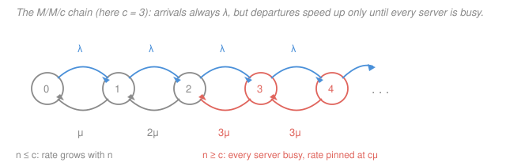

# Operations Research · Lesson 4.3: M/M/c, pooling & networks of queues

> ⏱ ~15 min · Module 4: Queueing & Inventory · Builds on: [4.1 Poisson arrivals & Little's law](04-01-poisson-arrivals-littles-law.md), [4.2 The M/M/1 queue](04-02-the-mm1-queue.md) · Unlocks: [4.4 Inventory: EOQ & the newsvendor](04-04-inventory-eoq-newsvendor.md), [4.5 Simulation & nonlinear taste](04-05-simulation-nonlinear-taste.md)

## Why this matters

Nobody staffs a call center with one agent. The real question a manager faces is *how many* servers, and — less obviously — *how to arrange them*. This lesson answers both. The first answer, M/M/c, is a formula you look up. The second is a genuine idea: a bank with one snaking line feeding six tellers is not a cosmetic choice, it is a measurably faster system than six separate lines with the same six tellers and the same total traffic. Pooling variability is one of the highest-leverage moves in operations, and it costs nothing. Then we chain queues into networks, which is how you model a factory floor, a hospital, or a request path through a web service.

## The idea

Two servers, one queue. When a customer finishes, whichever server frees up takes the next person in line. Compare that with two servers, two queues, where you commit to a line the moment you walk in.

The difference is a failure mode that only the second layout has: **a server standing idle while somebody is waiting**. You picked the slow line. The person in front of you had a monster of a problem. Meanwhile the other teller finished early and has nobody. That capacity is gone — you can't retroactively give it to the customer who needed it. The shared queue makes that impossible: as long as anyone is waiting, every server is working.

That's the whole mechanism, and it's why the effect is large. It's not that pooled servers are faster. They're identical servers running at identical utilization. Pooling just stops you from wasting them.

The second idea in this lesson is that once you can analyze *one* multi-server station, you can often analyze a whole **network** of them — a job leaves station 1, goes to station 2, maybe loops back — by treating each station separately and gluing the answers together. That this works at all is a small miracle, and it has a name.

## The formal version

**The M/M/c queue.** Arrivals form a Poisson process at rate $\lambda$ (customers per unit time). There are $c$ **identical** servers, each serving at exponential rate $\mu$ (customers per unit time per server). All arrivals join **one** queue, served first-come-first-served; a departing customer's server takes the head of that queue. (Poisson and exponential are imported from [`prob-stat-refresher` 2.2](../../prob-stat-refresher/lessons/02-02-discrete-distributions.md) and [2.3](../../prob-stat-refresher/lessons/02-03-continuous-distributions.md) — this course uses them, it doesn't rebuild them.)

The single shared queue is not a detail. It is the modeling assumption that separates M/M/c from $c$ copies of M/M/1, and it is what this lesson is about.

**The birth–death chain, with a state-dependent departure rate.** Let $n$ be the number in the system. Arrivals still push $n \to n+1$ at rate $\lambda$, exactly as in [4.2](04-02-the-mm1-queue.md). The only change is the downward rate. If $n < c$, only $n$ servers are busy, so departures happen at $n\mu$. Once $n \ge c$ all $c$ servers are busy and the rate saturates at $c\mu$:

$$\text{departure rate from state } n \;=\; \begin{cases} n\mu, & 1 \le n < c\\[2pt] c\mu, & n \ge c.\end{cases}$$

*In words: the system speeds up as it fills, until it runs out of servers to switch on.* The cut-balance (flow across the cut between $n-1$ and $n$) equations are the same shape as M/M/1's, just with that rate:

$$\lambda P_{n-1} = n\mu P_n \;\; (n \le c), \qquad \lambda P_{n-1} = c\mu P_n \;\; (n > c),$$

where $P_n$ is the steady-state probability of $n$ in the system.

**Two load numbers.** Define the **offered load** and the **utilization**:

$$a = \frac{\lambda}{\mu} \quad (\text{erlangs}), \qquad \rho = \frac{\lambda}{c\mu} = \frac{a}{c}.$$

*In words: $a$ is the average number of servers' worth of work arriving — the number of servers you'd need if there were no randomness at all. $\rho$ is the fraction of capacity you actually use.* Stability requires $\boxed{\rho < 1}$, i.e. $c > a$. Note the units: $a$ is a pure number, and 1 erlang means "one server permanently occupied."

**The formulas.** Solving the balance equations and normalizing $\sum_n P_n = 1$:

$$P_0 = \left[\sum_{n=0}^{c-1}\frac{a^n}{n!} \;+\; \frac{a^c}{c!\,(1-\rho)}\right]^{-1}, \qquad L_q = P_0\,\frac{a^c\,\rho}{c!\,(1-\rho)^2}.$$

*In words: $P_0$ is the chance the system is completely empty, and $L_q$ is the average number waiting in line (not counting those in service).* Everything else follows from [4.1](04-01-poisson-arrivals-littles-law.md)'s Little's law:

$$W_q = \frac{L_q}{\lambda}, \qquad W = W_q + \frac{1}{\mu}, \qquad L = \lambda W = L_q + a.$$

*In words: total time in system is wait plus one service; and the average number in service is exactly the offered load $a$.*

**Erlang-C.** The probability that an arriving customer finds all servers busy and must wait at all is

$$C(c,a) = P_0\,\frac{a^c}{c!\,(1-\rho)}, \qquad\text{and then}\qquad L_q = C(c,a)\,\frac{\rho}{1-\rho}, \quad W_q = \frac{C(c,a)}{c\mu - \lambda}.$$

*In words: Erlang-C is the fraction of arrivals that queue.* This is the number call centers actually staff to — targets are written as "80 percent of calls answered within 20 seconds," which is a statement about the wait *distribution*, and $C(c,a)$ is its front door.

Be honest about these: they are unpleasant to evaluate by hand, the factorials overflow fast, and nobody memorizes them. The skill worth having is knowing what each symbol means, checking $\rho < 1$ before anything else, and being able to *use* the output — which is exactly what the examples below drill.

**Variants, by name only.** **M/M/c/K** caps the waiting room at $K$; arrivals finding it full are **blocked** and lost, so the system is always stable but you now care about the blocking probability (Erlang-B, the loss version, is its $K = c$ special case). **Finite-population** models let the arrival rate fall as more of a fixed pool of $N$ customers is already in the system — the right model for $N$ machines and a repair crew. **Priority queues** serve some classes first, which leaves the *total* $L$ roughly alone while redistributing waiting time across classes.

## Picture

## Worked examples

### Example 1 — pooling versus splitting (boss problem 4b)

A repair shop takes jobs at $\lambda = 30$ per hour. It has two identical technicians, each at $\mu = 20$ per hour. Should they share one queue, or split the traffic into two lines of $\lambda = 15$ each?

**Pooled: one M/M/2 station.** Offered load $a = \lambda/\mu = 30/20 = 1.5$; utilization $\rho = \lambda/(c\mu) = 30/40 = 0.75 < 1$, so it is stable. Compute $P_0$ term by term, with $c = 2$ so the sum runs over $n = 0, 1$:

$$\frac{a^0}{0!} = 1, \qquad \frac{a^1}{1!} = 1.5, \qquad \frac{a^2}{2!\,(1-\rho)} = \frac{2.25}{2 \times 0.25} = \frac{2.25}{0.5} = 4.5.$$

$$P_0 = [1 + 1.5 + 4.5]^{-1} = \frac{1}{7} \approx 0.1429.$$

Now $L_q$, again term by term: $a^c = a^2 = 2.25$, $\rho = 0.75$, $c! = 2$, $(1-\rho)^2 = 0.0625$.

$$L_q = \frac{1}{7} \cdot \frac{2.25 \times 0.75}{2 \times 0.0625} = \frac{1}{7} \cdot \frac{1.6875}{0.125} = \frac{13.5}{7} \approx 1.9286.$$

$$W_q = \frac{L_q}{\lambda} = \frac{1.9286}{30} \approx 0.0643 \text{ hours} \approx 3.86 \text{ minutes}.$$

*Check.* Erlang-C is $C = P_0\,a^c/(c!(1-\rho)) = (1/7)(4.5) = 4.5/7 \approx 0.6429$, and the alternative route $W_q = C/(c\mu - \lambda) = 0.6429/(40-30) = 0.0643$ hours — agrees. Also $L = L_q + a = 1.9286 + 1.5 = 3.4286$ and $\lambda W = 30(0.0643 + 0.05) = 3.4286$, so Little's law closes.

**Split: two independent M/M/1 stations at $\lambda = 15$.** From [4.2](04-02-the-mm1-queue.md), each has $\rho = 15/20 = 0.75$ — *the same utilization* — and

$$L_q = \frac{\rho^2}{1-\rho} = \frac{0.5625}{0.25} = 2.25, \qquad W_q = \frac{L_q}{\lambda} = \frac{2.25}{15} = 0.15 \text{ hours} = 9 \text{ minutes}.$$

**The verdict.** $0.15 / 0.0643 = 2.33$. Pooling cuts the average wait by a factor of about $2.33$, with the same two people, the same service rate, and the same utilization. Queue length tells the same story: $1.93$ waiting pooled versus $2 \times 2.25 = 4.5$ waiting split.

**Why.** In the split system a customer can be stuck behind a long job while the *other* technician sits with nothing to do. That idle server-time is capacity that existed and was thrown away — and it is thrown away exactly when it was most needed. The shared queue makes the situation impossible: nobody waits while a server is free. Formally, pooling merges two variable workstreams into one, and the merged stream is *relatively* less variable than either piece — the peaks in one partly cancel the troughs in the other. **Pooling variability reduces its effect.** That single sentence explains single-line-multiple-teller layouts in banks and airport security, shared compute pools instead of one machine per team, centralized warehouses instead of regional ones (the "square-root law" of inventory consolidation), and cross-trained staff instead of rigid job assignments.

**The honest limits.** Pooling assumes servers are **interchangeable** and that routing costs nothing. It loses its edge when servers are specialized (a pooled queue sends the tax question to the mortgage expert), when there is real travel or handoff cost (one shared warehouse means longer shipping), when priority classes should be separated anyway, or when the servers are physically far apart. And the single line, while faster on average, *feels* slower to some customers — a real operational fact even though the math says otherwise.

### Economies of scale in staffing

Push the same logic further: a *bigger* pooled system can run at *higher* utilization for the same service level. The rule of thumb is **square-root staffing**:

$$c \approx a + \beta\sqrt{a},$$

with $\beta$ a service-level dial (around $\beta \approx 1$ gives a moderate delay probability; larger $\beta$ means more slack and less waiting). *In words: you need $a$ servers just to keep up with the work, plus a safety cushion that grows like the square root of the load — not in proportion to it.*

Illustration with $\beta = 1$. A small center with $a = 10$ erlangs needs $c \approx 10 + \sqrt{10} = 13.16$, so $c = 14$ servers, giving $\rho = 10/14 = 0.714$ and Erlang-C $C(14,10) \approx 0.174$. Quadruple the load to $a = 40$: $c \approx 40 + \sqrt{40} = 46.32$, so $c = 47$, giving $\rho = 40/47 = 0.851$ and $C(47,40) \approx 0.205$. Roughly the same chance of waiting — but the big center runs at 85 percent utilization against the small one's 71 percent. The load went up $4\times$ and the safety cushion only went from 4 servers to 7.

### Example 2 — a network of queues

An electronics repair depot: units arrive from outside at **intake** (node 1) at $r_1 = 10$ per hour, then go to **repair** (node 2), then to **test** (node 3). Twenty percent of tested units fail and are routed back to repair; the rest ship. No external arrivals at nodes 2 or 3.

**Jackson's theorem.** For an open network with Poisson external arrivals, exponential service at every node, and probabilistic routing (each departure from node $i$ goes to node $j$ with fixed probability $p_{ij}$, or leaves), the steady-state distribution has **product form**: each node behaves *as if* it were an independent M/M/c queue fed by its own total arrival rate $\lambda_j$. *In words: analyze the nodes one at a time and multiply the probabilities.*

This is genuinely surprising. The internal flows are **not** independent, and with feedback loops they are not even Poisson processes. The theorem says the steady-state *marginal* distributions come out as if they were anyway. It is what makes networks of queues tractable at all.

**Traffic equations.** The total arrival rate at node $j$ is external arrivals plus everything routed in:

$$\lambda_j = r_j + \sum_i \lambda_i\, p_{ij}.$$

Here $p_{12} = 1$, $p_{23} = 1$, $p_{32} = 0.2$ (the rest exit), and $r_1 = 10$, $r_2 = r_3 = 0$:

$$\lambda_1 = 10, \qquad \lambda_2 = \lambda_1 + 0.2\lambda_3, \qquad \lambda_3 = \lambda_2.$$

Substitute the third into the second: $\lambda_2 = 10 + 0.2\lambda_2 \Rightarrow 0.8\lambda_2 = 10 \Rightarrow \lambda_2 = 12.5$, and $\lambda_3 = 12.5$. *Note that rework inflates node 2's load 25 percent above the external arrival rate — this is the point of solving the equations rather than guessing.*

**Per-node performance.** Each node has one server: $\mu_1 = 20$, $\mu_2 = 15$, $\mu_3 = 20$ per hour. Treat each as M/M/1 with $L = \rho/(1-\rho)$:

| Node | $\lambda_j$ | $\mu_j$ | $\rho_j$ | $L_j$ |
|---|---|---|---|---|
| 1 intake | 10 | 20 | 0.500 | $0.5/0.5 = 1$ |
| 2 repair | 12.5 | 15 | 0.833 | $(5/6)/(1/6) = 5$ |
| 3 test | 12.5 | 20 | 0.625 | $(5/8)/(3/8) = 5/3 \approx 1.667$ |

**Little's law across the whole network.** Total units in the depot: $L = 1 + 5 + 5/3 = 23/3 \approx 7.67$. The throughput of the *system* is the external rate, $\lambda = 10$ per hour (every unit that enters eventually leaves), so

$$W = \frac{L}{\lambda} = \frac{7.667}{10} = 0.767 \text{ hours} = 46 \text{ minutes}$$

from arrival to shipment, including rework loops. *Check.* All $\rho_j < 1$, so the network is stable; $L_2 = 5$ is the largest, consistent with node 2 having the highest $\rho$.

**Read the bottleneck.** The node with the highest $\rho$ governs the system, and capacity added anywhere else barely helps. Add a second server at node 1 (making it M/M/2): $L_1$ falls from $1$ to $0.533$, so $L$ goes $7.67 \to 7.20$ — a 6 percent improvement. Add that server at node 2 instead: $L_2$ falls from $5$ to $1.008$, so $L$ goes $7.67 \to 3.68$ and $W$ drops from 46 minutes to 22. Same server, eight times the benefit. Two corollaries worth carrying around: cutting the rework probability attacks the bottleneck's *arrival rate*, which is often cheaper than buying capacity; and once you relieve node 2, the bottleneck moves, so re-solve rather than assuming.

## Watch out

- **You might think $\rho = \lambda/\mu$, as in M/M/1.** With $c$ servers it is $\rho = \lambda/(c\mu)$; the quantity $\lambda/\mu$ is the offered load $a$, which can exceed 1 perfectly happily. Stability is $a < c$, not $a < 1$. Mixing these up is the single most common M/M/c error.
- **You might think $c$ separate M/M/1 queues are "the same thing" as one M/M/c.** They have the same servers, same total $\lambda$, and same $\rho$ — and different waiting times. Kendall notation's $c$ always means servers sharing one queue. If your real system has separate lines, model it as separate M/M/1 queues, not as M/M/c.
- **You might read Jackson's product form as "the nodes are independent."** They are not; the flow leaving a congested node is bursty and correlated with that node's state. What the theorem gives is that the *steady-state joint distribution* factors as if they were. Use it for steady-state averages, not to reason about the timing of individual jobs.
- **You might expect Jackson's theorem to survive small model changes.** It does not. Finite buffers, blocking, non-exponential service, or priority routing all break product form, and then you simulate — which is [4.5](04-05-simulation-nonlinear-taste.md)'s job.

## One-liner

> One queue feeding $c$ servers beats $c$ queues feeding one server each, at identical utilization, because a shared queue never lets a server idle while somebody waits — and Jackson's theorem lets you chain such stations together and analyze them one at a time.

## Problems

**P1 (🟢)** A help desk receives calls as a Poisson process at $\lambda = 24$ per hour; each agent handles calls at $\mu = 10$ per hour. Agents share one queue. (a) What is the smallest number of agents that gives a stable system? (b) Management wants the average wait in queue to be at most 2 minutes. Find the smallest $c$ that achieves it, computing $P_0$, $L_q$ and $W_q$ for each $c$ you test.

**P2 (🟡)** Two walk-in clinics each get $\lambda = 4$ patients per hour and each has one doctor serving at $\mu = 5$ per hour, with their own queues. A merger proposal puts both doctors in one building with a single shared queue. Compute $W_q$ before and after, and state the improvement factor. Does the utilization change?

**P3 (🔴)** Show that for **any** two-server comparison at utilization $\rho$ — one M/M/2 station at arrival rate $2\lambda_0$ versus two M/M/1 stations at $\lambda_0$ each, all servers at rate $\mu$ — the ratio of split waiting time to pooled waiting time is exactly $(1+\rho)/\rho$. Then interpret the two limits $\rho \to 1$ and $\rho \to 0$.

Solutions

**P1** Offered load $a = \lambda/\mu = 24/10 = 2.4$ erlangs.

**(a)** Stability needs $\rho = a/c < 1$, i.e. $c > 2.4$, so **$c = 3$** is the minimum.

**(b)** Target $W_q \le 2$ minutes $= 1/30$ hour $\approx 0.0333$ h.

*Try $c = 3$:* $\rho = 2.4/3 = 0.8$. The sum runs over $n = 0,1,2$:

$$\frac{a^0}{0!} = 1, \quad \frac{a^1}{1!} = 2.4, \quad \frac{a^2}{2!} = \frac{5.76}{2} = 2.88, \quad \frac{a^3}{3!(1-\rho)} = \frac{13.824}{6 \times 0.2} = \frac{13.824}{1.2} = 11.52.$$

$$P_0 = [1 + 2.4 + 2.88 + 11.52]^{-1} = \frac{1}{17.8} \approx 0.05618.$$

$$L_q = P_0\frac{a^3\rho}{3!(1-\rho)^2} = 0.05618 \cdot \frac{13.824 \times 0.8}{6 \times 0.04} = 0.05618 \cdot \frac{11.0592}{0.24} = 0.05618 \times 46.08 \approx 2.5888.$$

$$W_q = \frac{2.5888}{24} \approx 0.1079 \text{ h} \approx 6.47 \text{ min}. \quad \text{Too slow.}$$

*Try $c = 4$:* $\rho = 2.4/4 = 0.6$. Sum over $n = 0,1,2,3$:

$$1 + 2.4 + 2.88 + \frac{a^3}{3!} = 1 + 2.4 + 2.88 + \frac{13.824}{6} = 1 + 2.4 + 2.88 + 2.304 = 8.584,$$
$$\frac{a^4}{4!(1-\rho)} = \frac{33.1776}{24 \times 0.4} = \frac{33.1776}{9.6} = 3.456, \qquad P_0 = [8.584 + 3.456]^{-1} = \frac{1}{12.04} \approx 0.08306.$$

$$L_q = 0.08306 \cdot \frac{33.1776 \times 0.6}{24 \times 0.16} = 0.08306 \cdot \frac{19.9066}{3.84} = 0.08306 \times 5.184 \approx 0.4306.$$

$$W_q = \frac{0.4306}{24} \approx 0.01794 \text{ h} \approx 1.08 \text{ min} \le 2 \text{ min}. \quad \text{So } c = 4.$$

*Check.* Erlang-C at $c=4$: $C = P_0 a^4/(4!(1-\rho)) = 0.08306 \times 3.456 = 0.2871$, and $W_q = C/(c\mu - \lambda) = 0.2871/(40-24) = 0.01794$ h — matches. Note how sharply the wait falls (6.47 min to 1.08 min) for one extra agent: that steepness near high $\rho$ is the same blow-up as $\rho \to 1$ from [4.2](04-02-the-mm1-queue.md).

**P2** *Before (two M/M/1):* $\rho = 4/5 = 0.8$. $L_q = \rho^2/(1-\rho) = 0.64/0.2 = 3.2$, so $W_q = 3.2/4 = 0.8$ hours $= 48$ minutes. (Or directly $W_q = \rho/(\mu - \lambda) = 0.8/1 = 0.8$ h.)

*After (one M/M/2 at $\lambda = 8$, $\mu = 5$):* $a = 8/5 = 1.6$, $\rho = 8/10 = 0.8$ — **unchanged**, which is the point.

$$\frac{a^0}{0!} = 1, \quad \frac{a^1}{1!} = 1.6, \quad \frac{a^2}{2!(1-\rho)} = \frac{2.56}{2 \times 0.2} = \frac{2.56}{0.4} = 6.4,$$
$$P_0 = [1 + 1.6 + 6.4]^{-1} = \frac{1}{9} \approx 0.1111.$$

$$L_q = \frac19 \cdot \frac{2.56 \times 0.8}{2 \times 0.04} = \frac19 \cdot \frac{2.048}{0.08} = \frac{25.6}{9} \approx 2.8444, \qquad W_q = \frac{2.8444}{8} \approx 0.3556 \text{ h} \approx 21.3 \text{ min}.$$

Improvement factor $48/21.33 = 2.25$. Utilization is $0.8$ in both cases — the gain comes purely from never idling a doctor while a patient waits.

*Check.* $(1+\rho)/\rho = 1.8/0.8 = 2.25$, matching P3's general formula. Also $L = L_q + a = 2.8444 + 1.6 = 4.444 = \lambda W = 8(0.3556 + 0.2)$. ✓

**P3** Write everything in terms of $\rho$. For the pooled M/M/2, $c = 2$ and $a = 2\rho$. First simplify $P_0$:

$$P_0 = \left[1 + 2\rho + \frac{(2\rho)^2}{2(1-\rho)}\right]^{-1} = \left[1 + 2\rho + \frac{2\rho^2}{1-\rho}\right]^{-1}.$$

Put the bracket over $(1-\rho)$: $(1-\rho)(1+2\rho) + 2\rho^2 = 1 + 2\rho - \rho - 2\rho^2 + 2\rho^2 = 1 + \rho$. So

$$P_0 = \frac{1-\rho}{1+\rho}, \qquad L_q = P_0\frac{a^2\rho}{2(1-\rho)^2} = \frac{1-\rho}{1+\rho}\cdot\frac{4\rho^3}{2(1-\rho)^2} = \frac{2\rho^3}{1-\rho^2}.$$

The pooled arrival rate is $\lambda = 2\mu\rho$, so

$$W_q^{\text{pool}} = \frac{L_q}{\lambda} = \frac{2\rho^3}{(1-\rho^2)\,2\mu\rho} = \frac{\rho^2}{\mu(1-\rho^2)}.$$

For a single M/M/1 at $\lambda_0 = \mu\rho$, from [4.2](04-02-the-mm1-queue.md): $W_q^{\text{split}} = \rho/(\mu(1-\rho))$. Therefore

$$\frac{W_q^{\text{split}}}{W_q^{\text{pool}}} = \frac{\rho}{\mu(1-\rho)}\cdot\frac{\mu(1-\rho^2)}{\rho^2} = \frac{1-\rho^2}{\rho(1-\rho)} = \frac{(1-\rho)(1+\rho)}{\rho(1-\rho)} = \frac{1+\rho}{\rho}.$$

*Limits.* As $\rho \to 1$ the ratio $\to 2$: under heavy load both systems have long queues and everybody is always busy anyway, so pooling only saves the "wrong line" penalty, worth a factor of 2. As $\rho \to 0$ the ratio blows up like $1/\rho$: at light load a split system's idle-server waste is nearly *all* of the waiting that occurs, so pooling removes almost all of it — though both waits are tiny in absolute terms, so the practical payoff is largest at moderate-to-high load.

*Check.* $\rho = 0.75$ gives $1.75/0.75 = 2.33$, matching Example 1; $\rho = 0.8$ gives $1.8/0.8 = 2.25$, matching P2. ✓

## Flashback

**From Lesson 4.2 (The M/M/1 queue) — fresh variant:** A shared office printer receives jobs as a Poisson process at $\lambda = 30$ per hour and prints them at $\mu = 50$ per hour, one at a time, first-come-first-served. Find $\rho$, $L$, $L_q$, $W$, and $W_q$, and state what fraction of a job's total turnaround is spent waiting rather than printing.

Solution

Utilization: $\rho = \lambda/\mu = 30/50 = 0.6 < 1$, so the queue is stable.

$$L = \frac{\rho}{1-\rho} = \frac{0.6}{0.4} = 1.5 \text{ jobs}, \qquad L_q = \frac{\rho^2}{1-\rho} = \frac{0.36}{0.4} = 0.9 \text{ jobs}.$$

$$W = \frac{1}{\mu - \lambda} = \frac{1}{50-30} = \frac{1}{20} \text{ hour} = 3 \text{ minutes}, \qquad W_q = \frac{\rho}{\mu-\lambda} = \frac{0.6}{20} = 0.03 \text{ h} = 1.8 \text{ minutes}.$$

So 1.8 of the 3 minutes — 60 percent of turnaround — is queueing, not printing; the print itself takes $1/\mu = 1.2$ minutes. That 60 percent is exactly $\rho$, which is no coincidence: for M/M/1, $W_q/W = \rho$ always.

*Check.* Little's law both ways: $L = \lambda W = 30 \times 0.05 = 1.5$ ✓ and $L_q = \lambda W_q = 30 \times 0.03 = 0.9$ ✓. Also $W - W_q = 0.05 - 0.03 = 0.02 = 1/\mu$ ✓, and $L - L_q = 0.6 = \rho$, the average number in service — the $c = 1$ case of this lesson's $L - L_q = a$. ✓

## Connections

- **Backward:** M/M/c is [4.2](04-02-the-mm1-queue.md)'s birth–death chain with one change — a state-dependent departure rate — and it collapses to M/M/1 when $c = 1$ ($a = \rho$, $P_0 = 1-\rho$). Every performance measure here is glued together by [4.1](04-01-poisson-arrivals-littles-law.md)'s Little's law, used at a single node and again across the whole network.
- **Forward:** [4.4](04-04-inventory-eoq-newsvendor.md) runs the same "pool the variability" logic on inventory rather than servers, and [4.5](04-05-simulation-nonlinear-taste.md) picks up where these closed forms stop — non-exponential service, blocking, priorities — with simulation.
- **Sideways:** the Poisson and exponential machinery is [`prob-stat-refresher` 2.2](../../prob-stat-refresher/lessons/02-02-discrete-distributions.md) and [2.3](../../prob-stat-refresher/lessons/02-03-continuous-distributions.md); the birth–death chain is a continuous-time Markov chain, developed properly in [`probability-theory`](../../probability-theory/syllabus.md). Queueing networks are the standard performance model for computer systems — CPU, memory, and I/O as service stations with feedback, the setting of [`computer-architecture`](../../computer-architecture/syllabus.md).
