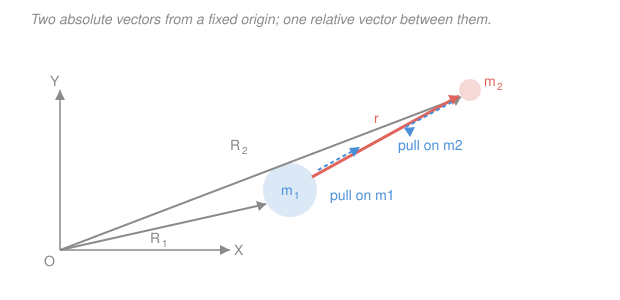

# Astrodynamics · Lesson 1.1: The relative two-body problem

> ⏱ ~15 min · Module 1: The two-body problem & orbits · Builds on: [`mechanics-refresher` 5.1](../../mechanics-refresher/lessons/05-01-gravitation-kepler.md), [`ode-refresher` 2.1](../../ode-refresher/lessons/02-01-second-order-constant-coefficient.md) · Unlocks: 1.2 (angular momentum and the orbit plane)

## Why this matters

Everything in this course — every transfer, every rendezvous, every Mars trajectory — rests on one differential equation. Two masses pull on each other; you want to know how their separation evolves. Written honestly the problem has six unknowns (three coordinates each) tangled through Newton's third law. Written cleverly it collapses to **one vector equation in one unknown**, and that equation is simple enough to solve in closed form. That collapse is the single most valuable move in astrodynamics, and it's what this lesson does.

The payoff is enormous: from here on, "the orbit" means the solution of one second-order ODE, and the rest of the course is reading consequences off it.

## The idea

Two bodies attract each other. Watch them from outside and you see a messy dance — both are moving, both are accelerating, neither sits still. But almost nobody cares where a satellite is relative to *empty space*. They care where it is **relative to the Earth**.

So change your vantage point: instead of tracking two positions, track the **vector from one body to the other**. Sit on the Earth and watch the satellite. What you see is a single point moving under a single inward pull.

Two things make this work. First, Newton's third law: the two gravitational forces are equal and opposite, so the pair's **center of mass** never accelerates — it drifts in a straight line forever and can be ignored entirely. Second, the separation vector's acceleration is just the *difference* of the two accelerations, and because both accelerations point along the same line, that difference stays along the same line. The result looks exactly like a one-body problem: one particle, one fixed attracting center, one inward force.

The only price is a small bookkeeping change. The strength of the pull is set not by the big mass alone but by the **sum** of the two masses. For a satellite around Earth that correction is a part in $10^{21}$ and nobody blinks. For the Earth–Moon system it is 1.2 percent and it matters.

## The formal version

Let two bodies of mass $m_1$ and $m_2$ (kg) have positions $\mathbf{R}_1$ and $\mathbf{R}_2$ (km) measured from an **inertial** origin — a non-accelerating, non-rotating frame. Newton's law of universal gravitation plus his second law give the two equations of motion:

$$m_1\ddot{\mathbf{R}}_1 = \frac{G m_1 m_2}{r^3}\,\mathbf{r}, \qquad m_2\ddot{\mathbf{R}}_2 = -\frac{G m_1 m_2}{r^3}\,\mathbf{r},$$

where

$$\mathbf{r} \equiv \mathbf{R}_2 - \mathbf{R}_1, \qquad r \equiv \|\mathbf{r}\|,$$

and $G = 6.674\times10^{-20}\ \mathrm{km^3\,kg^{-1}\,s^{-2}}$ is the gravitational constant. *In words: each body is pulled toward the other with a force falling off as the inverse square of the separation.* (The $\mathbf{r}/r^3$ form is just $\hat{\mathbf{r}}/r^2$ with the unit vector written out; see [inverse-square force](../reference.md#inverse-square-force).)

**Step 1: the center of mass drifts.** Add the two equations. The right-hand sides cancel exactly, so with $M = m_1 + m_2$ and $\mathbf{R}_{\rm cm} = (m_1\mathbf{R}_1 + m_2\mathbf{R}_2)/M$,

$$M\ddot{\mathbf{R}}_{\rm cm} = 0 \quad\Longrightarrow\quad \mathbf{R}_{\rm cm}(t) = \mathbf{R}_{\rm cm}(0) + \mathbf{V}_{\rm cm}\,t.$$

*In words: no outside force acts on the pair, so their balance point coasts in a straight line at constant speed.* We can therefore park an inertial frame on the center of mass and forget about it.

**Step 2: the relative equation.** Divide each equation by its mass and subtract:

$$\ddot{\mathbf{r}} = \ddot{\mathbf{R}}_2 - \ddot{\mathbf{R}}_1 = -\frac{Gm_1}{r^3}\mathbf{r} - \frac{Gm_2}{r^3}\mathbf{r} = -\frac{G(m_1+m_2)}{r^3}\,\mathbf{r}.$$

Define the **gravitational parameter**

$$\mu \equiv G(m_1 + m_2) \approx G m_1 \quad\text{when } m_2 \ll m_1,$$

with units $\mathrm{km^3/s^2}$. Then the whole two-body problem is

$$\boxed{\;\ddot{\mathbf{r}} = -\frac{\mu}{r^3}\,\mathbf{r}\;}$$

*In words: the separation vector accelerates straight back toward the primary, with a magnitude falling off as one over distance squared.* This is the **fundamental equation of relative motion**, and it is the only equation of motion in Modules 1 and 2.

**Why $\mu$, not $G$ and $m$ separately.** $G$ is one of the worst-measured constants in physics (about 5 significant figures), and planetary masses are worse. But the *product* is measured superbly by tracking spacecraft — you observe an orbit and read $\mu$ straight off it. So astrodynamics never uses $G$ and $M$ apart. Memorize the products instead:

| Body | $\mu\ (\mathrm{km^3/s^2})$ | Mean radius (km) |
|---|---|---|
| Sun | $1.327\times10^{11}$ | 696,000 |
| Earth | $398{,}600$ | 6378 |
| Moon | $4903$ | 1737 |
| Mars | $42{,}828$ | 3396 |

**The reduced-mass view (optional, but worth seeing once).** Multiply the boxed equation by $m_{\rm red} = m_1m_2/(m_1+m_2)$, the **reduced mass**, and it reads $m_{\rm red}\ddot{\mathbf{r}} = -G m_1 m_2 \mathbf{r}/r^3$ — literally Newton's second law for a fictitious particle of mass $m_{\rm red}$ orbiting a fixed center. The two-body problem *is* a one-body problem with a doctored mass. You will meet this again in [`analytical-mechanics` 1.4](../../analytical-mechanics/lessons/01-04-lagrangian-applications.md) and in quantum mechanics, where it fixes the hydrogen spectrum.

## Picture

## Worked examples

**Example 1 (mechanical — how good is the two-body assumption?).** For a satellite of mass $m_2 = 1000$ kg orbiting Earth ($m_1 = 5.974\times10^{24}$ kg), compare $\mu = G(m_1+m_2)$ with $Gm_1$.

The fractional correction is

$$\frac{m_2}{m_1} = \frac{1000}{5.974\times10^{24}} \approx 1.7\times10^{-22}.$$

Earth's $\mu$ is known to roughly 9 significant figures, so the satellite's own mass is 13 orders of magnitude below the noise floor. **Conclusion: for any spacecraft, $\mu$ is a property of the central body alone.** This is why we say "the $\mu$ of Earth" and never mention the vehicle.

**Example 2 (why you'd care — when the small mass isn't small).** The Moon has $m_2/m_1 = 0.0123$ of Earth's mass. If you model the Moon's orbit as a test particle around a fixed Earth you would use $\mu = Gm_\oplus = 398{,}600$; the correct relative-motion value is

$$\mu = G(m_\oplus + m_{\rm moon}) = 398{,}600 + 4903 = 403{,}503\ \mathrm{km^3/s^2},$$

a 1.23 percent increase. Since the orbital period scales as $\mu^{-1/2}$ (Lesson [1.5](01-05-keplers-laws-orbital-period.md)), using the wrong $\mu$ shifts the predicted lunar month by

$$\frac{\Delta T}{T} \approx -\tfrac12 \frac{\Delta\mu}{\mu} = -0.0061,$$

about $-0.0061 \times 27.3\ \text{days} \approx -0.17$ days, or four hours per month. Over a year that is a two-day error in predicting a lunar eclipse. **The sum-of-masses is not a pedantic detail once the two bodies are comparable.**

## Watch out

- **You might think the primary sits still.** It doesn't — Earth wobbles about the Earth–Moon barycenter, which is actually *inside* the Earth but 4700 km off center. The relative equation is exact anyway; it just describes the separation, not either body's absolute motion. If you need absolute positions, recover them from $\mathbf{R}_{\rm cm}$ and $\mathbf{r}$.
- **You might think $\ddot{\mathbf{r}} = -\mu\mathbf{r}/r^3$ is linear.** It is emphatically not: $r = \|\mathbf{r}\|$ makes the right-hand side a nonlinear function of the components. None of the superposition machinery from [`ode-refresher` 2.1](../../ode-refresher/lessons/02-01-second-order-constant-coefficient.md) applies. That we can still solve it exactly is a small miracle, and it is what Lessons 1.2 and 1.3 deliver.
- **You might drop the vector arrow and write $\ddot r = -\mu/r^2$.** That scalar equation is a *different problem* — radial free-fall along a straight line. The vector equation carries sideways motion, which is exactly what turns falling into orbiting.
- **Watch your units.** With $\mu$ in $\mathrm{km^3/s^2}$, distances must be in km and speeds in km/s. Mixing in meters is the single most common numerical error in this subject.

## One-liner

> Two bodies pulling on each other reduce to one vector equation, $\ddot{\mathbf{r}} = -\mu\mathbf{r}/r^3$, in which the only trace of the masses is their sum, buried in $\mu$.

## Problems

**P1 (🟢)** The International Space Station orbits at a radius of about $r = 6778$ km. Using $\mu_\oplus = 398{,}600\ \mathrm{km^3/s^2}$, compute the magnitude of its gravitational acceleration, and compare it with $g = 9.81\ \mathrm{m/s^2}$ at the surface.

**P2 (🟡)** Two identical stars of mass $m$ each orbit their common center of mass. Write the relative equation of motion, identify $\mu$, and state where the center of mass sits.

**P3 (🔴)** Show that $\mathbf{r}\times\ddot{\mathbf{r}} = \mathbf{0}$ for the two-body equation, and say in one sentence what that tells you about the orbit. (This is the seed of Lesson [1.2](01-02-angular-momentum-keplers-second-law.md).)

Solutions

**P1** The magnitude of $\ddot{\mathbf r}$ is

$$a = \frac{\mu}{r^2} = \frac{398{,}600}{6778^2} = \frac{398{,}600}{4.594\times10^7} = 8.68\times10^{-3}\ \mathrm{km/s^2} = 8.68\ \mathrm{m/s^2}.$$

That is $8.68/9.81 = 0.885$, i.e. **88.5 percent of surface gravity**.

*Check.* The inverse-square law predicts a ratio $(R_\oplus/r)^2 = (6378/6778)^2 = 0.886$ ✓. The lesson worth carrying: astronauts are not weightless because gravity is weak up there — it is nearly as strong as at the surface. They are weightless because they are in free fall, which is the whole content of $\ddot{\mathbf r} = -\mu\mathbf r/r^3$.

**P2** Subtracting the two equations of motion exactly as in the lesson, with $m_1 = m_2 = m$:

$$\ddot{\mathbf r} = -\frac{G(m+m)}{r^3}\mathbf r = -\frac{2Gm}{r^3}\mathbf r, \qquad \mu = 2Gm.$$

Here the "$\mu \approx Gm_1$" approximation is off by a **factor of two** — the two-body correction is maximal for equal masses. The center of mass sits at the midpoint of the line joining them, since $\mathbf{R}_{\rm cm} = (m\mathbf R_1 + m\mathbf R_2)/(2m) = (\mathbf R_1 + \mathbf R_2)/2$, and each star traces a scaled copy of the relative orbit at half the size.

**P3** Cross $\mathbf r$ into the equation of motion:

$$\mathbf r\times\ddot{\mathbf r} = \mathbf r \times \left(-\frac{\mu}{r^3}\mathbf r\right) = -\frac{\mu}{r^3}(\mathbf r\times\mathbf r) = \mathbf 0,$$

because the cross product of any vector with itself vanishes ([`linalg-refresher` 1.4](../../linalg-refresher/lessons/01-04-cross-product-and-orientation.md)).

The acceleration is always **parallel** to the position vector — the force is *central*. That means there is no torque about the primary, so angular momentum is conserved, so the position and velocity vectors are locked into a single fixed plane forever.

*Check.* Physically: a purely radial pull can speed you up or slow you down along the line to the primary but can never twist you out of the plane you started in. That plane is the orbit plane, and Lesson 1.2 makes it official.

## Connections

- **Backward:** this is [`mechanics-refresher` 5.1](../../mechanics-refresher/lessons/05-01-gravitation-kepler.md)'s inverse-square law promoted from a force law to an equation of motion, with the two-body bookkeeping done honestly instead of assuming a fixed center.
- **Forward:** [1.2](01-02-angular-momentum-keplers-second-law.md) crosses $\mathbf r$ into this equation to get the conserved angular momentum and the orbit plane; [1.3](01-03-orbit-equation-conic-sections.md) crosses it with $\mathbf h$ to get the orbit itself.
- **Sideways (analytical mechanics):** the reduced-mass trick here is the same one that turns any two-particle central-force Lagrangian into a one-particle problem in [`analytical-mechanics` 1.4](../../analytical-mechanics/lessons/01-04-lagrangian-applications.md) — and the same reduced mass that corrects the hydrogen atom's energy levels for the proton's finite mass.
