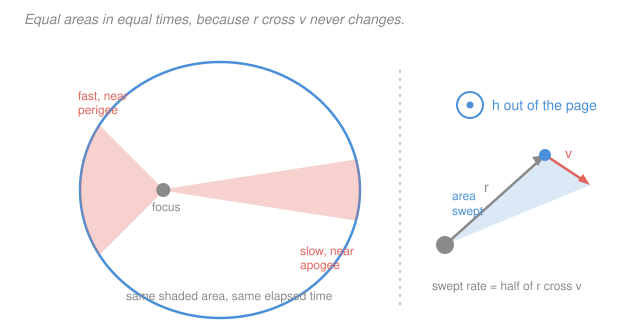

# Astrodynamics · Lesson 1.2: Angular momentum & Kepler's second law

> ⏱ ~15 min · Module 1: The two-body problem & orbits · Builds on: [1.1](01-01-relative-two-body-problem.md), [`linalg-refresher` 1.4](../../linalg-refresher/lessons/01-04-cross-product-and-orientation.md) · Unlocks: 1.3 (the orbit equation)

## Why this matters

The equation $\ddot{\mathbf r} = -\mu\mathbf r/r^3$ has six unknowns evolving in time. To solve it you need **constants of the motion** — combinations of position and velocity that never change, each one collapsing a degree of freedom. This lesson finds the first and most important of them: the specific angular momentum $\mathbf h$.

Its payoff is immediate and enormous. Conservation of $\mathbf h$ says a three-dimensional problem is secretly two-dimensional (the orbit lives in a fixed plane), and its magnitude is the quantity that makes a satellite race through perigee and crawl through apogee. Kepler discovered that behavior empirically in 1609 by staring at Mars data; here it falls out of the equation of motion in three lines.

## The idea

The pull on a satellite always points **straight at** the primary. A force aimed directly at a pivot can't twist anything about that pivot — it has no lever arm. So there's no torque about the primary, and the satellite's angular momentum about the primary is frozen for all time.

Freezing a *vector* does two jobs at once, and it's worth separating them:

- **Its direction is frozen.** Angular momentum is perpendicular to both position and velocity. If that perpendicular never tilts, then position and velocity are stuck in one fixed plane forever. **The orbit is planar** — not approximately, exactly. A satellite launched into an equatorial orbit never wanders north on its own.
- **Its magnitude is frozen.** That magnitude turns out to be exactly twice the rate at which the line from primary to satellite sweeps out area. So the satellite sweeps area at a *constant* rate. Near perigee the line is short, so to keep the area rate up the satellite must swing quickly. Near apogee the line is long, so a lazy crawl suffices. **That is Kepler's second law**, and it's why a comet spends decades in the outer solar system and weeks whipping around the Sun.

Kepler's version was a description. This version is a *consequence* — of nothing more than the force pointing along the line to the primary. Any central force gives equal areas; the inverse-square part isn't needed until Lesson [1.3](01-03-orbit-equation-conic-sections.md).

## The formal version

**Definition.** The **specific angular momentum** (angular momentum per unit mass, units $\mathrm{km^2/s}$) is

$$\mathbf h \equiv \mathbf r \times \mathbf v, \qquad \mathbf v \equiv \dot{\mathbf r}.$$

*In words: cross the position vector into the velocity vector; the result points perpendicular to both, along the orbit's axis.* We use the "specific" (per-mass) version throughout because the spacecraft's mass cancels out of the two-body problem entirely — see [specific angular momentum](../reference.md#specific-angular-momentum).

**Theorem (conservation).** $\mathbf h$ is constant along any two-body trajectory.

*Proof.* Differentiate, using the product rule for cross products:

$$\frac{d\mathbf h}{dt} = \dot{\mathbf r}\times\mathbf v + \mathbf r\times\dot{\mathbf v} = \underbrace{\mathbf v\times\mathbf v}_{=\,\mathbf 0} + \mathbf r\times\left(-\frac{\mu}{r^3}\mathbf r\right) = \mathbf 0 - \frac{\mu}{r^3}\underbrace{(\mathbf r\times\mathbf r)}_{=\,\mathbf 0} = \mathbf 0. \;\blacksquare$$

Both terms die for the same reason: a cross product of parallel vectors is zero. *In words: velocity is parallel to itself, and gravity is parallel to the position vector, so nothing can torque the orbit.*

**Consequence 1: the orbit plane.** Since $\mathbf h = \mathbf r\times\mathbf v$, we have $\mathbf r\cdot\mathbf h = 0$ at every instant. With $\mathbf h$ a fixed vector, $\mathbf r\cdot\mathbf h = 0$ is the equation of a **fixed plane through the primary**, with unit normal $\hat{\mathbf h} = \mathbf h/h$. *In words: the position vector is always perpendicular to one unchanging direction, so it never leaves that plane.* This is the **orbital plane**, and it lets us do all of Module 1 in two dimensions.

**Consequence 2: areal velocity.** In a time $dt$ the satellite moves by $d\mathbf r = \mathbf v\,dt$. The area of the sliver swept by the radius vector is half the area of the parallelogram spanned by $\mathbf r$ and $d\mathbf r$:

$$dA = \tfrac12\|\mathbf r\times d\mathbf r\| = \tfrac12\|\mathbf r\times\mathbf v\|\,dt = \tfrac{h}{2}\,dt \quad\Longrightarrow\quad \boxed{\;\frac{dA}{dt} = \frac{h}{2} = \text{constant.}\;}$$

*In words: the radius vector sweeps out area at a fixed rate of $h/2$.* This **is** Kepler's second law.

**Polar form — the workhorse.** Put polar coordinates $(r,\theta)$ in the orbit plane, with $\theta$ measured in the direction of motion. The velocity splits into a radial part and a transverse part:

$$\mathbf v = \underbrace{\dot r\,\hat{\mathbf u}_r}_{\text{radial}} + \underbrace{r\dot\theta\,\hat{\mathbf u}_\perp}_{\text{transverse}}, \qquad v_r = \dot r, \quad v_\perp = r\dot\theta.$$

Only the transverse part has a lever arm, so

$$\boxed{\;h = r\,v_\perp = r^2\dot\theta\;}$$

*In words: angular momentum is radius times the sideways component of velocity — the radial component contributes nothing.* Two facts you will use constantly:

- **At perigee and apogee, $v_r = 0$** (the radius is momentarily neither growing nor shrinking), so there $h = rv$ with the *full* speed. This is the shortcut that cracks most textbook problems.
- The **flight-path angle** $\gamma$ is the angle between $\mathbf v$ and the local horizontal (the transverse direction), so $\tan\gamma = v_r/v_\perp$ and $h = rv\cos\gamma$. At perigee and apogee $\gamma = 0$.

## Picture

## Worked examples

**Example 1 (mechanical — compute $\mathbf h$ from a state vector).** A spacecraft has

$$\mathbf r = (8000,\,0,\,6000)\ \mathrm{km}, \qquad \mathbf v = (0,\,7.0,\,0)\ \mathrm{km/s}.$$

Then

$$\mathbf h = \mathbf r\times\mathbf v = \begin{vmatrix}\hat i & \hat j & \hat k\\ 8000 & 0 & 6000 \\ 0 & 7 & 0\end{vmatrix} = (0\cdot 0 - 6000\cdot 7)\,\hat i - (8000\cdot 0 - 0)\,\hat j + (8000\cdot 7 - 0)\,\hat k$$

$$= (-42{,}000,\;0,\;56{,}000)\ \mathrm{km^2/s}, \qquad h = \sqrt{42000^2+56000^2} = 70{,}000\ \mathrm{km^2/s}.$$

The orbit plane is the plane through the origin perpendicular to $(-42000, 0, 56000)$, i.e. to $(-3,0,4)$. Note $r = \sqrt{8000^2+6000^2} = 10{,}000$ km and $v = 7$ km/s give $rv = 70{,}000$ — equal to $h$, so $\cos\gamma = 1$: this instant is an **apsis** (perigee or apogee), because $\mathbf r$ and $\mathbf v$ came out exactly perpendicular.

**Example 2 (why you'd care — perigee/apogee speed ratio without solving anything).** A Molniya-type orbit has perigee radius $r_p = 6{,}900$ km and apogee radius $r_a = 46{,}300$ km. At *both* apses $v_r = 0$, so $h = r_p v_p = r_a v_a$, giving

$$\frac{v_p}{v_a} = \frac{r_a}{r_p} = \frac{46{,}300}{6{,}900} = 6.71.$$

The spacecraft moves **6.7 times faster** at perigee than at apogee — from one conservation law, with no orbit equation, no energy, and no numbers for $\mu$. This ratio is exactly why Molniya orbits work: the satellite loiters for hours over the northern hemisphere near apogee and flashes through the southern perigee in minutes.

## Watch out

- **You might use $h = rv$ everywhere.** It only holds where $\mathbf v \perp \mathbf r$, i.e. at perigee, at apogee, or on a circular orbit. In general $h = rv\cos\gamma = rv_\perp$, and the radial component is invisible to angular momentum.
- **You might think equal areas implies an inverse-square law.** It doesn't. Kepler's second law follows from the force being *central* — any $f(r)\hat{\mathbf u}_r$ works, including a spring or a $1/r^3$ law. Only Kepler's *first* and *third* laws pin down the inverse square. So an observed equal-area sweep is weak evidence about the force law.
- **You might mix up $\mathbf h$'s direction convention.** $\mathbf h = \mathbf r\times\mathbf v$, in that order. Reversing it flips $\hat{\mathbf h}$ and would turn a prograde orbit into a retrograde one — which in [2.1](02-01-classical-orbital-elements.md) is the difference between an inclination of $30^\circ$ and $150^\circ$.
- **Specific versus total.** $\mathbf h$ here is **per unit mass**. The physical angular momentum is $m\mathbf h$, in $\mathrm{kg\,km^2/s}$. Textbooks drop the "specific" and just say "angular momentum"; check the units when you cross sources.

## One-liner

> Gravity pulls along the radius, so it can't torque the orbit: $\mathbf h = \mathbf r\times\mathbf v$ is frozen, which pins the orbit to a plane and makes the radius sweep area at the constant rate $h/2$.

## Problems

**P1 (🟢)** A satellite is at perigee with $r_p = 7{,}200$ km moving at $v_p = 9.2$ km/s. Find $h$. If its apogee radius is $r_a = 25{,}000$ km, find the speed at apogee.

**P2 (🟡)** At some instant a spacecraft has $r = 12{,}000$ km, speed $v = 5.1$ km/s, and flight-path angle $\gamma = 20^\circ$. Find $h$, the radial speed $v_r$, and state whether the spacecraft is climbing or falling.

**P3 (🔴)** Show that for *any* central force $\mathbf F = f(r)\hat{\mathbf u}_r$ the areal velocity is constant, and use this to explain why Kepler's second law was no help to Newton in identifying the inverse-square law.

Solutions

**P1** At perigee $\mathbf v\perp\mathbf r$, so

$$h = r_p v_p = 7{,}200 \times 9.2 = 66{,}240\ \mathrm{km^2/s}.$$

Apogee is the other apsis, so again $h = r_a v_a$:

$$v_a = \frac{h}{r_a} = \frac{66{,}240}{25{,}000} = 2.65\ \mathrm{km/s}.$$

*Check.* $v_p/v_a = 9.2/2.65 = 3.47$ and $r_a/r_p = 25000/7200 = 3.47$ ✓ — the reciprocal relation from Example 2.

**P2** The flight-path angle sits between $\mathbf v$ and the transverse direction, so

$$v_\perp = v\cos\gamma = 5.1\cos 20^\circ = 5.1(0.9397) = 4.79\ \mathrm{km/s},$$
$$v_r = v\sin\gamma = 5.1\sin 20^\circ = 5.1(0.3420) = 1.74\ \mathrm{km/s}.$$

$$h = r v_\perp = 12{,}000 \times 4.79 = 5.75\times10^{4}\ \mathrm{km^2/s}.$$

Since $\gamma > 0$ we have $v_r = \dot r > 0$: the spacecraft is **climbing** — it is on the outbound leg between perigee and apogee.

*Check.* $\sqrt{v_r^2+v_\perp^2} = \sqrt{1.74^2+4.79^2} = \sqrt{3.03+22.94} = \sqrt{25.97} = 5.10$ ✓ recovers the speed.

**P3** For a central force the acceleration is $\ddot{\mathbf r} = g(r)\hat{\mathbf u}_r = g(r)\mathbf r/r$ for some scalar function $g$. Then

$$\frac{d}{dt}(\mathbf r\times\mathbf v) = \mathbf v\times\mathbf v + \mathbf r\times\ddot{\mathbf r} = \mathbf 0 + \frac{g(r)}{r}(\mathbf r\times\mathbf r) = \mathbf 0,$$

so $\mathbf h$ is constant, and $dA/dt = h/2$ is constant, **whatever $g$ is**. The inverse-square form was never used.

Consequently Kepler's second law is a statement about the *geometry* of the force (it points at the Sun), not its *strength*. A $1/r$, $1/r^3$, or linear spring force all give equal areas. Newton needed Kepler's **first** law (the orbit is an ellipse with the Sun at a focus) and **third** law ($T^2\propto a^3$) to isolate the exponent $-2$ — which is exactly the work of Lessons [1.3](01-03-orbit-equation-conic-sections.md) and [1.5](01-05-keplers-laws-orbital-period.md).

## Connections

- **Backward:** this is problem P3 of [1.1](01-01-relative-two-body-problem.md) promoted to a theorem, and it is the same "no torque means constant angular momentum" argument as [`mechanics-refresher` 4.2](../../mechanics-refresher/lessons/04-02-angular-momentum.md), now applied to the relative vector.
- **Forward:** $\mathbf h$ is the pivot of everything ahead. [1.3](01-03-orbit-equation-conic-sections.md) crosses the equation of motion with $\mathbf h$ to get $r(\theta)$; $h$ sets the semi-latus rectum; and $\hat{\mathbf h}$ defines the inclination and node in [2.1](02-01-classical-orbital-elements.md).
- **Sideways (analytical mechanics):** conservation of $\mathbf h$ is Noether's theorem for rotational symmetry — the two-body potential depends only on $r$, so the Lagrangian is invariant under rotations, so angular momentum is conserved. See [`analytical-mechanics` 2.2](../../analytical-mechanics/lessons/02-02-noethers-theorem.md).
