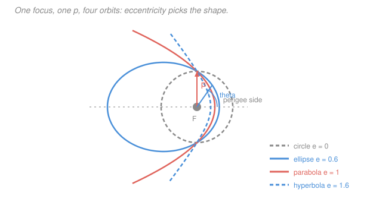

# Astrodynamics · Lesson 1.3: The orbit equation & conic sections

> ⏱ ~15 min · Module 1: The two-body problem & orbits · Builds on: [1.1](01-01-relative-two-body-problem.md), [1.2](01-02-angular-momentum-keplers-second-law.md) · Unlocks: 1.4 (energy and vis-viva)

## Why this matters

This is the lesson where the differential equation becomes a **shape**. Kepler's first law — planets travel on ellipses with the Sun at a focus — was an empirical pattern extracted from twenty years of Mars observations. Here it drops out of $\ddot{\mathbf r} = -\mu\mathbf r/r^3$ in about six lines of vector algebra, and it comes out *stronger* than Kepler stated it: an ellipse is only one of four possibilities, and a single number decides which one you get.

Once you have $r(\theta)$, orbits stop being trajectories you integrate and become curves you look up. Every later lesson is bookkeeping on this one formula.

## The idea

We already know the motion is planar and that $h$ is fixed. What's missing is the *shape* of the path in that plane — how $r$ depends on the direction $\theta$.

The trick is to hunt for a **second** conserved vector. Angular momentum is perpendicular to the orbit plane; is there a constant vector lying *in* the plane? If so, it would point in a fixed direction forever, and that direction would be a natural place to measure angles from.

There is one, and it's special to the inverse-square law. Cross the equation of motion with $\mathbf h$ and, remarkably, both sides turn into exact time derivatives. Integrating once gives a constant vector — the **eccentricity vector** — that points from the primary toward the closest point of the orbit. Its length is the eccentricity.

Then the last step is almost embarrassing. Dot the position vector into that constant, use the definition of the dot product on one side and a vector identity on the other, and solve for $r$. What comes out is the polar equation of a **conic section** with a focus at the primary. Which conic — circle, ellipse, parabola, or hyperbola — depends on nothing but the length of that vector.

The physical picture: gravity's inverse-square law is exactly the strength that makes an orbit *close on itself*. Make the exponent anything but $-2$ (or $+1$) and the ellipse precesses instead of repeating, which is precisely how a tiny relativistic correction shows up as Mercury's perihelion advance.

## The formal version

**Deriving the orbit equation.** Cross the equation of motion into $\mathbf h$ (on the right):

$$\ddot{\mathbf r}\times\mathbf h = -\frac{\mu}{r^3}\,\mathbf r\times(\mathbf r\times\mathbf v).$$

The left side is a total derivative, since $\dot{\mathbf h} = \mathbf 0$: $\frac{d}{dt}(\mathbf v\times\mathbf h) = \ddot{\mathbf r}\times\mathbf h$.

For the right side use the "BAC minus CAB" identity $\mathbf a\times(\mathbf b\times\mathbf c) = \mathbf b(\mathbf a\cdot\mathbf c) - \mathbf c(\mathbf a\cdot\mathbf b)$:

$$\mathbf r\times(\mathbf r\times\mathbf v) = \mathbf r(\mathbf r\cdot\mathbf v) - \mathbf v(\mathbf r\cdot\mathbf r) = r\dot r\,\mathbf r - r^2\mathbf v,$$

using $\mathbf r\cdot\mathbf v = r\dot r$. Therefore

$$\frac{d}{dt}(\mathbf v\times\mathbf h) = -\mu\left(\frac{\dot r\,\mathbf r}{r^2} - \frac{\mathbf v}{r}\right) = \mu\,\frac{d}{dt}\!\left(\frac{\mathbf r}{r}\right),$$

where the last equality is just the quotient rule, $\frac{d}{dt}(\mathbf r/r) = \mathbf v/r - \dot r\mathbf r/r^2$. Both sides are derivatives, so integrate:

$$\mathbf v\times\mathbf h = \mu\frac{\mathbf r}{r} + \mathbf B,$$

with $\mathbf B$ a constant vector of integration. Write $\mathbf B = \mu\mathbf e$ and you have the **eccentricity vector**

$$\boxed{\;\mathbf e = \frac{\mathbf v\times\mathbf h}{\mu} - \frac{\mathbf r}{r} = \frac{1}{\mu}\left[\left(v^2 - \frac{\mu}{r}\right)\mathbf r - (\mathbf r\cdot\mathbf v)\,\mathbf v\right].\;}$$

(The second form comes from expanding $\mathbf v\times(\mathbf r\times\mathbf v)$ the same way; it's the version you actually compute with.) *In words: a fixed, dimensionless vector lying in the orbit plane, pointing from the primary toward perigee, whose length is the eccentricity.*

**The orbit equation.** Dot $\mathbf r$ into $\mathbf v\times\mathbf h = \mu(\mathbf r/r + \mathbf e)$. On the left, the scalar triple product lets us rotate the factors:

$$\mathbf r\cdot(\mathbf v\times\mathbf h) = (\mathbf r\times\mathbf v)\cdot\mathbf h = \mathbf h\cdot\mathbf h = h^2.$$

On the right, $\mathbf r\cdot\mathbf r/r = r$ and $\mathbf r\cdot\mathbf e = re\cos\theta$, where $\theta$ — the **true anomaly** — is the angle from $\mathbf e$ to $\mathbf r$. So $h^2 = \mu r(1 + e\cos\theta)$, i.e.

$$\boxed{\;r(\theta) = \frac{h^2/\mu}{1 + e\cos\theta} = \frac{p}{1+e\cos\theta}, \qquad p \equiv \frac{h^2}{\mu}.\;}$$

*In words: the distance from the primary is a fixed length $p$ divided by one plus $e$ times the cosine of how far around you've gone.* This is the **polar equation of a conic section with a focus at the origin** — Kepler's first law, generalized. See [orbit equation](../reference.md#orbit-equation).

**Reading the formula.**

- $\theta = 0$ puts $\mathbf r$ along $\mathbf e$ and makes the denominator largest, so $r$ is smallest: **perigee**, $r_p = p/(1+e)$. The eccentricity vector points at perigee. (For a general primary the word is *periapsis*; *perigee* for Earth, *perihelion* for the Sun.)
- $\theta = 180^\circ$ gives the largest $r$: **apogee**, $r_a = p/(1-e)$ — provided $e<1$.
- $\theta = 90^\circ$ gives $r = p$: the **semi-latus rectum** is the orbit's radius one quarter-turn past perigee.
- $\mathbf r\cdot\mathbf v > 0$ (climbing) corresponds to $0<\theta<180^\circ$; falling corresponds to $180^\circ<\theta<360^\circ$. That sign is how you resolve the quadrant of $\theta$ from a state vector, and it will matter in [2.3](02-03-state-vectors-and-elements.md).

**The classification.** Everything hinges on $e$:

| $e$ | Denominator | Shape | Behavior |
|---|---|---|---|
| $e = 0$ | constant | **circle**, $r = p$ | $r$ never changes |
| $0 < e < 1$ | never zero | **ellipse** | closed, bounded, repeats forever |
| $e = 1$ | zero at $\theta = 180^\circ$ | **parabola** | $r\to\infty$; escapes with zero speed left over |
| $e > 1$ | zero at $\cos\theta = -1/e$ | **hyperbola** | $r\to\infty$ at a finite angle; escapes with speed to spare |

*In words: if the denominator can reach zero, the orbit runs off to infinity; if it can't, the orbit is trapped.* For $e>1$ the **true anomaly of the asymptote** is $\theta_\infty = \arccos(-1/e)$ — the spacecraft only ever occupies true anomalies in $(-\theta_\infty, \theta_\infty)$.

**Size versus shape.** The two apsides give the **semi-major axis**

$$a = \frac{r_p + r_a}{2} = \frac{p}{1-e^2} \quad\Longleftrightarrow\quad p = a(1-e^2),$$

so the orbit equation is often written $r = a(1-e^2)/(1+e\cos\theta)$. Note $a$ is *size* and $e$ is *shape*: they are independent, and $h$ mixes them, since $h = \sqrt{\mu p} = \sqrt{\mu a(1-e^2)}$.

## Picture

## Worked examples

**Example 1 (mechanical — geometry from $h$ and $e$).** An Earth orbit has $h = 60{,}000\ \mathrm{km^2/s}$ and $e = 0.35$, with $\mu = 398{,}600\ \mathrm{km^3/s^2}$.

$$p = \frac{h^2}{\mu} = \frac{3.6\times10^9}{398{,}600} = 9032\ \mathrm{km}.$$

$$r_p = \frac{p}{1+e} = \frac{9032}{1.35} = 6690\ \mathrm{km}, \qquad r_a = \frac{p}{1-e} = \frac{9032}{0.65} = 13{,}895\ \mathrm{km}.$$

$$a = \frac{6690+13{,}895}{2} = 10{,}293\ \mathrm{km}.$$

Cross-check with $p = a(1-e^2)$: $10{,}293(1-0.1225) = 10{,}293(0.8775) = 9032$ ✓. Since $R_\oplus = 6378$ km, the perigee altitude is only 312 km — low but survivable; a perigee radius below $R_\oplus$ would mean the "orbit" intersects the planet.

**Example 2 (why you'd care — where does a hyperbolic flyby end up pointing?).** An interstellar object passes the Sun with $e = 1.20$ and $p = 1.8\times10^8$ km.

Its closest approach is $r_p = p/(1+e) = 1.8\times10^8/2.2 = 8.18\times10^7$ km, inside Venus's orbit. The asymptote sits at

$$\theta_\infty = \arccos\!\left(-\frac{1}{e}\right) = \arccos(-0.8333) = 146.4^\circ.$$

So the object sweeps true anomalies from $-146.4^\circ$ to $+146.4^\circ$ — a total of $292.8^\circ$ of arc — and the **turning angle** of its velocity, the angle between the incoming and outgoing asymptotes, is

$$\delta = 2\theta_\infty - 180^\circ = 112.8^\circ.$$

It arrives from one direction and leaves 113 degrees off it, without ever touching a thruster. Bending an incoming trajectory this way is the entire mechanism of a gravity assist ([4.3](04-03-gravity-assists.md)) — the smaller $e$, the harder the bend.

## Watch out

- **You might think $\theta$ is measured from anywhere convenient.** It isn't: the true anomaly is measured **from the eccentricity vector**, i.e. from perigee, in the direction of motion. Measuring from an arbitrary reference introduces an offset $\theta - \omega$ and every subsequent formula breaks. (The offset itself becomes a real orbital element, the argument of perigee, in [2.1](02-01-classical-orbital-elements.md).)
- **You might use $r_a = p/(1-e)$ on a hyperbola.** For $e>1$ that gives a *negative* number, which is not a place — a hyperbolic orbit has no apogee. Guard every apogee formula with $e<1$.
- **You might think a circular orbit has an undefined perigee — and forget that this is a real problem.** It does: when $e = 0$ the eccentricity vector is the zero vector and perigee has no direction. Real orbit-determination code special-cases near-circular orbits for exactly this reason, and [2.1](02-01-classical-orbital-elements.md) introduces alternative elements to dodge it.
- **You might treat $e$ as a percentage or a length.** It's a dimensionless pure number, and the eccentricity *vector* is dimensionless too — the $\mu$ in the denominator is there to make it so.

## One-liner

> Crossing the equation of motion with $\mathbf h$ produces a second constant, the eccentricity vector, and dotting $\mathbf r$ into it gives $r = p/(1+e\cos\theta)$: every two-body orbit is a conic with the primary at a focus.

## Problems

**P1 (🟢)** A satellite has $h = 55{,}000\ \mathrm{km^2/s}$ and $e = 0.15$ about Earth. Find $p$, $r_p$, $r_a$, and $a$.

**P2 (🟡)** At a certain instant a spacecraft has $r = 9000$ km and $\theta = 120^\circ$ on an orbit with $e = 0.4$. Find $p$, $h$, and the perigee radius. Is the spacecraft climbing or falling?

**P3 (🔴)** A comet approaches the Sun on a hyperbola with $e = 1.35$. Find the true anomaly of its asymptotes and the total turning angle of its velocity vector. Then show in general that as $e\to\infty$ the turning angle goes to zero, and say why that is physically sensible.

Solutions

**P1** With $\mu = 398{,}600\ \mathrm{km^3/s^2}$:

$$p = \frac{h^2}{\mu} = \frac{(5.5\times10^4)^2}{398{,}600} = \frac{3.025\times10^9}{398{,}600} = 7589\ \mathrm{km}.$$

$$r_p = \frac{7589}{1.15} = 6599\ \mathrm{km}, \qquad r_a = \frac{7589}{0.85} = 8928\ \mathrm{km}, \qquad a = \frac{6599+8928}{2} = 7764\ \mathrm{km}.$$

*Check.* $a(1-e^2) = 7764(1-0.0225) = 7764(0.9775) = 7589$ ✓. Perigee altitude $6599-6378 = 221$ km — this orbit would decay from drag within days ([4.4](04-04-perturbations-j2-drag.md)).

**P2** Solve the orbit equation for $p$:

$$p = r(1+e\cos\theta) = 9000\,(1 + 0.4\cos 120^\circ) = 9000\,(1 - 0.2) = 7200\ \mathrm{km}.$$

$$h = \sqrt{\mu p} = \sqrt{398{,}600 \times 7200} = \sqrt{2.870\times10^9} = 53{,}572\ \mathrm{km^2/s}.$$

$$r_p = \frac{p}{1+e} = \frac{7200}{1.4} = 5143\ \mathrm{km}.$$

Since $0 < \theta < 180^\circ$, the spacecraft is **climbing** (past perigee, heading for apogee).

*Check.* $r_p = 5143$ km is *below* Earth's surface radius of 6378 km, so this orbit is not physically flyable — a useful reminder to sanity-check perigee against the planet. Apogee is $7200/0.6 = 12{,}000$ km, and $9000$ km does lie between $5143$ and $12{,}000$ ✓.

**P3** The asymptote is where $r\to\infty$, i.e. where the denominator vanishes:

$$1 + e\cos\theta_\infty = 0 \;\Longrightarrow\; \cos\theta_\infty = -\frac{1}{1.35} = -0.7407 \;\Longrightarrow\; \theta_\infty = 137.8^\circ.$$

The velocity direction far out is along the asymptote, so incoming and outgoing asymptotes are separated from the apse line by $180^\circ - \theta_\infty$ each. The turning angle is

$$\delta = 2\theta_\infty - 180^\circ = 2(137.8) - 180 = 95.6^\circ.$$

As $e\to\infty$, $\cos\theta_\infty = -1/e \to 0$, so $\theta_\infty\to 90^\circ$ and $\delta \to 2(90) - 180 = 0$.

*Why that's sensible.* Large $e$ at fixed $p$ means arriving very fast (as [1.4](01-04-energy-vis-viva-orbit-types.md) will make precise, $e$ grows with excess energy). A projectile screaming past a planet spends almost no time near it, so gravity gets almost no chance to bend it — the path becomes a straight line. Conversely $e\to 1^+$ gives $\theta_\infty\to 180^\circ$ and $\delta\to 180^\circ$: a barely-escaping object doubles all the way back on itself.

## Flashback

**From Lesson 1.1 (The relative two-body problem):** The Sun has $\mu_\odot = 1.327\times10^{11}\ \mathrm{km^3/s^2}$ and Jupiter has a mass $9.55\times10^{-4}$ times the Sun's. If you model Jupiter's orbit with $\mu = \mu_\odot$ instead of the correct $G(M_\odot + M_J)$, by what percentage is $\mu$ wrong?

Solution

The correct relative-motion parameter is $\mu = G(M_\odot + M_J) = \mu_\odot(1 + 9.55\times10^{-4})$, so using $\mu_\odot$ alone understates it by

$$\frac{\Delta\mu}{\mu} = 9.55\times10^{-4} = 0.0955\ \text{percent}.$$

*Check.* Small, but not negligible at the precision of modern ephemerides: since $T\propto\mu^{-1/2}$, this shifts Jupiter's predicted 11.86-year period by about $\tfrac12(9.55\times10^{-4}) \times 11.86\ \text{yr} \approx 0.0057$ yr, or **two days**. Compare the satellite case in [1.1](01-01-relative-two-body-problem.md), where the same correction was $10^{-22}$ — the two-body mass sum matters exactly when the secondary is not tiny. ✓

## Connections

- **Backward:** the derivation used $\mathbf h$ from [1.2](01-02-angular-momentum-keplers-second-law.md) as a *constant to cross with*; without conservation of $\mathbf h$ the left-hand side would not have been a total derivative and nothing would integrate.
- **Forward:** [1.4](01-04-energy-vis-viva-orbit-types.md) shows $e$ and the total energy are the same information in different clothes, so the four shapes here line up with bound, marginal, and unbound energy. [2.1](02-01-classical-orbital-elements.md) turns $a$, $e$, and the direction of $\mathbf e$ into three of the six classical elements.
- **Sideways (physics):** the constancy of $\mathbf e$ is special to the $1/r^2$ force. In quantum mechanics the same vector (there called the Laplace–Runge–Lenz vector) is the hidden symmetry that makes hydrogen's energy levels depend only on $n$ and not on the angular momentum quantum number — the same degeneracy, in a different language.
