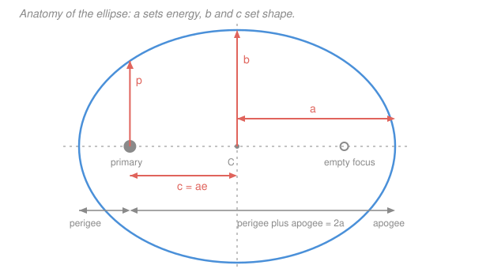

# Astrodynamics · Lesson 1.5: Kepler's laws & orbital period

> ⏱ ~15 min · Module 1: The two-body problem & orbits · Builds on: [1.3](01-03-orbit-equation-conic-sections.md), [1.4](01-04-energy-vis-viva-orbit-types.md) · Unlocks: 2.1 (the classical orbital elements)

## Why this matters

Kepler's three laws were the empirical bedrock Newton built on. Having derived the first two from $\ddot{\mathbf r} = -\mu\mathbf r/r^3$, we close the circle here with the third — and in doing so we get the orbital **period**, the number that turns geometry into a schedule.

Period is where astrodynamics starts paying rent. It's why geostationary orbit sits at exactly 42,164 km and nowhere else; why GPS satellites orbit twice a day; why a Molniya orbit repeats its ground track. And the period is the gateway to Module 2's central question: not just *what shape* is the orbit, but *where is the spacecraft right now*.

## The idea

We know the radius vector sweeps area at the constant rate $h/2$ ([1.2](01-02-angular-momentum-keplers-second-law.md)). So the time to complete one lap is just the total area of the ellipse divided by that rate. Two facts you already have — the area of an ellipse and the value of $h$ — combine into the period in two lines, and the $\mu$'s and $e$'s conspire to cancel, leaving

$$T \propto a^{3/2}.$$

The remarkable part is what *drops out*. Eccentricity vanishes completely. A circular orbit and a wildly elongated one with the same semi-major axis take **exactly the same time** to go around. That is deeply non-obvious: the elongated orbit travels a longer path, but it spends that extra distance loafing near apogee at low speed, and the two effects cancel perfectly. Only the inverse-square law does this.

The other useful idea here is the **mean motion** $n$: the *average* angular rate, $2\pi/T$. The real angular rate $\dot\theta$ swings wildly over an eccentric orbit — fast at perigee, slow at apogee — but $n$ is a clean constant, and Module 2 builds its whole time-of-flight machinery on the gap between the two.

## The formal version

**Kepler's three laws, as derived facts.**

1. **Law of ellipses.** Each planet moves on an ellipse with the Sun at one focus. *Derived in [1.3](01-03-orbit-equation-conic-sections.md)*, and strengthened: the orbit is a conic, of which the ellipse is the bound case.
2. **Law of equal areas.** The radius vector sweeps equal areas in equal times. *Derived in [1.2](01-02-angular-momentum-keplers-second-law.md)*, from centrality alone.
3. **Harmonic law.** The square of the period is proportional to the cube of the semi-major axis. *Derived now.*

**Deriving the period.** The area of an ellipse with semi-axes $a$ and $b$ is $A = \pi ab$. Since $dA/dt = h/2$ is constant, one full lap takes

$$T = \frac{A}{dA/dt} = \frac{\pi ab}{h/2} = \frac{2\pi ab}{h}.$$

Now substitute the two ellipse identities from [1.3](01-03-orbit-equation-conic-sections.md), $b = a\sqrt{1-e^2}$ and $h = \sqrt{\mu a(1-e^2)}$:

$$T = \frac{2\pi\, a\cdot a\sqrt{1-e^2}}{\sqrt{\mu a (1-e^2)}} = \frac{2\pi a^2\sqrt{1-e^2}}{\sqrt{\mu a}\sqrt{1-e^2}} = \frac{2\pi a^2}{\sqrt{\mu a}},$$

$$\boxed{\;T = 2\pi\sqrt{\frac{a^3}{\mu}}, \qquad T^2 = \frac{4\pi^2}{\mu}a^3.\;}$$

*In words: the period depends on the orbit's size and the primary's mass, and on nothing else.* Note the eccentricity cancelled identically — see [orbital period](../reference.md#orbital-period).

**Mean motion.** Define the average angular rate

$$n \equiv \frac{2\pi}{T} = \sqrt{\frac{\mu}{a^3}}, \qquad [n] = \mathrm{rad/s}.$$

*In words: if the spacecraft went around at a perfectly uniform rate, this would be that rate.* For a circular orbit $n = \dot\theta$ exactly. For an eccentric orbit $n$ is a fictitious average, and reconciling it with the true angular position is the job of Kepler's equation ([2.4](02-04-keplers-equation-eccentric-anomaly.md)).

**Ellipse anatomy — the identities you'll reuse constantly.**

| Quantity | Formula |
|---|---|
| semi-major axis | $a = (r_p + r_a)/2$ |
| eccentricity | $e = (r_a - r_p)/(r_a + r_p)$ |
| perigee / apogee radius | $r_p = a(1-e)$, $r_a = a(1+e)$ |
| focus offset | $c = ae$ |
| semi-minor axis | $b = a\sqrt{1-e^2}$ |
| semi-latus rectum | $p = a(1-e^2) = b^2/a$ |
| angular momentum | $h = \sqrt{\mu p}$ |
| energy | $\varepsilon = -\mu/2a$ |
| period | $T = 2\pi\sqrt{a^3/\mu}$ |

**Kepler's third law across systems.** For two objects orbiting the *same* primary, $\mu$ cancels in the ratio:

$$\left(\frac{T_1}{T_2}\right)^2 = \left(\frac{a_1}{a_2}\right)^3.$$

With $T$ in years and $a$ in astronomical units around the Sun, this reads simply $T^2 = a^3$. That's Kepler's original 1619 statement, and it is a *scaling law* — it never needed $\mu$, which is why Kepler could find it without knowing the Sun's mass.

Turned around, it's how masses are weighed. Observe a moon's $a$ and $T$ and you get $\mu = 4\pi^2 a^3/T^2$ for the planet, to the precision of your clock and your ruler. Every planetary $\mu$ in the table in [1.1](01-01-relative-two-body-problem.md) was measured this way.

## Picture

## Worked examples

**Example 1 (mechanical — the ISS).** The ISS orbits at an average altitude of 400 km, so $a \approx 6378 + 400 = 6778$ km (near-circular). Then

$$T = 2\pi\sqrt{\frac{6778^3}{398{,}600}} = 2\pi\sqrt{\frac{3.113\times10^{11}}{398{,}600}} = 2\pi\sqrt{7.810\times10^{5}} = 2\pi(883.7) = 5553\ \mathrm{s},$$

which is $92.5$ minutes — about **15.6 orbits per day**, matching the real value. Mean motion:

$$n = \frac{2\pi}{5553} = 1.131\times10^{-3}\ \mathrm{rad/s} = 0.0648\ \mathrm{deg/s}.$$

**Example 2 (why you'd care — deriving geostationary orbit).** A geostationary satellite must have a period equal to one **sidereal day**, the Earth's true rotation period relative to the stars: $T = 86{,}164$ s (not 86,400 — the four-minute difference is Earth's orbital motion around the Sun, and ignoring it would drift the satellite about one degree of longitude per day). Invert the period formula:

$$a = \left(\frac{\mu T^2}{4\pi^2}\right)^{1/3} = \left(\frac{398{,}600\times(86{,}164)^2}{39.478}\right)^{1/3} = \left(7.4964\times10^{13}\right)^{1/3} = 42{,}164\ \mathrm{km}.$$

Altitude $42{,}164 - 6378 = 35{,}786$ km. Its speed there is $v = \sqrt{\mu/a} = \sqrt{398{,}600/42{,}164} = 3.075$ km/s.

**Why there is only one such orbit.** The period fixes $a$, and to hang motionless over a fixed point the orbit must also be *circular* (otherwise the satellite would run ahead near perigee and lag near apogee, tracing a figure-eight) and *equatorial* (otherwise it would swing north and south). Three conditions, one orbit — which is why geostationary slots are a scarce, internationally regulated resource, and why non-equatorial geosynchronous orbits trace the analemma-like figure-eights you see in ground-track plots.

## Watch out

- **You might think an eccentric orbit takes longer than a circle of the same $a$.** It doesn't — the periods are identical, because $e$ cancels. What differs is *where* the time is spent: on an $e = 0.7$ ellipse, over 80 percent of the period is spent in the outer half of the orbit.
- **You might use the solar day for a geostationary orbit.** Use the *sidereal* day, 86,164 s. The 236-second error would put the satellite about 45 km off station and drifting.
- **You might apply $T = 2\pi\sqrt{a^3/\mu}$ to a hyperbola.** There is no period; with $a<0$ you'd be taking the square root of a negative number, which is the formula telling you the orbit never repeats.
- **You might confuse mean motion $n$ with the actual angular rate.** They coincide only for a circle. On an eccentric orbit $\dot\theta$ at perigee exceeds $n$ by a factor of $(1+e)^2/(1-e^2)^{3/2}$, which for $e=0.5$ is about 2.6.

## One-liner

> Total area divided by the constant sweep rate gives $T = 2\pi\sqrt{a^3/\mu}$: the period is set by orbit size alone, and eccentricity cancels exactly.

## Problems

**P1 (🟢)** A satellite is in a circular orbit of radius 12,000 km about Earth. Find its period in minutes and its mean motion in degrees per second.

**P2 (🟡)** A GPS satellite has a period of exactly half a sidereal day (43,082 s). Find its semi-major axis and its altitude above Earth's surface.

**P3 (🔴)** Mars's moon Phobos orbits at $a = 9376$ km with a period of 7 h 39.2 min. Use this to determine Mars's gravitational parameter $\mu_{\rm Mars}$, and compare with the tabulated $42{,}828\ \mathrm{km^3/s^2}$.

Solutions

**P1**

$$T = 2\pi\sqrt{\frac{12{,}000^3}{398{,}600}} = 2\pi\sqrt{\frac{1.728\times10^{12}}{398{,}600}} = 2\pi\sqrt{4.335\times10^{6}} = 2\pi(2082.1) = 13{,}081\ \mathrm{s} = 218.0\ \mathrm{min}.$$

$$n = \frac{360^\circ}{13{,}081\ \mathrm s} = 0.02752\ \mathrm{deg/s}.$$

*Check.* Scaling from the ISS in Example 1: $(12{,}000/6778)^{3/2} = (1.7704)^{1.5} = 2.356$, and $92.5\times2.356 = 218$ min ✓.

**P2** Invert the period formula:

$$a = \left(\frac{\mu T^2}{4\pi^2}\right)^{1/3} = \left(\frac{398{,}600 \times (43{,}082)^2}{39.478}\right)^{1/3} = \left(\frac{398{,}600\times1.8561\times10^9}{39.478}\right)^{1/3}$$

$$= \left(1.8740\times10^{13}\right)^{1/3} = 26{,}562\ \mathrm{km}.$$

Altitude $= 26{,}562 - 6378 = 20{,}184$ km.

*Check.* Kepler's third law against geostationary: half the period means $a$ smaller by $2^{-2/3} = 0.6300$, and $42{,}164\times0.6300 = 26{,}563$ ✓. This matches the published GPS altitude of about 20,200 km.

**P3** Convert the period: $7\ \mathrm{h}\ 39.2\ \mathrm{min} = 7(3600) + 39.2(60) = 25{,}200 + 2352 = 27{,}552$ s. Then

$$\mu = \frac{4\pi^2 a^3}{T^2} = \frac{39.478 \times (9376)^3}{(27{,}552)^2} = \frac{39.478 \times 8.2408\times10^{11}}{7.5911\times10^{8}} = \frac{3.2533\times10^{13}}{7.5911\times10^{8}} = 42{,}857\ \mathrm{km^3/s^2}.$$

Against the tabulated $42{,}828$, that is an error of $29/42{,}828 = 0.07$ percent — well within the rounding of the inputs (the period was given to four figures).

*Check on the method.* This is exactly how planetary masses are measured: you never weigh a planet, you time one of its moons. Note that the result is really $G(M_{\rm Mars} + M_{\rm Phobos})$, but Phobos is $10^{-8}$ of Mars's mass, so the correction is far below the input precision ✓.

## Flashback

**From Lesson 1.3 (The orbit equation & conic sections):** An orbit about Earth has $p = 11{,}000$ km and $e = 0.25$. Find the radius at a true anomaly of $\theta = 60^\circ$, and the apogee radius.

Solution

Straight from the orbit equation:

$$r(60^\circ) = \frac{p}{1+e\cos 60^\circ} = \frac{11{,}000}{1 + 0.25(0.5)} = \frac{11{,}000}{1.125} = 9778\ \mathrm{km}.$$

$$r_a = \frac{p}{1-e} = \frac{11{,}000}{0.75} = 14{,}667\ \mathrm{km}.$$

*Check.* Perigee is $11{,}000/1.25 = 8800$ km, and $9778$ lies between perigee and apogee ✓. As a bonus consistency check with this lesson: $a = (8800+14{,}667)/2 = 11{,}734$ km, and $a(1-e^2) = 11{,}734(0.9375) = 11{,}001 = p$ ✓.

## Connections

- **Backward:** the derivation is [1.2](01-02-angular-momentum-keplers-second-law.md)'s constant areal velocity applied to the whole ellipse, using [1.3](01-03-orbit-equation-conic-sections.md)'s geometry identities. The cancellation of $e$ is the geometric twin of [1.4](01-04-energy-vis-viva-orbit-types.md)'s finding that energy depends only on $a$.
- **Forward:** $n$ and $T$ are the inputs to Kepler's equation in [2.4](02-04-keplers-equation-eccentric-anomaly.md), which finally answers "where is it at time $t$". Transfer times in [3.2](03-02-hohmann-transfers.md) are half-periods of a transfer ellipse, computed with this formula.
- **Sideways (astrophysics):** the mass-weighing use in P3 scaled up is how galaxy rotation curves revealed dark matter — orbital speeds far from a galaxy's center imply far more enclosed mass than the visible stars provide. See [`astrophysics` 5.3](../../astrophysics/lessons/05-03-galaxies-dark-matter.md).
