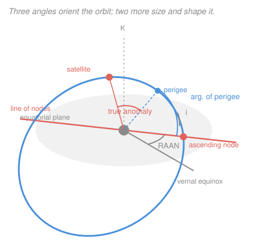

# Astrodynamics · Lesson 2.1: The classical orbital elements

> ⏱ ~15 min · Module 2: Orbit determination & time-of-flight · Builds on: [1.3](01-03-orbit-equation-conic-sections.md), [1.5](01-05-keplers-laws-orbital-period.md) · Unlocks: 2.2 (the orbit in three dimensions)

## Why this matters

A state vector $(\mathbf r, \mathbf v)$ tells you everything about an orbit — but it tells you *nothing at a glance*. Hand someone six numbers in km and km/s and they cannot say whether the orbit is circular, polar, or about to hit the ground. Worse, all six change every second.

The classical orbital elements are the same six numbers rearranged so that **five of them are constants** and only one keeps time. Read them and the orbit is immediately legible: this one is a 700-km sun-synchronous polar orbit, that one is a geostationary slot at 100 degrees west. Every catalog on Earth — including the two-line element sets that track the 30,000-odd objects in orbit — is written in this language.

## The idea

Think of specifying an orbit as a three-stage job.

**Stage one: draw the ellipse.** You need two numbers to fix a conic's size and shape: the semi-major axis $a$ (how big) and the eccentricity $e$ (how squashed). Now you have an orbit drawn on a flat piece of paper.

**Stage two: rig the paper in space.** Orienting a rigid object in three dimensions always takes three angles — the same three Euler angles you'd use to aim a telescope. Here they're chosen to be physically meaningful. First, **tilt the plane**: how steeply is it inclined to the equator? Second, **swivel the plane** about the polar axis: where does the orbit cross the equator going north? Third, **spin the ellipse within its own plane**: which way does perigee point?

**Stage three: put the spacecraft on it.** One more angle says how far around the ellipse it has gotten. This is the only element that changes with time (in the ideal two-body world), and it's the only one that requires a clock.

Two plus three plus one is six — the same count as three position components plus three velocity components. No information is created or lost; it's the same orbit in a coordinate system built for humans instead of for integrators.

## The formal version

We work in a **geocentric equatorial inertial frame** (ECI): origin at Earth's center, $\hat{\mathbf I}$ pointing at the **vernal equinox** (the direction from Earth to the Sun at the March equinox — a fixed direction in space, not rotating with Earth), $\hat{\mathbf K}$ along the north pole, and $\hat{\mathbf J} = \hat{\mathbf K}\times\hat{\mathbf I}$ completing the right-handed set.

**The six elements.**

| Element | Symbol | Range | What it controls |
|---|---|---|---|
| Semi-major axis | $a$ | $>0$ (bound) | **size** — hence energy and period |
| Eccentricity | $e$ | $0\le e$ | **shape** — circle through hyperbola |
| Inclination | $i$ | $0^\circ$ to $180^\circ$ | **tilt** of the orbit plane from the equator |
| Right ascension of the ascending node | $\Omega$ | $0^\circ$ to $360^\circ$ | **swivel** — where the orbit crosses the equator northbound |
| Argument of perigee | $\omega$ | $0^\circ$ to $360^\circ$ | **spin within the plane** — where perigee sits |
| True anomaly | $\theta$ | $0^\circ$ to $360^\circ$ | **where the spacecraft is** right now |

Only $\theta$ varies with time in the two-body problem; the other five are constants of the motion. (Sometimes $a$ is replaced by $h$ or $p$; sometimes $\theta$ by the mean anomaly $M$ of [2.4](02-04-keplers-equation-eccentric-anomaly.md). Same information.)

**Inclination**, precisely: the angle between $\hat{\mathbf K}$ and the angular momentum vector $\mathbf h$,

$$i = \arccos\!\left(\frac{h_z}{h}\right), \qquad 0^\circ \le i \le 180^\circ.$$

*In words: how far the orbit's axis is tipped from the north pole.* Because $\arccos$ returns a value in $[0^\circ,180^\circ]$ there is no quadrant ambiguity — inclination is the one angle you never have to disambiguate. Useful landmarks:

- $i = 0^\circ$: **equatorial prograde** (moves the same way Earth spins).
- $i = 90^\circ$: **polar** — passes over both poles; the ground track eventually covers the whole planet.
- $i = 180^\circ$: **equatorial retrograde**.
- $i > 90^\circ$: **retrograde**, meaning $h_z<0$ and the satellite circles opposite to Earth's rotation. Sun-synchronous orbits live near $i \approx 98^\circ$ ([4.4](04-04-perturbations-j2-drag.md)).

Launch cost note: a launch site at latitude $\phi$ can reach $i \ge \phi$ directly. Cape Canaveral at $28.5^\circ$ N is why so many US orbits are inclined exactly $28.5^\circ$ — it's the cheapest inclination available there.

**The node line and $\Omega$.** The orbit plane and the equatorial plane intersect in a line, the **line of nodes**. Its direction is given by the **node vector**

$$\mathbf n = \hat{\mathbf K}\times\mathbf h,$$

which points toward the **ascending node** — the crossing where the satellite passes from south to north. Then

$$\Omega = \arccos\!\left(\frac{n_x}{n}\right), \quad\text{with}\quad \Omega = 360^\circ - \arccos\!\left(\frac{n_x}{n}\right) \ \text{if}\ n_y < 0.$$

*In words: the angle, measured eastward in the equatorial plane from the vernal equinox, to the point where the orbit crosses the equator going north.* The quadrant check on $n_y$ is mandatory — $\arccos$ alone can't tell east from west.

**Argument of perigee $\omega$.** The angle from the ascending node to perigee, measured **in the orbit plane** in the direction of motion:

$$\omega = \arccos\!\left(\frac{\mathbf n\cdot\mathbf e}{ne}\right), \quad\text{with}\quad \omega = 360^\circ - \arccos(\cdots) \ \text{if}\ e_z<0.$$

*In words: once the plane is fixed, this says which way the long axis of the ellipse points.* The quadrant check is $e_z<0$, i.e. perigee below the equator.

**True anomaly $\theta$.** As in [1.3](01-03-orbit-equation-conic-sections.md), the angle from perigee to the spacecraft:

$$\theta = \arccos\!\left(\frac{\mathbf e\cdot\mathbf r}{er}\right), \quad\text{with}\quad \theta = 360^\circ - \arccos(\cdots) \ \text{if}\ \mathbf r\cdot\mathbf v < 0.$$

*In words: how far past perigee the spacecraft has travelled.* The check $\mathbf r\cdot\mathbf v<0$ means falling, i.e. past apogee.

**Degenerate cases — where elements break.** The elements are ill-defined exactly where the geometry they name disappears:

- $e = 0$ (circular): perigee has no direction, so $\omega$ and $\theta$ are undefined. Fix: use the **argument of latitude** $u = \omega + \theta$, the angle from the ascending node to the spacecraft, which stays well defined.
- $i = 0$ (equatorial): the planes coincide, so there is no node line and $\Omega$ is undefined. Fix: use the **longitude of perigee** $\varpi = \Omega + \omega$.
- Both at once (circular equatorial): use the **true longitude** $\ell = \Omega + \omega + \theta$.

These aren't pathologies you can wave away — geostationary satellites are *deliberately* circular and equatorial, so production software handles all three cases. See [degenerate orbital elements](../reference.md#degenerate-orbital-elements).

## Picture

## Worked examples

**Example 1 (mechanical — read an orbit off its elements).** A satellite has

$$a = 26{,}600\ \mathrm{km}, \quad e = 0.001, \quad i = 55^\circ, \quad \Omega = 120^\circ, \quad \omega = 0^\circ, \quad \theta = 40^\circ.$$

Reading it: $a = 26{,}600$ km gives a period $T = 2\pi\sqrt{26{,}600^3/398{,}600} = 43{,}166$ s $= 11.99$ h — half a sidereal day. Nearly zero eccentricity means circular. Inclination $55^\circ$ is prograde and mid-latitude. **This is a GPS satellite** — that trio ($a\approx26{,}600$ km, $e\approx0$, $i = 55^\circ$) is the GPS signature, and $\Omega = 120^\circ$ identifies which of the six orbital planes it occupies. With $e$ so small, $\omega = 0^\circ$ is essentially arbitrary and only $u = \omega+\theta = 40^\circ$ is physically meaningful.

**Example 2 (why you'd care — inclination and coverage).** Compare $i = 28.5^\circ$ (a direct launch from Cape Canaveral) and $i = 51.6^\circ$ (the ISS).

A satellite's ground track oscillates between latitudes $\pm i$ for prograde orbits. So the Cape Canaveral orbit never passes over anything north of $28.5^\circ$ N — it misses all of Europe, most of the United States, and all of Canada. The ISS at $51.6^\circ$ reaches over London and Calgary, which is why its inclination was chosen: it must be reachable from **Baikonur at $45.6^\circ$ N**, and $51.6^\circ$ additionally lets the spent stages drop clear of populated areas.

Now the cost of changing your mind later. As [3.4](03-04-plane-changes-combined-maneuvers.md) will show, changing inclination by $\Delta i$ in a circular orbit of speed $v$ costs

$$\Delta v = 2v\sin\frac{\Delta i}{2}.$$

Going from $28.5^\circ$ to $51.6^\circ$ in LEO ($v \approx 7.7$ km/s) costs $2(7.7)\sin(11.55^\circ) = 3.08$ km/s — nearly as much as escaping Earth entirely ([1.4](01-04-energy-vis-viva-orbit-types.md), Example 2). **Inclination is chosen at launch because it is ruinously expensive to change afterwards.**

## Watch out

- **You might skip the quadrant checks.** $\arccos$ only ever returns $0^\circ$ to $180^\circ$, so half of every angle's range is unreachable without the sign test. Forgetting the $\mathbf r\cdot\mathbf v<0$ check on $\theta$ silently mirrors the spacecraft to the other side of the apse line — a common and very confusing bug.
- **You might read $i>90^\circ$ as an error.** It's a retrograde orbit, and it is both legal and useful; every sun-synchronous Earth-observation satellite has one.
- **You might think all six elements are constants.** Five are — in the ideal two-body problem. $\theta$ always moves, and once you add perturbations ([4.4](04-04-perturbations-j2-drag.md)) $\Omega$ and $\omega$ drift too. "Constant" here means "constant under $\ddot{\mathbf r} = -\mu\mathbf r/r^3$", nothing stronger.
- **You might confuse $\Omega$ with longitude.** $\Omega$ is measured from the vernal equinox in an **inertial** frame; longitude is measured from Greenwich in a **rotating** frame. They differ by Earth's rotation angle, which changes by $360^\circ$ per sidereal day.

## One-liner

> Two elements draw the conic, three Euler angles rig it in space, and one puts the spacecraft on it — the same six numbers as a state vector, arranged so five of them hold still.

## Problems

**P1 (🟢)** A satellite has $h_z = -32{,}000\ \mathrm{km^2/s}$ and $h = 64{,}000\ \mathrm{km^2/s}$. Find its inclination and state whether the orbit is prograde or retrograde.

**P2 (🟡)** An orbit has $\mathbf h = (0, -12{,}000, 20{,}784)\ \mathrm{km^2/s}$. Find the node vector $\mathbf n$, the inclination, and the right ascension of the ascending node.

**P3 (🔴)** A geostationary satellite is circular and equatorial. Explain precisely which classical elements become undefined, name the replacement elements, and describe what physical information is preserved even though $\Omega$, $\omega$, and $\theta$ individually are meaningless.

Solutions

**P1**

$$i = \arccos\!\left(\frac{h_z}{h}\right) = \arccos\!\left(\frac{-32{,}000}{64{,}000}\right) = \arccos(-0.5) = 120^\circ.$$

Since $i > 90^\circ$ the orbit is **retrograde** — it circles opposite to Earth's rotation.

*Check.* Equivalently, $h_z<0$ means the angular momentum has a southward component, so by the right-hand rule the motion is westward ✓.

**P2** The node vector is

$$\mathbf n = \hat{\mathbf K}\times\mathbf h = (0,0,1)\times(0,-12{,}000,20{,}784) = (0\cdot 20784 - 1\cdot(-12000),\; 1\cdot 0 - 0\cdot 20784,\; 0)$$
$$= (12{,}000,\;0,\;0)\ \mathrm{km^2/s}.$$

Magnitude $h = \sqrt{0 + 12{,}000^2 + 20{,}784^2} = \sqrt{1.44\times10^8 + 4.3197\times10^8} = \sqrt{5.7597\times10^8} = 24{,}000\ \mathrm{km^2/s}$, so

$$i = \arccos\!\left(\frac{20{,}784}{24{,}000}\right) = \arccos(0.8660) = 30^\circ.$$

For the node, $n = 12{,}000$ and $n_x/n = 1$, so $\arccos(1) = 0^\circ$; the check $n_y < 0$ fails ($n_y = 0$), so

$$\Omega = 0^\circ.$$

*Check.* $\Omega = 0$ means the ascending node lies exactly along the vernal equinox direction $\hat{\mathbf I}$ — consistent with $\mathbf n$ pointing along $+x$ ✓. And a general sanity rule: $\mathbf n$ always lies in the equatorial plane ($n_z = 0$), which it does ✓.

**P3** With $e = 0$, the eccentricity vector is $\mathbf 0$: perigee has no direction, so **$\omega$ is undefined**, and since $\theta$ is measured *from* perigee, **$\theta$ is undefined** too. With $i = 0$, the orbit plane coincides with the equatorial plane, so the two planes share no unique intersection line: $\mathbf n = \hat{\mathbf K}\times\mathbf h = \mathbf 0$ and **$\Omega$ is undefined**.

Replacements: use the **true longitude**

$$\ell = \Omega + \omega + \theta,$$

which is well defined as the angle in the equatorial plane from the vernal equinox to the spacecraft, even though each of its three terms individually is not. (For circular but inclined orbits, the argument of latitude $u = \omega+\theta$; for elliptical but equatorial orbits, the longitude of perigee $\varpi = \Omega+\omega$.)

**What survives:** the *sums* are physical because they describe the position of things that actually exist — the spacecraft, and the long axis of the ellipse — measured from a reference direction that also actually exists. What's lost is only the intermediate bookkeeping: the split of that total angle into "up to the node, then up to perigee, then up to the spacecraft" requires a node and a perigee to split at. For a geostationary satellite, $\ell$ is exactly what operators care about: it's the satellite's longitude slot, offset by Earth's rotation angle.

## Flashback

**From Lesson 1.4 (Energy, vis-viva & orbit types):** A GPS satellite is in a circular orbit of radius 26,600 km about Earth. Find its orbital speed and its specific energy.

Solution

Circular, so $a = r$ and vis-viva reduces to $v = \sqrt{\mu/r}$:

$$v = \sqrt{\frac{398{,}600}{26{,}600}} = \sqrt{14.985} = 3.871\ \mathrm{km/s}.$$

$$\varepsilon = -\frac{\mu}{2a} = -\frac{398{,}600}{53{,}200} = -7.492\ \mathrm{km^2/s^2}.$$

*Check.* For any circular orbit $\varepsilon = -v^2/2$: $-(3.871)^2/2 = -7.492$ ✓ — a handy identity worth remembering. Also, GPS is slower than the ISS (7.67 km/s) even though it is much higher, exactly the "slower is higher" point from [1.4](01-04-energy-vis-viva-orbit-types.md) ✓.

## Connections

- **Backward:** $a$ and $e$ come straight from [1.3](01-03-orbit-equation-conic-sections.md) and [1.5](01-05-keplers-laws-orbital-period.md); the three angles are built from the two conserved vectors $\mathbf h$ ([1.2](01-02-angular-momentum-keplers-second-law.md)) and $\mathbf e$ ([1.3](01-03-orbit-equation-conic-sections.md)).
- **Forward:** [2.2](02-02-orbit-in-three-dimensions.md) shows the three angles are a 3-1-3 Euler rotation and uses them to place the orbit in ECI coordinates; [2.3](02-03-state-vectors-and-elements.md) turns the formulas above into a working algorithm in both directions.
- **Sideways (rigid-body mechanics):** $\Omega$, $i$, $\omega$ are exactly the Euler angles used to orient a spinning top, in exactly the 3-1-3 convention — see [`analytical-mechanics` 4.4](../../analytical-mechanics/lessons/04-04-rigid-body-dynamics.md). Astrodynamics renamed them, but the rotation algebra is identical.
