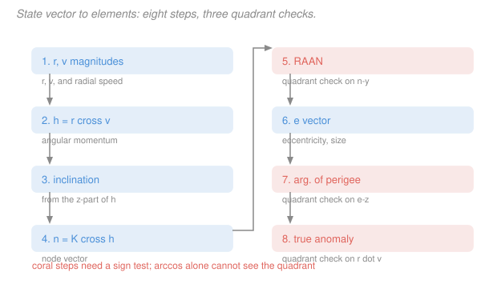

# Astrodynamics · Lesson 2.3: State vectors ↔ orbital elements

> ⏱ ~15 min · Module 2: Orbit determination & time-of-flight · Builds on: [2.1](02-01-classical-orbital-elements.md), [2.2](02-02-orbit-in-three-dimensions.md) · Unlocks: 2.4 (Kepler's equation)

## Why this matters

This is the most-executed algorithm in astrodynamics. A radar site measures a position and a velocity; the catalog stores elements; the propagator wants elements; the antenna-pointing computer wants a position vector again. Every one of those handoffs runs this conversion, and space-surveillance systems run it millions of times a day.

It's also the lesson where the abstractions of Module 1 become a procedure you can execute. Nothing new is derived here — every formula was established in [1.2](01-02-angular-momentum-keplers-second-law.md) through [2.2](02-02-orbit-in-three-dimensions.md). What's new is the *order*, and the discipline of the quadrant checks.

## The idea

Going from $(\mathbf r, \mathbf v)$ to elements is a matter of building the two conserved vectors and reading angles off them.

$\mathbf h = \mathbf r\times\mathbf v$ points along the orbit's axis, so its tilt from the pole gives the **inclination**. Crossing the pole into $\mathbf h$ gives a vector lying in the equator pointing at the ascending node, so its angle from the vernal equinox gives the **RAAN**. The eccentricity vector $\mathbf e$ points at perigee, so its angle from the node gives the **argument of perigee**, and its angle from the current position gives the **true anomaly**. Its length is the eccentricity, and the energy gives the semi-major axis. Six numbers, six readings.

The one thing that will bite you is that all four angles are extracted with $\arccos$, which returns only $0^\circ$ to $180^\circ$. Half of every angle's range is invisible to it. So each angle needs a companion sign test to decide whether the answer is $\alpha$ or $360^\circ - \alpha$. The tests are not arbitrary: each asks "is the thing I'm measuring toward on the near side or the far side?" — is the node east or west, is perigee north or south of the equator, is the spacecraft climbing or falling.

The reverse direction is [2.2](02-02-orbit-in-three-dimensions.md)'s recipe verbatim: build the state in the perifocal frame, rotate to inertial. That direction has no ambiguities at all, because you're going from angles to vectors rather than the other way. **Forward is easy; backward needs care.** That asymmetry is worth internalizing.

## The formal version

### Algorithm A: state vector to elements

Given $\mathbf r$ (km), $\mathbf v$ (km/s), and $\mu$:

1. **Magnitudes and radial speed.**
$$r = \|\mathbf r\|, \qquad v = \|\mathbf v\|, \qquad v_r = \frac{\mathbf r\cdot\mathbf v}{r}.$$
The sign of $v_r$ says whether the spacecraft is climbing ($v_r>0$) or falling.

2. **Angular momentum.** $\mathbf h = \mathbf r\times\mathbf v$, $\;h = \|\mathbf h\|$.

3. **Inclination.** $\;i = \arccos(h_z/h)$. *No quadrant check* — $i$ lives in $[0^\circ,180^\circ]$ by definition.

4. **Node vector.** $\mathbf n = \hat{\mathbf K}\times\mathbf h = (-h_y,\,h_x,\,0)$, $\;n = \|\mathbf n\|$.

5. **RAAN.**
$$\Omega = \begin{cases}\arccos(n_x/n) & n_y \ge 0\\ 360^\circ - \arccos(n_x/n) & n_y < 0.\end{cases}$$

6. **Eccentricity vector and eccentricity.**
$$\mathbf e = \frac{1}{\mu}\left[\left(v^2-\frac{\mu}{r}\right)\mathbf r - r v_r\,\mathbf v\right], \qquad e = \|\mathbf e\|.$$
(Note $\mathbf r\cdot\mathbf v = rv_r$, which is why the second term takes that form.)

7. **Argument of perigee.**
$$\omega = \begin{cases}\arccos\!\big(\tfrac{\mathbf n\cdot\mathbf e}{ne}\big) & e_z \ge 0\\ 360^\circ - \arccos\!\big(\tfrac{\mathbf n\cdot\mathbf e}{ne}\big) & e_z < 0.\end{cases}$$

8. **True anomaly.**
$$\theta = \begin{cases}\arccos\!\big(\tfrac{\mathbf e\cdot\mathbf r}{er}\big) & v_r \ge 0\\ 360^\circ - \arccos\!\big(\tfrac{\mathbf e\cdot\mathbf r}{er}\big) & v_r < 0.\end{cases}$$

9. **Size.** $\;a = \left(\dfrac{2}{r} - \dfrac{v^2}{\mu}\right)^{-1}$, equivalently $a = -\mu/2\varepsilon$ or $a = \dfrac{h^2/\mu}{1-e^2}$.

*Why each quadrant test is what it is:* $n_y<0$ means the node is in the western half of the equatorial plane, so $\Omega$ exceeds $180^\circ$. $e_z<0$ means perigee is below the equator, so it lies in the second half-turn past the ascending node. $v_r<0$ means falling, so the spacecraft is past apogee, so $\theta>180^\circ$.

### Algorithm B: elements to state vector

Given $(a, e, i, \Omega, \omega, \theta)$: compute $p = a(1-e^2)$, $h = \sqrt{\mu p}$, $r = p/(1+e\cos\theta)$, build

$$\mathbf r_{\rm pf} = r\begin{pmatrix}\cos\theta\\ \sin\theta\\ 0\end{pmatrix}, \qquad \mathbf v_{\rm pf} = \frac{\mu}{h}\begin{pmatrix}-\sin\theta\\ e+\cos\theta\\ 0\end{pmatrix},$$

and rotate with $[Q]_{x\to X} = \big(R_3(\omega)R_1(i)R_3(\Omega)\big)^{\mathsf T}$ from [2.2](02-02-orbit-in-three-dimensions.md). See [state vector conversion](../reference.md#state-vector-conversion).

## Picture

## Worked examples

**Example 1 (mechanical — run Algorithm A).** Given, about Earth,

$$\mathbf r = (-6045,\,-3490,\,2500)\ \mathrm{km}, \qquad \mathbf v = (-3.457,\,6.618,\,2.533)\ \mathrm{km/s}.$$

**Step 1.** $r = \sqrt{6045^2+3490^2+2500^2} = 7414\ \mathrm{km}$; $v = \sqrt{3.457^2+6.618^2+2.533^2} = 7.884\ \mathrm{km/s}$;
$\mathbf r\cdot\mathbf v = (-6045)(-3.457) + (-3490)(6.618) + (2500)(2.533) = 20{,}898 - 23{,}097 + 6333 = 4134$, so $v_r = 4134/7414 = +0.558$ km/s — **climbing**.

**Step 2.** $\mathbf h = \mathbf r\times\mathbf v = (-25{,}385,\; 6669.5,\; -52{,}071)\ \mathrm{km^2/s}$, so $h = 58{,}312\ \mathrm{km^2/s}$.

**Step 3.** $i = \arccos(-52{,}071/58{,}312) = \arccos(-0.8929) = 153.25^\circ$ — **retrograde**.

**Step 4.** $\mathbf n = (-h_y, h_x, 0) = (-6669.5,\; -25{,}385,\; 0)$, $n = 26{,}247$.

**Step 5.** $\arccos(-6669.5/26{,}247) = \arccos(-0.2541) = 104.72^\circ$. But $n_y = -25{,}385 < 0$, so
$$\Omega = 360^\circ - 104.72^\circ = 255.28^\circ.$$

**Step 6.** $v^2 - \mu/r = 62.16 - 53.76 = 8.40$, and $rv_r = 4134$:
$$\mathbf e = \frac{1}{398{,}600}\big[8.40\,(-6045,-3490,2500) - 4134\,(-3.457,6.618,2.533)\big] = (-0.0916,\,-0.1422,\,0.0264),$$
$$e = 0.1712.$$

**Step 7.** $\mathbf n\cdot\mathbf e = (-6669.5)(-0.0916) + (-25{,}385)(-0.1422) = 611 + 3610 = 4221$, so $\arccos\!\big(4221/(26{,}247\times0.1712)\big) = \arccos(0.9394) = 20.07^\circ$. Since $e_z = +0.0264 \ge 0$, $\;\omega = 20.07^\circ$.

**Step 8.** $\mathbf e\cdot\mathbf r = (-0.0916)(-6045)+(-0.1422)(-3490)+(0.0264)(2500) = 553.8 + 496.3 + 66.1 = 1116$, so $\arccos\!\big(1116/(0.1712\times7414)\big) = \arccos(0.8794) = 28.45^\circ$. Since $v_r > 0$, $\;\theta = 28.45^\circ$.

**Step 9.** $a = (2/7414 - 62.16/398{,}600)^{-1} = (2.6975\times10^{-4} - 1.5594\times10^{-4})^{-1} = 8788\ \mathrm{km}$.

*Summary:* $a = 8788$ km, $e = 0.171$, $i = 153.3^\circ$, $\Omega = 255.3^\circ$, $\omega = 20.1^\circ$, $\theta = 28.5^\circ$. Perigee radius $a(1-e) = 7283$ km (905 km altitude), apogee $10{,}293$ km, period $2\pi\sqrt{a^3/\mu} = 8199$ s $= 2.28$ h.

*Check.* $h = \sqrt{\mu a(1-e^2)} = \sqrt{398{,}600\times8788\times0.9707} = 58{,}313$ ✓ matches Step 2.

**Example 2 (why you'd care — the round trip must close).** Run Algorithm B on the elements just found: $p = 8788(1-0.02931) = 8530$ km, $h = \sqrt{398{,}600\times8530} = 58{,}312\ \mathrm{km^2/s}$, $r = 8530/(1+0.1712\cos 28.45^\circ) = 7414$ km ✓ — the radius comes back exactly.

Then $\mathbf r_{\rm pf} = 7414(0.8794, 0.4762, 0) = (6520,\,3531,\,0)$ km, and after the rotation with $i = 153.25^\circ$, $\Omega = 255.28^\circ$, $\omega = 20.07^\circ$ you recover $\mathbf r = (-6045,\,-3489,\,2500)$ km and $\mathbf v = (-3.456,\,6.618,\,2.533)$ km/s — the original state to four figures.

**Why this matters operationally:** the round trip is the standard unit test for any orbit library, and it catches essentially every sign and ordering bug at once. If your code loses the retrograde nature of this orbit (returning $i = 26.75^\circ$ instead of $153.25^\circ$), or puts $\Omega$ at $104.7^\circ$ instead of $255.3^\circ$, the reconstructed position lands thousands of kilometers away — an error a magnitudes-only check would never catch, since $\|\mathbf r\|$ is right in both cases.

## Watch out

- **You might use $\arccos$ without the sign test.** This is *the* bug in this lesson. It always produces a plausible-looking angle and a wrong orbit. Reconstruct the state vector and compare — it's the only check that catches it.
- **You might use $\mathbf e = \mathbf v\times\mathbf h/\mu - \mathbf r/r$ and be surprised it agrees.** It does; the form in step 6 is algebraically identical and only avoids computing $\mathbf v\times\mathbf h$.
- **You might take $\theta$ from the position alone.** The position vector doesn't know whether you're inbound or outbound: $\theta = 30^\circ$ and $\theta = 330^\circ$ have the same $r$ and the same angle to $\mathbf e$. Only $v_r$ distinguishes them.
- **Near-circular and near-equatorial orbits will blow up.** As $e\to0$ the denominator in step 7 goes to zero; as $i\to0$, $n\to0$ in step 5. Real code branches to the degenerate elements of [2.1](02-01-classical-orbital-elements.md) below a tolerance like $e < 10^{-8}$.

## One-liner

> Build $\mathbf h$ and $\mathbf e$, read four angles off them with $\arccos$, and fix each angle's quadrant with a sign test — then $[Q]$ carries you back the other way with no ambiguity at all.

## Problems

**P1 (🟢)** For $\mathbf r = (7000, 0, 0)$ km and $\mathbf v = (0, 8.0, 3.0)$ km/s, find $\mathbf h$, the inclination, and the node vector. Is the orbit prograde or retrograde?

**P2 (🟡)** For $\mathbf r = (5000, 8000, 2000)$ km and $\mathbf v = (-6.0, 2.5, 1.0)$ km/s about Earth, find $r$, $v_r$, $e$, $a$, and $\theta$. Is the spacecraft climbing or falling?

**P3 (🔴)** Show that the $\arccos$ for the true anomaly is unchanged if you replace $\theta$ by $360^\circ-\theta$, and prove that the test $v_r \ge 0$ correctly separates the two cases — i.e. show $v_r$ has the same sign as $\sin\theta$.

Solutions

**P1**

$$\mathbf h = (7000,0,0)\times(0,8,3) = (0\cdot3 - 0\cdot8,\; 0\cdot 0 - 7000\cdot 3,\; 7000\cdot 8 - 0) = (0,\,-21{,}000,\,56{,}000)\ \mathrm{km^2/s}.$$

$$h = \sqrt{21{,}000^2+56{,}000^2} = \sqrt{4.41\times10^8+3.136\times10^9} = \sqrt{3.577\times10^9} = 59{,}808\ \mathrm{km^2/s}.$$

$$i = \arccos\!\left(\frac{56{,}000}{59{,}808}\right) = \arccos(0.9363) = 20.56^\circ \;\Longrightarrow\; \textbf{prograde}.$$

$$\mathbf n = (-h_y,\,h_x,\,0) = (21{,}000,\;0,\;0).$$

*Check.* $\mathbf n$ lies in the equatorial plane ($n_z=0$) ✓ and points along $+\hat{\mathbf I}$, so $\Omega = 0^\circ$ — consistent with the position vector itself lying along $\hat{\mathbf I}$ with an upward velocity component, which puts the spacecraft right at its ascending node ✓.

**P2** Magnitudes:

$$r = \sqrt{5000^2+8000^2+2000^2} = \sqrt{2.5+6.4+0.4}\times10^{7} = \sqrt{9.3\times10^{7}} = 9644\ \mathrm{km},$$
$$v = \sqrt{36+6.25+1} = \sqrt{43.25} = 6.577\ \mathrm{km/s}.$$

$$\mathbf r\cdot\mathbf v = 5000(-6) + 8000(2.5) + 2000(1) = -30{,}000+20{,}000+2000 = -8000,$$
$$v_r = \frac{-8000}{9644} = -0.8296\ \mathrm{km/s} \;\Longrightarrow\; \textbf{falling}.$$

Semi-major axis:

$$a = \left(\frac{2}{9644} - \frac{43.25}{398{,}600}\right)^{-1} = \left(2.0738\times10^{-4} - 1.0850\times10^{-4}\right)^{-1} = \frac{1}{9.888\times10^{-5}} = 10{,}113\ \mathrm{km}.$$

Eccentricity vector, with $v^2 - \mu/r = 43.25 - 41.33 = 1.92$ and $rv_r = -8000$:

$$\mathbf e = \frac{1}{398{,}600}\big[1.92\,(5000,8000,2000) + 8000\,(-6,2.5,1)\big] = \frac{1}{398{,}600}(9600-48{,}000,\;15{,}360+20{,}000,\;3840+8000)$$
$$= \frac{1}{398{,}600}(-38{,}400,\;35{,}360,\;11{,}840) = (-0.09634,\;0.08871,\;0.02970),$$

$$e = \sqrt{0.009281+0.007869+0.000882} = \sqrt{0.018032} = 0.1343.$$

True anomaly:

$$\mathbf e\cdot\mathbf r = (-0.09634)(5000)+(0.08871)(8000)+(0.02970)(2000) = -481.7+709.7+59.4 = 287.4,$$
$$\arccos\!\left(\frac{287.4}{0.1343\times9644}\right) = \arccos(0.2219) = 77.18^\circ.$$

Since $v_r<0$, $\;\theta = 360^\circ - 77.18^\circ = 282.8^\circ$.

*Check.* $p = a(1-e^2) = 10{,}113(0.98196) = 9931$ km, and $r = p/(1+e\cos\theta) = 9931/(1+0.1343\times0.2219) = 9931/1.0298 = 9644$ ✓ recovers $r$ — the check that would have failed had the quadrant been wrong (at $\theta=77.18^\circ$ the formula gives the same $r$, since $\cos$ is even, so use a different check: at $\theta = 282.8^\circ$, $\sin\theta<0$, matching $v_r<0$ ✓).

**P3** Since $\cos$ is an even function and $\cos(360^\circ - \theta) = \cos\theta$, the expression $\arccos\!\big(\mathbf e\cdot\mathbf r/(er)\big)$ returns the same value for $\theta$ and $360^\circ-\theta$. The two cases are genuinely indistinguishable from position alone.

For the test, start from the orbit equation and differentiate. With $r = p/(1+e\cos\theta)$,

$$v_r = \dot r = \frac{d}{d\theta}\!\left(\frac{p}{1+e\cos\theta}\right)\dot\theta = \frac{p\,e\sin\theta}{(1+e\cos\theta)^2}\,\dot\theta.$$

Now $p>0$, $e>0$, and $(1+e\cos\theta)^2>0$ always; and $\dot\theta = h/r^2 > 0$ because the true anomaly increases monotonically in the direction of motion. So every factor except $\sin\theta$ is strictly positive:

$$\operatorname{sign}(v_r) = \operatorname{sign}(\sin\theta).$$

Since $\sin\theta>0$ exactly on $0<\theta<180^\circ$ and $\sin\theta<0$ exactly on $180^\circ<\theta<360^\circ$, the test $v_r\ge0$ picks the first branch and $v_r<0$ the second — precisely the quadrant resolution required. $\blacksquare$

*Check.* Physically: from perigee to apogee the radius grows ($v_r>0$, first half-turn), and from apogee back it shrinks ($v_r<0$, second half-turn) — the algebra just says the obvious thing ✓. The same identity also gives the useful formula $v_r = (\mu/h)e\sin\theta$, which matches the perifocal velocity of [2.2](02-02-orbit-in-three-dimensions.md).

## Flashback

**From Lesson 1.2 (Angular momentum & Kepler's second law):** A satellite in an elliptical orbit has $h = 72{,}000\ \mathrm{km^2/s}$. At one instant its radius is $16{,}000$ km and its speed is $4.8$ km/s. Find its flight-path angle.

Solution

Angular momentum sees only the transverse velocity component, $h = rv\cos\gamma$, so

$$\cos\gamma = \frac{h}{rv} = \frac{72{,}000}{16{,}000\times4.8} = \frac{72{,}000}{76{,}800} = 0.9375 \;\Longrightarrow\; \gamma = \pm 20.36^\circ.$$

*Check.* The sign is undetermined from this data alone — exactly the same $\pm$ ambiguity that this lesson's step 8 resolves with $v_r$. Here $|v_r| = v\sin|\gamma| = 4.8(0.3480) = 1.67$ km/s, and its sign says whether the satellite is on the outbound leg ($\gamma>0$) or the inbound leg ($\gamma<0$) ✓.

## Connections

- **Backward:** every formula here was derived earlier — $\mathbf h$ in [1.2](01-02-angular-momentum-keplers-second-law.md), $\mathbf e$ in [1.3](01-03-orbit-equation-conic-sections.md), $a$ from energy in [1.4](01-04-energy-vis-viva-orbit-types.md), the angle definitions in [2.1](02-01-classical-orbital-elements.md), and Algorithm B in [2.2](02-02-orbit-in-three-dimensions.md).
- **Forward:** with elements in hand, [2.4](02-04-keplers-equation-eccentric-anomaly.md) propagates $\theta$ forward in time — the last piece needed to say where a spacecraft will be, not just where it is. Maneuver design in Module 3 runs this conversion before and after every burn.
- **Sideways (numerical analysis):** the near-circular and near-equatorial breakdowns are a textbook example of an **ill-conditioned** coordinate system — small changes in the input cause huge changes in $\omega$ and $\Omega$ even though the orbit itself barely moves. The standard fix, switching to equinoctial elements, is the astrodynamics version of the reparametrizations discussed in [`numerical-analysis` 1.3](../../numerical-analysis/lessons/01-03-conditioning-vs-stability.md).
