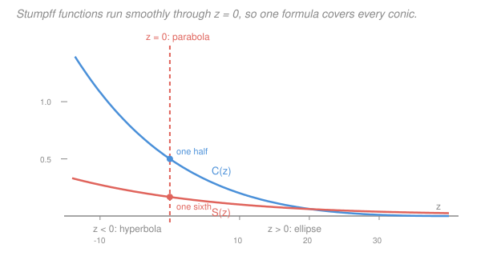

# Astrodynamics · Lesson 2.5: Universal variables & time-of-flight

> ⏱ ~15 min · Module 2: Orbit determination & time-of-flight · Builds on: [2.4](02-04-keplers-equation-eccentric-anomaly.md), [`calc-refresher` 3.2](../../calc-refresher/lessons/03-02-power-and-taylor-series.md) · Unlocks: 3.1 (impulsive maneuvers)

## Why this matters

Kepler's equation works beautifully — for ellipses. Interplanetary missions spend most of their time on **hyperbolic** departure and arrival legs, and a near-parabolic comet trajectory breaks the elliptical formulation entirely. Writing three separate propagators (elliptic, parabolic, hyperbolic) means three code paths, three sets of bugs, and a numerical cliff wherever an orbit drifts across $e = 1$.

Universal variables fix this with one formulation that covers all four conics, transitions smoothly through $e = 1$, and — as a bonus — propagates a state vector directly without ever computing orbital elements at all. That last property is why it's the standard method in flight software: given $(\mathbf r_0, \mathbf v_0)$ and $\Delta t$, it returns $(\mathbf r, \mathbf v)$ in one solve.

## The idea

The obstruction is that each conic uses a different anomaly: $E$ for an ellipse, $D$ for a parabola, $F$ (with hyperbolic sines) for a hyperbola. They're different functions, so you branch.

Universal variables sidestep the branch with a change of independent variable. Instead of parametrizing the orbit by time, parametrize it by a quantity $\chi$ whose derivative is $\sqrt\mu/r$ — meaning $\chi$ advances slowly when the spacecraft is far out and quickly when it's close in. That's a **regularizing** substitution: it stretches the near-perigee region where everything happens fast, and compresses the long slow outer arc.

In these coordinates, the differential equation for the orbit becomes linear — literally a harmonic oscillator whose frequency-squared is $\alpha = 1/a$. Positive $\alpha$ (ellipse) gives sines and cosines; negative $\alpha$ (hyperbola) gives hyperbolic sines and cosines; $\alpha = 0$ (parabola) gives polynomials. But all three are the *same power series*, evaluated at arguments of different sign.

Those series are the **Stumpff functions** $C(z)$ and $S(z)$. They are entire functions — perfectly smooth everywhere including $z = 0$ — which is exactly the analytic statement that the parabolic case is not a special case at all, just the value at a point. Write Kepler's equation in terms of $\chi$, $C$, and $S$, and you have one equation for every orbit in the universe.

The final ingredient is the **Lagrange $f$ and $g$ coefficients**: because the motion stays in a plane spanned by $\mathbf r_0$ and $\mathbf v_0$, the new position must be some combination $f\mathbf r_0 + g\mathbf v_0$. Two scalars, and the propagation is done — no elements, no rotations.

## The formal version

**The universal anomaly.** Define $\chi$ (units $\mathrm{km^{1/2}}$) by

$$\frac{d\chi}{dt} = \frac{\sqrt\mu}{r}, \qquad \chi(0) = 0.$$

*In words: a "stretched time" that ticks faster the closer you are to the primary.* It specializes to the familiar anomalies:

$$\chi = \sqrt a\,(E - E_0) \ \ (\text{ellipse}), \qquad \chi = \sqrt{-a}\,(F - F_0)\ \ (\text{hyperbola}), \qquad \chi = \sqrt{p}\,\tan\tfrac{\theta}{2}\ \ (\text{parabola}).$$

**Stumpff functions.** With $z \equiv \alpha\chi^2$ where $\alpha \equiv 1/a$ (the **reciprocal semi-major axis**, negative for hyperbolas, zero for parabolas):

$$C(z) = \sum_{k=0}^\infty \frac{(-z)^k}{(2k+2)!} = \begin{cases}\dfrac{1-\cos\sqrt z}{z}, & z>0\\[6pt] \dfrac{\cosh\sqrt{-z}-1}{-z}, & z<0\\[6pt] \dfrac12, & z=0\end{cases}$$

$$S(z) = \sum_{k=0}^\infty \frac{(-z)^k}{(2k+3)!} = \begin{cases}\dfrac{\sqrt z - \sin\sqrt z}{(\sqrt z)^3}, & z>0\\[6pt] \dfrac{\sinh\sqrt{-z} - \sqrt{-z}}{(\sqrt{-z})^3}, & z<0\\[6pt] \dfrac16, & z=0.\end{cases}$$

*In words: two smooth functions that don't care about the sign of their argument — the trig case and the hyperbolic case are the same series.* The piecewise closed forms are for computation; the series is the *definition*, and it's the series that shows there's nothing special at $z=0$. (Numerically, evaluate the series near $z\approx0$: the closed forms suffer catastrophic cancellation there, a textbook instance of the problem in [`numerical-analysis` 1.2](../../numerical-analysis/lessons/01-02-cancellation-error-propagation.md).)

**The universal Kepler equation.** For a spacecraft at $r_0 = \|\mathbf r_0\|$ with radial speed $v_{r0} = \mathbf r_0\cdot\mathbf v_0/r_0$, after elapsed time $\Delta t$:

$$\boxed{\;\frac{r_0v_{r0}}{\sqrt\mu}\chi^2 C(z) + (1-\alpha r_0)\chi^3 S(z) + r_0\chi = \sqrt{\mu}\,\Delta t, \qquad z = \alpha\chi^2.\;}$$

*In words: one transcendental equation in $\chi$, valid for every conic.* See [universal Kepler equation](../reference.md#universal-kepler-equation). It reduces to $M = E - e\sin E$ for $\alpha>0$; you can verify that by substituting $\chi = \sqrt a E$ and the $z>0$ closed forms.

Solve it by Newton's method with

$$F(\chi) = \frac{r_0v_{r0}}{\sqrt\mu}\chi^2C(z) + (1-\alpha r_0)\chi^3 S(z) + r_0\chi - \sqrt\mu\,\Delta t,$$
$$F'(\chi) = \frac{r_0v_{r0}}{\sqrt\mu}\chi\big(1 - \alpha\chi^2 S(z)\big) + (1-\alpha r_0)\chi^2 C(z) + r_0,$$

starting from $\chi_0 = \sqrt\mu\,|\alpha|\,\Delta t$. Note $F'(\chi) = r$ — the derivative *is* the current radius, which is always positive, so the iteration is as well behaved as the elliptical case in [2.4](02-04-keplers-equation-eccentric-anomaly.md).

Once $\chi$ is known, the radius is

$$r = F'(\chi) = \chi^2 C(z) + \frac{r_0v_{r0}}{\sqrt\mu}\chi\big(1-zS(z)\big) + r_0\big(1 - zC(z)\big).$$

**Lagrange coefficients.** Because $\mathbf r$ stays in the plane of $\mathbf r_0$ and $\mathbf v_0$,

$$\mathbf r = f\,\mathbf r_0 + g\,\mathbf v_0, \qquad \mathbf v = \dot f\,\mathbf r_0 + \dot g\,\mathbf v_0,$$

with

$$f = 1 - \frac{\chi^2}{r_0}C(z), \qquad g = \Delta t - \frac{\chi^3}{\sqrt\mu}S(z),$$
$$\dot f = \frac{\sqrt\mu}{r r_0}\big(zS(z)-1\big)\chi, \qquad \dot g = 1 - \frac{\chi^2}{r}C(z).$$

*In words: four scalars carry the whole propagation, and the answer is a linear combination of the initial position and velocity.* They satisfy the identity

$$f\dot g - \dot f g = 1,$$

which is conservation of angular momentum in disguise (it's the Wronskian of the two-body system) and is the single best numerical check on any implementation.

**The algorithm, end to end.** Given $\mathbf r_0$, $\mathbf v_0$, $\Delta t$: compute $r_0$, $v_{r0}$, and $\alpha = 2/r_0 - v_0^2/\mu$; solve the universal Kepler equation for $\chi$; evaluate $r$, then $f, g, \dot f, \dot g$; assemble $\mathbf r$ and $\mathbf v$. **No orbital elements are ever computed.**

## Picture

## Worked examples

**Example 1 (mechanical — propagate a hyperbolic state).** At $t=0$ a spacecraft has

$$\mathbf r_0 = (10{,}000,\,0,\,0)\ \mathrm{km}, \qquad \mathbf v_0 = (3.0752,\,9.5154,\,0)\ \mathrm{km/s}.$$

Where is it one hour later? ($\mu = 398{,}600$.)

$r_0 = 10{,}000$ km, $v_0 = 10.000$ km/s, $v_{r0} = \mathbf r_0\cdot\mathbf v_0/r_0 = 3.0752$ km/s.

$$\alpha = \frac{2}{r_0} - \frac{v_0^2}{\mu} = 2\times10^{-4} - \frac{100}{398{,}600} = 2\times10^{-4} - 2.5088\times10^{-4} = -5.0879\times10^{-5}\ \mathrm{km^{-1}}.$$

Negative — **hyperbolic**, with $a = 1/\alpha = -19{,}655$ km. Kepler's equation of [2.4](02-04-keplers-equation-eccentric-anomaly.md) cannot be used at all.

Newton on the universal equation with $\Delta t = 3600$ s, starting from $\chi_0 = \sqrt{398{,}600}\,(5.0879\times10^{-5})(3600) = 115.6$:

| $k$ | $\chi_k\ (\mathrm{km^{1/2}})$ |
|---|---|
| 0 | 115.64 |
| 1 | 129.345 |
| 2 | 128.514 |
| 3 | 128.5107 |

So $\chi = 128.511$, $z = \alpha\chi^2 = -0.8403$ (negative, hyperbolic branch), $C(z) = 0.5716$, $S(z) = 0.1734$, and

$$r = 30{,}530\ \mathrm{km}.$$

Lagrange coefficients: $f = 0.11479$, $g = 3015.71$ s, $\dot f = -3.0457\times10^{-4}\ \mathrm{s^{-1}}$, $\dot g = 0.71005$. Then

$$\mathbf r = 0.11479\,(10{,}000,0,0) + 3015.71\,(3.0752,9.5154,0) = (10{,}422,\;28{,}696,\;0)\ \mathrm{km},$$
$$\mathbf v = -3.0457\times10^{-4}(10{,}000,0,0) + 0.71005(3.0752,9.5154,0) = (-0.862,\;6.756,\;0)\ \mathrm{km/s}.$$

*Checks.* $f\dot g - \dot fg = 0.11479(0.71005) - (-3.0457\times10^{-4})(3015.71) = 0.08151 + 0.91849 = 1.0000$ ✓. Energy: $v^2/2 - \mu/r = 23.20 - 13.06 = 10.14 = \varepsilon_0$ ✓. Angular momentum: $h = xv_y - yv_x$ gives $95{,}154$ at both epochs ✓.

**Example 2 (why you'd care — it agrees with Kepler where both apply).** Take an ellipse: $\mathbf r_0$ at perigee with $r_0 = 8000$ km, $v_{r0} = 0$, and $a = 12{,}000$ km (so $e = 1 - r_p/a = 1/3$, $\alpha = 8.3333\times10^{-5}$). Propagate $\Delta t = 3000$ s.

*Universal route:* the solve gives $\chi = 193.646\ \mathrm{km^{1/2}}$, $z = 3.1250$, and $r = 12{,}782.7$ km.

*Classical route:* $n = \sqrt{\mu/a^3} = 4.8006\times10^{-4}$ rad/s, so $M = n\Delta t = 1.44018$ rad $= 82.55^\circ$. Newton on $M = E - e\sin E$ gives $E = 101.284^\circ = 1.76776$ rad, and $r = a(1-e\cos E) = 12{,}000(1 + 0.33333\times0.19565) = 12{,}782.7$ km.

**Identical.** And the connection is explicit: $\sqrt a\,E = \sqrt{12{,}000}\times1.76776 = 193.646 = \chi$ ✓ — the universal anomaly *is* $\sqrt a E$ for an ellipse, exactly as claimed.

**Why bother, then?** Because the moment the orbit is hyperbolic, or a maneuver pushes $e$ across 1, or you're propagating a near-parabolic comet, the classical route needs a different equation and the universal route needs nothing at all. One function, one branch, no cliff.

## Watch out

- **You might compute $C(z)$ and $S(z)$ from the closed forms near $z = 0$.** For $|z|$ small, $1 - \cos\sqrt z$ is the difference of two nearly equal numbers divided by a tiny $z$ — catastrophic cancellation. Use the series (a few terms suffice) whenever $|z| < 0.1$.
- **You might expect $\chi$ to be an angle.** It has units of $\mathrm{km^{1/2}}$, which looks bizarre and is correct: it's $\sqrt a$ times an angle.
- **You might skip the $f\dot g - \dot fg = 1$ check.** Don't. It catches sign errors in $\dot f$, wrong branches of $C$ and $S$, and unit slips, all at once, in one line.
- **You might think $\alpha = 1/a$ needs $a$ computed first.** It doesn't — $\alpha = 2/r_0 - v_0^2/\mu$ comes straight from the state vector, which is the point: the method never needs elements. For a parabola $\alpha$ is exactly zero and nothing divides by it.
- **You might use this for very long propagations.** Numerically the universal formulation is fine, but *physically* the two-body model isn't: after many revolutions, $J_2$ and drag ([4.4](04-04-perturbations-j2-drag.md)) dominate the error, not your solver.

## One-liner

> Re-clock the orbit by $d\chi/dt = \sqrt\mu/r$ and Kepler's equation becomes a single entire-function identity in the Stumpff series — one propagator for circles, ellipses, parabolas, and hyperbolas alike.

## Problems

**P1 (🟢)** Compute $C(z)$ and $S(z)$ at $z = 4$ and at $z = -4$, using the closed forms. Then evaluate both at $z = 0$ from the series and confirm the values $1/2$ and $1/6$.

**P2 (🟡)** A spacecraft has $\mathbf r_0 = (7000, 0, 0)$ km and $\mathbf v_0 = (0, 9.0, 0)$ km/s about Earth. Compute $\alpha$ and classify the orbit. What is $z$ after the universal solve returns $\chi = 100\ \mathrm{km^{1/2}}$, and which branch of the Stumpff functions applies?

**P3 (🔴)** Show that substituting $\chi = \sqrt a\,E$ (with $E_0 = 0$, i.e. starting at perigee, so $v_{r0}=0$ and $r_0 = a(1-e)$) into the universal Kepler equation reproduces $M = E - e\sin E$.

Solutions

**P1** At $z = 4$ ($\sqrt z = 2$):

$$C(4) = \frac{1-\cos 2}{4} = \frac{1-(-0.41615)}{4} = \frac{1.41615}{4} = 0.35404,$$
$$S(4) = \frac{2 - \sin 2}{2^3} = \frac{2 - 0.90930}{8} = \frac{1.09070}{8} = 0.13634.$$

At $z = -4$ ($\sqrt{-z} = 2$):

$$C(-4) = \frac{\cosh 2 - 1}{4} = \frac{3.76220-1}{4} = \frac{2.76220}{4} = 0.69055,$$
$$S(-4) = \frac{\sinh 2 - 2}{2^3} = \frac{3.62686-2}{8} = \frac{1.62686}{8} = 0.20336.$$

At $z = 0$ the series give their leading terms:

$$C(0) = \frac{1}{2!} = \frac12, \qquad S(0) = \frac{1}{3!} = \frac16. \;\checkmark$$

*Check.* Both functions are decreasing in $z$: $C(-4) = 0.691 > C(0) = 0.5 > C(4) = 0.354$ ✓, and likewise for $S$ ✓ — consistent with the alternating series $C(z) = 1/2 - z/24 + \cdots$.

**P2**

$$v_0 = 9.0\ \mathrm{km/s}, \qquad \alpha = \frac{2}{7000} - \frac{81}{398{,}600} = 2.85714\times10^{-4} - 2.03211\times10^{-4} = 8.2503\times10^{-5}\ \mathrm{km^{-1}}.$$

Positive, so $a = 1/\alpha = 12{,}121$ km $>0$: the orbit is an **ellipse**. (This is the same orbit as Example 1 of [1.4](01-04-energy-vis-viva-orbit-types.md), which found $a = 12{,}121$ km by energy ✓.)

$$z = \alpha\chi^2 = 8.2503\times10^{-5}\times(100)^2 = 0.82503.$$

Since $z>0$, the **trigonometric branch** applies: $C(z) = (1-\cos\sqrt z)/z$ with $\sqrt z = 0.90831$ rad, giving $C = (1-0.61604)/0.82503 = 0.46539$.

*Check.* $\alpha>0$, $z>0$, trig branch — the three always travel together for a bound orbit ✓. Also $v_{r0} = 0$ here (position along $x$, velocity along $y$), so this state is at an apsis, consistent with $9.0 > v_{\rm circ} = 7.55$ km/s meaning perigee ✓.

**P3** Start at perigee, so $v_{r0} = 0$ and the first term of the universal equation vanishes. With $r_0 = a(1-e)$ and $\alpha = 1/a$,

$$1 - \alpha r_0 = 1 - \frac{a(1-e)}{a} = e.$$

Substituting $\chi = \sqrt a\,E$ gives $z = \alpha\chi^2 = E^2 > 0$, so $\sqrt z = E$ and

$$S(z) = \frac{E - \sin E}{E^3}.$$

The universal Kepler equation becomes

$$0 + e\,(\sqrt a E)^3\,\frac{E-\sin E}{E^3} + a(1-e)\sqrt a\,E = \sqrt\mu\,\Delta t.$$

The $E^3$ cancels in the first term:

$$e\,a^{3/2}(E - \sin E) + a^{3/2}(1-e)E = \sqrt\mu\,\Delta t.$$

Factor out $a^{3/2}$ and expand:

$$a^{3/2}\big[eE - e\sin E + E - eE\big] = a^{3/2}\big[E - e\sin E\big] = \sqrt\mu\,\Delta t.$$

Divide by $a^{3/2}$:

$$E - e\sin E = \sqrt{\frac{\mu}{a^3}}\,\Delta t = n\,\Delta t = M. \;\blacksquare$$

*Check.* The $eE$ terms cancelling is the whole mechanism — and it's why the universal form needs both $C$ and $S$: $S$ supplies the $\sin E$ and the $r_0$ term supplies the linear $E$ ✓. Example 2 verified this numerically: $\chi = 193.646 = \sqrt{12{,}000}\times1.76776 = \sqrt a\,E$ ✓.

## Flashback

**From Lesson 2.4 (Kepler's equation & the eccentric anomaly):** A satellite in an orbit with $e = 0.2$ has an eccentric anomaly of $E = 100^\circ$. Find its mean anomaly and its true anomaly.

Solution

Kepler's equation, with $E = 100^\circ = 1.74533$ rad:

$$M = E - e\sin E = 1.74533 - 0.2\sin(100^\circ) = 1.74533 - 0.2(0.98481) = 1.74533 - 0.19696 = 1.54837\ \mathrm{rad} = 88.71^\circ.$$

True anomaly by the half-angle formula:

$$\tan\frac{\theta}{2} = \sqrt{\frac{1.2}{0.8}}\tan 50^\circ = 1.22474(1.19175) = 1.45959 \;\Longrightarrow\; \frac{\theta}{2} = 55.59^\circ, \quad \theta = 111.19^\circ.$$

*Check.* The ordering $\theta = 111.2^\circ > E = 100^\circ > M = 88.7^\circ$ holds, as it must on the outbound leg ✓. And the corresponding radius $r = a(1-e\cos E) = a(1+0.03473) = 1.0347\,a$ agrees with the orbit equation $a(1-e^2)/(1+e\cos\theta) = 0.96a/(1-0.07284) = 1.0353a$ to rounding ✓.

## Connections

- **Backward:** this generalizes [2.4](02-04-keplers-equation-eccentric-anomaly.md) — P3 shows Kepler's equation is the $z>0$ case — and it uses the same Newton iteration, with $F'(\chi) = r > 0$ playing the role of $1-e\cos E>0$.
- **Forward:** the $f$ and $g$ coefficients reappear in Lambert's problem and in rendezvous targeting; the hyperbolic capability is what makes the departure and arrival legs of [4.2](04-02-interplanetary-hohmann-hyperbolic-legs.md) and the flybys of [4.3](04-03-gravity-assists.md) computable with the same code as an Earth orbit.
- **Sideways (analysis):** $C$ and $S$ are entire functions defined by everywhere-convergent power series ([`calc-refresher` 3.2](../../calc-refresher/lessons/03-02-power-and-taylor-series.md)); the apparent trig-versus-hyperbolic dichotomy is just $\cos(ix) = \cosh x$, the same analytic continuation that unifies circular and hyperbolic functions in [`complex-analysis` 1.3](../../complex-analysis/lessons/01-03-exponential-log-trig.md).
