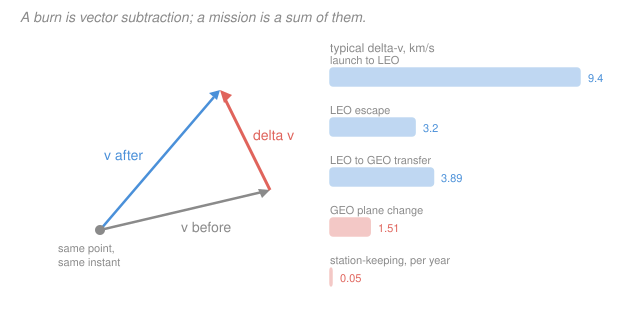

# Astrodynamics · Lesson 3.1: Impulsive maneuvers & the Δv budget

> ⏱ ~15 min · Module 3: Maneuvers & rendezvous · Builds on: [1.4](01-04-energy-vis-viva-orbit-types.md), [2.3](02-03-state-vectors-and-elements.md) · Unlocks: 3.2 (Hohmann transfers)

## Why this matters

Modules 1 and 2 described orbits you're stuck with. Module 3 is about changing them on purpose, and it opens with the accounting.

Every mission is priced in one currency: **delta-v**, the total velocity change the spacecraft must produce. Not fuel mass, not thrust, not burn time — those all follow from delta-v via the rocket equation. When engineers say "the mission has a 4.2 km/s budget," they mean a number computed exactly the way this lesson computes it, and every design trade in astrodynamics is ultimately a fight over it.

The reason delta-v is such a brutal currency is the exponential in the rocket equation: propellant mass grows exponentially with delta-v. Saving 300 m/s can be the difference between a mission that flies and one that doesn't.

## The idea

Real burns take minutes and cover hundreds of kilometers of arc. Modeling that honestly means integrating thrust along a trajectory — expensive, and it obscures the geometry.

The **impulsive approximation** throws that away. Pretend the burn happens instantaneously at a single point: the position doesn't change, and the velocity jumps discontinuously from $\mathbf v^-$ to $\mathbf v^+$. This is excellent whenever the burn is short compared with the orbital period, which covers essentially all chemical propulsion (a 3-minute burn on a 90-minute orbit).

With that approximation, a maneuver is nothing but **vector subtraction**: $\Delta\mathbf v = \mathbf v^+ - \mathbf v^-$. And since the position is unchanged, the maneuver point lies on both the old and new orbits — which is the constraint that makes transfer design tractable. **You can only switch between orbits that intersect.**

Two consequences are worth internalizing before any formulas.

**First: burns cost speed change, not energy change.** They're different. The energy you gain from a burn depends on how fast you were already going — the same $\Delta v$ applied at perigee buys far more energy than at apogee. That's the *Oberth effect*, and it dictates when to burn.

**Second: direction matters enormously.** A burn along the velocity vector changes the orbit's size very efficiently. A burn perpendicular to it barely changes the size at all — it mostly rotates the orbit. Rotating your velocity vector is expensive; stretching it is cheap.

## The formal version

**The impulsive maneuver.** At a point $\mathbf r$, the velocity changes instantaneously:

$$\Delta\mathbf v = \mathbf v^+ - \mathbf v^-, \qquad \Delta v = \|\Delta\mathbf v\|, \qquad \mathbf r^+ = \mathbf r^-.$$

*In words: same place, new velocity, and the cost is the length of the difference vector.* Note $\Delta v \ne |v^+ - v^-|$ in general — you must subtract the **vectors**, not the speeds. For a burn that turns the velocity by an angle $\phi$,

$$\Delta v = \sqrt{(v^-)^2 + (v^+)^2 - 2v^-v^+\cos\phi}$$

by the law of cosines. Only for a purely tangential burn ($\phi = 0$) does this reduce to the difference of speeds.

**The rocket equation** (Tsiolkovsky). If the engine expels propellant at effective exhaust velocity $v_e$ (km/s), then

$$\Delta v = v_e\ln\frac{m_0}{m_f} = I_{\rm sp}\,g_0\ln\frac{m_0}{m_f},$$

with $m_0$ the initial mass, $m_f$ the final mass, $I_{\rm sp}$ the **specific impulse** in seconds, and $g_0 = 9.80665\ \mathrm{m/s^2}$ a defined constant (not local gravity). Inverting, the propellant mass fraction is

$$\frac{m_{\rm prop}}{m_0} = 1 - e^{-\Delta v/v_e}.$$

*In words: the mass you must throw away grows exponentially with the speed change you want.* See [rocket equation](../reference.md#rocket-equation). Typical values: storable bipropellant $I_{\rm sp}\approx 320$ s, cryogenic hydrogen-oxygen $\approx 450$ s, monopropellant hydrazine $\approx 230$ s, ion thrusters $\approx 3000$ s (but with thrust so low the impulsive approximation fails).

**Effects of burn direction.** Consider a circular orbit of radius $r$ and speed $v_c = \sqrt{\mu/r}$, and a small burn $\Delta v \ll v_c$.

- **Tangential** (along $\mathbf v$): the new speed is $v_c + \Delta v$, so from vis-viva
$$\frac{\Delta a}{a} \approx \frac{2\Delta v}{v_c}.$$
*In words: a tangential burn changes the orbit size at twice the fractional rate of the speed change.* Maximum efficiency.

- **Radial** (along $\mathbf r$): the new speed is $\sqrt{v_c^2+\Delta v^2} \approx v_c(1 + \tfrac12(\Delta v/v_c)^2)$ — **second order**. The orbit's size barely changes; the burn mostly rotates the apse line.

*Numerical illustration:* at $r = 7000$ km ($v_c = 7.546$ km/s), a $\Delta v = 0.1$ km/s tangential burn raises $a$ by 192 km; the same burn applied radially raises $a$ by **1.2 km**. Same fuel, 160 times less effect on the orbit's size. Radial burns are for changing *where* perigee is, never for changing *how high* you go.

**The Oberth effect.** Differentiate the energy $\varepsilon = v^2/2 - \mu/r$ at fixed $r$ for a tangential burn:

$$\Delta\varepsilon = \frac{(v+\Delta v)^2 - v^2}{2} = v\,\Delta v + \frac{(\Delta v)^2}{2}.$$

*In words: the energy you gain is proportional to the speed you already had.* So burn where you are moving fastest — at perigee. A 1 km/s burn at perigee of a highly eccentric orbit ($v = 10$ km/s) yields $10.5\ \mathrm{km^2/s^2}$ of energy; the same burn at apogee ($v = 1.5$ km/s) yields $2.0$. This single fact explains most of interplanetary mission design ([4.2](04-02-interplanetary-hohmann-hyperbolic-legs.md)).

**Budgets add.** Delta-v is a scalar cost that sums over a mission, even though the individual $\Delta\mathbf v$ are vectors:

$$\Delta v_{\rm total} = \sum_k \|\Delta\mathbf v_k\|.$$

*In words: you pay for the magnitude of every burn, and none of them refund each other.* Burning prograde then retrograde costs twice, not zero.

## Picture

## Worked examples

**Example 1 (mechanical — turning a velocity vector).** A spacecraft in a circular orbit at 7.5 km/s must change its velocity direction by $20^\circ$ while keeping the same speed. What does that cost?

$$\Delta v = \sqrt{v^2+v^2-2v^2\cos 20^\circ} = v\sqrt{2(1-\cos 20^\circ)} = 2v\sin\frac{20^\circ}{2} = 2(7.5)(0.17365) = 2.60\ \mathrm{km/s}.$$

**More than a third of the orbital speed, for a change that alters neither the size nor the shape of the orbit** — just its direction. Compare: raising this orbit's semi-major axis by 10 percent would cost only $v_c \times 0.05 \approx 0.19$ km/s tangentially. *Turning is the expensive operation*, which is the whole reason [3.4](03-04-plane-changes-combined-maneuvers.md) works so hard to avoid it.

**Example 2 (why you'd care — how much of the spacecraft is fuel?).** A satellite must perform a LEO-to-GEO Hohmann transfer, total $\Delta v = 3.89$ km/s ([3.2](03-02-hohmann-transfers.md) derives this). Its engine has $I_{\rm sp} = 320$ s, so $v_e = 320\times(9.80665\times10^{-3}) = 3.138\ \mathrm{km/s}$.

$$\frac{m_0}{m_f} = e^{3.89/3.138} = e^{1.2396} = 3.454 \;\Longrightarrow\; \frac{m_{\rm prop}}{m_0} = 1 - \frac{1}{3.454} = 0.710.$$

**71 percent of the departing mass is propellant.** A 3000-kg stack delivers only 870 kg to GEO.

Now switch to a cryogenic upper stage, $I_{\rm sp} = 450$ s ($v_e = 4.413$ km/s):

$$\frac{m_0}{m_f} = e^{3.89/4.413} = e^{0.8815} = 2.415 \;\Longrightarrow\; \frac{m_{\rm prop}}{m_0} = 0.586,$$

delivering 1242 kg — **43 percent more payload for the same launch mass**, purely from the exponent. And note the asymmetry: adding 300 m/s to the budget at $I_{\rm sp}=320$ s costs about 9 percent of the *remaining* payload. That's why every mission designer fights for scraps of delta-v.

## Watch out

- **You might subtract speeds instead of vectors.** If $\mathbf v^-$ and $\mathbf v^+$ both have magnitude 7.5 km/s but differ in direction, the speeds differ by zero and $\Delta v$ is 2.6 km/s. Always subtract the vectors.
- **You might think $\Delta v$ can be recovered.** It can't. Delta-v is spent, never refunded; a prograde burn followed by an identical retrograde burn costs $2\Delta v$ and leaves you where you started.
- **You might apply the impulsive model to electric propulsion.** An ion thruster burns for months and spirals outward continuously; its total $\Delta v$ still obeys the rocket equation, but the *trajectory* is nothing like an instantaneous conic-to-conic switch, and low-thrust spiral transfers cost noticeably more delta-v than a Hohmann.
- **You might use local gravity for $g_0$.** $g_0 = 9.80665\ \mathrm{m/s^2}$ is a defined conversion constant in the definition of $I_{\rm sp}$; it is not the gravity where the spacecraft happens to be, and it does not change in orbit.
- **You might forget that the maneuver point must lie on both orbits.** Two orbits that don't intersect cannot be joined by a single impulse, no matter how large. That's why every transfer in this module needs at least two burns.

## One-liner

> A burn is instantaneous vector subtraction at a fixed point, its cost is $\|\Delta\mathbf v\|$, and the rocket equation turns that cost into an exponentially growing pile of propellant.

## Problems

**P1 (🟢)** A spacecraft in a circular orbit at $r = 8000$ km performs a tangential burn of $\Delta v = 0.25$ km/s. Find its new speed, new semi-major axis, and new eccentricity.

**P2 (🟡)** A spacecraft has $\mathbf v^- = (3.0, 6.5, 0)$ km/s and after a burn $\mathbf v^+ = (2.2, 7.4, 1.0)$ km/s. Find $\Delta\mathbf v$ and $\Delta v$, and compare $\Delta v$ with the change in *speed*. Explain the discrepancy.

**P3 (🔴)** A mission needs a total $\Delta v = 5.0$ km/s. Compare the propellant mass fraction for $I_{\rm sp} = 300$ s and $I_{\rm sp} = 450$ s. Then find the $\Delta v$ at which a 300-second engine would require 90 percent of the initial mass as propellant.

Solutions

**P1** Circular speed first:

$$v_c = \sqrt{\frac{398{,}600}{8000}} = 7.0587\ \mathrm{km/s} \;\Longrightarrow\; v^+ = 7.0587 + 0.25 = 7.3087\ \mathrm{km/s}.$$

New semi-major axis from vis-viva:

$$\frac{1}{a} = \frac{2}{r} - \frac{v^2}{\mu} = \frac{2}{8000} - \frac{53.417}{398{,}600} = 2.5\times10^{-4} - 1.34011\times10^{-4} = 1.15989\times10^{-4},$$
$$a = 8621\ \mathrm{km}.$$

The burn point is unchanged at $r = 8000$ km, and because the burn was tangential the velocity there is still perpendicular to $\mathbf r$ — so this point is an apsis, and since $a>r$ it must be **perigee**. Hence

$$e = 1 - \frac{r_p}{a} = 1 - \frac{8000}{8621} = 0.0720.$$

*Check.* The rule of thumb $\Delta a/a \approx 2\Delta v/v_c = 2(0.25)/7.0587 = 0.0708$ predicts $\Delta a \approx 566$ km against the exact 621 km ✓ — close, with the gap coming from the neglected second-order term. Apogee is $a(1+e) = 9242$ km.

**P2**

$$\Delta\mathbf v = (2.2-3.0,\; 7.4-6.5,\; 1.0-0) = (-0.8,\; 0.9,\; 1.0)\ \mathrm{km/s},$$
$$\Delta v = \sqrt{0.64+0.81+1.00} = \sqrt{2.45} = 1.565\ \mathrm{km/s}.$$

The speeds are

$$v^- = \sqrt{9+42.25} = \sqrt{51.25} = 7.159\ \mathrm{km/s}, \qquad v^+ = \sqrt{4.84+54.76+1} = \sqrt{60.60} = 7.785\ \mathrm{km/s},$$

so the speed changed by only $0.626$ km/s — **less than half** the delta-v spent.

**Why:** the burn both sped the spacecraft up *and* rotated its velocity (including out of the original plane, since $v_z$ went from 0 to 1). Only the component of $\Delta\mathbf v$ along $\mathbf v^-$ contributes to the speed change; the perpendicular component is spent entirely on turning. Concretely, $\Delta\mathbf v\cdot\hat{\mathbf v}^- = \big[(-0.8)(3.0)+(0.9)(6.5)\big]/7.159 = 3.45/7.159 = 0.482$ km/s of "useful" speed increase, with the rest going into rotation.

**P3** With $v_e = I_{\rm sp}g_0$ and $g_0 = 9.80665\times10^{-3}\ \mathrm{km/s^2}$:

*At $I_{\rm sp} = 300$ s*: $v_e = 2.942$ km/s, so

$$\frac{m_0}{m_f} = e^{5.0/2.942} = e^{1.6996} = 5.472 \;\Longrightarrow\; \frac{m_{\rm prop}}{m_0} = 1 - 0.1828 = \mathbf{0.817}.$$

*At $I_{\rm sp} = 450$ s*: $v_e = 4.413$ km/s, so

$$\frac{m_0}{m_f} = e^{5.0/4.413} = e^{1.1330} = 3.105 \;\Longrightarrow\; \frac{m_{\rm prop}}{m_0} = 1 - 0.3221 = \mathbf{0.678}.$$

The dry-plus-payload fraction nearly **doubles** (18.3 percent to 32.2 percent) from the higher specific impulse alone.

For a 90 percent propellant fraction at $I_{\rm sp} = 300$ s, we need $m_f/m_0 = 0.10$:

$$\Delta v = v_e\ln\frac{1}{0.10} = 2.942\times\ln 10 = 2.942(2.3026) = 6.77\ \mathrm{km/s}.$$

*Check.* Only 1.77 km/s more than the 5.0 km/s case, yet the payload fraction falls from 18.3 percent to 10 percent — the exponential compounding that makes single-stage-to-anywhere so hard ✓. (Every doubling of $m_0/m_f$ costs a fixed $v_e\ln 2 = 2.04$ km/s here, which is the cleanest way to feel the rocket equation.)

## Flashback

**From Lesson 2.3 (State vectors ↔ orbital elements):** A spacecraft has $\mathbf r = (0, 9000, 0)$ km and $\mathbf v = (-6.5, 0.8, 0)$ km/s about Earth. Find $v_r$ and state whether it is climbing or falling, then find its semi-major axis.

Solution

$$r = 9000\ \mathrm{km}, \qquad v = \sqrt{42.25+0.64} = \sqrt{42.89} = 6.549\ \mathrm{km/s}.$$

$$\mathbf r\cdot\mathbf v = 0(-6.5) + 9000(0.8) + 0 = 7200 \;\Longrightarrow\; v_r = \frac{7200}{9000} = +0.80\ \mathrm{km/s},$$

so the spacecraft is **climbing** (outbound from perigee).

$$a = \left(\frac{2}{r} - \frac{v^2}{\mu}\right)^{-1} = \left(2.2222\times10^{-4} - \frac{42.89}{398{,}600}\right)^{-1} = \left(2.2222\times10^{-4} - 1.07601\times10^{-4}\right)^{-1}$$
$$= \frac{1}{1.14621\times10^{-4}} = 8724\ \mathrm{km}.$$

*Check.* $a < r$, so the spacecraft is currently *beyond* the semi-major axis — it must be in the outer part of the orbit, consistent with climbing toward an apogee at $r_a > 9000$ km ✓. Bound, since $a>0$ ✓.

## Connections

- **Backward:** every $\Delta v$ is computed as the difference of two velocities found from vis-viva ([1.4](01-04-energy-vis-viva-orbit-types.md)), and the "burn point lies on both orbits" constraint is the orbit equation ([1.3](01-03-orbit-equation-conic-sections.md)) evaluated for two conics at once.
- **Forward:** [3.2](03-02-hohmann-transfers.md) applies this to the classic two-burn transfer; [3.4](03-04-plane-changes-combined-maneuvers.md) exploits the law-of-cosines formula to combine a turn with a raise; [4.2](04-02-interplanetary-hohmann-hyperbolic-legs.md) leans on the Oberth effect to make interplanetary departures affordable.
- **Sideways (engineering):** the rocket equation is where astrodynamics meets propulsion. Its exponential is the reason for staging, and the $I_{\rm sp}$ values quoted here come out of the nozzle thermodynamics covered in [`propulsion` 3.2](../../propulsion/lessons/03-02-specific-impulse-rocket-performance.md).
