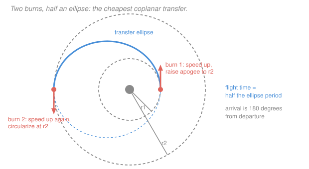

# Astrodynamics · Lesson 3.2: Hohmann transfers

> ⏱ ~15 min · Module 3: Maneuvers & rendezvous · Builds on: [1.4](01-04-energy-vis-viva-orbit-types.md), [3.1](03-01-impulsive-maneuvers-delta-v.md) · Unlocks: 3.3 (bi-elliptic transfers)

## Why this matters

The Hohmann transfer is the most famous maneuver in astrodynamics, and it is the default answer to "how do I get from this circular orbit to that one." Walter Hohmann worked it out in 1925 — decades before anything flew — and essentially every satellite that has ever reached geostationary orbit got there on one.

It's also the benchmark. When someone proposes a clever alternative, the first question is "how does it compare with Hohmann?" Understanding *why* it's optimal, and precisely where that optimality stops holding, is what lets you recognize the cases where something else wins ([3.3](03-03-bi-elliptic-transfers.md)).

## The idea

You're on a small circular orbit and want a big one. The two circles never touch, so a single burn cannot connect them ([3.1](03-01-impulsive-maneuvers-delta-v.md)) — you need a bridge orbit that touches both.

The cheapest bridge is an ellipse **tangent to both circles**: its perigee grazes the inner circle, its apogee grazes the outer one. Tangency is the whole trick. At a tangent point the transfer orbit's velocity is parallel to the circular orbit's velocity, so the burn is purely along the direction of motion — no fuel wasted turning ([3.1](03-01-impulsive-maneuvers-delta-v.md) showed turning is the expensive operation). Any non-tangent transfer arrives at an angle and pays for the angle.

So the maneuver is two burns:

1. At the inner circle, speed up. That raises your apogee out to the target radius, putting you on the transfer ellipse.
2. Coast half an orbit. You arrive at apogee moving *too slowly* to stay there — apogee speed on a stretched ellipse is well below the local circular speed.
3. Speed up again. This circularizes.

Both burns are prograde. That's worth pausing on: to get to a **higher, slower** orbit you speed up twice. There's no contradiction — each burn adds energy, energy raises $a$, and larger $a$ means lower average speed. The "slower is higher" paradox of [1.4](01-04-energy-vis-viva-orbit-types.md) in action.

Why is it optimal? Because for two-impulse transfers between coplanar circles, tangential burns at the apsides minimize the total. The intuition is the Oberth effect plus the no-turning argument: burn where you're fastest, and burn straight ahead. (Strictly, optimality holds for $r_2/r_1 < 11.94$; beyond that the bi-elliptic wins, which is [3.3](03-03-bi-elliptic-transfers.md)'s subject.)

## The formal version

**Setup.** Coplanar circular orbits of radii $r_1$ (inner) and $r_2$ (outer), same primary, gravitational parameter $\mu$. The **transfer ellipse** has

$$r_p = r_1, \qquad r_a = r_2, \qquad a_t = \frac{r_1+r_2}{2}, \qquad e_t = \frac{r_2-r_1}{r_2+r_1}.$$

**The four speeds.** Circular speeds on the two orbits, and transfer-ellipse speeds at its two apsides (vis-viva, [1.4](01-04-energy-vis-viva-orbit-types.md)):

$$v_{c1} = \sqrt{\frac{\mu}{r_1}}, \qquad v_{c2} = \sqrt{\frac{\mu}{r_2}},$$

$$v_{t,p} = \sqrt{\mu\left(\frac{2}{r_1}-\frac{1}{a_t}\right)}, \qquad v_{t,a} = \sqrt{\mu\left(\frac{2}{r_2}-\frac{1}{a_t}\right)}.$$

**The two burns.** Both tangential, so the delta-v's are plain speed differences:

$$\boxed{\;\Delta v_1 = v_{t,p} - v_{c1}, \qquad \Delta v_2 = v_{c2} - v_{t,a}, \qquad \Delta v_{\rm total} = \Delta v_1 + \Delta v_2.\;}$$

*In words: speed up onto the ellipse, coast, then speed up again to stay at the top.* See [Hohmann transfer](../reference.md#hohmann-transfer).

**Transfer time.** Exactly half the transfer ellipse's period:

$$t_{12} = \frac{T_t}{2} = \pi\sqrt{\frac{a_t^3}{\mu}}.$$

*In words: you depart at perigee and arrive at apogee, half a lap later.* A consequence that matters operationally: **arrival is always $180^\circ$ of true anomaly from departure**, so you can't choose the arrival geometry independently — a constraint that becomes the launch-window problem in [4.2](04-02-interplanetary-hohmann-hyperbolic-legs.md).

**Closed form for the total.** Writing $R = r_2/r_1$, some algebra gives

$$\frac{\Delta v_{\rm total}}{v_{c1}} = \frac{1}{\sqrt R}\left(\sqrt{\frac{2R}{1+R}}\left(\sqrt R + 1\right) - \sqrt R\right) - 1 + \frac{1}{\sqrt R},$$

which is ugly, but the useful fact hidden in it is that the *ratio* $\Delta v_{\rm total}/v_{c1}$ depends only on $R$ — not on $\mu$ or on the absolute sizes. It **peaks at $R \approx 15.58$** at about $0.536\,v_{c1}$, then slowly declines. That non-monotonicity is the first hint that very large transfers behave strangely, and it is exactly why the bi-elliptic exists.

**Going inward.** To transfer from a larger orbit to a smaller one, run the whole thing backwards: both burns are **retrograde**, with magnitudes identical to the outward case. The cost is symmetric — descending from GEO to LEO costs exactly what climbing does. (This is why aerobraking, which lets the atmosphere do the second burn for free, is such a big deal for Mars missions.)

## Picture

## Worked examples

**Example 1 (mechanical — LEO to GEO).** From a 300-km circular parking orbit ($r_1 = 6678$ km) to geostationary ($r_2 = 42{,}164$ km), $\mu = 398{,}600$.

$$a_t = \frac{6678+42{,}164}{2} = 24{,}421\ \mathrm{km}, \qquad e_t = \frac{35{,}486}{48{,}842} = 0.7266.$$

$$v_{c1} = \sqrt{\frac{398{,}600}{6678}} = 7.7258\ \mathrm{km/s}, \qquad v_{c2} = \sqrt{\frac{398{,}600}{42{,}164}} = 3.0747\ \mathrm{km/s}.$$

$$v_{t,p} = \sqrt{398{,}600\left(\frac{2}{6678}-\frac{1}{24{,}421}\right)} = \sqrt{398{,}600(2.99490\times10^{-4} - 4.0948\times10^{-5})} = \sqrt{103.06} = 10.1516\ \mathrm{km/s},$$

$$v_{t,a} = \sqrt{398{,}600\left(\frac{2}{42{,}164}-\frac{1}{24{,}421}\right)} = \sqrt{398{,}600(4.74362\times10^{-5}-4.0948\times10^{-5})} = \sqrt{2.5851} = 1.6078\ \mathrm{km/s}.$$

$$\Delta v_1 = 10.1516 - 7.7258 = 2.4258\ \mathrm{km/s}, \qquad \Delta v_2 = 3.0747 - 1.6078 = 1.4668\ \mathrm{km/s},$$

$$\boxed{\Delta v_{\rm total} = 3.8926\ \mathrm{km/s}}, \qquad t_{12} = \pi\sqrt{\frac{24{,}421^3}{398{,}600}} = 18{,}990\ \mathrm{s} = 5.28\ \mathrm{h}.$$

**This is the number.** Every commercial GEO satellite pays roughly this (before plane change), and it is the 3.89 km/s used in [3.1](03-01-impulsive-maneuvers-delta-v.md)'s rocket-equation example. Note the transfer ellipse's apogee speed of 1.61 km/s is only **52 percent** of GEO's circular speed — arriving at apogee you are moving far too slowly to stay, which is why the second burn is needed at all.

**Example 2 (why you'd care — LEO to the Moon's distance).** Take $r_1 = 6678$ km and $r_2 = 384{,}400$ km (lunar distance), $R = 57.6$.

$$a_t = 195{,}539\ \mathrm{km}, \quad v_{t,p} = 10.8323, \quad v_{t,a} = 0.1882, \quad v_{c2} = 1.0183\ \mathrm{km/s}.$$

$$\Delta v_1 = 10.8323 - 7.7258 = 3.1065\ \mathrm{km/s}, \qquad \Delta v_2 = 1.0183 - 0.1882 = 0.8301\ \mathrm{km/s},$$

$$\Delta v_{\rm total} = 3.937\ \mathrm{km/s}, \qquad t_{12} = 119.5\ \mathrm{h} = 4.98\ \mathrm{days}.$$

**Two things to notice.** First, reaching the Moon's distance costs only 3.94 km/s — barely more than reaching GEO (3.89), even though it's nine times farther. Escape costs 3.20 km/s ([1.4](01-04-energy-vis-viva-orbit-types.md)), and everything past that is nearly free in delta-v terms; you pay in *time* instead. Second, the five-day transfer is why Apollo took three days to the Moon (they used a faster, non-Hohmann trajectory) and why cargo missions that don't care about time use slow transfers.

**The catch this example hides:** at 384,400 km the Moon's own gravity is not negligible, so this two-body calculation is only a first estimate. Doing it properly is [4.1](04-01-sphere-of-influence-patched-conics.md)'s patched-conic method.

## Watch out

- **You might think a higher orbit needs a retrograde burn because it's slower.** Both burns are prograde. You speed up to slow down, because energy — not speed — is what sets the orbit size.
- **You might apply the tangency assumption to non-circular orbits.** The formulas above assume both endpoints are circles. For elliptical endpoints the transfer is tangent at *apsides*, and if the apse lines aren't aligned you need a plane-and-orientation change too.
- **You might forget the transfer is $180^\circ$.** You arrive diametrically opposite where you departed. If the target must be *there* when you arrive, you need phasing, which is [3.5](03-05-relative-motion-cw-equations.md)'s problem for close targets and [4.2](04-02-interplanetary-hohmann-hyperbolic-legs.md)'s for planets.
- **You might assume Hohmann is always optimal.** It's optimal for two-impulse coplanar circle-to-circle transfers with $r_2/r_1 < 11.94$. Outside that window — or if you allow three impulses, or a plane change, or low thrust — it isn't.
- **You might compute $\Delta v_2$ as $v_{c2} - v_{c1}$.** The second burn compares the *transfer ellipse's apogee speed* with the target circular speed, not with the departure speed.

## One-liner

> Bridge two circles with the ellipse tangent to both: speed up at perigee, coast half a lap, speed up again at apogee — two purely tangential burns, and nothing cheaper for moderate radius ratios.

## Problems

**P1 (🟢)** Compute the Hohmann transfer from a 400-km circular Earth orbit ($r_1 = 6778$ km) to a GPS orbit ($r_2 = 26{,}600$ km): both delta-v's, the total, and the transfer time.

**P2 (🟡)** A spacecraft in GEO ($r = 42{,}164$ km) must be deorbited to a 300-km circular orbit ($r = 6678$ km). Find the total delta-v and confirm it equals the outward cost. Then explain in one sentence why real GEO satellites are boosted *up* to a graveyard orbit instead.

**P3 (🔴)** Show that for $r_2/r_1 = R$, the ratio $\Delta v_{\rm total}/v_{c1}$ depends only on $R$. Evaluate it at $R = 2$, $R = 15.58$, and $R = 60$, and comment on what the non-monotonic behavior implies.

Solutions

**P1**

$$a_t = \frac{6778+26{,}600}{2} = 16{,}689\ \mathrm{km}.$$

$$v_{c1} = \sqrt{\frac{398{,}600}{6778}} = 7.6686\ \mathrm{km/s}, \qquad v_{c2} = \sqrt{\frac{398{,}600}{26{,}600}} = 3.8710\ \mathrm{km/s}.$$

$$v_{t,p} = \sqrt{398{,}600\left(\frac{2}{6778}-\frac{1}{16{,}689}\right)} = \sqrt{398{,}600(2.95072\times10^{-4}-5.9920\times10^{-5})} = \sqrt{93.732} = 9.6815\ \mathrm{km/s},$$

$$v_{t,a} = \sqrt{398{,}600\left(\frac{2}{26{,}600}-\frac{1}{16{,}689}\right)} = \sqrt{398{,}600(7.51880\times10^{-5}-5.9920\times10^{-5})} = \sqrt{6.0862} = 2.4670\ \mathrm{km/s}.$$

$$\Delta v_1 = 9.6815 - 7.6686 = 2.0129\ \mathrm{km/s}, \qquad \Delta v_2 = 3.8710-2.4670 = 1.4041\ \mathrm{km/s},$$
$$\Delta v_{\rm total} = 3.417\ \mathrm{km/s}.$$

$$t_{12} = \pi\sqrt{\frac{16{,}689^3}{398{,}600}} = \pi\sqrt{1.16617\times10^{7}} = \pi(3414.9) = 10{,}728\ \mathrm{s} = 2.98\ \mathrm{h}.$$

*Check.* Cheaper than LEO-to-GEO's 3.89 km/s, as expected for a smaller radius ratio ($R = 3.92$ versus $6.31$) ✓, and the transfer time is about half the GPS orbital period of 11.97 h — no, it's exactly half the *transfer* period; as a sanity check $t_{12}$ must lie between half the LEO period (0.77 h) and half the GPS period (5.99 h), and 2.98 h does ✓.

**P2** By symmetry the magnitudes are identical to Example 1, with both burns retrograde:

$$\Delta v_1 = -(v_{c2} - v_{t,a}) = 1.4668\ \mathrm{km/s} \ \text{(slow down at GEO, drops perigee to LEO)},$$
$$\Delta v_2 = -(v_{t,p} - v_{c1}) = 2.4258\ \mathrm{km/s} \ \text{(slow down at perigee, circularize)},$$
$$\Delta v_{\rm total} = 3.8926\ \mathrm{km/s} \;\checkmark \ \text{— identical to the outward cost}.$$

**Why graveyard orbits instead:** raising a dead GEO satellite about 300 km above the belt costs roughly $\Delta v \approx v_{c2}\,\Delta r/(2r) = 3.07(300)/(2\times42{,}164) \approx 0.011$ km/s — three orders of magnitude less than the 3.89 km/s to bring it down — so end-of-life disposal upward is essentially free while disposal downward would consume more propellant than the entire mission.

*Check.* Both directions costing the same is a general feature of impulsive transfers: reversing time in the two-body problem reverses every velocity, and $\|\Delta\mathbf v\|$ is unchanged ✓.

**P3** Write everything in units of $v_{c1} = \sqrt{\mu/r_1}$, with $a_t = r_1(1+R)/2$:

$$\frac{v_{t,p}}{v_{c1}} = \sqrt{\frac{\mu\left(\frac{2}{r_1} - \frac{2}{r_1(1+R)}\right)}{\mu/r_1}} = \sqrt{2 - \frac{2}{1+R}} = \sqrt{\frac{2R}{1+R}},$$

$$\frac{v_{t,a}}{v_{c1}} = \sqrt{\frac{2}{R} - \frac{2}{1+R}} = \sqrt{\frac{2}{R(1+R)}}, \qquad \frac{v_{c2}}{v_{c1}} = \frac{1}{\sqrt R}.$$

Every $\mu$ and $r_1$ has cancelled, so

$$\frac{\Delta v_{\rm total}}{v_{c1}} = \underbrace{\sqrt{\frac{2R}{1+R}} - 1}_{\text{burn 1}} + \underbrace{\frac{1}{\sqrt R} - \sqrt{\frac{2}{R(1+R)}}}_{\text{burn 2}} \equiv F(R),$$

a function of $R$ alone. $\blacksquare$

Evaluating:

| $R$ | burn 1 | burn 2 | $F(R)$ |
|---|---|---|---|
| 2 | $\sqrt{4/3}-1 = 0.1547$ | $0.7071 - \sqrt{1/3} = 0.1298$ | **0.2845** |
| 15.58 | $\sqrt{31.16/16.58}-1 = 0.3708$ | $0.2534 - \sqrt{2/258.6} = 0.1653$ | **0.5361** |
| 60 | $\sqrt{120/61}-1 = 0.4028$ | $0.1291 - \sqrt{2/3660} = 0.1057$ | **0.5085** |

**What the non-monotonicity means.** The cost rises to a maximum near $R = 15.6$ and then *falls* for larger targets. Physically: for very distant targets, burn 1 approaches the escape increment $(\sqrt2 - 1)v_{c1} = 0.4142\,v_{c1}$ and stops growing, while burn 2 shrinks toward zero because both the arrival circular speed and the ellipse's apogee speed vanish as $r_2\to\infty$. Since $F$ is not monotone, going *farther* can cost *less* — which immediately suggests deliberately overshooting the target and coming back down, and that is precisely the bi-elliptic transfer of [3.3](03-03-bi-elliptic-transfers.md).

*Check.* $F(6.31) = 0.5039$ for the LEO-to-GEO case, and $0.5039\times7.7258 = 3.893$ km/s ✓ matching Example 1.

## Flashback

**From Lesson 1.5 (Kepler's laws & orbital period):** A transfer ellipse has perigee radius 6678 km and apogee radius 42,164 km. Find its period and its eccentricity.

Solution

$$a_t = \frac{6678+42{,}164}{2} = 24{,}421\ \mathrm{km}, \qquad e_t = \frac{42{,}164-6678}{42{,}164+6678} = \frac{35{,}486}{48{,}842} = 0.7266.$$

$$T_t = 2\pi\sqrt{\frac{24{,}421^3}{398{,}600}} = 2\pi\sqrt{\frac{1.45638\times10^{13}}{398{,}600}} = 2\pi\sqrt{3.65374\times10^{7}} = 2\pi(6044.6) = 37{,}980\ \mathrm{s} = 10.55\ \mathrm{h}.$$

*Check.* Half of this is 5.28 h, matching the transfer time computed in Example 1 ✓. And $a_t(1-e_t) = 24{,}421(0.2734) = 6677$ km recovers perigee ✓.

## Connections

- **Backward:** the four speeds are four evaluations of vis-viva ([1.4](01-04-energy-vis-viva-orbit-types.md)); the two burns are impulsive maneuvers ([3.1](03-01-impulsive-maneuvers-delta-v.md)) chosen tangential precisely because turning is expensive; the transfer time is [1.5](01-05-keplers-laws-orbital-period.md)'s period formula halved.
- **Forward:** [3.3](03-03-bi-elliptic-transfers.md) exploits P3's non-monotonicity to beat this transfer for large ratios; [3.4](03-04-plane-changes-combined-maneuvers.md) folds an inclination change into burn 2; [4.2](04-02-interplanetary-hohmann-hyperbolic-legs.md) runs the same construction with the Sun as the primary to reach Mars.
- **Sideways (optimization):** the Hohmann transfer is a constrained minimization — minimize $\|\Delta\mathbf v_1\| + \|\Delta\mathbf v_2\|$ subject to connecting two circles — and its solution being *tangential* is a first-order optimality condition, the same flavor of argument as the KKT conditions in [`convex-optimization` 3.3](../../convex-optimization/lessons/03-03-kkt-conditions.md).
