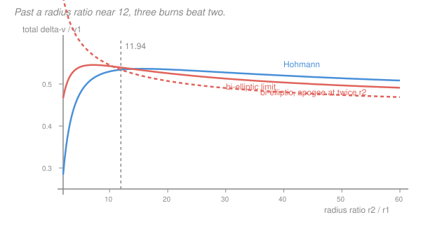

# Astrodynamics · Lesson 3.3: Bi-elliptic transfers

> ⏱ ~15 min · Module 3: Maneuvers & rendezvous · Builds on: [3.2](03-02-hohmann-transfers.md), [3.1](03-01-impulsive-maneuvers-delta-v.md) · Unlocks: 3.4 (plane changes)

## Why this matters

Problem P3 of [3.2](03-02-hohmann-transfers.md) turned up something strange: the Hohmann cost rises to a peak near a radius ratio of 15.6 and then *falls*. Going farther can cost less. If that's true, then for a distant target you should be able to overshoot deliberately, then come back down — and pay less than going straight there.

You can. The bi-elliptic transfer is the standard counterexample to "Hohmann is optimal," and it's worth studying for two reasons. Practically, it's genuinely used for large orbit changes and for combined raise-plus-plane-change maneuvers ([3.4](03-04-plane-changes-combined-maneuvers.md)), where it wins by much more than it does here. Conceptually, it's a clean demonstration that "the obvious cheapest path" and "the actual cheapest path" can differ, and that the delta-v currency behaves in ways your intuition about distance does not predict.

## The idea

The reason overshooting can pay is the Oberth effect ([3.1](03-01-impulsive-maneuvers-delta-v.md)) working in reverse.

Two of the three burns in a bi-elliptic transfer happen at a *very high* apoapsis, where the spacecraft is barely moving. At near-zero speed, small velocity changes reshape the orbit enormously — you can swing the perigee from one radius to a completely different one for almost nothing. A Hohmann transfer, by contrast, spends its second burn at a moderate radius where the spacecraft still has real speed, and speed changes there are expensive.

So the trade is:

- **Burn 1** (at $r_1$): more expensive than Hohmann's, because you're aiming much farther out. But it's capped — even aiming at infinity only costs the escape increment.
- **Burn 2** (at the far apoapsis $r_b$): very cheap, because you're barely moving. This is the burn that lowers the return leg's perigee down to your actual target.
- **Burn 3** (at $r_2$): a *retrograde* burn — you arrive from above moving too fast, and slow down to circularize.

For small radius ratios burn 1's penalty swamps the savings and Hohmann wins. For large ratios the savings win. The crossover for the limiting case ($r_b \to \infty$) is at

$$\frac{r_2}{r_1} = 11.94,$$

a number worth remembering. Between $11.94$ and about $15.58$ the answer depends on how far out you're willing to fly; above $15.58$ a bi-elliptic with finite $r_b$ beats Hohmann.

The catch is brutal, and it's why the maneuver is rarer than the theory suggests: the transfer takes **vastly** longer. Two half-ellipses out to a huge apoapsis can turn a two-day transfer into a two-week one for a fractional-percent fuel saving.

## The formal version

**Geometry.** Three circular-or-elliptical arcs, with an intermediate apoapsis radius $r_b > r_2$:

- **Ellipse 1** from $r_1$ (periapsis) to $r_b$ (apoapsis): $a_1 = (r_1+r_b)/2$.
- **Ellipse 2** from $r_b$ (apoapsis) down to $r_2$ (periapsis): $a_2 = (r_b+r_2)/2$.

**The three burns.**

$$\Delta v_1 = \sqrt{\mu\left(\frac{2}{r_1}-\frac{1}{a_1}\right)} - \sqrt{\frac{\mu}{r_1}} \qquad \text{(prograde, at } r_1)$$

$$\Delta v_2 = \sqrt{\mu\left(\frac{2}{r_b}-\frac{1}{a_2}\right)} - \sqrt{\mu\left(\frac{2}{r_b}-\frac{1}{a_1}\right)} \qquad \text{(prograde, at } r_b)$$

$$\Delta v_3 = \left|\sqrt{\frac{\mu}{r_2}} - \sqrt{\mu\left(\frac{2}{r_2}-\frac{1}{a_2}\right)}\right| \qquad \text{(\textbf{retrograde}, at } r_2)$$

$$\Delta v_{\rm total} = \Delta v_1 + \Delta v_2 + \Delta v_3.$$

*In words: climb past the target, nudge the return leg's perigee down onto it, then brake into the circle.* See [bi-elliptic transfer](../reference.md#bi-elliptic-transfer).

Note the sign flip on burn 3. Unlike Hohmann — where both burns are prograde — the bi-elliptic ends by **slowing down**, because you arrive falling from above rather than climbing from below.

**Transfer time.** Two half-ellipses:

$$t_{\rm total} = \pi\sqrt{\frac{a_1^3}{\mu}} + \pi\sqrt{\frac{a_2^3}{\mu}}.$$

**The break-even rule.** Let $R = r_2/r_1$. Comparing with Hohmann in the limit $r_b\to\infty$ (where both bi-elliptic burns at apoapsis become free escape-and-recapture increments):

| $R$ | Verdict |
|---|---|
| $R < 11.94$ | **Hohmann always wins**, for any $r_b$. |
| $11.94 < R < 15.58$ | Bi-elliptic wins only for sufficiently large $r_b$. |
| $R > 15.58$ | **Bi-elliptic wins** even for modest $r_b$. |

*In words: the switchover happens when the target orbit is roughly twelve to sixteen times the departure radius.* For reference, LEO to GEO is $R = 6.3$ — comfortably in Hohmann territory, which is why every commercial GEO mission uses one.

**Where the numbers come from.** In the limit $r_b\to\infty$, the bi-elliptic total approaches

$$\Delta v_{\rm bi}^{\infty} = (\sqrt2 - 1)\left(v_{c1} + v_{c2}\right) = (\sqrt2-1)\,v_{c1}\left(1 + \frac{1}{\sqrt R}\right),$$

which is simply "escape from $r_1$, then (time-reversed) escape from $r_2$" — you pay the escape increment at each end and nothing in between. Setting this equal to the Hohmann expression $F(R)$ from [3.2](03-02-hohmann-transfers.md) and solving numerically gives $R = 11.94$.

## Picture

## Worked examples

**Example 1 (mechanical — a case where bi-elliptic wins).** Transfer from $r_1 = 7000$ km to $r_2 = 210{,}000$ km ($R = 30$) about Earth, using $r_b = 420{,}000$ km.

*Hohmann:* $a_t = 108{,}500$ km, and

$$\Delta v_1 = 10.5839 - 7.5460 = 2.9521,\quad \Delta v_2 = 1.3777 - 0.3499 = 1.0278, \quad \Delta v_{\rm total} = 3.9799\ \mathrm{km/s},$$
$$t = \pi\sqrt{108{,}500^3/398{,}600} = 1.778\times10^5\ \mathrm{s} = 2.06\ \mathrm{days}.$$

*Bi-elliptic:* $a_1 = (7000+420{,}000)/2 = 213{,}500$ km, $a_2 = (420{,}000+210{,}000)/2 = 315{,}000$ km.

| Burn | Speeds (km/s) | $\Delta v$ (km/s) | Direction |
|---|---|---|---|
| 1, at $r_1$ | $7.5460 \to 10.5839$ | 3.0378 | prograde |
| 2, at $r_b$ | $0.1764 \to 0.7954$ | 0.6190 | prograde |
| 3, at $r_2$ | $1.5908 \to 1.3777$ | 0.2131 | **retrograde** |
| | | **3.8700** | |

$$t = \pi\sqrt{\frac{213{,}500^3}{398{,}600}} + \pi\sqrt{\frac{315{,}000^3}{398{,}600}} = 15.86\ \mathrm{days}.$$

**The trade, stated honestly.** The bi-elliptic saves $3.9799 - 3.8700 = 0.110$ km/s — **2.8 percent** — and costs $15.86/2.06 = 7.7$ times the flight time. Look at where the saving comes from: burn 2, at 420,000 km, moves the spacecraft's speed by 0.62 km/s and in doing so drops the perigee of the return leg from 7000 km to 210,000 km. Doing that same reshaping down at $r_2$ would cost far more, because the spacecraft is moving 1.4 km/s there rather than 0.18.

**Example 2 (why you'd care — the marginal case, and why nobody flies it).** Now $R = 15$, with $r_1 = 7000$ km, $r_2 = 105{,}000$ km, $r_b = 210{,}000$ km.

*Hohmann:* $\Delta v_{\rm total} = 4.0463$ km/s, $t = 0.763$ days.
*Bi-elliptic:* $\Delta v_1 = 2.9521$, $\Delta v_2 = 0.7750$, $\Delta v_3 = 0.3014$, total $= 4.0285$ km/s, $t = 5.66$ days.

The bi-elliptic saves **18 m/s — 0.44 percent** — for **7.4 times** the flight time. On a spacecraft with $I_{\rm sp} = 320$ s and a 2000-kg wet mass, that 18 m/s is about 11 kg of propellant. Meanwhile the mission spends an extra five days in the radiation belts with no station-keeping and a longer window for something to go wrong.

**Conclusion:** for pure orbit-raising, the bi-elliptic is usually a curiosity rather than a plan. Its real use is when the mission needs a **large plane change too** — because plane changes are cheapest where speed is lowest, and the bi-elliptic already sends you somewhere very slow. That combination, worked in [3.4](03-04-plane-changes-combined-maneuvers.md), is where three burns genuinely earn their keep.

## Watch out

- **You might expect all three burns to be prograde.** Burn 3 is retrograde. You approach $r_2$ from above, on the descending leg of ellipse 2, moving *faster* than the local circular speed — so you brake.
- **You might think bigger $r_b$ is always better.** In delta-v terms it monotonically improves toward the $r_b\to\infty$ limit, but the gains flatten quickly while the flight time grows as $r_b^{3/2}$. The practical optimum is set by mission duration, not by the delta-v curve.
- **You might apply the 11.94 threshold to finite $r_b$.** That number is the limiting case. For a realistic $r_b$ (say $2r_2$), the true break-even is higher — around $R = 15.6$.
- **You might forget the time cost when comparing.** A 0.4 percent delta-v saving that quadruples flight time is not a saving in any real mission's ledger. Always quote both numbers.
- **You might assume the intermediate apoapsis is a free parameter.** It's bounded above by the primary's sphere of influence ([4.1](04-01-sphere-of-influence-patched-conics.md)) — for Earth, roughly 925,000 km. Past that you're not on an Earth orbit at all.

## One-liner

> Overshoot the target, reshape the orbit where you're barely moving, then brake down onto it: three burns beat two once the target is more than about twelve times your starting radius — at a steep price in time.

## Problems

**P1 (🟢)** For $r_1 = 7000$ km, $r_2 = 105{,}000$ km, and $r_b = 210{,}000$ km, compute $a_1$ and $a_2$ and the total transfer time of the bi-elliptic maneuver.

**P2 (🟡)** A mission must go from $r_1 = 6678$ km to $r_2 = 42{,}164$ km (LEO to GEO). Without computing the bi-elliptic delta-v, state whether it could possibly beat the Hohmann transfer, and justify your answer with the radius ratio.

**P3 (🔴)** Derive the limiting bi-elliptic cost $\Delta v_{\rm bi}^\infty = (\sqrt2-1)(v_{c1}+v_{c2})$ as $r_b\to\infty$, and explain physically why the answer is exactly "escape from both ends."

Solutions

**P1**

$$a_1 = \frac{r_1+r_b}{2} = \frac{7000+210{,}000}{2} = 108{,}500\ \mathrm{km}, \qquad a_2 = \frac{r_b+r_2}{2} = \frac{210{,}000+105{,}000}{2} = 157{,}500\ \mathrm{km}.$$

$$t = \pi\sqrt{\frac{108{,}500^3}{398{,}600}} + \pi\sqrt{\frac{157{,}500^3}{398{,}600}} = \pi\sqrt{3.2043\times10^{9}} + \pi\sqrt{9.8017\times10^{9}}$$
$$= \pi(56{,}606) + \pi(99{,}004) = 177{,}844 + 311{,}029 = 488{,}873\ \mathrm{s} = 5.66\ \mathrm{days}.$$

*Check.* Against the Hohmann for the same endpoints ($a_t = 56{,}000$ km, $t = \pi\sqrt{56{,}000^3/398{,}600} = 65{,}930$ s $= 0.763$ days) this is 7.4 times longer ✓, matching Example 2.

**P2** The radius ratio is

$$R = \frac{42{,}164}{6678} = 6.31.$$

Since $6.31 < 11.94$, the bi-elliptic **cannot** beat the Hohmann transfer for *any* choice of intermediate apoapsis $r_b$. The threshold 11.94 is derived in the limiting case $r_b\to\infty$, which is the best the bi-elliptic can ever do; below that ratio even the infinitely patient version loses.

*Check.* Concretely, at $R = 6.31$ the Hohmann costs $0.5039\,v_{c1}$ ([3.2](03-02-hohmann-transfers.md), P3) while the limiting bi-elliptic costs $(\sqrt2-1)(1+1/\sqrt{6.31})\,v_{c1} = 0.4142(1.3982)\,v_{c1} = 0.5791\,v_{c1}$ — worse by 15 percent ✓. This is why no GEO mission uses one.

**P3** Take $r_b\to\infty$ in each burn.

*Burn 1:* $a_1 = (r_1+r_b)/2 \to \infty$, so $1/a_1\to0$ and

$$\Delta v_1 \to \sqrt{\frac{2\mu}{r_1}} - \sqrt{\frac{\mu}{r_1}} = (\sqrt2 - 1)v_{c1}.$$

That is exactly the escape increment from $r_1$ ([1.4](01-04-energy-vis-viva-orbit-types.md), Example 2).

*Burn 2:* both speeds at $r_b$ tend to zero as $r_b\to\infty$ (on ellipse 1, $v \to \sqrt{2\mu/r_b - \mu/a_1}\to 0$; likewise on ellipse 2). So

$$\Delta v_2 \to 0.$$

*Burn 3:* $a_2 = (r_b+r_2)/2\to\infty$, so the arrival speed on ellipse 2 tends to the escape speed at $r_2$:

$$\Delta v_3 \to \sqrt{\frac{2\mu}{r_2}} - \sqrt{\frac{\mu}{r_2}} = (\sqrt2-1)v_{c2}.$$

Summing:

$$\Delta v_{\rm bi}^\infty = (\sqrt2-1)(v_{c1} + v_{c2}) = (\sqrt2-1)v_{c1}\left(1 + \frac{1}{\sqrt R}\right). \;\blacksquare$$

**Why it's exactly escape at both ends.** In the limit, the trajectory becomes: escape from the inner circular orbit on a parabola, coast to infinity, and then — read backwards in time — fall from infinity onto the outer circular orbit and capture. Both legs are marginal-escape trajectories, so each end pays precisely the escape increment. The infinitesimal burn at $r_b$ is the only thing linking them, and at infinite radius it costs nothing: at zero speed, an arbitrarily small impulse redirects the trajectory arbitrarily.

*Check.* The formula is symmetric in $r_1$ and $r_2$ ✓, as it must be — in this limit the transfer forgets which end it started from, unlike the Hohmann transfer whose $F(R)$ is asymmetric. Numerically at $R = 11.94$: $(\sqrt2-1)(1+1/\sqrt{11.94}) = 0.4142(1.2894) = 0.5342$, versus the Hohmann $F(11.94) = 0.5341$ — equal to four figures ✓, confirming the threshold.

## Flashback

**From Lesson 3.2 (Hohmann transfers):** A spacecraft transfers from a circular orbit of radius 8000 km to one of radius 20,000 km about Earth. Find the two delta-v's and the total.

Solution

$$a_t = \frac{8000+20{,}000}{2} = 14{,}000\ \mathrm{km}.$$

$$v_{c1} = \sqrt{\frac{398{,}600}{8000}} = 7.0587, \qquad v_{c2} = \sqrt{\frac{398{,}600}{20{,}000}} = 4.4643\ \mathrm{km/s}.$$

$$v_{t,p} = \sqrt{398{,}600\left(\frac{2}{8000}-\frac{1}{14{,}000}\right)} = \sqrt{398{,}600(2.5\times10^{-4}-7.1429\times10^{-5})} = \sqrt{71.18} = 8.4368\ \mathrm{km/s},$$

$$v_{t,a} = \sqrt{398{,}600\left(\frac{2}{20{,}000}-\frac{1}{14{,}000}\right)} = \sqrt{398{,}600(1\times10^{-4}-7.1429\times10^{-5})} = \sqrt{11.389} = 3.3748\ \mathrm{km/s}.$$

$$\Delta v_1 = 8.4368-7.0587 = 1.3781, \qquad \Delta v_2 = 4.4643-3.3748 = 1.0895, \qquad \Delta v_{\rm total} = 2.468\ \mathrm{km/s}.$$

*Check.* $R = 2.5$, so $F(2.5)$ should be $\Delta v_{\rm total}/v_{c1} = 2.468/7.0587 = 0.3496$. From the closed form, $\sqrt{2(2.5)/3.5} - 1 + 1/\sqrt{2.5} - \sqrt{2/(2.5\times3.5)} = 0.19523 + 0.63246 - 0.47809 = 0.3496$ ✓. And $R = 2.5 \ll 11.94$, so Hohmann is definitely the right choice here ✓.

## Connections

- **Backward:** every speed is a vis-viva evaluation ([1.4](01-04-energy-vis-viva-orbit-types.md)); the comparison is against [3.2](03-02-hohmann-transfers.md)'s $F(R)$, whose non-monotonicity (P3 there) is what makes this maneuver possible at all; the cheapness of burn 2 is the Oberth effect from [3.1](03-01-impulsive-maneuvers-delta-v.md) read in reverse.
- **Forward:** [3.4](03-04-plane-changes-combined-maneuvers.md) is where bi-elliptic geometry pays off properly — a plane change at a distant, slow apoapsis is dramatically cheaper than one at the target orbit, and that saving is much larger than the fractional percent seen here.
- **Sideways (optimization):** this is a textbook **local versus global optimum**. Hohmann is the optimal *two-impulse* transfer; opening the search to three impulses reveals a better solution in a region the two-impulse formulation could not see — the same phenomenon as adding a variable and discovering the previous optimum was only a boundary point ([`convex-optimization` 1.1](../../convex-optimization/lessons/01-01-convex-sets-separating-hyperplane.md)).
