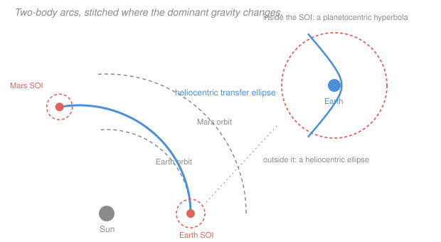

# Astrodynamics · Lesson 4.1: Sphere of influence & patched conics

> ⏱ ~15 min · Module 4: Interplanetary trajectories & perturbations · Builds on: [1.1](01-01-relative-two-body-problem.md), [1.4](01-04-energy-vis-viva-orbit-types.md) · Unlocks: 4.2 (interplanetary Hohmann transfers)

## Why this matters

Everything in Modules 1 through 3 assumed exactly two bodies. A spacecraft going to Mars has at least three that matter — the Sun, Earth, and Mars — and the three-body problem has no closed-form solution. Numerically integrating it is possible, but you can't *design* a mission that way: you need to be able to ask "what if I leave two weeks later" and get an answer in seconds.

Patched conics is the engineering answer, and it's a beautiful one: pretend only one body matters at a time, and switch bodies at the right moment. The resulting trajectories are wrong by a fraction of a percent — and every interplanetary mission ever flown was designed with them, then handed to a numerical integrator for the final polish.

## The idea

Gravity never switches off, so strictly you always have three attractors. But most of the time one of them dominates so thoroughly that the others are corrections rather than players.

The question is *where* the handover happens. The naive answer — where the two gravitational forces are equal — turns out to be the wrong criterion, and understanding why is the point of this lesson.

What matters for orbital mechanics is not which force is bigger in absolute terms, but which body's pull is better treated as **the central force** versus which is better treated as a **perturbation**. And a perturbation's importance is measured relative to the central force you're comparing it against. Near Earth, the Sun's pull on a satellite is actually *larger* than Earth's in absolute magnitude — but it pulls the satellite and the Earth almost identically, so the *differential* effect on the relative orbit is tiny. That differential, not the raw force, is what matters.

Working that out gives the **sphere of influence**: a boundary whose radius scales as the mass ratio to the two-fifths power. Inside it, treat the planet as the primary and the Sun as a nuisance; outside it, the reverse.

The trajectory is then built in pieces. Inside Earth's sphere of influence, a hyperbola about Earth. Outside, an ellipse about the Sun. Inside Mars's sphere, a hyperbola about Mars. At each boundary you match position and velocity by vector addition — the spacecraft's heliocentric velocity is the planet's orbital velocity plus its planetocentric velocity — and you have a complete trajectory.

## The formal version

**Why not equal forces?** At distance $d$ from a planet of mass $m$ at heliocentric distance $R$ from the Sun of mass $M$, forces balance when $Gm/d^2 = GM/R^2$, giving $d = R\sqrt{m/M}$. For Earth that's

$$d = 1.496\times10^8\sqrt{\frac{5.974\times10^{24}}{1.989\times10^{30}}} = 2.6\times10^5\ \mathrm{km},$$

which is *inside* the Moon's orbit — implying the Moon orbits the Sun, not Earth. Which, in a raw-force sense, it does. But the Moon's path is manifestly better described as an orbit around Earth. The equal-force criterion is asking the wrong question.

**The right question.** Compare, for each choice of primary, the ratio (perturbing acceleration)/(central acceleration). Laplace's criterion puts the boundary where the two ratios are equal, giving the **sphere of influence** radius

$$\boxed{\;r_{\rm SOI} = R\left(\frac{m}{M}\right)^{2/5}.\;}$$

*In words: the handover distance is the planet's orbital radius scaled by the two-fifths power of the mass ratio.* See [sphere of influence](../reference.md#sphere-of-influence). The exponent $2/5$ rather than $1/2$ is what pushes the boundary out by a factor of $(M/m)^{1/10}$ — for Earth, a factor of 3.6.

| Body | $r_{\rm SOI}$ (km) | As a multiple of the body's radius |
|---|---|---|
| Mercury | 112,000 | 46 |
| Venus | 616,000 | 102 |
| **Earth** | **925,000** | **145** |
| **Mars** | **577,000** | **170** |
| Jupiter | 48,200,000 | 674 |
| Moon (about Earth) | 66,200 | 38 |

Note Earth's SOI at 925,000 km comfortably contains the Moon's orbit at 384,400 km ✓ — the criterion now gives the physically sensible answer.

**The scale that makes it all work.** Earth's SOI is 925,000 km, but the Earth-to-Mars transfer covers $7.8\times10^7$ km of radial change. The SOI is about **1 percent** of the journey. On a diagram of the solar system it's a dot. That's exactly why patching works: the "wrong" regions are negligibly small.

**The patched-conic method.**

1. **Departure (planetocentric).** Inside Earth's SOI, a hyperbolic escape trajectory from the parking orbit. What matters is the **hyperbolic excess velocity** $\mathbf v_\infty$ ([1.4](01-04-energy-vis-viva-orbit-types.md)) — the velocity left over as the spacecraft leaves the SOI.

2. **Cruise (heliocentric).** Treat the SOI as a point at the planet's location. The spacecraft's heliocentric velocity on departure is

$$\mathbf v_{\rm helio} = \mathbf v_{\rm planet} + \mathbf v_\infty,$$

*in words: the planet's orbital velocity plus whatever you left the SOI with.* This is a **two-body ellipse about the Sun**, propagated with the machinery of Modules 1 and 2.

3. **Arrival (planetocentric).** At Mars's SOI, subtract:

$$\mathbf v_\infty^{\rm arr} = \mathbf v_{\rm helio}^{\rm arr} - \mathbf v_{\rm Mars}.$$

Since the spacecraft enters with $\varepsilon > 0$ relative to Mars, its arrival trajectory is *always* a **hyperbola** — you cannot be captured without a burn. That's why every orbiter carries a large propulsion system and every flyby doesn't.

**The three assumptions, and what they cost.**

| Assumption | Reality | Error |
|---|---|---|
| SOI treated as a point in the heliocentric leg | It's 925,000 km across | small, since it's 1 percent of the transfer |
| Instantaneous handover at the boundary | Gravity is continuous | velocity mismatch of order 0.1 percent |
| Planets in circular coplanar orbits (usually assumed) | Mars has $e = 0.093$, $i = 1.85^\circ$ | a few percent in $\Delta v$ |

Patched conics give trajectory estimates good to roughly 1 percent — enough for mission design, launch-window analysis, and delta-v budgeting, and not enough for navigation. Real missions refine with numerical integration and mid-course corrections of a few tens of m/s.

## Picture

## Worked examples

**Example 1 (mechanical — compute a sphere of influence).** Mars has mass $6.417\times10^{23}$ kg and orbits at $R = 2.279\times10^8$ km; the Sun has $M = 1.989\times10^{30}$ kg.

$$\frac{m}{M} = \frac{6.417\times10^{23}}{1.989\times10^{30}} = 3.2263\times10^{-7},$$

$$r_{\rm SOI} = 2.279\times10^8\,(3.2263\times10^{-7})^{2/5}.$$

Take logs: $\ln(3.2263\times10^{-7}) = -14.949$, times $0.4$ gives $-5.9796$, and $e^{-5.9796} = 2.5320\times10^{-3}$. So

$$r_{\rm SOI} = 2.279\times10^8 \times 2.5320\times10^{-3} = 5.77\times10^5\ \mathrm{km}.$$

That's 577,000 km, or **170 Mars radii**. Compare with the naive equal-force radius $R\sqrt{m/M} = 2.279\times10^8\times5.680\times10^{-4} = 1.29\times10^5$ km — the correct criterion pushes the boundary out by a factor of 4.5.

**Example 2 (why you'd care — Jupiter's enormous reach).** Jupiter has $m/M = 9.542\times10^{-4}$ and $R = 7.783\times10^8$ km:

$$r_{\rm SOI} = 7.783\times10^8\,(9.542\times10^{-4})^{0.4} = 7.783\times10^8\times0.061924 = 4.82\times10^7\ \mathrm{km}.$$

**48 million km — a third of Earth's distance from the Sun, and 674 Jupiter radii.** Two consequences follow directly.

*First, Jupiter is easy to hit.* A spacecraft aiming for Jupiter has a target 48 million km wide. Trajectory errors that would miss Mars entirely still land you inside Jupiter's SOI, where its gravity does the rest of the work. Galileo, Juno, and both Voyagers all exploited this.

*Second, Jupiter is the solar system's gravitational bully.* An SOI that large means Jupiter perturbs comets and asteroids across a huge swath of the outer solar system. It is why the asteroid belt has Kirkwood gaps at Jupiter-resonant semi-major axes, why Jupiter-family comets exist as a distinct population, and why gravity assists at Jupiter ([4.3](04-03-gravity-assists.md)) can be so violent — Voyager 2 gained about 10 km/s of heliocentric speed there, more than any chemical rocket could supply.

## Watch out

- **You might use the equal-force radius.** It's a factor of 3 to 5 too small and gives physically wrong answers (the Moon "orbiting" the Sun). The $2/5$ exponent is the right one.
- **You might think the SOI is a hard boundary.** It's a modeling convenience, and the trajectory has a small velocity discontinuity there. Real integrators include all bodies continuously and never patch anything.
- **You might forget that arrival is always hyperbolic.** Approaching a planet from interplanetary space, your energy relative to that planet is positive by construction. Without a burn (or an atmosphere), you fly past. Capture is never free.
- **You might add speeds instead of velocities at the patch.** $\mathbf v_{\rm helio} = \mathbf v_{\rm planet} + \mathbf v_\infty$ is a **vector** sum. Departing in the planet's direction of motion is very different from departing across it, and the difference is the whole art of [4.2](04-02-interplanetary-hohmann-hyperbolic-legs.md).
- **You might treat the SOI as spherical for the Moon.** At 66,200 km versus an orbital radius of 384,400 km, the Moon's SOI is 17 percent of its orbit — big enough that the sphere approximation degrades noticeably. Lunar trajectories usually get a fuller three-body treatment ([4.5](04-05-restricted-three-body-lagrange-points.md)).

## One-liner

> Pretend one body attracts you at a time, and switch at $r_{\rm SOI} = R(m/M)^{2/5}$ — a boundary small enough to be a dot on the transfer and large enough to contain everything that matters near the planet.

## Problems

**P1 (🟢)** Venus has mass $4.867\times10^{24}$ kg and orbits at $1.082\times10^8$ km. Compute its sphere of influence radius, and express it as a multiple of Venus's radius (6052 km).

**P2 (🟡)** Compute the Moon's sphere of influence about Earth ($m_{\rm moon}/m_\oplus = 0.0123$, lunar orbital radius 384,400 km). Then explain what it means for a lunar mission that this SOI is 17 percent of the Earth–Moon distance, whereas Earth's SOI is only 0.6 percent of the Earth–Sun distance.

**P3 (🔴)** A spacecraft leaves Earth's SOI with $v_\infty = 3.0$ km/s directed exactly along Earth's orbital velocity (29.78 km/s). Find its heliocentric speed and the semi-major axis of its heliocentric orbit ($\mu_\odot = 1.327\times10^{11}\ \mathrm{km^3/s^2}$, $r = 1.496\times10^8$ km). Does it reach Mars's orbit at $2.279\times10^8$ km?

Solutions

**P1**

$$\frac{m}{M} = \frac{4.867\times10^{24}}{1.989\times10^{30}} = 2.4470\times10^{-6}.$$

$$\left(2.4470\times10^{-6}\right)^{0.4}: \quad \ln(2.4470\times10^{-6}) = -12.921, \quad \times 0.4 = -5.1684, \quad e^{-5.1684} = 5.6944\times10^{-3}.$$

$$r_{\rm SOI} = 1.082\times10^8 \times 5.6944\times10^{-3} = 6.16\times10^5\ \mathrm{km} = 616{,}000\ \mathrm{km}.$$

As a multiple of Venus's radius: $616{,}000/6052 = 102$.

*Check.* Venus is slightly less massive than Earth but much closer to the Sun, so its SOI should be smaller than Earth's 925,000 km on both counts ✓.

**P2** Here the "Sun" is Earth and the "planet" is the Moon:

$$r_{\rm SOI} = 384{,}400\,(0.0123)^{0.4}.$$

$$\ln(0.0123) = -4.3979, \quad \times0.4 = -1.75916, \quad e^{-1.75916} = 0.17218.$$

$$r_{\rm SOI} = 384{,}400\times0.17218 = 66{,}200\ \mathrm{km}.$$

**What it means for lunar missions.** For an interplanetary transfer, Earth's SOI is 0.6 percent of the distance to the Sun and about 1 percent of a Mars transfer's radial span — so treating it as a single point is an excellent approximation, and patched conics work well. The Moon's SOI at 17 percent of the Earth–Moon distance is *not* small: the spacecraft spends a substantial fraction of both the distance and the flight time in a region where Earth's and the Moon's gravity are comparable. Consequences: the patched-conic estimate for a lunar trajectory is noticeably less accurate (errors of several percent rather than a fraction of one); the "point-mass Moon at a point-mass SOI" idealization breaks down; and genuinely three-body phenomena — the Lagrange points, weak-stability-boundary transfers, low-energy capture — become available and useful ([4.5](04-05-restricted-three-body-lagrange-points.md)).

*Check.* $66{,}200 < 384{,}400$ ✓, so the SOI doesn't swallow Earth, and it is 38 lunar radii ✓ — comparable to Mercury's 46, consistent with the Moon being a small body close to its primary.

**P3** Departing along Earth's motion, the velocities add as scalars:

$$v_{\rm helio} = v_\oplus + v_\infty = 29.78 + 3.00 = 32.78\ \mathrm{km/s}.$$

Specific energy about the Sun:

$$\varepsilon = \frac{v^2}{2} - \frac{\mu_\odot}{r} = \frac{32.78^2}{2} - \frac{1.327\times10^{11}}{1.496\times10^8} = 537.24 - 886.98 = -349.74\ \mathrm{km^2/s^2}.$$

Negative, so the orbit is bound (as required — 3 km/s is far short of solar escape). Then

$$a = -\frac{\mu_\odot}{2\varepsilon} = \frac{1.327\times10^{11}}{699.48} = 1.897\times10^8\ \mathrm{km}.$$

Departure is at perihelion (the burn was purely along-track from a circular orbit), so

$$r_{\rm aphelion} = 2a - r_{\rm perihelion} = 2(1.897\times10^8) - 1.496\times10^8 = 2.298\times10^8\ \mathrm{km}.$$

Since $2.298\times10^8 > 2.279\times10^8$, **yes — it reaches Mars's orbit**, with about 1.9 million km to spare.

*Check.* The minimum departure $v_\infty$ for a Hohmann to Mars is $32.728 - 29.784 = 2.94$ km/s ([4.2](04-02-interplanetary-hohmann-hyperbolic-legs.md)), and $3.0 > 2.94$ ✓ — so the answer had to be yes, and only barely. This razor-thin margin is why interplanetary launch energy ($C_3 = v_\infty^2$) is quoted so precisely: 3.0 km/s makes it, 2.9 km/s does not.

## Flashback

**From Lesson 3.3 (Bi-elliptic transfers):** A bi-elliptic transfer from $r_1 = 8000$ km uses an intermediate apoapsis of $r_b = 500{,}000$ km. Comment on whether this is a legitimate Earth orbit, given Earth's sphere of influence.

Solution

Earth's sphere of influence has radius $r_{\rm SOI} = 925{,}000$ km. Since

$$r_b = 500{,}000\ \mathrm{km} < 925{,}000\ \mathrm{km},$$

the apoapsis lies **inside** Earth's SOI, so treating the trajectory as a two-body Earth orbit is legitimate — just barely. But two caveats: the apoapsis is at 54 percent of the SOI radius, where solar perturbations are already significant (they scale steeply with distance), so the actual trajectory would deviate noticeably from the ideal ellipse; and at 500,000 km the spacecraft passes well beyond the Moon's orbit at 384,400 km, so lunar perturbations — and possibly a lunar SOI passage — would have to be checked.

*Check.* The transfer time to that apoapsis is $\pi\sqrt{a_1^3/\mu}$ with $a_1 = 254{,}000$ km, giving $\pi\sqrt{254{,}000^3/398{,}600} = 6.4\times10^5$ s $= 7.4$ days each way ✓ — plenty of time for perturbations to accumulate, reinforcing the point that a "two-body" orbit near the SOI edge is a fiction. ✓

## Connections

- **Backward:** the SOI criterion is the two-body reduction of [1.1](01-01-relative-two-body-problem.md) asking when a third body counts as a perturbation; $v_\infty$ comes from the hyperbolic energy of [1.4](01-04-energy-vis-viva-orbit-types.md); each conic arc is propagated with [2.5](02-05-universal-variables-time-of-flight.md)'s universal variables.
- **Forward:** [4.2](04-02-interplanetary-hohmann-hyperbolic-legs.md) fills in the actual numbers for an Earth-to-Mars trip; [4.3](04-03-gravity-assists.md) uses the SOI as the boundary across which a flyby exchanges momentum with a planet; [4.5](04-05-restricted-three-body-lagrange-points.md) drops the patching entirely and treats three bodies honestly.
- **Sideways (applied math):** patched conics is a **matched asymptotic expansion** — an inner solution (planetocentric) and an outer solution (heliocentric), each valid in its own regime, joined in an overlap region. The same technique handles boundary layers in fluid dynamics ([`fluid-dynamics` 3.4](../../fluid-dynamics/lessons/03-04-boundary-layers.md)) and singular perturbations throughout applied mathematics.
