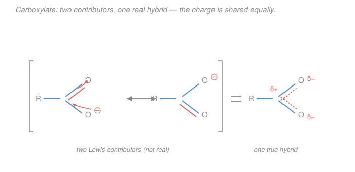

# Organic Chemistry · Lesson 1.2: Resonance, formal charge & delocalization

> ⏱ ~15 min · Module 1: Structure, Bonding & Stereochemistry · Builds on: [1.1 Bonding, hybridization & molecular shape](01-01-bonding-hybridization-molecular-shape.md), [general chemistry: Lewis structures & formal charge](../../general-chemistry/lessons/01-04-ionic-covalent-bonds-lewis-structures.md) · Unlocks: [1.3 Acids & bases in organic chemistry](01-03-acids-bases-organic.md)

## Why this matters

A single Lewis structure is often a lie — a convenient one, but a lie. Real molecules like the carboxylate ion $\ce{RCOO-}$, benzene, and the peptide bond that stitches your proteins together have electrons *spread out* over several atoms, and no one dot-and-line drawing can show that. **Resonance** is the workaround: draw a few legal structures, and understand the truth to be their blend. Getting this right is not decoration — it decides which molecules are acidic (next lesson), which sites a reaction attacks, and why an amide won't rotate. Nearly every "why" in the rest of this course routes through delocalization.

## The idea

Here is the one sentence to carry out of this lesson: **resonance structures are not real, and the molecule does not flip between them.** The molecule is *one* fixed thing — a single **hybrid** — whose electron distribution we can't capture in one Lewis drawing, so we sketch two or three "contributors" and let your mind average them.

The classic analogy: a rhinoceros is not a unicorn on Mondays and a dragon on Tuesdays. If the only two animals you'd ever seen were unicorns and dragons, you might describe a rhino as "a blend of the two." The rhino is a single real animal at all times; the unicorn and dragon are just the drawings you had on hand. Same with the carboxylate ion: it isn't rapidly switching which oxygen holds the double bond — *both* C–O bonds are permanently, identically one-and-a-half bonds, and the negative charge sits half on each oxygen, always.

Why does nature bother? Because **spreading electrons out lowers energy.** A negative charge crammed onto one atom is high-energy and reactive; smeared over two or three atoms, it's calmer and more stable. Delocalization *is* stabilization — that single fact explains acidity, the special inertness of benzene, and the rigidity of proteins.

## The formal version

**Formal charge (the bookkeeping).** For any atom in a Lewis structure,

$$\text{FC} = (\text{valence electrons}) - (\text{nonbonding electrons}) - \tfrac{1}{2}(\text{bonding electrons}).$$

*In words: start with the atom's normal electron count, subtract every lone-pair electron it fully owns, and subtract half of every shared (bonding) electron* — because in a bond you "own" one of the two electrons. A neutral atom in a happy structure has $\text{FC}=0$; positive means electron-poor, negative electron-rich. (This is exactly the formal-charge tool from [general chemistry](../../general-chemistry/lessons/01-04-ionic-covalent-bonds-lewis-structures.md), now doing real work.)

**Curved arrows (the grammar of electron motion).** To convert one contributor into another we push electrons with a **double-headed curved arrow** (the harpoon "⌢" with a full arrowhead). Its rules:

- An arrow moves a **pair** of electrons — either a $\pi$ bond or a lone pair — starting from where the electrons *are* and pointing to where they *go* (an adjacent atom or bond).
- **Only electrons move; atoms never move.** The nuclei stay bolted in place across all contributors.
- **Conserve the octet.** No period-2 atom (C, N, O, F) may ever exceed 8 electrons. If an arrow would give oxygen a fifth bond, it's illegal.

*In words: a curved arrow is a verb — "this electron pair relocates one stop over" — and the skeleton of atoms is the fixed stage it happens on.*

**What makes a contributor legal.** A valid resonance structure must have (1) the **same atom positions** as every other contributor, (2) the **same total number of electrons and the same overall charge**, and (3) **no expanded octets** on period-2 atoms. Break any of these and you've drawn a different molecule, not a resonance form.

**Weighting: major vs. minor.** Contributors don't count equally. The **major** contributor (the one the hybrid most resembles) is favored when it has:

1. **more bonds / more filled octets** (every atom with a complete octet is worth a lot);
2. **negative charge on the more electronegative atom**, and positive charge on the more electropositive atom;
3. **less charge separation** overall (a neutral structure beats a charge-separated one, all else equal).

*In words: the best contributor spreads electrons into full octets and puts any leftover negative charge on the atom most willing to hold it.* When two or more contributors are **equivalent** (identical by symmetry, like the two forms of carboxylate), the stabilization is maximal — the charge is shared perfectly evenly.

A few molecules everyone must know by sight: **benzene** (two equivalent Kekulé structures; the six $\pi$ electrons are one smooth ring, which is why all six C–C bonds are equal and benzene is unusually stable — Module 3), the **nitro group** $\ce{-NO2}$ (two equivalent forms spreading the charge over both oxygens), the **allyl** cation/anion, and the **amide**, all below.

## Picture

Two arrows do the whole job: the lone pair on the negatively charged oxygen swings up to become a new C=O $\pi$ bond, while the old C=O $\pi$ bond folds down onto its oxygen as a lone pair. Atoms never budged — only two electron pairs slid one stop. Because the two contributors are mirror-identical, the real hybrid (right) has each C–O bond at bond order 1.5 and each oxygen carrying exactly $-\tfrac12$ charge.

## Worked examples

**Example 1 (mechanical — the allyl cation).** Draw the second contributor of the allyl cation $\ce{CH2=CH-CH2+}$.

The empty $p$ orbital on the $\ce{CH2+}$ carbon sits right next to a C=C $\pi$ bond. Push that $\pi$ pair over one stop with a curved arrow: it becomes a new C=C bond between the middle and right carbons, and the positive charge lands on the *left* carbon, which is now the $\ce{CH2+}$:

$$\ce{CH2=CH-CH2+ <-> {}^{+}CH2-CH=CH2}$$

*In words:* the arrow starts at the $\pi$ bond and ends on the C–C bond adjacent to the cation. The two contributors are equivalent, so the hybrid carries $+\tfrac12$ charge on **each** terminal carbon and a bond order of 1.5 across both C–C bonds — the positive charge is delocalized, which is exactly why allylic cations form so readily. (Swap the empty orbital for a lone pair and identical logic gives the resonance-stabilized allyl *anion*.)

**Example 2 (why you'd care — the amide and protein rigidity).** An amide is $\ce{R-C(=O)-NR2}$. The nitrogen's lone pair sits next to the C=O. Push it:

$$\ce{R-C(=O)-NR2 <-> R-C(-O^-)=NR2+}$$

The minor (right) contributor puts a full C=N double bond in place. It's minor — it has charge separation — but it's *significant* because it places the negative charge on electronegative oxygen. The consequence is huge: the real C–N bond has **partial double-bond character**, so it **cannot rotate freely**. That locked, planar peptide bond is why proteins fold into definite shapes instead of flopping around — a direct, load-bearing use of resonance in biology (see the [biochemistry syllabus](../../biochemistry/syllabus.md)).

## Watch out

- **You might think the molecule oscillates between contributors.** It does not — there is no flipping, no equilibrium, no "half the time this form." The hybrid is one static structure; the contributors are drawings, and the double-headed arrow "↔" means "average these," *not* the equilibrium arrows "⇌".
- **You might move an atom to make a "resonance structure."** If a hydrogen (or any nucleus) changed position, you drew a different molecule (often a tautomer), not a resonance form. Only electron pairs may move.
- **You might let oxygen or nitrogen exceed an octet.** Every curved arrow that *makes* a bond must be paired with awareness of what it *breaks* — you can't just add a fifth bond to carbon or a third to a neutral oxygen. Count to eight, always.
- **You might treat all contributors as equal.** A minor contributor can be nearly irrelevant (tiny weight) yet still matter for explaining one specific property. Weighting is the whole art.

## One-liner

> A molecule is one hybrid, not a flip-book; curved arrows slide electron pairs (never atoms) between legal contributors, and every bit of delocalization is a discount on energy.

## Problems

**P1 (🟢)** For each species, draw the second resonance contributor and the curved arrow(s) that generate it. (a) the allyl-type cation $\ce{CH2=CH-CH2+}$; (b) the nitrite ion $\ce{NO2-}$ (start from $\ce{O=N-O^-}$).

**P2 (🟡)** Diazomethane can be drawn two ways: **(I)** $\ce{CH2=N+=N-}$ and **(II)** $\ce{CH2^{-}-\overset{+}{N}#N}$ (a C–N single bond, a lone pair on carbon, and an N≡N triple bond). Assign the formal charge on every heavy atom in each structure, confirm both are neutral overall, and decide which is the **major** contributor and why.

**P3 (🔴)** Explain, using resonance, why the two carbon–oxygen bonds in the acetate ion $\ce{CH3COO-}$ are found to be **identical** in length — and that length is *between* a normal C–O single bond and a C=O double bond. Then argue why this makes acetate especially stable, and connect that to why a carboxylic acid like acetic acid is far more acidic than an alcohol.

Solutions

**P1.**

**(a)** The empty $p$ orbital on the terminal $\ce{CH2+}$ is adjacent to the C=C $\pi$ bond. One curved arrow, from the $\pi$ bond to the neighboring C–C position, moves the double bond over and drops the charge on the far carbon:

$$\ce{CH2=CH-CH2+ <-> {}^{+}CH2-CH=CH2}$$

Arrow: tail on the C=C $\pi$ bond, head on the C–C bond next to the cationic carbon. The two forms are equivalent, so the charge is shared equally over the two ends.

**(b)** Nitrite is bent with N in the middle: $\ce{O=N-O^-}$ (nitrogen also bears one lone pair). Two arrows: the lone pair on the singly-bonded $\ce{O^-}$ becomes a new N=O bond, and the original N=O $\pi$ bond folds onto its oxygen as a lone pair:

$$\ce{O=N-O^- <-> {}^{-}O-N=O}$$

The two contributors are equivalent, so each oxygen carries $-\tfrac12$ and each N–O bond has order 1.5 — the same pattern as carboxylate, just with nitrogen at the center.

**P2.** Use $\text{FC} = \text{valence} - \text{nonbonding} - \tfrac12(\text{bonding})$; valences are C = 4, N = 5.

*Structure I, $\ce{CH2=N+=N-}$:*
- Carbon: 2 C–H + one C=N (4 bonds, 8 bonding e⁻), no lone pairs. $\text{FC}=4-0-\tfrac12(8)=0$.
- Central N: one C=N + one N=N (4 bonds), no lone pairs. $\text{FC}=5-0-\tfrac12(8)=+1$.
- Terminal N: one N=N double bond + 2 lone pairs (4 nonbonding e⁻). $\text{FC}=5-4-\tfrac12(4)=-1$.
- Sum: $0+1-1=0$. ✓ (neutral)

*Structure II, $\ce{CH2^{-}-\overset{+}{N}#N}$:*
- Carbon: 2 C–H + 1 C–N single bond (3 bonds, 6 bonding e⁻) + 1 lone pair (2 nonbonding). $\text{FC}=4-2-\tfrac12(6)=-1$.
- Central N: 1 C–N single + 1 N≡N triple (4 bonds), no lone pairs. $\text{FC}=5-0-\tfrac12(8)=+1$.
- Terminal N: one N≡N triple bond (6 bonding e⁻) + 1 lone pair (2 nonbonding). $\text{FC}=5-2-\tfrac12(6)=0$.
- Sum: $-1+1+0=0$. ✓ (neutral)

Both have the same number of bonds and complete octets everywhere, and both carry a $+1$/$-1$ charge separation — so rules 1 and 3 don't break the tie. The deciding rule is **rule 2: put the negative charge on the more electronegative atom.** Structure I places $-1$ on **nitrogen**; structure II places $-1$ on **carbon**. Nitrogen is more electronegative than carbon, so **Structure I, $\ce{CH2=N+=N-}$, is the major contributor.** (This is why diazomethane's reactive end is the carbon — it retains partial carbanion character from the minor form.)

**P3.** Acetate has two resonance contributors, generated by exactly the carboxylate arrows in the figure:

$$\ce{CH3-C(=O)-O^- <-> CH3-C(-O^-)=O}$$

These two are **equivalent** (interchanging the two oxygens gives back the same drawing), so the real ion is a perfectly symmetric hybrid: each C–O bond is the *average* of a single and a double bond — bond order 1.5 — and therefore the two bonds are **identical in length**, sitting between a C–O single bond (~$1.36$ Å) and a C=O double bond (~$1.20$ Å), measured at about $1.26$ Å. A single Lewis structure would (falsely) predict one short bond and one long bond; the equal lengths are direct experimental proof that resonance is real.

**Why this stabilizes acetate:** the negative charge is not stuck on one oxygen — it is spread equally ($-\tfrac12$ each) over two electronegative oxygens. Spreading charge over more atoms lowers electrostatic energy, so acetate is much lower in energy (more stable) than a hypothetical localized $\ce{-O}$ would be.

**Connection to acidity:** an acid is more acidic when its **conjugate base is more stable** (the deprotonation equilibrium lies further toward dissociation). Removing $\ce{H+}$ from acetic acid $\ce{CH3COOH}$ gives resonance-stabilized acetate; removing $\ce{H+}$ from an alcohol $\ce{CH3CH2OH}$ gives an alkoxide $\ce{CH3CH2O-}$ whose charge is stuck on **one** oxygen with no resonance help. The extra stabilization of the carboxylate is exactly why acetic acid ($\mathrm{p}K_a \approx 4.8$) is roughly a *trillion* times more acidic than ethanol ($\mathrm{p}K_a \approx 16$). We make this quantitative next lesson.

## Connections

- **Backward:** this extends the **Lewis structures and formal charge** you built in [general chemistry](../../general-chemistry/lessons/01-04-ionic-covalent-bonds-lewis-structures.md) — the same dots and the same $\text{FC}$ formula, now used to compare *multiple* legal drawings. The $\pi$ bonds being pushed around are the ones from the hybridization picture in [1.1](01-01-bonding-hybridization-molecular-shape.md): delocalization is a set of parallel $p$ orbitals sharing electrons sideways.
- **Forward:** [1.3 Acids & bases in organic chemistry](01-03-acids-bases-organic.md) turns "the more stable conjugate base wins" into $\mathrm{p}K_a$ numbers, with resonance as the number-one stabilizing factor. Curved arrows graduate from bookkeeping to **reaction mechanisms** in Module 2, and the delocalized $\pi$ systems here become **aromaticity** and **electrophilic aromatic substitution** in Module 3.
- **Sideways:** resonance stabilization is a thermodynamic argument — the same "lower energy = more favorable" reasoning as equilibrium constants in [general chemistry equilibrium](../../general-chemistry/lessons/03-04-chemical-equilibrium-k-le-chatelier.md), and it underpins the rigidity of the peptide bond central to the [biochemistry](../../biochemistry/syllabus.md) track.
