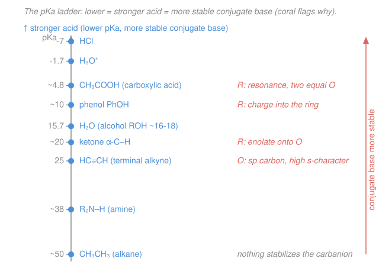

# Organic Chemistry · Lesson 1.3: Acids & bases, the organic way

> ⏱ ~15 min · Module 1: Structure, Bonding & Stereochemistry · Builds on: [1.2 Resonance, formal charge & delocalization](01-02-resonance-formal-charge-delocalization.md), [general-chem 4.1 (acids, bases, pH, strength)](../../general-chemistry/lessons/04-01-acids-bases-ph-strength.md) · Unlocks: [1.4 Alkanes & conformational analysis](01-04-alkanes-conformational-analysis.md)

## Why this matters

Half of organic chemistry is a proton going somewhere. Before almost every substitution, elimination, or carbonyl reaction, a base rips off a proton — or an acid slaps one on — and *which* proton, and *how easily*, decides what happens next. So you need to predict acidity of a C–H, O–H, or N–H bond on sight, from structure alone, without a table. The trick is to stop staring at the acid and instead look at what's left behind after it loses $\ce{H+}$: the **conjugate base**. This is the equilibrium/$\mathrm{p}K_a$ reasoning from [general chemistry](../../general-chemistry/lessons/04-01-acids-bases-ph-strength.md), now aimed at carbon — and it runs on the resonance and formal-charge tools from [1.2](01-02-resonance-formal-charge-delocalization.md).

## The idea

A **Brønsted acid** donates a proton ($\ce{H+}$); a **Brønsted base** accepts one. In organic chemistry we care about *how strong* an acid is — how willingly it lets the proton go — and we measure that with $\mathrm{p}K_a$: **low $\mathrm{p}K_a$ = strong acid**, high $\mathrm{p}K_a$ = weak acid. (Formally $\mathrm{p}K_a = -\log K_a$, so each unit is a factor of ten in the dissociation equilibrium.)

Here is the one move that unlocks everything: **an acid is strong exactly when its conjugate base is stable.** Think of it as a marriage. If the proton leaves and the negative charge that's left behind is comfortable — spread out, sitting on a happy atom — then the proton leaves easily, and the acid is strong. If the leftover anion is miserable and high-energy, it clings to the proton, and the acid is weak. So **to rank acids, rank the stability of their conjugate bases** (the more stable base wins = comes from the stronger acid = lower $\mathrm{p}K_a$).

That reframes a hard question ("how acidic is this?") into a question you already know how to answer from [1.2](01-02-resonance-formal-charge-delocalization.md): "how stable is this anion?" Four factors settle it, and they spell **ARIO**.

## The formal version

For an acid $\ce{HA}$, the equilibrium

$$\ce{HA + H2O <=> A- + H3O+}, \qquad K_a = \frac{[\ce{A-}][\ce{H3O+}]}{[\ce{HA}]}, \qquad \mathrm{p}K_a = -\log K_a$$

*In words: $K_a$ measures how far the acid dissociates; the more stable the conjugate base $\ce{A-}$, the further right this sits, the larger $K_a$, the smaller $\mathrm{p}K_a$.* (This is [general-chem 3.4](../../general-chemistry/lessons/03-04-chemical-equilibrium-k-le-chatelier.md)'s equilibrium constant with a specific reaction plugged in.)

**ARIO — four levers on conjugate-base stability**, in rough order of decreasing pull:

- **A — Atom.** Which atom carries the negative charge? Two sub-rules. *Across a row* (left→right), more electronegative atoms hold the charge better: acidity $\ce{CH4} < \ce{NH3} < \ce{H2O} < \ce{HF}$ (charge on C is worst, on F best). *Down a group*, bigger atoms win because the charge spreads over a larger volume: $\ce{HF} < \ce{HCl} < \ce{HBr} < \ce{HI}$ (size beats electronegativity here — $\ce{I-}$ is huge and stable). *In words: put the minus on the biggest, most electronegative atom you can.*

- **R — Resonance.** Can the negative charge delocalize over several atoms? A charge shared is a charge stabilized. Acetic acid ($\mathrm{p}K_a\approx 4.8$) is far more acidic than ethanol ($\approx 16$) because its conjugate base, **carboxylate**, spreads the charge over two equivalent oxygens; an alkoxide is stuck with it on one. Same story: phenol ($\approx 10$) beats cyclohexanol ($\approx 17$) because the phenoxide charge delocalizes into the ring.

- **I — Induction.** Electron-withdrawing groups (electronegative atoms nearby) pull electron density *through the $\sigma$ bonds*, draining charge off the anion and stabilizing it. Trichloroacetic acid ($\mathrm{p}K_a\approx 0.7$) is ~10,000× stronger than acetic acid ($4.8$): three $\ce{Cl}$ atoms tug the carboxylate charge toward themselves. Induction falls off fast with distance.

- **O — Orbital (hybridization).** A lone pair in an orbital with more **s-character** sits closer to the nucleus and is held tighter, so it's more stable. An $sp$ carbon ($50\%$ s) holds a lone pair better than $sp^2$ ($33\%$) or $sp^3$ ($25\%$). Hence terminal alkyne $\ce{HC#CH}$ ($\mathrm{p}K_a\approx 25$) $\ll sp^2$ vinyl $\ll sp^3$ alkane ($\approx 50$).

**A working $\mathrm{p}K_a$ ladder** (memorize the landmarks — you'll use them constantly):

| species | $\mathrm{p}K_a$ | | species | $\mathrm{p}K_a$ |
|---|---|---|---|---|
| $\ce{HCl}$ | $-7$ | | water | $15.7$ |
| $\ce{H3O+}$ | $-1.7$ | | alcohol | $\sim16\text{–}18$ |
| carboxylic acid | $\sim4\text{–}5$ | | terminal alkyne | $\sim25$ |
| ammonium $\ce{RNH3+}$ | $\sim9\text{–}10$ | | ester $\alpha$-H | $\sim25$ |
| phenol | $\sim10$ | | amine $\ce{R2NH}$ | $\sim38$ |
| ketone $\alpha$-H | $\sim20$ | | alkane | $\sim50$ |

**Predicting proton-transfer direction.** An acid–base reaction is a tug-of-war for the proton. The proton ends up wherever it's held most weakly, so:

$$\boxed{\text{equilibrium favors the side with the } \textbf{weaker acid (higher } \mathrm{p}K_a\text{).}}$$

Quantitatively, if the acid on the left has $\mathrm{p}K_a^{\text{reactant}}$ and the acid you form on the right has $\mathrm{p}K_a^{\text{product}}$,

$$K_{eq} = 10^{\,\Delta \mathrm{p}K_a}, \qquad \Delta \mathrm{p}K_a = \mathrm{p}K_a^{\text{product}} - \mathrm{p}K_a^{\text{reactant}}.$$

*In words: subtract the reactant-acid $\mathrm{p}K_a$ from the product-acid $\mathrm{p}K_a$; ten to that power is how far the reaction goes.* A positive $\Delta\mathrm{p}K_a$ (you're making a weaker acid) means $K_{eq}>1$, products favored.

## Picture

## Worked examples

**Example 1 (mechanical — rank three acids).** Order ethanol ($\ce{CH3CH2OH}$), acetic acid ($\ce{CH3COOH}$), and phenol by acidity, and name the deciding ARIO factor.

Look at each conjugate base. Deprotonate ethanol → ethoxide $\ce{CH3CH2O-}$: charge stuck on one oxygen, no help. Deprotonate phenol → phenoxide: charge delocalizes into the aromatic ring (**R**). Deprotonate acetic acid → acetate $\ce{CH3COO-}$: charge shared equally over *two* oxygens (**R**), the strongest resonance stabilization of the three. So conjugate-base stability is acetate $>$ phenoxide $>$ ethoxide, giving acidity

$$\ce{CH3COOH} \;(\mathrm{p}K_a\,4.8) \;>\; \text{phenol}\;(10) \;>\; \ce{CH3CH2OH}\;(16).$$

The deciding factor is **R (resonance)** across the board — count how many atoms share the charge.

**Example 2 (why you'd care — pick a base that works).** You want to fully deprotonate a terminal alkyne ($\mathrm{p}K_a\,25$) to make an acetylide nucleophile. Will hydroxide ($\ce{OH-}$, from water, $\mathrm{p}K_a\,15.7$) do it? Will amide ($\ce{NH2-}$, from ammonia, $\mathrm{p}K_a\,38$)?

Compare the acid you'd *form* to the acid you *start with*. With hydroxide you'd form water ($\mathrm{p}K_a\,15.7$) from the alkyne ($25$):

$$K_{eq} = 10^{\,15.7 - 25} = 10^{-9.3}\approx 5\times10^{-10}.$$

Water is the *stronger* acid, so equilibrium sits hard on the alkyne side — hydroxide barely touches it. With amide you'd form ammonia ($\mathrm{p}K_a\,38$) from the alkyne ($25$):

$$K_{eq} = 10^{\,38 - 25} = 10^{13}.$$

Ammonia is far weaker, so deprotonation goes essentially to completion. **Rule of thumb: to deprotonate an acid quantitatively, use a base whose conjugate acid has a higher $\mathrm{p}K_a$ than your acid.** ($\ce{NaNH2}$ is the standard reagent for exactly this.)

## Watch out

- **You might think you should compare the acids directly.** You *can*, but the reliable habit is to draw the conjugate base and judge *its* stability — that's what actually varies, and ARIO speaks the language of anions, not acids.
- **You might mix up the Atom rules.** Across a row, electronegativity wins ($\ce{HF}>\ce{H2O}$). Down a group, *size* wins and overrides electronegativity ($\ce{HI}>\ce{HF}$, even though I is less electronegative than F). Different axes, opposite-looking logic.
- **You might confuse induction with resonance.** Resonance moves the charge through $\pi$ bonds / lone pairs (draw a new Lewis structure). Induction pulls density through $\sigma$ bonds (no new Lewis structure, just polarized bonds) and dies off within a few bonds. Trichloroacetate is induction; acetate is resonance.
- **You might think low $\mathrm{p}K_a$ means a strong base.** Opposite: a strong acid has a *weak, stable* conjugate base. $\ce{Cl-}$ (from $\ce{HCl}$, $\mathrm{p}K_a-7$) is a lousy base; $\ce{NH2-}$ (from $\ce{NH3}$, $\mathrm{p}K_a\,38$) is a ferocious one.

## One-liner

> A strong acid is one that's glad to be rid of its proton — so rank acids by conjugate-base stability (ARIO: Atom, Resonance, Induction, Orbital), and remember every proton transfer runs downhill toward the weaker acid.

## Problems

**P1 (🟢)** Rank $\ce{H2O}$, $\ce{HF}$, and $\ce{NH3}$ from most to least acidic, and give the dominant ARIO factor. Then, separately, rank $\ce{HF}$ vs $\ce{HCl}$ and name the factor that decides *that* pair.

**P2 (🟡)** Predict the direction and estimate $K_{eq}$ for
$$\ce{CH3COOH + CH3CH2O- <=> CH3COO- + CH3CH2OH}.$$
Use $\mathrm{p}K_a(\ce{CH3COOH})=4.8$ and $\mathrm{p}K_a(\ce{CH3CH2OH})=16$.

**P3 (🔴)** A terminal alkyne ($\ce{HC#CH}$, $\mathrm{p}K_a\,25$) is over $10^{25}$ times more acidic than ethane ($\ce{CH3CH3}$, $\mathrm{p}K_a\,50$), even though both lose a C–H to give a carbanion. Explain the gap using orbital/s-character reasoning. Then explain why the resulting acetylide is useful as a base and nucleophile, while a simple alkyl carbanion is not a practical reagent.

Solutions

**P1** All three lose an H to give an anion whose charge sits on a **second-row atom**, so this is an **Atom (across-a-row)** comparison — decided by electronegativity, since C, N, O, F are all about the same size. Electronegativity increases left→right (N $<$ O $<$ F), so charge is most stable on F, least on N:

$$\text{acidity: } \ce{HF} \;(\mathrm{p}K_a\,3.2) \;>\; \ce{H2O}\;(15.7) \;>\; \ce{NH3}\;(38).$$

The conjugate bases $\ce{F-} > \ce{OH-} > \ce{NH2-}$ in stability, so their acids rank the same way. Dominant factor: **A, across a row (electronegativity)**.

For $\ce{HF}$ vs $\ce{HCl}$: now the charge-bearing atoms are in the *same group* but different rows, so it's **A, down a group (size)**. The larger $\ce{Cl-}$ spreads the charge over more volume and is far more stable than $\ce{F-}$, so $\ce{HCl}$ ($\mathrm{p}K_a-7$) $\gg \ce{HF}$ ($3.2$). Size overrides electronegativity here (F is more electronegative, yet HF is the *weaker* acid).

**P2** Identify the two acids. On the **left** the acid is $\ce{CH3COOH}$ ($\mathrm{p}K_a\,4.8$) — ethoxide is the base. On the **right** the acid is $\ce{CH3CH2OH}$ ($\mathrm{p}K_a\,16$) — acetate is the base. Equilibrium favors the side with the **weaker (higher-$\mathrm{p}K_a$) acid**, i.e. the right (ethanol, $16 > 4.8$). So the reaction runs strongly to the **right**: the stronger acid acetic acid protonates ethoxide.

$$\Delta\mathrm{p}K_a = \mathrm{p}K_a^{\text{product}} - \mathrm{p}K_a^{\text{reactant}} = 16 - 4.8 = 11.2,$$
$$K_{eq} = 10^{\,11.2} \approx 1.6\times10^{11}.$$

Products are favored by ~11 orders of magnitude — effectively complete. (Sanity check: acetate's charge is resonance-delocalized over two oxygens and ethoxide's is not, so of course the charge prefers to end up as acetate.)

**P3** *The acidity gap.* Deprotonating the alkyne puts the lone pair in an $sp$-hybrid orbital ($50\%$ s-character); deprotonating ethane puts it in an $sp^3$ orbital ($25\%$ s-character). Higher s-character means the orbital is on average closer to the positively charged nucleus, so the negative lone pair is held more tightly and is lower in energy. The acetylide anion is therefore much more stable than an alkyl carbanion — a more stable conjugate base means a stronger acid, hence $\mathrm{p}K_a\,25$ vs $50$. This is the **O (orbital/hybridization)** factor acting alone (same atom, carbon; no resonance or induction to muddy it).

*Why acetylide is usable.* An acetylide's lone pair, though stabilized, is still a high-lying, reactive pair of electrons — reactive enough to act as a strong base and a good carbon nucleophile, yet the anion is stable enough to *exist* in solution once you've made it (with a strong enough base such as $\ce{NaNH2}$; recall Example 2 needs the conjugate-acid $\mathrm{p}K_a$ to exceed 25). A simple $sp^3$ alkyl carbanion ($\mathrm{p}K_a\,50$) is so unstable that no ordinary base can make it in meaningful concentration, so it isn't a practical stand-alone reagent (that's the niche of organometallics like Grignards, which mimic the carbanion without ever fully forming it).

## Flashback

**From Lesson 1.2 (Resonance, formal charge & delocalization):** Draw the two major resonance structures of the **acetate** ion $\ce{CH3COO-}$, assign the formal charge on each oxygen in each structure, and state what the true structure looks like. Then say, in one sentence, how this picture explains why acetic acid is more acidic than ethanol.

Solution

Acetate has a carbon bonded to a $\ce{CH3}$ group and to two oxygens. The two major resonance structures differ only in which oxygen holds the double bond:

- **Structure 1:** $\ce{C=O}$ on the left oxygen (that O is neutral, formal charge $0$), single bond $\ce{C-O^-}$ on the right oxygen (formal charge $-1$).
- **Structure 2:** the mirror image — double bond on the right oxygen ($0$), single-bonded $\ce{O^-}$ on the left ($-1$).

*Formal-charge check (from 1.2):* for the singly-bonded oxygen, FC $= 6 - 6\,(\text{lone-pair e}^-) - \tfrac12(2\,\text{bonding e}^-) = 6-6-1 = -1$ ✓; for the doubly-bonded oxygen, FC $= 6 - 4 - \tfrac12(4) = 0$ ✓.

Because the two structures are **equivalent** (identical energy), the true ion is their average: each C–O bond is a $1.5$ bond and each oxygen carries exactly $-\tfrac12$ of the charge — the negative charge is delocalized equally over both oxygens.

*Why it explains the acidity:* spreading the negative charge over two oxygens makes acetate a much more stable (lower-energy) conjugate base than ethoxide, whose charge is trapped on a single oxygen with no resonance — and a more stable conjugate base means acetic acid gives up its proton far more readily than ethanol does.

## Connections

- **Backward:** the whole lesson is [1.2](01-02-resonance-formal-charge-delocalization.md)'s resonance and formal-charge machinery pointed at anions — "how stable is this conjugate base?" is just "how delocalized is this charge?" And the $K_a$/$\mathrm{p}K_a$ bookkeeping is [general-chem 3.4](../../general-chemistry/lessons/03-04-chemical-equilibrium-k-le-chatelier.md)'s equilibrium constant applied to one specific reaction, extending [general-chem 4.1](../../general-chemistry/lessons/04-01-acids-bases-ph-strength.md) from ions to carbon.
- **Forward:** acidity *is* reactivity. In [1.4](01-04-alkanes-conformational-analysis.md) you'll see how weak (non-acidic, non-polar) C–H bonds make alkanes unreactive; and every mechanism from Module 2 on opens with a proton transfer — the $\mathrm{p}K_a$ ladder tells you whether your chosen base is strong enough. $\alpha$-carbon chemistry ([3.5 enols & enolates](03-05-enols-enolates-alpha-carbon.md)) lives entirely on the ketone-$\alpha$-H rung of the ladder.
- **Sideways (physics/econ analogy):** "the system settles into the lowest-energy configuration" is the same principle as a ball rolling into a potential well or a market clearing at equilibrium — proton transfer runs downhill in free energy toward the more stable (weaker-acid) side, exactly as $K_{eq}=10^{\Delta\mathrm{p}K_a}$ quantifies.
