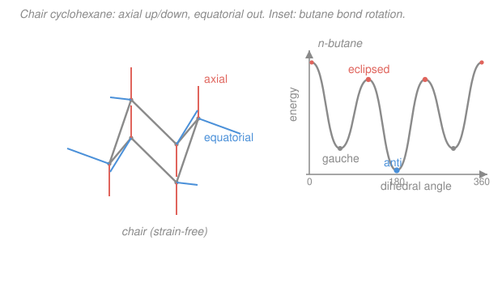

# Organic Chemistry I & II · Lesson 1.4: Alkanes & conformational analysis

> ⏱ ~15 min · Module 1: Structure, Bonding & Stereochemistry · Builds on: [1.1 Bonding, hybridization & molecular shape](01-01-bonding-hybridization-molecular-shape.md) · Unlocks: [1.5 Chirality & the R/S system](01-05-chirality-r-s-system.md)

## Why this matters

A structural formula freezes a molecule flat on the page, but a real alkane is never sitting still — its single bonds spin, and the molecule flickers through a crowd of three-dimensional shapes. Which shape it spends most of its time in decides how fast it reacts, how enzymes grip it, and why fats pack the way they do. Conformational analysis is the first place organic chemistry stops being about *connectivity* and starts being about *geometry in motion* — and the reasoning here (things settle into their lowest-strain arrangement) is the same energy-minimization instinct you'll use for every reaction that follows.

## The idea

Take ethane, $\ce{CH3CH3}$. The two carbons are joined by a single $\sigma$ bond, and a $\sigma$ bond is cylindrically symmetric — nothing stops the back $\ce{CH3}$ from twisting relative to the front one. Each twist gives a different **conformation**: same molecule, same bonds, just a different rotational arrangement. Conformations interconnect by rotation alone, so a molecule at room temperature is not *one* shape — it's a fast blur cycling through all of them, spending the most time in the comfortable ones.

"Comfortable" means low energy, and two things make a conformation uncomfortable. **Torsional strain**: neighboring bonds that line up (overlap when you sight down the C–C axis) repel slightly — electrons don't like eclipsing electrons. **Steric strain**: two bulky groups shoved into the same space push back, like elbows on a crowded armrest. Rotation is a continuous trade-off, and the winning conformation is the one that keeps both strains smallest — bonds offset, big groups far apart.

To *see* the trade-off you need to look down the bond, which is exactly what a Newman projection does.

## The formal version

**Newman projection.** Sight straight down a chosen C–C bond. The **front** carbon is a dot with three bonds meeting at it; the **back** carbon is a circle with three bonds poking out from behind. The angle between a front bond and the nearest back bond is the **dihedral (torsion) angle** $\theta$.

- **Staggered** ($\theta = 60^\circ$): back bonds sit in the gaps between front bonds. Minimum overlap, minimum torsional strain — a *low-energy* conformer.
- **Eclipsed** ($\theta = 0^\circ$): back bonds hide directly behind front bonds. Maximum overlap — a *high-energy* conformer, actually an energy *maximum* (a barrier, not a resting state).

*In words: staggered spreads the bonds out and relaxes; eclipsed crams them in line and strains.*

**Ethane.** Rotating from staggered to eclipsed costs about $12\ \mathrm{kJ/mol}$ of torsional strain — the **rotational barrier**. It's small: at room temperature the molecule hops over it billions of times a second, so ethane's bonds are effectively "freely rotating," just weighted toward staggered.

**Butane, $\ce{CH3CH2CH2CH3}$.** Sight down the central C2–C3 bond and the front and back each carry a bulky $\ce{CH3}$, so now *sterics* enter alongside torsion. As $\theta$ sweeps $0^\circ \to 360^\circ$ you pass four named conformers:

- **anti** ($\theta = 180^\circ$): the two methyls point exactly opposite. Staggered *and* methyls maximally far apart — the global minimum.
- **gauche** ($\theta = 60^\circ$ or $300^\circ$): staggered, but the methyls are only $60^\circ$ apart and bump slightly. About $3.8\ \mathrm{kJ/mol}$ above anti — pure steric strain (it's still staggered, so no torsional penalty).
- **eclipsed** ($\theta = 120^\circ$, $240^\circ$): $\ce{CH3}$ eclipses $\ce{H}$ — an energy maximum, $\sim 16\ \mathrm{kJ/mol}$.
- **fully eclipsed / syn** ($\theta = 0^\circ$): $\ce{CH3}$ eclipses $\ce{CH3}$ — the highest point, $\sim 19\ \mathrm{kJ/mol}$, torsional *and* steric strain stacked.

*In words: anti is home, gauche is a slightly cramped alternative, and the eclipsed forms are hills you roll over between them.* The energy-vs-$\theta$ curve (below) is the signature of the whole subject.

**Cyclohexane.** Close six $sp^3$ carbons into a ring and you might fear strain, but $\ce{C6H12}$ escapes it by puckering into the **chair** — a shape with essentially **zero strain**. Every C–C–C angle stays near the ideal tetrahedral $109.5^\circ$ (no **angle strain**), and sighting down any ring bond shows every neighbor *staggered* (no torsional strain). The chair is why cyclohexane is as unstrained as an open-chain alkane.

In the chair, each carbon carries two kinds of C–H (or substituent) position:

- **axial**: points straight up or down, parallel to the ring's vertical axis (alternating up, down, up around the ring).
- **equatorial**: splays outward around the ring's "equator."

A **ring flip** — the chair puckering through higher-energy forms into the other chair — swaps every axial position into equatorial and vice versa. It's fast at room temperature. The payoff: a substituent gets to *choose* which chair it lives in, and it prefers **equatorial**, because an *axial* group suffers **1,3-diaxial strain** — it crowds the two other axial groups on the same face, three carbons away. The bigger the group, the worse the crowding and the stronger the equatorial preference (this preference is quantified by an **A-value**; roughly, larger group $\Rightarrow$ larger A-value $\Rightarrow$ more lopsided toward equatorial). A tert-butyl group, $\ce{C(CH3)3}$, is so bulky it *locks* the ring into the chair that holds it equatorial.

Two higher-energy ring shapes exist — the **boat** and its slightly relaxed cousin the **twist-boat** — but both carry torsional strain (eclipsing) and a "flagpole" steric clash, so cyclohexane barely visits them. Small rings can't reach the chair escape: **cyclopropane** is a flat triangle forced to $60^\circ$ angles, huge angle strain plus fully eclipsed bonds, which is exactly why it's reactive.

## Picture

## Worked examples

**Example 1 (mechanical — build a Newman projection).** Draw ethane's most stable conformer looking down the C–C bond. Answer: the *staggered* form. Front carbon = dot with three $\ce{H}$ at $12$ o'clock, $4$ o'clock, $8$ o'clock; back carbon = circle with three $\ce{H}$ in the *gaps* at $2$, $6$, $10$ o'clock. Every front–back dihedral is $60^\circ$, so no two C–H bonds eclipse: torsional strain is minimized, matching ethane's preference to sit near the bottom of its $12\ \mathrm{kJ/mol}$ barrier.

**Example 2 (why you'd care — reading a substituent's fate).** Which chair does chlorocyclohexane favor? Draw one chair with $\ce{Cl}$ axial: it points up into the same-face 1,3-diaxial neighbors and clashes with those two axial hydrogens. Ring-flip to the other chair and the *same* $\ce{Cl}$ is now equatorial, splayed into open space with no 1,3-diaxial partners. The equatorial chair is lower in energy, so at equilibrium chlorocyclohexane sits mostly (~70%) in the equatorial chair — and this is the exact reasoning that decides which face a reagent can reach in a substituted ring. This is a preview of how *shape* gates *reactivity*, the throughline of Module 2 (see [2.2 Nucleophilic substitution: SN2](02-02-nucleophilic-substitution-sn2.md), where backside approach depends on what's crowding the carbon).

## Watch out

- **You might think conformers are different compounds you could bottle separately.** They're not — they interconvert by mere bond rotation, millions of times a second, so you can never isolate "the gauche bottle." (Contrast this with *configurations* like $R$ vs. $S$ in [1.5](01-05-chirality-r-s-system.md), which require *breaking* bonds to interconvert — those you can separate.)
- **You might read eclipsed as a resting shape.** Eclipsed conformers are energy *maxima* — barriers the molecule rolls *over*, never sits *in*. Only staggered forms (anti, gauche, plain staggered) are true minima.
- **You might assume "axial vs. equatorial" is a fixed label on a hydrogen.** A ring flip swaps them: today's axial H is tomorrow's equatorial H. What's fixed is the *preference* — bulky groups migrate to whichever chair makes them equatorial.
- **You might think a ring flip changes which face a group is on (its stereochemistry).** It doesn't — flipping only swaps axial↔equatorial; an "up" group stays up. Configuration is untouched.

## One-liner

> Single bonds spin, so molecules live in their lowest-strain arrangement: alkanes prefer *staggered/anti*, and cyclohexane sits in the strain-free *chair* with bulky groups *equatorial* to dodge 1,3-diaxial crowding.

## Problems

**P1 (🟢)** Draw the Newman projection of the *most stable* conformer of butane, sighted down the C2–C3 bond, and state its dihedral angle. Name the conformer.

**P2 (🟡)** Rank butane's four labeled conformers about the C2–C3 bond — anti, gauche, $\ce{CH3}$/$\ce{H}$ eclipsed, and fully eclipsed (syn) — from lowest to highest energy. For each, say whether torsional strain, steric strain, or both is responsible.

**P3 (🔴)** For methylcyclohexane, draw the two chair conformers, identify which one places the $\ce{CH3}$ equatorial, and explain why that conformer dominates the equilibrium. Then state what changes if the group is tert-butyl instead of methyl.

Solutions

**P1** The most stable conformer is **anti**, dihedral $\theta = 180^\circ$. Sighting down C2 (front dot) → C3 (back circle):

- Front carbon (C2) bears $\ce{CH3}$ (this is C1) plus two $\ce{H}$. Place the $\ce{CH3}$ at the top ($12$ o'clock), the two $\ce{H}$ at $4$ and $8$ o'clock.
- Back carbon (C3) bears $\ce{CH3}$ (this is C4) plus two $\ce{H}$, all staggered into the front's gaps: put the back $\ce{CH3}$ at the *bottom* ($6$ o'clock), the two $\ce{H}$ at $2$ and $10$ o'clock.

The two methyls (top-front, bottom-back) are $180^\circ$ apart — maximally separated — and every bond is staggered, so torsional strain is minimized too. That double win is why anti is the global minimum.

**P2** Lowest to highest:

$$\text{anti} \;<\; \text{gauche} \;<\; \ce{CH3}/\ce{H}\ \text{eclipsed} \;<\; \text{fully eclipsed (syn)}.$$

- **anti** ($180^\circ$, $\approx 0$, reference): staggered *and* methyls maximally apart — neither strain. The minimum.
- **gauche** ($60^\circ$, $\approx 3.8\ \mathrm{kJ/mol}$): still staggered, so **no torsional strain** — the cost is purely **steric**, the two methyls only $60^\circ$ apart brushing each other.
- **$\ce{CH3}/\ce{H}$ eclipsed** ($120^\circ$, $\approx 16\ \mathrm{kJ/mol}$): an energy maximum — **torsional strain** from the eclipsing, plus modest steric strain from a methyl eclipsing a hydrogen.
- **fully eclipsed / syn** ($0^\circ$, $\approx 19\ \mathrm{kJ/mol}$): the global maximum — **both strains stacked**: torsional (everything eclipsed) *and* the worst steric clash ($\ce{CH3}$ eclipsing $\ce{CH3}$ head-on).

Key insight: the *minima* differ (anti vs. gauche) only by **sterics**, while the *maxima* owe most of their height to **torsional** strain — the two effects show up in different places on the curve.

**P3** Draw a chair and attach $\ce{CH3}$ to one carbon two ways:

- **Chair A — $\ce{CH3}$ axial:** the methyl points straight up (or down), parallel to the ring axis. It now sits $1,3$-diaxial to the two axial hydrogens on the same face (the carbons three positions away), and those crowding contacts cost energy (~$7.6\ \mathrm{kJ/mol}$, i.e. two $\sim 3.8\ \mathrm{kJ/mol}$ gauche-like clashes).
- **Chair B — $\ce{CH3}$ equatorial:** a **ring flip** converts Chair A into Chair B, moving the *same* methyl to an equatorial position splayed outward, with **no** 1,3-diaxial partners.

**Chair B (equatorial) dominates.** It's lower in energy by the 1,3-diaxial penalty, so at equilibrium methylcyclohexane is roughly **95% equatorial** — the more crowded axial chair is disfavored. The methyl "chooses" the chair that keeps it equatorial.

**tert-butyl:** $\ce{C(CH3)3}$ is far bulkier, so its axial 1,3-diaxial strain is enormous (A-value ~$21\ \mathrm{kJ/mol}$ vs. methyl's ~$7.6$). The axial chair becomes essentially unpopulated: tert-butylcyclohexane is effectively **locked** into the single chair that holds the tert-butyl equatorial. (This is why tert-butyl is used as a "conformational anchor" to hold a ring in one chair for study.)

## Flashback

**From Lesson 1.1 (Bonding, hybridization & molecular shape):** In propene, $\ce{CH2=CH-CH3}$, assign the hybridization of each of the three carbons and give the approximate H–C–H (or C–C–C) bond angle at each. (Fresh variant — a molecule with mixed hybridization.)

Solution

Hybridization follows the number of $\sigma$ bonds + lone pairs (steric number) on each carbon; a double bond counts as **one** $\sigma$ (plus a $\pi$ that doesn't change the count):

- **C1** ($\ce{=CH2}$): two $\sigma$ bonds to H + one $\sigma$ to C2 = three $\sigma$ groups $\Rightarrow$ **$sp^2$**, trigonal planar, angles $\approx 120^\circ$.
- **C2** ($\ce{=CH-}$): one $\sigma$ to H, one $\sigma$ to C1, one $\sigma$ to C3 = three $\sigma$ groups $\Rightarrow$ **$sp^2$**, $\approx 120^\circ$. (The C=C $\pi$ bond sits above/below this plane.)
- **C3** ($\ce{-CH3}$): three $\sigma$ to H + one $\sigma$ to C2 = four $\sigma$ groups $\Rightarrow$ **$sp^3$**, tetrahedral, angles $\approx 109.5^\circ$.

The molecule is planar around the double bond (C1, C2 and their attached atoms) and tetrahedral at the methyl — the same $109.5^\circ$ tetrahedral geometry that lets cyclohexane fold into a strain-free chair in this lesson.

## Connections

- **Backward:** the chair's strain-free status is a direct consequence of [1.1](01-01-bonding-hybridization-molecular-shape.md)'s $sp^3$ carbon wanting $109.5^\circ$ angles — the ring puckers precisely to give every carbon its preferred tetrahedral geometry, and staggered neighbors along the way.
- **Forward:** conformation gates reaction geometry throughout Module 2 — E2 elimination demands an **anti-periplanar** ($180^\circ$ dihedral) H and leaving group ([2.4](02-04-elimination-e1-e2-choosing.md)), which in a cyclohexane means both must be *axial*; SN2 backside attack ([2.2](02-02-nucleophilic-substitution-sn2.md)) is blocked by exactly the steric crowding analyzed here.
- **Sideways (thermodynamics):** the anti-vs-gauche and axial-vs-equatorial populations are a Boltzmann equilibrium — the energy gaps here ($\Delta G$) set the ratios through the same $K = e^{-\Delta G/RT}$ you meet in [general chemistry's equilibrium](../../general-chemistry/lessons/03-04-chemical-equilibrium-k-le-chatelier.md); a bigger 1,3-diaxial penalty is just a larger $\Delta G$ pushing the equilibrium further toward the equatorial chair.
