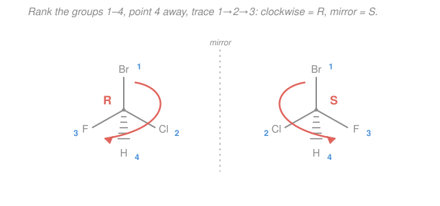

# Organic Chemistry I & II · Lesson 1.5: Chirality & the R/S system

> ⏱ ~15 min · Module 1: Structure, Bonding & Stereochemistry · Builds on: [1.4 Alkanes & conformational analysis](01-04-alkanes-conformational-analysis.md), [1.1 Bonding, hybridization & molecular shape](01-01-bonding-hybridization-molecular-shape.md) · Unlocks: [1.6 Diastereomers, meso & optical activity](01-06-diastereomers-meso-optical-activity.md)

## Why this matters

Your left hand doesn't fit a right glove — same parts, mirror-flipped, and no amount of turning makes one match the other. Molecules do this too, and biology cares intensely: your receptors, enzymes, and DNA are built from single-handed building blocks (all natural amino acids but one are "left-handed"). A drug and its mirror image can be a painkiller and a poison from the *same formula*. Thalidomide is the infamous case — one mirror form sedated, the other caused birth defects. So before we can predict a single reaction outcome in Module 2, we need a precise, unambiguous way to name 3-D handedness. That's the $R/S$ system, and it's the last big idea of Module 1.

## The idea

**Chirality** (from the Greek for "hand") means an object is **not superimposable on its mirror image**. Hold up your hands: palms facing you, thumbs out — mirror images, but slide one onto the other and the thumbs point opposite ways. No rotation fixes it. That's chiral. A plain drinking glass, by contrast, *is* the same as its mirror image — **achiral**.

For a molecule, the usual source of handedness is a single carbon carrying **four different groups**. Call it a **stereocenter** (or stereogenic/chiral center). Why four *different* groups? Carbon is $sp^3$ — tetrahedral, four bonds pointing to the corners of a pyramid (that geometry is from [1.1](01-01-bonding-hybridization-molecular-shape.md) and the VSEPR shapes in general chemistry, [gen-chem 1.5](../../general-chemistry/lessons/01-05-molecular-shape-vsepr-hybridization-mo.md)). Swap the four corners into their mirror arrangement and, if all four are distinct, you genuinely cannot rotate the pyramid back to the original. If even two of the groups are the same, you *can* — so it's achiral.

The two mirror-image forms are called **enantiomers**. They are different molecules (like different gloves), yet almost eerily identical: same melting point, same boiling point, same density, same NMR spectrum. They differ in exactly two ways — which direction they twist polarized light, and how they react with *other* chiral things (that's [1.6](01-06-diastereomers-meso-optical-activity.md)'s job). To tell a chemist *which* enantiomer you mean, we need a label: $R$ or $S$.

## The formal version

**Drawing 3-D on paper: wedges and dashes.** A plain line is a bond in the plane of the page. A solid **wedge** (▲) is a bond coming *toward you*, out of the page. A hashed **dash** (⋮) is a bond going *away*, behind the page. Two plain, one wedge, one dash around a carbon fully specifies its tetrahedral arrangement.

**Stereocenter test.** A carbon is a stereocenter when its four substituents are all different. *In words: look at the four things hanging off the carbon; if no two are identical, it's a stereocenter and (barring special symmetry) the molecule is chiral.*

**The Cahn–Ingold–Prelog (CIP) rules — assigning $R$ or $S$.** Three steps:

1. **Rank the four groups by priority.** Compare the atoms *directly attached* to the stereocenter by atomic number $Z$: higher $Z$ = higher priority. If there's a tie, move outward one bond and compare the *set* of atoms on each tied branch, deciding at the **first point of difference** (compare the highest atom of one branch against the highest of the other, then next-highest, etc.). *In words: heavier atom wins; on a tie, walk outward until the branches disagree.*
   - **Double/triple bonds → duplicate atoms.** A double bond $\ce{C=O}$ counts, at each end, as if that atom were bonded to a *phantom duplicate* of its partner. So a carbonyl carbon "sees" $(\mathrm{O},\mathrm{O},\ldots)$ — two oxygens. A $\ce{C=C}$ gives each carbon a duplicate carbon.

2. **Point the lowest priority (4) directly away from you** — down the dash, into the page.

3. **Trace $1 \to 2 \to 3$.** Clockwise = **$R$** (Latin *rectus*, right). Counterclockwise = **$S$** (*sinister*, left). *In words: with the runt pointing away, the top three either wind right (R) or left (S).*

**The flip trick.** If the lowest priority is *not* already pointing away — say it's on a wedge, toward you — you have two choices: mentally rotate the molecule (hard), or just **assign as drawn, then flip the answer**. Reading $1\to2\to3$ with group 4 toward you gives the *exact opposite* of the truth, so a "clockwise" reading really means $S$, and vice versa. *In words: lowest priority in front? Read it, then reverse it.*

## Picture

The molecule is $\ce{CHBrClF}$: priorities are $\ce{Br}$ ($Z=35$) $>\ce{Cl}$ ($17$) $>\ce{F}$ ($9$) $>\ce{H}$ ($1$). With $\ce{H}$ (priority 4) on the dash pointing away, $1\to2\to3$ winds clockwise on the left ($R$) and counterclockwise on its mirror image ($S$) — same four atoms, opposite hands.

## Worked examples

**Example 1 (mechanical — find and assign one center).** Take **2-chlorobutane**, $\ce{CH3-CHCl-CH2CH3}$. The stereocenter is C2, bearing four groups: $\ce{Cl}$, $\ce{H}$, $\ce{CH3}$, and $\ce{CH2CH3}$ (ethyl) — all different, so C2 *is* a stereocenter.

Rank them. Directly attached atoms: $\ce{Cl}$ ($Z=17$), then two carbons (methyl and ethyl), then $\ce{H}$ ($Z=1$). So $\ce{Cl}$ is priority **1**, $\ce{H}$ is priority **4**. The tie is methyl vs. ethyl — both attach a carbon. Go outward: methyl's carbon carries $(\mathrm{H},\mathrm{H},\mathrm{H})$; ethyl's first carbon carries $(\mathrm{C},\mathrm{H},\mathrm{H})$. At the first point of difference, $\mathrm{C} > \mathrm{H}$, so **ethyl beats methyl**: ethyl is **2**, methyl is **3**. Full ranking: $\ce{Cl} > \ce{CH2CH3} > \ce{CH3} > \ce{H}$.

Now suppose it's drawn with $\ce{H}$ (priority 4) on a dash pointing back, $\ce{Cl}$ up, ethyl to the lower-right, methyl to the lower-left. Trace $1\to2\to3$: $\ce{Cl}$(top) $\to$ ethyl(lower-right) $\to$ methyl(lower-left) — top, then right, then left, sweeping **clockwise**. Group 4 already points away, so no flip: this is **$(R)$-2-chlorobutane**.

**Example 2 (why you'd care — a carbonyl and the double-bond rule).** Consider the stereocenter of **glyceraldehyde**, $\ce{OHC-CH(OH)-CH2OH}$ (the simplest sugar, and the reference molecule all sugars are named against). C2 carries: $\ce{OH}$, $\ce{H}$, $\ce{CHO}$ (the aldehyde), and $\ce{CH2OH}$.

Rank. Attached atoms: $\ce{OH}$ gives an oxygen ($Z=8$) — highest, priority **1**. $\ce{H}$ is priority **4**. The tie: $\ce{CHO}$ vs. $\ce{CH2OH}$, both attach a carbon. Explore outward. The $\ce{CH2OH}$ carbon carries $(\mathrm{O},\mathrm{H},\mathrm{H})$. The $\ce{CHO}$ carbon is *double*-bonded to oxygen, so by the duplication rule it carries $(\mathrm{O},\mathrm{O},\mathrm{H})$ — the doubled oxygen counts twice. Comparing $(\mathrm{O},\mathrm{O},\mathrm{H})$ against $(\mathrm{O},\mathrm{H},\mathrm{H})$: first oxygens tie, but the second slot is $\mathrm{O}$ vs. $\mathrm{H}$ — so **$\ce{CHO}$ wins**, priority **2**, and $\ce{CH2OH}$ is **3**. This is exactly the kind of ranking that decides how sugars are classified as D or L — and it turns on nothing but the double-bond duplication trick.

## Watch out

- **You might think any carbon with four bonds is a stereocenter.** It isn't — the four *groups* must be **different**. In $\ce{CH2ClBr}$ the carbon has two $\ce{H}$'s, so it's achiral. Always check for repeats before assigning $R/S$.
- **You might rank by size or by mass of the whole group.** CIP compares **atomic number**, atom by atom, at the **first point of difference** — not group weight, not how "big" it looks. A single far-out iodine can beat a bulky all-carbon branch the moment you hit it.
- **You might forget to flip when priority 4 faces you.** Reading $1\to2\to3$ with the lowest group on a *wedge* gives the exact opposite label. Either rotate the molecule so 4 points back, or read-then-reverse — but never read it straight.
- **You might think enantiomers differ in melting point or NMR.** They don't. In an ordinary (achiral) environment they are physically identical; they part ways only in optical rotation and toward other chiral partners ([1.6](01-06-diastereomers-meso-optical-activity.md)).

## One-liner

> A carbon with four different groups is chiral; rank the groups by atomic number, aim the loser away, and trace $1\to2\to3$ — clockwise is $R$, counterclockwise is $S$ (and reading with the loser in front means flip your answer).

## Problems

**P1 (🟢)** For each molecule, identify the stereocenter(s) and state how many there are: (a) 2-butanol $\ce{CH3-CH(OH)-CH2CH3}$; (b) 2-bromobutane $\ce{CH3-CHBr-CH2CH3}$; (c) glyceraldehyde $\ce{OHC-CH(OH)-CH2OH}$; (d) 2-propanol $\ce{CH3-CH(OH)-CH3}$.

**P2 (🟡)** A stereocenter of 2-chlorobutane is drawn with the lowest priority group ($\ce{H}$) on a dash pointing away. The three front groups are: $\ce{Cl}$ at the top, the ethyl group $\ce{CH2CH3}$ at the lower-**left**, and the methyl $\ce{CH3}$ at the lower-**right**. Assign $R$ or $S$, showing your priority ranking.

**P3 (🔴, Boss-1 rehearsal)** In 2,3-dibromobutane $\ce{CH3-CHBr-CHBr-CH3}$, look at carbon **C2**. It is drawn with $\ce{H}$ on a bold **wedge (toward you)**; the other three lie on plain lines: $\ce{Br}$ pointing up, the $\ce{-CHBrCH3}$ group (that's C3) to the lower-right, and $\ce{CH3}$ (C1) to the lower-left. Assign $R$ or $S$ for C2. (Watch the wedge.)

Solutions

**P1** A stereocenter needs four *different* groups on one carbon.
- (a) **2-butanol** — C2 carries $\ce{OH}$, $\ce{H}$, $\ce{CH3}$, $\ce{CH2CH3}$: all different. **1 stereocenter.**
- (b) **2-bromobutane** — C2 carries $\ce{Br}$, $\ce{H}$, $\ce{CH3}$, $\ce{CH2CH3}$: all different. **1 stereocenter.**
- (c) **glyceraldehyde** — C2 carries $\ce{OH}$, $\ce{H}$, $\ce{CHO}$, $\ce{CH2OH}$: all different. **1 stereocenter.** (C1, the $\ce{CHO}$, and C3, the $\ce{CH2OH}$, are not — each has repeated groups or fewer than four distinct ones.)
- (d) **2-propanol** — C2 carries $\ce{OH}$, $\ce{H}$, and **two** $\ce{CH3}$ groups. Two groups identical $\Rightarrow$ **0 stereocenters** (achiral). This is the control: same skeleton as 2-butanol but symmetric, so no handedness.

**P2** Ranking at C2 (same as Example 1): $\ce{Cl}$ (**1**, $Z=17$) $>$ ethyl (**2**) $>$ methyl (**3**) $>$ $\ce{H}$ (**4**); ethyl beats methyl because its first carbon carries $(\mathrm{C},\mathrm{H},\mathrm{H})$ vs. methyl's $(\mathrm{H},\mathrm{H},\mathrm{H})$.

Group 4 ($\ce{H}$) already points away — no flip needed. Trace $1\to2\to3$: $\ce{Cl}$(top) $\to$ ethyl(lower-**left**) $\to$ methyl(lower-**right**) — top, then left, then right, sweeping **counterclockwise**. Counterclockwise $=$ **$S$**. This is $(S)$-2-chlorobutane — the mirror image of Example 1's $(R)$, as it should be (we only swapped the left/right positions of ethyl and methyl).

**P3** First rank the four groups on **C2**. Attached atoms: $\ce{Br}$ ($Z=35$) — priority **1**; $\ce{H}$ — priority **4**; and two carbons, C1 ($\ce{CH3}$) vs. C3 ($\ce{-CHBrCH3}$), which tie at carbon and must be explored outward.
- C1 (methyl) carbon carries $(\mathrm{H},\mathrm{H},\mathrm{H})$.
- C3 carbon carries $(\mathrm{Br},\mathrm{C},\mathrm{H})$ — it has its own bromine and a methyl.

First point of difference: $\mathrm{Br}$ vs. $\mathrm{H}$ — C3 wins decisively. So $\ce{-CHBrCH3}$ (C3) is priority **2**, and $\ce{CH3}$ (C1) is priority **3**. Full order: $\ce{Br} > \ce{CHBrCH3} > \ce{CH3} > \ce{H}$.

Now the geometry. Read $1\to2\to3$ **as drawn**: $\ce{Br}$(top) $\to$ C3 group(lower-right) $\to$ $\ce{CH3}$(lower-left) — top, then right, then left, which is **clockwise**. But the lowest priority ($\ce{H}$) is on a **wedge, toward you**, not away. So apply the flip: the honest answer is the *reverse* of clockwise. Therefore C2 is **$S$**.

*Check.* The flip is the whole point of the rehearsal — reading "clockwise" straight would have given the wrong $R$. Whenever group 4 faces you, assign as seen, then reverse.

## Flashback

**From Lesson 1.4 (Alkanes & conformational analysis):** Look down the C2–C3 bond of **butane** with a Newman projection and rotate the front carbon. Rank these three arrangements from **lowest to highest energy** and say why: (i) *anti* (the two methyls at a $180^\circ$ dihedral), (ii) *gauche* (methyls at $60^\circ$), (iii) fully *eclipsed* with the methyls overlapping ($0^\circ$).

Solution

**Lowest to highest: anti $<$ gauche $<$ methyl–methyl eclipsed.**

- **Anti ($180^\circ$)** is the global minimum: staggered (no eclipsing torsional strain) *and* the two bulky methyls are as far apart as possible, so steric strain is minimal.
- **Gauche ($60^\circ$)** is also staggered, but now the methyls sit only $60^\circ$ apart and crowd each other — that steric cost (about $3.8\ \mathrm{kJ/mol}$) puts it above anti.
- **Eclipsed with methyls overlapping ($0^\circ$)** is the worst: it combines torsional strain (bonds eclipsed) with the maximum steric clash of the two methyls face-to-face (roughly $19\ \mathrm{kJ/mol}$ above anti).

*Check.* The ordering is the same "staggered beats eclipsed, and keep bulky groups apart" logic from 1.4 — energy tracks how crowded and how eclipsed the arrangement is. Note this is *conformational* (single bonds rotating freely), whereas this lesson's $R/S$ handedness is *configurational* — fixed by bonds and only changeable by breaking them.

## Connections

- **Backward:** the four-corner tetrahedral carbon is the $sp^3$ geometry from [1.1](01-01-bonding-hybridization-molecular-shape.md) and the VSEPR shapes of [gen-chem 1.5](../../general-chemistry/lessons/01-05-molecular-shape-vsepr-hybridization-mo.md); handedness is what that geometry *does* once all four corners differ. The double-bond duplication rule reuses the bonding pictures of the carbonyl you'll formalize later.
- **Forward:** [1.6](01-06-diastereomers-meso-optical-activity.md) adds a *second* stereocenter — giving diastereomers (which, unlike enantiomers, differ in ordinary physical properties) and the surprising achiral *meso* case — and measures handedness quantitatively as optical rotation. Every substitution and addition reaction in Module 2 ([2.2 SN2](02-02-nucleophilic-substitution-sn2.md) onward) will have a *stereochemical* outcome you'll report in exactly this $R/S$ language.
- **Sideways (biology):** life is homochiral — proteins are built from single-handed ($S$, "L") amino acids, and sugars from D-forms — which is why one enantiomer of a drug can heal while its mirror image harms. This is the entry point to the [biochemistry](../../biochemistry/syllabus.md) track.
