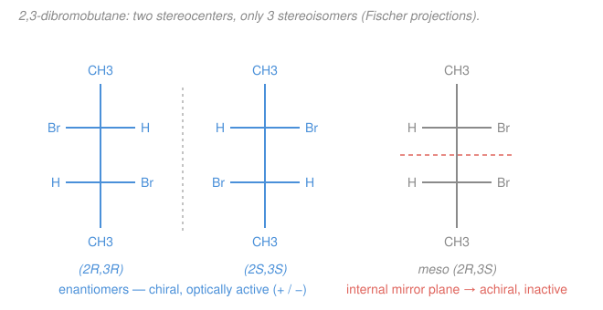

# Organic Chemistry I & II · Lesson 1.6: Diastereomers, meso compounds & optical activity

> ⏱ ~15 min · Module 1: Structure, Bonding & Stereochemistry · Builds on: [1.5 Chirality & the R/S system](01-05-chirality-r-s-system.md) · Unlocks: [2.1 Functional groups & the language of mechanisms](02-01-functional-groups-mechanisms-language.md)

## Why this matters

One chiral carbon gave you two mirror-image molecules that a flat drawing can't tell apart but a living cell can — one smells like caraway, its mirror image like spearmint. Now add a second stereocenter. Naively you'd expect $2 \times 2 = 4$ molecules, and often you get exactly that. But sometimes you get **three**, because one of the four turns out to be its *own* mirror image — a **meso compound**, chiral parts assembled into an achiral whole. This lesson is the full stereoisomer bookkeeping: how to count them, how to name the relationships between them (enantiomers vs diastereomers), and how a polarimeter *measures* the difference. It closes Module 1, and its central molecule — 2,3-dibromobutane — is your Boss Problem.

## The idea

Think of a stereocenter as a coin: it can land heads ($R$) or tails ($S$). With $n$ coins you have up to $2^n$ arrangements — that's the ceiling on stereoisomers.

Now, two molecules that share the same connectivity but differ in 3-D arrangement are **stereoisomers**. They come in exactly two flavors of relationship:

- **Enantiomers** — *every* coin flipped. A complete mirror image, like your left and right hands. Opposite configuration at **every** stereocenter.
- **Diastereomers** — *some but not all* coins flipped. Not mirror images, so not identical, just... different molecules. Different melting points, different reactivity, genuinely separable on a bench. (The plain old cis/trans alkene pair from earlier is a diastereomer pair too.)

The twist is the **meso compound**. Flip *all* the coins on a molecule that happens to have an internal mirror symmetry, and you land right back on the *same* molecule — the "mirror image" is superimposable on the original. Such a molecule has real stereocenters yet is **achiral** overall, because one half of it is the mirror reflection of the other half. That internal cancellation is exactly why $2^n$ sometimes overcounts: two of the "four" collapse into one.

And chirality is *measurable*. Shine plane-polarized light through a chiral molecule and it twists the plane of polarization. Its enantiomer twists it equally the other way. Mix them 50:50 and the twists cancel — you see nothing. A meso compound sees nothing on its own, because it's already achiral.

## The formal version

**Counting.** A molecule with $n$ stereocenters has **at most $2^n$ stereoisomers**. *In words: each center independently is $R$ or $S$, so multiply.* Internal symmetry (a meso relationship) reduces the count below $2^n$.

**Enantiomers.** Two stereoisomers that are non-superimposable mirror images. Equivalent test: opposite configuration ($R \leftrightarrow S$) at **every** stereocenter. *In words: flip every center.* A molecule and its enantiomer are always both chiral.

**Diastereomers.** Stereoisomers that are **not** mirror images — differ at **some but not all** stereocenters. *In words: flip a few centers, not all.* This bucket also holds cis/trans (E/Z) isomers and ring substituent patterns.

**Meso compound.** A molecule that contains stereocenters but is **achiral** because it possesses an internal mirror plane (or other improper-symmetry element) making it superimposable on its mirror image. *In words: the two halves are mirror reflections of each other, so the molecule cancels its own handedness.* A meso compound is optically **inactive**.

**Optical activity.** A chiral substance rotates plane-polarized light by an observed angle $\alpha$. To make it a property of the substance rather than the sample, define the **specific rotation**

$$[\alpha]_D^T = \frac{\alpha}{c\,\ell},$$

where $\alpha$ is the measured rotation (degrees), $c$ is concentration (grams per milliliter), $\ell$ is the path length (decimeters), $T$ the temperature and $D$ the sodium-lamp wavelength. *In words: normalize the raw twist by how much stuff the light passed through.* A clockwise (as the viewer faces the beam) rotation is **dextrorotatory**, written $(+)$; counterclockwise is **levorotatory**, $(-)$.

Two facts do all the work:

- **Enantiomers rotate equally and oppositely:** if one is $[\alpha] = +12^\circ$, its mirror image is $-12^\circ$.
- **A racemic mixture** — exactly 50:50 of two enantiomers, written $(\pm)$ — has **net zero** rotation; the two contributions cancel.

**Enantiomeric excess.** For a scalemic (unequal) mixture, the

$$\mathrm{ee} = \bigl|\,\%R - \%S\,\bigr| = \frac{[\alpha]_{\text{observed}}}{[\alpha]_{\text{pure}}}\times 100\%.$$

*In words: the ee is how far past a racemate you are — the fraction of the sample that is "unmatched" single enantiomer.* An 80% ee sample is 90% one enantiomer, 10% the other (the 10% pairs off with 10% to make a 20% racemate, leaving 80% excess).

**Fischer projections.** A 2-D shorthand for stereocenters: draw the carbon chain vertical, and at each cross the **vertical bonds point away** from you (into the page) while the **horizontal bonds point toward** you. The payoff for meso-hunting: if the top half of the drawing is the mirror image of the bottom half (same substituents on the same sides across a horizontal line), the molecule is meso.

## Picture

The blue pair are non-superimposable mirror images — flip every center, both chiral. The grey structure has both Br's on the same side: a horizontal mirror plane (coral) relates its top half to its bottom half, so it's achiral meso. That's the isomer $2^n$ counting misses.

## Worked examples

**Example 1 (mechanical — count and check for meso).** How many stereoisomers does **tartaric acid**, $\ce{HOOC-CHOH-CHOH-COOH}$, have?

Two stereocenters (the two $\ce{CHOH}$ carbons), so the ceiling is $2^2 = 4$. But the two ends are *identical* ($\ce{-COOH}$ on each side), so an internal mirror plane is possible. Indeed:

- $(2R,3R)$ and $(2S,3S)$ — a genuine enantiomeric pair, both chiral, $[\alpha] = \pm 12^\circ$.
- $(2R,3S)$ — has an internal mirror plane, so it equals $(2S,3R)$: a single **meso** compound, optically inactive.

That's **3**, not 4. (Historically this is *the* example: Pasteur separated the enantiomers of tartaric acid by hand-picking crystals in 1848.)

**Example 2 (why you'd care — reading a polarimeter).** Pure $(2R,3R)$-tartaric acid has $[\alpha]_D = +12^\circ$. You measure a sample at $[\alpha]_{\text{obs}} = +9^\circ$ under the same conditions. What's in the bottle?

$$\mathrm{ee} = \frac{+9^\circ}{+12^\circ}\times 100\% = 75\%.$$

So 75% of the material is "unmatched" $(2R,3R)$, and the remaining 25% is a racemate — 12.5% $(2R,3R)$ + 12.5% $(2S,3S)$. Total composition: **87.5% $(R,R)$, 12.5% $(S,S)$**. One number off a polarimeter pins down the whole mixture — this is how you monitor whether an asymmetric synthesis is actually selecting one hand.

## Watch out

- **You might think any molecule with two stereocenters has four stereoisomers.** Only when the two centers are *different enough* that no internal symmetry exists. When the molecule can host an internal mirror plane (identical halves), one isomer is meso and you get three. Always check for meso before quoting $2^n$.
- **You might think "has stereocenters" means "chiral" means "optically active."** Meso compounds break this chain: real stereocenters, zero net chirality, zero rotation. Chirality is a property of the *whole* molecule, not a tally of its centers.
- **You might confuse a meso compound with a racemic mixture.** Both read $0^\circ$ on a polarimeter, but a racemate is *two* substances (separable in principle, e.g. by a chiral column) whose rotations cancel; meso is *one* pure substance that is intrinsically achiral and can never be resolved into active halves.

## One-liner

> Enantiomers flip every center (mirror images, active and opposite); diastereomers flip some (different compounds); meso flips them all but lands on itself (internal mirror → achiral, inactive) — which is why $n$ centers give *up to*, not exactly, $2^n$ isomers.

## Problems

**P1 (🟢)** 2,4-dibromopentane, $\ce{CH3-CHBr-CH2-CHBr-CH3}$, has stereocenters at C2 and C4. State the maximum possible number of stereoisomers, and whether a meso form exists.

**P2 (🟡)** Consider $(2R,3R)$-tartaric acid and $(2S,3R)$-tartaric acid. Classify the pair as enantiomers, diastereomers, or identical, and state whether **each** molecule is optically active.

**P3 (🔴, Boss-1)** Full analysis of **2,3-dibromobutane**, $\ce{CH3-CHBr-CHBr-CH3}$: (a) enumerate all its stereoisomers, (b) assign $R/S$ to C2 and C3 in each, (c) identify the meso form and explain why it's meso, (d) give every pairwise relationship, and (e) say which isomers are optically active — including a 50:50 mixture of the two chiral ones.

Solutions

**P1** Two stereocenters $\Rightarrow$ ceiling $2^2 = 4$. Does a meso form exist? Check for internal symmetry: the molecule has a mirror plane through C3 (the $\ce{CH2}$), so C2 and C4 are constitutionally equivalent — flipping both centers maps the molecule onto its own mirror image. The $(2R,4S)$ isomer is therefore **meso** (achiral). So the real count is **3**: the enantiomeric pair $(2R,4R)/(2S,4S)$ plus the single meso $(2R,4S)$. **Answer: max 4, and yes, a meso form exists (so only 3 real stereoisomers).**

**P2** Tartaric acid has two identical ends, so a meso form is $(2R,3S) \equiv (2S,3R)$. Compare the two given molecules center by center:

| | C2 | C3 |
|---|---|---|
| $(2R,3R)$ | $R$ | $R$ |
| $(2S,3R)$ | $S$ | $R$ |

They differ at **C2 only** (one of two centers) — *some but not all*, and they are not mirror images. So they are **diastereomers**.

- $(2R,3R)$: opposite ends have opposite configuration, no internal mirror plane $\Rightarrow$ chiral $\Rightarrow$ **optically active** ($[\alpha] = +12^\circ$).
- $(2S,3R)$: this is $(2R,3S)$ relabeled — the meso form, internal mirror plane $\Rightarrow$ achiral $\Rightarrow$ **optically inactive**.

**Answer: diastereomers; the $(2R,3R)$ is optically active, the $(2S,3R)$ = meso is inactive.**

**P3 — Boss-1.**

*(a) & (b) Enumerate and assign.* The ceiling is $2^2 = 4$: $(R,R), (S,S), (R,S), (S,R)$. Drawn as Fischer projections (chain vertical, CH3 top and bottom, Br/H horizontal), assigning each center with the rule from [1.5](01-05-chirality-r-s-system.md) — priorities at each carbon are $\ce{Br} > (\text{the other CHBr carbon}) > \ce{CH3} > \ce{H}$, and remember the horizontal (toward-viewer) $\ce{H}$ means you determine the sense as drawn and then **reverse** it:

- **Br on opposite sides** (e.g. Br-left at C2, Br-right at C3) → $(2R,3R)$. Its left–right mirror image is $(2S,3S)$. These are two *different* molecules.
- **Br on the same side** (both Br-right) → C2 reads $S$, C3 reads $R$ → $(2S,3R)$. But this is superimposable on $(2R,3S)$ (rotate $180^\circ$ in-plane), so $(R,S)$ and $(S,R)$ are the **same molecule**. Four labels collapse to **three compounds**: $(2R,3R)$, $(2S,3S)$, and meso.

*(c) The meso form.* The $(2R,3S) \equiv (2S,3R)$ isomer. In its Fischer projection both Br's sit on the same side, so a **horizontal mirror plane** runs through the middle of the C2–C3 bond: the top half ($\ce{CH3}$–$\ce{CHBr}$) is the exact mirror reflection of the bottom half. The molecule is superimposable on its own mirror image → **achiral (meso)**, despite having two genuine stereocenters.

*(d) Pairwise relationships* (three pairs):

- $(2R,3R)$ vs $(2S,3S)$: opposite at **both** centers, non-superimposable mirror images → **enantiomers**.
- $(2R,3R)$ vs meso $(2R,3S)$: differ at **C3 only** → **diastereomers**.
- $(2S,3S)$ vs meso $(2R,3S)$: differ at **C2 only** → **diastereomers**.

*(e) Optical activity.*

- $(2R,3R)$: chiral → **active** (say $+\beta$).
- $(2S,3S)$: chiral → **active**, equal and opposite ($-\beta$).
- meso $(2R,3S)$: achiral → **inactive** ($0^\circ$), intrinsically.
- A **50:50 mix of $(2R,3R)$ + $(2S,3S)$** is a **racemate** → **inactive** ($0^\circ$), by cancellation — same reading as the meso, but a mixture of two chiral substances rather than one achiral substance.

## Flashback

**From Lesson 1.5 (Chirality & the R/S system):** A stereocenter carbon is bonded to $\ce{-OH}$, $\ce{-CH2CH3}$, $\ce{-CH3}$, and $\ce{-H}$ (this is 2-butanol). Orient it with the $\ce{H}$ pointing **away** from you; the remaining three groups are arranged with $\ce{OH}$ at the top, $\ce{CH2CH3}$ at the lower right, and $\ce{CH3}$ at the lower left. Assign $R$ or $S$.

Solution

Rank by CIP priority (first point of difference):

1. $\ce{OH}$ — oxygen, highest atomic number. **Priority 1.**
2. $\ce{CH2CH3}$ (ethyl) — its carbon is attached to $(\ce{C,H,H})$. **Priority 2.**
3. $\ce{CH3}$ (methyl) — its carbon is attached to $(\ce{H,H,H})$; loses to ethyl at the first tie-break. **Priority 3.**
4. $\ce{H}$ — **Priority 4.**

The lowest priority ($\ce{H}$) already points away from us, so we read the sense of $1 \to 2 \to 3$ directly, no reversal:

$$\ce{OH}\,(\text{top}) \;\to\; \ce{CH2CH3}\,(\text{lower right}) \;\to\; \ce{CH3}\,(\text{lower left}).$$

Top → lower-right → lower-left traces a **clockwise** arc. Clockwise with the lowest priority pointing back = **$R$**.

**Answer: $(R)$-2-butanol.** (Its enantiomer, $(S)$-2-butanol, would have $\ce{OH}$, $\ce{CH3}$, $\ce{CH2CH3}$ running clockwise instead — mirror image, opposite rotation.)

## Connections

- **Backward:** this extends the single-center $R/S$ machinery from [1.5](01-05-chirality-r-s-system.md) to multiple centers, and the enantiomer/mirror-image idea to its full family tree. The cis/trans distinction you met with alkanes and rings in [1.4](01-04-alkanes-conformational-analysis.md) is just the diastereomer relationship in disguise.
- **Forward:** stereochemistry becomes a *product-determining* fact once reactions start in Module 2. [2.2 SN2 substitution](02-02-nucleophilic-substitution-sn2.md) inverts a stereocenter ($R \to S$) every time (Walden inversion), and [2.5 electrophilic addition](02-05-alkenes-electrophilic-addition.md) can create new stereocenters whose $R/S$ ratio you'll predict — including whether a reaction gives a single diastereomer or a racemate.
- **Sideways:** the meso/racemate distinction is why chirality matters in biology and pharma — enzymes and receptors are chiral, so they respond to enantiomers differently. This is the molecular basis for the "one hand is medicine, the other is inert or toxic" story that runs through [biochemistry](../../biochemistry/syllabus.md), and the polarimeter is the same measure-the-twist idea as optical rotation in [physical chemistry](../../physical-chemistry/syllabus.md).
