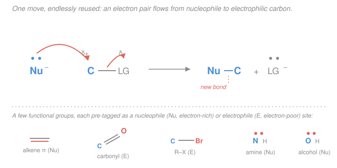

# Organic Chemistry · Lesson 2.1: Functional groups & the language of mechanisms

> ⏱ ~15 min · Module 2: Reactions I — Substitution, Elimination & Addition · Builds on: [1.2 Resonance & delocalization](01-02-resonance-formal-charge-delocalization.md), [1.3 Acids & bases in organic chemistry](01-03-acids-bases-organic.md) · Unlocks: [2.2 Nucleophilic substitution (SN2)](02-02-nucleophilic-substitution-sn2.md)

## Why this matters

A carbon skeleton is inert scaffolding; the chemistry happens at the **functional groups** — the small reactive clusters hung off it. Learn to see a molecule as "boring backbone + a few reactive groups" and an intimidating structure collapses into a short to-do list. Better still, almost every reaction in this entire course is the *same underlying move* dressed differently: electron-rich meets electron-poor, a bond forms, sometimes another breaks. This lesson hands you that unifying idea plus the notation — curved arrows — used to write it down. It is the grammar every later lesson speaks; get fluent here and SN2, addition, aromatic substitution, and carbonyl chemistry all read as dialects of one language.

## The idea

Two questions unlock organic reactivity. First: **where are the electrons?** Bonds and lone pairs are where negative charge lives; electronegative atoms and positive centers are where it's scarce. Second: **electrons flow from rich to poor.** That's the whole plot.

We give the two roles names. A **nucleophile** (Greek: "nucleus-loving") is electron-*rich* — it has a lone pair, a $\pi$ bond, or a negative charge to donate. An **electrophile** ("electron-loving") is electron-*poor* — it carries a full positive charge, a partial positive ($\delta+$), or an empty orbital hungry for a pair. A reaction is a nucleophile finding an electrophile and donating a pair of electrons to it. Everything else — which bond breaks, what leaves, how fast — is detail on top of that handshake.

How do you spot the rich and poor spots? You already have the tools. **Electronegativity** pulls shared electrons toward the greedier atom, leaving the other end $\delta+$ (this is [1.1](01-01-bonding-hybridization-molecular-shape.md)/gen-chem polarity). **Resonance** ([1.2](01-02-resonance-formal-charge-delocalization.md)) spreads charge around, revealing $\delta+$ and $\delta-$ sites a single Lewis structure hides — a carbonyl carbon is electrophilic precisely because a resonance form puts $+$ on it. And the **acid/base pKa reasoning** from [1.3](01-03-acids-bases-organic.md) turns out to *be* the theory of leaving groups. Nothing here is new machinery; it's your Module 1 toolkit pointed at reactions.

## The formal version

**Nucleophile / electrophile.**

- A **nucleophile (Nu)** donates an electron pair. Sources: a lone pair ($\ce{OH-}$, $\ce{NH3}$, $\ce{Br-}$), a $\pi$ bond (an alkene's $\ce{C=C}$), or an anion.
- An **electrophile (E)** accepts an electron pair. Sinks: a full positive charge (a carbocation $\ce{R3C+}$), a $\delta+$ atom (the carbon of $\ce{C=O}$ or $\ce{C-Br}$), or an empty orbital ($\ce{BF3}$, $\ce{H+}$).

*In words: nucleophile = electron giver, electrophile = electron taker; a reaction pairs one of each.*

**Curved arrows — the notation for electron flow.** A **double-barbed** (full-headed) arrow moves an electron *pair*. Its **tail** sits on the source (a lone pair or a bond); its **head** points at the destination (an atom, to make a lone pair, or between two atoms, to make a bond).

$$\ce{Nu^- + C-LG -> Nu-C + LG^-}$$

Here two arrows tell the story: one from the $\ce{Nu}$ lone pair to carbon (making the new $\ce{Nu-C}$ bond), one from the $\ce{C-LG}$ bond onto $\ce{LG}$ (breaking that bond, handing both electrons to the leaving group). *In words: arrows are the accountant's ledger for electrons — every arrow's tail says "these electrons," its head says "and here is where they go."* A separate **single-barbed** (fishhook) arrow moves just *one* electron; you need those only for radicals ([2.6](02-06-alkynes-radicals.md)) and can ignore them for now.

**Bond making vs breaking; heterolytic vs homolytic.** When a bond breaks **heterolytically**, one atom takes *both* electrons (making an anion) and the other takes *none* (a cation): $\ce{A-B -> A+ + B^-}$. This is the polar, curved-arrow world — the default for the next four lessons. When a bond breaks **homolytically**, the pair splits, one electron to each atom, giving two radicals: $\ce{A-B -> A^. + B^.}$ — that's fishhook territory. *In words: heterolytic = the pair stays together and goes to one side (ions); homolytic = the pair divorces (radicals).*

**Leaving groups.** A **leaving group (LG)** is the fragment that departs *with* the bonding electrons — an electrophile's exit door. The rule:

$$\textbf{a good leaving group is a weak base — a stable anion.}$$

*In words: the group happiest holding the electron pair by itself leaves most readily.* And "how happy is this anion" is exactly the [1.3](01-03-acids-bases-organic.md) question in disguise: the conjugate acid $\ce{H-LG}$ tells you. **A low $\mathrm{p}K_a$ of $\ce{H-LG}$ (a strong acid) means a stable, weak-base $\ce{LG-}$ — a good leaving group.** Iodide ($\ce{HI}$, $\mathrm{p}K_a \approx -10$) leaves easily; hydroxide ($\ce{H2O}$, $\mathrm{p}K_a = 15.7$, so $\ce{OH-}$ is a strong base) barely leaves at all.

**Nucleophilicity is not basicity.** Both describe donating a lone pair, but to *different* partners and on *different clocks. Basicity* is donating to $\ce{H+}$, an equilibrium (thermodynamics, measured by $\mathrm{p}K_a$). *Nucleophilicity* is donating to *carbon* in the rate-determining step (kinetics, how fast). They usually track together, but two things pull them apart: **polarizability** — big, squishy atoms ($\ce{I-}$, $\ce{S}$) are better nucleophiles than their basicity suggests because their loose electron clouds reach out to carbon — and **solvent** — a protic solvent (one with $\ce{O-H}$/$\ce{N-H}$) hydrogen-bonds a small anion like $\ce{F-}$ into a cage, throttling its nucleophilicity even though it's a strong base. *In words: basicity asks "how much do you want a proton"; nucleophilicity asks "how fast do you attack carbon" — related, but not the same test.*

## Picture

## The functional-group map

Each group in one line — **name : what makes it react.** "Nu" = tends to attack (electron-rich); "E" = tends to be attacked (electron-poor).

- **Alkane** ($\ce{C-C}$, $\ce{C-H}$): nonpolar, no lone pairs — essentially *inert*. The boring backbone.
- **Alkene / alkyne** ($\ce{C=C}$, $\ce{C#C}$): the $\pi$ bond is exposed electron density — a **Nu** that attacks electrophiles ([2.5](02-05-alkenes-electrophilic-addition.md)).
- **Alkyl halide** ($\ce{C-X}$, X = F, Cl, Br, I): polar bond puts $\delta+$ on carbon (an **E**) and hands you a built-in leaving group ($\ce{X-}$). The star of Module 2.
- **Alcohol** ($\ce{C-OH}$): O lone pairs make it a mild **Nu**; the $\ce{O-H}$ is weakly acidic. Turned into a leaving group only after protonation.
- **Ether** ($\ce{C-O-C}$): lone pairs on O, but no good handle — fairly unreactive; a common solvent.
- **Amine** ($\ce{C-NH2}$): N lone pair makes it the best neutral **Nu** *and* a decent base ([1.3](01-03-acids-bases-organic.md)).
- **Aldehyde / ketone** ($\ce{R-CHO}$ / $\ce{R2C=O}$): the **carbonyl** $\ce{C=O}$ — polar plus a resonance form with $+$ on carbon, so the carbon is a strong **E** ([3.3](03-03-aldehydes-ketones-nucleophilic-addition.md)).
- **Carboxylic acid & derivatives** ($\ce{-COOH}$; acyl halide $\ce{-COX}$, anhydride $\ce{-CO-O-CO-}$, ester $\ce{-COOR}$, amide $\ce{-CONH2}$): all carbonyl-**E** carbons, but now carrying a *leaving group*. Reactivity ranks by leaving-group quality: acyl halide > anhydride > ester > amide ([3.4](03-04-carboxylic-acids-derivatives-acyl-substitution.md)).
- **Nitrile** ($\ce{C#N}$): the carbon is $\delta+$ (**E**), like a carbonyl's nitrogen cousin.
- **Aromatic** (benzene ring): a delocalized $\pi$ system ([1.2](01-02-resonance-formal-charge-delocalization.md)), a *stabilized* **Nu** that reacts only with strong electrophiles ([3.2](03-02-electrophilic-aromatic-substitution.md)).

## Worked examples

**Example 1 (spot the roles).** Take bromoethane, $\ce{CH3CH2Br}$. The $\ce{C-C}$ and $\ce{C-H}$ bonds are inert alkane. The action is the $\ce{C-Br}$ bond: bromine is far more electronegative than carbon, so it pulls the shared pair, leaving that carbon $\delta+$ — an **electrophilic site** — while Br is $\delta-$ and, crucially, a fine leaving group (conjugate acid $\ce{HBr}$, $\mathrm{p}K_a \approx -9$, so $\ce{Br-}$ is a stable weak base). Bromoethane is therefore a molecule *asking* to be attacked at carbon by a nucleophile, with bromide poised to leave. That single sentence is the entire setup for [2.2](02-02-nucleophilic-substitution-sn2.md).

**Example 2 (push the arrows).** Hydroxide meets bromoethane:

$$\ce{HO^- + CH3CH2-Br -> CH3CH2-OH + Br^-}$$

Two curved arrows write the mechanism. **Arrow 1:** tail on an $\ce{O}$ lone pair of $\ce{HO-}$ (the nucleophile), head pointing at the $\delta+$ carbon — this forms the new $\ce{C-O}$ bond. **Arrow 2:** tail on the $\ce{C-Br}$ bond, head onto Br — this breaks that bond and sends both electrons to bromide (heterolytic cleavage). Count electrons: carbon had four bonds before and four after (it swapped a partner, never exceeding its octet), and the leaving group carries off the pair it left with. The leaving group is $\ce{Br-}$, and it leaves *because* it's a stable, weak base. Same two-arrow choreography as the generic figure above — you'll draw it a hundred times.

## Watch out

- **You might point the arrow the wrong way** — from the electrophile to the nucleophile. Arrows *always* start at electron density (lone pair or bond) and point *toward* the electron-poor site. Electrons flow rich → poor; the arrow's tail is on the "have," its head on the "have-not." An arrow starting on a $\delta+$ carbon is almost always a mistake.
- **You might assume a strong base is always a good leaving group.** It's the reverse: strong bases (like $\ce{OH-}$, $\ce{NH2-}$) cling to their electrons and make *terrible* leaving groups. Good leaving groups are *weak* bases — the stable anions whose conjugate acids are strong. This inversion trips up everyone once.
- **You might equate "good base" with "good nucleophile."** Usually they correlate, but not always: $\ce{I-}$ is a weak base yet an excellent nucleophile (polarizable), and $\ce{F-}$ is a strong base but a poor nucleophile in protic solvent (caged by hydrogen bonding). Basicity is a thermodynamic pull on $\ce{H+}$; nucleophilicity is a kinetic attack on carbon.

## One-liner

> Every polar reaction is a nucleophile (electron-rich: lone pair, $\pi$ bond, or minus charge) donating a pair to an electrophile (electron-poor: $+$, $\delta+$, or empty orbital) — curved arrows track the pair, and a good leaving group is just a weak base wearing an exit sign.

## Problems

**P1 (🟢)** For each molecule, name the functional group(s) and label the key carbon (or site) as a likely nucleophile or electrophile, with one word of why:
(a) $\ce{CH3CH2CH2Cl}$  (b) $\ce{CH3COCH3}$ (acetone)  (c) $\ce{CH3CH2NH2}$  (d) $\ce{CH2=CH2}$.

**P2 (🟡)** For the reaction $\ce{CH3-Br + ^-CN -> CH3-CN + Br^-}$ (cyanide attacking bromomethane): describe the two curved arrows (tail and head of each), name the nucleophile, the electrophilic atom, and the leaving group, and state whether the $\ce{C-Br}$ bond breaks heterolytically or homolytically.

**P3 (🔴)** Rank $\ce{F-}$, $\ce{Cl-}$, $\ce{Br-}$, $\ce{I-}$, $\ce{TsO-}$ (tosylate) from **best to worst leaving group**, and justify using the $\mathrm{p}K_a$ of each conjugate acid / anion stability. (Conjugate acids: $\ce{HF}$ $\mathrm{p}K_a = 3.2$; $\ce{HCl}$ $\approx -7$; $\ce{HBr}$ $\approx -9$; $\ce{HI}$ $\approx -10$; $\ce{TsOH}$ $\approx -2.8$.)

Solutions

**P1**
(a) **Alkyl (chloro)halide.** The $\ce{C-Cl}$ carbon is **electrophilic** — Cl is electronegative, so that carbon is $\delta+$ (and $\ce{Cl-}$ is a leaving group).
(b) **Ketone (carbonyl).** The carbonyl carbon is **electrophilic** — the $\ce{C=O}$ is polarized and a resonance form places $+$ on carbon (a [1.2](01-02-resonance-formal-charge-delocalization.md) argument). (The oxygen, with lone pairs, is the nucleophilic/basic end.)
(c) **Amine.** The nitrogen is **nucleophilic** (and basic) — it has a lone pair to donate.
(d) **Alkene.** The $\ce{C=C}$ is **nucleophilic** — the $\pi$ bond is exposed electron density.

**P2** **Nucleophile:** cyanide, $\ce{^-CN}$ (attacks through the carbon lone pair / negative charge). **Electrophilic atom:** the carbon of $\ce{CH3-Br}$ ($\delta+$ because Br pulls electron density). **Leaving group:** bromide, $\ce{Br-}$.
- **Arrow 1:** tail on the lone pair (negative charge) of the cyanide **carbon**, head pointing at the electrophilic carbon of $\ce{CH3Br}$ — forms the new $\ce{C-C}$ bond.
- **Arrow 2:** tail on the $\ce{C-Br}$ bond, head onto Br — breaks the bond and delivers both electrons to bromide.
The $\ce{C-Br}$ bond breaks **heterolytically**: both electrons go to bromine, giving $\ce{Br-}$ (a closed-shell anion, not a radical). This is the SN2 you'll formalize in [2.2](02-02-nucleophilic-substitution-sn2.md).

**P3** Best → worst leaving group: $\ce{TsO- > I- > Br- > Cl- > F-}$.

Reasoning: a good leaving group is a **weak base = stable anion**, and the conjugate-acid $\mathrm{p}K_a$ measures exactly that — the *lower* the $\mathrm{p}K_a$ of $\ce{H-LG}$, the stronger the acid, hence the more stable and weaker-base its anion, hence the better the leaving group.

| Conjugate acid | $\mathrm{p}K_a$ | $\ce{LG-}$ stability |
|---|---|---|
| $\ce{HI}$ | $-10$ | most stable |
| $\ce{HBr}$ | $-9$ | |
| $\ce{HCl}$ | $-7$ | |
| $\ce{TsOH}$ | $-2.8$ | |
| $\ce{HF}$ | $+3.2$ | least stable |

By $\mathrm{p}K_a$ alone the halide order is $\ce{I- > Br- > Cl- > F-}$ (down the group: bigger anion, charge spread over a larger volume, more stable — the same trend that makes $\ce{HI}$ the strongest acid). $\ce{F-}$ is the worst: highest conjugate-acid $\mathrm{p}K_a$, small and charge-dense, a relatively strong base that clings to its electrons.

Tosylate ($\ce{TsO-}$, the anion of $p$-toluenesulfonic acid) has a conjugate-acid $\mathrm{p}K_a \approx -2.8$, which by that number sits between chloride and the heavier halides. In practice $\ce{TsO-}$ is ranked the **best** leaving group of the set because its negative charge is delocalized by resonance over three sulfonate oxygens ([1.2](01-02-resonance-formal-charge-delocalization.md)) — an exceptionally stable, weak-base anion, and unlike $\ce{OH-}$ it turns an alcohol into something that leaves cleanly. Accepting the strict $\mathrm{p}K_a$-only ordering $\ce{I- > Br- > Cl- > TsO- > F-}$ is fine *if* justified by the numbers; the resonance argument is what promotes tosylate to the front in real chemistry.

## Flashback

**From Lesson 1.3 (Acids & bases in organic chemistry):** Rank these three by acidity (most to least acidic) and explain in one line each: ethane $\ce{CH3CH3}$, ethanol $\ce{CH3CH2OH}$, and acetic acid $\ce{CH3COOH}$. Then say which conjugate base is the most stable, and connect that to which would be the best leaving group.

Solution

Acidity, most → least: **acetic acid > ethanol > ethane.**

- **Acetic acid** ($\mathrm{p}K_a \approx 4.8$): losing the $\ce{O-H}$ proton gives acetate, $\ce{CH3COO-}$, whose negative charge is spread over *two equivalent oxygens* by resonance ([1.2](01-02-resonance-formal-charge-delocalization.md)) — a very stable conjugate base, so the acid is strong.
- **Ethanol** ($\mathrm{p}K_a \approx 16$): its conjugate base ethoxide $\ce{CH3CH2O-}$ puts the charge on one electronegative oxygen — stabilized, but no resonance spreading, so far less acidic than the acid.
- **Ethane** ($\mathrm{p}K_a \approx 50$): deprotonating gives a carbanion with the charge on *carbon*, which is not electronegative and offers no stabilization — essentially non-acidic.

Most stable conjugate base: **acetate**, for the same resonance reason it's the strongest acid — stability of the anion and strength of the acid are two views of one fact.

Connection to leaving groups: the most stable / weakest-base anion is the best leaving group, so of these three, **acetate would be the best leaving group** (carboxylates do leave, e.g. in ester chemistry), ethoxide is poor, and a carbanion never leaves. This is precisely the "$\mathrm{p}K_a$ of the conjugate acid ranks leaving-group quality" logic of this lesson — leaving-group ability *is* acid/base stability wearing a reaction hat.

## Connections

- **Backward:** the $\delta+$/$\delta-$ sites you hunt for come straight from [1.2](01-02-resonance-formal-charge-delocalization.md) (resonance revealing hidden charge, e.g. the electrophilic carbonyl carbon) and [1.3](01-03-acids-bases-organic.md) (the $\mathrm{p}K_a$/anion-stability reasoning that *is* the theory of leaving groups). Bond polarity traces to electronegativity and Lewis structures from [general chemistry](../../general-chemistry/lessons/01-04-ionic-covalent-bonds-lewis-structures.md).
- **Forward:** [2.2 SN2](02-02-nucleophilic-substitution-sn2.md) is this exact two-arrow, nucleophile-attacks-carbon-while-leaving-group-departs picture, now with stereochemistry and rate laws; [2.4 elimination](02-04-elimination-e1-e2-choosing.md), [2.5 addition](02-05-alkenes-electrophilic-addition.md), [3.2 aromatic substitution](03-02-electrophilic-aromatic-substitution.md), and [3.3–3.4 carbonyl chemistry](03-03-aldehydes-ketones-nucleophilic-addition.md) are all the same Nu/E handshake in new costumes. The one-electron fishhook arrow gets its lesson in [2.6 radicals](02-06-alkynes-radicals.md).
- **Sideways:** nucleophilicity-vs-basicity is a *kinetics vs thermodynamics* split — how *fast* you attack carbon vs how *much* you want a proton — the same distinction between rate and equilibrium you meet in [general chemistry equilibrium](../../general-chemistry/lessons/03-04-chemical-equilibrium-k-le-chatelier.md) and again in physical chemistry.
