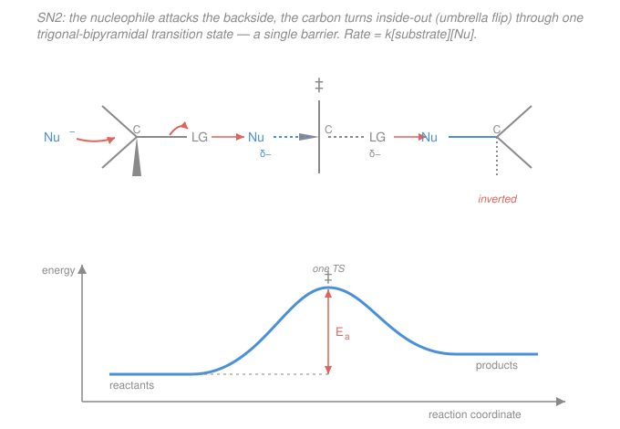

# Organic Chemistry · Lesson 2.2: Nucleophilic substitution — SN2

> ⏱ ~15 min · Module 2: Reactions I — Substitution, Elimination & Addition · Builds on: [2.1 Functional groups & the language of mechanisms](02-01-functional-groups-mechanisms-language.md) · Unlocks: [2.3 SN1 & carbocation rearrangements](02-03-sn1-carbocation-rearrangements.md)

## Why this matters

You already met the reaction in [2.1](02-01-functional-groups-mechanisms-language.md): a nucleophile attacks a $\delta+$ carbon while a leaving group departs. Now we ask *how* — the actual choreography, timing, and geometry of the electrons. The answer, **SN2**, is the cleanest, most predictable reaction in the whole course: one step, one rate law, one geometric consequence you can bank on every time. Master it and you can *design* a substitution — pick a substrate, a nucleophile, and a solvent that make it go fast — and you get a bonus: because SN2 flips the carbon inside-out, it's the standard lab tool for building a stereocenter of known handedness. It also sets up its rival, SN1 ([2.3](02-03-sn1-carbocation-rearrangements.md)), by contrast: same overall reaction, opposite mechanism in every detail.

## The idea

Picture a carbon wearing a leaving group (say $\ce{Br}$) on one side. That carbon is electron-poor and slightly exposed on the **back** — the side directly opposite the $\ce{C-Br}$ bond. A nucleophile, hunting for positive charge, comes straight up that backside and starts forming its bond *before* bromide has fully left. For a fleeting instant the carbon is bonded to **both** — half to the incoming nucleophile, half to the departing bromide — and the three other groups are squashed flat into a plane, like an umbrella caught mid-gust. Push a hair further and bromide is gone, the nucleophile is fully on, and the umbrella has snapped through to point the *other way*. The carbon has turned inside-out.

That's the entire mechanism: **one smooth motion, bond forming as bond breaks, no stopping in between.** Two consequences fall straight out. First, since both the nucleophile *and* the substrate have to be present and collide in that single step, doubling either one doubles the rate — the reaction is **second order**. Second, because the attack must come from the back, the carbon always ends up **inverted**, like an umbrella in the wind. Everything else in this lesson — why methyl carbons fly and tertiary carbons refuse, why solvent matters — is just "what helps or blocks that backside collision."

## The formal version

**SN2 = Substitution, Nucleophilic, Bimolecular.** One concerted (single-step) mechanism:

$$\ce{Nu^- + R-LG -> Nu-R + LG^-}$$

The nucleophile $\ce{Nu-}$ donates a lone pair to the electrophilic carbon from the side **opposite** the leaving group $\ce{LG}$; the $\ce{C-LG}$ bond breaks heterolytically ([2.1](02-01-functional-groups-mechanisms-language.md)) as the new $\ce{C-Nu}$ bond forms, both events in the *same* step, passing through a single **transition state** in which carbon is partially bonded to five groups (a **trigonal-bipyramidal** arrangement: the three spectator groups in a plane, $\ce{Nu}$ and $\ce{LG}$ on the axis). *In words: the nucleophile shoves in the back door exactly as the leaving group slips out the front — no intermediate, one push.*

**Kinetics — the "2" in SN2.** Because the one and only step needs both partners, the rate law is

$$\text{rate} = k[\text{substrate}][\text{Nu}].$$

*In words: the reaction is first order in each of the two reactants, second order overall — bimolecular.* Halve the nucleophile concentration and you halve the rate; this is the experimental fingerprint that told chemists there's a single collision-controlled step.

**Stereochemistry — Walden inversion.** Backside attack forces the three spectator groups to invert through the planar transition state, exactly like an umbrella flipping in the wind. So **an SN2 at a stereocenter always inverts the spatial configuration.** *In words: the product is the mirror-image arrangement of the starting carbon.* Careful: the $R/S$ *label* ([1.5](01-05-chirality-r-s-system.md)) may or may not change — that depends on the priorities of the new group versus the old — but the *physical* arrangement always flips. Inversion is the fact; a label flip is only a bookkeeping side effect.

**Three rate factors.** What makes an SN2 fast?

1. **Substrate (sterics).** The nucleophile needs a clear runway to the backside. Every alkyl group hung on the reacting carbon blocks it. So rate falls off hard with substitution:
$$\text{methyl} > 1^\circ > 2^\circ \ggg 3^\circ.$$
Tertiary ($3^\circ$) carbons are so hemmed in they essentially **do not do SN2** — there's no room for backside approach. *In words: the more crowded the carbon, the slower; tertiary is a brick wall.*
2. **Nucleophile.** A **stronger, smaller, less-hindered** nucleophile attacks faster (e.g. $\ce{HO-}$ beats $\ce{H2O}$; $\ce{CN-}$, $\ce{N3-}$, $\ce{I-}$ are all good). And the **solvent** tunes it: a **polar aprotic** solvent (DMSO, DMF, acetone — polar but with *no* $\ce{O-H}$/$\ce{N-H}$) solvates the cationic counter-ion but leaves the anionic nucleophile bare and reactive, speeding SN2; a **protic** solvent (water, alcohols) hydrogen-bonds a cage around the nucleophile and slows it. *In words: free the nucleophile and it strikes faster — aprotic solvents free it, protic solvents cage it.*
3. **Leaving group.** A **good leaving group** — a stable, weak-base anion ($\ce{I- > Br- > Cl-}$, or tosylate), the [2.1](02-01-functional-groups-mechanisms-language.md) $\mathrm{p}K_a$ logic — lowers the barrier because the $\ce{C-LG}$ bond is breaking in that same step.

Contrast the coming **SN1** ([2.3](02-03-sn1-carbocation-rearrangements.md)): *two* steps, leaving group departs *first* to make a carbocation, rate $= k[\text{substrate}]$ (nucleophile absent from the rate law), and — because the flat carbocation can be hit from either face — a *racemic* product instead of clean inversion. It also *prefers* $3^\circ$ (stable cation), the exact opposite of SN2's preference. Everything SN2 is, SN1 is the mirror of.

## Picture

## Worked examples

**Example 1 (mechanical — read off the rate law).** Cyanide attacks bromomethane: $\ce{CN- + CH3Br -> CH3CN + Br-}$. The mechanism is one step — $\ce{CN-}$ approaches the carbon opposite $\ce{Br}$, the $\ce{C-Br}$ bond breaks as the $\ce{C-CN}$ bond forms. The rate law is $\text{rate} = k[\ce{CH3Br}][\ce{CN-}]$. Now double $[\ce{CN-}]$: the rate **doubles**. Triple both concentrations: the rate goes up ninefold. That linear dependence on *each* reactant is what "bimolecular" means, and $\ce{CH3Br}$ (a methyl substrate, zero blocking groups) is about as fast as SN2 gets.

**Example 2 (why you'd care — stereochemistry as a tool).** SN2 lets you *set* a carbon's handedness on purpose. Take a single enantiomer of a $2^\circ$ alkyl bromide and treat it with azide $\ce{N3-}$ (a small, strong nucleophile). Backside attack guarantees the product azide is the **inverted** configuration — a *single*, known enantiomer, not a mixture. Chemists chain this: displace a leaving group with inversion, and you've walked a stereocenter from one handedness to the other with certainty. (Run the same substrate through SN1 instead and you'd get a racemic mess — the reason SN2 conditions are chosen when stereochemistry must be controlled.)

## Watch out

- **You might think a stronger nucleophile changes the *product's* stereochemistry.** It doesn't — nucleophile strength changes the *rate*, but the geometry (backside → inversion) is fixed by the mechanism, not the reagent.
- **You might expect the $R/S$ label to always flip.** Inversion of the *physical arrangement* is guaranteed; the label only flips if the incoming group holds the same CIP priority rank the leaving group did. New group with a different priority ordering can leave the letter unchanged even though the carbon truly inverted. Track the geometry, not the letter.
- **You might reach for a protic solvent because "it dissolves my salt."** It does, but water and alcohols hydrogen-bond a cage around the anionic nucleophile and *throttle* the SN2. For a fast SN2, want DMSO/DMF/acetone — polar enough to dissolve the salt, aprotic so the nucleophile stays bare.
- **You might try to force an SN2 on a tertiary substrate.** Don't — there's no backside room. A $3^\circ$ halide with a nucleophile goes SN1 or elimination ([2.3](02-03-sn1-carbocation-rearrangements.md), [2.4](02-04-elimination-e1-e2-choosing.md)), never a clean SN2.

## One-liner

> SN2 is one concerted backside push — rate $= k[\text{substrate}][\text{Nu}]$, always inverting the carbon like an umbrella in the wind, fastest on unhindered carbons (methyl $> 1^\circ > 2^\circ \ggg 3^\circ$) with a bare strong nucleophile and a good leaving group.

## Problems

**P1 (🟢)** Rank these four for SN2 reactivity with a given nucleophile, fastest to slowest, and justify in one line: $\ce{CH3Br}$ (bromomethane), 1-bromobutane, 2-bromobutane, 2-bromo-2-methylpropane (*tert*-butyl bromide).

**P2 (🟡)** Give the SN2 product, *including stereochemistry*, of $(S)$-2-bromobutane with $\ce{CN-}$. Show that inversion occurs and determine the product's $R/S$ label; explain why the letter behaves as it does.

**P3 (🔴)** You run an SN2 on the same $2^\circ$ alkyl bromide under different conditions. Predict the effect on rate (and rank where you can) of: (a) switching the solvent from ethanol (protic) to DMSO (polar aprotic); (b) using $\ce{Cl-}$ vs $\ce{I-}$ vs $\ce{H2O}$ as the nucleophile. Explain each.

Solutions

**P1** Fastest → slowest:
$$\ce{CH3Br} \;>\; \text{1-bromobutane}\;(1^\circ) \;>\; \text{2-bromobutane}\;(2^\circ) \;\ggg\; \text{2-bromo-2-methylpropane}\;(3^\circ,\ \approx 0).$$
SN2 needs an unobstructed backside approach, and each alkyl group on the reacting carbon blocks it. Bromomethane's carbon carries only hydrogens (no blocking) → fastest; 1-bromobutane is primary (one alkyl group on the C–Br carbon); 2-bromobutane is secondary (two); *tert*-butyl bromide is tertiary (three alkyl groups walling off the back) → effectively no SN2 at all. The trend is purely steric: methyl $> 1^\circ > 2^\circ \ggg 3^\circ$.

**P2** Product: $(R)$-2-methylbutanenitrile (i.e. $(R)$-2-cyanobutane), $\ce{CH3CH(CN)CH2CH3}$, formed with **inversion** at the stereocenter.

Mechanism: $\ce{CN-}$ attacks C2 from the side opposite $\ce{Br}$; the $\ce{C-Br}$ bond breaks as the $\ce{C-CN}$ bond forms (one step). Backside attack inverts the spatial arrangement of the three spectators ($\ce{CH3}$, $\ce{CH2CH3}$, $\ce{H}$).

Label bookkeeping ([1.5](01-05-chirality-r-s-system.md), CIP priorities):
- Starting $(S)$-2-bromobutane, C2 substituents ranked: $\ce{Br} > \ce{CH2CH3} > \ce{CH3} > \ce{H}$ → given as $S$.
- Product C2 substituents: the nitrile carbon of $\ce{CN}$ is bonded (by triple-bond duplication) to $(\text{N},\text{N},\text{N})$, which outranks the ethyl carbon's $(\text{C},\text{H},\text{H})$, so $\ce{CN} > \ce{CH2CH3} > \ce{CH3} > \ce{H}$.

The incoming group ($\ce{CN}$, priority 1) takes the *same* priority rank the leaving group ($\ce{Br}$, priority 1) held, and ranks 2–4 are unchanged. When the priority *ordering* is preserved like this, a physical inversion shows up as a **flipped descriptor**: $S \to R$. So the carbon truly inverted, and the letter flipped *because* the priority pattern happened to be preserved — had $\ce{CN}$ landed at a different rank, the same physical inversion could have left the letter as $S$. The inversion is the fact; the letter is the consequence.

**P3**

(a) **Ethanol → DMSO: large rate increase.** Ethanol is protic ($\ce{O-H}$): it hydrogen-bonds a solvent cage around the anionic nucleophile, lowering its energy and its reactivity — the nucleophile must shed that shell to attack. DMSO is polar aprotic: polar enough to dissolve the salt and solvate the cationic counter-ion, but with no $\ce{O-H}$/$\ce{N-H}$ to cage the anion. The nucleophile is left "naked" and far more reactive, so the SN2 speeds up — often by several orders of magnitude.

(b) **Nucleophile, in a protic solvent (ethanol):** $\ce{I- > Cl- \gg H2O}$.
- $\ce{I-}$ is large and polarizable — its loose electron cloud reaches out to carbon, and it's weakly caged by hydrogen bonding — so it's an excellent nucleophile.
- $\ce{Cl-}$ is smaller and harder, more tightly solvated in a protic solvent, so slower than $\ce{I-}$ here.
- $\ce{H2O}$ is **neutral** (no negative charge) and a weak nucleophile — much slower than either anion.

Note the twist that connects to (a): in a *polar aprotic* solvent the halide order can **invert** to $\ce{Cl- > I-}$, because without the H-bond cage nucleophilicity tracks basicity, and $\ce{Cl-}$ is the stronger base. Water stays the poorest of the three in either solvent (it's neutral). Two levers, then: solvent frees the nucleophile, and among anions polarizability vs. basicity decides the winner depending on which solvent you're in.

## Flashback

**From Lesson 1.5 ($R/S$ configuration):** Assign $R$ or $S$ to the stereocenter in $\ce{CH3CH(OH)CH2CH3}$ (butan-2-ol) whose C2 has this arrangement — $\ce{OH}$ and $\ce{CH2CH3}$ in the plane, $\ce{CH3}$ on a wedge (toward you), $\ce{H}$ on a dash (away). Work it from CIP priorities.

Solution

Rank C2's four groups by CIP priority (first point of difference):
- $\ce{OH}$: oxygen — highest, **priority 1**.
- $\ce{CH2CH3}$ (ethyl): first atom C, bonded to $(\text{C},\text{H},\text{H})$.
- $\ce{CH3}$ (methyl): first atom C, bonded to $(\text{H},\text{H},\text{H})$.
- Ethyl beats methyl at the second atom ($\text{C} > \text{H}$): ethyl is **priority 2**, methyl **priority 3**.
- $\ce{H}$: **priority 4** (lowest).

Lowest priority ($\ce{H}$) is on a dash — pointing *away* from you — which is exactly where you want it: read $1 \to 2 \to 3$ directly. Going $\ce{OH}\,(1) \to \ce{CH2CH3}\,(2) \to \ce{CH3}\,(3)$: $\ce{OH}$ and $\ce{CH2CH3}$ sit in the plane and $\ce{CH3}$ is on the wedge, and tracing that sequence turns **counterclockwise** → **$S$**.

So this is $(S)$-butan-2-ol. (Had $\ce{H}$ been on the wedge, toward you, you'd trace $1\to2\to3$ and then *reverse* the answer, since the lowest priority would be pointing the wrong way.)

## Connections

- **Backward:** SN2 *is* the two-curved-arrow, nucleophile-attacks-carbon-while-leaving-group-departs move from [2.1](02-01-functional-groups-mechanisms-language.md), now pinned down to one concerted step with a rate law and a geometry. The "good leaving group = weak base" ranking ([2.1](02-01-functional-groups-mechanisms-language.md), from the [1.3](01-03-acids-bases-organic.md) $\mathrm{p}K_a$ logic) is rate factor 3, and the inversion outcome only makes sense with the $R/S$ machinery of [1.5](01-05-chirality-r-s-system.md).
- **Forward:** [2.3 SN1](02-03-sn1-carbocation-rearrangements.md) is the point-by-point opposite (two steps, $\text{rate}=k[\text{substrate}]$, racemization, prefers $3^\circ$); [2.4 elimination](02-04-elimination-e1-e2-choosing.md) is the reaction that competes with substitution (E2 is SN2's bimolecular cousin, attacking a $\beta$-hydrogen instead of the carbon). The substrate/nucleophile/solvent decision tree you started here is finished in 2.4.
- **Sideways:** the "second order overall, first order in each reactant" rate law is the collision/kinetics reasoning of a bimolecular elementary step — the same rate-law logic used in physical chemistry (see the [physical-chemistry syllabus](../../physical-chemistry/syllabus.md)); and SN2 displacements with inversion are the workhorse for installing stereocenters in the multistep synthesis of [4.4](04-04-retrosynthetic-analysis-multistep-synthesis.md).
