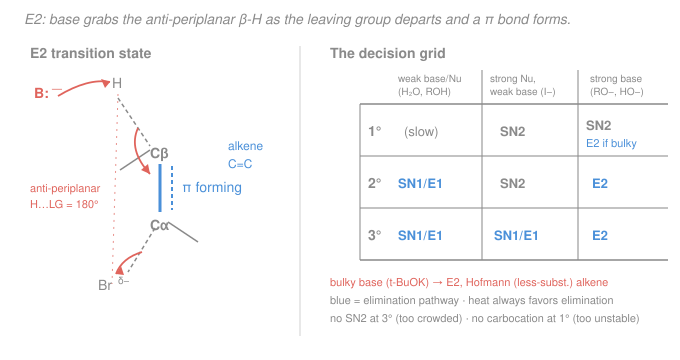

# Organic Chemistry · Lesson 2.4: Elimination (E1/E2) & choosing among the four

> ⏱ ~15 min · Module 2: Reactions I (Substitution, Elimination & Addition) · Builds on: [2.3 SN1 & carbocation rearrangements](02-03-sn1-carbocation-rearrangements.md), [2.2 Nucleophilic substitution: SN2](02-02-nucleophilic-substitution-sn2.md) · Unlocks: [2.5 Alkenes & electrophilic addition](02-05-alkenes-electrophilic-addition.md)

## Why this matters

Substitution swaps one group for another; **elimination** throws two groups away and builds a **π bond** in their place — it's how you *make* the alkenes that all of Module 2's second half runs on. But there's a catch that trips up every student: the same alkyl halide, the same flask, can undergo substitution *or* elimination, by a one-step *or* a two-step path, and which one wins is decided by a handful of knobs — substrate class, base strength, base bulk, temperature. This lesson gives you elimination's two mechanisms (E1, E2) and then the single most useful tool in intro organic: **a grid that tells you which of SN1/SN2/E1/E2 you get** from the reagents alone. Get this and half of a synthesis exam is bookkeeping.

## The idea

Picture an alkyl halide: a carbon holding a **leaving group** (call it the **α-carbon**), and next door a carbon holding at least one hydrogen (a **β-carbon**). Elimination is a tug-of-war. A base yanks a **β-hydrogen** off; the leaving group falls off the α-carbon; and the two electrons left behind on each side reach across and pair up into a new C=C **π bond**. Two things leave, one bond is born.

There are two ways to run the tug-of-war. In **E2** ("bimolecular elimination") it all happens in *one concerted motion* — base pulls the β-H at the very instant the leaving group departs, like a rope trick where both ends snap at once. Because everything moves together, the geometry has to be perfect: the β-H and the leaving group must be on *opposite sides*, lined up at 180° (**anti-periplanar**), so the emerging p-orbitals are already parallel and can overlap into a π bond.

In **E1** ("unimolecular elimination") the halide leaves *first*, all by itself, making a **carbocation** — the exact same slow, rate-limiting ionization you met in [SN1](02-03-sn1-carbocation-rearrangements.md). *Then* a base (often just the solvent) plucks a β-H off the cation to finish the alkene. Two steps, a real intermediate, no geometry requirement — and, being a carbocation, it can **rearrange** first.

When there's a choice of *which* β-H to remove, you usually get the **more substituted, more stable** alkene (**Zaitsev's rule**) — unless your base is too fat to reach the crowded interior, in which case it settles for the accessible edge and gives the **less substituted** alkene (**Hofmann**).

## The formal version

**E2 — concerted, one step.** Strong base $\ce{B-}$ removes a β-H as the leaving group $\ce{X}$ departs:

$$\ce{H-C_\beta-C_\alpha-X + B- -> C=C + BH + X-}$$

$$\text{rate} = k\,[\text{substrate}][\ce{B-}].$$

*In words: both the substrate and the base appear in the rate law — doubling either doubles the rate — because both are involved in the single, slow, rate-determining step.* The geometric price of doing it all at once: the β-H and $\ce{X}$ must be **anti-periplanar** (dihedral angle $180^\circ$). In a ring or a fixed conformer this means they must both be **axial** — a specific chair conformation (**trans-diaxial**) is often required, and if the molecule can't reach it, E2 simply won't run in that direction.

**E1 — stepwise, two steps.** Ionize, then deprotonate:

$$\ce{R-X ->[\text{slow}] R+ + X-} \qquad \ce{R+ + B ->[\text{fast}] alkene + BH+}$$

$$\text{rate} = k\,[\text{substrate}].$$

*In words: only the substrate appears in the rate law, because the slow step is the halide leaving on its own — the base comes in afterward and doesn't affect the rate.* The intermediate is a carbocation, so **stability order** ($3^\circ > 2^\circ > 1^\circ$) governs feasibility and **rearrangements** (hydride/alkyl shifts, from [2.3](02-03-sn1-carbocation-rearrangements.md)) can scramble the skeleton before the alkene forms.

**Regiochemistry — Zaitsev vs Hofmann.**

- **Zaitsev (default):** the **more-substituted** alkene predominates, because more alkyl groups on the C=C stabilize it (hyperconjugation). This is the major product for E1 and for E2 with small bases.
- **Hofmann (the exception):** a **bulky base** — potassium *tert*-butoxide $\ce{(CH3)3CO- K+}$ — can't fit to the interior β-H, so it removes an accessible terminal H and gives the **less-substituted** alkene.

**Stereochemistry — E2 sets E/Z.** Because the anti-periplanar requirement locks the geometry of the transition state, an internal E2 usually favors the more stable **E (trans)** alkene over **Z (cis)**.

**The decision grid — SN1 / SN2 / E1 / E2.** Read off the substrate class, then the reagent:

| Substrate | Weak base/Nu (H₂O, ROH) | Strong Nu, weak base (I⁻, N₃⁻, RS⁻) | Strong base (RO⁻, HO⁻) |
|---|---|---|---|
| **1°** | little reaction | **SN2** | **SN2** (bulky base → **E2**) |
| **2°** | **SN1 / E1** mix | **SN2** | **E2** |
| **3°** | **SN1 / E1** mix | **SN1 / E1** mix | **E2** |

Three anchors make the whole grid memorable: **no SN2 at 3°** (too crowded to attack from behind), **no carbocation at 1°** (too unstable — so no SN1/E1), and **strong bulky base ⇒ E2** at any class. Two modifiers: **heat favors elimination** (it breaks more bonds — entropically favored, the [Le Châtelier](../../general-chemistry/lessons/03-04-chemical-equilibrium-k-le-chatelier.md) logic of entropy), and a **bulky** strong base pushes the elimination toward Hofmann.

## Picture

## Worked examples

**Example 1 (mechanical — E2 anti-periplanar, and Zaitsev).** Treat **2-bromobutane**, $\ce{CH3-CHBr-CH2-CH3}$, with sodium ethoxide (small, strong base). The α-carbon is C2; two different β-positions bear H's: the terminal C1 methyl and the internal C3 methylene.

- Remove a C3 H → double bond between C2–C3 → **2-butene**, $\ce{CH3-CH=CH-CH3}$ (disubstituted).
- Remove a C1 H → double bond between C1–C2 → **1-butene**, $\ce{CH2=CH-CH2CH3}$ (monosubstituted).

Ethoxide is small, so **Zaitsev wins**: **2-butene** is major, and because E2 favors the anti-periplanar transition state, the **E (trans)** isomer dominates over Z. 1-Butene is the minor product.

**Example 2 (why you'd care — same substrate, one knob turned).** Repeat Example 1 but swap ethoxide for **potassium *tert*-butoxide**, $\ce{(CH3)3CO-}$. Nothing about the substrate changed — but the base is now a fat tripod that can't reach the crowded internal C3–H. It removes an accessible terminal C1–H instead, so **1-butene (Hofmann)** becomes the major product. Same molecule, opposite regiochemistry, decided entirely by base bulk. This is the lever synthetic chemists pull when they *want* the terminal alkene.

## Watch out

- **You might think E2 needs a carbocation.** It doesn't — E2 is concerted, with **no intermediate**, so it never rearranges. Only **E1** goes through a carbocation (and therefore can rearrange, exactly like SN1). If you see a skeletal rearrangement in an elimination product, the mechanism was E1.
- **You might think "strong base" always means Zaitsev.** Strength decides *E2 vs. the rest*; **bulk** decides *Zaitsev vs. Hofmann*. Ethoxide and *tert*-butoxide are both strong bases — but only the bulky one gives Hofmann.
- **You might ignore geometry in rings.** E2 demands anti-periplanar (β-H and LG both axial). In a substituted cyclohexane, the leaving group must sit **axial**, which can force a less-favorable chair and even dictate *which* alkene forms — sometimes the anti-periplanar H points only toward the Hofmann product, overriding Zaitsev.
- **You might forget that good nucleophile ≠ strong base.** Iodide and azide are excellent nucleophiles but weak bases → they push SN2, not E2. Hydroxide and alkoxide are both strong nucleophiles *and* strong bases → at 2°/3° their basicity wins and you get E2.

## One-liner

> Elimination trades a β-H and a leaving group for a π bond — concerted and geometry-fussy (E2) or via a carbocation (E1) — and the substrate-class × reagent grid, plus "bulky base ⇒ Hofmann, heat ⇒ elimination," tells you which of the four you get.

## Problems

**P1 (🟢)** Give the E2 products formed when **2-bromopentane**, $\ce{CH3-CHBr-CH2CH2CH3}$, reacts with sodium ethoxide. Identify the Zaitsev (major) alkene and note its favored E/Z geometry.

**P2 (🟡)** For **2-bromopentane** again, predict the *major* product with (a) sodium ethoxide and (b) potassium *tert*-butoxide, and explain the difference in one sentence.

**P3 (🔴, Boss-2 rehearsal)** Consider **2-bromo-2-methylbutane**, $\ce{(CH3)2CBr-CH2CH3}$. Using the decision grid, name the mechanism and give the major organic product for each: **(i)** sodium ethoxide in hot ethanol; **(ii)** warm ethanol alone (no added base).

Solutions

**P1** The α-carbon is C2. The two distinct β-positions are C1 (terminal methyl) and C3 (internal methylene):

- Remove a C3–H → C2=C3 → **2-pentene**, $\ce{CH3-CH=CH-CH2CH3}$ (disubstituted).
- Remove a C1–H → C1=C2 → **1-pentene**, $\ce{CH2=CH-CH2CH2CH3}$ (monosubstituted).

Ethoxide is a small strong base → **Zaitsev**: **2-pentene is major**, and E2's anti-periplanar transition state favors the more stable **(E)-2-pentene (trans)** over (Z). 1-Pentene is minor.

**P2** (a) Small ethoxide → **Zaitsev**, so **(E)-2-pentene** is major. (b) Bulky *tert*-butoxide can't reach the hindered internal β-H, so it removes a terminal C1–H → **1-pentene (Hofmann)** is major. *One-sentence reason: base strength keeps both reactions E2, but the bulky base is size-selected toward the accessible terminal hydrogen, flipping the regiochemistry from more- to less-substituted.*

**P3** The substrate is **tertiary** (C2 bears Br, two methyls, and an ethyl). On the grid, a 3° substrate gives **E2 with a strong base** and **SN1/E1 with a weak nucleophile in polar protic solvent**.

The three β-carbons on C2 are: the C3 methylene of the ethyl, and the two equivalent methyls (C1 and the 2-methyl). Removing a β-H gives either:

- from C3 → C2=C3 → **2-methyl-2-butene**, $\ce{(CH3)2C=CH-CH3}$ — **trisubstituted (Zaitsev)**;
- from a methyl → C2=CH₂ → **2-methyl-1-butene**, $\ce{CH2=C(CH3)-CH2CH3}$ — disubstituted (Hofmann).

**(i) Sodium ethoxide, hot ethanol:** strong (small) base + 3° + heat ⇒ **E2**. Zaitsev major: **2-methyl-2-butene**, with 2-methyl-1-butene minor.

$$\ce{(CH3)2CBr-CH2CH3 ->[\text{NaOEt}][\Delta,\ \text{EtOH}] (CH3)2C=CH-CH3}\ \text{(major)}$$

**(ii) Warm ethanol alone:** no strong base, weak nucleophile, polar protic, 3° ⇒ **SN1 / E1 mixture** (solvolysis). Ionize to the tertiary cation $\ce{(CH3)2C+-CH2CH3}$ (already tertiary — no rearrangement needed), then:

- **SN1:** ethanol attacks the cation → **2-ethoxy-2-methylbutane**, $\ce{(CH3)2C(OCH2CH3)-CH2CH3}$ (substitution product).
- **E1:** solvent removes a β-H → Zaitsev major **2-methyl-2-butene** (plus minor 2-methyl-1-butene).

So (ii) gives a mixture of the ether and the same alkenes; warming/heat tilts it toward the elimination (E1) alkenes.

## Flashback

**From Lesson 2.3 (SN1 & carbocation rearrangements):** Predict the major substitution product of the solvolysis of **3-chloro-2,2-dimethylbutane**, $\ce{(CH3)3C-CHCl-CH3}$, in methanol, and explain the rearrangement. (Fresh variant — a methyl shift, not the hydride shift you saw before.)

Solution

Methanol is a weak nucleophile / polar protic solvent, so this is **SN1** — ionize first. Loss of $\ce{Cl-}$ from C3 gives a **secondary** carbocation, $\ce{(CH3)3C-CH^+-CH3}$. Sitting right next door is a fully substituted (quaternary) carbon carrying three methyls — a **methyl group migrates** from that carbon to the cationic C3, because doing so converts the secondary cation into a more stable **tertiary** cation:

$$\ce{(CH3)3C-CH^+-CH3 ->[\text{CH3 shift}] (CH3)2C^+-CH(CH3)2}$$

The new tertiary cation is the 2,3-dimethyl-2-butyl cation. Methanol then attacks the tertiary carbon and loses a proton, giving the **rearranged** ether:

$$\ce{(CH3)2C(OCH3)-CH(CH3)2}$$

**2-methoxy-2,3-dimethylbutane**. The tell-tale sign of SN1 is exactly this: the substitution didn't happen at the original carbon — a skeletal rearrangement moved it, which only a free carbocation intermediate allows. (An SN2 in this position would be impossible anyway — the carbon is too hindered for backside attack.)

## Connections

- **Backward:** E1's rate-determining ionization *is* the SN1 slow step from [2.3](02-03-sn1-carbocation-rearrangements.md) — same carbocation, same stability order, same rearrangements; E1 just ends by losing a proton instead of trapping a nucleophile. E2's "strong base" concept leans on Brønsted basicity from [gen-chem acids & bases](../../general-chemistry/lessons/04-01-acids-bases-ph-strength.md), and Zaitsev's stability argument uses the hyperconjugation you'll see stabilize π systems throughout Module 2. SN2 vs. E2 at the same carbon is the nucleophile-vs-base distinction from [2.2](02-02-nucleophilic-substitution-sn2.md).
- **Forward:** the alkenes you just learned to *make* are the substrates of [2.5 Alkenes & electrophilic addition](02-05-alkenes-electrophilic-addition.md) — elimination and addition are microscopic reverses of each other, and Zaitsev/Markovnikov are the same "more-substituted-cation-wins" logic seen from opposite directions. The full four-way grid is the backbone of **Boss Problem 2**.
- **Sideways:** "heat favors elimination" is entropy driving an equilibrium toward more particles — the same [Le Châtelier / ΔS reasoning](../../general-chemistry/lessons/03-04-chemical-equilibrium-k-le-chatelier.md) from general chemistry, here deciding a reaction's product rather than a gas-phase yield.
