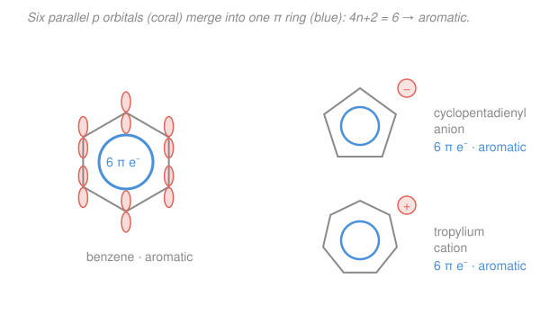

# Organic Chemistry I · Lesson 3.1: Aromaticity & Hückel's rule

> ⏱ ~15 min · Module 3: Reactions II — Aromatics, Carbonyls & Functional Groups · Builds on: [1.2 Resonance, formal charge & delocalization](01-02-resonance-formal-charge-delocalization.md), [1.1 Bonding, hybridization & molecular shape](01-01-bonding-hybridization-molecular-shape.md) · Unlocks: [3.2 Electrophilic aromatic substitution](03-02-electrophilic-aromatic-substitution.md)

## Why this matters

Benzene should be a sitting duck. It has three double bonds, and everything you learned in Module 2 says double bonds *add* — bromine, acids, water all pile on. Yet benzene shrugs off the reagents that devour ordinary alkenes; it would rather *swap* a hydrogen than break its ring (that's all of [3.2](03-02-electrophilic-aromatic-substitution.md)). The reason is **aromaticity** — a special, deep stabilization that a ring earns when its π electrons delocalize all the way around. Aromaticity explains why benzene is inert, why some C–H bonds are freakishly acidic, why certain ions are unusually happy, and why half of biochemistry (DNA bases, tryptophan, heme) is built on flat aromatic rings. Learn to *spot* it and count its electrons, and a huge swath of reactivity becomes predictable.

## The idea

Take [1.2](01-02-resonance-formal-charge-delocalization.md)'s idea — electrons spread over several atoms are lower in energy than electrons pinned in one place — and run it in a **loop**. In benzene, every one of the six carbons is $sp^2$ (from [1.1](01-01-bonding-hybridization-molecular-shape.md)), so every carbon has one leftover, unmixed $p$ orbital sticking straight up out of the flat ring. Line six parallel $p$ orbitals up in a circle and they all overlap edge-to-edge, side by side, with no starting point and no end. The six π electrons stop belonging to particular bonds and become a single **delocalized ring current** — a smeared-out donut of electron density above and below the plane. That's why benzene is drawn as a hexagon with a *circle* inside instead of three fixed double bonds: the double bonds aren't anywhere in particular, they're *everywhere*.

But — and this is the surprise Hückel discovered — looping the electrons around only *helps* if you have the **right number** of them. With 6 it's a huge win (benzene). With 4 it's actually a *disaster*: the ring becomes less stable than an open chain, and molecules will physically distort to escape it. The magic numbers are $2, 6, 10, 14, \dots$ — the counts that exactly fill the delocalized ring's low-energy orbitals. Everything in this lesson is: check whether a ring can delocalize, then count.

## The formal version

A molecule is **aromatic** when it meets **all four** criteria:

1. **Cyclic** — the π system forms a closed ring.
2. **Fully conjugated** — every atom in the ring carries a $p$ orbital in the π system (no $sp^3$ "breaks"). *In words: the loop of $p$ orbitals is unbroken.*
3. **Planar** — the ring is flat, so those $p$ orbitals are parallel and can actually overlap. *In words: a puckered ring can't share electrons all the way around.*
4. **Hückel's rule** — the ring holds $4n+2$ π electrons for some integer $n = 0, 1, 2, \dots$, i.e. $2, 6, 10, 14, \dots$

*In words: an unbroken, flat loop of $p$ orbitals with a "magic" electron count is aromatic — extra-stable, low-energy, and reluctant to react.*

**Benzene** is the archetype: cyclic, six $sp^2$ carbons (fully conjugated), planar, $6$ π electrons ($n = 1$). Its **resonance (delocalization) energy** — how much lower it sits than a hypothetical benzene with three isolated double bonds — is about $150\ \mathrm{kJ/mol}$. That stabilization is exactly why it resists addition: adding across one "double bond" would cost the whole aromatic system.

**Antiaromatic.** A ring that is cyclic, conjugated, and planar but has $4n$ π electrons ($4, 8, \dots$) is **antiaromatic** — it is *destabilized*, higher in energy than the open chain. **Cyclobutadiene** ($4$ π electrons, $n = 1$ in $4n$) is the poster child. Nature refuses this: such rings escape by **puckering out of planarity**, breaking criterion 3 so they become merely **non-aromatic** (neither stabilized nor destabilized) — e.g. cyclooctatetraene tub-shapes itself with isolated double bonds.

**Counting π electrons.** Only electrons *in the ring's π system* count:

- each double bond in the ring contributes **2** (its π electrons);
- a **lone pair counts only if** it sits in a $p$ orbital that is part of the ring loop (as with a negative charge on a ring carbon, or certain heteroatom lone pairs);
- an **empty $p$ orbital** in the ring (a positive charge) contributes **0** but still keeps the loop conjugated.

**Aromatic ions.** Charges let a ring *reach* a magic number:

- **Cyclopentadienyl anion** ($\ce{C5H5-}$): a five-membered ring with two double bonds ($4$ π e⁻) plus a carbon bearing a lone pair in a $p$ orbital ($+2$) $= 6$ π electrons, $n=1$ → **aromatic**. This is why cyclopentadiene's $\ce{CH2}$ proton is so acidic (Problem 2).
- **Tropylium (cycloheptatrienyl) cation** ($\ce{C7H7+}$): a seven-membered ring with three double bonds ($6$ π e⁻) and one carbon bearing an *empty* $p$ orbital (the $+$ charge, contributing $0$) $= 6$ π electrons → **aromatic**, which is why this cation is unusually stable and easy to form.

**Heterocycles** (rings with N, O, S). The trap is the heteroatom's lone pair — sometimes it's in the ring, sometimes not:

- **Pyridine** ($\ce{C5H5N}$): a benzene-like ring where one CH is replaced by N. The three ring double bonds give $6$ π electrons. Nitrogen's lone pair sits in an $sp^2$ orbital **in the plane of the ring**, pointing *outward* — it is *not* part of the π system, so it doesn't count. Still aromatic ($6$ π e⁻), and that available in-plane lone pair makes pyridine a base.
- **Pyrrole** ($\ce{C4H5N}$): a five-membered ring with two double bonds ($4$ π e⁻). Here nitrogen's lone pair sits **in a $p$ orbital that is part of the ring**, donating $2$ more → $6$ π electrons, aromatic. Because that lone pair is committed to the ring, pyrrole's N is a poor base.

*In words: same nitrogen, two different homes for its lone pair — in pyridine it points out of the ring (not counted), in pyrrole it lies in the ring (counted). Where the lone pair lives decides both the electron count and the chemistry.*

## Picture

## Worked examples

**Example 1 (mechanical — run the checklist).** Is **furan** aromatic? Furan is a five-membered ring: an oxygen plus four carbons, with two C=C double bonds. Check the four criteria. Cyclic ✓. Planar ✓ (flat five-membered ring). Fully conjugated? The two C=C's give each of those four carbons a $p$ orbital; the oxygen is $sp^2$ and contributes a $p$ orbital holding one lone pair — so the loop is unbroken ✓. Count: two double bonds $= 4$ π e⁻, plus oxygen's in-ring lone pair $= 2$, total **6** π electrons $= 4n+2$ with $n=1$ ✓. All four criteria met → **furan is aromatic**. (Oxygen still has a *second* lone pair, but it sits in an $sp^2$ orbital in the plane and does not count — only the $p$-orbital pair joins the ring.)

**Example 2 (why you'd care — the size test).** Should you expect **cyclooctatetraene** ($\ce{C8H8}$, an eight-membered ring with four alternating double bonds) to be aromatic like a "big benzene"? Count naïvely: four double bonds $= 8$ π electrons. Eight is $4n$ ($n=2$), the *antiaromatic* count — so a **planar** cyclooctatetraene would be destabilized. Molecules avoid that fate: cyclooctatetraene puckers into a non-planar **tub shape**, breaking criterion 3. Its $p$ orbitals no longer all align, the double bonds localize like an ordinary polyene, and it behaves as an unremarkable **non-aromatic** alkene (it *adds* $\ce{Br2}$ readily, unlike benzene). The lesson: more double bonds is not "more aromatic" — only $4n+2$ counts win, and rings will distort to dodge the $4n$ trap.

## Watch out

- **You might count every lone pair.** A lone pair counts *only* if it lives in a $p$ orbital that is part of the ring loop. Pyridine's nitrogen lone pair (in-plane $sp^2$) does **not** count; pyrrole's (in a ring $p$ orbital) **does**. Draw the orbital before you add.
- **You might think $4n$ rings are just "a bit less stable."** Antiaromatic is *actively destabilized* — worse than not delocalizing at all — which is why such rings pucker to become non-aromatic instead. "Non-aromatic" (no special effect) and "antiaromatic" (a penalty you flee) are different verdicts.
- **You might treat benzene like three alkenes.** Its $150\ \mathrm{kJ/mol}$ of delocalization means it *substitutes* rather than *adds* — the exact opposite of the electrophilic addition you learned for alkenes in [2.5](02-05-alkenes-electrophilic-addition.md). Aromaticity flips the reactivity.

## One-liner

> A flat, fully conjugated ring with $4n+2$ π electrons is aromatic and extra-stable; the same ring with $4n$ is antiaromatic and will pucker to escape it.

## Problems

**P1 (🟢)** Classify each as **aromatic**, **antiaromatic**, or **non-aromatic**, stating which criteria decide it: (a) benzene, (b) cyclobutadiene (planar, square), (c) cyclooctatetraene (tub-shaped), (d) pyridine.

**P2 (🟡)** Cyclopentadiene (the neutral molecule: a five-membered ring with two double bonds and one $\ce{CH2}$ group) has an unusually acidic $\ce{CH2}$ proton, $\mathrm{p}K_a \approx 16$ — comparable to water, and far more acidic than an ordinary alkane C–H ($\mathrm{p}K_a \approx 50$). Explain why, using acidity-via-anion-stability reasoning.

**P3 (🔴)** Both pyrrole and pyridine are aromatic six-π-electron rings containing nitrogen. Explain where each nitrogen's lone pair resides, why both still reach 6 π electrons, and predict which molecule is the stronger base.

Solutions

**P1**
- **(a) Benzene — aromatic.** Cyclic, planar, every carbon $sp^2$ (fully conjugated), $6$ π e⁻ $= 4n+2$ ($n=1$). All four criteria met.
- **(b) Cyclobutadiene (planar) — antiaromatic.** Cyclic, planar, fully conjugated (two double bonds, each carbon has a $p$ orbital), but $4$ π e⁻ $= 4n$ ($n=1$). Conjugated + planar + $4n$ is the antiaromatic verdict — it is *destabilized*. (In reality it's so unstable it distorts to a rectangle with localized bonds and exists only fleetingly.)
- **(c) Cyclooctatetraene (tub-shaped) — non-aromatic.** It *would* have $8$ π e⁻ $= 4n$ if planar (antiaromatic), so it puckers into a tub. Non-planar breaks criterion 3: the $p$ orbitals no longer overlap around the ring, the double bonds localize, and it's simply a non-aromatic polyene.
- **(d) Pyridine — aromatic.** Cyclic, planar, fully conjugated (three ring double bonds; N is $sp^2$ with a $p$ orbital in the π system). Count: three double bonds $= 6$ π e⁻ $= 4n+2$. Nitrogen's lone pair is in an in-plane $sp^2$ orbital and does *not* count — the double bonds alone hit 6.

**P2** Acidity is about the *stability of the conjugate base* — the more stable the anion left behind, the more willing the acid is to give up its proton (the equilibrium/pKa logic from acids–bases). Removing one $\ce{CH2}$ proton from cyclopentadiene turns that $sp^3$ carbon into an $sp^2$ carbon bearing a lone pair in a $p$ orbital. Now *every* ring atom has a $p$ orbital, the loop is complete and planar, and the electron count is: two original double bonds ($4$) + the new lone pair in its $p$ orbital ($2$) $= 6$ π electrons $= 4n+2$. The conjugate base is the **aromatic cyclopentadienyl anion** — exceptionally stabilized (delocalized over all five carbons, the negative charge shared equally). Because deprotonation is rewarded with full aromatic stabilization, the C–H is far more acidic ($\mathrm{p}K_a \approx 16$) than any ordinary alkane C–H, whose anion gets no such prize. *In short: you're not just making a carbanion, you're making an aromatic ring — and the molecule "wants" to.*

**P3** Both rings need $6$ π electrons to be aromatic, but they build that count differently:
- **Pyridine** is a six-membered ring with three C=C/C=N double bonds. Those three double bonds already supply all $6$ π electrons. Nitrogen is $sp^2$; its lone pair occupies the remaining $sp^2$ hybrid **in the plane of the ring, pointing outward**, *not* in the π system. That in-plane lone pair is free and available → pyridine is a **good base** (it protonates on N without disturbing aromaticity).
- **Pyrrole** is a five-membered ring with only two C=C double bonds, giving just $4$ π electrons — not enough. To reach 6, nitrogen must donate its lone pair **into a $p$ orbital that is part of the ring**, adding $2$ (total $6$, aromatic). That lone pair is now *tied up* in the aromatic system.
- **Stronger base: pyridine.** Its lone pair is available to grab a proton. Pyrrole's lone pair is committed to maintaining aromaticity; protonating on N (or removing that pair from the ring) would cost the aromatic stabilization, so pyrrole is a very weak base. *Same atom, opposite behavior, entirely because of where the lone pair lives.*

## Flashback

**From Lesson 1.2 (Resonance & delocalization):** Draw the two major resonance structures of the **acetate ion**, $\ce{CH3COO-}$ (formed by removing the O–H proton from acetic acid). Are the two C–O bonds different lengths in the real ion? Explain using the resonance/delocalization picture.

Solution

Acetate has the negative charge and a C=O double bond that can be drawn two equivalent ways — the double bond on either oxygen, with the negative charge on the other:

$$\ce{CH3-C(=O)-O^{-} <-> CH3-C(-O^{-})=O}$$

Curved arrows: the π electrons of the C=O shift onto that oxygen (making it the negative one), while the lone pair on the originally-negative oxygen forms the new C=O. The two structures are **equivalent** (same atoms, same energy), so the true ion is their equal average: each C–O bond has bond order $1.5$ and carries $-\tfrac12$ charge. Therefore the two C–O bonds are **identical in length** — intermediate between a single and a double bond — exactly as measured. This is the same delocalization principle that stabilizes aromatic rings in this lesson: spreading charge/electrons over several atoms lowers the energy, and here it's *why* carboxylic acids are acidic — the anion is resonance-stabilized. (In aromatics we simply run that delocalization all the way around a ring.)

## Connections

- **Backward:** aromaticity is [1.2](01-02-resonance-formal-charge-delocalization.md)'s resonance/delocalization taken around a closed loop, using the leftover $sp^2$ $p$ orbitals from [1.1](01-01-bonding-hybridization-molecular-shape.md). The acidity argument in Problem 2 is the anion-stability reasoning from [1.3 Acids & bases in organic chemistry](01-03-acids-bases-organic.md) — stabilize the conjugate base and the proton leaves more easily.
- **Forward:** [3.2 Electrophilic aromatic substitution](03-02-electrophilic-aromatic-substitution.md) is the payoff — because benzene guards its $150\ \mathrm{kJ/mol}$ of aromatic stability, it reacts by *substituting* a hydrogen (restoring the ring) rather than *adding* across it like the alkenes of [2.5](02-05-alkenes-electrophilic-addition.md).
- **Sideways:** aromatic rings are everywhere in later chemistry and biology — the nitrogen bases of DNA, the amino acids phenylalanine and tryptophan, and heme's porphyrin are all aromatic heterocycles (see the [biochemistry syllabus](../../biochemistry/syllabus.md)). The $4n+2$ orbital-filling pattern itself comes from the particle-on-a-ring model in [quantum mechanics](../../quantum-mechanics/syllabus.md).
