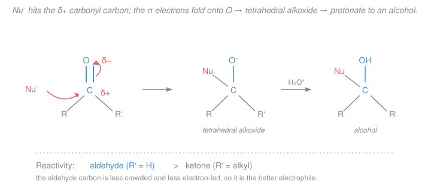

# Organic Chemistry · Lesson 3.3: Aldehydes & ketones: nucleophilic addition

> ⏱ ~15 min · Module 3: Reactions II (Aromatics, Carbonyls & Functional Groups) · Builds on: [2.1 Functional groups & the language of mechanisms](02-01-functional-groups-mechanisms-language.md), [1.2 Resonance & delocalization](01-02-resonance-formal-charge-delocalization.md) · Unlocks: [3.4 Carboxylic acids & acyl substitution](03-04-carboxylic-acids-derivatives-acyl-substitution.md)

## Why this matters

The carbonyl group, a carbon double-bonded to oxygen ($\ce{C=O}$), is the single most important functional group in organic chemistry — it sits at the heart of sugars, fats, proteins, drugs, and half the reactions you'll ever run. Learn *one* pattern here, **nucleophilic addition to the carbonyl carbon**, and you unlock reductions, the great carbon–carbon bond-forming reactions (Grignard), the acetal protecting groups synthesists lean on, and the imines that biochemistry uses to hang molecules together. Everything downstream — carboxylic acids and their derivatives ([3.4](03-04-carboxylic-acids-derivatives-acyl-substitution.md)), enolate chemistry ([3.5](03-05-enols-enolates-alpha-carbon.md)) — is a variation on the mechanism you're about to see.

## The idea

Picture the $\ce{C=O}$ bond as a tug-of-war that oxygen wins. Oxygen is far more electronegative than carbon, so it hogs the shared electrons: the carbon end goes electron-poor (**partial positive**, $\delta+$) and the oxygen end goes electron-rich (**partial negative**, $\delta-$). This is the resonance/polarity thinking from [1.2](01-02-resonance-formal-charge-delocalization.md) — one resonance form is literally $\ce{C+}$–$\ce{O-}$, so the carbon *is* a lurking cation.

A $\delta+$ carbon is an **electrophile** — an electron-hungry site (the vocabulary from [2.1](02-01-functional-groups-mechanisms-language.md)). So any **nucleophile** (electron-rich, electron-*giving* species) is drawn to it. The nucleophile attacks the carbon; to make room, the two $\pi$ electrons of the double bond slide up onto oxygen, which is happy to hold a negative charge. What used to be a flat, three-groups carbon becomes a **tetrahedral** carbon with four single bonds and a negatively charged oxygen hanging off it — an **alkoxide**. Grab a proton for that oxygen and you have an alcohol.

That's the whole story: *the nucleophile adds, the double bond opens, you get a tetrahedral intermediate.* The only thing that changes from reaction to reaction is **which nucleophile** shows up — and the nucleophile decides the final product.

## The formal version

**The carbonyl.** A carbonyl carbon is $sp^2$-hybridized (flat, bond angles near $120^\circ$), double-bonded to oxygen. The bond is polarized:

$$\ce{R2C^{\delta+}=O^{\delta-}} \quad\longleftrightarrow\quad \ce{R2C+ - O-}$$

*In words: the carbon is the electrophilic hotspot, oxygen the electron sink* — exactly the two resonance contributors of [1.2](01-02-resonance-formal-charge-delocalization.md), with the charge-separated form telling you where a nucleophile will strike.

An **aldehyde** has at least one $\ce{H}$ on the carbonyl carbon ($\ce{RCHO}$); a **ketone** has two carbons ($\ce{R2CO}$).

**The general mechanism (base/neutral conditions).** A nucleophile $\ce{Nu-}$ donates a lone pair to the carbonyl carbon; the $\pi$ electrons become an oxygen lone pair:

$$\ce{R2C=O + Nu- -> R2C(Nu)-O-} \qquad \xrightarrow{\ \ce{H2O}\ / \ \ce{H3O+}\ } \qquad \ce{R2C(Nu)-OH}$$

*In words: nucleophile in, $\pi$ bond up onto oxygen, giving a tetrahedral alkoxide; a proton workup turns the alkoxide into an alcohol.* This is one curved arrow from $\ce{Nu-}$ to carbon and one from the $\ce{C=O}$ $\pi$ bond to O — the arrow bookkeeping of [2.1](02-01-functional-groups-mechanisms-language.md).

**Acid catalysis (an alternate on-ramp).** When the nucleophile is weak (water, an alcohol), you protonate the oxygen *first*:

$$\ce{R2C=O + H+ <=> R2C=O^{+}H} \quad(\equiv\ \ce{R2C+ - OH})$$

*In words: protonating oxygen makes the carbon even more positive — a stronger electrophile — so even a lazy nucleophile will attack.* You trade "strong nucleophile" for "supercharged electrophile."

**Reactivity: aldehydes > ketones.** Two reasons, both pushing the same way:

- **Sterics:** the tetrahedral intermediate is more crowded than the flat carbonyl. A ketone's two alkyl groups make that crowding worse, so it forms less readily. An aldehyde's lone $\ce{H}$ is small.
- **Electronics:** alkyl groups are weakly electron-*donating*, so a ketone's two of them partly quench the carbon's $\delta+$. An aldehyde has only one, leaving its carbon hungrier.

*In words: an aldehyde's carbonyl carbon is less crowded and more electron-poor, making it the better electrophile.*

## Picture

## Worked examples

**Example 1 (the reagent decides the fate).** Run through the classic nucleophiles for the *same* carbonyl and watch how only the identity of $\ce{Nu}$ changes:

| Reagent | Nucleophile delivered | Product |
|---|---|---|
| $\ce{NaBH4}$ or $\ce{LiAlH4}$ | hydride, $\ce{H-}$ | alcohol (**reduction**) |
| $\ce{RMgX}$ (Grignard) / $\ce{RLi}$ | carbanion, $\ce{R-}$ | alcohol with a **new C–C bond** |
| $\ce{H2O}$ | $\ce{H2O}$ / $\ce{OH-}$ | hydrate (gem-diol) |
| $\ce{R'OH}$ (acid cat.) | alcohol | hemiacetal → **acetal** |
| $\ce{HCN}$ | cyanide, $\ce{CN-}$ | cyanohydrin |
| $\ce{R'NH2}$ (1° amine) | nitrogen | **imine** (C=N) |
| $\ce{R'2NH}$ (2° amine) | nitrogen | **enamine** (C=C–N) |

Every row shares the first step — $\ce{Nu}$ hits the tetrahedral intermediate — and then diverges. Two rows are worth seeing in full:

*Hydride reduction.* $\ce{NaBH4}$ hands off $\ce{H-}$ to the carbonyl carbon; the alkoxide is protonated on workup. Acetaldehyde $\ce{CH3CHO}$ becomes ethanol:

$$\ce{CH3CHO ->[\text{1. NaBH4}][\text{2. H3O+}] CH3CH2OH}$$

An aldehyde gives a **primary** alcohol; a ketone gives a **secondary** alcohol.

*Grignard — building a carbon skeleton.* A Grignard reagent $\ce{R-MgX}$ is effectively a carbanion $\ce{R-}$, a powerful nucleophile that forges a **new carbon–carbon bond** — this is *the* workhorse for growing a molecule. Formaldehyde plus $\ce{CH3MgBr}$:

$$\ce{CH2O ->[\text{1. CH3MgBr}][\text{2. H3O+}] CH3CH2OH}$$

Note the counting: the new alcohol carbon carries the incoming $\ce{R}$ group. Formaldehyde → primary alcohol; any other aldehyde → secondary; a ketone → tertiary.

**Example 2 (acetals — a reversible padlock).** With two equivalents of alcohol and an acid catalyst, an aldehyde adds one alcohol to make a **hemiacetal** ($\ce{C}$ bearing both $\ce{OH}$ and $\ce{OR}$), then — protonate the $\ce{OH}$, lose water, and add the *second* alcohol — a full **acetal** ($\ce{C}$ bearing two $\ce{OR}$ groups):

$$\ce{RCHO + 2 R'OH <=>[\ce{H+}] RCH(OR')2 + H2O}$$

The whole thing is an **equilibrium** (note the $\ce{<=>}$): dilute acid + excess alcohol drives it toward the acetal; aqueous acid drives it back to the aldehyde. That reversibility is the point — an acetal is a **protecting group**. Because acetals are inert to bases, nucleophiles, and hydrides, you cap a sensitive carbonyl as an acetal, do chemistry elsewhere, then hydrolyze it back. You'll wield this deliberately in synthesis ([4.4](04-04-retrosynthetic-analysis-multistep-synthesis.md)). This is [gen-chem's Le Chatelier equilibrium](../../general-chemistry/lessons/03-04-chemical-equilibrium-k-le-chatelier.md) put to work: shift the position by controlling water.

## Watch out

- **You might think a stronger acid always speeds a carbonyl addition.** Acid *catalysis* helps *weak* nucleophiles (water, alcohols) by activating the electrophile — but strong nucleophiles like $\ce{H-}$ (from $\ce{LiAlH4}$) or $\ce{R-}$ (Grignard) are *destroyed* by acid (they'd just grab a proton). Never mix a Grignard with anything protic; that's why the proton workup is a *separate second step*.
- **You might expect a ketone to out-react an aldehyde because it "has more carbons."** Backwards: those extra carbons *hinder* it, both sterically and electronically. Aldehyde > ketone, always.
- **Imine vs enamine is decided by the amine, not the carbonyl.** A **primary** amine ($\ce{RNH2}$) still has an $\ce{N-H}$ after addition, so the nitrogen forms a double bond to carbon — an **imine** ($\ce{C=N}$). A **secondary** amine ($\ce{R2NH}$) has no $\ce{N-H}$ left to lose, so the molecule dehydrates *into the adjacent carbon* instead, giving a C=C next to nitrogen — an **enamine**. Count the N–H's.

## One-liner

> Every aldehyde/ketone reaction starts the same way — a nucleophile hits the $\delta+$ carbon and the $\pi$ bond folds onto oxygen to give a tetrahedral intermediate — and the nucleophile you choose (hydride, $\ce{R-}$, alcohol, amine…) decides the product.

## Problems

**P1 (🟢)** Give the organic product of each reaction, name the alcohol, and for the Grignard state where the new C–C bond forms.
(a) Propanal, $\ce{CH3CH2CHO}$, treated with $\ce{NaBH4}$ then $\ce{H3O+}$.
(b) Acetone, $\ce{(CH3)2CO}$, treated with $\ce{CH3MgBr}$ then $\ce{H3O+}$.

**P2 (🟡)** Ethanal (acetaldehyde), $\ce{CH3CHO}$, is treated with 2 equivalents of methanol ($\ce{CH3OH}$) and a trace of acid. Draw/describe the acetal product, and explain in one line why a chemist would deliberately make it before running a reaction elsewhere in the molecule.

**P3 (🔴)** Predict the product and push the mechanism (through the tetrahedral/carbinolamine intermediate to the final species) for:
(a) benzaldehyde $\ce{C6H5CHO}$ + methylamine $\ce{CH3NH2}$ (a 1° amine);
(b) cyclohexanone + dimethylamine $\ce{(CH3)2NH}$ (a 2° amine).
Say why the two nitrogen nucleophiles give *different classes* of product.

Solutions

**P1**
(a) Hydride ($\ce{H-}$) adds to the carbonyl carbon; workup protonates the alkoxide. Propanal (an aldehyde) → a **primary** alcohol, **1-propanol** $\ce{CH3CH2CH2OH}$. (The $\ce{C=O}$ became $\ce{CH-OH}$; here that carbon gains an H and an OH.)

$$\ce{CH3CH2CHO ->[\text{1. NaBH4}][\text{2. H3O+}] CH3CH2CH2OH}$$

(b) The Grignard delivers a $\ce{CH3-}$ carbanion to acetone's carbonyl carbon, forming a **new C–C bond** between that carbon and the incoming methyl. Acetone (a ketone) → a **tertiary** alcohol, **2-methyl-2-propanol** (tert-butanol), $\ce{(CH3)3COH}$. The carbonyl carbon, already bearing two $\ce{CH3}$ groups, picks up a third $\ce{CH3}$ (the new C–C bond) and an $\ce{OH}$.

$$\ce{(CH3)2CO ->[\text{1. CH3MgBr}][\text{2. H3O+}] (CH3)3COH}$$

**P2** Acetaldehyde + 2 $\ce{CH3OH}$ (acid cat.) → the **dimethyl acetal**, $\ce{CH3CH(OCH3)2}$ (1,1-dimethoxyethane), plus water. Path: protonate O, methanol adds → hemiacetal $\ce{CH3CH(OH)(OCH3)}$; protonate that $\ce{OH}$, lose $\ce{H2O}$ to give an oxocarbenium ion, second methanol adds and loses $\ce{H+}$ → acetal. Why make it: the acetal is **inert to bases, nucleophiles, and hydride reagents** and the reaction is **reversible**, so it serves as a **protecting group** — cap the carbonyl as an acetal, do chemistry elsewhere (e.g. a Grignard that would otherwise attack the carbonyl), then hydrolyze the acetal back to the aldehyde with aqueous acid.

**P3** Both start identically: the amine nitrogen (nucleophile) attacks the $\delta+$ carbonyl carbon, the $\pi$ electrons go onto oxygen → a tetrahedral **carbinolamine** intermediate ($\ce{C}$ bearing both $\ce{OH}$ and $\ce{NR_x}$), after a proton shuffle. The paths then split on how many $\ce{N-H}$ bonds remain.

(a) Benzaldehyde + $\ce{CH3NH2}$ (1° amine): the carbinolamine $\ce{C6H5CH(OH)(NHCH3)}$ still has an $\ce{N-H}$. Protonate the $\ce{OH}$, eliminate water, and the nitrogen forms a **C=N double bond**, losing its remaining proton → an **imine** (Schiff base), $\ce{C6H5CH=NCH3}$.

$$\ce{C6H5CHO + CH3NH2 <=>[\ce{H+}] C6H5CH=NCH3 + H2O}$$

(b) Cyclohexanone + $\ce{(CH3)2NH}$ (2° amine): the carbinolamine has **no $\ce{N-H}$ left** to make a C=N. So after losing water from the (protonated) $\ce{OH}$, the molecule instead removes a proton from the **neighboring (α) carbon**, forming a $\ce{C=C}$ adjacent to nitrogen → an **enamine** (1-(N,N-dimethylamino)cyclohexene).

Why different classes: an imine needs the nitrogen to shed an $\ce{H}$ as it double-bonds to carbon — only a **primary** amine has that spare $\ce{N-H}$. A **secondary** amine cannot, so dehydration is forced toward the α-carbon, yielding an enamine. (A tertiary amine, with no $\ce{N-H}$ at all, can't even complete addition to a stable neutral product.)

## Flashback

**From Lesson 1.2 (Resonance & delocalization):** Draw the two resonance structures of a carbonyl group $\ce{R2C=O}$ and, using formal charges, explain which structure tells you *where* a nucleophile attacks and why.

Solution

The two contributors are the neutral double-bonded form and a charge-separated form in which one $\pi$ pair has shifted entirely onto oxygen:

$$\ce{R2C=O} \quad\longleftrightarrow\quad \ce{R2C+ - O-}$$

Formal charges: in the left form every atom is neutral. In the right form, carbon has only three bonds and no lone pair (formal charge $+1$), oxygen has three lone pairs and one bond (formal charge $-1$). The neutral form is the major contributor (all octets satisfied, no charge separation), but the minor charge-separated form is the informative one: it shows the carbon carrying **positive** character and oxygen **negative** character. A nucleophile — electron-rich — is attracted to positive charge, so it attacks the **carbon**, exactly the $\delta+$ site the resonance predicts. (This is the same "map the charge, then predict the attack" reasoning you'll reuse for every electrophile.)

## Connections

- **Backward:** the carbonyl's electrophilic carbon *is* [1.2](01-02-resonance-formal-charge-delocalization.md)'s charge-separated resonance form made physical, and the whole mechanism is written in the nucleophile/electrophile + curved-arrow language of [2.1](02-01-functional-groups-mechanisms-language.md). Acetal formation runs on [gen-chem's Le Chatelier equilibrium](../../general-chemistry/lessons/03-04-chemical-equilibrium-k-le-chatelier.md).
- **Forward:** [3.4](03-04-carboxylic-acids-derivatives-acyl-substitution.md) takes the *same* tetrahedral intermediate but adds a leaving group on the carbonyl carbon — so instead of stopping at addition, the intermediate collapses and kicks the leaving group out (nucleophilic acyl **substitution**). [3.5](03-05-enols-enolates-alpha-carbon.md) turns the α-carbon (the enamine's dehydration site here) into a nucleophile of its own. Acetal protecting groups return in [4.4](04-04-retrosynthetic-analysis-multistep-synthesis.md).
- **Sideways (biochemistry):** imine (Schiff-base) formation is how enzymes tether substrates and cofactors — the same $\ce{C=N}$ you just made appears throughout [biochemistry](../../biochemistry/syllabus.md), and the sugar chemistry of hemiacetals is why glucose exists mostly as a ring.
